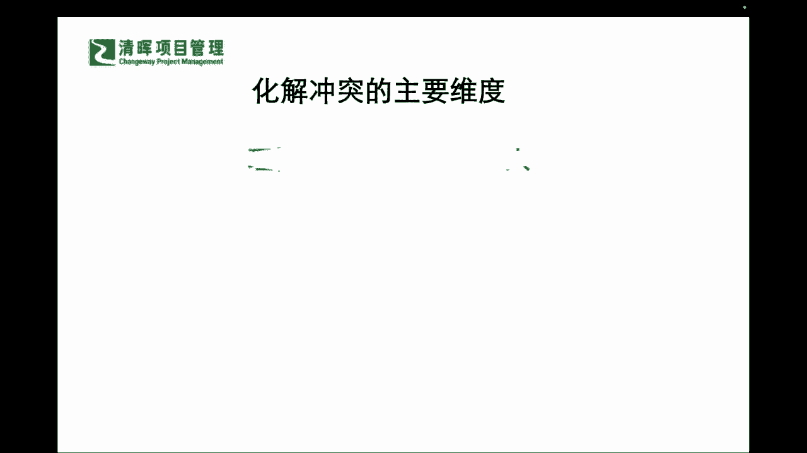

# 不妥协的谈判 - P2：2、化解冲突的3个主要维度 - 清晖Amy - BV1HVHXehEwP

那知道情绪化不好，那咋来化解冲突嘞，在我们这本书里面啊，他就用一个非常非常经典的三人理论啊，三人啊，人人这个人群的人，三人理论来去给大家解决这个问题是吧，那也就是分成了三个维度啊。

第一个维度叫做理性人啊，第二个维度叫做感性人，第三个维度叫做身份人是吧，叫做身份人，那么问题来了，啥意思对吧，我们来看这本书里面的，我相信可能咱们有很多同学，在咱们这个读书会之前，可能是有翻过这本书啊。

还有一部分同学可能没有看过，那么一看到这个这个三人的理论的时候，还一下子不能get到，没关系啊，我们一起来看一下。

那么什么叫做理性人呢，理性人大家一听理性嘛对吧，理性肯定是要什么相对要镇定是吧啊，不要急是吧，所以理性人他指的是化解冲突的第一个维度，是将人视为理性的一个行为者，遵循理性人的一个人类行为模式。

也就是说这种模型之下呢，你的主要动机是让自己的利益尽可能得到，有效的满足是吧，如果在满足自己利益的同时，又能满足对方的利益，那就更好了，也就是说你会非常非常的明确的一个点。

就是你会什么非常有逻辑的一步一步地来推进，你不会一下子就掀桌子，掀凳子是吧，来去拍桌子，企图通过东山压倒西山，这种气势，势如猛虎的气势来去这个把整个局面拿下是吧，你是一步一步步步为营的是吧。

所以我们的这种理性人之下，他会第一步着重去保护自己的利益的同时，再去来去把另外一部分，这个其他人的这个利益也去兼顾到，那么这叫理性人是吧。

感性人叫个啥呢，第二个人的这个理论叫啥，感性人叫啥，唉一听感性是吧，那以感性上来就要干什么，各种的情感丰富是吧，那你这个感性人之下，他肯定就是有一个什么，你要受这种emotional影响啦。

因为你的感性和理性一碰撞，你就会发生情绪是吧，所以可能在这个里面，你有可能是一个很理性的人，那么有可能在某一些这种敏锐的点上，你又变成了一个什么感性的人，所以在这样的一种情况之下呢。

你需要啊运用你的这种情感来推动冲突的化解，但前提条件之下呢，你必须要去倾听这种情感的一个什么诉求，所以可能在这种影响之下，我们可能需要请大家认知到一个点啊，认知到一个点。

就是我们应该怎样去理解这样的一个，我们两个啊理性感性人，他的一个明确的一个不同。

和他的可能性的一些作用，那我们再来看看第三个人叫啥身份人。

那我们来看到如果今天啊你的个人的身份啊，你的个人的一个这个这个认可啊，你的个人的一个什么，你想要拿到的一些成就可能会超越了理性，也超越了情感是吧，那么你可能就要知道，你就我们非常明确的一句话叫什么。

在身在其位，谋其政是吧，屁股坐在哪要管哪儿是吧，所以有些时候呢你一定要知道你的角色是什么，所以这个角色感它其实就是一种身份感是吧，也就是说你需要去知道你的这种整个的冲突，情绪化。

他到底触及了身份的哪些层面，你是谁，你认为哪些东西是重要的，以及你看待你自己这个人生也好，角色也好，你的谈判目的也好，的一个意义，那么在这里我稍微再跟大家掰扯掰扯，怎么理解这个东西啊，比如说今天啊。

我们来跟这个这个对方产生冲突的时候，你如果说了哪些话，对方是一定终身难忘的，然后我们通常来讲，比如说你就事论事的来来讲这个冲突的时候，比如说你看着啊，今天我们就拿这个小孩子。

我们各位可能都已经非常资深的管理者啊，我们来自各行各业，那我们来讲这个你像你家里如果有孩子的啊，你去屡试不爽的一点啊，今天如果你的这个孩子考试没有考好啊，没有及格是吧，然后你拿到这个成绩的时候。

你作为他的爸爸和妈妈，你的反应是啥，我们前提大背景，就是你已经费了九牛二虎之力，去给他找老师也好，去帮助他提升这个各方面的能力也好，还去这个每天盯着他去学习，也好能做出的努力你都做了是吧。

但是最终还是没及格，那你看到这样一个结果的时候，你作为他的爸爸妈妈，你会怎么说，他比较有效，那今天为什么举这个例子，因为我们讲孩子嘛还小，其实你在讲你在对于下属的时候，更加难的一点。

就是他是成年人了是吧，成年人他的情感情绪更加丰富，那孩子呢可能相对单纯一点，但是他也更容易什么受伤是吧，因为他没有设防，没有界限，那所以可能在这里你要怎么去说呢，他考了这么差的一个成绩。

如果你今天去攻击了他的身份，你可以去理性或者感性的去表达，但是如果今天你攻击了他的身份，他可能对你的反应，可以说应该是非常非常难以磨灭的，比如说大家反思一下，你有没有这么说过，你要在非常气的时候。

你有没有这么说过，你看你都6年级了，你马上要这个升初中了，别的同别的学生不仅都学到初二了，你现在整整体落后，还在6年级的知识上都不及格，你说说你作为一个学生哪里合格了。

你如果这样子去说这样的一句话的时候，你认为你在打击他的什么，你其实就在打击他什么，学生6年级学生这个身份啊是吧，但是如果有的家长会这样表达，说诶拿起来这个卷子是吧，你的确是没有考及格。

但是呢但是呢他没有去，没有去看着这个这个孩子啊，直接说啊，你都6年级了，而是选择另外一种做法，拿起卷子，他只看着卷子是吧，看着这个没有及格的卷子来说，哎呦这些题好像都是之前做过的。

我发现你可能是有点粗心了，你看这个明明就是，上次咱们还一起聊过的呢是吧，那这次考试我想知道你是遇到了什么事情吗，这个时候才把，才把你的眼神移到了什么孩子身上，当你这样表达的时候，同志们，我说的比较慢啊。

你听到了这个不同了没，你第一个你在攻击他身份的时候，你不仅是盯着他说，而且是跟他讲，反复强调你作为6年级的，要什么升初中的一个学生，你什么都不会，什么都比不上人家，你还是一个合格的6年级学生吗。

你不仅这个咄咄逼人的盯着他，还在不停的攻击他的身份，但是第二种做法是什么，不要去盯着它是吧，盯着卷子是吧，盯着这个物化的东西，客观的东西来去讲题目怎么怎么样，我从题目当中。

从错误当中看到了什么什么什么是吧，那么在这样的一个过程当中，你遇到什么问题了吗，你再去什么返回到这个什么这个人身上是吧，这个时候你其实是在一种什么相对理性的表达，你的一个什么质问是吧。

但是啊也会让他感觉到没那么不舒服，是不是啊，同志们有没有理解到这个点，所以可能在这个里面的时候，你就知道为什么你有时候训孩子，是没有用的是吧，没有一点用的，因为你都是在骂他，你比如说这个非常更加。

这个可能就我们讲的这种感性的，就是哎呀今天又不及格，什么时候能及格，你看看你这个什么问题都搞错，这个还能不能做好了是吧，这就纯属就是泄愤了是吧，所以可能在这样的几种不同的认知，和你的表达方式之下。

你的结果自然而然是不同的，就像刚才所讲，攻击身份的那位家长，他一定会造成什么样的结果，因为严老师专门去呃这个呃，研究过这个这个心理咨询的一些案例啊，所以是有过一些这种方面的一个涉猎。

所以能跟大家分享一部分的，就是往往攻击身份的人啊，身份的这种冲突会造成被攻击者的一个什么，不仅仅是失败感啊，没有那么容易的哈，不仅仅是失败感，会导致被攻击者的一个什么身份，认知错乱和抑郁。

这就是为什么会有那么多抑郁症啊存在，因为你你的身份本质里不被认同，就是颠覆了你整个的一个价值体系，因为你身份没办法选呀，你现在就是6年级的一个学生啊，你再怎么去否定他是吧，也还是这样子啊对吧。

所以一般被攻击身份的人容易抑郁是吧，那你有情绪的这种会怎么样，会影响他的性格，也就是说今天如果你作为父母，你没有攻击他身份，但是你只是泄愤，像刚才讲的，你怎么又没考好啊，你什么时候能考好啊。

你就这么笨的吗是吧，他可能只是泄愤了啊，非理性的这种会影响他的性格，他会变得跟你一样的暴躁是吧，因为他也觉得你你的确看到了一个非常脸红，脖子粗的这么一个人是吧，那么理性表达之下，比如说像刚才我讲的啊。

他来通过来盯着这个没考及格的卷子啊，来说啊，这个我们之前一起讨论过的，这个一看就是你可能粗心了，这个是之前做过的，那么你在考试当中发生了什么样的一，些事情了吗，然后再去跟他交流，如果你以理性相对啊。

这样子来交流和这样子来沟通的时候，你的结果是完全不同的，至少我们讲理性沟通，像刚才这样沟通之下，被沟通者会认为什么，你是在什么关注他的一个什么情绪，和关注他个人的一些什么想法，而不是什么关注分数是吧。

你前面两种都是干什么，都是特别特别的关注分数，甚至还通过分数来否定他全盘的身份，同志们，所以这就是我们平时所讲的那种，有时候你所谓的良言，一句暖三冬啊，恶语这个相向，这个就实在是到最后真的都无法挽回。

就是因为其实在深层次，你就是在做这样的事情，你在否定他的身份，一般做这样的事情的人，比如说你骂你的下属啊，你骂你的同级，甚至你在表达你对你上级主管的不满的时候，你在否定他的身份，你就说你一个总监。

你还能这样对你的下属是吧，你往往这样的话讲出去了，基本上是毫无挽留的余地啊，同志们，所以你要知道知其然，知其所以然，你要知道这个背后其实不仅仅是泄愤，泄愤和泄愤之间还存在着不同的这个级别。

有些能够勉强的去这个把它填平一点点是吧，但是有些是完全无法去弥补的是吧，所以大家千万不要去做这种什么，攻击别人身份的这种人啊，所以我们在每个人自己自身上，你其实本质上也是一个身份人。

你也有你自己的一个认知，你自己的一个定位，别人在不断的挑衅你的这个身份和认知，定位的时候，你会第一个首先觉得自己没有价值是吧，再其次你也会产生很大的一个什么，这种叛逆反冲突，甚至一些什么。

导致你个人的一个极度的否定是吧，所以可能在这里大家要搞清楚。