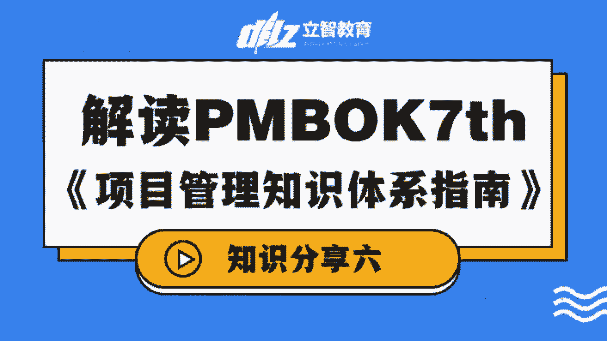
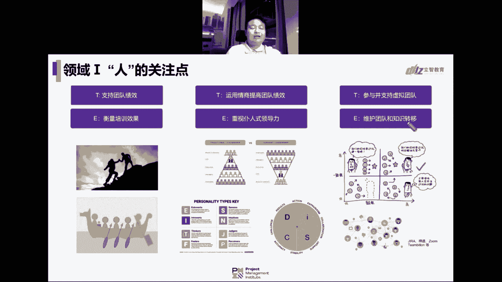

# 专家解读PMBOK第七版，助力备考PMP学习 - P1 - 立智教育 - BV1og4y137xb

我觉得特别有意思，或者值得大家去关注的，这个考纲里面的一些变化的内容，更加强调的事情是吗，就是项目经理的非权力影响力啊，这个时候p m i更加强调一点，他认为项目经理可能手中没有足够的实权。

包括很早以前在第一本书里面讲到的什么，就是矩阵式架构啊，他会更加认为项目经理需要通过一些湖人士，领导服务，是领导去给我们的团队啊，去展现这样的一些服务性的一些能力啊，或者方式啊。

所以啊他会更加强调一些团队的绩效啊，我们要做一些团队教练啊对吧，然后我们要运用情商啊来去提高团队的绩效，所以我们需要有识别到每个人啊，他们可能会对应到这个对应到的个人特性。

然后我们再想办法去看人下菜碟嘛，或者是叫做因而因人而异的这样的一个管理，或者是领导力的方式来去提升它的迹象啊，所以不是大家都可以通篇一律的，采用一个方法来去实现的啊，包括更加强调的是支持虚拟团队。

然后要衡量培训的效果，要重视一些，这个仆人是领导，以前是领导高高在上对吧，我自己说了我就算了，但在很多一些呃，我们讲的脑脑力的劳动的一个体系里面，你更加的适合啊，要激发团队，让大家有责任心。

要让他们觉得啊，我这是一种光荣神圣的使命啊，这个重担压在我身上了，让他们冲在一线，而管理者在后面去帮助大家移除障碍，保持专注对吧，然后让来去support的团队，所以这是一个无人。

是服务室领导这样的一个方式，变成了一个领导，在下面去支持团队的这样的一个作用啊，包括最后呢我们要讲啊，来去维护团队和知识的转移，要去创造这样的一个更加信任的环境啊。

