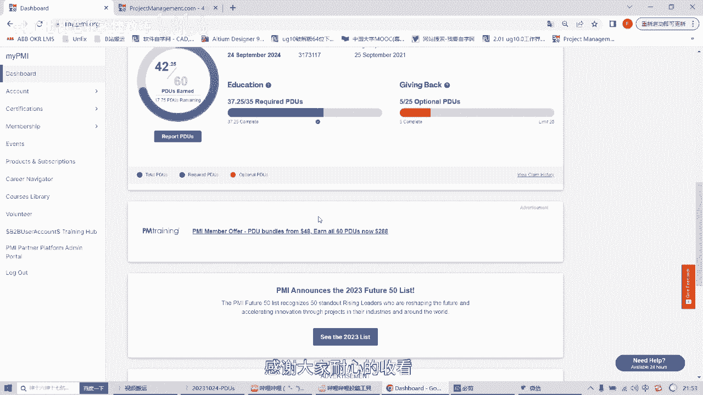

# 个人如何挣PDUs？小白上手视频教学（第二部）！！ - P1：个人如何挣PDU？小白上手视频教学（第二部）！！ - 李桃学英语 - BV1Ee411977x

各位粉丝下午晚上好，今天up主将带领你们在获得PMP证书之后，怎样通过自己的努力，去在PMI官方网站去获得自己的PDU好，接下来我将带领大家来实际进行操作，首先我们要登录自己的品牌官方网站。

首先先登录进来的第一步，此页面已经展示好了，登录进来的这个页面，第二步点到这个三角形dashboard这一个菜单栏，这个网站的网速是比较慢的，好的，现在已经打开，这里是我们要求的PDU。

这里可以看到我们的一个，获得PMP证书的一个时间，然后这是需要重新去更新，或者去续签我们的PMP证书，可以看到我们有效稀释3年，所以在这3年里面，我们需要完成要求的PDU，总共有这里是35个。

都是自己去自学的一个人一个模块，第二个是pm，其实也更建议我们获得PMP证书之后，能够在这个网站去写，去分享自己的一些知识，所以这个模块是giving back，这里的话总共需要25个PDU。

今天的话我和大家再分享一个education的，可以看到，其实我这账号的话education要求是35个PTUS，现在已经完成了36个，但是的话也可以再继续的申请education，好的。

今天就和大家分享具体的一个操作好，还是一样的，点这里report pdu，这时候点开，然后等着页面跳转，然后同时的话我这里已经打开了另外一个网站，大家要记住这个网站project management。

这个的话其实也是PMI网站里面的一部分，这里的话有很多的文章，就整个PMI相关的社区，有很多大佬在里面分享这些文章呢，所以大家在这里面可以进行持续的学习的，比如这里就写到了，这里是2023年10月份刊。

这里有几篇文章，我们就可以来一起来进行学习，比如的话，然后我这里对这个比较感兴趣，那就直接点开这篇文章来学习就行了，这篇文章我已经提前学习完了，先把它打开放在这里。

然后的话我们就直接回到education，这里的话是RT直接点开，这时候把这篇文章的标题，放到这里，然后的话作者唱到这里，这里的话大概来进行描述一遍，一般这里的话都已经看完了，其实我，如果比较快的话。

那就基本上就用这个题目的一个信息来进行呃，大概写一遍吧，先复制到这里，然后这个放在这里，这个坐着，Shared for ways to enhance，Musimin a risky world。

Okay，然后先把这篇文章的地址放到这里，这时候学习的时间可以看到今天，根据这篇文章的一个长度吧，然后我们读完这篇文章需要去研究之类的，所以大概的这个文章其实相关信息还是在这里。

Wait of working，然后对我们的工作方式是有所变化的，然后，ACCUMING这一块的话呃，也是对自己的一个三叶的一个一个头脑的，这里给个0。25吧，OK然后agree submit。

这时候状态是比较慢的，我们就耐心的等一等就OK了，OK很快，今天这个网速是比较给力的，看到我们已经提交了submit，这里可以看到这里有一个REMAX，就是说这一个申请的话，最多五个工作日能够完成。

其实的话，其实现在我已经收到一个邮件的信息了，其实已经完成了，让我们回到这个页面去去，检查是否已经增加了这个PU，火速是比较慢的，那么等他缓冲过来就行了，还是回到dashboard。

就刚刚展示的那个位置，现在慢慢的缓冲，看到了没有，所以这里已经OK了，刚才是35，现在是37。25，这个分数已经获得了好，今天的展示就这么多，感谢大家耐心的收看。

