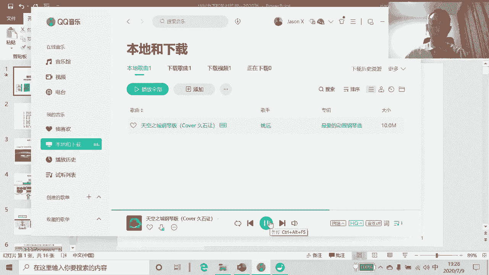
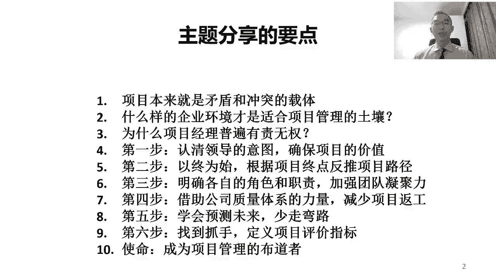

# 中国特色项目管理--六步工作法 - P2：2.课程分享要点 - 清晖Amy - BV1d1421C7ce

今天的讲座呢分为十个要点，第一个要点是项目本来就是矛盾和冲突的载体，第二个要点是，什么样的企业环境才适合项目管理的土壤，背景音唱的上B，实现不可能完成的目标，今天的讲座呢分为十个要点。

第一个要点是项目本来就是矛盾和冲突的载体，第二个要点是什么样的企业环境才适合好，测试结束效果还不错，一会儿正式时讲座再见。

嗯各位学员，各位听众，大家晚上好，我们现在呢正式开始今天晚上的讲座，首先呢还是这个，欢迎大家来收听我的在线讲座啊，那我今天讲座的这个话题呢，啊也是我们这次的这个系列讲座话题之一。

但这个话题呢嗯其实是我的一个经典话题，就是微权利下的项目管理，那如果呢呃经常收听我的讲座，或上过我的课的学员们呢，其实应该大家会了解啊，微权利下的项目管理呢，它其实是我自己的一个比较独特的。

对项目管理的理解，或者也可以说呢其实是我自己在实践的过程中，把西方的项目管理，那融入到我们中国的特色环境下之后，而形成的一种项目管理的思想和方法，然后呢我把它称之为是微权利项的项目管理。

那微权利下的项目管理的这个思想呢，最开始呢应该我大概应该是在啊，14年或15年的时候，那也是一个很偶然的机会，之前的时候呢也是为了去做一次在线讲座，然后当时呢听众们提出来是说。

想听一下威权力下的项目管理怎么管，所以后来呢，那是我第一次呢做了这样的一个主题讲座，那当时的名字就叫微权利下的项目管理，后来当时讲完了之后呢，大家反应很好，觉得呢这个比较符合中国的国情。

所以后来呢我就一直不断的去完善，那这个对微权利下的项目管理的理解，后来呢我把它变成了一本书，之后呢又把它变成了一门课啊，所以呢这个呃当时应该是在16年的时候，那应该是15年的时候写的嗯，16年的时候呢。

16年的时候出版的，那就是我们大家现在看到这个这个封面上，左侧的这本书啊，微权利下的项目管理，当时的时候呢在电子工业出版社，然后呢那其实也是我写的第一本书，就是人生的第一本书啊，之前没写过书。

然后当时为了写这本书呢，也非常感谢啊，这个啊已经现在退休了的，之前的电子工业出版社这个，然后呢当时的这个我们的这个副社长刘路明，刘总，那当时呢也是他这个鼓励我，其实把我的对这个威权立下的项目管理写出来。

那变成一本书，然后呢这一晃呢呃从15年的时候出版啊，然后15年的时候写的16年出版，那一晃呢已经接近4年的时间过去了，然后呢按照出版社的要求呢，其实我们要出第二版了，所以呢这个呃去年的时候呢。

刚好呢这个也是嗯，当我提出了这个思想和方法之后，在这几年的时间里呢，我也在不断的这个通过自己在企业中的实践啊，去完善自己对微权利下的项目管理的理解，当然了，这个你因为我自己也在不断的实践。

也在不断的学习更新的项目管理的知识跟方法，当然更重要的其实是来源于实践，那在实践的过程中呢，我自己也在不断的去更新，那自己对微权利下的项目管理的理解，所以呢在这个第二版里边呢，嗯第二版里边呢。

当然绝大部分内容呢首先还是来源于第一版的，因为它没有什么颠覆性的调整，然后但是呢这个我增加了很多自己补充的内容，那其实在这个过程中呢，嗯因为微权利下的项目管理呢，到现在为止依然是我非常推崇和提倡的。

是因为呢它非常符合我们中国当前的企业环境，我们中国当前的企业环境呢，它跟西方发达国家成熟的项目管理环境，它有着天壤之别，所以那也意味着是说呢很多西方的项目管理呢。

嗯他很多认为这个很顺理成章能做到的事情呢，其实在我们国家的绝大多数的企业中，他是做不到的，做不到的原因不是因为我们的能力有问题，而是因为我们企业的项目管理环境不够成熟啊，在我们的企业中。

在我们的社会环境中，大家并没有项目管理的思想和意识，所以在这种过程中呢，呃单靠项目经理啊，自己懂项目管理方法，他其实是很难把大家组织起来，让大家去配合的，所以呢在我们国家这种特色的环境下。

他势必我们的项目经理呢，他要付出的比西方的项目管理更呃，项目经理更多，那我们的能力呢必须要比他们更强，那这样的话呢我们才有可能啊，在我们这种比西方更加有挑战的，项目管理环境下，把项目做成功。

其实今天的讲错呢，我们也会围绕这样的一个主题啊，啊不过有一点呢我先啊提前先这个讲一下，今天呢确实是有抽奖的环节，那但是呢我们这个抽奖的这个书呢，还是微权利下的项目管理第一版，那呃这次呢还先不是第二版。

因为那这个第二版现在还没有印刷出来，呃那现现在正在最终的编辑阶段，那这个威权立项的项目管理第二版呢，嗯应该会在9月份这个出版上市，所以呢这个因为现在还没有，所以这次我们抽奖的还是以第一版。

但是呢其实我现在觉得第一版也很有价值啊，首先第一版的确实是经典版，而且第二呢现在应该说已经绝版了，就换句话说的已经不会再印了，因为再印都是印第二版了，所以第一版呢肯定是买一本少一本对吧。

所以基本上他卖没了，后面就不会再出版了，所以呢这个今天呢如果我们抽奖，能拿到第一版的，因为这个刚好是我今天签过名的，那今天刚刚给这个书签过名，然后呢这个我相信呢也其实对大家来说，应该是非常有纪念意义的。

下面呢我们正式的进入到我们的这个讲座，内容啊，讲座的内容呢是这样十个主题，那如果经常听我讲座的呃，我们的学员和嘉宾们呢，他可能会比较熟悉这十个主题，但是呢我觉得大家今天呃，即使再听一遍这十个主题。

我觉得应该还是会挺有收获的，因为经常听我讲座的嗯，学员跟听众们可能会有一个体会，就是其实我每次跟每次讲的都不一样，每次跟每次讲的都不一样的，他并不是话题不一样，其实话题还是那个话题。

只是因为呢理解的不一样了，那并不是说故意想不一样，是因为因为我自己呢也在实践中不断的成长，那我是很奉行这个知行合一的这种方式的，是因为呢我自己一直认为呢呃只是听明白了，他不是真的明白。

他要在我们的实际工作中呢，然后不断的去实践，而且呢要在各种不同的场景下去实践，在实践的过程中呢，我们才能真正的去加深呢，对这个方法本身的理解，所以这些年呢我也一直在实践，所以呢这个也一直没有脱离甲方。

那一直呢冲在企业的一线呐去看，在我们国家这种特色的环境下，我们说不是因为是在我们自己国家的企业里边，在实践，而不是在西方的企业，所以在我们国家的企业里面去实践的过程中呢。

能够更好的去理解这种西方的项目管理方法，跟我们国家自己的特色的环境啊融合起来，当我们真正能落地的时候啊，它它展现出来的样子是个什么样子，所以呢这个今天呢我们依然其实是围绕啊，围绕我们国家自己的特点啊。

围绕我们的企业特点，我们去谈项目管理到底干什么对吧，我们在中国项目是什么，中国的项目管理是什么对吧，中国的项目经理，那他是个什么样的人对吧，在中国如果我们想把我们的项目管理管好，我们到底应该管什么对吧。

在管的过程中呢对吧，我们我们侧重我们的要点是什么，那所以呢我就形成了这样十个不同的主题，那这十个主题呢，第一个呢首先其实还是要去解释一下，就是到底项目是什么对吧，那在在我们国家。

项目工作跟别的工作有什么不一样的，第二呢就是我们要去谈一下，这个理想化的项目管理环境是什么样子，但我们谈理想化的项目管理环境呢，不是说大家去找理想化的项目管理环境，因为绝大多数理想化的项目管理环境。

其实大部分在西方国内的只有非常极少数的啊，非常成熟的企业，然后呢，但是绝大多数的中国的企业，它其实并不具备这个理想化的，但是呢想给大家讲一下，是因为这个其实是我们未来努力的方向。

我们希望有一天呢在大家共同的努力之下呢，我们可以把我们国内的企业都建立起一个啊，非常这个有利于开展项目管理工作的企业环境，这样的话呢他以后的项目经理，他干项目管理，就不会像我们现在啊这样有挑战了。

第三点呢其实会去谈一下什么呢，这个为什么项目经理普遍是有责无权的，那既然我们叫微权利下的项目经理啊，或者微权利下的项目管理，那其实背后呢，其实是因为我们认为，其实项目经理没有这个有责无权。

或者是说则大于权，那其实这件事呢在我们国家目前是合理的，那是合理的概念呢，就是说我们要去适应环境啊，项目管理其实本来就是用来适应环境的，那我们要去适应我们国家这种项目经理，有责无权的环境。

我们要在这种环境下，我们要把项目能做成功，从这个第四步到第九步呢，六个步骤对吧，第一个步骤就是关于这个，我们要搞清楚项目价值的问题，第二步骤呢对吧，我们得能够去定义项目的终点目标。

然后基于目标反向分解呢制定项目计划，第三步呢做项目管理的过程中呢，我们得能学会去建立一个这个角色，职责清晰的项目组织，而且呢让大家呢这个能够去定义出一个，他们相互能接受的一个合作关系，或者是生产关系啊。

因为这样的话呢这个他才能变成一个项目团队，第四步呢要解决的问题是，让项目过程受控的问题，项目过程受控呢，他必须要去借助公司的力量，那尤其是公司的这种质量管理的力量，那帮助我们在项目过程中呢。

去建立一个项目的受控的机制啊，其实质量管理体系呢，就是一个让公司的受控的体系，那我们在项目中建立受控机制呢，我们也要借助公司的受控体系，这样的话我们才能让项目过程受控，第五步呢就是我们说风险管理。

那项目管理呢其实本质上来说就是风险管理，只不过是说呢，当我们在项目中做风险管理的前提，我们为什么要先去做，前面一大堆的项目管理的工作，其目的呢其实是为了减少做风险管理的工作量，我们说呢，如果是说。

我们通常前面的项目管理工作都不做对吧，比如说不去分析项目的价值啊，不去制定项目的计划，而不去把大家组织成一个组织，不去规范大家的工作方式，那这样的话项目中会出现无限多的风险。

那当项目中风险多到无限多的时候，你就是想管也管不了了，就变成了一种有心无力的状态，所以我们说呢，其实项目管理呢它其实本质上就是风险管理，那只是说呢为了去对吧，减少风险，把绝大多数的风险。

通过建立一个规范化的项目管理机制对吧，给他管起来，这样的话呢这个就是里边的个人行为少了，不确定性少了，那这样的话呢他这个可用来当做风险的就少了，这样的话我们才有机会啊。

用风险管理的方法去把那个剩余的风险对吧，把他管起来，规避起来，有效的去进行应对，如果前面的项目管理的规范化工作都不做，那项目中就会有无限无限多的风险，那这时候即使懂项目风险管理怎么做，但是因为风险太多。

没办法投入足够多的资源和精力去做，所以导致风险管理做不了，所以这其实目前就是很多企业当前的问题啊，很多企业是规范化的项目管理机制，没有，那项目团队不按照项目管理工作方式去去管。

结果造成项目中的风险无限多，然后这时候大家说我们学风险管理吧，但其实风险管理的方法本身并不复杂，但关键问题是，当项目中非常无序啊，非常没有规范性，非常不受控的时候，风险会多到了，即使懂风险管理怎么做。

其实也管不过来的状态，所以那样的话呢，其实你即使学了风项目风险管理也没什么用，所以呢这个一直以来呢，项目风险管理为什么往后讲，是，因为它是基于在前端，已经通过规范化的项目管理方法。

规避掉了绝大多数的项目风险之后，他才有可能按照项目风险管理的方式，去把风险管起来，所以呢很多的时候这个项目风险管理呢，它不能单讲它是基于前面的项目管理，已经管了绝大多数的风险的基础上，才谈项目风险管理。

第六步呢讲的是项目评价啊，那项目评价也很重要，因为呢如果我们想让项目过程受控啊，能够这个让项目呢能够顺利开展，他必然就有评价指标对吧，这个没有评价指标的项目做的好不好，项目经理自己都不知道对吧。

那这时候呢更谈不上是说能够在项目过程中呢，对吧，我们做偏差分析对吧，然后呢我们做管理，那我们说做管理的前提是他得先能评价，那不能评价，你不知道管什么对吧，管了别人也不服气，第二呢这个没有评价指标呢。

我们也不知道管的对不对，所以呢这个定义评价指标也很重要，第十点呢，他其实这个秉承我的一贯的理念啊，我非常希望呢每一个从事项目管理工作的人，我们呢都把这个从事项目管理，当成我们自己的一个事业或一个使命。

我们把自己当成一个项目管理的布道者，那我们都去宣扬项目管理的思想文化和方法，那这样的话才能让更多的人去理解项目管理，他才有可能大家去配合起来，一直以来呢大家知道只有项目经理懂项目管理，其实是没有用的。

因为项目管理这个这个工作啊，这个方法它不是项目经理自己用的，它其实是项目经理组织大家啊，组织大家用的是项目经理呢把组织一群人啊，这个基于一个特定的目标，把大家组织起来，形成合力而采用的一种方式。

如果说只有项目经理懂，别人都不懂他，他没办法去配合项目经理，所以呢这个但是一般呢我们说啊，这个专业的项目管理培训和项目管理认证啊，一般在咱们国家就只有项目经理上，别人不上，所以在这种情况下呢。

那项目经理既然上完了啊，然后我们要去带着一大堆，从来没学过项目管理的人去干项目，那这个过程中呢，那只能靠项目经理去培养他们对吧，去培训他们，教他们项目管理，告诉他们项目管理的价值。

告诉他们项目管理应该干什么，告诉大家在项目中如何形成配合对吧，该干什么不该干什么，该遵守什么，不该遵守什么，然后这样的话呢，其实大家才有可能在项目中配合起来，所以呢在我们国家当前阶段跟西方国家不一样。

西方国家呢，绝大多数人其实多多少少都懂些项目管理，因为它发展的年头够长了对吧，然后呢他大家能配合起来，在我们国家呢，目前还属于个绝大绝大，绝大多数人都完全不懂项目管理，而且甚至是自己不知道自己不懂。

在这种情况下呢，那换句话说就是谁当项目经理，谁牵头干这个事，他必须得教大家，你不交的话呢，那这时候大家就没办法去很好的配合，然后大家就会按照自己的理解一通乱做，然后这时候整个项目过程就容易失控。

所以呢目前的这个状态呢，就是在我们国家的项目经理，一定要把自己变成讲师顾问教练对吧，我们在带一个项目的时候，我们不仅仅是当项目经理，我们其实还是当整个项目团队的，项目管理的导师和教练。

