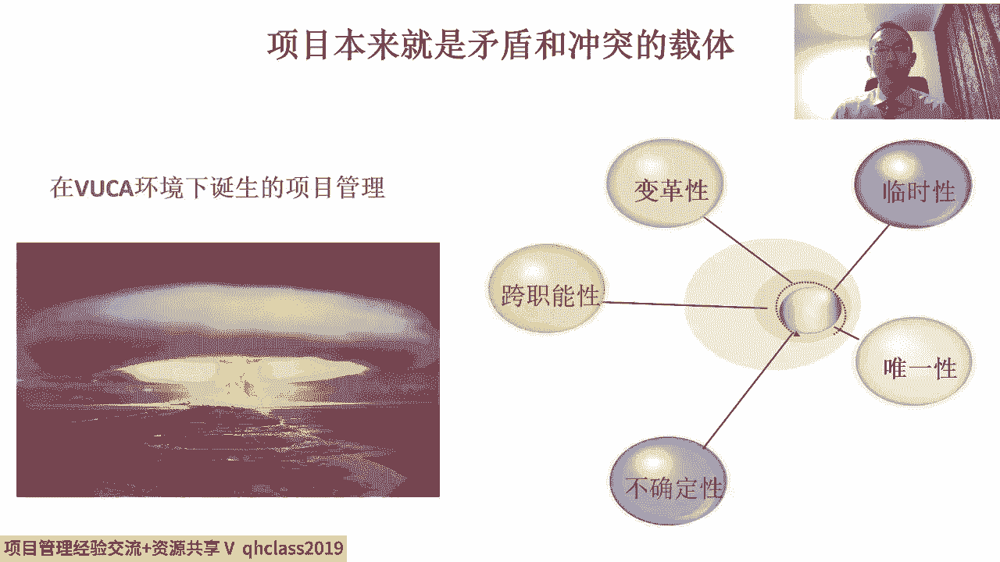
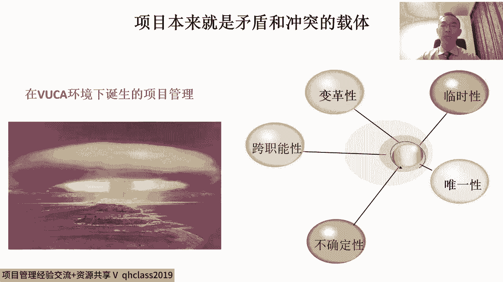
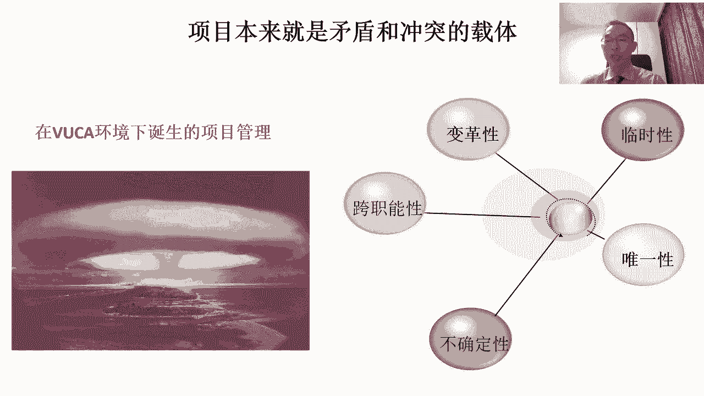
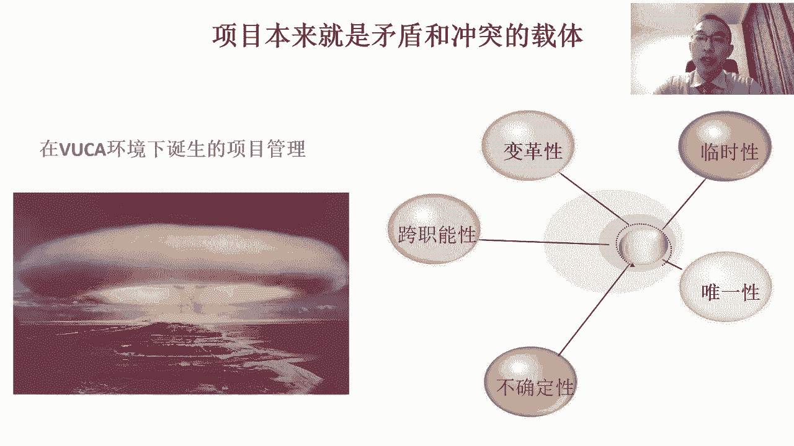

# 中国特色项目管理--六步工作法 - P4：4.项目本来就是矛盾和冲突的载体 - 清晖Amy - BV1d1421C7ce

首先呢第一个要点呢，就是关于这个项目是什么的问题。

那其实大家知道呢，这个项目管理呢发展到现在已经有70多年了。

最开始呢第一个被称之为叫项目的。

就是我们说二战末期的时候对吧，194几年那个著名的计划曼哈顿计划。

曼哈顿计划呢是为了造原子弹，是为了美国。

美国为了比德国先把原子弹造出来，而率先采用了一种这全新的管理方法。

那这种颠覆式的管理方法呢。

它就是我们所说的项目管理，那这种管理方法的结果大家也看到了。

因为美国率先的采用了这样的一种，项目管理方法，所以呢他比德国呢对吧。

他在一个其实本来并不如德国先开始研究，那科学家也不如德国在这方面更有经验对吧。

基础也不如德国好的情况下，他依然比德国先把原子弹造出来了。

那它背后的原因其实是因为他率先采用了这种。

那就被称之为后来叫做项目的这样的工作方式。

那项目管理呢，从最开始就是他为什么比人家造的更好呢。

大家道，一直以来德国所擅长的是专业性，而善于流程管理是吧。

善于慢工出细活对吧，然后他呢不断的去深造他的专业。

不断的去完善它的流程，然后去形成了一些质量特别好的，那这样的产品。

这一直以来是德国的擅长对吧，精工，然后呢，但是美国呢在当时那个情况下对吧。

技术的基础，那包括人员的基础都不如德国。

在这种情况下呢，而且大家知道这个这个状态背后是打仗。

打仗呢他要解决的问题，不是一上来出精品的问题。

原子弹呢当时主要的问题是谁先造出来，谁就赢了对吧，那至于的这个原子弹谁造的好一点。

谁造的差一点，这不是最重要的，因为必须得首先解决有和无的问题。

所以呢这时候呢，时间性就会变成了最主要的一个指标。

那换句话说呢，双方谁先把原子弹造出来。

不论质量好坏，他都能取得最终的胜利，所以在这种情况下呢。

而且这又是一种颠覆式创新，所以呢那么美国呢他率先采用的这种方式。

就是对吧，如何能够跨职能的把各种不同的相关方对吧。

各种不同学科的顶尖的科学家，诺贝尔奖获得者对吧。

把我们说我们的这个军工企业，工人商人，政府官员。

那把它们的有效的整合在一起，让他们配合起来对吧。

去去共同的这个把这样一个最伟大的。

这样发明创造出来对吧，因为什么大家得配合呢，因为这个原子弹它是这个世纪这个对吧。

我说最颠覆的创新之一，它不是单一学科的，它跨N多个学科的。

参与的科学家都是世界最顶尖的科学家对吧。

让这些科学家协同起来挺难的，因为谁也不服，谁，都是都是顶尖科学家。

第二光科学家想明白了这事儿也不行，鹰角实验得有工程师对吧。

我们要把它造出来，然后得有工厂。

然后呢这过程中得有人出钱，那军火商他必须得有回报对吧。

我们说这个真正的用户是前端的军队，军人每天都在浴血奋战对吧。

每天都有大量的伤亡，换句话说呢，这东西他如果造出来是说只有科学家能操作。

这是没有办法投入到战场上去的，他必须得当兵的。

在前面能能操作，所以得考虑到用户的水平，第二呢早一天出来就能少死很多人。

然后整个能搭这台子的肯定是政府。

所以呢没有政府搭台子，这根本就就跨这么大规模和相关方的。

这种项目是建立不起来的，所以在这样的过程中呢。

基于这样一种复杂的场景，然后又有时间的紧迫性，所以他形成了这样被我们称之为叫项目。

这样一种管理方式，所以呢这也意味着说，其实项目这种管理方法从一开始。

那从一开始刚开始诞生，它其实就意味着是说这种方法最适用的场景。

其实是一种非常极端的场景。

在这种非常极端的场景下，时间紧啊，挑战大，创新性强。

利益相关方复杂，意味着说跨这个多相关方的协调很困难啊。

而且最开始的时候目标也不怎么清楚，第三个不要对用户有特别高的要求对吧。

然后在这种情况下。

他其实往往是最适用于项目管理方法，所以那意味着是什么呢。

我们说挑战不大的事啊，它不适合项目管理，所以一直以来呢我们都认为是说项目管理啊。

它其实是这个创新和变革的载体。

他最适用的场景都是这种博弈的场景，对挑战大，风险高。

人员配合度低，他才适合用项目管理，所以很多的时候呢。

我们呢通常会认为是说项目管理呢，它至少会有五个特点。

为什么谈有五个特点呢，呃当然了，有的时候啊我们也会说啊，所有的事都可以当项目管啊。

他确实所有的事都可以当项目管，但是并不一定是所有的事儿都适合当项目管。

我们说任何一种管理方法都有其局限性。

有其局限性的概念呢是说，因为他如果一旦特别适合去管。

去用在某一个事情上的时候，那必然意味着是说他肯定也有特别不适合他用。

那其实对于项目管理也是一样，它是可以用来管所有事。

但是并不一定是所有的事，都适合用项目来去进行管理。

那我们说通常最适合用项目进行管理的，工作是什么呢，就是我们现在大家看到这个PPT上啊。

我们具有右边这五个特点的，这五个特点是什么呢。

第一是临时性呐，临时性的概念说的是什么呢，就是它首先时间紧。

那时间不紧的事儿不适合按照项目管理对吧，什么叫时间紧。

时间紧的概念就是按照通常的工作方式，那肯定完不成，所以呢他必须得采用一种额外的方式。

然后他才能实现，是说对吧，大家通常认为完不成的事。

我们用这种方法之后他能完成了，换句话说得用比常规更少的时间。

所以那也意味着是说呢，这个在开展项目管理工作的时候吧对吧。

他必须采用一些非常规手段，如果再按照常规的套路对吧。

大家按照常规的节奏，这事肯定是干不完的。

所以那也意味着是说，项目经理从接到一个项目之后吧，他必须得想办法说，我怎么能让大家干的比原来对吧。

更卖力气，更有激情对吧，怎么样路径更短，这样我才有可能提前完成。

如果说一个项目按照项目管理管，完了之后跟不按项目管一样。

那这项目管理其实一点用都没有，所以呢，通常呢，时间性一定是项目的一个重要的考核指标。

所以之前呢很多时候项目经理呢嗯经常会抱怨。

是说这个项目给的这个时间太少，不够用，其实呢如果我们站在项目管理的角度来说吧。

这正常的正常的概念是什么呢。

其实项目它本来就应该是这样的，再换句话说呢是说这个任何的一个项目。

从开始接到的时候，我们大家一看时间诶很够用。

那说明这个项目的任务布置的有问题，如果大家一看说这项目一看。

这时间按常规方式肯定完成不了，或者绝大多数人认为你就肯定完成不了的事。

我们说按照项目管理管，它其实往往是适合的。

换句话说，就是为了去用一个比别人更少的时间来完成。

基于这样的目的，我们才有可能成立项目。

第二个特点呢就是我们说唯一性，唯一性的概念是什么呢，就是我们说啊这个项目吧它必须得有点创新性。

这个创新体现在哪呢，体现在结果上，换句话说这个项目的交付物对吧。

就像原子弹一样，他从来没出现过，我们说这项目要是最终被交付之前出现过。

那这肯定不就不太适合按照项目管。

那什么时候按照项目管呢，我们说这个项目交付呢对吧，之前没有过。

或者是说这个交付的一部分是创新的。

那在这种情况下呢，意味着什么呢，项目的目标一定具有模糊性，换句话说呢，这个最后验收标准是什么。

不一定特别清楚对吧，因为我们连最后这个交付是什么，都不太清楚的情况下。

那这时候呢肯定验收标准也不是特别清楚，那也就意味着是说呢。

项目经理在早期的时候一定要带着项目团队啊，花更多的时间去去思考。

去讨论，去琢磨这项目最后的交付到底是什么，这个项目最后交付的验收标准。

他是想出来的对吧，他没见过，要见过了就不叫唯一了。

因为没见过，所以呢最开始的时候我们一定要去预测对吧，去推演，去推断最后的验收标准。

要提前跟用户呢对吧，就一个大家都没见过的东西达成共识。

它背后其实说明了这个项目，它是具有唯一性的独特性，就最后这个交付啊。

这个从之前是没有过的，第三个特点呢被我们称为叫不确定性。

那不确定性的背后他主要说的是什么呢，说的是这个实现项目目标的路径对吧。

我们之前不是很有经验。

或者是说呢这个路径过程中，有一部分我们是没有经验的，有一部分没有经验。

那就意味着是说呢实现目标的过程有风险对吧。

我们说这个应对风险最有效的方式，其实是什么呢，其实是经验教训。

换句话说呢对吧，有经验他就能少犯错误，没有经验对吧。

就会多犯错误对吧，所以所以呢我们说我们有一句名言叫。

失败是成功之母对吧，一般往往第一次做一件事，绝大多数都是失败的。

那也就是说，如果我们去干一个我们没有经验的事。

他其实就会经历很多失败对吧，然后在失败中寻找正确，寻找成功。

那对于项目来说呢，他也是这样，就当我们会发现实现项目目标的过程中。

其中有一部分就有一部分事我们是没干过的，没经历过，所以那那这样的话呢。

就会意味着说，我们其实前期呢要花更多的时间呢对吧，要提前的去分析去思考对吧。

主要思考的是这个不确定性的事，我们到底应该怎么去做的问题。

那如果不确定性的事呢对吧，我们如果之前没思考。

那在开展项目的过程中呢，我们其实就很有可能会遇到问题，遇到什么问题呢，遇到问题就说我们遇到了很多。

其实之前意料之外的事情，那这些意料之外的事情呢。

它其实就会导致是说其实我们在项目过程中，可能会影响我们的交期。

影响我们的成本对吧，然后或者是影响我们的质量，那所以呢这个项目的风险管理呢。

它其实在很大程度上呢，它其实也是帮助我们去解决。

实现目标过程中的不确定性问题，还有一个呢就是我们说项目的跨职能性。

那项目的跨职能性主要说的是什么呢，说的是这个这项目呢它往往相关方很多对吧。

我们说这个有的叫客户。

有的叫用户，有的叫供应商对吧，有的是自己兄弟部门，那其实这些人呢我们为什么把它叫不同的项目。

利益相关方呢，就是因为他利益不一致。

那利益不一致的概念是什么呢，就是大家关心的事不一样。

大家从这个项目中所获得的好处不一样，那既然大家关心的事不一样，好处不一样。

那意味着其实大家在项目过程中对吧，他能够去配合起来就不太容易。

就容易产生冲突，因为每个人都只关心自己关心的事，所以呢那也意味着是说呢。

这个这协调组织就会比较困难。

但是呢越是这个相关方多，大家相关方之间有矛盾，他其实越适合按照项目管。

还有一个特点，就是我们说那变革性，变革性主要指的是什么呢。

大家知道这个项目的产品吧，他什么时候才能带来收益和价值呢。

它得得被这个目标的用户用起来，换句话说我们说成立了一个项目。

然后我们形成了个产品或者一个交付，这个产品跟交付，最后没有人用。

没有人爱用，那这时候其实呢这个项目的整个的过程。

其它是没有什么价值的，我们说往往呢这个项目的产品，被我们目标用户用起来。

那他他把用户给改变了，那我们的目标用户，因为使用了我们项目的产品或产出对吧。

而改变了他的状态，这种状态的改变给我们对吧。

给我们项目的发起方带来了巨大的收益，甚至给用户带来了收益的时候。

那这时候我们说这个项目往往是一个成功的，有价值的项目。

所以这也意味着是什么呢，这个作为项目经理跟项目团队啊，从一开始就得思考的是说吧。

我们这项目产品最后给谁用的，用户是谁对吧，那个我们怎么去改变用户。

我们要把用户从一个什么状态，改变成到一个什么状态，那这个过程呢改变用户的过程。

被我们称为叫变革对吧。

因为什么呢，因为用户是被动被改变的，其实用户可能本来不太被改变。

而且很多的时候呢其实并不是用户自己啊，去找一拨人成立个项目团队，弄成个项目产出来去改变自己。

其实往往呢其实是被我们称为叫项目的发起方。

或者项目的客户啊，他们想改变用户，但是呢找不到一个改变用户的很好的方法。

所以这时候呢他会想到我要借助工具，所以呢找来了项目团队啊。

你们帮我们打造一个工具，这个工具被我们称之为项目的产品。

然后呢我们的客户和我们的发起方呢，拿着这个对吧，项目产出的工具。

然后呢推动了用户的改变，那这个时候他变成了一种变革，所以很多时候大家知道。

这个用户是被动被改变的，所以为什么叫变革，所以大招这个任何一个人啊被动被改变时。

他都会很不愿意对吧，会逆反，所以这时候呢对吧，他首先会会从质疑这个事开始。

那所以这时候呢也意味着是说，项目改变用户这个事。

他其实就比较有难度，通常我们认为呢这个这五个特征具备的事。

他比较适合按项目管，或者是最适合就是时间紧对吧。

然后呢项目的结果里边有创新性，有没见过的实现目标的过程对吧。

有不确定性，因为我们没经验的，然后呢相关方比较多。

之间有矛盾，利益不一致，然后呢用户不愿意被改变。

当这几个特征都具备的时候，其实说明他是比较适合按照项目管理的，如果说我们遇到了一个事呢。

时间不紧对吧，结果呢这个项目的产出呢我们也见过啊。

过程也比较成熟啊，相关方呢也比较比较比较和谐啊。

比较容易达成共识对吧，然后改变用户难度系数也不太大，那说明什么呢。

说明那个事儿肯定不适合按照项目管，说明没有什么创新性和变革性，说明呢按照常态化的管理就能管起来了。

那就不需要去搞项目管理这么复杂的东西了。

所以呢我们说了这个项目啊，其实它本来其实就是一个承载啊，它其实就是承载创新跟变革的载体。

那创新和变革的背后呢，它往往就是相关方的矛盾和冲突。

所以呢当我们接了一个事儿叫项目的时候啊。

或者我们把一个任务叫做项目的时候，那就意味着是说。

我们必须要去积极的面对。