# 中国特色项目管理--六步工作法 - P6：6.什么样的企业环境才是适合项目管理的土壤 - 清晖Amy - BV1d1421C7ce

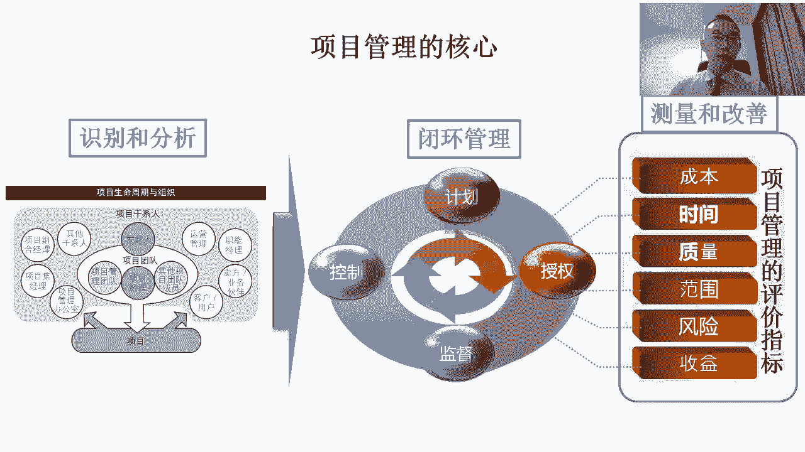

所以呢基于这样的情况下呢，我们再接下来再去谈项目管理管什么。

刚才我们说管项目呢，我们说直动项目管理不行对吧，他还得懂，我是这个实现产品的过程跟我们的组织环境。

但是呢因为我们今天主要是讲项目管理啊，我我们就不管那个实现产品的过程怎么管了。

那我们返回到是说对吧，假设我们已经。

我们大概已经能知道实现产品的过程是什么，然后假设我们对我们的组织环境。

也有足够的了解，那这时候我们再看项目管理管什么。

在这种情况下，一般项目管理管什么呢，我们一般认为其实这个项目管理的核心啊。

虽然要学很多东西啊，这个但我们可以把它稍微简化一下，我们一般认为项目管理主要是干三件事儿。

就是我们现在大家看到PPT上这三件事，第一件事呢就是识别和分析项目的干系人。

或者叫项目的利益相关方啊。

这叫法很多没关系，反正都是stakeholder，项目的干系人或利益相关方。

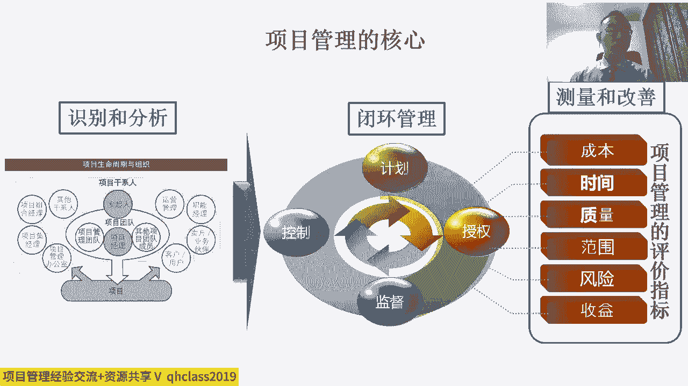

为什么呢，因为项目管理呢它其实呢他就是既得管事儿。

又得管人对吧，管事呢得搞清楚项目的交付是什么。

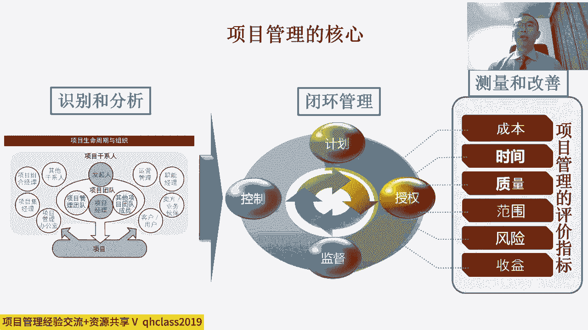

怎么去实现管人呢，因为这个项目管理他不是项目经理。

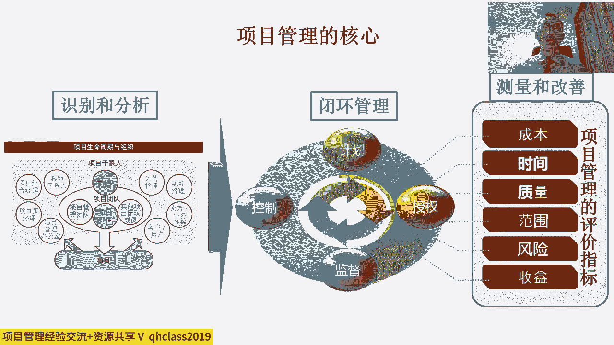

自己干活对吧，这个项目管理他是项目经理，组织大家干活对吧。

我们组织的被组织，这些人都被我们称之为，叫项目的相关方或干系人。

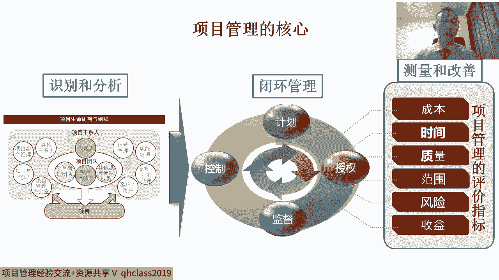

那这也意味着是说呢，如果我不懂，我不知道我对吧，这个跟我干活。

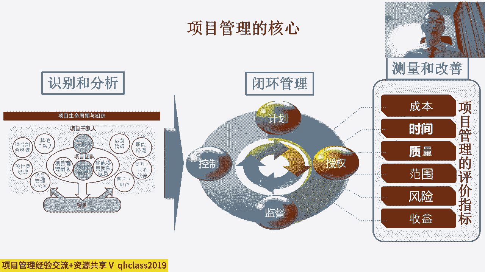

这些人都是谁，他们各自有什么样的利益诉求，那我就不可能组织他们把这活干了对吧。

我们说如果我们是个技术专家，就咱自己对吧。

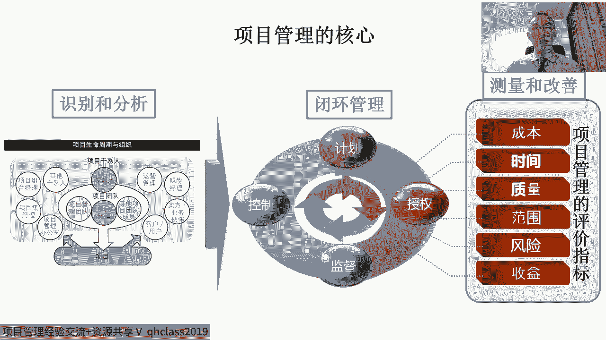

领了个任务自己干，这不需要项目管理，因为不需要跟别人了解别人。

但是项目管理呢恰好是什么呢，不是项目经理自己干活，就是项目经理经理张罗组织搭台子。

让别人干活，所以我们必须得去了解这些。

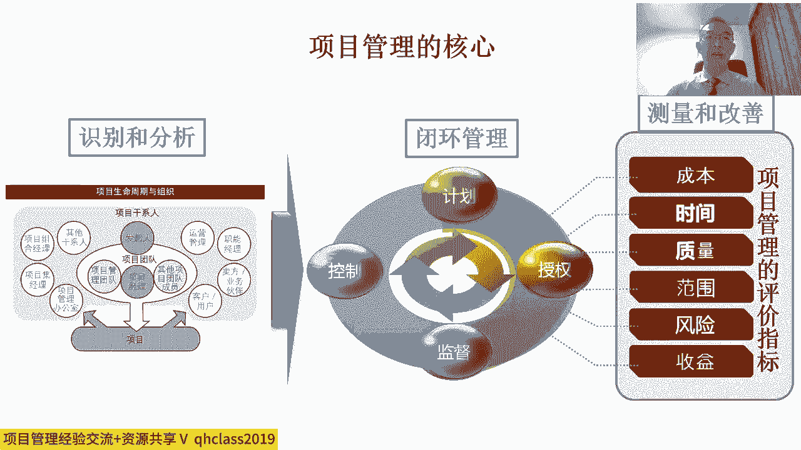

被我张罗组织的这些人，所以一般的项目管理呢，他第一件事得首先熟悉啊。

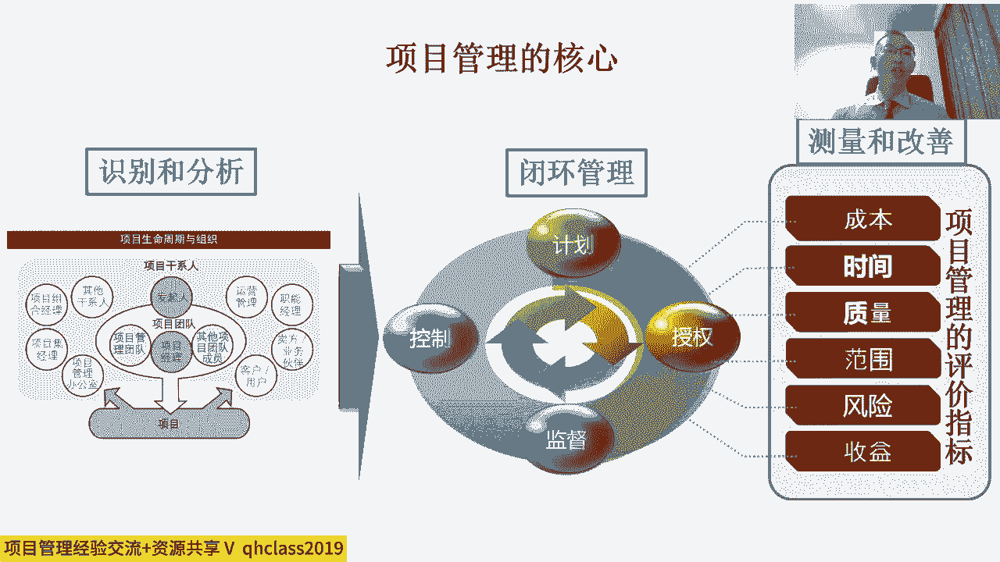

这个要跟我们一块干活那些人，那通常我们把它叫项目，利益相关方的识别和分析。

或者叫项目干系人的识别和分析，当我们把这帮人搞清楚了之后呢。

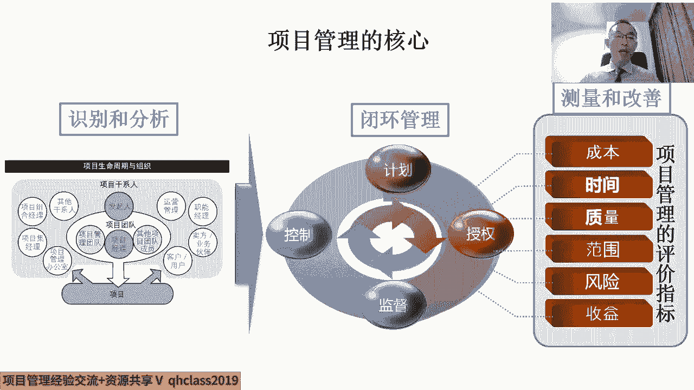

现在我要思考的问题是，我怎么能去搭一个台子，建一个项目的受控机制。

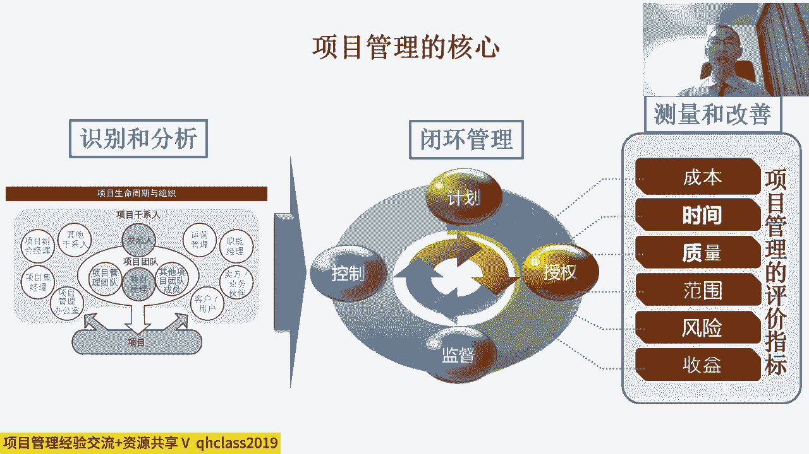

这个项目受控机制不是建公司的，这个是给我这个项目建一个受控机制。

为什么呢，这个对吧，我们说要组织一帮人干事，他得给大家定规矩。

我们知道没有规矩啊，是没有办法组织一群人干事的，包括一个人要自己对自己没有什么要求。

他自个儿这事也干不好，我们要组织一群不同的人一块儿干事的时候，必须让大家遵守共同的规矩对吧。

要建立秩序，那这个秩序呢就是我们说项目的一个受控机制。

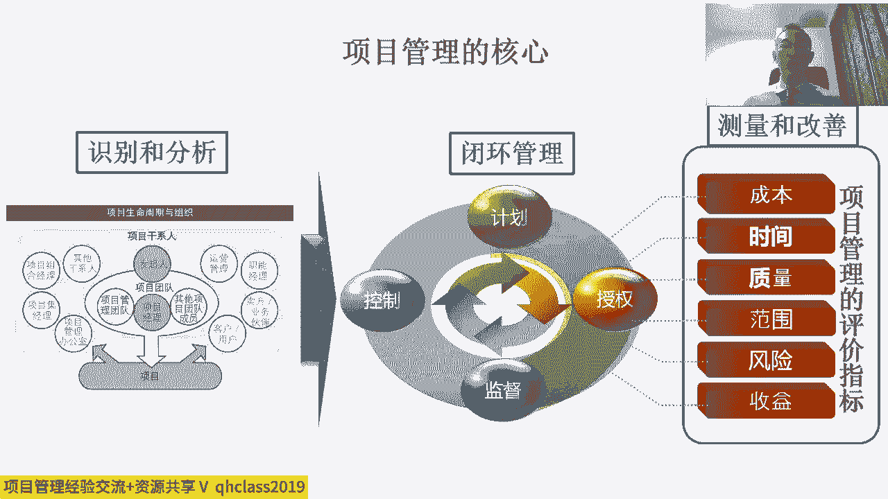

也就是项目管理的舞台，那通常的这个我们一般在项目中呢。

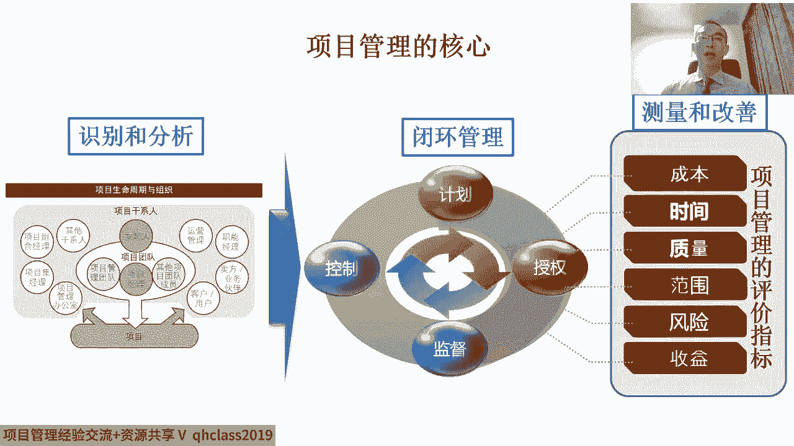

去建立这个项目的受控秩序啊，或者项目的这个这个这个机制的时候呢。

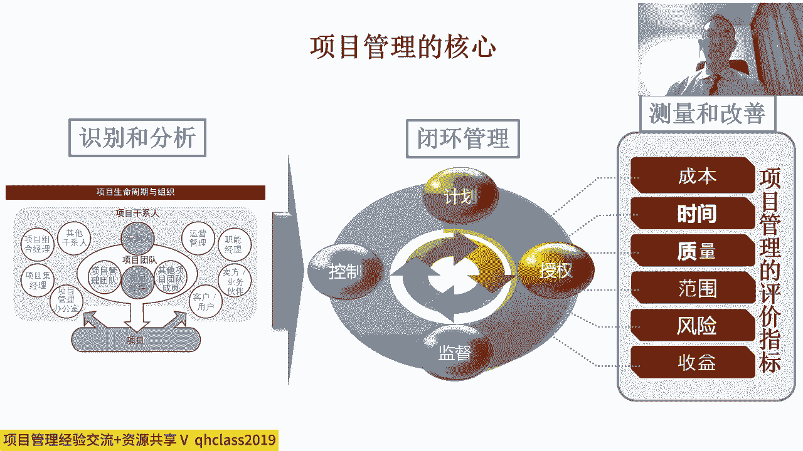

它往往采用的方式就是我们说的组织，大家共同制定大家共同遵守的计划对吧。

然后呢通过授权呢，明确大家各自在项目中的角色职责。

以及谁可以干什么，谁不可以干什么，那为了保证这个过程呢它能受控。

所以呢他还得有监督机制，我们得知道是说到底谁负责监督。

大家是不是按照承诺的那个项目计划对吧，按照他自己的角色职责，扮演好自己该扮演的角色。

干好自己该干的活对吧，这些都有人监督对吧，因为没有人监督呢。

肯定大家一般都不干自己该干的事对吧。

然后呢我们说呢如果发现项目过程中，最开始计划做的不对，或者是说本来计划是对的。

但是可能我们没做，对对吧，如果过程中我们会发现了跟计划不一样的。

那这时候就会产生问题，我们要控制和调整，那意味着说得有控制机制。

控制机制的概念是说呢，得有人能够去纠正别人的错误啊。

那我们后边再去讲，这项目中能纠正别人错误的人啊，他不是项目经理，他应该是项目管理委员会。

为什么呢，因为项目中相关方太多，相关方多了之后呢，那意味着是说呢。

这个他就必须得有一个绝对权威的角色，这个绝对权威的角色，他不是一个人，他就是集体。

所以那也意味着是说呢，这个项目项目的开展的过程中呢。

这个项目的秩序啊，它是基于项目的集体决策所建立起来的，一种管理模式。

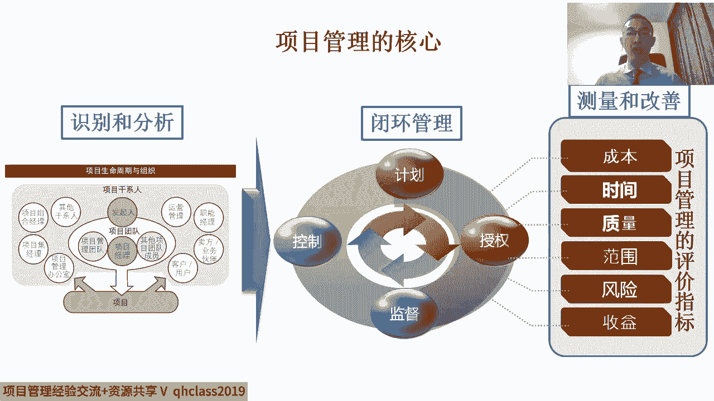

而不是基于某一个人，这个一直以来也是项目管理跟职能管理，最大的区别。

因为职能管理呢他一直以来是对吧。

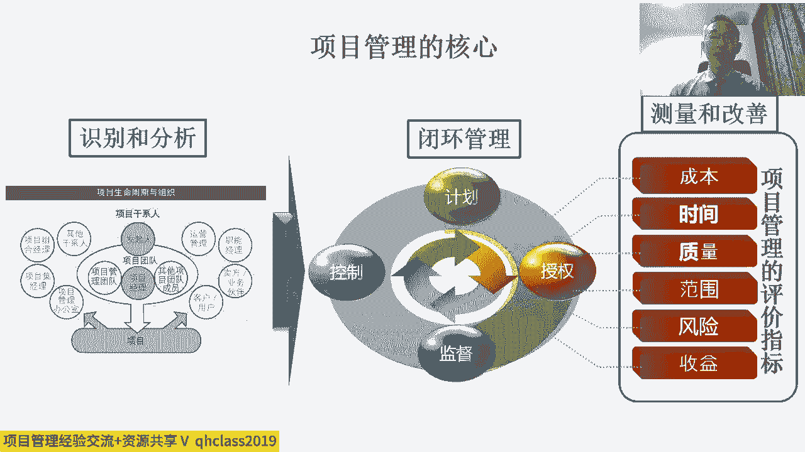

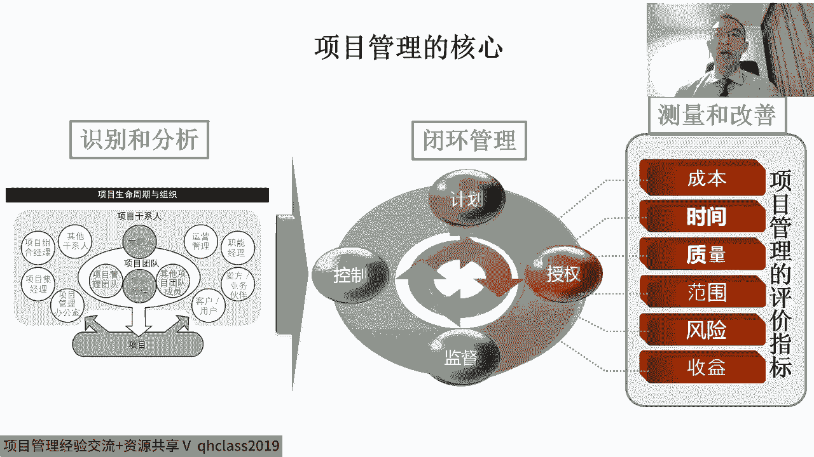

一个是小组的话。

但项目不是我们说职能式的科层制的管理。

那每个部门的负责人对吧，他对整个的部门。

所有的人负有绝对的责任和权利，换句话说所有人都听他的，但所有人犯的错也都算他的。

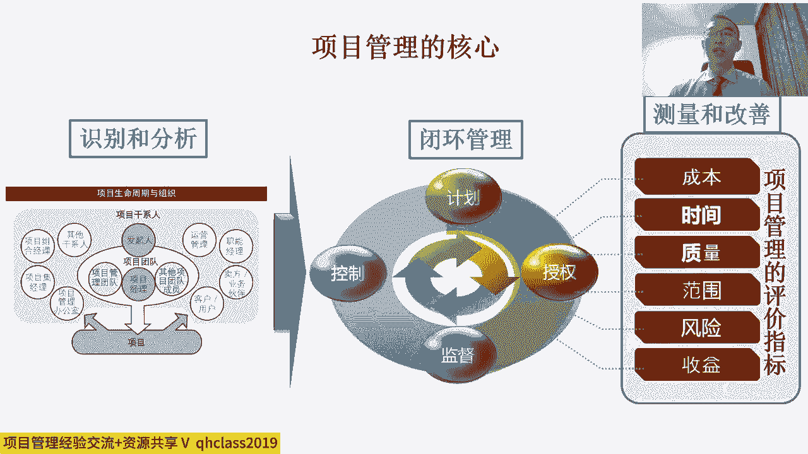

但是呢项目不是项目呢。

跟我们说职能管理最大的区别是在于呢，通常我们说职能化的管理方式。

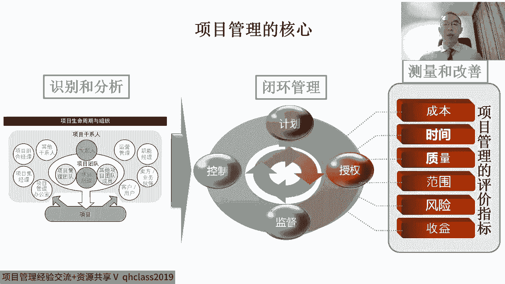

它适用于管理成熟的业务和工作，然后呢在这种情况下呢。

往往把这堆人里边最有经验的人对吧，选出来当这个团队的领导。

这样的话，他可以基于他的经验去培养那些经验少的人，同时可以基于他的经验。

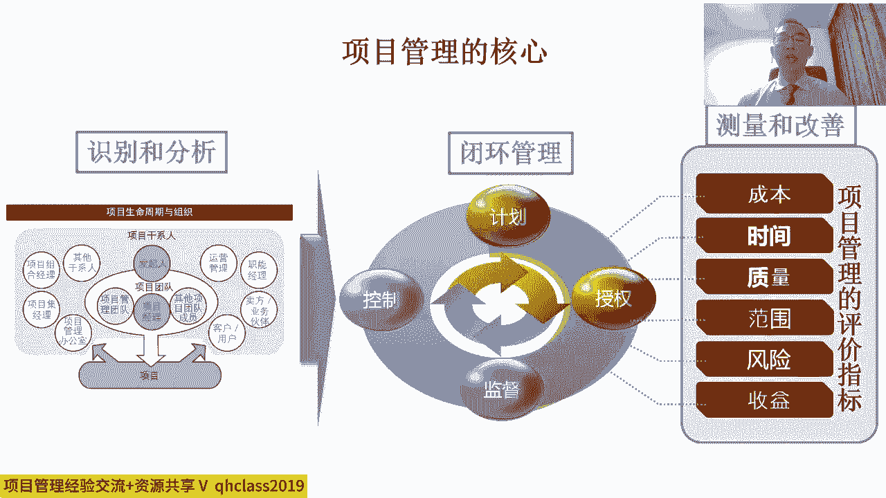

避免大家少犯错误，当大家不知道该怎么做的时候，一定要去请教那个最有经验的人。

因为他肯定比大伙都明白，那这种情况下呢，他其实往往适合于职能管理。

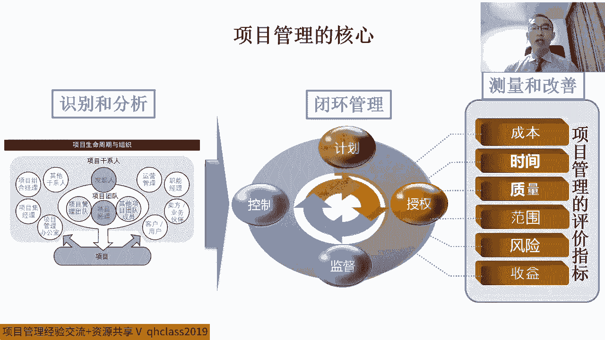

他们适合于这个相对成熟的业务。

但是项目管理呢它是承载创新的，换句话说，项目一般当项目干的事，就像我们之前提到的。

就是他都属于那个目标比较模糊，时间紧，任务重对吧。

然后那个过程中可能创新又多，这个事儿怎么干，大家也都不是特别清楚的情况下。

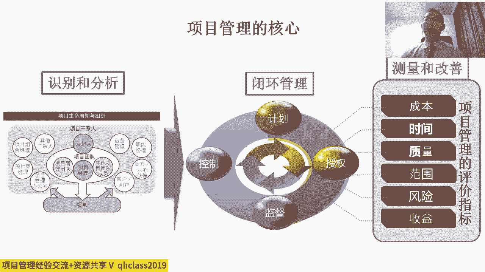

这种很难选择出一个对吧，最明白的人，换句话说呢很难选出个最有经验的人。

所以在这种情况下呢，当我们这个组织，大家一块去干一个有风险的事的时候呢。

那一般我们认为怎么样才能确保我们的决策，是对的呢。

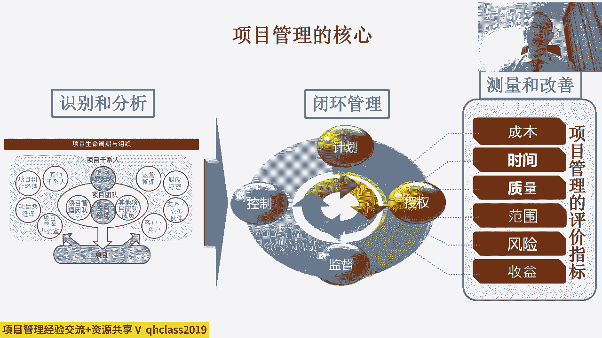

那往往采用的方式就是集体决策，就是大家一块做决策。

如果大家都认为可以的话，那这时候我们就按这个做。

为什么呢，因为如果大家都认为可以的话，那我们通常会认为是说这个对吧。

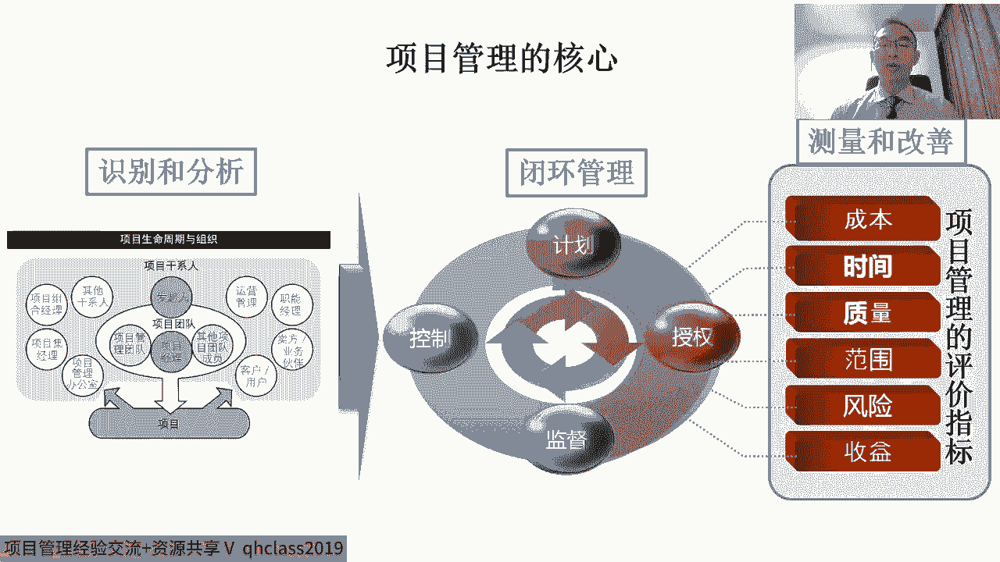

我们说这个既然大家都认了，其实错了也没关系，反正大家一块错的嘛对吧。

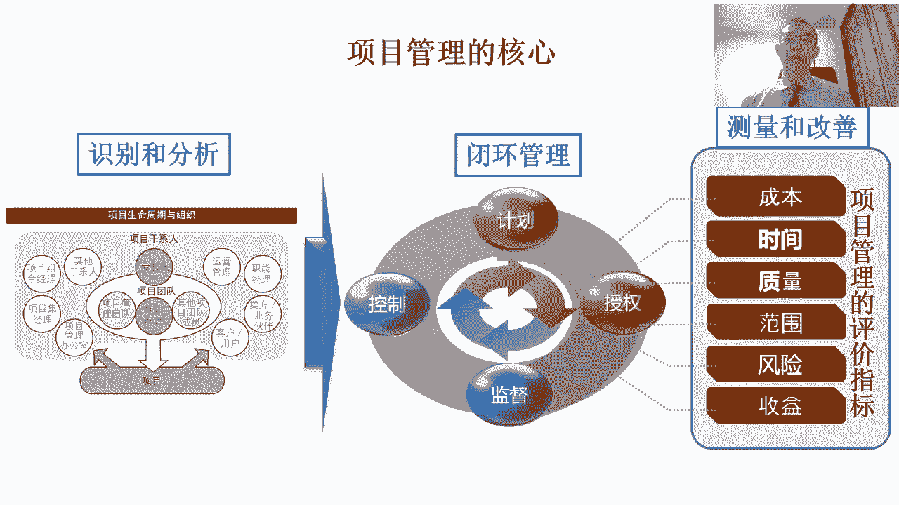

但所以大家如果一块错呢，那就像我们一般会认为是说这个它不叫错。

他是因为我们基于当时的信息跟状况，所能做出的一个最合理的选择。

当然有可能过一段时间看是错了，但没办法。

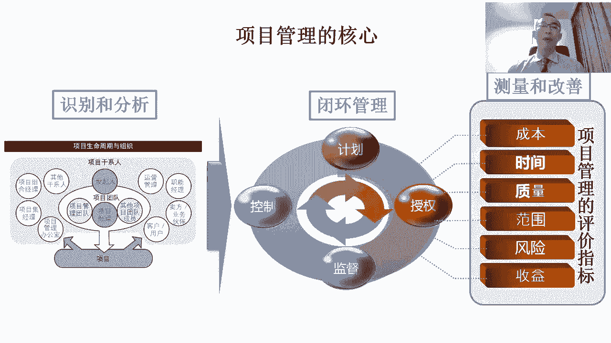

因为在当时那个时点下，我们基于那些信息，反正所有人都已经参与过了，最后对吧。

我们做出来的结论，那就是集体的大家共同的结论，那共同的结论对我们来说就视为是对的。

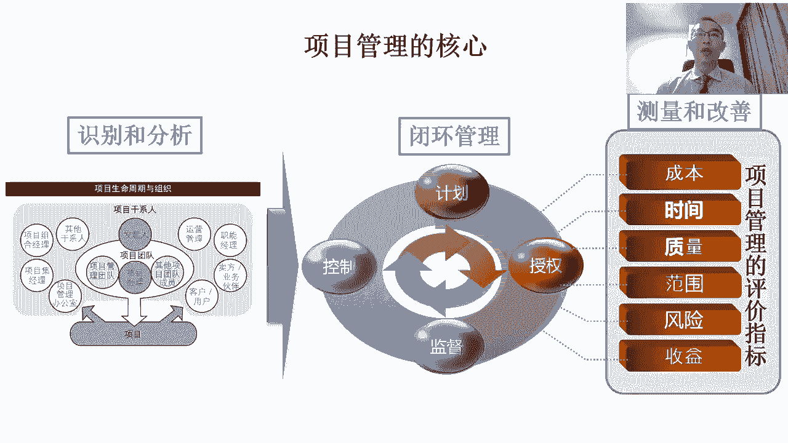

所以呢在这种情况下呢。

我们说呢这个项目呢，它是基于一个集体决策进行管理的。

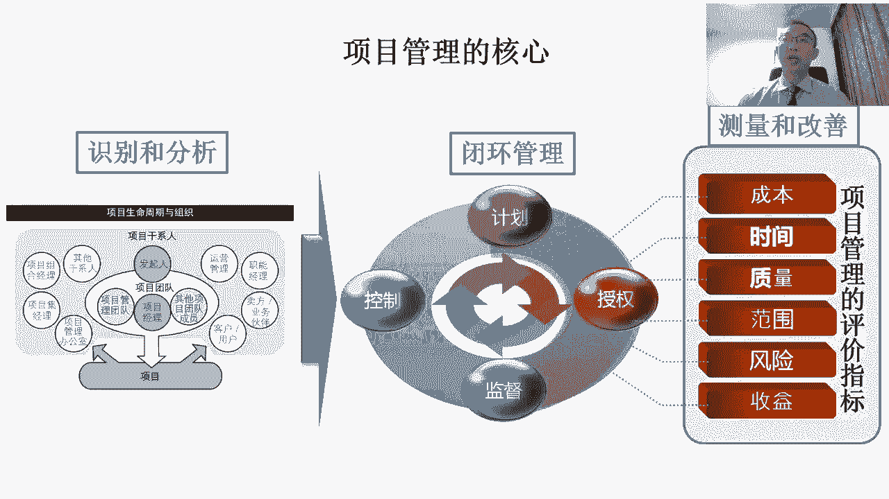

所以这时候呢控制它，其实往往也是基于集体决策进行控制。

所以对于项目经理来说呢，在开展项目管理的过程中呢，我们必须要搭个台子对吧。

这个台子呢我们说就是我们项目的受控机制，那它基本的核心要素就是对吧。

我们要通过项目计划统一大家工作的路径，我们要通过对项目的角色职责的分工和授权。

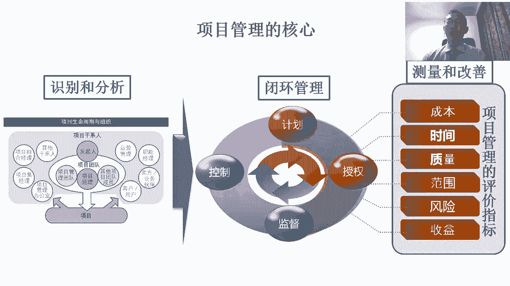

对吧，让大家明白自己要扮演的角色。

和自己可以干什么，不可以干什么，我们在项目中建立建立监督机制。

这样才能确保大家受控，第二要建立控制控制机制，这样的话我们才能够保证是说在项目过程中。

我们能进行调整啊，所以呢那通常呢一般把这个建起来的时候。

就有了受控机制了，然后第三个呢这个为了保证项目过程中呢对吧。

我们能很好的很好的这个朝目标方向去走，他还得有这个测量评价机制。

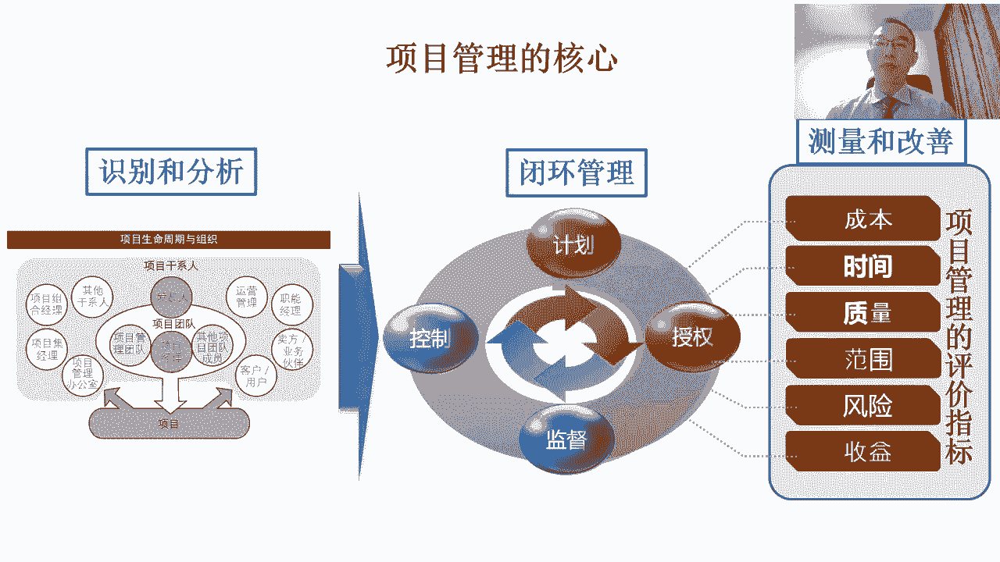

所以就是我们的第三块测量跟改善对吧。

那测量和改善它是基于指标的，所以一般来说项目管理也得有评价指标对吧。

开展项目的评价指标，那项目中的评价指标，它不是只有项目管理的评价指标。

它有业务指标，然后有管理指标，那当然也有可能会有别的指标。

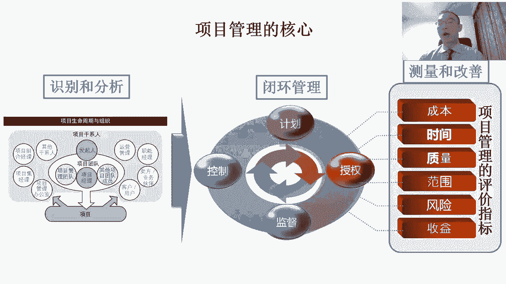

总之呢它得有指标，那如果我们是谈项目管理呢，我们一般关心的是项目管理的指标。

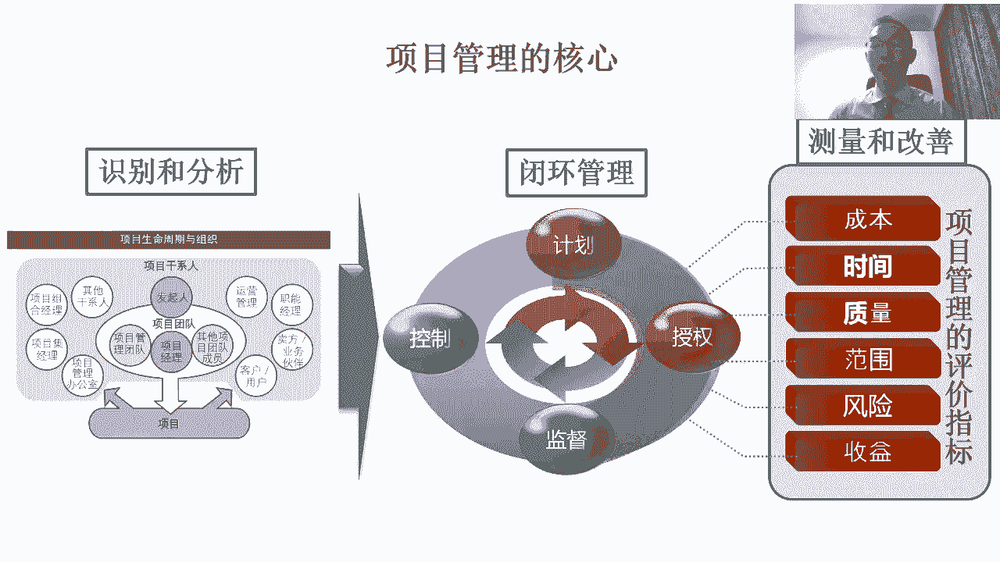

那项目管理指标一般就是啊成成本时间啊，质量范围，风险收益。

当然也可以有其他的，所以这时候我们会看到，项目管理的核心是什么呢，我们把简单的讲了。

其实项目管理的核心是三件事，第一呢一上来呢，识别和分析所有项目中的相关方。

理相关方，第二呢基于这些相关方呢，我们去建立一个让项目受控的环境。

搭个台子对吧，然后把大家管起来对吧，甭管怎么走得。

首先保证大家行动是一致的受控，第三个呢我们要去定义项目的评价指标，这样的话我们在项目往前进的过程中。

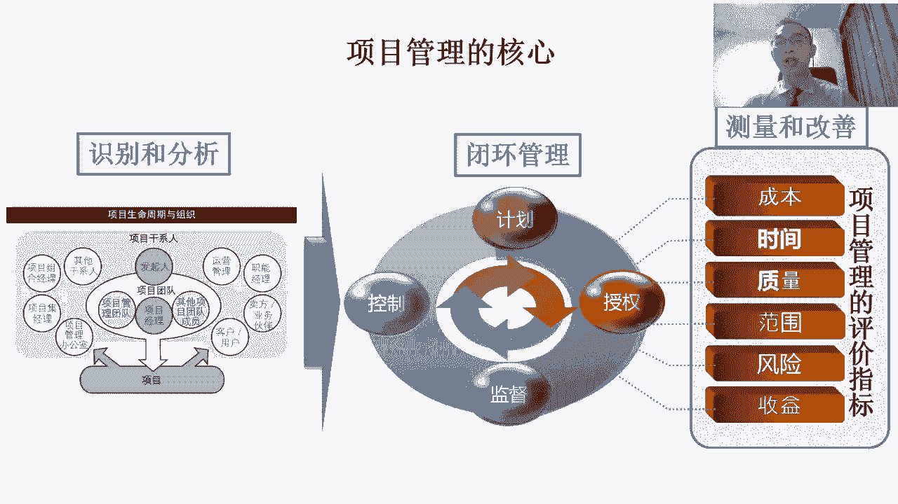

我们才有抓手对吧，知道怎么去调整，所以一般项目管理呢。

它其实这三件事是比较核心的，接下来呢我们再谈下面一个问题啊，就其实刚刚前面呢，我们其实讲的都是关于项目的特点问题，那接下来呢我们要谈的问题是说，这个什么样的企业才适合开展项目管理啊。

那什么样的企业才适合呢，就是我们大家现在看这张图，那这张图呢一直以来啊，我把它称作是说这个建立组织级项目管理体系，的一个未来的蓝图，那很多的时候呢，我们为什么把它作为一个建立组织级项目。

管理体系的未来蓝图呢，是因为是因为呢我们一直认为呢，如果我们的企业，那它能够把这张图上这些机制都建立起来的话，那这个时候呢，其实在在我们的企业里开展项目管理，就会变得容易很多很多呢。

其实这个西方项目管理非常成熟的对吧，相当成熟的企业，对，尤其很多美国的企业，它其实我们会看到的是说呢，它的其实公司内的项目管理机制，就是按照类似这样的一个模式在运转的。

所以这时候呢在里面当项目经理就比较容易，像早年我在摩托拉当项目经理，摩托拉是一个曾经项目管理非常成熟的企业，包括后来呢在索尼爱立信当项目经理，他也比较成熟，这时候当项目经理就很容易，为什么呢。

因为大家都是按照项目管理的规章制度，要求做事情，那公司内呢很多基础性工作都做好了对吧，在企业里，什么叫项目对吧，什么项目怎么分类，怎么分级对吧，什么类别的项目按照什么管，什么级别的项目。

审批到谁那儿对吧，项目的委员会是怎么构建的，都有哪些人，而且都是固定的对吧，怎么评价项目做得好或不好对吧，项目这个遇到了问题风险对吧，变更怎么去评估到谁，那去评估，然后那这些东西呢。

其实在成熟的项目管理的企业中，它都是有的，有了之后呢，对于项目经理来说呢，他做事就容易对吧，是因为他首先拿到了项目，他知道自己这个项目对吧，应该属于什么类别，什么级别，遇到什么问题。

找谁什么自己可以管什么不可以管，这时候当项目经理就容易，第二呢我们说呢在这个这张图里，我们会看到呢这个企业呢对吧，它这个它项目组合管理，项目群管理和项目管理的机制都是具备的。

而且甚至有些东西呢都已经逐渐形成了流程化，在这种情况下呢，我们会发现呢干项当项目经理就容易了，为什么呢，因为你即使不知道怎么管，但公司制度流程在那摆着呢，你就顺着制度流程做就可以了对吧。

所以在这种情况下呢，第二呢项目跟项目遇到了冲突，抢资源的时候，那这时候呢成熟的企业它并不复杂，就像我们之前的时候在摩托拉的时候，项目跟项目要抢资源，那那这时候对我们来说。

我们只要需要去我们的项目管理办公室，去找我们负责项目组合管理的对吧，负责项目组合管理的同事，那一般都是很资深的同事，然后我们到他那去看对吧，因为他那有什么呢，整个所有项目的优先级排列。

然后我们看谁的项目排前面，那对于职能部门也好，领导也好，谁项目排前面，谁优先级高就支持谁，那对于我们作为项目经理也是一样对吧，项目跟项目产生资源冲突，那我们就去看优先级嘛，谁排前面，那资源就是谁的对吧。

如果我排被排在了后边，我又觉得我很不甘心的话，那这时候呢我要想办法去上会，去项目管理委员会上会，我要去通过对吧，我们我们要去通过摆事实讲道理，通过数据去证明，我的那个项目。

应该比那个另外一个项目更有价值，应该优先级更高，那如果我能去说服对吧，如果能说服我们的公司跟委员会，让觉得我的优先级更高的话，那这时候我就能优先获得资源的支持对吧，我们说这就是项目组合要解决的问题。

项目的优先级，那基于项目的优先级，再去选择如何分配跟平衡资源，那我说在一个成熟的企业里，他都是有的，但有的时候这时候当项目经理就容易，因为大家就按照工商公司的规章制度来嘛。

再有呢我们说的这个成熟的企业里边呢，项目经理是有他的职业发展通道的啊，项目经理要分级，很多时候一些项目经理，他可能变成了专职的岗位，或者是说在有些企业里边的，即使不是专职的岗位。

但是至少呢项目经理他是有一种能力认证的，那这时候呢这个在企业内呢，大家愿意当项目经理，是因为当项目经理呢能证明自己有能力对吧，能被认可，然后能够去晋升，所以呢，这时候就由我们说的这个项目经理的人才培养。

再有的这个成项目管理，成熟的企业里边呢，它项目管理它是有知识库的对吧，它有文档管理的机制，然后有组织过程资产，有各种经验教训，那这时候当项目经理呢，他就不会特别难，为什么呢，因为我们可以基于前边的对吧。

过往多少年的企业，在项目中积累的经验和教训对吧，我们提前先去学习它，然后去识别它，然后这样的话做在开展项目的过程中呢，我们才真正的是站在前人的肩膀上，所以成熟的企业它是有这个项目管理的。

知识库管理和组织过程资产的，在我们一般成熟的企业呢，我们说由项目转运营，它也都是有过程的对吧，因为项目转运营不容易，它可能容易出问题，所以呢项目管理成熟的企业呢，它往往会对项目转运营的这个过程呢。

其实做很多严格的要求，包括验收标准啦，包括哪些人去负责这种这种审核检查评估了，包括过程中对吧，需要经过哪些环节，那这些呢他如果一旦明确了之后，对于项目经理来说呢，他也不太容易犯错误。

而且验收过程也会相对容易，再有呢一般成熟的企业呢，它一般都是项目管理办公室，就是我们说的PO，因为PMO呢是去支撑整个这个体系的一个，非常重要的主责部门，那有了PMO呢，就有人呢。

这个替整个企业的项目管理建设操心对吧，因为这就是他的工作，项目管理办公室对吧，我们说就像质量部，他一定会关心公司内的质量管理建设对吧，我们说的这个风险管理部门，肯定关心公司内的风险管理体系。

战略部门得管公司战略的事对吧，财务部门管财务的事儿，人力部门管人力的事儿，那项目管理办公室，其实就是替整个公司操着项目管理的心，所以呢这个成熟的企业，它一般都得都有项目管理办公室。

然后有了项目管理办公室呢，项目经理干活就容易，为什么，因为项目经理有困难可以找项目管理办公室，对于项目管理办公室来说，项目管理办公室其实最首要的，首先的职责其实是要去支持项目经理对吧。

一般我们会认为项目管理办公室，她应该是项目经理的娘家，他其实项目管理办公室应该是项目经理的组织，那一个企业里边要没有项目管理办公室的时候，这样项目经理会觉得很孤独啊，就很无助。

你会发现呢各部门都管着各部门的事儿，但是如果项目经理，他本身没有一个归属的部门对吧，他干着项目管理，用着项目管理的思想方法和工具，但是却找不到一个部门去支持他，去证明他是对的对吧。

当项目管理的方法跟别的这种管理，产生矛盾的时候，没有人对吧，去去在后台去支持他，那这时候项目经理就会觉得很孤单对吧，很孤立无援，那项目管理办公室PO出现的目的，其实就是。

为了成为项目经理们最强大的一种后台组织，所以成熟的企业他一定得有项目管理办公室，他是张罗组织培养项目经理对吧，然后呢去去支持项目经理的成长，帮助项目管理对吧，在企业内变成一股力量。

然后呢去支持整个公司的项目管理体系，建设的一个主责的部门，所以我们说呢一般这个企业要成熟啊，它项目管理要成熟，他这些特点是具备的，那这时候在这样的环境里边呢。

