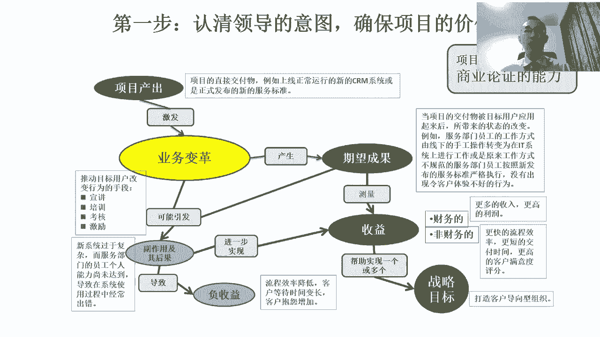
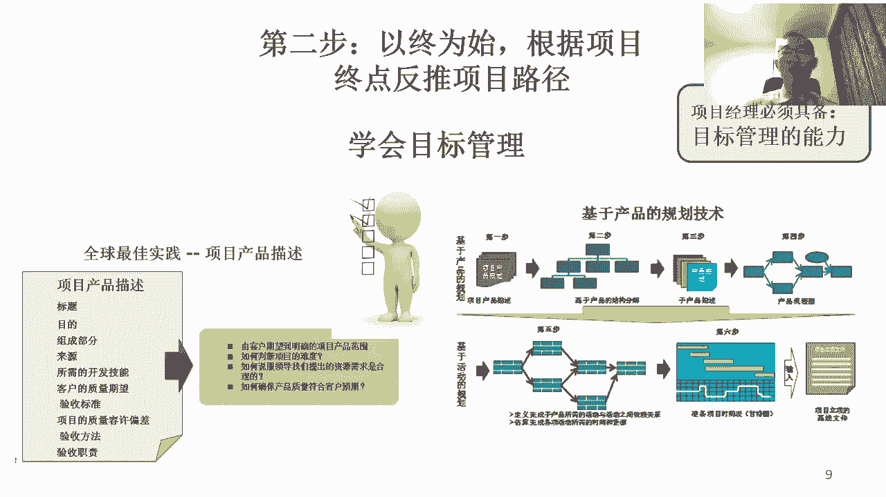
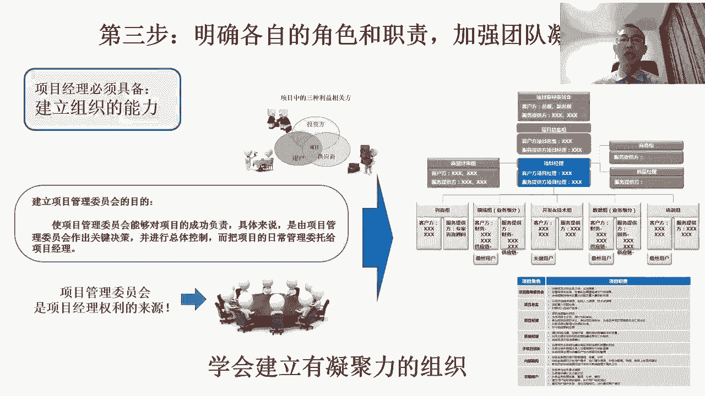
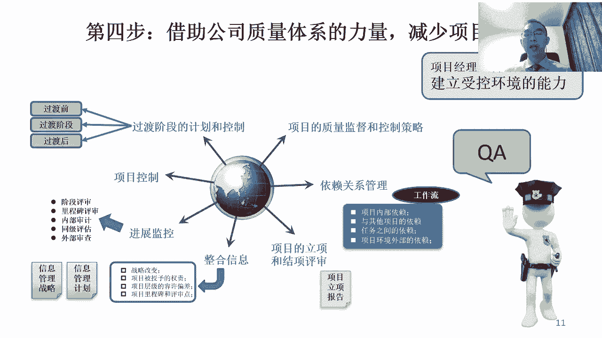
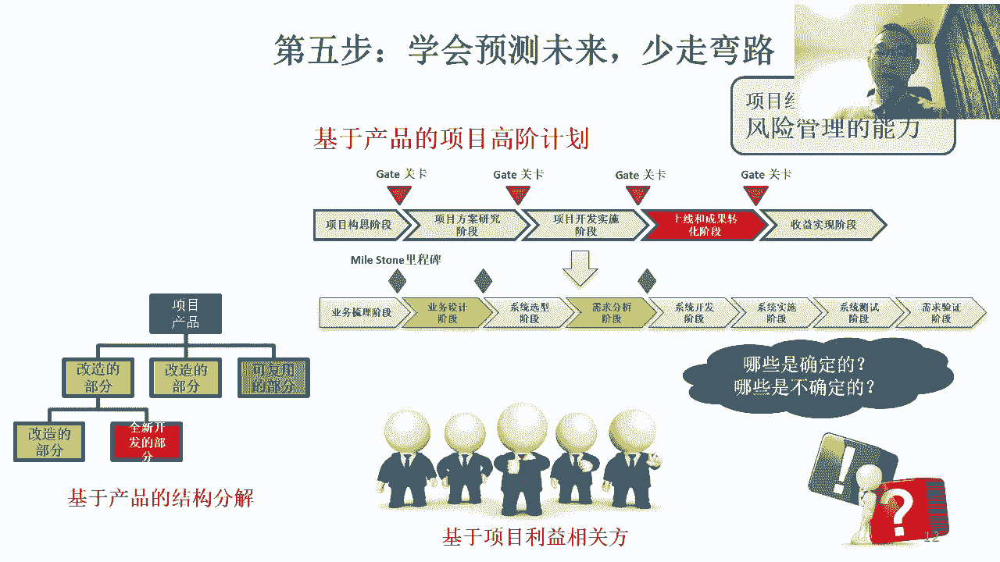
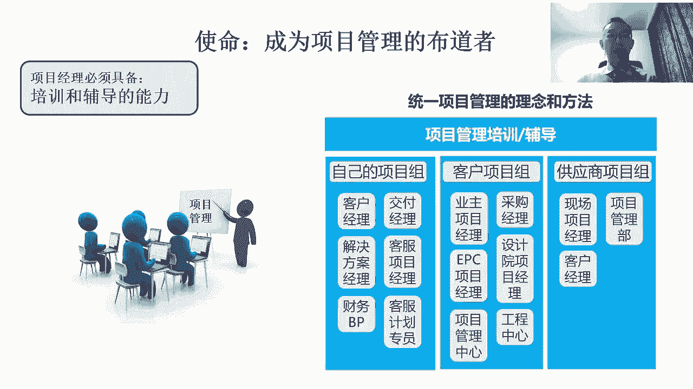

# 中国特色项目管理--六步工作法 - P1：1.项目经理六步工作法 - 清晖Amy - BV1d1421C7ce

所以呢我们说我们这个微权立项的项目管理呢，它其实就是基于这样一个场景下，那他写出来这本书，然后这个微权利下的项目管理呢，其实可能如果在欧洲啊，他其实没有这么大的应用场景，你是为什么呢。

因为欧洲它欧洲美国它都发达国家，发达国家呢项目管理机制流程成熟，项目也没那么大挑战，第二大家配合度也高对吧，咱也犯不着的，非得写本书，叫威权力下的项目管理对吧，咱直接就写这个项目管理。

如何按流程开展工作就完了，但是在我们国家对吧，就像之前所说的一样，这个项目管理的环境不成熟，然后呢干的事挑战又大，创新性又强，风险又高，时间又紧，然后呢那对于项目经理来说，那我们必须要去锻炼对吧。

在这样一个有挑战的环境下，还能把事干出来，这时候就涉及到了微权利下的项目管理，那我们说呢这个微权利下的项目管理，它必然比常规的项目管理它更难对吧，就像我们说的这个项目经理呢，在中国啊干项目经理这件事。

他势必是一个费心费力的活，这好干的活儿呢，他肯定犯不着当项目管，当项目干的，当项目管的活儿都是不好干的，所以项目经理呢很锻炼能力，那项目经理需要什么样的能力呢，我们说这个第一步，我们说项目经理。

首先需要的是能商业论证的能力，商业论证的能力是什么能力呢，就是当我们作为一个项目经理啊，我们接了一个事之后，我们首先要思考的问题是这个事对吧，为什么会产生这么一个事儿，为什么会产生这么一个任务对吧。

我们项目的发起方，他最终所需要的收益是什么，所以作为优秀的项目经理，当我们接到了一个项目的任务之后，我们首先思考的不是说如何去实现项目的产品，我们应该理论上首先思考的是说，为什么会产生这么一个任务。

发起方是谁对吧，什么级别的领导，谁发起的，他所关心的收益是什么，为什么要去想这个呢，因为最后这个项目成功不成功，他其实主要取决于项目的发起方，最后他所预期的收益有没有达到，如果他预期的收益达到了。

那往往大家会认为这个项目是一个成功的项目，如果说我们这项目的产品，这交付的再快，但是最后发起方的收益没达到，那站在发几方的角度来说对吧，投资方发几方，他们觉得这个事其实是一个失败的时。

所以呢我们通常说啊，项目经理要有大局观啊，大局观要好，能站在领导角度考虑问题，那我们得首先得知道，当我们接到一个项目的时候，我们得首先思考这什么级别领导发起的对吧，站在那个级别的领导。

他关心的收益是什么，他怎么去判断这个项目做得好还是不好，那这时候我们其实在这张图上，我们关心的是什么呢，收益，然后当我们想明白收益之后，我们接下来再反推思考的是说。

如果要去实现发起方的领导所关心的收益的话，那到底这部分收益是谁创造的对吧，换句话说用户是谁，哪一部分用户被改变了之后，他能够让发起方获得他所需要的收益，那那我们说的这个用户被改变之后的状态。

通常我们把它称之为叫成果或者叫期望成果，换句话说呢，这个当这个项目的产品啊被用户用起来了之后，我们所期望的用户发生的改变是什么，这种改变一定是相对的，换句话说呢，他一定是说对吧，从最开始呢。

我们项目的发起方想改变一批用户，这批用户一旦被改变了之后，发起方就能获得他所需要的收益，所以呢从一开始我们接了一个项目之后，我们就得首先要思考的问题是谁发起的，第二发起方向改变谁对吧，哪些用户想被改变。

他想改变哪些用户，他想把这堆用户从什么状态改变成什么状态，所以这时候我们要看用户现在什么状态对吧，项目的发起方，他所期望的用户被改变之后的状态是什么，通过这两个东西的对比，我们才能思考的说。

我们到底要形成什么样的一个项目产出，才有可能能够用较容易的方式去把目标的用户，由一个状态改变成另外一个状态对吧，然后另外一个状态是什么呢，所期望的状态，就是那个能够对发己方带来收益的状态。

然后我们再反推思考时，说，我们的项目到底我们的产出跟交付应该是什么，这时候呢其实呢我们也是在用一种反推的方式，我们是从接到了一个任务对吧，思考项目对吧，这个思考这任务是谁派的，思考发起方是谁。

思考他关心的收益，那由他关心的收益呢去思考对吧，那个他希望哪些用户被改变，那由这个用户被改变的状态，我们再反推思考的是说改变用户的用什么方式，根据这个方式，我们在反推是说。

这个到底我们项目的交付是什么对吧，一个什么样的交付对吧，能够较容易地让用户发生改变，能把它改变成一个发几方所期望的状态，在这个状态下，恰好发起方能够获得他所需要的收益，而这个收益恰好又能够。

支撑公司战略目标的时候，那说明这件事是一个对公司，对发起方很有价值的事情，然后我当我们把这个问题想明白了之后，我们再去思考，我们到底这个项目应该产出一个什么样的项，目的产出跟产品才有可能对吧。

帮助我们项目的发起方和用户，去实现所期望的改变和预期的收益，所以那这个过程是什么呢，被我们称之为叫商业论证的过程，为什么叫商业论证呢，是因为当我们最开始做项目的时候，这件事还远远没有发生。

而且甚至有可能，这件事都不在项目经理的工作范围之内，项目经理只是负责对吧，组织一帮人去创造出项目的产出和产品，他并不一定负责项目的产出跟产品出现了之后，拿着产出产品去改变用户跟创造收益。

那很有可能是在项目范围之外的，如果产品类的项目，那都叫产品生命周期管理了，但是我们一定要知道的是说，我们前面建设项目产品跟创造项目产品的目的，不是为了要这个产品，其目的是为了创造出一个有利于后边实现。

成果转化和收益实现的产品，所以如果前面创造项目产品的项目经理对吧，创造项目产出的项目经理，当时在创设计跟创造项目产出的时候，而没有思考，后边到底谁拿着这个项目产品去改变用户，跟实现收益的话。

那前面这个产品，它必定不是一个非常科学的产品，所以我们说呢作为优秀的项目经理呢对吧，虽然我们干的是前面创造项目产品的事，但脑子里边必须得想着，后边成果转化跟收益实现的事儿，我们得根据我们后边的这种项目。

成果转化跟收益实现的理解，再去决定前面我们怎么组织资源去实现，项目产品，要实现的是一个什么样的项目产品，所以通常这是第一步，项目经理呢要能够根据领导的意图，思考项目的价值。

然后去论证实现项目收益和价值的路径，然后再去思考我们需要的项目产品是什么。

通常的项目的产品就是我们所说的项目的目标，对吧，所以呢项目管理是一种典型的目标管理的方式，那项目经理呢这个项目要想管的好，得首先得目标得清楚对吧，我们说这个项目要没有目标啊，这就不叫项目管理了。

所以项目管理呢，它其实永远的是先确定项目的目标，然后呢再组织对吧，跨职能的，跨相关方的组织资源，去用最短的时间，最低的成本去实现目标，所以项目经理呢他一定要对目标有一种执着，这个执着的概念是什么呢。

这个项目从最开始目标不清楚的话，我们一定要花足够多的时间去把目标搞清楚，然后呢那这个目标呢在项目管理中啊，他往往这个最开始的目标就是，我们说项目的交付被我们称之为叫项目的产品。

既然这项目的产品吧绝对有项目验收标准，这个项目的验收标准呢它得是目标的用户啊，发起方包括项目，我们建设团队，大家达成共识的，这才叫项目的目标，所以项目的目标呢，它不仅仅是用户的目标或者客户的目标。

也不一定是供应商的目标，或项目经理自己的目标，项目的目标应该是所有的项目，利益相关方达成共识的目标，这样的话大家对吧，努力的方向才是一致的，所以呢这个项目经理早期的时候，一定要花很多的时间呀。

这个在还没有开始干活之前，就组织所有的相关方案，共同去定义项目的目标和验收标准，这样的话才能够保证大家从一开始，是往一个方向去努力的，有了目标之后呢，要做分解对吧，项目管理呢要基于目标做分解。

然后呢基于分解之后的目标去制定项目的计划，然后呢，那这个时候呢我们其实项目的计划的工作呢，其实才是围绕着项目各个不同的目标，而制定出来的工作计划，这时候呢项目中所有的相关方呢，按照项目的计划开展工作呢。

才能够真正的做到的是说呢对吧，能够最直接的去实现项目中各种不同的目标，所以项目经理呢必须得具备目标管理的能力，那目标管理的能力，首先要具备的是说能够去组织不同的相关方，去共同定义项目的目标。

要有明确的验收标准，然后要基于目标做结构化的分解，大目标分成小目标，大目标变阶段目标对吧，阶段里面的目标可能变成工作包的目标，那项目中所有的人，未来他的工作都应该是。

围绕着一个又一个的目标来去规划和开展的，所以这是我们说这个第二步。

那以终为始，根据项目重点反推项目路径，第三步呢更难，我说前面两步就不太容易，第一步呢商业论证对吧，还没干活之前先论证这个事，你一旦干完了之后对吧，到底呢能够去带来什么样的收益，去改变什么样的用户。

第二步呢，我们说呢这个项目目标最开始肯定是不清楚的，但是项目经理就要在目标不清楚的情况下，组织大家去共同定义目标，而且让大家都接受，而且基于目标做分解跟形成项目计划，第三步更不容易，为什么呢。

我们要把一群原来各自为政的相关方，变成一个能齐心合力，有执行力的组织，那这个组织被我们称之为叫，项目组织或项目团队，那如果我们想把一群相关方，构建成一个项目组织呢，我们就得建立项目管理委员会。

项目管理委员会呢是项目经理的，去控制整个项目过程，建立项目秩序的一个最重要的角色，因为通常我们会认为呢，其实项目经理他本身对吧，我们说只有责任没有权利，项目经理必须要就着自己的责任对吧。

把各相关方的领导组织起来，形成一个集体决策机制，在借助这个集体决策机制，给项目经理自己赋予权利，借助集体决策机制的力量对吧，因为这个集体里边所有相关方领导都在，那这时候呢如果所有相关方领导达成共识了。

那这样就意味着说，所有的相关方肯定都得听这个的对吧，因为各自领导都在里边，所以项目经理呢如果想建立项目的秩序对吧，他就得先练着能成立项目管理委员会，给所有的相关方成立一个集体决策组织，然后呢。

然后呢接下来呢那我们就要想办法通过对吧，递交方案，递交建议，组织开会的方式去影响这个项目管理委员会，那去做出来自己所需要的决策，然后呢再把这个决策授权给自己，让自己代表项目管理委员会对吧。

去推动监督落实，整个项目管理委员会决策的落实的过程，并且把结果反馈给项目管理员会，这时候呢项目经理才有了权利，项目经理的权利是哪来的呢，咱知道这个项目经理啊，他的权利跟职能经理的权利的来源。

最大的区别是在于，职能经理的权利是被组织所授予的，当你去被任命到那个岗位的时候，也就获得了相应的权利，但项目经理的权利是自己争取来的，项目经理的权利是自己给自己授权的，那项目经理自己给自己授权的方式。

就是我们把我们发现我们项目这活儿要干，他有一大堆相关方，把相关方识别出来了之后，那我们要把相关方的领导和代表组找出来，然后呢我们要把相关方的领导跟代表组织起来，形成一个委员会，变成个集体决策组织。

然后呢，我们要让这个集体决策组织的委员会对吧，授权给自己，可以代表委员会对吧，去落实委员会的各项要求和决策，同时监督大家的这种落实过程，执行过程，同时把结果反馈给委员会，并且对于项目经理来说对吧。

项目经理一直以来最大的权利，就是有给项目管理委员会汇报的权利，项目经理呢一定要善于借助汇报的过程对吧，然后呢去提出自己的想法和建议，然后呢去影响委员会的决策，然后呢再通过委员会去影响项目中。

所有其他相关方的行为，所以呢这个委员会呢是项目经理呢权力来源，权力的来源，那所以项目管理的基本逻辑是什么呢，有了项目管理委员会，那其实呢项目经理才有可能让项目过程受控，所有的相关方的步调才有可能一致。

是因为项目管理，我们说各相关方有代表，那代表集体决策，项目经理呢善于张罗各相关方代表，形成集体决策，在代表集体决策去落实，这时候项目经理就有了权利，这个权利是项目管理委员会，赋予项目经理的权利。

所以我们再简单的讲啊，项目经理的权利是哪来的，项目经理的权利是项目经理自己争争取来的，项目经理怎么争取呢，他得把相关方都找出来，把相关方的领导跟代表凑一块，形成一个集体决策的组织，然后呢对吧。

他是靠责任去把大家张罗起来的，然后呢将这个组织呢授权给自己对吧，代表委员会呢去监督委员会的决策的落实过程，通过自己给委员会做汇报，去影响委员会的决策，通过委员会给自己的授权，去落实和监督决策的执行。

那这时候他的权利是来源于委员会，授予自己的权利，首先有了这个过程呢，项目经理才具备了建立项目组织的基础啊，然后呢这样的话呢，我们有了这个项目组织的基础之后呢，之后呢我们所需要做的是要去思考对吧。

项目中的这些相关方对吧，大家应该形成一个什么样的组织对吧，怎么分层，怎么分级对吧，然后呢谁谁负责，谁负责决策和指定方向，谁负责组织协调，谁负责带着不同的人对吧，干不同的具体活，谁负责做监督。

那这时候呢我们要形成一个组织结构，那通常这个组织结构，就是我们说的项目的组织结构，就是大家看右边这张图对吧，所以项目经理呢光有相关方还不行，我们要把我们这个所有的项目中参与的人。

变成一个就像企业组织结构的一样的，项目的组织结构，项目的组织结构呢就要分层，要分类对吧，谁是客户，谁是供应商对吧，谁是领导，谁是员工对吧，至少分三层对吧，干活的是谁对吧，组织协调的是谁。

再往上做决策的是谁对吧，然后在这个过程中呢，那这个站在不同的层面，不同的人之间的关系是什么，谁向谁汇报对吧，谁领导着谁，谁跟谁之间要协同，那这些其实都是我们在定义组织结构的时候，要去考虑的。

所以呢首先要有组织结构图，第二呢这个项目组织中有各种角色，每个角色呢又要明确大家各自的职责对吧，所以这时候呢当我们有了项目的组织结构图，囊括了所有的相关方对吧，然后呢这个组织结构中有集体决策的组织。

被我们称为叫项目管理委员会，那这时候呢这这组织就形成了对吧，委员会决策，项目经理组织协调，底下小组经理带着不同的小团队干具体活，组织结构有了汇报关系，有了大家里面各自的角色和职责有了，那这个时候呢。

这个项目才变成一个，真正能够具有执行力的组织，所以这是我们抓了这个，首先第三步要建立项目组织，如果没有这样的一个项目组织呢，这个项目过程啊，大家这个劲儿都使不到一块去，那使不到一块去呢。

他势必不可能在一个较短的时间之内去完成，有挑战性的目标，但是呢我们说在这个西方成熟的企业里边吧，他没有这个问题，因为在很多西方成熟项目管理，非常成熟的企业里面呢，这个项目的组织结构都固定了。

角色职责也固定了，而且呢各相关方呢对这个项目组织结构中，各自的角色职责也比较熟悉了，所以这时候呢只要一成立项目呢，就直接套用原有的组织结构，而且大家会默认里边自己的角色职责。

这时候吧这个建立组织就没有难度，但在我们国家很多企业里边，尤其很多甲方乙方的工作，对我们客户也不懂项目管理，供应商也不懂项目管理，我们自己也不懂项目管理，这时候大家凑一块形成个项目组。

那大家各自按照各自的理解干着，对自己有好处，对别人不一定有好处的事，这时候这项目团队他就组织不起来，所以这时候呢他就需要项目经理能够对吧，然后更多的去锻炼自己，那如何能够把这些对吧。

原来目标利益不一致的人，把它统一起来，形成集体决策，然后去建立共同的秩序，把大家分工分清楚了，这时候在整个项目的过程中，大家才能齐心合力的去实现有挑战的目标啊。

这是我们的第三步，我们说呢有了项目组织对吧，明确了项目的收益，有了项目的目标跟计划，那接下来要考虑的问题是什么呢，过程控制问题，当我们在项目过程中去去这个思考，项目过程控制的时候呢。

它其实跟组织内思考过程控制是一样的大招，一直以来呢过程控制，过程控制的主要的这种管理模式，就叫被我们称之为叫质量管理，那尤其是质量体系，他其实很多的时候做的就是过程控制，那项目中呢它也有过程控制，项目。

过程控制呢，它其实跟质量体系的过程控制有点像，而且很多时候吧，他最好能去借鉴一下，公司质量管理的一些要求对吧，因为每个企业它但凡大到一定规模，它都有公司的质量管理要求。

质量管理要求呢他其实一定也是基于啊，就公司内什么什么制度是必须遵守的，什么什么对吧，什么节点上必须要做评审，然后呢哪些工作必须要受到公司的监督，哪些事必须要去归档，那这些其实是往往一个公司质量体系。

它所要求的东西，那做项目的过程中呢，我们要继续建立项目的受控机制呢，那那所以往往呢第一呢，我们要熟悉公司的质量体系是什么，第二呢公司的质量体系的要求，我们在项目中肯定是要落实的，第三呢我们在过程中呢。

我们也要借助公司质量体系啊，尤其是什么这个内审啊，然后或者是什么日常检查的力量帮助我们呢，在项目过程中，让那个原先项目计划中所要求的工作，也要落实下去，再一点的这个通常啊，这个项目的受控机制怎么建啊。

一般就是我们大家看这个图上其实列了几个，项目过程控制中，我们要建立项目受控机制的时候，他一般要做的事情，那针对一个项目呢，项目也要有自己的一个质量监督，跟控制了一个大的框架或策略。

这一般在项目立项的时候，我们我们得把这东西定义出来对吧，定义出来，主要定义的是说项目质量工作怎么管对吧，我们要设多少个评审点对吧，那过程中谁负责监督对吧，比如说是QA负责监督还是项目经理负责监督。

他都有一个大的策略对吧，如果出现了问题对吧，我们找谁去汇报对吧，谁来做主，谁来做评审，谁来帮着做推动做纠正，那这些从最开始的时候，它其实都是我们一个大的质量监督跟控制，策略的东西，所以最开始得有。

然后第二呢在项目过程中对吧，要控制的过程中，因为项目中很多的小团队他都是并行的，那他们之间的依赖关系得有人去做协调，去做平衡对吧，否则大家都各自干乱了，在我们这个项目过程中呢，我们说项目的立项和结项。

永远是项目管理过程中啊，这两个最重要的评审点对吧，这个立项要是没管好，这后边过程肯定干的就很混乱，然后立项的目的，其实就是为了让大家在真正干具体活之前，得首先把怎么干，这个活是讲明白，然后再干对吧。

项目管理的基本遵循的逻辑是想明白再干，项目管理一定不是说干明白的，或者是说干完了还没明白，那肯定就属于不叫项目管理，项目管理是尽量让大家先把该想的事想明白，然后再干。

当然我们说有些事实在想不明白也得干啊，但至少呢能把尽量想明白的先想明白，所以立项呢，其实主要就是评判大家是不是想明白的啊，然后呢结项也很重要，为什么呢，因为很多的时候啊。

这个结项如果这从最开始这项目要没有结项，大家最后干的他没有目标和目的，大家不知道最后图什么，很多时候结项的过程也是复盘的过程，总结经验教训的过程，去评价谁干得好，谁干的不好对吧，该奖励的奖励。

该惩罚的惩罚，该归档的归档，那这个过程在项目中是必须得有的，如果没有的话，项目就没有了终点，项目没有了终点的话，大家就没有冲刺的动力，也就没有努力的动力，所以项目的立项和结项。

一直以来都是项目两个最重要的节点，这肯定是要去控制的，再有呢在开展项目的过程中呢，项目要做信息收集对吧，你不收集信息，我们就不知道大家活儿怎么干的，不知道活儿怎么干的，就谈就没有办法做偏差分析。

没有办法做偏差分析，项目过程中你就没有办法对吧，去去做评价和做管理，所以项目的信息收集很重要，那项目的信息收集呢，它往往分成两种方式对吧，一种是常态化的信息收集，比如说什么周报了月报，第二种呢。

项目的信息收集是要在关键节点上做收集对吧，什么阶段评审，里程碑评审，他其实在关键节点上让大家为了过评审，他得交项目的汇报资料报告，其实这也是一种信息收集，然后项目的过程中呢肯定要做进展监控对吧。

项目过程中要监控监控的，常见的方式就这么几种对吧，阶段评审，那阶段评审一般就是阶段关卡评审，就是git review啊，那get review的目的呢其实是确保在项目过程中对吧，他有继续投放资源的价值。

一般是get review，第二项目过程中会做里程碑评审对吧，叫max stone的评审，那一般里程碑评审的目的是为了评审，因为项目中会有多个不同的任务在并行对吧。

这个这每隔一段时间我们得了解一下这些任务，到底这个这个进展顺利不顺利，那其实衡量项目进展的一种主要的方式，其实就是去评审里程碑，是否按照预计的时间完成对吧，所以里程碑是用来做什么呢。

其实是用来做项目过程中的这个进展偏差分析，来对衡量项目进展用的项目过程中呢，有的时候要做内部的审计对吧，内部审计的概念是我们那些检查一下，这个项目经理或者项目中不同的成员，他汇报的这个东西。

是不是跟他实际干的是一样的对吧，别这个汇报了一套，实际干的是另外一套，审计的目的是为了解决汇报跟实际相符的问题，然后之后呢同级的评估，那很多的时候单看一个项目看不出问题来。

但是如果我们把一堆同类的项目放一块，做比较的时候，那这时候我们就能评出来谁做的好，谁做的不好，在我们有的时候呢，可能需要借助外部的审查的力量，有时候借助外审对吧，有的时候自己检查不出来。

有的时候外部的专家进行审，他更容易审出来，所以这些都是进展监控的方式，再有一点呢，这个项目过程中控制的一个重点呢，就是这个被我们称为叫项目的过渡啊，过渡是什么呢，就是由项目的状态啊进入到运营或者运维。

或者呢这个比如说呢如果是产品类的，就是上市，那如果是信息化系统的，那可能就是上线切换，总之呢由项目状态变入到正常状态，正常的运营或生产状态的时候，这个过程中对吧，它往往容易暴露很多问题。

所以呢往往也是项目过程中呢，它必须要管控的一个重点，确保我们在这个过渡之前上线，上市之前已经做了充分的准备对吧，过程中呢提前已经做好了各种的预案，出了问题我们能及时调整，包括过渡完了之后呢。

之后我们能够有一个试运行期，去保证我们这个过程中，能够帮助我们这个项目，顺利的由项目状态进入到一个正常的运运营，运营或者生产状态，那这些过程呢其实都是需要前期在项目立项，立项的时候要做规划的。

我们要提前把项目的收控机制预埋进去对吧，所以我们得有有有策略对吧，我们从这然后呢要有阶段，要有关卡，有get有里程碑，那从最开始就思考了对吧，谁来做审计，谁来做评估，怎么评估，怎么审计。

怎么收集信息对吧，立项立项和结项的时候，到底评审是什么，找谁来过来评审，那这些东西呢都是在项目立项阶段时候，预埋进去的，项目的受控机制，预埋进去项目的受控机制，我们才有可能在项目过程中。

才能够让项目过程受控啊，这是第四步，所以呢项目经理必须要具备呢。

能够建立项目受控环境的能力之后呢，我们说前面那四步都做好了之后呢，其实绝大多数的风险已经被规避了，那这个时候项目经理才能腾出来时间呢，我们去管理那些对吧，少量的风险，这就像之前所说的，风险太多。

项目经理没法管，所以呢项目经理必须要通过项目前边的，我们所说的对吧，我们的商业论证啊，我们的目标和计划的定义对吧，我们的项目的组织结构的建立，秩序的建立对吧，然后包括受控机制的建立。

去规规避掉那90%的风险，然后可能在剩下不到10%的风险，咱可以按照项目风险管理来管了，所以这时候呢我们按照项目风险管理来进行，管理的时候呢，我们要学会项目风险管理对吧，那项目风险管理呢很很。

项目风险管理基本套路是差不多的，风险的识别，风险的评估对吧，然后组织大家去制定识别出来的风险的，这个风险的预案对吧，或者叫应对措施，然后呢再组织大家去落实风险的应对措施，然后呢应对措施落实完了之后。

我们再去看效果怎么样，然后周而复始，不断的识别风险，评估风险，制定应对措施对吧，然后落实再评估，风险管理呢是闭环的，那往往呢从最开始的时候识别的时候呢，这个我们往往最好能够，这个按照一些逻辑来识别。

我们最怕的就是漫无目的的识别这个风险呢，对吧，其实之前我讲风险管理的时候，也大概讲过，识别风险呢，它至少可以按照三个思路来识别，第一呢按照项目的产品做产品分解，就最左边的项目的产品就是项目的目标嘛。

当我们再去分解项目，定义项目的目标跟分解项目的目标，把大目标变成小目标，化整为零的做结构化分解的时候，其实也是帮助我们更深刻地去理解这个项目，最终的交付是个什么的，在这过程中，当分解的时候。

我们必然会发现这个分解之后的产品，有的是我们熟悉的风险就小，有的是我们不熟悉的风险就大，所以呢当我们再去做项目产品分解的时候，它其实可以帮助我们去识别出来，项目中风险最大的部分，那除此之外呢。

我们还可以做的事情是什么呢，这个对第二个识别的逻辑呢对吧，是在我们制定项目计划的时候去做识别，那制定项目计划的时候呢，它其实也是我们组织大家共同去规划，实现产品的过程。

那当我们再去规划这个时间过程的时候呢，必然会发现里边有哪些过程，是我们比较有经验的，那有经验的风险就少，没经验的风险就大对吧，所以往往在制定项目计划的时候，其实是一个识别风险的最佳时机，而且我们说啊。

项目管理其实重点管的就是那些不确定性强的，那非常确定的事，他不用管对吧，所以其实项目管理，它本身也是基于对不确定性的进行一种管理，第三个呢，当我们在识别风险的时候，还有一个能识别的呢。

就是我们说啊这个项目的利益相关方对吧，我们说这个项目的典型特征啊，第一呢就是说呢这个事儿不好干，第二呢人不好管，所以呢这个相关方呢，在我们去识别跟分析相关方的时候，他必然也会发现有些人可能风险大。

有些人风险小对吧，什么是有些人风险大，风险小，有的是属于能力不行，所以风险大对吧，有的是属于这个态度意愿的不积极，可能也风险大，所以呢这个基于项目利益相关方，识别项目风险呢通常也是对吧。

识别风险的一个主要过程，项目风险管理管的好，他其实首先得从按照一个科学的逻辑，识别风险开始，然后呢再去按照科学的方法对吧，去做评估啊，去做评价，然后呢组织大家从不同的角度去做风险，这个应对措施的制定。

然后呢对吧，再把它落实到人上，然后过程中再去监督，才有可能的真正的把项目的风险管起来，所以项目风险管理呢。

也是项目经理一个必要的能力啊，第六步呢我们说要解决的问题是什么呢，这个关于定义项目评价指标的问题啊，这个项目的过程中呢，我们说前面那五步啊，前面那五步都是搭台子的，这第六步呢是帮助我们建立抓手的。

我说即使前面台子搭的再好，如果在项目的过程中，我们没有办法通过一些特定的指标，那去判断出来项目的开展过程是否正常，或者是说项目过程中是否产生了偏离对吧，或者是说大家到底做的是好了还是差了。

如果我们定义不通过一些关键指标来识别的话，那这时候其实我们就没有办法，对项目的过程进行控制，那也就谈不上项目管理，所以呢在这个过程中呢，这个如何定义项目评价指标啊，它其实是项目经理一个非常重要的能力。

所以我们把它叫定义项目评价指标的能力，对吧有了评价指标，如果我们能够对评价指标对吧，对这个有准确的信息，那这时候呢对吧，我们就能够去判断项目的状态是否正常，然后我们才有可能对他进行这种管理啊。

那对于项目的评价指标呢，一般我们对吧这个比较常见的两大块，一块呢就是评价项目这个事干的好不好，我们通常一般叫对项目的评价，第二呢就是评价这个人干的好不好对吧，那有可能是对于项目经理的评价。

也有可能是对项目成员的评价，所以当我们定义项目评价指标的时候，这两类评价指标都得考虑，一类评价指标是对对项目中的事怎么评价，第二是对人怎么评价，所以所以我们看左边是对事的评价，右边是对人的评价。

这两类评价指标都得有那对事的评价呢，我举举例来说呢，比如说我们对项目的评价，项目的评价呢一般分三类，那第一呢首先是基于目标的评价，第二类是基于过程的评价，第三呢是对相关方的满意度的评价。

那一般是三类目标的评价嘛，一般就是项目在立项的时候对吧，项目经理跟项目团队要对整个这个这个项目，这就开始做立项评审时，他必须要去承诺项目的目标，这是一种承诺，为什么呢。

因为项目的管理委员会以及公司或者组织，它是基于你能够承诺你把这项目做到什么程度，人家才同意投钱投资源的对吧，那所以对于项目的一个重要的评价之一呢，就是最开始是项目立项时，你承诺的什么目标。

你最后在结项的时候，他必须得能达到那个目标，如果没达到就做的不好，达到就做得好对吧，那很多的时候呢，对于项目的这个目标管理的情况下，光盯着最终的目标还不行，他还得盯着过程目标对吧。

我们说如果只只对最终目标做评价，万一等整个项目最后做完了，我们才发现项目做的很差，那这时候其实已经没有意义了，项目管理永远是一种预防性管理，那预防性管理的概念是说呢，我们必须在项目过程中。

要设计一堆项目的阶段性目标，在阶段性目标，我们要对通过对阶段性目标的评价偏差分析，去预测项目最终的目标可能会变成什么样子，如果在阶段目标做评价时，我们就预测到最终目标会很差，那我们这个项目要及时的调整。

或者去及时的不干了，止损对吧，所以项目目标的评价呢，它分成了对最终的项目的目标的评价，和对项目过程目标的评价，这两个目标评价都很重要啊，目标呢有可能包括项目管理的目标。

也有可能包括项目的业务目标和技术目标，这都是有可能的啊，这是项目的评价，目标的评价，第二个过程也要做评价，过程评价主要评价的是过程，符合过程复合的概念是什么呢，项目经理呢。

这个他不光要确保这个项目达成目标，另外一点的过程中，你不能干这个违法乱纪的事，他过程中呢对吧，他不能超过公司的底线，所以呢他在开展项目的过程中，还要去遵循公司一些要求，公司的要求对吧，公司的要求啊。

或者是PMO项目管理办公室的要求，或者是客户的要求，或者是外部法律法规的要求，所以呢实现对吧，我们说既要能够去实现承诺的目标，第二过程中还要符合对吧，符合这个公司的要求，第三点呢。

我们说呢即使是目标达成的过程也符合了，还得考虑一件事是什么呢，我们大家记得我们前面讲说，项目管理的第一件事就是什么呢，要去识别和分析所有的项目类相关方，为什么要识别它们。

因为我们得知道他的利益诉求是什么，我们明白了他的利益诉求，我们才有可能最后把这个项目，最后做出来的结果能满足他的利益诉求，这样人家才能满意对吧，我们说一个真正成功的项目，一定是一个所有的项目。

利益相关方都满意的项目，如果一个项目我们说即使目标达成了，过程也符合，但是像很多利益相关方或者关键利益相关方，对这个事并不满意对吧，那这个项目它也不可能是一个成功的项目，即使有些项目过程中对吧。

这个可能一些初定初始目标没有达成，或者过程中可能犯的一些错误，但是所有的相关方都很满意的话，这个项目其实也很有可能被大家认为，是一个成功的项目，所以项目利益相关方满意也很重要，项目里相关方有很多对吧。

项目的发起人对吧，项目的用户，项目经理的领导，甚至项目成员的领导，其实都是关键的项目利益相关方，所以我们说呢对项目的评价可以分为三类，项目目标的达成，达成情况，过程的符合以及相关方的满意度。

那这些都是做项目评价，再一个呢我说对项目经理也得评价，那对项目经理的评价，或者对项目成员的评价都差不多对，那我们假设先首先对项目经理做评价，他他评价的内容可能是差不多的，但只不过评价的主体不一样。

对项目经理做评价的，很有可能就是我们说的PMO对他做评价对吧，这个发起人对此做评价啊，客户对他做评价，但对于项目成员做评价呢，这往往就是项目经理对项目成员做评价，评价维度呢他有可能是类似的。

那我们举个例子啊，比如说对项目经理评价，我们可以评价什么呢，那那首先呢第一呢，我们首先可以评价项目经理的工作态度和行为，对吧，就首先工作态度和行为也很重要，他不能管评价结果对吧，这个项目经理这个对吧。

我们说要是这个老老干违反公司制度要求的事，或者他本身的行为形象的道德水平不强，或者对吧，这也是不可以的，所以呢第一呢对项目经理的评价呢，所以他对工作态度和行为可以做评价，第二呢有些项目呢对吧。

我们说最后的价值是通过财务指标来体现的，对吧，比如说赚了多少钱，赢了多少利，或者控制多少成本，那这时候呢我们说财务绩效一定会对项目经理，变成一个重要的评价对吧，因为你这个项目经理最后做的好不好。

它取决于你这个项目最开始的预期的这种收益，达没达到，除此之外呢，我们说呢还有呢两个东西呢，比如说项目项目的管理的绩效和业务的绩效，管理的绩效呢，比如说项目过程管的好不好对吧，项目管理对吧。

是不是专业对吧，是不是规范过程中，是不是这个项目管理管的很有序，管理工作做得好不好，也可以作为对项目性的评价，再一个呢就是项目中的业务绩效，比如说一个技术类的项目呢，他最后是不是技术指标都达到了。

质量指标是不是都达到了对吧，一个业务的一项目的，比如说对吧，是不是，这是不是比如说一个扩大市场的项目，是不是市场真的扩大了对吧，或者一个获取客户满意度的项目，他是不是客户真的满意了。

所以呢项目的业务的绩效做得好不好，它也体现项目经理的能力，项目的管理的水平好不好，也体现项目经理的能力，项目最终的这个财务的收益对吧，好不好，也体现了项目经理的能力，那项目经理的工作态度和行为。

也体现项目经理能力，所以呢举个例子，比如说对于项目经理的评价呢，他可以从这四个方面来评价对吧，工作态度，那然后最终的财务绩效啊，这管理的水平，项目的这个实际的这种专业技术和业务的，最后对吧，他的结果。

那这些东西都可以用来对项目经理做评价，当然我们说基于不同类型的项目啊，他评价方式会不一样，那所以呢但是不管怎么样呢，我们都要去找几个对项目经理做评价的指标，那这样的话呢，而且我们要告诉项目经理。

我怎么对你做评价的，这时候项目经理也才能有意识的对吧，去按照一个对吧，这个对他做评价的角度，去干好他自己该干的工作，所以我说呢这第六步呢，我们说这个项目经理要锻炼的能力呢，是定义评价指标的能力对吧。

我们要学会对项目定评价指标，然后呢这样我们才能按照指标做监控跟评价，我们要学会呢对人做评价对吧，对项目经理做评价，对项目成员做评价，然后这时候呢，项目经理跟项目成员才知道，你用什么方式评价他。

他也才知道他答案怎么做是对的。

所以这第六步呢定评价指标，我们说呢前面那个六步都做好了之后呢，我相信呢其实大家这个项目过程啊，它会相对来说比较受控，比较容易管起来，这六步是什么呢，我们再稍微回顾一下我们前面讲的六步呢。

是说首先第一步接到了一个项目之后呢，对吧，我们要思考这项目，它最终所需要的收益和价值是谁，第二这收益价值是谁提出来的，发起方是谁，怎么去实现项目成果的转化对吧，怎么去实现项目的收益。

那这个呢被我们称为叫商业论证的能力，第二步呢我们要能够在没有项目目标的时候呢，组织大家定义项目目标，而且把大目标变小目标做结构化的分解，围绕不同的目标去定义项目的工作内容，跟形成项目的计划啊，第三步呢。

我们要把原来各自为政的一群相关方对吧，给他们组织起来，变成一个有凝聚力的组织，那能够把他们组织起来，变成营利局的组织的前提是，他得有个项目管理委员会，这个项目管理委员会是各相关方的代表或领导。

形成的集体决策组织，这个集体决策组织确保了是说对吧，所有的相关方都会去遵循这个集体决策的要求，这时候项目过程中才能有人做得了主对吧，然后呢，项目他才能够有一个大家能共同遵守的秩序。

然后我们说作为项目经理，应该再让这个委员会授权给项目经理，那么这时候项目经理才能有的权利，代表委员会对吧，然后呢去约束大家的权利，然后呢所以我们说这第三步，那这样他才能建立一个组织。

而且呢建项目组织嘛就得有项目的组织结构，有大家的角色职责的定义对吧，大家的分工，这时候呢大家才能变成一个分工有序的组织，第四步呢，我们说的这个，我们要得解决项目过程受控的问题对吧，那这个项目过程受控呢。

它其实跟质量体系跟质量管理是比较像的，所以它遵循质量管理这些要求，那我们要按照质量管理的逻辑去建立，项目的受控啊机制，第五步呢我们要按照正确的方式去识别对吧，识别评估，制定风险的应对措施，识别评估风险。

制定风险的应对措施，然后呢去落实它，监控它，那所以这时候呢，项目经理呢一定要学会项目风险管理，第六步呢我们要学会在项目的过程中呢，去定义项目的评价指标，这时候呢我们才其实能够把项目管起来。

项目的评价指标呢又分成是说对事儿的评价，对吧，对项目的评价，这是对人的评价，比如对项目经理的评价，对项目成员的评价，从不同的角度去定义项目的评价指标和，对项目经理或者是对项目成员的评价指标，这样的话。

才有可能让大家把项目真正的管起来啊，所以呢我们说前面这六步呢，其实是我认为在项目管理过程中啊，最最重要的六个步骤，我们不管项目管理啊，比如说什么十大知识领域，五大过程组。

什么一百三四十种不同的工具技术和方法，不管有多少种这些东西，那其实在我自己的实践过程中，我其实是认为，这六个步骤是在我在做项目过程中，必须要做到的，而且在项目进入实施阶段之前，要提前想明白怎么做的。

而且要最好组织大家去认同，但我们如果能很娴熟的把这六个步骤做好的话，其实不管遇到多么有挑战性的项目，其实我们也是很有信心把它做好的，然后呢我们说呢这个我们再去锻炼，很熟练的去使用前面这六个步骤的同时呢。

我们还要思考的一个问题是说对吧，光我们自己懂项目管理还不够，我们不光要自己把那六个步骤学好，而且我们还要把它讲给其他人对吧，让所有跟我们一块做项目的人，都去熟悉这六个步骤。

这样的话他才能配合我们去做这件事对吧，我说项目经理不是一个独立开展工作的人，项目经理存在的目的其实是为了组织对吧，项目中所有的相关方，按照项目管理的逻辑那去实现，顺利实现项目的产品，所以项目经理呢对吧。

我们说光自己学会项目管理没有用，但是我们的我们的对吧，我们现实情况看到的是说，只有被称之为叫项目经理的人啊，或者是项目管理办公室的人，他非常的热衷去学习项目管理对吧，上正规的培训对吧，包括来听这个讲座。

我相信呢今天来听我们这个讲座，绝大多数人其实都是干着跟项目管理相关的，职业的，如果我们本身不是干项目管理的，一般大家没有人来听这个讲座，更没有人去花钱上培训，所以呢这时候呢我们说我们会看到。

其实在任何一个组织里边，其实只有极少数一部分人，他其实受过项目管理的专业的训练，受过培训，他懂得项目管理的工具技术知识和方法，那这部分人，但是我们企业中做项目的人确实是一大堆人，对那一大堆人对吧。

他们虽然不学项目管理，但是他在项目它对于项目的成败都很重要，那如果而且呢，他们只有他们按照项目管理的思路跟方法，去开展项目工作，这项目他才有可能按照项目管理的逻辑在开展，所以这时候意味着是什么呢。

懂项目管理的对吧，项目经理或项目管理办公室的人，他就得去培养，去辅导那些不懂项目管理的项目的，参与的相关方，我们给他们讲明白了，然后能让他们认了，项目管理，按照项目管理的工作去开展，这时候整个的项目。

才能按照项目管理的方式去开展，所以呢项目经理呢必须具备当老师，当教练的能力对吧，我们要去培训辅导我们的客户，我们要去培训辅导对吧，我们自己的项目团队，我们要去培训辅导我们的供应商，外包商。

所有在项目中跟我们一块干活的人，我们不管他是哪的，谁跟我们一块干项目，我们就培养谁给他讲明白了，他认了，他按照项目管理的去做了，我们管项目就会变得容易，所以呢在当前的这个阶段，尤其咱们国家的项目经理。

他必须得练培训辅导的能力，在外企可能不用，因为大家都明白，都懂项目管理就不用培养，在我们国家，我们干项目经理的，如果不培养别人，那别人就不配合，所以项目经理就得锻炼培养。

而且很多的时候项目经理还要培养领导，我们要去培训我，我们要用我们领导能接受的方式对吧，我们普人是领导的方式去培养我们的领导们，因为他们不懂项目管理，我们这个项目他也干不好对吧。

他按职能管理去要求项目管理对吧，那这时候我们的活都不好干，所以有的时候呢我们要自下向上的，想办法去影响他们，让他们懂项目管理，这时候我们干项目管理就容易，所以总之呢这个想干好项目管理这个工作。

当好项目经理吧。

就得练这个辅导别人，培养别人，然后呢我们这个讲座呢，这个我们的内容啊讲到这基本上就讲完了，然后呢，最后呢其实这个就首先我们再稍微复一下盘啊，我们今天这个讲座呢，微权利下的项目管理其实主要讲的是什么呢。

它主要讲的是在我们国家的特色环境下，在我们国家特色环境下呢，项目不好干，因为组织项目管理机制不成熟啊，不成熟的时候呢，很多人不配合，第二呢项目的风险大，公司也不敢授权，因为授了权可能风险更大，然后呢。

但是项目经理责任往往很大，所以在这种情况下呢，项目经理呢只能靠提升自身能力去解决，把项目做好的问题，那提升自身能力，我们要把项目做好，就是我们刚才说的，第一呢我们的六个步骤，但这六个步骤之前。

首先我们得认了项目经理有责无权，也得把项目干好这件事，作为优秀的项目经理对吧，我们不能老埋怨，因为没有权利事干不好，我们说作为一个有能力的人，没有权利也能干好对吧，有了权利干好不叫有能力叫正常。

那没有权利也能把事干好，这时候才叫有能力，他才有可能被提拔，被认可，那所以呢首先第一大家认为有职无权干项目，这个事，在中国没办法，就这个环境，第二呢是说呢我们记住这六个步骤对吧。

然后我们要去锻炼这六个步骤的能力对吧，商业论证的能力，目标管理的能力，建立项目组织的能力对吧，然后呢这个让项目过程受控的能力，然后呢，做项目风险管理的能力及，定义项目评价指标的能力。

然后我们要去练培训跟辅导，所有跟着我们一块参与做项目的人，我们把他们变得都懂项目管理，都认项目管理这事我们的项目才好做，我们说的过程是这么一个过程，然后呢能听得懂，记得住跟能在企业中真正的能做得到。

在各种场景下都能用的很灵活，这是不同的境界，那这个过程没有什么简单的方式，就靠硬着头皮实践，我自己也是一样，我也在硬着头皮实践，那在实践的过程中加深对这个东西的理解，然后把它用的能够去随心所欲。

那这个过程中其实就是靠实践来去实现，在不同的场景下，不同的项目中，不同的企业里去实践，才有可能真正的把这东西搞得通透，成为我们所说的知行合一，好啊，今天这个我们讲座的内容啊，就先讲到这对吧。

主题讲座的内容就讲到这，然后接下来呢我们应该，今天我们是有一个抽奖的环节的对，然后呢这个我们按照这个，这个咱们接下来该该抽奖了啊，然后呢这个抽奖的时候呢，嗯按照我们的这个我们的助教老师的要求啊。

今今天的这个抽奖的过程中呢，它会有一个口令啊，然后呢这个然后这个这个过程，这个抽奖的这个这种方式，大家应该都已经熟悉了，这个因为之前的时候呢对吧，我们的助教老师，那已经在这个我们的主持人。

已经在群里面给大家去讲了，如果大家还没有看到呢，我们得赶紧看一下，我们这个抽奖是怎么一个抽奖的方式，然后呢，那个那我我呢，这个作为这个今天的这个主讲的老师啊，然后呢那我的工作呢嗯按照我们主持人的安排。

我应该去说一个口令啊，当我我把这个口令说完了之后呢，大家应该是在规定的时间之内，去完成一些规定的任务对吧，然后呢，这个那这样，这个，那我接下来呢我就开始准备说我的口令了啊，说了口令之后呢。

然后大家按照这个这个之前主持人的要求啊，去看该干什么干什么，那这个口令，那那口令是什么呢，口令就是微权利下的项目管理，就是这个口令，微权利下的项目管理，那么现在大家赶紧开始在有限的时间之内对吧。

去去完成主持人交代的任务，然后我们看谁能够很有幸的去获得对吧，项目管理的书啊，而且这五本书很快会变成绝版的书，那大家开始吧，好我看我们的我我们在线的，我们的嘉宾跟学员呢。

这个已经纷纷的按照这个我们主持人的要求，去完成了任务了啊，然后我相信呢，我们的主持人现在应该已经能够对吧，已经能够去判断，那到底呢我们哪几位幸运的嘉宾，然后呢能够有兴趣获得我们的奖品啊。

然后呢接下来呢我们还有个答疑的环节，然后呢这个我们今天的这个讲座呢，应该是09：30结束，现在我们还有一些时间，那在接下来有限的这个时间里边呢，然后呢我我看一下，我争取帮大家去回答几个大家关心的问题吧。

然后看看我有没有哪些问题啊，那那么我就直接在这个这个问题区里边，去看一下我们的问题啊，问题区里边有几个问题，我先看一下，额我们这里面的第一个问题呢是说啊，我们有嘉宾问。

是说请问一般在项目中什么角色做监督，怎么进行监督啊，他这样的一般项目中的这个监督啊，他其实分层次的，然后呢一般的这个呃项目中的监督，其他其实吧他分几层做监督，他有这么一个基本逻辑。

那就是首先项目项目管理委员会，项目管理委员会呢应该监督项目经理，项目经理呢代表项目管理委员会呢，呃监督项目中其他的人，那如果是说呢这个项目呢，它底下又分成了很多不同的小组的话，那项目经理监督小组。

经理小组经理呢监督这个小小祖宗自己的人，首先呢这是一种分层授权之间的监督，第二呢是说呢，嗯如果呢我们的这个如果我们公司本身呢，它有规范化的质量管理的要求的话呢，那往往呢PMO啊，那这个项目管理办公室。

他往往会有一个角色叫QA对吧，或者叫PQA叫project q a proproduct，Quality assurance，或者叫项目QA叫项目质量保证，那一般项目管理办公室呢。

这个PQA呢呃这个项目质量保证呢，他其实呢会负责监督，所有在项目管理办公室管辖之下的这个项目，它的开展过程是否符合对吧，符合项目管理办公室或者公司的项目管理制度，体系流程的要求。

以及呢这个QA呢有的时候他也要负责监督的，是说项目在立项过程中，如果项目团队的成员已经答应了，按照不同的就已经答应了，按照某一个达成共识的项目的要求，去做事情的时候，那那这个PQA他也会去监督。

是不是在项目开展执行过程中，大家是不是真的按照最开始项目立项时，所约定的要求去开展，所以QA呢也是一种监督方式，那在外边的工程项目中呢，其实很多时候这个监理啊，项目监理其实也是用来干这件事的。

所以在有的企业里边呢，他也会请第三方对请第三方，因为专门现在有些企业像金融行业，它有一些专门去做这个外部监督的，它也是可以来去做这种项目过程中的监督好，然后接下来我们再看下面一个问题啊。

那还是这位嘉宾提的这个问题呢，是说请问项目管理委员会分歧比较大，有什么办法可以推动项目进行，跟确保项目成功啊，他这样的这个项目管理委会分歧比较大嘛，这个其实是比较考验项目经理，能力的一个过程啊。

他是这样，这个项目经理必须要去锻炼一个能力，就是呢能够去这个自下向上的这个组织，领导们达成共识的能力，那项目管理委员会领导有分歧很正常是吧，如果他要没有分歧的话，这项目就没有相关方的跨相关方矛盾了。

没有跨相关方矛盾啊，他其实就没有必要立项，但是项目的领导没有分歧呢，对于项目经理来说，他其实往往采用的方式啊，就比较常见的方式啊，其实应该是主动的，私下去跟领导们先分别做沟通。

然后呢搞清楚领导们的意见和想法，然后呢想办法呢出个解决方案，这个解决方案就相对折中的方案，最好是双赢或多赢的方案，那水平高的项目经理呢，能够去找到某一个解决方案的，能够对吧。

能够去满同时满足多个委员会领导的要求，而且可能还能给他们一个台阶儿，然后呢，那我们如果能出来这样一个，相对来说能够多赢的这样的一个方案的话，然后我们再单独的去跟每一个委员会的领导，做沟通。

获得他们认可之后呢，再召集大家开会，然后呢这时候大家在会上他才有可能达成共识，所以呢在我们国家的这个促成领导共识吧，他比较比较累一点，他一般的如果是说在会下达不成共识，一般在会上也不太好达成共识。

所以很多时候呢在委员会这个会下呢，其实大家花功夫比较多，然后分别的给领导们呢这个做沟通，然后呢然后呢要要要去出解决方案，然后可能要还要拿这个方案，反复的跟各个不同的领导做沟通，等最后都沟通的差不多了。

大家基本都达成共识了之后再组织开会，这时候才有可能能够去对吧，才有可能让大家大量过时，所以一般的来说呢，如果是越有经验的项目经理呢，他这个促成领导共识的效率会更高一些，还有一个问题呢。

在这里边我们看有一个嘉宾问啊，是说这个威权利下的项目经理遇到了不配合，开发人，不不配合的开发人员怎么处理，那其实这个呢，就是我们我们其实刚刚讲的六个步骤里边，其实就是想讲这个问题嘛。

我说没有权利的情况下，就是看项目经理开始是没权利的，但并不表明项目经理整个过程都要没权利啊，项目经理要锻炼的就是自己给自己授权的能力，自己给自己授权的能力，就是说对吧，我们说开发人员，开发人员的领导。

理论上应该在我们的项目管理委员会里，项目经理呢要善于去组织，把一群领导们组织在一块形成委员会，那如果这个这个如果这个委员，我们说项目中的开发人员不配合，那我们在给委员会做汇报的时候。

那我们可以去讲这件事情吗，对吧，我们也告诉他这个我们的开发人员不配合，那你开发的领导对吧，开发的领导要不要去解决，或者是说呢我们只是提出来有这么一个事儿，那自然委员会中其他的领导对吧。

我们说代表客户的领导或用户的领导，自自然会找这个做开发的领导，是说你为什么不让那人配合对吧，所所以很多的时候呢，这个委员会很重要，我们要借助委员会中领导的力量，去约束他们各自的人对吧。

我们说这个国内绝大部分企业都是职能化管理，职能化管理的特点，就是说每个人只听自己的职能领导的，那所以呢我们要想呢去管着那个职能领导的人，他必须就得想办法先得去影响他们的领导。

这样然后呢有的时候单独影响一个领导费劲，我们就得把领导们凑一块，让他们相互影响对吧，他们相互影响的时候，那这个时候每个领导都能够，可能因为其他的人而导致的是说，他不能这个对吧，他不能无理取闹。

所以这时候呢，所以这就是为什么，我们需要在项目中需要集体决策对吧，有时候单独影响一个人不好影响，我们就得影响他的领导，单独影响一个领导不好影响，我们就得把一群领导凑一块影响，而且这些领导他相互之间对吧。

他相互之间他得是平衡的，我们通过平衡领导之间的关系，去促成领导的共识，通过领导的共识去影响他的各自的底下的，项目成员的执行力啊，再下面一个问题啊，这边我们有一个呃。

有个嘉宾问的是说组织的项目管理缺乏体系，高层缺乏项目管理的意识跟技能，在这样的环境下采用怎样的策略，才能更好的推动p two的落地，我我是这么理解的啊，这个不管是prince to也好啊，PMP也好。

就是它其实都属于方法论，它往往这个东西都比较系统性，第二呢跟中国的文化都有一定的差距，当然了，我说这个纯素的落地性，肯定是比PMP更好一点，因为PMP偏知识体系，那PRINCID至少是个方法论。

那那不管是什么样的东西，如果在企业内落地难的话，就要简化叫剪裁，就这些方法论基本照搬都是没戏的，那那prince错误，我应该也是属于在国内最早来讲这个课的对吧，绝对国内很多老师其实也都是我培养出来的。

我对这个东西本身的理解是非常深刻的，即使在理解的越深刻，我越觉得这个东西也不能直接照搬，所以比如说像像，我为什么后来在不断的去总结啊，我们说项目管理的什么六步伐啊，六步伐也可以变成四部，也可以变成三部。

项目管理要想落地的话，我们要首先解决的是简化，那项目管理搞得越复杂，在企业内落地越难，尤其是对于项目管理基础比较差的，就是领导们也不太懂项目管理，公司也没有特别多规章制度流程的时候。

那这时候项目管理要想落地，它不能落地方法，大家知道，在任何一个企业中的流程跟方法落地是很难的，最容易落地的是工具，第二呢最容易影响大家，让大家去配合落地的是思想，所以呢其实在我们国家里边。

如果我们真的想把项目管理，在这种成熟度不高的企业中，能够比较容易的落地，大家必须得锻炼影响别人思想的能力，就讲课，通过给别人讲道理，让别人认同了项目管理的思想，然后呢我们去我们要去打造项目管理的工具。

什么叫工具呢，就比如说这个一个检查表，一个报表，然后呢工具是最容易落地的，为什么呢，因为工具容易落地的原因是，因为即使很多的人不明白它背后的道理，但是他只要拿着这个工具，他照着做，他也能做成功。

所以呢这个在我们国家给项目管理落地，确实不容易，因为呢他没办法照照搬方法，知识和流程，它更多的采用的方式应该是思想加工具，生产力等于人家工具人嘛，就要影响他的思想，给他讲明白道理。

第二再给他配上简单的工具对吧，越简单越好，那这时候人通过影响他的思想，影响他用工具的意愿，再因为给他配了个简单的工具，用起来没那么复杂，那这时候大家可能就把项目管理用起来了，他一旦用起来之后见到了好处。

他以后就会持续的用下去，所以呢推动项目管理落地的核心是要简化，简化的核心是最好简化成了思想加工具，思想加工具落地相对会最容易，好吧这个因为时间的关系呢，我们今天呢这个今天的这个讲座就讲到这。

然后呢可能有些问题还没有能够都解答，因为这个问题比较多，然后呢没关系，因为咱这个讲座后排有吗，系列讲座，有的问题呢这次大家没提完，下次可以提，然后我们可以在下次做讲座的时候呢，帮助大家再去做解答。

总之呢这个在中国当项目经理挺不容易的，因为呢对吧，有责无权，第二呢过程中呢我们学的很多方法很复杂，而且很多的方法呢他就直接落地很困难，一般一个方法其实不太好落地，最容易落地的是工具。

最影响最容易影响别人落地的是思想，所以在中国呢我们要想把西方的项目管理啊，他想到我们的企业里落地，大家呢必须要锻炼打造工具的能力啊，我们说流程是最难落地的，是最容易落地的时候去。

所以然后呢为什么要让大家练当讲师，当教练，其实就是为了呢，因为当了讲师，当了教练才有可能说服别人，教会别人正确地使用项目管理工具，好吧，这个最后呢，这个衷心的祝愿大家呢，能够把项目管理做简单点。

不要搞太复杂，然后这样的话呢，然后学会呢这个我们的六步法，然后呢，能够正确的认识项目经理在中国的这个角色，这样的话呢，其实大家才有可能啊，真正的在企业里面把项目管理用起来，让大家看到项目管理的价值对吧。

而不是让别人觉得，这个干项目管理的都是纸上谈兵对吧，我们真正要做到的是一个能让别人认可的，项目经理，然后我们要干的是一个能让别人看到价值的，项目管理对吧行，那我今天的这个讲座就做到这儿，感谢大家的收听。

