# 为什么产品如此重要？ - P1：1.为什么产品如此重要 - 清晖Amy - BV1SuWDeGEiE

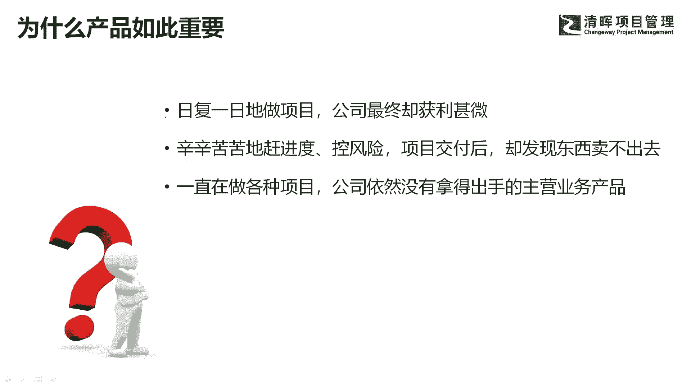

第二个原因是我跟一个项目经理的聊天，这个项目经理呢他以前是做项目的。

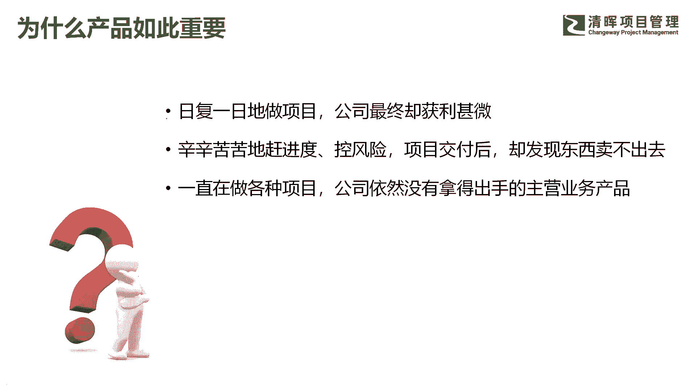

现在是在公司里面管交付啊，他给我讲了一个很现实的心理路程。

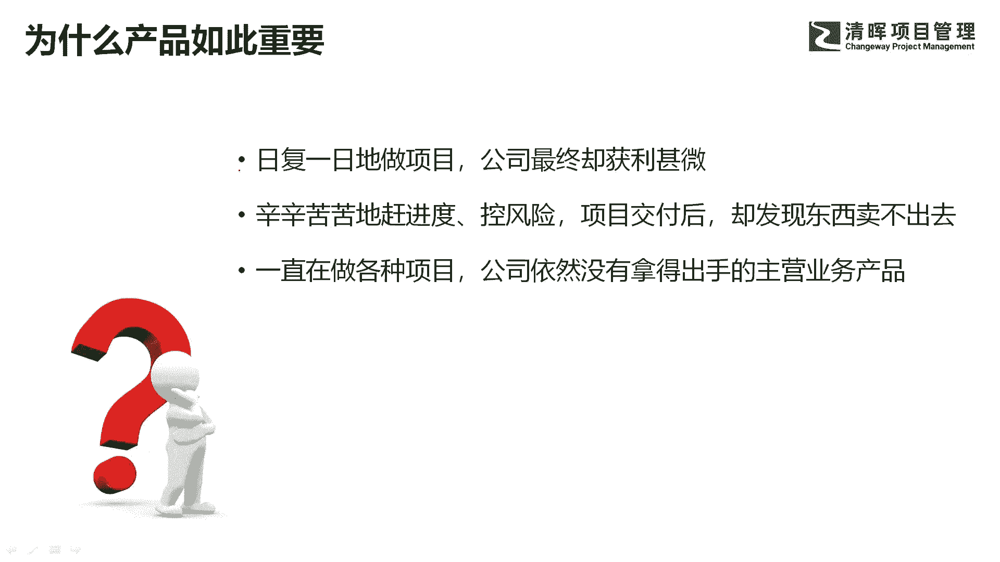

什么心理路程呢，他说以前啊他在公司里面日复一日做项目。

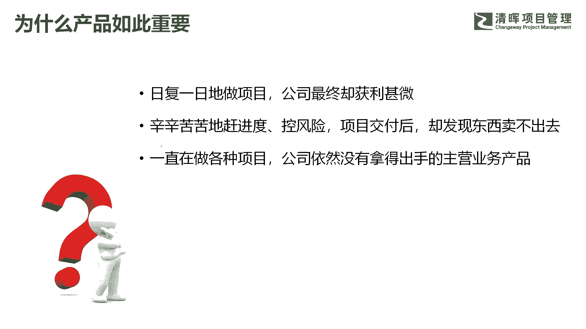

最终的公司到年底的时候，老板说公司今天没赚什么钱啊，他自己也知道，的确没赚什么钱啊，第二个他说啊，经常加班。

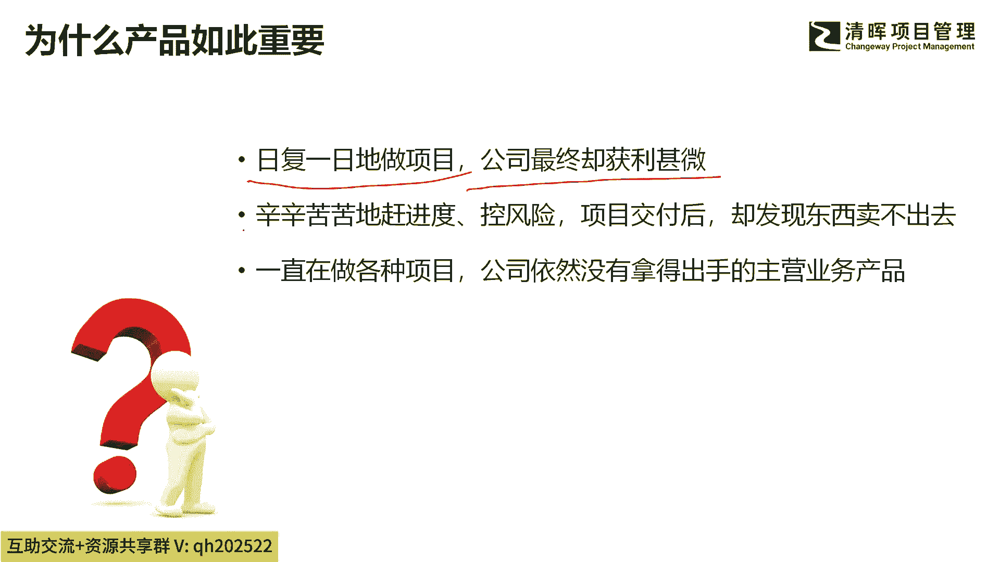

辛辛苦苦赶进度，控风险，项目交付以后呢，发现了东西卖不出去啊。

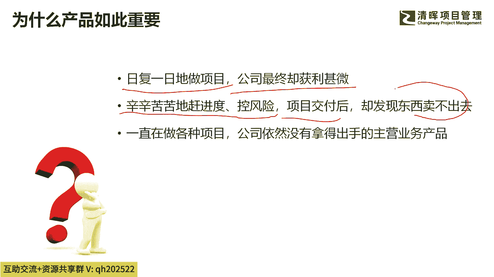

东西根本卖不出去，就是我们在做开发过程中啊，觉得自己很辛苦。

觉得这个产品啊用户一定需要，但是最终发现了客户根本不买账，他们也卖不出去，然后呢老板借了各种项目在做，但是呢几年了。

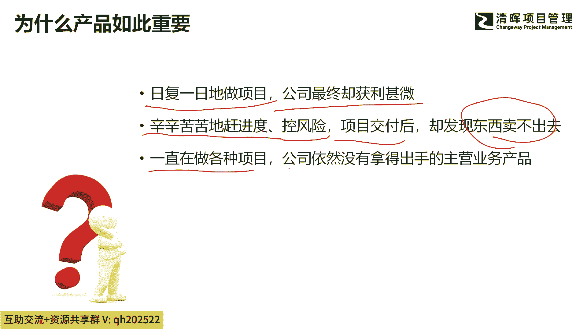

公司没有一个拿得出手的主营业务产品，还是只能不断的接项目。

接项目接项目啊，所以他就是一个这样非常典型的呃，职业生涯这样一个竞技的过程。

什么经济的过程呢，就是一开始啊埋头去做事情，把一个事情做正确啊，把事做正确。

所以他的心理路程啊，很长的时间是把事做正确。

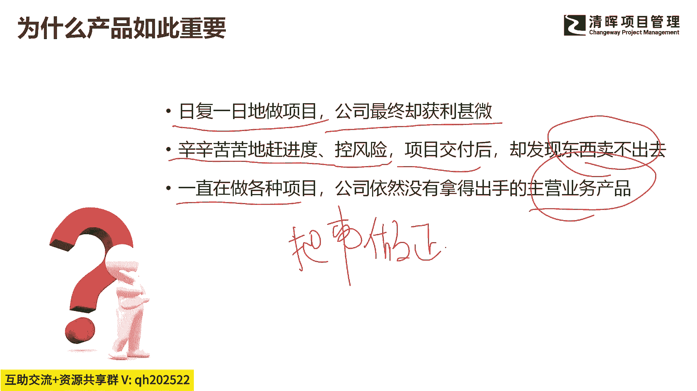

但是把事做正确够不够啊，够不够啊。

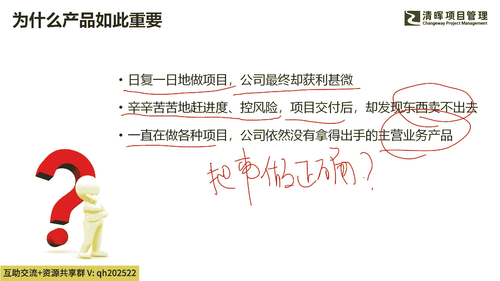

这只是一个门槛条件或者先决条件，或者叫入门条件，这是入门条件，把事做正确，那么更重要的是什么，更重要的是做正确的事情。

做正确的事。

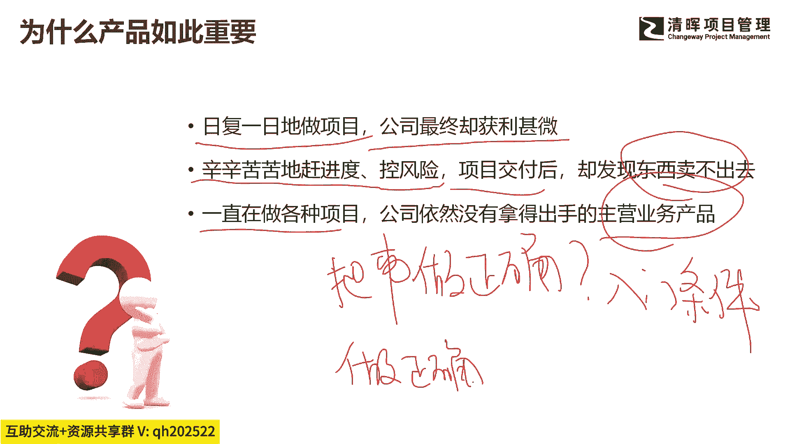

就是你可以我们说项目管理是什么，项目管理就是把一个事情做对吧。

把一个事情做好，把一个事情做成功，这叫项目管理，但是你把一个事情做成功，做好做对是不够的啊，是远远不够的，如果你的方向错了。

你的逻辑错了，这个市场上决定你能不能跑得够好的。

其实并不是你自己取决于什么，还取决于同行的人。

竞争对手跑的是不是足够快，足够好，还取决于什么么，还取决于你对客户需求，你对用户需求挖掘的够不够，你挖的是一个伪需求还是弱需求。

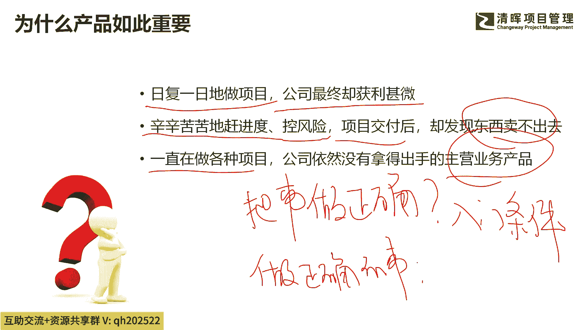

还是说我是强需求，真需求吧，这有很大区别啊，所以到底是真需求呢还是伪需求。

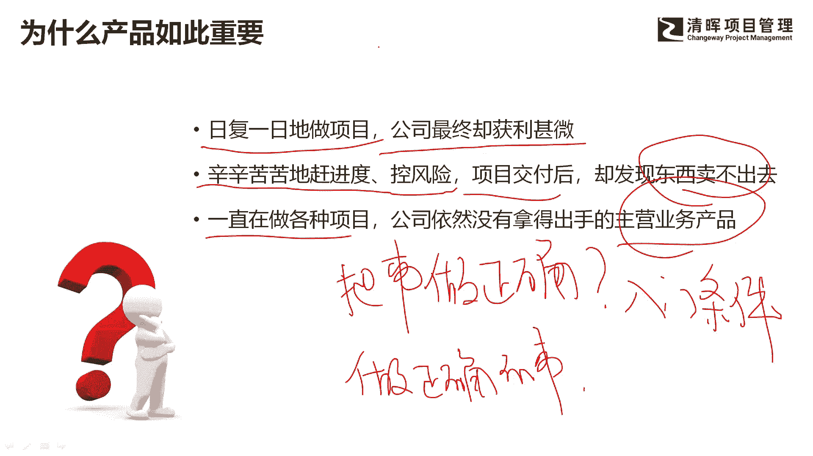

是一个强需求呢，还是弱需求。

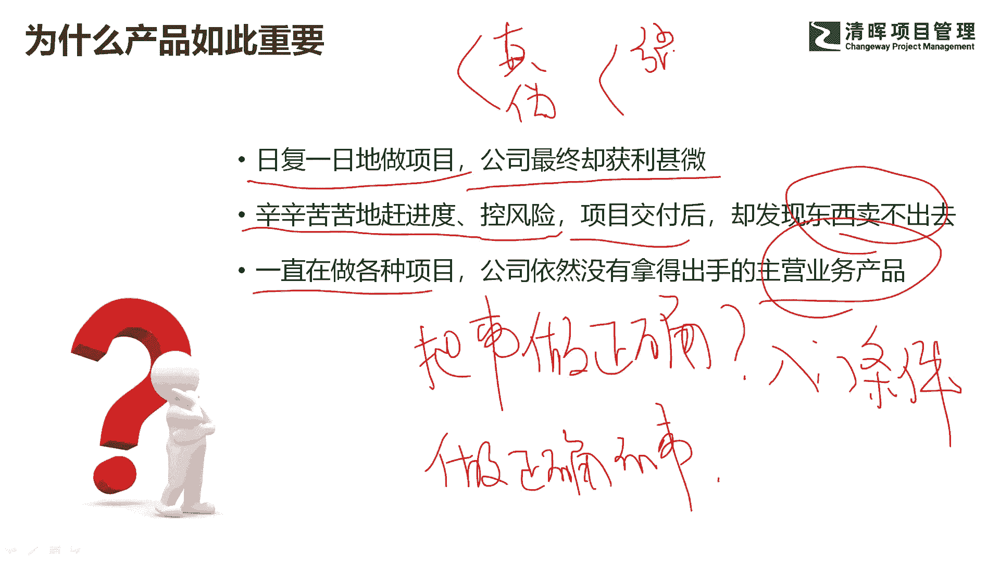

经验不够丰富的人，看到一个弱需求，看到一个伪需求，他认为这是客户想要的，就冲进去了，这个时候你辛辛苦苦去干项目，当然没有结果，当然没有结果了啊。

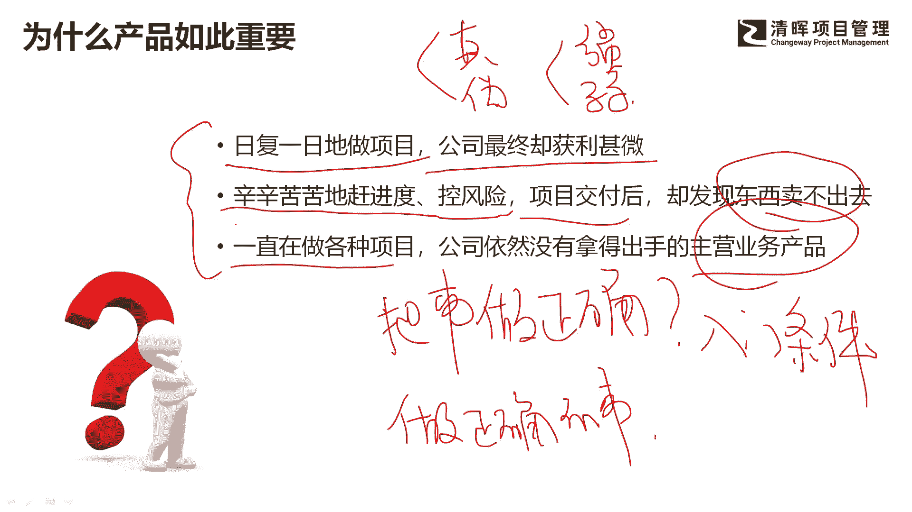

因为你没有在做正确的事情啊，这才是最重要的吧，才是更重要的啊。

所以这是第二个原因，为什么给大家分享从项目到产品的跨越。

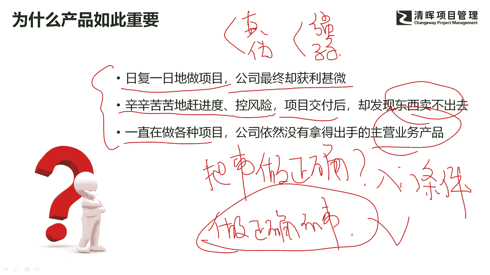

因为我觉得很多人必须要经历这样的跨越，如果你不经历这样的快的话，你的视野就是受局限的，你就可能在低层次上进行努力重复劳动。

