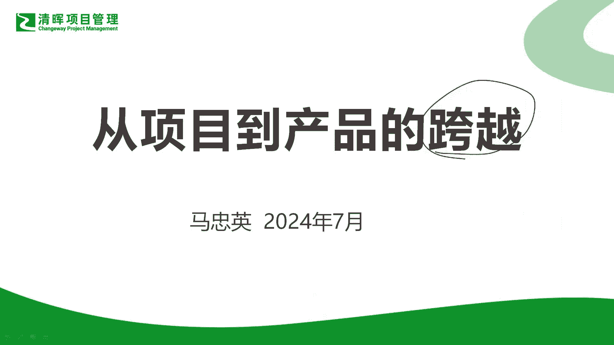
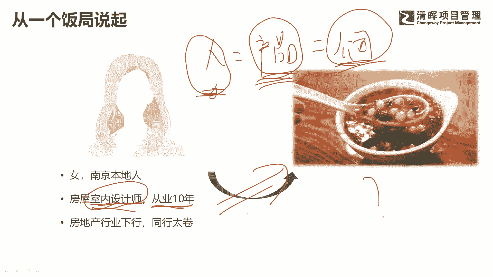
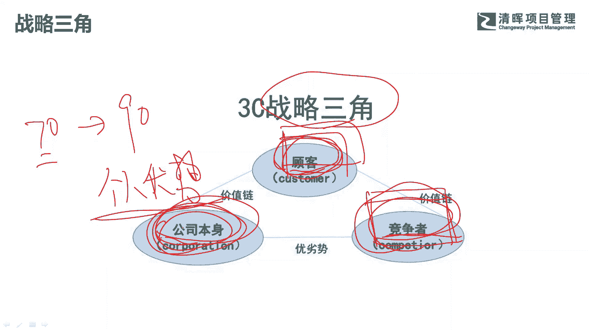
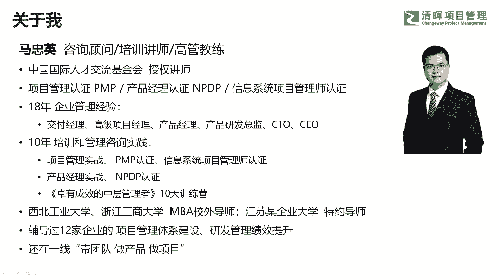
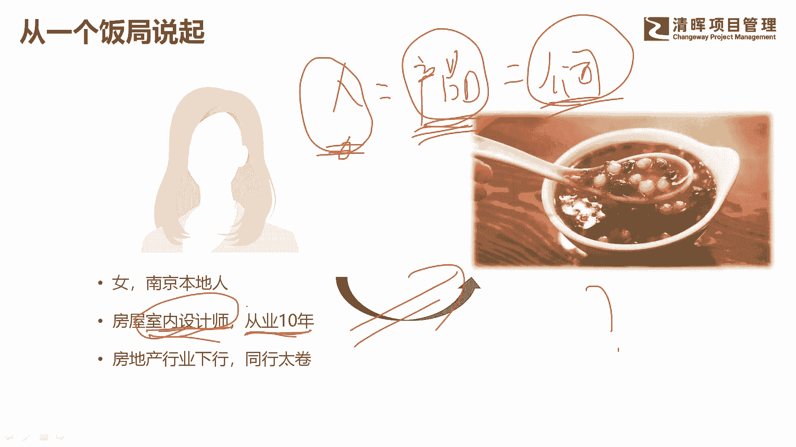
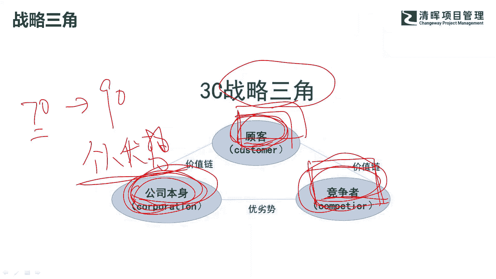
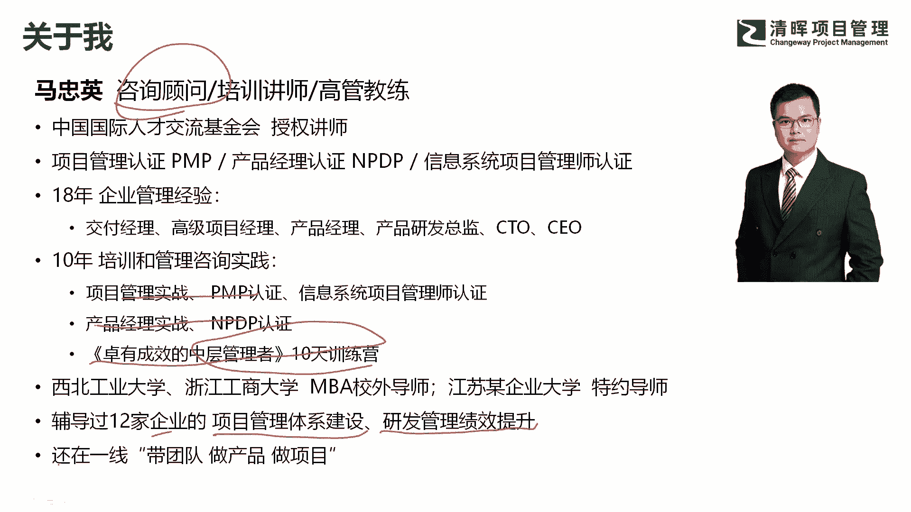
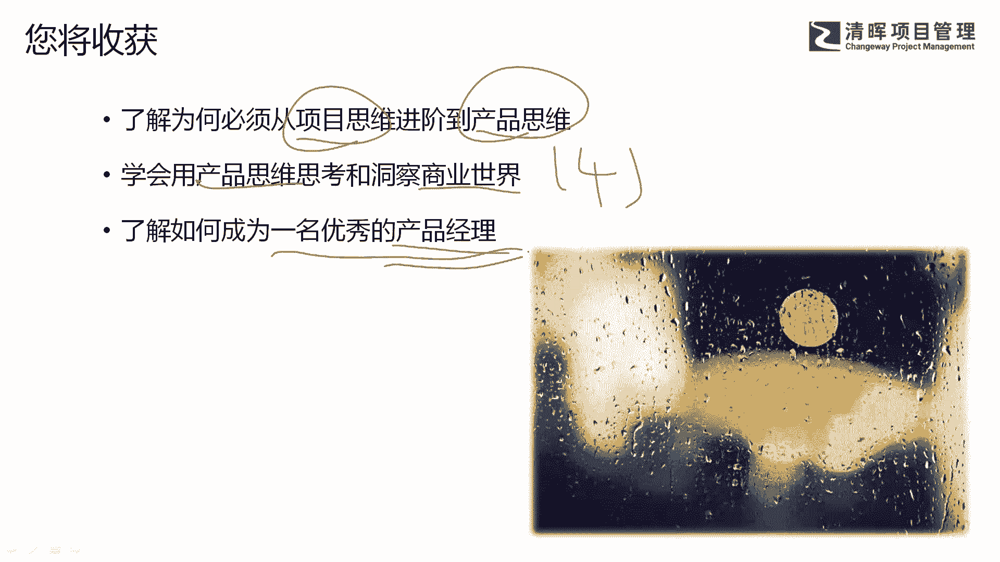

# 为什么产品如此重要？ - P2：2.导言：从一个饭局说起 - 清晖Amy - BV1SuWDeGEiE

今天晚上呢我给大家分享一个话题，这个话题呢叫从项目到产品的跨越啊，呃为什么想跟大家分享这个话题呢，等一会我告诉你原因啊。

先说一个上周六吧，上周六发生的一个事情啊，一个饭局，上周六的时候呢，我们之前有个同事啊，非要请我吃饭，然后呢他拉上他老婆一起，他们俩结婚才3年啊，两口子饭桌上咨询有个什么事呢，他老婆呢是南京本地人啊。

在这个房地产行业从事这个室内设计师啊，差不多有10年时间了啊，那现在呢他考虑转行什么原因呢，大家知道呢，现在这两年啊，可以说这3年吧，整个房地产行业走走在下行的趋势，很多大企业都倒下了。

那么当一个行业开始下行的时候啊，事实上整个产业链的上下游，大家都很难有好的这个生存机会，赚钱比以前更难了啊，然后更卷了，他说了一个例子，他说今天去跑工地啊，因为他们做的是新房的这个室内的设计嘛。

去跑工地，跑工地呢，这个业主他请了大概有十几个设计师，一起来帮他看这个房子的这个结构啊，以及房子的布局，然后呢对这十几个设计师都说，你们要回去给我一个效果图，然后给你们的报价就是很卷啊。

所以当时呢他们因为都是一个圈子里嘛，他们说当时一个同事就说啊，业主你不用这么麻烦，给大家对接十遍啊，你帮我们这些所有同行拉一个群，你只要把你的要求和诉求发一遍就完事了啊，所以说这个行当呢其实是非常卷啊。

非常卷嗯，所以他就当时咨询一个问题，什么问题呢，他说我不想干这个行业了啊，我不想干这个石雷设计师了，那我想转行转生转行做什么呢，他说呃因为是老南京人啊，他们家在那个中华门里面啊，属于内城的啊。

是老南京人，他说呢他们家以前呢做过这种赤豆元宵啊，这是南京的特色小吃，所以他说呢他现在呢回去想做个小店啊，在中华门城堡那边啊，开个小店做这种赤豆元宵，他学他问我啊，这个事靠不靠谱，能不能干哈。

嗯各位你们可以你们可以思考一下啊，就是一个在室内设计师啊，这个岗位上干了10年的一个女生，现在呢想转行去卖赤豆小元宵，而且呢自己从来没有做过啊，只是说家里以前做过能不能干这件事情，嗯这件事情表面上看的。

事实上是一个职业发展啊，或者说职业转型的事情，但是我们透过现象看本质啊，这件事情其实是什么事啊，其实我经常说一句话，我说一个人的发展啊和一个产品的定位啊，产品的发展和一个公司的定位和发展。

其实是一脉相承的啊，这个概念我待会还会再讲它嗯，那当我们自己面对一个不确定的市场的时候，我们个人我们决定自己发展什么技能，我们面对什么样的老板，我们怎么满足他的需求，我们怎么给自己定价。

我们有什么样的特色，有没有什么差异化的竞争优势，这是我们说的是个人，那你看把刚才这个一段话，把他的主语换成产品，是不是也是一样的，我们做一款产品，面对一个什么样的市场，我们有什么差异化的优势。

我们怎么进行市场化竞争啊，其实也是一样的吧，你把主语换成公司也是一样的，我们公司是个什么定位，我们面对一个怎样的市场，我们怎么满足客户的需求，我们怎么样去获得盈利吧，我们怎么进行差异化竞争吧，一样的啊。

所以很多时候当你具备这种产品，产品经理思维或者产品思维的时候，你会思考，个人的发展和产品的发展和公司的发展，其实是一脉相承的，好了，回到刚才我们这个问题啊，大家觉得这个人应不应该转型啊。

应不应该转型去做这个赤豆小元宵啊，我们说在产品模型里面制定产品战略的时候。

有个叫三角模型啊，战略三角模型，这个3D模型考虑三个点，第一个客户的需求是什么，第二个，在这个竞争满足的这个一系列竞争者中间啊，有哪些竞争者已经跑的比较快了啊，你是不是后起之秀，你凭什么卷得过他们。

干得过他们，那么最后也是非常重要的一点，我们说公司层面，你自己的优势是什么，那么落到个人层面也是一样，你在进行职业生涯发展的时候，你也要考虑到第一个我的顾客在哪里，然后我的同行都是谁。

最后最重要的一点是我的个人有哪些优势，我怎么发挥我的优势，把我的优势发挥到极致啊，也就是公司的基因或者个人的基因，我擅长什么，一个人只有在自己优势的区域里面去卷，去做事情，才有可能做得更好啊。

才有可能把自己的兴趣无限的放大，才有可能做到90分，如果说你不是在自己的优势区域里面，去做事情的话，你顶多可能能做到60分，70分啊，但是你很难做到90分，做到90分一定是凭兴趣。

凭自己的天生的意愿和动机去做事情，你说我硬着头皮做，事实上你做的不开心的话，很难做到90分啊，所以这个同学呢如果他学过战略三角，他如果有产品思维的话，他就知道，我虽然知道啊。

来南京的游客很多人爱吃南京的名小吃，赤豆小元宵，我虽然知道这个有很多百年老店也在做啊，可能别人做的也不够地道啊，那么你最重要一点是你自身的优势，有没有发挥上，你在一个室内设计师这个行当里面。

你干了10年，那你10年积累的客户资源，你对产品的理解，你对这个行业里面服务的理解，你的一些医生技能一身本领，如果因为你这个职业转型丢掉了，那就太可惜了啊，所以从产品思维来看的话。

这个职业转型是绝对不能转的，因为转了以后你发现你没有任何优势，你可能知道客户需要什么，但是在这个行业里面可能已经有很多竞争者了，南京有很多做了十几年，百二十几年甚至是百年老店啊，在那个城里面，小巷里面。

你凭什么干得过他们啊，你自身又没有任何优势，那这件事情就是注定了一开始就道路很崎岖啊。

好这是我们从一个例子来告诉大家呢，呃很多时候啊我们做个人定位也好。

做产品定位也好。

做公司定位也好，要从战略三角，要从产品思维的战略三角去考虑啊。

呃关于我自己，我简单介绍一下啊，我的主业是做咨询顾问啊，而且是做研发管理顾问啊，这一块呃，也是我们基金会的授权讲师，目前呢我自己呢主讲的课程，主要是项目管理和产品管理两大类啊。

当然今年主要做的是中文训练营啊，这个也在各个地方开始开展，目前我的主要工作是辅导企业进行项目管理，体系建设和研发的绩效提升啊，研发的整个管理体系建设呃，我也是为数不多。

目前还在一线带团队做项目，做产品的这样一个培训讲师啊，那么通过这个课程希望给大家带来什么呢，呃我们今天的分享只有两小时哈，我希望给大家带来几点啊，第一个呢让大家了解。

为什么必须从项目思维进阶到产品思维啊，为什么必须这么去干啊，我会告诉你几个，我在咨询过程中遇到的现实的例子啊，然后来告诉你为什么必须这么去干，第二个我想给大家分享几个案例啊，这边我会分享四个案例。

也是我在做咨询过程中遇到的，非常呃就是这一两年遇到的这个案例啊，非常接地气，非常接近于实战的案例，让大家用产品思维去思考和洞察，这个商业世界啊，这是第二部分，第三部分呢我想给大家交流一下。

如何成为一名优秀的产品经理呃，即使你自己不是做产品经理这个岗位的，但是我希望大家呢可以用产品经理的思维，用产品经理的一些方法论去武装自己。

去看待这个商业世界，好吧好。