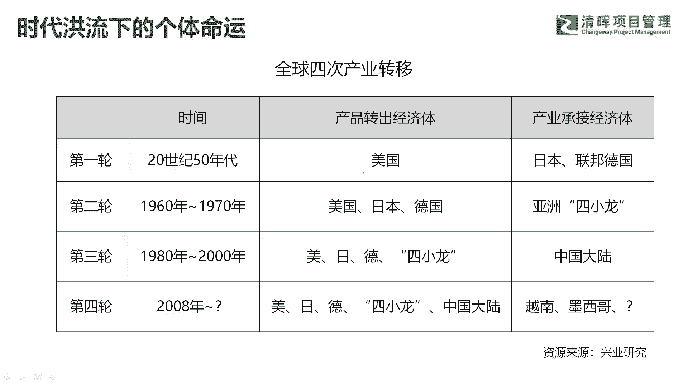
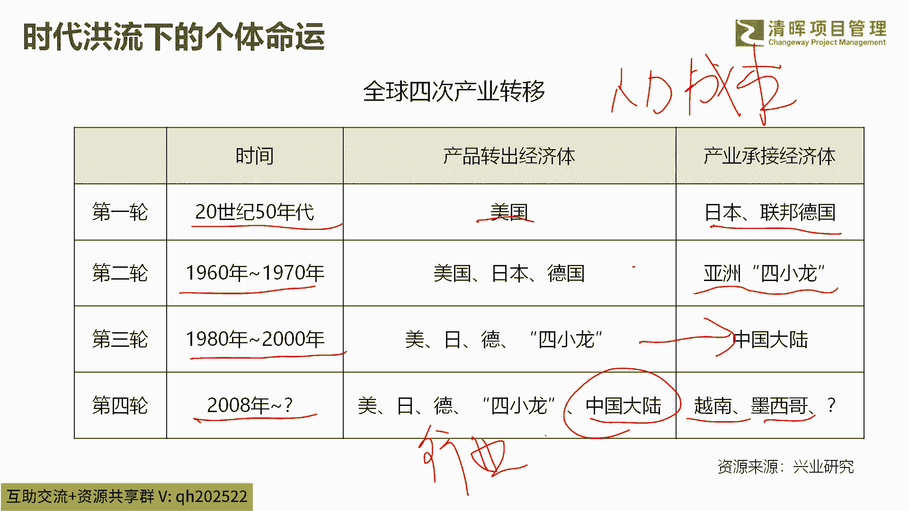
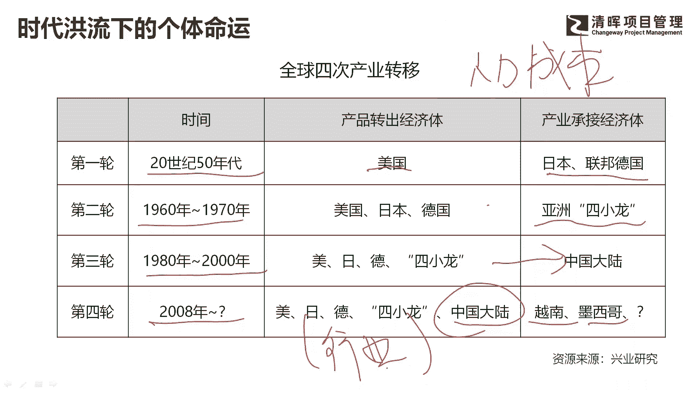
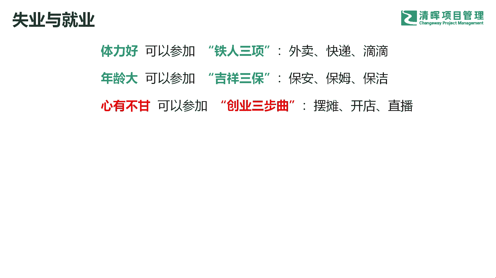

# 为什么产品如此重要？ - P3：3.时代洪流下的个体命运 - 清晖Amy - BV1SuWDeGEiE

正式开始啊，那么为什么给大家讲这个话题啊，就是为什么给大家讲呃，从项目到产品这个话题啊，其实这个话题我酝酿已久啊，主要原因有三个啊，第一个原因呢是大的时代背景呃，目前我们国家正在经历这种。

全球的这种产业转移啊，这种产业转移呢之前已经发生过了三次了啊，目前还是第四次，第一次发生在上世纪的就是50年代啊，那么那个时候美国向二战的战败国，日本和联邦德国开始产业转移，那么产业转移的本质是什么。

是人力成本的问题啊，是人力成本，也就是劳动力成本的问题好，那么到六七十年代的时候，这个时候日本德国已经发展的不错了啊，他们的制造业，他们的工业相对建设的已经不错了，他的人力成本有上升的吧。

劳动力成本上升的这个时候开始往哪转移呢，也就是大家很多人听过的亚洲四小龙啊，呃北边的韩国啊，以及新加坡啊四个地方进行转移，所以在上世纪六七十年代的时候，这四个区域呢发展的非常好啊，成为亚洲最亮的仔吧。

然后到80年代到2000年左右的时候，这个时候呢开始向中国大陆进行转移啊，我们很多呃同学的父辈啊，吃到了这波红利啊，那个时候很多人敢于去下海，敢于去经商，敢于去南边去闯荡。

那这个时候大概率可以吃到时代的红利啊，那么从08年左右，这个时候经历了第四波，因为我们中国大陆，这个地方的人口的红利也消失了吧，很多这个劳动力成本急速上升，那么这时候。

大家可能这两年看到很多这样的新闻吧，很多外资开始撤产，像越南，像墨西哥啊，像巴西啊，像很多的整理成本更低的，像越南啊这些地方进行转移啊，那么在这种转移过程中啊，一定会发生很多的行业的巨变啊。

有人说我们不是干制造业的啊，我自己不是做制造业的这种行业，制造业的行业转移这种柱子跟咱有啥关系呢。

啊，这个地方大家就要用一个高度的眼光去看问题，事实上呢一个行业出现问题以后啊，它会影响到相当多的行业，那比方说大家这两年非常有感触的，我们国家的房地产在下行，房地产这个以前GDP占15%以上的。

这个贡献率的产业，不行的，你可以发现很多行业会受到波及吧，因为就业问题导致的，因为大家没钱消费了，那么会出现断供，一系列一系列的连锁反应啊，所以制造业也是一样，当一个行业在走下行趋势，或者说在换赛道啊。

我们可能说换赛道更合适一些，因为中国制造以前都是一些中低端的代名词，那我们很多时候，原先的赖以生存的这些中低端的制造业，可能不得不进行转移了，不得不进行转行，进行转型，那么在这个过程中一定是镇痛的。

在这种镇痛格局下，在这种大行业阵痛下，个体其实是难以幸存的，个体一定会受到影响的吧，就像大家说的那句话，在雪崩面前没有一片雪花是无辜的。

所以行业的趋势啊，很多时候是远远高于个人发展的啊，呃前两天有一个网上一个梗啊，说中年失业这个话题啊，很多人在往后面跟帖啊，包括后面又有一个热搜。

就是萝卜快跑的热搜，无人车打罗锅啊，这样一个热搜，那么这两个新闻大家放在一起去看啊，前面这个梗说的是中年失业以后啊，说体力好的可以搞铁人三项啊，外卖快递和滴滴，年纪大了，参加吉祥三宝啊。

也就是保安保姆和保洁，心与不甘呢，创业三部曲啊，摆摊儿开店和直播啊，当然了，这是一个调侃的啊，调侃事实上呢很多人可能正在经历这一步啊，因为呃，今天我不知道听课的人都是什么年龄层次啊，嗯像我啊。

我今年40啊，我身边大部分都是这样的中年人，也就是在40岁左右，35~45岁左右的中年人，那么这个时候很多人可能正在经历失业，相当多的人找不到工作，那么这个时候他们能往哪儿去呢，人往哪儿去了，有人说。

那我去做这种外卖啊，送滴滴，送个快餐这种事情啊，你可以做这件事情，你可以做临时的当下的苟且吧，但是你要挑出来想这种简单的没有太多门槛的，没有太多技能加持的自己，事实上很快就会被颠覆掉吧。

那萝卜加萝卜快跑啊，萝卜快跑这件事情呢在武汉推出来以后啊，快速上了热搜，很多人都在讨论，萝卜快跑会不会把中年人最后的饭碗给打掉了，很多人说不会啊，罗罗快跑现在有这样这样那样的那样的问题啊。

说罗罗快跑这个造成的武汉的拥堵啊，罗罗快跑有这个不听交警指挥啊，啊发生交通事故啊，啊把闯红灯的这个老大娘给撞了，等等吧啊一些列问题，但是我们啊我们这一届人，我们这一代人其实经历过两次类似的事情。

经历过两次啊，第一次是什么，即依次是电商啊，对传统的这种线下的门店的冲击吧，这是第一次，当时也有很多人去闹嘛，很多人去啊，很多人投诉也好啊，很多人去闹事也好啊，第二次是什么，第二次是移动互联网时代。

就是滴滴打车为代表的啊，滴滴打车为代表，那个时候抢占了谁的生意啊，出租车的生意吧啊，出很多出租车生意做不下去了啊，所以也有很多人去闹吧，但是我们发现什么，这个趋势可逆吗，电商取代把线下门店的声音强调。

让线下门店的流量大幅度缩水，很多人让在线上购物成为习惯，很少去逛线下门店，所有的人大部分都开始在线上进行打车，用手机打车，你在线下根本找不到出租车，根本在路边拦不到出租车，这种趋势一定是不可逆的吧。

所以以萝卜代表，萝卜快跑为代表的这种AI这种智能化设备，这种智能化的机器人的，或者说啊各种的智能化设备吧，他们去代替那些刚才我说的啊，第一个没有太多门槛的，第二个没有太多技能加持的这种事情的话。

一定是大趋势，这种趋势一定是不可逆的啊，在当下萝卜快跑，他可能有这样那样的问题，就像当初的电商，当初的滴滴一样，有这样那样的问题，他不健全，他需要继续完善，但是这种过程是不可逆的啊，是不可逆的。

所以总有一天你会发现，我们身边充斥着各种各种的智能设备，各种的机器人，各种的东西啊，所以这个过程我们无法去颠覆它，我们只能什么，我们只能拥抱这种变化，我们只能拥抱种表好，我今天不是来贩卖焦虑的啊。

我只想问大家一个问题啊，为什么有的人到中年的时候只能干这样，这个中年三件套啊，为什么有的人，我相信萝卜快跑，这种产品也是被人设计出来的吧，萝卜快跑这么复杂的这种产品啊，这种智能化产品包含它背后的服务啊。

我们说产品很多时候跟服务啊是连在一起的啊，你看很多啊，后面就爆出来了嘛，很多司机在远程操控吧，在远程操控啊，所以我们表面上看到的是一个汽车，智能化的一个汽车，那么背后有大量的运营产品。

以及大量的服务在里面吧，进行设计吧，你看有的人只能干这些创业，只能干这些简单粗暴的活，干这些出卖体力劳动的活，但是有的人可以在背后去设计智能汽车，去设计这样的服务。

去设计整个萝卜快跑的商业模式和运营体系，它们区别在哪呢啊他们区别在哪呢，啊所以我想在今天啊，跟在座的在线的朋友们交流这个话题，即使你今天还没有到终点，即使你今天可能过得还不错啊，我希望你做好准备。

做好准备，因为谁也不能确定，也会走的很顺利啊，那么当你提前拥有了一些技能，拥有了一些门槛比较高的技能的时候，当你到35岁，40岁的时候，或许就没有那么慌张了，或许别人只能干简单粗暴技能的时候。

你可以在背后设计商业模式，信息设计运营体系啊，获得一个高附加值的回报啊，这是第一点原因啊，为什么给大家讲从项目跨越到产品这个话题。

