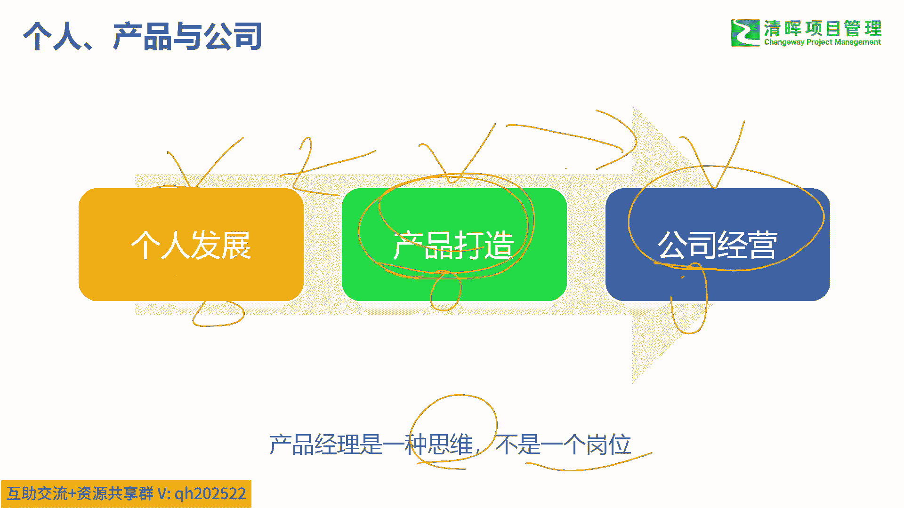
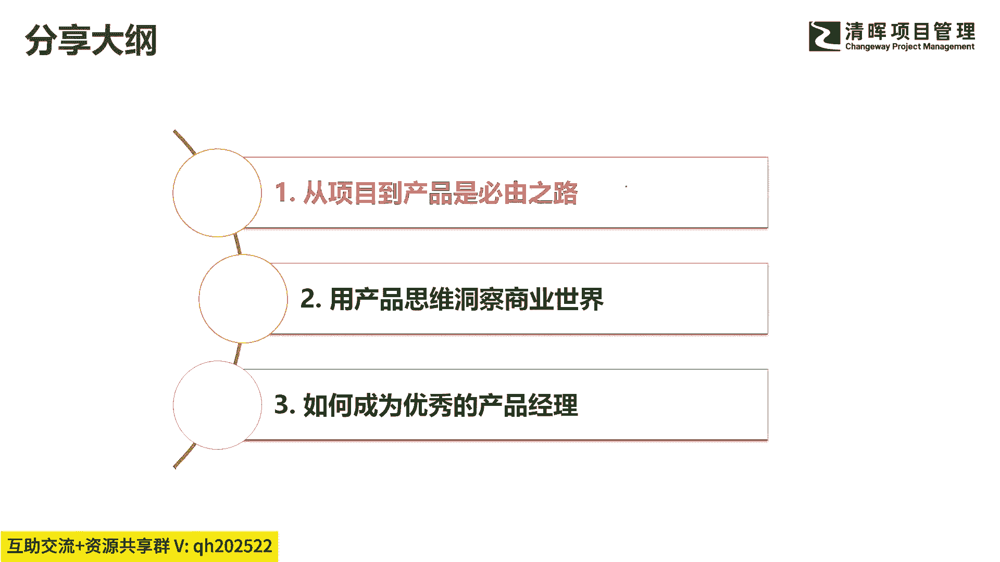
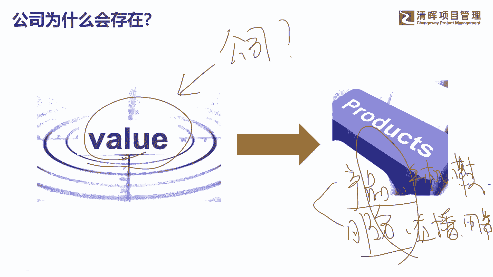

# 为什么产品如此重要？ - P4：4.产品生命周期 - 清晖Amy - BV1SuWDeGEiE

第三个原因，其实我刚刚说过啊，我自己学完产品以后啊，以前我是做项目管交付，后来我学产品做研发管理，做整个研发体系的建设，我认为个人的发展和产品的打造和公司的经营，这三者它的底层逻辑是一模一样的啊。

是一模一样，这个我刚才也解释过了啊，啊所以我说了产品经理是一种思维，不是一个岗位，不是说你真的做了产品经理这个岗位，你才需要学习才拥有产品思维，不是的啊，其实当你啊我不知道多少人能理解这句话。

如果你学过产品思维的话，如果你学过产品的话，你就能理解我下面这句话，当你拥有产品思维的时候，你事实上有一种顶天立地的感觉，顶替你，也就是说你在这个市场上，面对这个不确定的市场，面对你的客户。

你的目标群体，你去贡献你的产品，提供你的服务过程中啊，你会有一种掌控感，什么掌控感就是无论遇到什么情况，我都不害怕，因为我知道，我能把自己打造成一个最好的产品啊，你把自己打造成一个最好的产品。

你就能在这个未知的市场上去直面竞争，去满足你的客户，去获得自己的收益和回报啊，所以我说呢个人回发展跟产品打造，跟公司经营是一模一样的啊，无论从哪个点切入啊，如果你说我先从个人发展切入啊。

你说我从公产品打造切入，从公司的经营切入，其实逻辑是一样的，当你具备一个能力以后，你触类旁通啊，比方说你今天你说我学完产品以后，我是不是对自己有更深的理解，当然你是不是对公司的经营发展有更深的理解。

当然也是一样啊，这是我们说的为什么给大家分享这个话题啊，从项目到产品的跨越。

主要是这三个原因啊，呃接下来呢我正式开始我今天的分享，今天的分享呢主要是三个部分啊，第一部分我们我再给大家说一下啊，这个为什么从项目到产品是必由之路啊，第二个我们讲我会讲讲四个案例，从产品思维来洞察。

整个商业世界的四个真实案例。

呃，最后我们分享一下怎么成为优秀的产品经理啊，那么首先呢，我们讲为什么要从项目的产品的跨越，我们先回答一个问题，公司为什么能存在，大家想过没有这个话题，公司它为什么能够存在。

或者说公司存在的价值是什么啊，公司凭什么能够存在啊，那么公司存在的第一个直接原因是，公司能够创造价值，不能创造价值的公司一定会被唾弃的啊，我后面会讲到一类公司，他们其实无法创造价值。

他只是自我感觉良好啊，这类公司有什么特点，我们等一会儿放到第2part，也就是用产品思维洞察商业世界里面，我会讲一个真实的案例啊，为什么说这种公司无法创造价值，他只能活在自己的世界里，好吧好。

公司能存的直接原因肯定是能够创造价值，那么再回答一个问题，公司是如何创造价值的啊，公司是怎么创造价值的，公司创造价值一定是通过要么是有形的产品，要么是无形的服务啊，一定是通过这两者啊去创造价值。

它得有一个落脚点吧，得有个落脚点啊，好这就说公司能一定能创造价值，一定是通过有形的产品或者无形的服务，去创造价值，所有公司莫不如此啊，只不过呢大家看到的产品，有可能表现形式不一样，有的是单一的产品吧。

比方说就是一个手机，这是一个产品，非常简单粗暴，就是一个鞋子，这也是一个有形的产品吧，那还有的可能是服务，你看不见摸不着吧，啊比方说培训的服务，我们今天的直播服务，直播服务，还有送餐的服务等等吧。

啊这些都是服务的形式，当然了，更多的公司可能提供的是一个组合吧，是个组合，也就是说我既有产品又有服务板，比方我们刚才说的这个打无人车用萝卜啊，那么这个萝卜快跑，他其实既有有形的产品，也有服务啊。

这样的话呢，它构建的就是一个立体化的商业模式。

是一个运营体系在里面好，然后我们再看一下整个产品生命周期啊，产品生命周期是说啊，我们站在一个产品的维度去看它啊，比方说我们站在这个呃任何产品都可以啊，我们就看在萝卜快跑吧，我们就站在萝卜的角度啊。

萝卜快跑，那么萝卜快跑这个产品，在我今天我们看到的时候，事实上他已经在这个阶段了，我们今天看到萝卜快跑的时候，他面试的时候已经在这个阶段啊，也就是说已经在产品的导入期吧，导入期了啊，在武汉啊。

在呃物证啊，在长沙这十几个城市里面开始已经做布局了，做产品导入期了啊，但是我们知道萝卜快跑这个产品，其实在很早之前他可能就开始策划了吧，那么在更早的时候，比方说在这个时间点，这个时间点可能是什么。

可能是百度公司它发现的某个商业契机，它可能是通过市场调研发现的某些用户需求，他更可能是做了严谨的商业论证吧，商业论证，那这样的话呢他发现呃技术方面可行，商业方面可行啊，制造方面可行，各种可行性论证吧。

那么这个时候他们终于开始逆向做个项目啊，也就是说我要研发萝卜快跑这个智能汽车，以及它背后的一系列的服务吧，配套的运营和服务开始研发，那么从逆向开始以后啊，如果大家学过项目管理。

就知道这个地方会有一个文件的批准吧，发布吧叫项目章程吧，啊项目章程，那么项目章程发布以后呢，进入项目生命周期啊，也就是说这个时候项目团队开始组建了，开始干嘛，比方说我们要分析干系人啊，要做各种计划吧。

然后要执行，然后要监控，要收尾巴好，一直到这个地方项目做完了，做完以后，我们经过一个内部的评审，外部的评审以后，我们进行移交吧，然后我们开始总结经验教训吧，移交完以后，事实上这个项目就结束了吧。

所以从这个地方开始啊，从项目立项完成以后，到项目完成后进入市场，这就是我们说的呢项目生命周期，也就是我们说传统的项目经理，干的是这一段活啊，项目经理干的是这段活，但是如果你是一个产品视角。

如果你是一个产品经理，你知道这个时候你的工作远远没有结束吧，因为产品移交给市场部以后啊，或者移交给运营部以后，它还有漫长的产品生命周期吧，非常漫长，一开始产品导入期可能有些策略吧，比方说定价策略。

市场推广策略，营销策略啊，这个加盟商策略，经销商策略，还有竞争策略吧啊，定价策略等等一系列策略吧，然后在成长期又是不同的策略吧，怎么引怎么拉新，怎么留存，怎么促活跃吧，然后在成熟期有人。

那么如果说过了5年十年呢，有可能比方说过了10年以后，这个时候低空经济发展很好了，以后大家都出门的时候，都不用打萝卜快手这种无人车了，我们打什么了啊，现在前两天我看到一个概念机啊，低空低空经济啊。

也就是说你出门以后呢，一个无人机就过来了啊，这个无人机上去以后哇呜呜就走了啊，以后再也不用堵车这种事情了啊，以后可能是堵空中了吧，啊所以这个时候萝卜快跑肯定要退市了吧，要退市啊，所以在这个地方。

比方说这个点萝卜快跑终于全线下架，全线退市吧，他的服务也不支持了，他的车也不支持了，这个时候我们说萝卜快跑，可能就进入了这个产品生命周期的末端了吧，啊末端好，这是一个完整的生命周期啊，完整的生命周期。

所以我刚才一开始说那个项目经理啊，他现在管研发，管交付啊，那么以前他说他只做中间这一段嘛，就是项目这一段啊，那么他的视野也是受局限的，因为你根本不知道我做这个项目靠不靠谱，这个项目能不能成。

我为什么要做这个项目，那么交到我手上的时候，我就知道啊，这个项目要干什么，大致范围就确定了吧，我只有埋头往前奔吧，那么至于这个产品上市以后，到底采用什么样的定价策略，渠道策略，营销策略。

还有我的经销商策略，供应商策略，我统统不知道吧，我统统不知道，所以对他来说，他的格局事业就受局限了，他的发展就会受到了影响啊，所以说从这个角度来看的话，项目经理或者说项目只是在其中一个小环节啊。

那么后面还有漫长的产品生命周期啊，那如果说前面这个阶段，比方说我们论证了六个月好，我们打举个例子啊，那么中间这个研发阶段可能是两年两年，但是我后面的产品推广运营，这个阶段可能就更长了吧。

比方说可能是10年啊10年，所以你看其实从时间轴来说的话，我们项目经理就干干了两年的活，但是前面的六个月，后面的10年啊，这是一个更加长周期的，相对来说影响更深远的事情吗。

