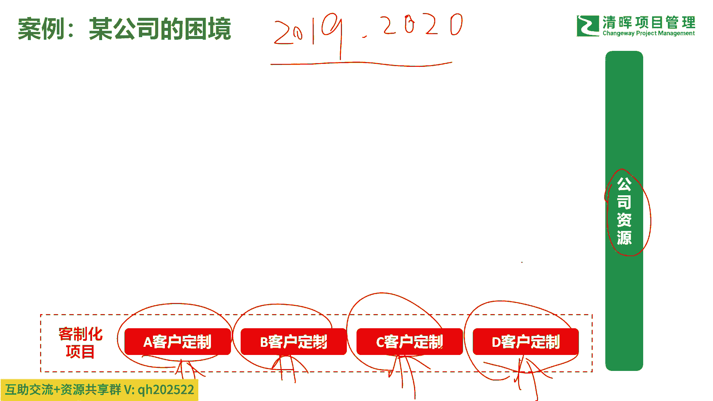
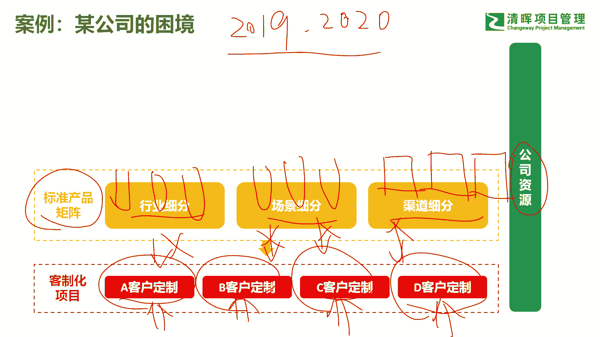
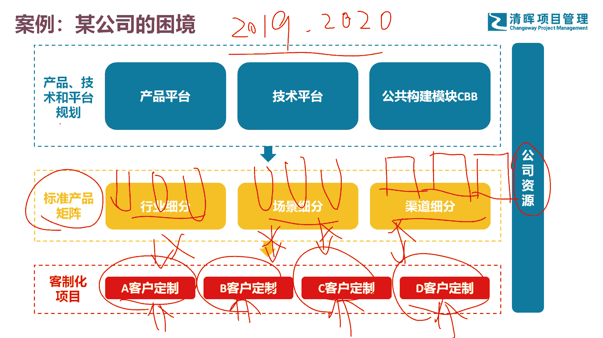
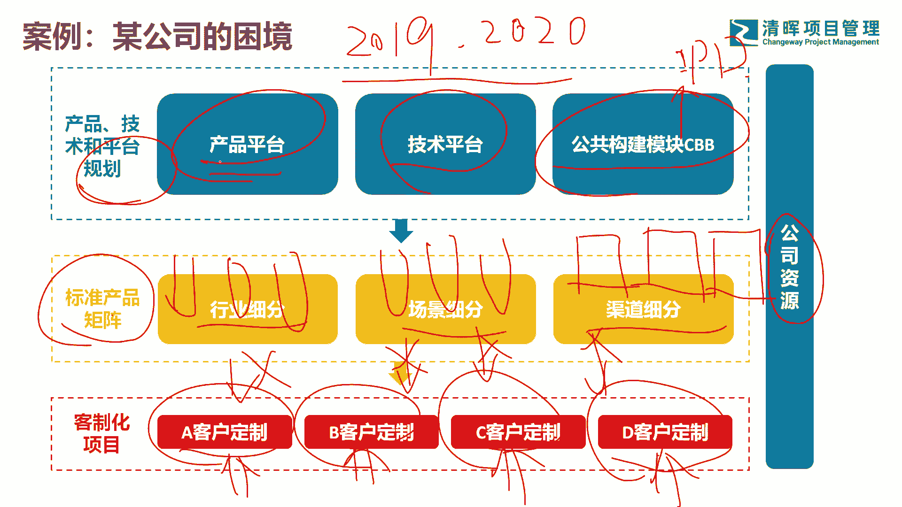
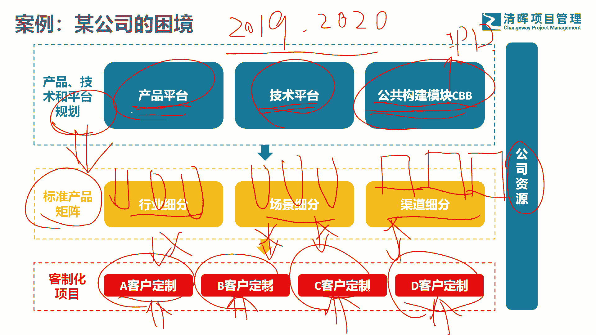
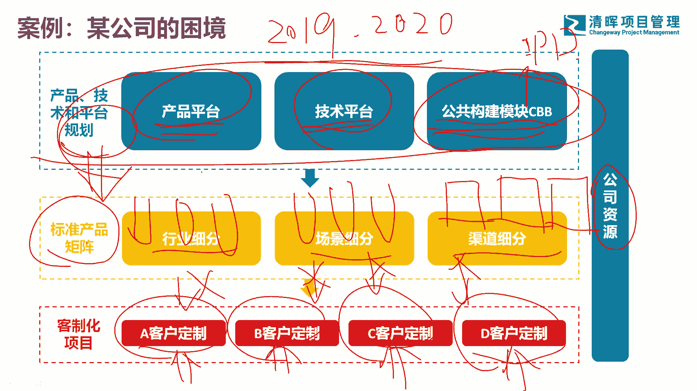
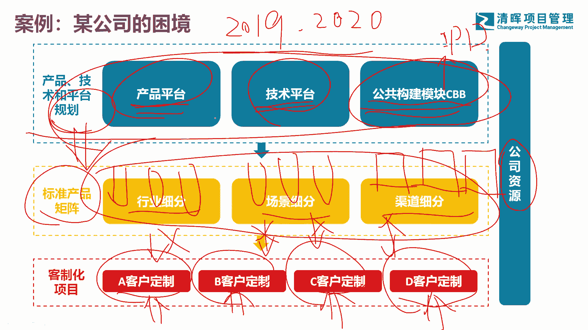
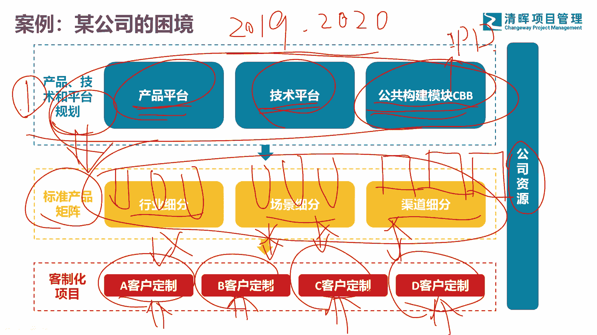
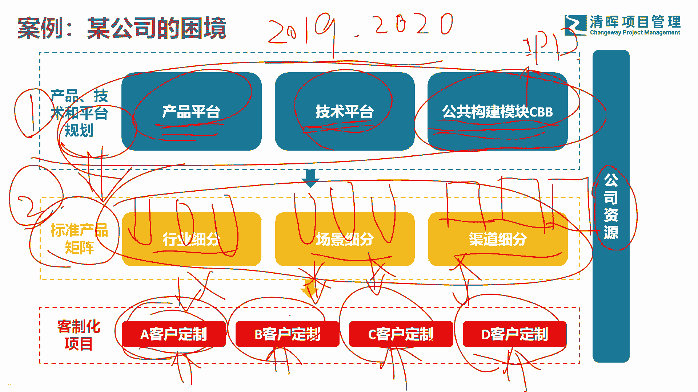
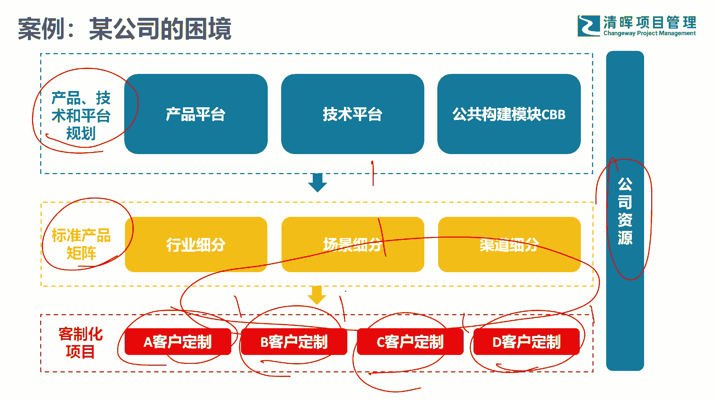

# 为什么产品如此重要？ - P6：6.案例某公司的困境 - 清晖Amy - BV1SuWDeGEiE

好那我们看一下啊这个公司的困境啊，就像我刚刚说的那个例子啊，这家公司呢在杭州他是做监狱安防的啊，杭州呢大家都知道在安防这一块有三个巨头啊，也就是海大宇啊，海康大华和宇视科技啊三家公司。

那么这家公司呢他们缺一个细分赛道，做差异化啊，这就很多小公司的生存法则，也就是说前面三个老大海康大华，宇视科技都太凶猛了啊，都太强了，我干不过怎么办呢，我只好切一刀吧，在一个细分市场里面苟活着吧。

赚一点小钱做点小生意啊，所以他们公司呢是做监狱安防，做监狱安防，那么有一年呢在2020年，2009，2019和2020年这两年，其实他们公司发展的很好啊，发展很好，他们在杭州市滨江市政府的支持下呢。

也拿了块地啊，准备建总部大楼啊，那一年的销售额过了两个亿，公司呢差不多100来人啊，销售额过了两个亿，而且是一个软件为主的公司，它的毛利相当可观好了，那么但是他们在2019年2020年呢。

他们接的项目啊，都是什么类型的项目呢，都是这么类型的项目，定制化定制化定制化定制化啊，虽然他们是切的是监狱安防，但是每个地方的监狱其实嗯差异挺大的，也就是南京的监狱和济南的监狱。

和其他地方监狱其实差异挺大的啊，那这个地方呢很多需求都是克制化需求，那么当克制化需求太多以后发生什么问题啊，发生的就是我的这些公司资源总是有限的吧，如果说这些客制化差异很大，哎，我不得不把很多资源。

全投入到这些客制化项目上来吧，全往这儿进行投啊，全网热投，但是呢公司宝贵的研发资源又是有限的，这样会导致什么问题啊。

这样会导致他没有精力，或者说没有人力资源，去支撑到他的整个产品规划，没有精力去搞他标准的产品矩阵啊，产品矩阵也就是说我最好是提前规划吧，依照行业的细分啊，依照场景的细分，依照渠道的细分。

我去做很多标准产品矩阵吧，比方说这里面有不同行业的啊，那么可能有大监狱，有小监狱啊，监狱可能还有不同的细分吧，那么又有不同的场景吧，每一个监狱他可能的关注点又不一样，场景要满足的也不一样啊。

所以还有渠道吧，比方说这个地方是啊，广西的啊，这个地方是山东的啊，不同地方的销售代理商，他的渠道又不一样吧，如果说他有精力做这件事情的话，事实上他就不会导致什么，就不会导致有这么多个性化的定制了。

就不会有这件事情发生了，好不会这件事情发生的，那么再再站在更高维度去看它，再站更高维度。

那么他如果说能提前开始做一些规划，规划什么规划自己的产品平台。

技术平台以及公共构建模块，也是大家经常说的CPB啊，这是IPIPD里面经常讲的啊，IPT里面经常讲的CVB，就是说我在一开始的时候，我能把很多公共的轮子给造好，公共的模块和组件，做好做产品的平台。

技术的平台以及公共模块的这些构建的话，那这样的话我后面再做一些标准产品的时候，事实上我就很容易了吧。

我觉得代价比较小了，我不用每次都是从0~1，从0~1，这样我会发明很多很多轮子吧，好，所以事实上呢，他的理想的方式是应该从上到下做规划。

做布局，做资源投入占比吧，那比方说我在这边投入的资源，可能是相对来说比较多的吧。

一开始，因为我要把大部分的精力放在我这些，公共的组件和轮子上。

这些投入虽然前面投入很多，但是你是为后面省力的吧。

然后你开始耐心的构建规划你的产品矩阵吧，你的不同细分行业场景细分渠道细分，然后产品可能为高中低配版。

然后最后你发现，可能你做完前面两件事情以后啊，做完第一件事情。

做完第二事情，可能你大部分的这个客户定制，就没有那么大的工作量了。

可能就是稍微改一下，做一点配置，因为你前面已经全部考虑过了吧，好，所以这家公司呢，为什么在21年，22年那个时候出现了大量的问题啊，212223啊，二三可能他们已经是很很困难了啊。

212就出现很大的问题，什么问题呢。

没法交付，为什么没法交付呢，因为资源不够用，为什么资源不够用呢，因为大量的客制化项目，大量的客制化项目啊，所以这就导致公司宣言入恶性循环，最后没有办法怎么办，只好赔款啊，不断的赔款就是合同无法履行啊。

违约啊，直接赔款，所以我们回过头来看这家公司遇到的问题啊，他其实是陷入一个一个的项目思维里面去，把这个项目做好，把这个项目做好，把这个项目做好，把这个项目做好，但是公司的资源是有限的。

如果说你没有把这三块很好的去分配你的资源，你把很多资源全放在一个一个的项目上，一个一个的项目上，那事实上你没有办法站在更高的层面去做，产品的规划以及你平台的规划，那这样的话时间一长一定是得不偿失的啊。

你本来想的是1+1大于二啊，这个一加这个一要大于二，事实上你发现在这里面投入了这么多，一以后依然无法满足客户需求。

这就是我们说的呢，你不能陷入项目思维，你要站在产品思维。