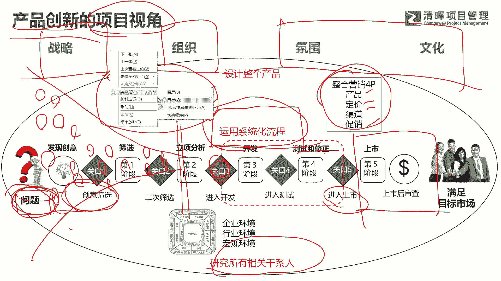
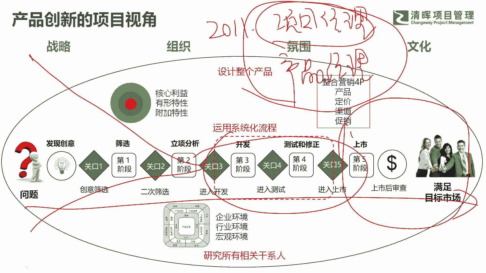
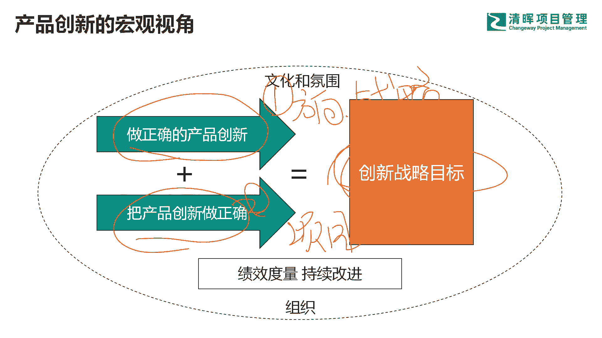

# 为什么产品如此重要？ - P7：7.产品创新的项目视角 - 清晖Amy - BV1SuWDeGEiE

然后我们再看一下从创新，产品创新的视角来看啊，产品创新的项目视角啊，那么项目经理呢刚才我说了，就干中间这一段啊，这一段也就是说从呃逆向分析完以后，这个关口过了以后呢，进入开发阶段，最后测试修正完以后呢。

进入上市，上市完以后我就不管了啊，所以你看到它是非常少的一段，那如果说你是一个产品的视角，如果你是一个产品的视角，你会考虑什么，你会考虑前面这个阶段我发现了什么样的问题，发现了什么样的客户需求。

发现了什么样的痛点吧，发现了什么样的机会点吧，然后你看我围绕这个痛点机会点，客户的问题，我怎么样去满足吧，我用什么样的方案，有什么样的创意吧，然后最后你才谨慎的进行逆向吧。

因为你看看可做的事情可能很多吧，他像个大喇叭口一样，看下大喇叭口，就是公司里面你发现要解决的问题，你可以做的事情很多，但是你能抓住的其实并不多，所以公司里面很多时候要做什么产品，要做什么项目。

是从这个大喇叭口里面去筛选吧，去做筛选，去做挑选，最后你发现哦，就那么两个三个很优秀的项目，进入了你的研发梯队里面去吧，好那么中间过程中，你要考虑你的产品是不是有竞争力，所以围绕产品的三层核心。

有形和附加去进行设计吧，然后你要考虑你的营销策略，整合营销策略，也就是经典的整合营销的4P啊，也就是产品定价渠道和促销啊，然后你要运用系统化的流程啊，不同的产品，不同的项目特点可能适用不同的流程吧。

有的适合瀑布，有的适合IPD，有的适合敏捷，有的适合精益生产，有的适合这个，我们说d thinking啊，design thinking也就是设计思维，还有就设计这个其他的吧。

啊所以这个地方不同的项目类型，不同的产品创新需要用不同的流程，当然呢研究所有的干弦人，把所有的干弦人的这个关注点啊，做分类，做重点排序，做优化，最后你发现要满足哪些关键干系人，最后产品上市以后。

你还有漫长的一个产品上市策略吧，啊就我们刚刚看了一条曲线，导入期，成长期，成熟期，衰退期吧，啊所以呢中间过程中啊，还有一些战略的考虑，组织的考虑，团队氛围和文化的考量啊，所以从产品创新视角来看的话。

项目只是中间非常非常小的一块，非常非常小一块，那么事实上呢呃在很多大公司里面啊，他没有专门的项目经理的岗位。

很多大公司啊没有专门的项目经理岗位，你像阿里巴巴其实以前就没有啊，阿里巴巴什么时候开始有项目经理岗位的呢，阿里巴巴是2011年，2011年阿里开始引入项目经理岗位，那你以前没有项目经理的时候。

产品谁来带项目啊，其实是产品经理在带项目啊，产品经理带项目，为什么说产品经理能带项目，大家看一下他的职责分工，你看产品经理是从头干到尾吧，从头干到尾啊，全能战士六边形战士啥都要干啊。

但是我们项目经理也就看中间这一段，所以说从职责来说的话，产品经理的职责是包含项目经理职责，他们之间是一个包含关系，所以产品经理就会带项目，就能干项目经理的活，但是啊我产品经理可以降维使用吧。

降维使用作为一个项目经理去用，但是很多项目经理没法升为成为产品经理去用，因为视野格局，认知以及底层逻辑其实都不支支撑，它可以往上去做到产品经理的角色啊，这个地方需要有一个跨越的啊。

具体怎么跨越我们的第三趴去说啊，所以从这里会看到呢，很多的项目要跨越到产品，因为没有产品的视角的话，没有前面的这些动作啊，没有前面这个喇叭口的收敛，不能确保你做到一个有竞争力的项目，没有后面这个步骤。

那就是酒香也怕巷子深吧，今天这个时代一定是物质非常的丰富，一定是什么，很多地方要进行存量博弈的，那这个地方你只是把产品做好了，其实并不管用，你能走多远，其实并不取决于你自己多优秀，而取决于什么。

而取决于同行的人，他们有多优秀，或者说他们有多不小心导致被你超越了吧。

啊这是核心问题，所以我们从宏观视角来看啊，那个做正确的产品创新是第一位的，也就是方向先得对呀，战略方向先得没问题啊，战略方向没问以后，然后我们再说第二个方维度吧，也就是说怎么把这个事正确。

也就是说怎么把一个项目干好，怎么组织一帮人把这个事情做成，这是第二维度的事情，那么最终我们想达到，我们产品创新的一个目标啊目标，所以今天这个时代啊，尤其是咱们在国内啊，感受非常明显。

各行各业都进入了存量博弈，你想去的地方一定都是蓝海，一定都是红海啊，sorry1切都是红海，那么这个红海市场里面怎么进行发展的更好，一定是什么，要进行创新来进行创新，那么这个创新其实没有太多的秘密啊。

我们说创新怎么办。

怎么让产品有竞争力。