# 产品管理：运用帽子戏法思维，实现效率与成果的双重飞跃 - P2：2、六顶思考帽介绍（上） - 清晖Amy - BV1GGpUezEpS

那第二部分哈详细介绍一下这个六顶帽子啊，这六六顶帽子包括蓝白绿黄黑红六种颜色，那他呢是将人的这个思维结构化的，分成了六个方向，那咱们针对这六个方向如何进行思考。

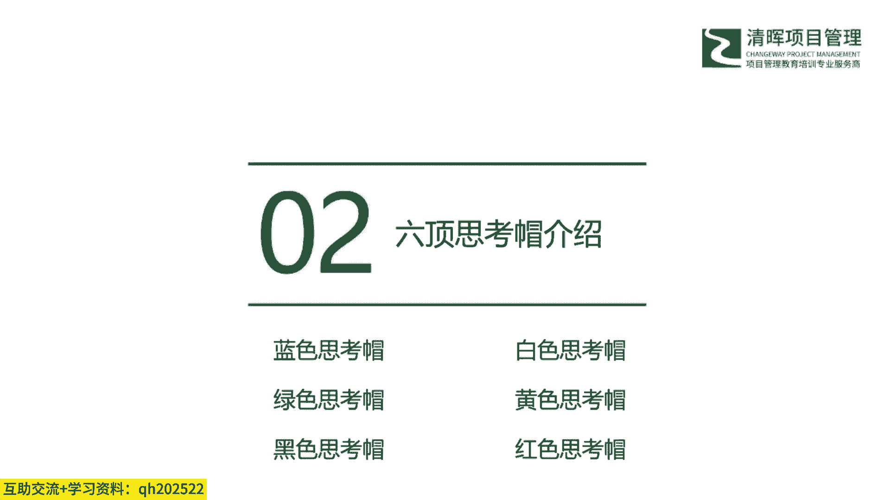

咱们进行一个介绍，首先我们来看一下这个蓝帽，蓝色帽子呢它是控制帽，它的作用呢实际上就像一辆一辆车一样，这个车上边就拉着这个其他的这五顶帽子啊，咱们看咱们这个车上面就是红黄白黑蓝白黑绿。

红黄白黑绿这五顶帽子，然后由这个蓝色思考帽指引和控制，咱们这个思考的这个方向，达到最终的目的地，那么蓝色思考帽呢，它要这个设计编排思考过程中，使用思考帽的这个顺序啊，这个是蓝色思考嘛要做的。

他是思考的这个战略安排，它随时控制整个思考过程，所以蓝色帽的这个控制它是控制的什么呢，它是控制的思考过程啊，那如果我们把这个这个思考的过程，当做一个项目管理，这个是这个角度来分析的话。

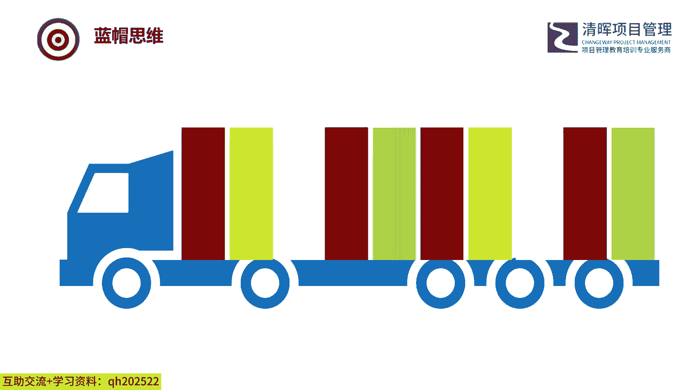

那么蓝帽实际上，它就相当于项目经理的一个角色了，那么在这个咱们用这个蓝色思考帽，在设计这个思考流程的时候，它实际上咱们咱们那个注意观察一下，会发现，它实际上也是尊重了一个，遵从了一个PDC的一个循环啊。

那PDC这个循环，它是我觉得这个理论真的是比较厉害的啊，那我们就是我们学学习过的很多门课程，实际上都有PDC的理论这个影子在里面，那比如说咱们学的那个PNP，PNP就是很典型的一个PDCPDC。

它就是一个一个项目跟另外一个项目，它是一个PDC的这么一个循环啊，那包括其实NBDP很多，很多过程里头，也是有这个PDC的这个影子在里面的，那蓝帽思维，蓝帽思维也是有一点遵从了这个PDC。

他首先是首先是什么呢，首先是确定确定这个思考的主题啊，那么就是我这次思考到底要解决什么问题，那第二步就是列出思考计划，包括以确切顺序发生的事件的细节，那这些都是要在在在这个蓝帽里头去考虑的。

那么第三个是这个思考的组织啊，他要去组织这个进行思考，那么这个时候要有组织，有计划的针对某一个特定的目的去进行思考，那么最后一点是掌控其他思考帽啊，那这个就跟刚才咱们举的那个，车的那个例子一样。

他要时时刻刻的去指导方向，是这样，那针对这个过程哈，我在这边那个打打打一个比方啊，就是我们刚才说了六顶思考帽，它可以由个人由，可以也也可以由那个团队去去那个去那个使用，那么如果是个人啊，像我的话。

通常我会在写，我会那个首先写出，这次的主要针对的哪方面思考啊，比如说我前两年做的一个项目，那么初期呢我们要做一个选型，那很明显这次思考的主题呢，就是我要从我所有可以拿到的产品原型中，找到一个最合适的。

这是我要做的事情，那我这次的思考的顺序是怎么样的呢，啊这个后面会有一个通用的流程哈，我在这里先简单的给大家讲一下，首先我用白帽思维，将我那个目前的所有客观信息都列出来啊，然后写到白白帽思维这里边。

白帽思维之后根据白帽思维提供的这个信息，使用黄茂信息，列出所有就是以往可行的这种方案，然后使用绿帽思维，列出所有黄帽思维，意外的以外的这个其他的这个方案，那么继续使用这个黄帽思维和这个黑帽思维。

对这些方案进行一个优劣势的评估，那么针对这个黑帽思维的风险问题，那么使用绿帽思维来进行解决。

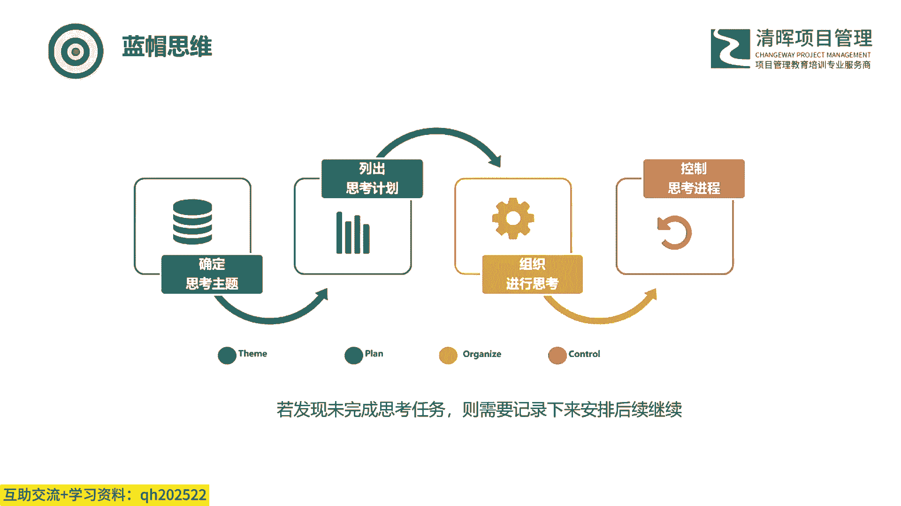

最后用红帽思维来寻找最终的解决方案啊，这个可能呃那个先先先看一下吧，这么讲可能大家也不是很清楚，第一步，第一步我们蓝帽思维，我们去列出我们这个这个思维的这个顺序，这个流程我就是按顺序使用哪哪个思考帽。

第二步就是白帽，那么白帽思维我就把我所有的信息，我所有的信息都提供出来，那么绿帽思维，绿帽思维就是根据我前面白帽提供的信息，我去找我的这些创意点，那么根据这些创意点，我去针对每一个点去分析黄帽思维。

找找优势，找优点，那么黑帽思维去找找劣势，找风险找问题，那么最后蓝帽思维去中去进行一个汇总总结，然后最后由这个红帽思维来进行一个投票表决，那么大家对这次的这个方案满意不满意啊。

所以这么看实际上还是挺清晰的，而且其实做起来应该也不是很难，因为到了白帽思维那边，我们只要把信息提取出来就行，但是我在实际上做的时候，我就发现了一点，这这一点可能就是六顶思帽。

六顶思考帽最难的一点就是在白帽思维，你再去想把你所有的信息提取出来的时候，我发现很难很难做不到，因为我在想想把一个信息，我想到有一个产品我可以去用的时候，我就会自然而然的去想，把它的优点想出来。

想把他的缺点想出来，那么把他的优点想出来，把他的缺点想出来以后，我就会自然而然的就想到这个缺点，我要怎么去克服，所以说很难就是非常中立，非常客观地把这个白帽，它的一个客观的信息给它提取出来。

所以这一点可能是六顶思考帽，在我们个人使用的时候最难的，那这个问题怎么解决呢，就是在我们初期，在我们这个六顶思考帽的使用，还不是很熟练的时候，我们最好是采用会议的方式，大家一起来，大家一起来。

每个人每个人在这个阶段都是戴着白帽，然后每个人都提出都提出自己的信息，不是不是这些信息的不允许提出来，然后提取出来以后，后面我们再去做这个绿帽和黄帽和黑帽，那这样去做，可以去避免我刚才说到的那些问题啊。

那这个这些顺序咱们后面再聊，啊那这边哈这边就是说那个这一页，这页PPT是就是它它的一个意思呢，就是说我们蓝帽思维是为了某一个主题，具体的这个思考主题去设计这个软件的啊。

如那个这个思考的呢是获得相关的主题的答案，这个是我们蓝猫这个思维要做的，那么第二点就是什么呢，就是没有一个固定的架构，可以适用于任何情形啊，那这个呢就是咱们之前像PNPNPDP，包括ACP。

包括我们所有的认证考试，他他都是这么说的，他都是这么说的，这个世上没有万能灵药，没有说没有任何一个方法论，我可以在任何一个情况下都可以用，这个是没有的啊，那么六女思考帽这里也是一样。

这里面的这些流程是每一种情形，我要单独去设计的，去单独去设计的，那下面这种情况呢，它是一个最常见的这种这种框架，那么我们最经常用的就是这种方式，这是最符合我们的逻辑的这种方式。

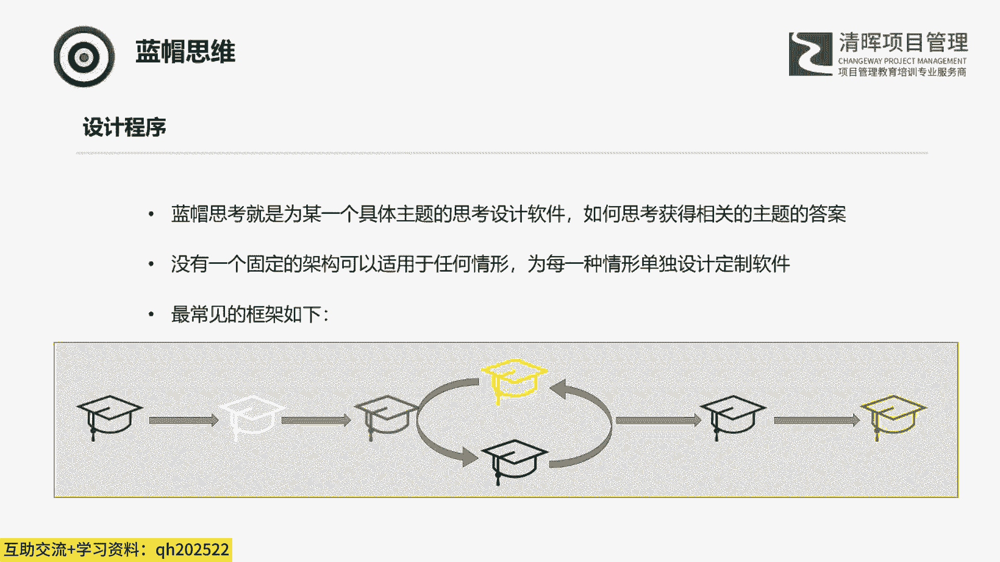

那么咱们刚才也是一直说了哈，咱们这个一直在说这个蓝帽他是控制帽，那它的控制呢，它控制在哪里呢，主要是这么几点，首先这个会议它是由蓝帽思维开始的，那么所以说通常这个会议主持人，他都有这个蓝帽思考功能。

这个我们在实际工作当中，我们是这么用的，因为现在我们公司的这个六顶思考帽，这个这个这个这个工具的推广是我这边来呃，主推的，那么现在主要是我这边的团队，在用这个六顶思考帽。

所以说我们现在的这个其他的这个人员，还没有培培养起来，那么最一开始我们只是做了一系列的培训，那么现在我们的会议的会议，主持人也基本上都是我，那么由我来去去管控这个会议啊，然后我我我来说大家戴什么帽。

大家来说什么话啊，所以说这个会议主持人，它是要有一个这个蓝报思考的功能的，如果说没有，那么你可以没有，就是说如果说我参加了一个会议，如果会议主持人不是我，那他可以把这个这个角色委派给我。

让我来做这个蓝帽啊，他通过这种方式来控制，那么第二点呢就是蓝帽控制的主要任务，他是结束争论，争论最容易发生在什么地方呢，争论最容易发生在黑猫的时候啊，大家最容易那个挑错，说错的那个挑错的时候。

挑着挑着两边就开始吵起来了，这个时候蓝帽要负责去去，怎么样去结束这个争论，说大家不要吵，那么你们黑帽的理论是什么，你们黑帽的有有没有什么根据啊，通过这种方式来来去控制这个呃争吵，那么第三点是确保什么呢。

确保参会者始终遵守游戏规则啊，那这个也这这一点也是很重要，但是也是一个比较难的，因为很多人他可能就是想我就是没有创意啊，你让我去想什么创意，我就是想不出来啊，那这个呢它实际上也是可以经过培养的啊。

那这个创新创意这个我我们到后面再聊，我们再到那个呃，到后面再聊哈，那最后一点就是，如果说我们已经确定了这种思考方式，思考者就应该有意识的努力，以那种方式来进行思考，这一点就是什么呢。

这一点就是我们之前说的，就是我们这个他不是给人来定性，你这个人你可以是一个擅长挑错的人，或者是你是一个呃完全没有就是创意的人，我们这个来那个六你思考嘛，他不是想改变你这个人。

他不是想改变你这个人的性格啊，而是让你以这种方向，以这种行为去思考，所以他是设定一个思考模思考模式以后，你按照那种思考模式去思考就可以了，而不是说你要改变你的行为啊。

所以这个是六顶思考帽他可行的一个地方，如果他是要想改变你的行为，那可能这个问题就比较大了，就不太可行了。

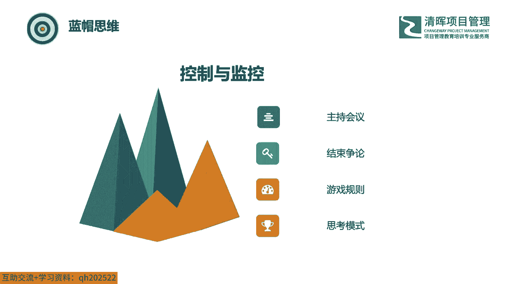

那么这个蓝帽思维哈，他除了这个控制控制以外，他还负责进行整理啊，他要做一个归纳和总结，他在整个会议过程当中，他要不断的进行总结和记录，这不是说在最后一步，就最后一步做一个总结就可以了。

我们在整个过程当中需要不断的总结和记录，这个记录呢不是只记在脑子里面啊，这个一定要记住，是要记在白板上，或者是大家都能看到的地方，这样大家对思考的整个过程和这个推导的过程，才会了如指掌啊。

那还有个重点是什么呢，我们每一次会议哈，他不是说一定会有结论的，这个不一定不一定一定会有结论，但是呢会议结束的时候，一定要讨论一下我们的会议的结果怎么样，还差什么，后续的步骤是怎么样的。

大家的任务如何划分，下次会议什么时候召开，这些信息是我在会议结束之前我要确定的啊，那么所有的这些事情都是要由这个蓝帽啊，由这个蓝帽思维去做的。

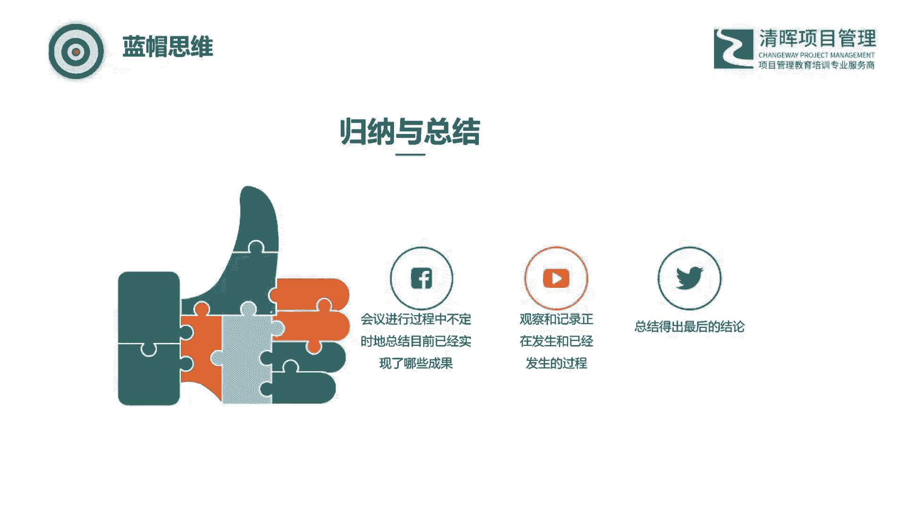

是这样啊，那么蓝帽思维呢就是其实还是一个比较简单的，因为他还是比较符合，比较符合我们的一个，就是平时的一个项目管理的，这么一个一个一个一个思路啊，所以这个上面也是简单的聊了一下。

那么在这里做一个简单的一个总结哈，蓝帽思维的总结，那么首先蓝帽思维是负责确定思考的主题啊，设计思考的步骤流程，我这次这个整个思考思考的主题是什么，我要思考什么，蓝帽思考，蓝帽思维。

它主要是控制这个思考的过程的，他不是说我怎么去那个，就是这个这个思考这个问题到底是什么，这不是蓝帽思考，他最他那个他关心的，他关心的是这个思考的过程是不是对的啊，那这个就是第二点。

蓝帽思维是控制帽负责控制整个思考的过程，那最后一点蓝帽思维，总结思考成果及后续步骤啊，那这个也就是刚刚我们说的，就是不一定我们每一次会议都是有结果的啊，那这个我们要就是把我们的会议的后续步骤。

也都给确定下来，蓝报斯兰报思维，我们刚刚聊到，他要把整个会议过程当中，所有的这个结论都记录下来，最重要的一点是，把我们所有的创意都记录下来啊，那可能有一些创意在我们现在当前这个时代。

可能是当当前这个时机可能是不合适的，但是我们要把它记录下来，放到我们的创意库去进行管理啊，所以这个也是蓝猫思维要去做的，一件很重要的一个事情，那这个蓝帽思维，刚刚也是给大家那个聊了一下啊。

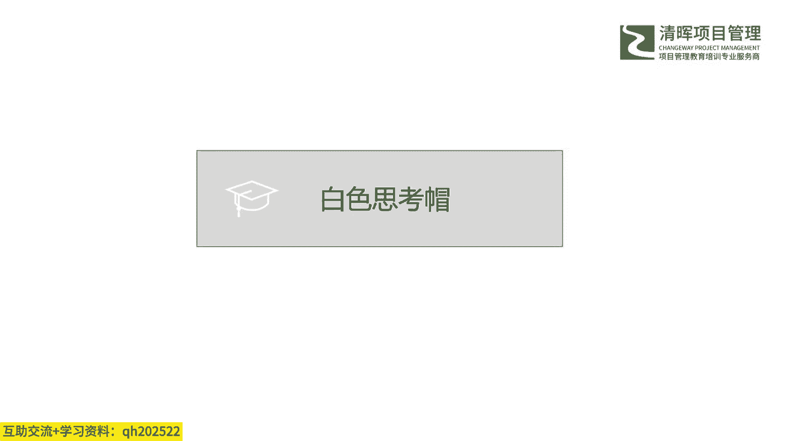

那后那后面我们再聊一下这个白白帽思维，白色思考帽，白色思考帽也是一个比较重要的一个帽子，那刚才我也是举了一个例子哈，这个例子里面也是表现出来了，就是白色思考帽，它是也是比较难的，也是比较难嗯。

那我们先来看一下吧，啊那我们当我们用那个蓝色帽子，确定好我们的这个思考的规则以后，那戴上白色帽子，为本次的思考提供客观的数据和信息啊，这就是我们这一步要做的那这些数据哈，就跟那个就电脑一样。

它是一个冷静客观的，不掺杂一点主观意志的输出数据和信息啊，电脑输出的信息它就是数据和信息，它没有电脑是没有没有意识的啊，所以说在我们整个思考过程中，我们需要持续不断的进行，这个白白帽数据的这个输出。

它是它是我们整个思考思考的一个输入啊，那咱们思考后就是呃，这个下面也是提到了一点啊，就是说会议开始后，会议开始后，是我首先要为当前的会议提供提供依据啊，那我就是在会议开始之前。

我们各方收集到的数据我都要提供出来，那么我呃后续的这些流程都是根据这些呃，数据和信息来进行思考的，那么会议进行中，我要为不断为会议主题提供信息，因为会议会议进行中，不断的会有黄帽，不断的会有黑帽。

黄帽会有那个优势呃，优势提出来，黑帽会有这种问题和风险提出来，那么这些优势和问题它都是要理论根据的，这个理论根据都是由这个百茂数学来提供的啊，不能无缘无故的去说你这个好或者你这个坏，那不是白帽和黑帽。

那是红帽干的事，那会议结束以后，我们要看一下结论，是不是符合当前的这个信息啊，那这个是会议结束以后，我们要把我们的结论，跟我们当前信息去进行一个对比，所以说白帽数据它在整个会议过程当中。

都是起到一个非常重要的作用的，那其实我们这么看啊，那我们可能也觉得，这个白帽思维也是一个比较简单的啊，就是提供一个就是提供数据而已嘛。

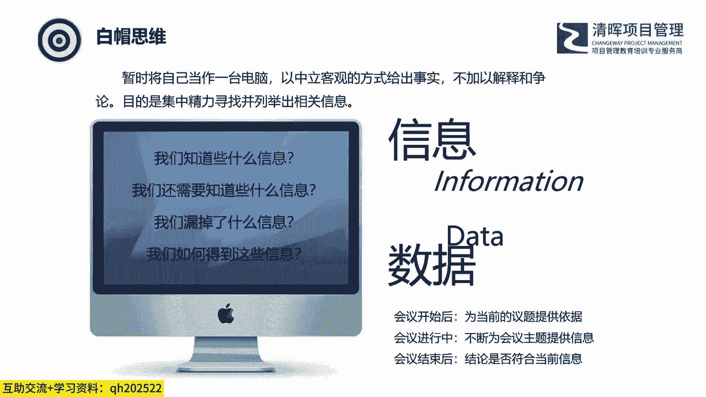

那么它其实也还是有一些那个需要注意的，一些地方的哈，那么首先就是首先第一点非常重要的一点，就是只需要提出所需要的信息啊，那这里我举了一个例子，这个例子是在那个呃那个反垄断，那么69年的时候。

69年的时候，美国政府对IBM提出了这个诉讼啊，说控告这个IBM这个企图垄断，那么该诉讼呢最终最终是被撤回的啊，不了了之了，那大概大概在当时人们是意识到，这个如果没有这个IBM的力量。

那么可能无法跟那个，这个日本的电子行业展开竞争，那这是那这个是那个当时猜的，那么还有一部分人猜，那之所以撤回诉讼，还有另外一个原因，这个原因是什么呢，是IBM提供了堆积如山的文件。

他们给了给了很多文件啊，据猜测大概有700万份，所以说这个七七百万份文件怎么看，对不对，所以没有哪个法庭能够应付，这么庞大的一个阅读量，那还有个问题，如果法官在这个审审那个案件审理过程当中。

他去世了怎么办，那这个案件还得重新开始审理啊，那么鉴于法官在这个接受任命的时候，年纪都偏大啊，因为你那个很年轻的一个法官，他是没有这种经验和智慧去审的，所以说法官在这个这个这个案件的审理，过程当中去世。

他就是一个大概率的事件啊，所以种种这些原因，就导致那这个案件最后就是一拖再拖，这个案件最后是拖了13年，花了纳税人和IBM几10亿美元以后，就不了了之了啊，不了了之了，这个是这个是一个比较。

就是比较经典的一个案例，不是那个反垄断啊。

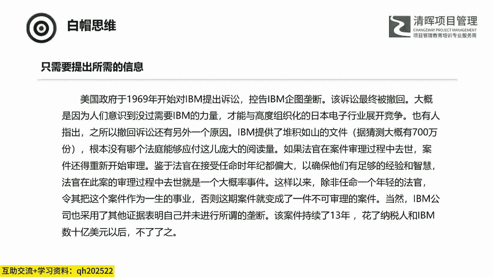

说错了，那其实这里面刚刚也说了啊，只需要提供所需的信息，所以什么呢，所以我们在要求信息的时候，我们在要求信息的时候一定要什么，一定要有一个精准的表达啊，那表达其实谁都会上下嘴皮子一碰对吧，话就说出去了。

那其实这里的表达有也是有级别的，那这里面我分了这么四个级别，那么大家可以也可以看一下啊，这四个级别表达出那个表，那个表达出来的意思是不一样的，第一个是所有专家都判断，用A方案在进度内完成项目目标对吧。

那第二个呢是我跟四位专家谈过了，他们都说用A方案在会在进度完，额进度内完成项目目标，这里面突出了多了两个点，一个是四位专家，一个是在进度内啊，那个进度内前面就有了哈，那第三个级别是什么呢，是我跟张总。

李总，王总和谢总都聊过了，他们认为用A方案会在禁毒内完成项目，没问题啊，第二个你四位专家，你哪四位都不那个就不清楚对吧，那大家看这个你找的谁啊，也不知道那一看啊，谢总，那都哎很清楚。

这四位老总他们看过了就肯定会没问题，那么最后一点是什么，是我跟张总，李总，王总和谢总昨天开会碰过了，他们认为用A方案会在禁毒内完成工作，是我昨天昨天刚碰的，不是一个月以前碰的，不是什么半年以前碰的。

是我昨天刚碰的，这是一个最新的信息啊，那这样的话诶，这个信息就会明确无误的传达过去了，那其实这个哈这个我们在这个这方面，我们可以遵循另外一个原则，就是5WEH啊，就是我们的时间地点人物对吧。

什么原因做了什么事情，怎么做的啊，你把这五点都讲明白了，那么实际上我这个信息信息的表达，实际上就是可以说是已经。

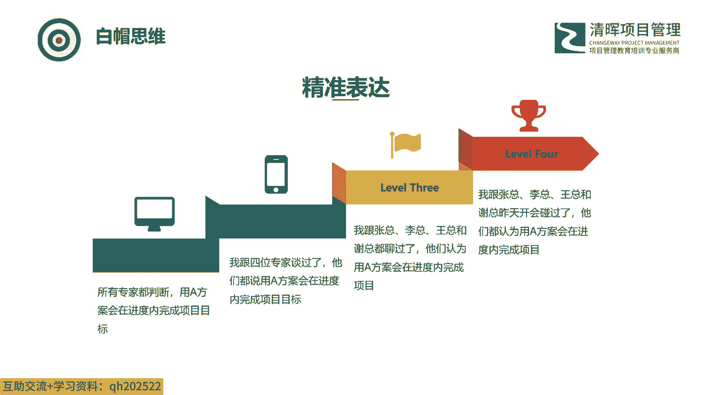

可以说是已经非常的精准了，那么第二点要重要的，第二第二点要注意的哈，就是我们这个信息他就是信息，那么注意这里面的客观两个字哈，就是我们在收集这个信息的时候，不是先有观点，然后根据观点来找信息和数据。

不是这样的，那这里我做了一个对比对比，那这个对比呢，我是跟那个就金字塔原则去对比的，这个可能也可能大家或多或少的都了解过，这个金字塔，金字塔这个模式是什么呢，它是先有论点，子论点，论点啊。

论据然后是什么呢，然后就是用这个论据来证明我的子论点，用我的子论点去推我的论点，那么在这里它采用的一个原则是这个miss原则，就是相互独立，完全无穷啊，所以这种方式它是什么呢，他就是先有论点。

然后我再去想办法去证明我的这个论点，白毛思维不是白貌思维是反的，就是我在会议之前，我在思考之前，我是没有观点的，我没有观点，就是比如说我刚才做选型，我在我在开会之前，我是没有观点说那个我可以用。

我可以用A原型，我可以用B原型，我可以用C原型，这个在开会之前是没有的，那么开会的时候最一开始就什么，最一开始就是，大家把所有的数据和信息都拿出来，然后我们再慢慢的去分析，我们到底要用。

我们我们到底要用哪个哪个原型，最一开始可能连那个备选项都没有，是什么都没有的，是没有观点的，所以说这两点是非常关键的，非常关键的一个区别啊，所以这里面也说了，他是客观的将所有已知信息和数据表达出来。

不掺杂任何其他的成分，这里面没有情绪对吧，没有情绪，没有，你对他的一个，就是这个这个这个这个这个很主观的一个判断，啊啊那这里的原因是什么呢，就是我们用于争论的信息和数据，是基于某种目的的。

就刚才打个比方说打个比方说，我们团队觉得这个，我们团队觉得，这个项目就应该用那个产品原型A，那么这个时候我去收集的这个信息和数据，我就会倾向于去去怎么去证明，我这个产品原型A适合这个项目。

那这个就是基于某种目的的，那你这个时候如果说你发现了，有那个有利于B项目的，你你都不会说，你都不会说，你甚至会会阻止对方去获得这个信息，所以这个他就不是白貌思维要做的事情。

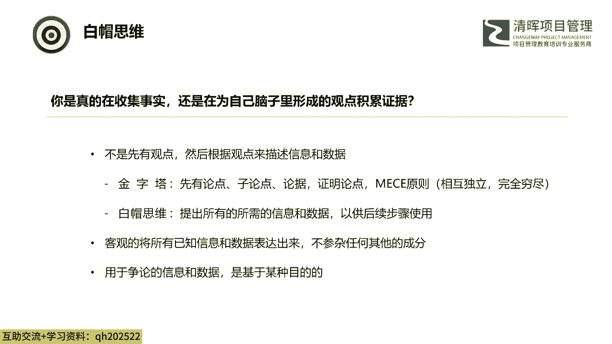

那第三点哈，第三点就是也是一个这个比较比较关键的啊，它是什么呢，就是信息呢是事实，而不是判断，而不是判断，这边我举了几个例子啊，那么大家看一下事实是什么呢，事实是今天气温是四度啊。

那推断呢是今天天气很冷，那这个可能他就不搭了啊，因为刚刚可能也聊到了哈，我是我是东北人，我是沈阳人啊，那么沈阳气温四度对吧，我们觉得很暖和，我们觉得很暖和，我们冬天基本上都是零下20多度，零下30多度。

那你今天今天气温四度，我们觉得很暖和，但是如果到了南方，到了福建，那你这个气温速度，他们可能呃可能会觉得有点冷啊，啊他们我之前有几个福建的朋友，他们就他们他们跟我说，他们跟我说什么呢。

他们过年他们可能都要都要穿短袖，对不对，所以右边这个是什么是事实，左边这个是推断呐，那么以此类推哈，那么第二个美国的犯罪率是10%，这是不是高，是不是低啊，不知道这个是事实，这只是事实而已。

这只是我把这个信息拿出来而已，但是左边这个美国的治安很差，这是你的判断，这是你的判断啊，第三个，同样的房地产最近不景气啊，那么事实呢是什么呢，是房价最近下降15%啊，那公司的人员流动率是15%。

这哎这个工作量是100人员，这都是事实，那么左边公司的人员流动率很高，工作量很高，那这都是判断判断啊，那讲讲到这哈，我不知道这边大家是不是理解了，因为这个其实对于我们后面的额。

就是说那个那个实际上使用这个六顶思考帽，也是很重要的，那在这边哈，我给大家就是呃呃有福建的朋友路过哈，那在这边哈我给大家就是呃说一个信息，那么大家来帮我判断一下哈，来帮我判断一下。

这是不是一个白帽思维的一个信息，这个信息是什么呢，就是我们根据我们的市场调研啊，就是一家西那个就是烟草公司哈，根据市场调研，去年和前年的，去年不是也也不是根据市场调研了啊，就是根据他们的一个统计情况。

去年和前年的这个女女性，女性香烟的销售量是是增长的啊，所以呢就是女性香烟的这个这个这个销售量，它是一个它的趋势就是增长的啊，那么这个是不是是不是这个信息，是不是我们的白帽思维啊。

那这个可以在这个咱们那个讨论区呃，大家讨论一下，我不知道我有没有表述清楚啊，就是根据我们的统统计信息，去年和前年我们的女性香烟的销售量是增长的，所以最近这几年的女性香烟的呃，那个就是那个是额趋势呢。

趋势呢是呈一个那个增长态势的啊，就这个信息是不是白帽思维，啊那有朋友说那个这个可能不是哈啊，那由于时间关系啊，时间关系我在这里面就是那个哦啊，大家都说不是了啊，他确实不是啊。

他确实不是因为你去年和前年增长了，它只是代表了去年和前年增长了，它并不代表你明年也会增长，并不代表你今年也会增长啊，所以这个时候这个就是刚刚这个信息呢，他的白帽思维是什么呢。

就是去年和前年的销售量是增长的，增长了多少就完事了就完事了。

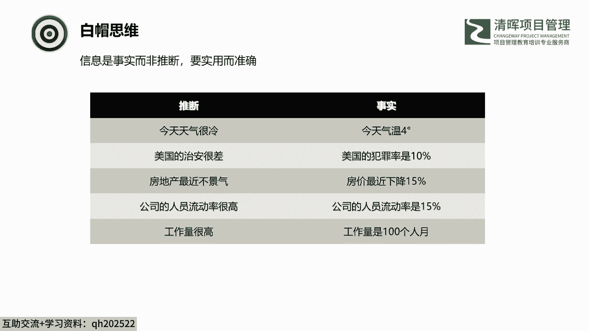

后边那个判断就不要加了啊，所以这个是我们的白帽思维，那在这里面哈，我单独那个就是再聊一下这个东，西方的这个会议文化，会议文化啊，因为我最一开始出来是在那个清华同方，然后我的第一个客户呢。

第一个客户就是一家日本公司，是野村证券，是日本最大的那个就是证券公司，那么所以说我也是呃跟日，跟那个日本的公司接触，接触的比较多，也是参与了很多他们的会，那这个西式会议哈跟日式会议他们有一个区别。

就是什么呢，西式会议呢它是不是日式会议呢，他是在开会之前，开会之前，大家是没有一个成型的观点的，那么在会议过程当中会产生观点，那这个观点他会像一个树苗一样去生长出来，继而去发育，这个是日式会议，那。

那西西式会议是什么呢，那西式会议是什么呢，西式会议他就认为只有经过辩论，那么才能形成一个观点，参加会议之前，那么已经大家就已经有了，就是自己的观点，那么通过会议呢去说服别人啊。

所以这种日式会议跟西式会议，它的这种文化的一个区别，所以导致什么，所以导致这两个这两个国家他们在在在做区，在做创新的时候，他们可能会也会有一些区别，那么我们可能会比较清楚。

像一些颠覆式的创新在西方是比较多的，那么在日在呃，那么那么在日本呢，他这种颠覆式的创新实际上是不多的啊，它都是一种就是那种持续性的创新，因为它是什么，它是先有他是先有这些数据，先基于已有的一些数据。

然后他们去产生观点，然后去这么着呃，那个着壮的去发展啊，所以这个可能也是就是双就是日式和西式的，他们的这么这么一种创新的一个一个区别。

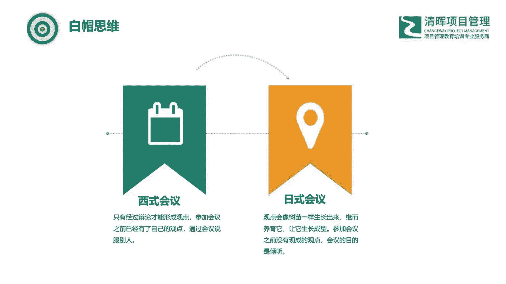

那么在这里哈那个总结一下就是白帽思维，白帽思维有三点，第一点是信息索取要明确，争取第一次把事情给说明白，就是你要什么数据，你跟他说明白，第二点是不是先有观点，然后根据观点来描述信息和数据啊。

观点我们是后面产生的观点，我们是后面等我们的绿帽，等我们的黄帽黑帽这些循环往复以后，最终我们才会去产生我们最终的真正的观点，第三个是客观地提供信息，不施加任何自己的判断啊，那这个呢就是我们的白帽。

额接下来哈我们看一下这个绿色思考帽。

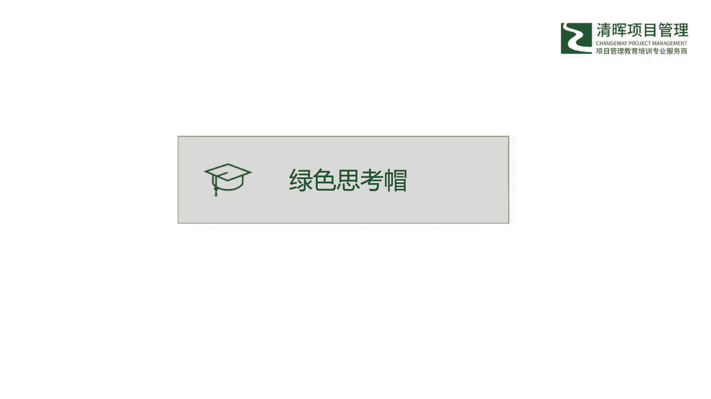

绿色思考帽是我们的创意帽啊，绿色思考帽是什么呢，在这一步我们提出我们新的想法，这里既包括原有的选择，也包括新新产生的选择啊，那么同时绿色思考吗，他还要做一件事情，他是要针对提出的问题。

意见风险进进行修改和改进啊，我们就是前面我们提到了，就是我们在那个黑色思考呃，那个黑色思考帽的时候，我们要提出这个风险的提出问题的，那么绿色思考帽是改进的一个地方，另外一个地方有可能会在黄色思考帽啊。

但是主要是在这个绿色思考帽这里面。

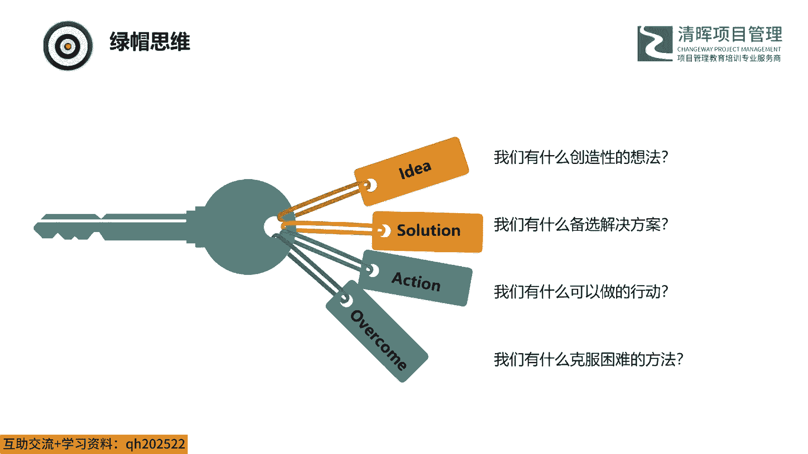

去去去去做去做，是这样的啊，那么在这里哈我们聊一下这个绿色思考帽，它是一个跳，让让我们的思维去跳出，我们的这个就是我们现有的这个模式，超越对错啊，我们不是说这个事是对的还是错的，是这样。

啊那么就是说我们在这里面啊，就是就是列举了额，列列了这么两种的一个创意的产生方法，那这个实际上啊，实际上这个创意的生成方法有很多，那么现在哈据统计就是说咱们有这种统计的。

就是呃就是有有据可查的这种创意方，创意方法呢大概有差不多将近300种，有很多，那咱们NBDP的第五章啊，讲了有好像是有九种，有九种这样啊，那么在这里头我列举了两种，一种是呃NBDP里面有的。

一种是NBDP里面没有的啊，那第一个呢就是逆向思维，逆向思维是在NBDP当中没有的啊，这个呢是说出某事通常的发展方式，然后运用逆向思维从后往前推，这个是逆向思维啊，那在这边呃，那个也可以给大家举个例子。

就是就是打高尔夫球啊，打高尔夫球，我不知道你们有没有，就是会比较喜欢打高尔夫球的啊，那打高尔夫球他需要一个很宽阔的一个草地啊，那我们现在呢就是有一种，有一种那个高尔夫球的练习方式呢是什么呢。

就是在室内室内打这个高尔夫球啊，那这里面就有个问题，就是在光滑的就是水磨，这个水磨石地面上能不能打，那室外的高尔夫球它是怎么样的呢，它是利用光滑的高尔夫球，就球本身它是光滑的。

那么利用这个光滑的高尔夫球面，和草地之间的相互摩擦，那使得这个高尔夫球逐渐慢慢的停下来，这个是在室外，那么如果做到室内呢，那你就不能这么做，因为你如果高尔夫球还是光滑的，那这个球可能就一直滚下。

停不下来，那么这种情况下怎么办呢，啊那么这种情况下就是有一种办法是什么呢，可能就是在地面上铺毛毯，把那个铺地毯就是有那种纤维毛的地毯啊，那还有一个不用地毯行不行啊，那这里就用到了这个逆向思维。

这个毛我不长在地上，我长在球上，所以说这个毛长在球上，就发明了这种带毛的这种高尔夫球，那么利用有毛的高尔夫球的这个球面，和光滑地面之间的摩擦，那么它仍然能达到使这个球速减慢的这个功能。

就可以在这个光滑的水磨石地面上，打高尔夫球了啊，那这个呢是逆向思维，逆向思维里面就是逆向思维里面的一个例子，就是使用我们逆向思维来进行创新的一个例子，那么第二点第二点就是检核表啊，简和表。

这个我们在NBTB书里面是说的，就是那个奔奔驰法啊，他有七个，七个那种那种那种，那个就是那种创意的那个方向的那个呃，属性的工具，那么在这里呢这个SCA这个奔驰法它的来源呢。

它是根据这个奥斯本检核表来的啊，那这个检核表呢它是由九个属性，九个属性啊，有无其他用途，能否借用，能否改变，能否扩大，能否缩小，能否代用，能否重新调整，能否颠倒，能否组合，通过这些方式。

通过这些方式来做的，所以说那这个实际上它在实际工作当中。

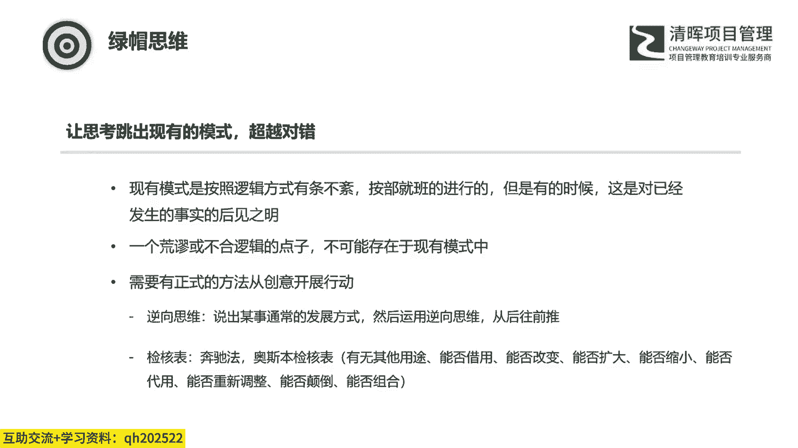

使用的时候，它是以这种方式来呃，使用的就是这么一张结合表，那么在这张表上有我们左边，我们左列提供的这些类型，那么比如说能改变此材料的外形，热力电气化学和机械性能吗，那么我们在这个右边这个创意里面。

我们去哎我们去写上，我们怎么去改变这些改变这些属性啊，那比如说第三个，这是必备功能吗，那么在创意那边是必备，那么必备的话怎么办，不是必备的话怎么办啊，能制作新模型吗，那也是在这个右边哎。

我们去把我们的创意写下来，所以说它是通过这种方式来给我们，去找到我们的这个思路的方向啊。

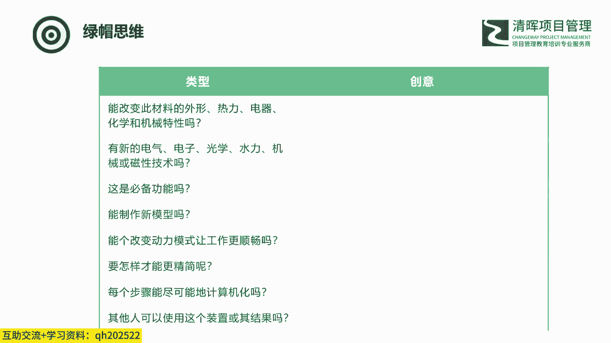

那这个这两种方式检核表，奔驰法和这个奥斯本检核表，这两种实际上都是什么，都是我们之前聊到的可能性，可能性它是什么，它是针对我后面列的这些这些方向，我们去寻找可能性，那么在这个可能性上就是我们诶有创意。

有有我们创新的地方啊，所以这个是整合版的结合表，那除了这个逆向思维和检核表，我们刚刚也说了，就是我们书上是提到了九种，那还有300多种，包括什么联想法，包括什么发散法，包括焦点法，有很多有很多。

那这些在我们实际工作当中，我们也可以去，我们可以去找一下，找一下以后针对我们现在做的那个行业，那个产品，我们看一下是不是可以去试用，可以去试用，那么由此呢就引出来了一个问题哈，那我们这个创造力。

创造力他是一个技能还是一个天赋，还是一个性格，啊就是哎有这么一个问题，有这么一个问题，那其实人们很容易认为啊，这个创造力他是跟天赋有关的啊，比如说那个乔布斯，比如说马斯克对吧啊。

那有很多人可能唉灵机一动，他就有一个好点子啊，那这个好点子他可能就会哎成为一个好的创意，成为一个好的产品啊，甚至是一个颠覆式的，所以说呃就是呃很容易给人这种感，那个这种感觉哈啊那其实在这里。

如果我们不努力去发展创造的能力，那创造力只能是天赋或者是个性的能力啊，如果你不去我我我再重复一遍这句话啊，如果你不努力去发展创造的能力，那创造力只能是天赋或者是个性的能力。

就是创造力实际上是可以去培养的，去可以可可以去训练的，而且我们刚才说了，有300多种创新方法，所以你可以去使用这些呃，这些创造工具你可能达不到顶尖的那些，就是具有很高的天赋，和具有具有具有很高的天赋的。

那些人的那种能力，但是你可你你你是很有可能成为一个，持续性创新的一把好手的啊，所以这个实际上就是创造力是技能问题，天赋问题还是性格问题的一个答案，我们创造力是可以可以培养的，可以培养的。

那在这边诶就是第三点啊，第三点我们来看一下，就是我们在这个绿色思考帽里面，要做的一件事情呢，还是要去找一个备选方案，那做事的方法呢很明显它不只是只有一种，那看待任何事物，通常我们都是有很多个视角的啊。

那这个可能跟我们从小到大，我们受到的教育是不一样的，我们小学包括我们初中，高中大学，我们考试，我们学习我们考试答案都是唯一的，答案都是唯一的，你算对了就有分，你算错了对吧，就没分，对不对。

但是我们诶进入到实际工作以后，那么我们发现我们所有的事情，它都是有备选方案的，我们的方案都不是唯一的，它都会有好几套方案，所以说在我们以这种方式去寻找，就是呃多种备选方案以后。

列出已知的所有的处理方式以后，我们就可以去努力去超越这些备选方案啊，那这个其实就是说那个呃，就是之前也是了解了一下那个精益精益，我们之前NPTP里面也是写了，就是精益的是三个原则。

那精益有一条就是要在我们的前前段啊，我们的就是前端，我们的前端去尽可能的，尽尽可能多的去寻找备选方案，去制造，去尽可能多的去制造我们的原型啊，然后就是将我们的功夫，尽可能多的花在我们的前端。

它实际上也是这个道理，所以我们会发现他很多的理论，他很多的这种方法，它都它都其实是通的，他都其实是通的啊，那你比如说我们最下面最下面我们举了个例子，就是比如说我们要针对针对一个我们的产品。

我们要去下一个决策，那我们是保持原价呢还是涨价呢，还是减价呢啊，那是不是，是不是我们的就是备选方案只有这三种呢，啊，那这个大家也可以在那个就是讨论区里面，就是留一下言啊，就是说我们针对一件产品的。

它的一个就是价格的一个决策，是不是只有这三种啊，原价涨价或减价，是不是还会有其他的决策呃，除了这三种，其实我们还有很多种呃，很多种方式，因为你保持原价涨价呃，这个减价它也是有一个时间段的。

根据时间段我们可能用不同的方式，我们可以做捆绑，我们可以做，我们可以做，我们可以做一些其他的一些促销的一些活动，所以说在这里并不只是这三种备选方案，我们要尽量去寻找，寻找更多的那个备选方案。

那我们简单的总结一下我们的绿帽思维啊，那么首先是绿帽思维呢，要从我们固有的模式跳出来啊，那在这里面就是给大家举了两个例子，一个是我们的逆向思维，一个是我们的检核表啊，那第二点第二点也是比较重要的。

就是创造力是可以后天培养的，可以使用各种不同不同的这个思维及工具，来进行创新，所以六顶思考帽就是也非常有价值，它可以让它可以使得大家在戴上这个这个这个，我这个创意帽之后。

创意猫之后去努力的去往这个这个方向去发展，那么逐渐逐渐大家大家可能会发现哎，自己会非常有创造力，自己也可以想出很多别人想不到的点子啊，那第三点就是要尽可能多的提出解决方案呃，尽可能多的提出解决方案。

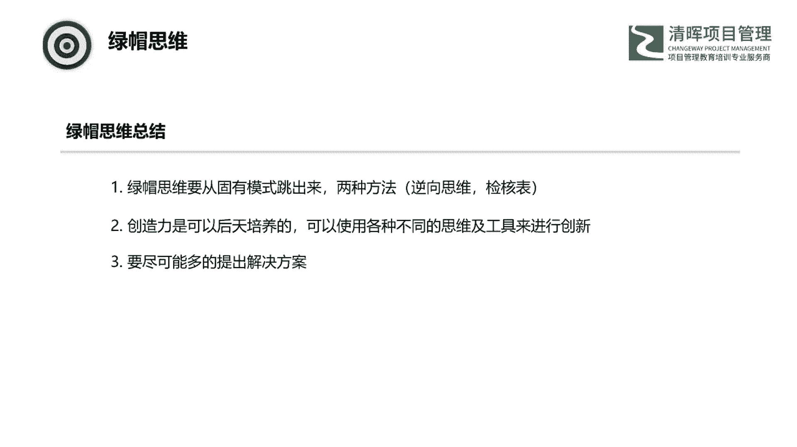

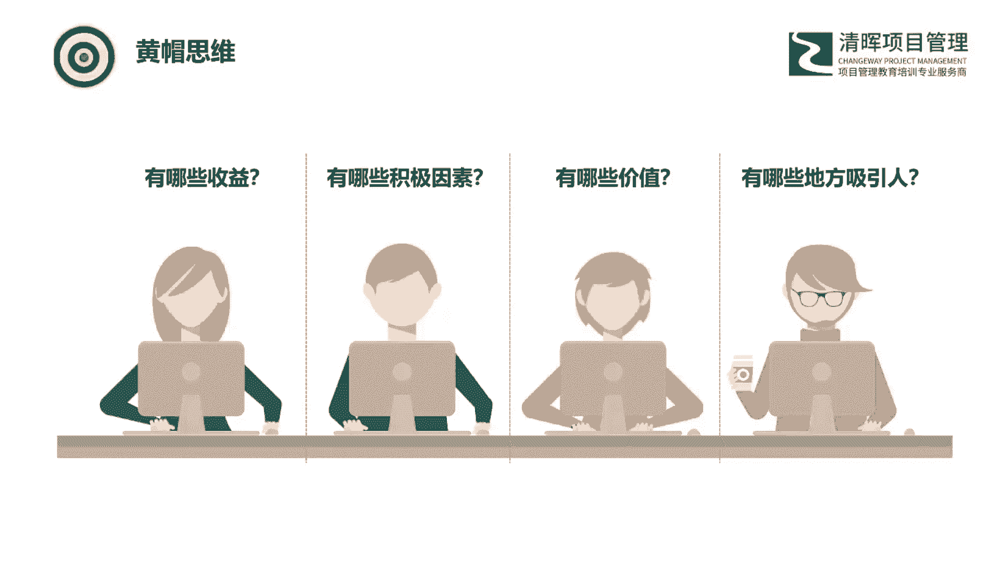