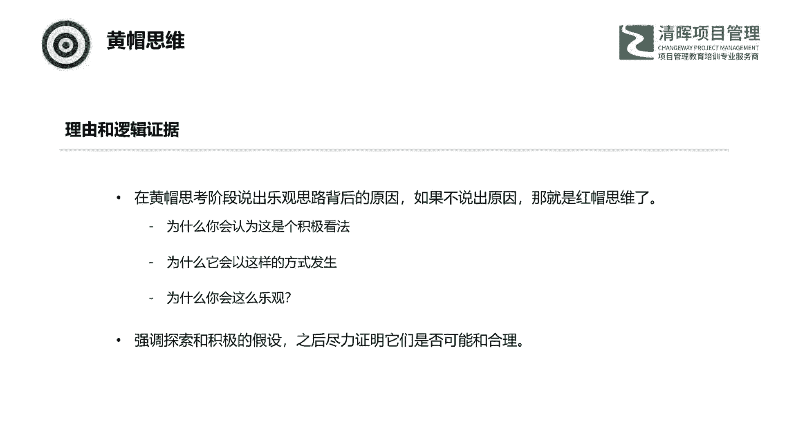
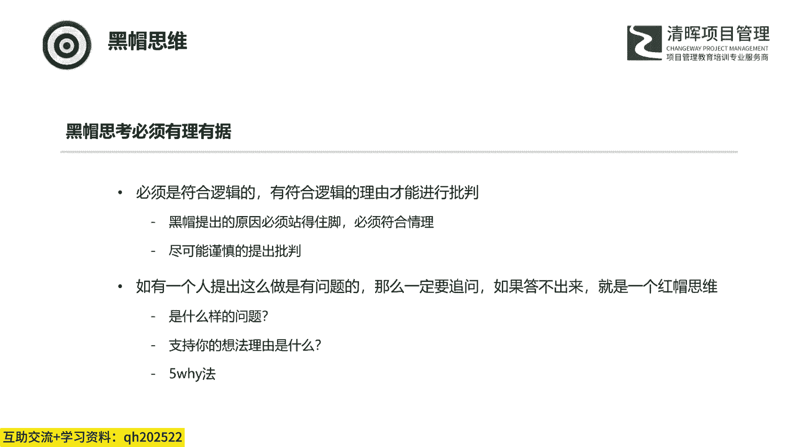

# 产品管理：运用帽子戏法思维，实现效率与成果的双重飞跃 - P3：2、六顶思考帽介绍（下） - 清晖Amy - BV1GGpUezEpS

那下面我们来看一下这个黄色帽子，黄色帽子呢是绿帽礼貌，针对我们激发出的这个解决方案，寻找解决方案有哪些收益，积极因素，价值有哪些地方吸引人啊，那这些呢都是黄暴思维过程中需要考虑的。

狂暴思维也是比较困难的，因为我们的大脑有一种天然的机制哈，是来规避风险的，是规避风险的，导致人们还是很容易往负面的角度去考虑问题，自然而然地就显现出相关的这些问题和风险，不太容易从正面去考虑问题。

所以我们需要培养一种价值敏感性，那这种价值可能不一定是在眼前的，有可能是在未来的，不一定是在眼前，我们看到的这个区域，它有可能在更广阔的区域，那打个比方啊，打个比方，这个是我我这边那个经历的。

真实的一个一个例子，就是之前我们公司的这个销售，他去跑了一个小县城的这个，政府机关的一个项目，这个项目呢是一个是一个比较小的一个系统，那么也就几10万的一个小项目，而且当时呢还是有一点难度的。

因为它涉及的环，涉及的环境呢比较复杂，因为它是个政府项目，那需要对接的部门呢也是比较多的，那么讲道理，我们是没有理由做这个项目的，这个项目不说九成亏吧，八成是会亏的啊，那但是呢后来呢经过更多方面的了解。

发现这个项目后面有更广阔的一个市场，我们了解到这个项目是一个省级的一个，试点项目，那到后面有很多的这种小县城的去去支撑它，这个省有将近有100多呃，有将近100多小200个县城。

那么这些线程我们只要拿下来一半，那么这个诶也是一个非常大的一个市场啊，所以说唉当时我们就考虑诶，我们就去去做这个项目啊，那么这个后面的那个我们公司也是很重视，重新去思考，重新去投入。

那最后公司呢也是成功的，做了一个亏本的项目啊，这个项目这个项目是这个项目是亏本了，这个项目是亏本了，但是实现了公司预定的目标，公司预定的目标就是我们项目上线时间，当时项目上线时间是定在了。

省领导来考察前的半个月，这半个月我们把这个项目没有，没有问题的上限就行，花多少钱，其实这个是呃也不是无所谓哈啊也不是无所谓，也不能太多，也不能太多，但是这个这个这个项目本身是亏本了啊。

但是后来他是也是实现了，一个公司的一个目标啊，那么在这里呢就需要一定的敏感性，你才能看到这个项目的价值，如果只看这个项目本身挣不挣钱，那这个项目我们是不会去做的，那我们来下面我们来看一下这个黄帽的。

这个需要注意的一些点哈，因为这里我们说黄帽是利益帽，他是一个很乐观的这么一件事情，那么在这里我们就要明白，有一个有一个有一个观点，就是一个积极的一个范围，那么这个积极的一个范围是什么呢。

它是一个从极端的过度乐观，到一个极端的逻辑使用啊，所以说这个时候，这个时候我们可能就是要注意一些，那最近这两年哈，就是那个就健身房，这个行业好像也也不太景气啊，因为我本身是就是非常喜欢健身的那家。

那那个就大家可能呃也知道啊，爆出来很多这个健身房跑路的这个事情，那前段时间哈出了个新闻，不知道大家有没有关注，就说重庆重庆有家健身房，他这个特别的耿直，他装都不装啊，就是前脚发广告，就是办卡。

然后卷了一波客户的钱，没开两天，老板直接跑路了对吧，所以这个大家可能喜欢健身呃，就是可能或多或少的有听到这个类似的新闻哈，那这个神奇的哈，神奇的不是这啊，健身房跑路有什么神奇的，那个挺正常的啊。

跑路的多了，神奇的是什么呢，就在这个位置后面又开了一家啊，又开了一家，这下这个大家就开始这个吃瓜看戏了哈，那么前面老板刚跑这个谁谁还来办卡呀，没成想哈，还真有一个很忠实的一个迷妹，有一位阿姨。

这个阿姨呢就说我就喜欢肌肉男，我就想肌肉男带我练马甲线，前后呢又充了1万多块钱，结果这健身房又跑路了，不过后来哈有人去采访了一下这个阿姨啊，这个阿姨呢她就说那个没事啊，我只有一个要求，我要健身。

我也不要退钱，不差那点钱，这里不讨论健身房跑路啊，最近跑路的估计也挺多的，单纯看阿姨的这种心态，其实就是过度乐观了，其实就是过度乐观了，你再打个比方啊，之前我不是这个，可能这个可能也是个笑话哈。

就是那个就公司发年终奖，发个就是彩票啊，两块钱彩票啊，说发了500万对吧啊，那这种实际上他都是一个这种过度过度乐观，所以说这里头回到我们的黄帽思维哈，这里的乐观。

他实际上是需要有一系列的行动过程来支撑的，我们看到的这些优势，前面是通过哪些判断步骤出来的，后面需要做哪些行动来达成，我上面那个小县城的例子，公司决定要去做，是因为看到了这是一个从上往下推的工程。

很少会有这个会有很少的主力，完成这个项目以后，后面那么有就是有好有有有100多个，这个同样的小县城，我们可以去挖掘啊，那当然还有后续的行动步骤，我们能不能完成这个项目，后续推广有没有可能基于这些判断。

你才能决定这是不是一个真正的一个机会啊，去判那个真正的机会，那昨天昨天也是在群里面也是在这个聊啊聊，有有些有些那个同学，有些学员就聊到了一个问题，就是那个公司不给我们画大饼啊，领导给我们画大饼啊。

那可能就是说呃到了这家公司化，到了另外一家公司也也也去画，那其实我们怎么去判断，这个领导给我们画的是大饼，还是他真正的他的战略，他后面那个是这个这个这个公司，是不是就是真的有希望，我们怎么去判断。

实际上我们就可以通过什么呢，可以通过他给我们画完大饼之后，他的行动我们来判断，如果他给我们画完行动，他还是跟以前一样，也没什么变化，那这家公司他就是在给你画大饼，但是如果他给你画完大饼了，他采取了行动。

他采取了行动，他制定了相关的战略，他明确了相关的目标啊，他或者去招人，或者去找项目，或者是怎么样，他采取了这种行动，我觉得你是可以跟他去拼一把的，所以说所以说这个画大饼这个事。

我们我们要具体的怎么去看呢，就是看他后面有没有这个相关的一系列行动，来支撑他的这个大笔。

那这里面哈是一个简单的一个概率统计，它是从一个希望渺茫，风险较大，就是最低的一个级别到最高的一个级别，就是已证实啊，这么这么这么一个级别，那么希望渺茫和风险较大的这种创意，我们要不要提出来啊。

这这种这种方案我们要我们要不要提出来，我们也要提出来，也要提出来，这里面所有级别的这种这种这种，我们都是要提出来的，我们提出来是为什么，是因为他现在不行，不代表以后不行，不代表以后不行。

所以说我们要把它提出来以后，对它去进行观察，然后在以后行的时候。

我们再去用它，那么，这里提出来一个就是理由和逻辑证据，就是黄帽思维，他是这样的，就是你提出来了一个优势，优优势，或者是一个一个一个一个诱因，或者是一个一个利益之后，我们要提出来，我们要提出来。

你为什么会这么看，那如果不说出来这个原因，那实际上就是红帽红帽思维了，就是你为什么会有这个想法，那为什么它会以这种方式发生呢，那为什么你会这么乐观啊，所以在这里呢黄暴思维他他要怎么样，他要强。

他强调的是一个探索和积极的假设，它首先假设，然后尽力去证明是否可能和合理，怎么证明用白帽思维来证明，用你白帽思维提供的这个数据来证明，那你如果这次你没有这种收集到这种白毛思维，那我们这次就先把它放放。

等下一次会议之前，你把这个白帽思维，你的数，你的数据，你的信息收集完了以后，然后我们再去去讨论，这个你这个你这个你之前说的这个方案，他是不是真的是合理的，所以他一定要说出原因，他一定要说出理由。

那这个到后面我们聊黑帽的时候，那个黑帽也是一样的，也是要有理由和这个逻辑证据来支撑啊，那这样那他才是一个黑帽思维，那要不然就是一个红帽思维了，所以这里头很容易很容易混，很容易一个黄帽思维或者黑帽思维。

它就成了一个红帽思维，所以这一点也是要注意一些的，那么接下来我们看一下黄暴思维，主要做的主要要在那个行程方案这方面，他主要做的这些事情啊，环保思维呢它首先它是事关方案的生成，这个是环保思维要做的。

第二个呢是方案的积极评估，就是方案的积极性的评估啊，消极性的评估，那是黑帽思维啊，积极性的评估，第三个是方案的制定或发展方案，你最一开始制定出来的时候，它一它通常不是最终的方案，它会有缺点，它会有缺点。

那么我们通过绿帽思维来去，去纠正他这个思维呃，呃纠正他这个缺点，那么逐渐逐渐的它会形成一个最终的一个方案，那么这个是环保思维去做的这么三件事情，那么它有四种方法，第一种方法呢是处理这类问题的常规方法。

这个是大部分大部分情况都是这样的啊，你打个比方，我我我现在做的是那个主要是我们主要是客户，是那个是做做保险的保险公司，那么保险公司它基本上呢它的呃，大部分的方案它都是类似的，它的业务也都是差不多的。

所以他的方案也基本上也都差不多，所以我们通常在去跟那个保险公司，去做交流的时候，他们通常会问其他公司是怎么做的啊，那么这个呢就是我们处理问题的，这种常规的方法，这是一个方向，其他公司怎么做的。

第二种方第二种方式是什么呢，是生成一种特定的解决方法，那有一些保险公司他可能就不这么想，他是他说我们公司的这个这个财务啊，我们要解决这个问题的方案，我们跟其他的公司不一样，我们是一个特定的一个方案啊。

那这个呢就是生成一种特定的解决方法，因为它不受监管的这种制约，那么他可以按照他自己公司的特定的规则，特定的政策去生成这种解决方法，那这个就是一种生成特定的，特定的这个解决方法的这么一种呃一种方向。

那这个呢也是也是要根据那个不同的客户，我们来进行判断的，那第三个是什么呢，就是其他领域中使用过的方法，其他领域中嗯嗯那这个呢我这个举个例子，就是我不知道大家有没有听说过一个教育机构，叫猿辅导，猿辅导啊。

那我不知道大家会不会喜欢看那个综艺节目哈，那个最近那个也是我，我比较我比较喜欢看那个王牌对王牌啊，那个一看王牌对王牌，他就是就是广告，就是这个猿辅导那个第五季的广告是猿辅导。

那么猿辅导它实际上它是采用了其他领域中呃，所使用的一种方法，这个方法是什么呢，是游戏领域，那今年那个过年时间比较长，那我在家也是陪我们家娃子，那个就是小孩那个做作业呃，就是陪他去学习啊。

咳那么他就是上的猿辅导的这个辅导班，猿辅导采用了一种方式呢，是什么呢，是金币，你答对一道题，他给你金币，然后怎么样呢，你连续答到答对十道题是超神啊，这个能玩那个就是撸啊撸啊，或者是那个就王者荣耀。

大家可能都很可能都听说过啊，那边是八个人呃，那个拿八个头，连续拿八个头，这边是连续拿十，那个连续答对十道题超神啊，然后你就是整个一整个这个一个系列的课，下下来他会统计你的金币。

如果你的金币达到了某一定的程度，那你就是什么，你就是王者啊，你就是什么黄金，你就是钻石，他通过这种方式，这种方式来吸引小孩子，小吸引小朋友的注意力，让他们去集中精力去学习啊。

我们家我们家小孩就是这个学习特别用功，特别用功，错一道题，那简直是哭的不要不要的啊，因为他不能超神了，对不对，所以这个就是一个比较典型的其他领域中，使用过的方法语辅导，拿过来用，在他的这里面唉。

他做了一个模式的一个一个一个那个商业模式，那个模式的一个调整模式一个调整啊，那这里都不牵扯到任何的技术含量啊，那第四个方向就是将某些已知方法结合起来啊，那这个呢就是最近可能也是比较多，就是整体解决方案。

我们现在我现在就是，就是给保险公司提供整体解决方案的啊，那我以前也是给那个政府机关，提供整体解决方案的啊，就是你可能包括硬件，包括软件对吧，包括这个硬件后面的这个控制系统，包括软件的一些实施。

所有的这些你都给它整合到一起来啊，打包提供给这个客户啊，那这个呢就是将某些已知方法结合起来的一个，整体解决方案，所以说这边刚刚呢整理了，就是咱们在黄爆四位这边方案生成的四个方向，那通过这个四个方向。

咱们可以去思考，就是我们在面对我们这个这个这个讨论的时候，我们怎么去生成我们的方案。

那接下来这个问题哈，就是我们刚才也说了，这个黄帽也是有一些这个可能会呃，让大家误以为他也是需要创意的，那么其实黄茂呢他是不需要关注创意的，那么它这里面可能是使用的，是在别的地方用过的一个点子。

某一个地某一个问题可以多出多个备选方案啊，但是他是不需要关注点子的，就是说这里也提到了，有人呢他可能是一个很好的黄帽思考者，但是毫无创造力啊，但是毫无创造力，他知道很多其他行业怎么做的。

他知道很多就是我们过往的一些历史的经验啊，这些他都知道啊，所以他可以通过他的这些经验里头，去找到很好的一个解决方案，但是这些方案这些解决方案是没有创造力的，所以说黄帽思考者他关注的是有效性，不是心意。

也不是改变概念，或者是这个视角，心意是什么，心意，是那个绿帽思考的事情，那么在这里总结一下这个黄帽思维哈，黄帽思维主要是有这四点，第一个呢是黄帽思考不应该过度乐观，是应该关注乐观背后的行动。

那么第二点是黄帽思维呢，应该是提供理由和证据，理由和证据，你为什么这么想，你为什么觉得他是好的，你为什么觉得他是对的，那第三个黄帽思考的就是四个方向，就是我们刚才说的就是已有的方案。

特有的方案和其他领域的方案，和就是那个已知的结合起来的这种方案，那么最后一点是，黄帽思考是不需要考虑创创新力的，创新力就是绿帽思考应该做的事，黄帽思考是不需要考虑创新力的。

那我们到黑帽了，黑帽黑帽可能就是谨慎帽啊，那么这个呢主要是针对这个激发出的解决方案，像我们刚才黄帽或者说我们的绿帽，就是找出了这种解决方案，有很多的备选方案，那么针对这些方案，我们去找有哪些挑战。

有哪些问题，困难和风险啊，那么这个实际上它的作用，它可以阻止我们去做一些违法的，危险的或者无利可图的事情，所以这个我们观察一下，他可能跟我们最一开始聊的这个批判性思维呢，是有一些呃相似的。

它们的区别是什么，区别是批判性思维，它是指出某一个问题的不合理荒谬矛盾，这些都是这个批判性思维指出来的，而黑帽思维是什么，是他是指某个解决方案，这个解决方案跟我们的战略，跟我们的资源，法律技术价值观。

我们的能力，我们的什么，比如财务对吧，这些是如何不符合的啊，那在这里面哈，其实我们可以就是关注一点，这个在黑帽思维上，大部分人都是天才，大部分人都是天才，那给人挑错，每个人都是天才，很厉害，因为什么呢。

因为咱们每个人大脑里面已经形成了一些，约定俗成的这个定律，那么当发生与这些这个定律相悖的事情的时候，我们就会浑身不自在，我们就要去找这这这怎么回事啊，所以在六你思考帽的整个过程中。

黑帽思维是一个很重要的一个环节，为什么呢，因为我们不能过度的去使用六经思考哦，那个那个黑黑帽思维成了批斗会，就不是我们的初衷了，所以说其他的黄帽绿帽这些白帽越多越好，越多越好。

但是黑帽思维我们一定要去控制它，控制他不能过不能过。

你这个黑帽思维一太多，那个大家吵起来对吧，那这个就就不太对了啊，那么首先我们看一下这个黑帽思维的，他的一些要注意的点啊，首先那个跟黄帽思维一样，黑帽思维中也是要有有理有据的，黑帽思维。

他不能是无缘无故的去怼人，那这个肯定不是黑帽思维要做的事情，它必须是什么，是把你觉得有问题的点的根据说出来，那不然就成了红帽思维了，红帽思维我们后面再讲哈，这里是提出黑帽思维后，如果没有提出明确的原因。

你就一定要问啊，这你一定要问就是去寻找这个根本原因啊，这里呢我们可以去采用一个方法，就是参考一个方法，就是5W那个5Y就是连续问五个，为什么啊，那这个它名称叫五外分析法哈。

那实际上我们使用的时候不一定非要用五个，主要目的是为了可以找到答案啊，那根据问话的技巧，有可能是有的时候需要三个，有的时候需要十个，这都不一定对不对，但是我们一定要明白，一定要问。

那么如果是红帽思维阶段就不要问了啊。

因为红帽思维是不需要理由的，那么第二个需要注意的点呢，就是一个语境的问题，语境的问题，那语境这个问题其实是在整个六零思考帽，他都是要一个考虑的一个问题，那这个就是什么呢，就是同一句话。

你放在不同颜色的思考帽阶段的时候，那代表的含义是不一样的，我这里举了个例子哈，这个信息是什么呢，这个信息是这辆车的速度，最多只能达到每小时50km啊，那这个是信息。

那么这个信息在白色思考more这个情况下，它是什么，它就是一个事实，比如说我有一位客户去买车，那我给他，那我营业员给他介绍这个车辆的情况，只是单纯的跟他介绍说，这辆车最快只能达到50km。

那假如说是一位赛车手去买车，那这时候你跟他讲，这辆车只能开到50km，那这对于他来说，这很明显就是一个黑帽思维，你这辆车再好，他也不会去买对吧，因为他希望的是什么，他希望的是车的速度越快越好。

那假如说是一对夫妻带着他们的小孩去买车，那这个时候这个信息对于他们来说，他可能就是一个黄帽思维了，因为速度慢，毕竟也是安全一些，所以新手的第一辆车，这个车速过快，车车速这个太快了，它也是有风险的。

所以在这里同样一句话，不同语境下，需要放在完全不同的三种思维里面啊，那我把这个放到了黄帽呃，那个黑帽思维这里面去给大家去呃。

去讲一下哈，那第二个就是我们看到这个黑帽思维，他关注的是那个就是谨慎谨慎这方面啊，那它是有两个具体的方向的，一个呢就是针对未来的风险，未来的风险，因为我们所收集的任何的创意解决方案。

它都是在将来采取行动，他都是以后要做的事情，那你在将来采取行动就肯定会有不确定性，那不确定性是什么呢，我们之前学过决策树对吧，80%的概率会怎么样，20%的概率会怎么样，那这个已经很明确了对吧。

这就两种，这还能叫不确定性吗，对不对，所以真正的不确定是什么，是是不知道的，所以真正的不确定什么是谁都不知道，未来会怎么样，是没有办法用概率来衡量的，所以说在这种情况下，提前识别出风险，不要盲目乐观。

那么我们要以一个敬畏的心来对待每一件事，就是尤其重要的，这种场景通常表达方式是，如果实施这一个提议，可能在什么地方有风险，我认为可能出现的风险是什么，什么什么什么啊，这是在我们对未来的风险和问题。

提出我们的一些意见的时候，那么第二个是什么，第二个方向是什么，第二个方向就是基于以往的经验，或者组织的相关政策，与这两点不相符的，也都是有可能成为问题的，比如是否与过去的经验相符，是否与政策相符。

是否与我们的价值观相符，是否与我们的资源相符啊，那打个比方哈，根据我做了将近20年，这个信息化系统建设的经验来看，客户在需求签字以后，很难保证后面不进行变更，客户在项目启动的时候，他会跟你说啊。

我们这次要吸取以往的经验，延长需求时间，尽量做细，确保所有环节无误后再签字，尽量保证呃，在项目期间我们就不变更需求了啊，大家听着很开心，对不对，但是还是要提出上面的风险，因为这才与我们的经验是相符的啊。

客户的需求是肯定会变的。

那么我们再来看一下，就是下面一个问题哈，就是说我们这个刚刚聊到了，就是为什么我们黑帽思维，是我们整个六顶思考帽过程当中，最重要的一个问题，就是一个过度使用的问题，过度使用的问题啊。

那么我们因为我们前面也提到了啊，现在的人们都是很善于找问题的，那么他们从可以从自己的角度，自己的逻辑，自己的理解，把这个问题给片面化，那打个比方，咱们设计一把好的椅子是很不容易的。

这个设计一把好的椅子不太容易让大家都满意，但是可以轻易地挑出这把椅子哪里设计的不好，对不对，如果椅子设计的太简约，你可能说的太古旧，太乏味了，如果这个椅子设计的太精致，你有可能说他太太庸俗了啊。

所以黑豹思维很容易就是出现什么呢，就是搂不住了，那控制不好，很容易就会导致会议变成异常，辩论会就会变成一场一场批斗会，那这个问题怎么解决啊，那实际上在那个六顶思考帽，是由两个办法来解决的。

一个呢是靠蓝帽思维，蓝帽思维呢就是控制猫，那么这个控制猫呢是要控制会议的议程，当发现苗头不对的时候呢，需要这个hold住，及时呢阻止这种势头去发展，这个是蓝帽，另外一个呢就是白帽，白色帽子。

白色帽子我们之前也讲过，是信息帽，客观地提供信息，黑帽思维呢是要提供他的理由和根据的，而这个理由和根据不能空口呃，那个空呃，空口无凭，那么是要有白色那个白帽思维的，这个信息作为依据的。

比如我们上面说的那个椅子的设计，设计简约的时候，你觉得太古旧太乏味，可以提供一些白帽信息出来，打个比方，就是我们以前做过客户调查，大部分客户认为设计的太简约的话，会给人补旧的感觉。

或者以前有过类似的案例，设计过类似的椅子，结果后期客户调研显示，客户认为这种风格的椅子会给人这种印象，通过这两种方式收住人们想挑错的那些心啊，使得提出的意见呢都是中肯的，对我们的解决方案是有帮助的。

简言之就是我们需要的是贡献，而不是毫无理由的判断。

那我们简总结一下这个黑帽思维哈，这个首先第一个黑帽思维是要有根据的，这个跟黄帽思维也是一样，那第二个呢就是黑帽思维的两个方向，一个是按未来的这个风险，还有一个是以过往的经验，从这两个方向来。

我们去来寻找这个呃黑帽思维，那第三个最重要的一点是要谨防，就是过度使用这种黑色思考帽，因为人们很喜欢他，人们很喜欢挑错。

那最后啊我们来看一下这个红红色思考帽，红色思考帽，红色思考帽就是情绪帽，就是我们自己的感觉，情绪直觉，而且这里也不需要进行任何的解释和修正啊，这个是唯一不需要那个任何就是解释的啊，啊。

红帽思维是专门给我们一个，表达我们情绪的窗口，那这个窗口将我们的情绪，从我们的思考中剥离出来，避免我们进行情绪化的思考，而在这里哈可以表达各种各样的情绪，有中立的，有怀疑的，不确定的，不愉快的，呃。

让我不舒服的，怎么样的，这这都可以啊，这里红帽思维呢，呃其实他也是有一点需要注意的一些点啊，那这个我们下面我们也来看一下。

那么首先哈这个红帽思维它跟那个白帽思维，它是一个对立的关系，那白帽思维它是一个中立的理性的，客观的红帽呢，它是一个主观的非理性的，它不需要理由，所以我们一定不能为红帽思维去寻找理由。

那这样可能会有一个问题啊，就是会让我们基于偏见，提出毫无根据的个人情感，对对，那这个那这个情感可能是基于我们的偏见的啊，但是这也要比我们把这些情感藏起来，然后心里默默的去为这种情感去找理由，好呃。

可能可能比较绕哈，可能比较绕，就是我们宁可承认，我们宁可承认我们提出的这个这个情感，是我们的偏见啊，但是也不能什么呢，在我们的心里去为这些情感去去找理由，去找理由，你这时候找的全是那种偏的理由，对不对。

所以在我们那个红帽思维的时候，我们表达我们的没有任何理由的根据的，第一印象是第一印象啊，所以通常在进行六女思考帽会议的时候，给红帽思维留的时间是最短的，不需要太多的思考，那么根据人数啊。

差不多30秒到一分钟就可以了啊，就可以收集大家的红帽想法了，大家基本上都会把他们的想法给说出来了，那在这里面啊，我们看一下这个情绪的这个分类，因为我们针对这三类情绪，可能有这个不同的这个策略。

不同的策略来对应呃，情绪呢大概有这三类，一种呢是强烈的背景情绪，那这里头有一些恐惧呃，怀疑愤怒，嫉妒呃热爱，那这个呢会影响和就是，限制我们所有的这个认知，这种情绪呢，它可能会作为整个会议的背景来存在。

所以说我们提前把它表达出来，会让大家观察到它可能带来的影响，那么在我们设计最终方案的时候，我们可以避开这种区域，避感性有趣，因为这是一个背景背景情绪，第二种是最初的感觉情绪，那这个可能就会比较多啊。

那这个是什么意思呢，如果你之前对某个人有意见，他说什么你都觉得不对，他说什么你都觉得不对啊，他说的就是错的，对不对，这个呢就是一个最初的感觉情绪，那么还有一种情绪是最后的方案情绪。

这个是我们选中选择最终路线的时候，会包含我们相关的情绪在里面啊，就是我们在最终我们在呃确定方案的时候，我们会通过一个红帽思维，来来做一个我们的一个投票啊。

是这样啊，嗯那么我们继续来看这个情绪哈，首先情绪有没有逻辑啊，情绪情绪有没有逻辑啊，情绪并不是逻辑的一部分，但是我们一般思考的时候都会带情绪，都会带情绪啊，谁谁谁都会带情绪，那最怕的就是什么。

最怕的就是受这个情绪的控制啊，那那那在这里呢，大家可能会有一个这样的一个体会，那同样的一件事情，不同情绪下的反应是截然不同的，所以我们找领导签字的时候，我们都我们都会怎么看对吧，先问问周边的同事。

领导看着怎么样啊，有没有发火啊，来根据这个来判断我是不是进去找领导，对吧啊，领导情绪不太好，那个发火的时候，你去找他签字，这个一般都都不太好签，所以说红色思考帽他要做的是什么呢。

他就是把情绪从我们的思考中给他剥离出去，啊那这个时候就会呃面对的一个问题，就是很多人会下意识的为自己的情绪去辩解啊，那么可能是对的，也可能是错的哈，但是红帽思维是不需要任何辩解的。

你只需要如实的去表达出来就可以了。

那我们再聊一下这个直觉啊，直觉啊，直觉也挺有意思的，直觉呢通常有两种，有两种，一种呢是这个意识源的本能反应，这个不是思考的结果啊，这里打了两个比方，一个比方是那个蜜蜂，蜜蜂呢能以最省的方式。

精准的去建造这个坚固的六角巢穴啊，这个在很早以前啊，就有科学家测量过他们的这个这个，这个蜂巢的这个尺寸，最令人吃惊的是，他们这些蜂巢组成的底盘的这个棱形的，所有的钝角跟所有的锐角它都是一样的啊。

钝角都是差不多108度啊，锐角都是差不多72度，这个样子，那么也是经过测算哈，如果想要以最少的材料额来制作成，这种六角形的菱形的话，那么这个角度就是对的，就是你必须按这个角度来。

你才能用一个最省的材料来来编制，那我这个我们都很清楚啊，这绝对不可能是这个物理计算的结果啊，因为那是逆风，其实这个只能理解为是什么呢，是一种基于意识源的本能反应，是这个族群传承下来的。

这个就是哎这个蜜蜂啊，第二个例子就是这个女人的直觉啊，有句话女人在推理的时候，直觉仅次于福尔摩斯，啊那这个这个这个哈，说实话我也不知道有没有什么科学依据啊，那据说呢是因为女人比男人更细腻。

所以他对周围的这个环境变化更敏感啊，那在这里呢有一个比呃那个真实的案例，就是在那个呃可能大家也听说过，在04年的时候，普吉岛就是有一个海啸啊，普吉岛海啸，那么后来就是海那个在普吉岛海啸。

有一些生存者采访了一位那个美国女，美国的一位妇女，他和他先生到普普吉岛去度假，是这个直觉救了他一命，那当时呢他和他的这个先生正在这个沙滩上，就是在享受在在那个享受这个按摩，那么在很舒服的时候。

那么就突然之间他就就他自己说嘛，他就突然之间就觉得有个声音啊，那么就跟他说，让他抬起头来，他一抬头他就发现这个海水退得好远，那海平面看起来也是非常的奇怪，所以说在这第一秒钟。

他就叫醒了他身边的这个先生说我我快跑啊，那现在也没也没问什么，就跟着他拔腿就跑，没多久啊，就是这个卷走无数性命的南亚大海啸，所以这个你也很很神奇很神奇，你说找他的什么科学依据吧，也找不到找不到啊。

那么还有一种直觉哈，这个我们刚才说的那两种都是同一种直觉，就是意识源的本的本能反应，还有一种直觉是什么呢，是没有经过分析推理的，这个观点是基于以往的经验的，这个可能在我们日常生活中就见得就比较多了。

比如我们会说一个人，他对商机很有很有嗅觉，他很敏感，他能敏锐地看到其他人看不到的利润在哪里，这其实也是一种直觉，但其实这个是什么呢，这个是来源于他平时的积累，啊那我这个之前听那个宁向东的那个管理学课。

清华管理学课，他有一章中也讲到过啊，当一个人到了一定的级别以后，就是一定的成绩以后，会在自己的头脑当中形成一定的框架，并且让平时看到的信息储存起来，然后当碰到相关的时机的时候。

这些人会自动的从头脑中出来啊，这种其实也是基于某种直觉的，它实际上是基于他以往在头脑中存的，这些相关的这些信息，他在就是碰到这种机会的时候，他就哎自己就自己就出来了啊，所以说这也是一种直觉。

但是我们要很清楚的很清楚一点哈，我们是很难基于任何的直觉，做出重大的投资决策的，因为直觉并不一定是准确的，不对，你比如说我们在那个赌场上赌博的时候对吧，那么直觉的误导。

这个是这个这个是很很很让人印象深刻的，你连开了十把大能怎么样，你连开了十把大，你大家都觉得下巴会开小对吧，但是会开小吗，开不了的赌桌是没有记忆的，开大小的概率他还是一样的。

但是说呢如果说我们是基于历史的经验，那么预估我们直觉的准确性对吧，我们可以去预估我们直觉的准确性，当某人的直觉一直比较准，一直比较准，一直很准啊，这个人以往的直觉那简直神了，对不对，那这个时候。

这个时候他是可以给你为探讨事情，提供一个方向的，那最起码我们有了个方向，可以有的放矢，可以更好的去探明收集到的这个创意是否可行，所以这个时候对，我们可以以这个直觉作为一个方向，但是并不能说。

这个直觉会作为我们那个投资的一个决策啊，这个是不对的，那接下来哈我们为这个这个红帽啊，来做一个总结，简单总结，那么首先哈，红帽思维是他跟这个白帽思维是对立的，对立的，一个是中立啊，一个是中立。

一个是客观的啊，一个是就是我随便对不对，我我想怎么想就怎么说，那第二个呢，红帽思维它是前后不一定不一定是一致的，那么也不需要为他找理由啊，第三个我们聊到了两种直觉，一个是意识源的直觉。

就是一个蜜蜂和一个女人的直觉。

