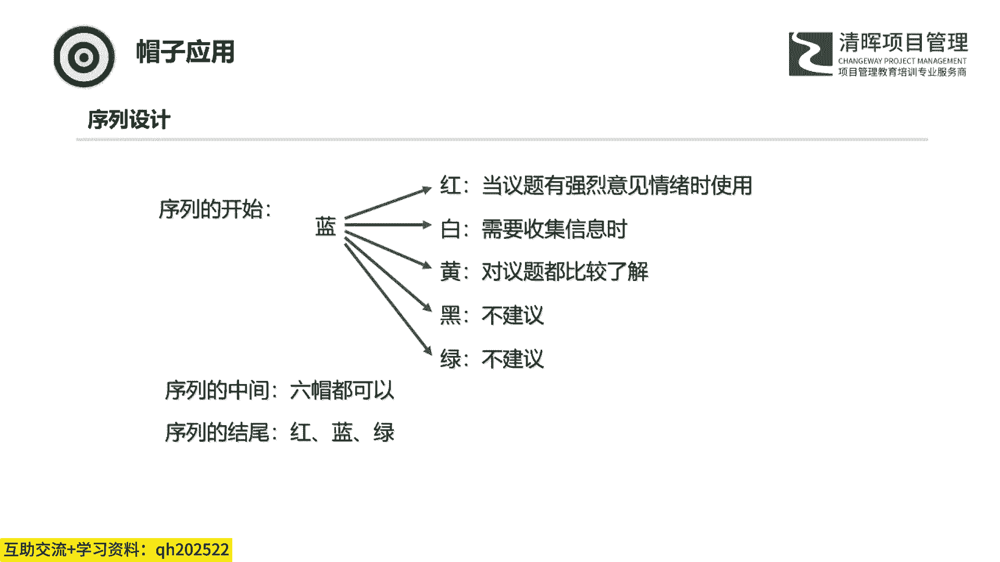

# 产品管理：运用帽子戏法思维，实现效率与成果的双重飞跃 - P4：3、六顶思考帽的应用 - 清晖Amy - BV1GGpUezEpS

那么到这儿哈，就6底思考帽这6个颜色的帽子，我们大概过了一遍啊，那么把每一个帽子要做的事情和每一个帽子要就是注意的一些点也都给大家点了一下。那第三部分讲一下这6。思考帽，咱们怎么用。

那这里哈可能也有一些人哈之前就是咱们因为也学过这个6点思考帽嘛，可能是呃在初步掌握之后回去也是用了一下，但是可能用的不太好啊，那这里哈可能是因为咱们用的这个方式呢是稍微有点问题的。

所以说第三部分咱们来解决怎么用这个问题。那其实实际工作当中，咱们就是碰到的最大的一个问题。那可能就是咱们给每一个人都派发了一个颜色的帽子啊，那实际上这样的话就相当于给每一个人都定性了。

那反而会制约他们制约他们的这个思考。那首先就是我们怎么去选择这个顺序啊，那选择顺序这方面呢，就是有这呃有这么三种方式，三种方式。第一种方式呢，就是单独使用。

单独使用这种方式，就是单独使用。我我这个可能也不清楚我用的是那个哪种方式，所以这里是三个问号啊。那第二种方式呢是固定顺序。那这个是最最建议使用的啊，那这个就是我们在前面讲蓝帽的时候。

我们讲到的一个顺序啊，比如说蓝帽白帽、黄帽、黑帽、绿帽、红帽啊，按照这种顺序，这是打个比方哈，打个比方，我们实际上可能我们不是按照这个顺序来的啊，这个后面也会讲到。那第三个是根据情况灵活变化的顺序啊。

你比如说我前前面三个是蓝帽白帽和黄帽，后面第四个帽，我们做什么，我们不知道啊，我们再商量对吧？所以说在这里第一种和第三种是不太推荐使用的。第三种。

根据情况灵活变化的顺序是需要这个蓝帽思维的这个人对6顶4毫帽有一个非常深入的了解。那么在这种情况下，他才可以去更好的判断，这里面最大的一个问题是你不管第四个帽子是由谁提出来的。是由提出来。

是由谁提出来的什么颜色的帽子，他都会让人觉得你想主导这个会议进程。他都会觉得哎都他他都会让人觉得你是想呃控制这个会议。所以这是他最最不好的一个地方。那第二个固定顺序固定顺序是什么？

就是我开我会议开始之前，我就把这些顺序我都给你定好了啊，所以这个也不是有什么个人意见在里面。所以这种顺序是最推荐使用的啊，这是我们的就是那个固定顺序。

那第二点是什么呢？就是我们这个序列的设计，我们怎么设计我们的序列。像刚才我们说这个第二第二个序列，它是蓝白呃，黄黑绿红。那我们是不是按这个那不一定，那不一定根据情况我们来去设置。

那么第一点就是我们从这个开始中间结尾来看。那么首先我们序列的开始，在开始的时候，我们通常都是蓝色帽子。蓝色帽子我们通过蓝色帽子来把这个会议的背景给大家讲清楚，来把会议的主题定好。

然后呢把这个会议的后面的这个呃流程。后面这些帽子的这个顺序给它确定好。这个是蓝色帽子要做的事情。那么接着接着蓝色帽子是什么颜色的帽子呢？这个是哎后面这几种的一个一个情况。那么第一个呢是呃红色帽子。

红色帽子来接这个蓝色帽子。那么当这个议题有强烈的意见情绪时使用，这个是红色帽子，那打个比方打个比方哈，就是说。那个这个我们前面也举过，就是在法庭，法庭的陪审团，陪审团他们在那个结束之后。

然后他们会去后面去开一个庭审的那个会议。在这个会议里头，他们要根据他们收集到的这个信息来做出一个判断，就是是否有罪。这个时候一进去第一件事儿，他们首先要做的呢，就是先举手表决。举手表决，然后来看一下。

就是大家觉得这个人是有罪还是无罪。那么举手表决这块，他们也是有一个呃规定。呃，好像是一共应该是12个人。那么呃9个人，9个人同意的话，那么这个人就是有罪的。那么当就是是一些谋杀案的时候。

那就需要是全票通过啊，所以说在法庭就是这个陪审团他们在审议的时候啊，是这个是是是这种例子，就是呃红色帽子接在了蓝色帽子后面。第二点就是白色帽子贴在蓝色帽子后面。那这个就是比较常见。

就是我们需要收集信息的时候，那这个可能就是进去的时候，我们就是没有观点的那大家就是说哎你比如说我们刚刚举的那个例子，就是我们选型啊，那大家大家知道我们这次开会的目的是选型，对吧？那这个选型。

备选的方案有哪些对吧？那个产品原型A产品原型，B产品原型C是哪些产品原型，这个都不知道啊，我们需要收集信息。那这个时候哎我们可以去用这种方式。那第三点就是黄帽啊，黄帽接在蓝色帽子后面。

那这个呢就是大家都对议题比较了解了，比较了解。就是我这次这个会议就是针对某一个创意，我们来去进行分析。那这个时候就是黄帽跟在蓝色帽子后面啊，那最一开始大家呢就都对都首先对这个都对都对我们这个议题。

然后来提出我们的这个就是就是优势以及一些一些方案，然后再去黑帽，然后这么来顺下去。那么后面两点，黑帽和绿帽是不建议的，黑颜黑帽黑帽思维不建议接在这个蓝帽思维后面。因为你刚把背景说完，那大家就开始吐槽。

对吧吐着吐着这个会也就也就就开不下去了。所以说这个黑色帽子是不建议的，黑帽通常都是在黄帽的后面，黄帽的后面啊，那最后一点就是绿帽，绿帽也是不建议。因为也是同样的原因啊，你前面没有任何信息基础的时候。

你上来就是开始就天马行空的，就开始就就想创意就想。啊，那这样实际上也是不行的啊，所以说蓝帽后面可以接红帽、白帽黄帽，看情况，看情况来接黑帽和绿帽都是不建议去接的。那么第二个就是序列的中间。

那么序列中间是6个颜色的帽子都可以。那么第三个就是序列的结尾，结尾是什么呢？红帽、蓝帽、绿帽都可以。通常的情况下。红帽和蓝帽红帽是什么？最后我们呃蓝帽做了一个总结，我们有这么这么这么些几个方案。

然后我们去什么？我们用红帽去做一个投票的表决。大家觉得大家对哎这个哪一个建议大家哎更更喜欢，对不对？大家觉得更看好，用红帽来表决。蓝帽是什么呢？蓝帽是最终生成为生成一个统一的一个结论。

这个时候由蓝帽去做一个总结。蓝帽绿帽是什么呢？绿帽也有绿帽结尾也有。绿帽结尾是我这个会议的目的就是收集创意。那这个时候是以绿帽为结尾的。啊，所以这个呢就是我们在那个设计我们这个序列的时候，哎。

我们从序列的开始和中间和结尾来以这种原则去进行设计。

那在这边哈我举了三个例子，这三个例子呢就是呃这种我们设计这个序列的这个三个例子。那么首先第一个就是我们探索初步的创意。那这个也是刚刚我们聊到的，就是结尾是绿帽的这种情况。

那么首先我们就是蓝帽蓝帽来介绍我们的背景，确定我们的范围啊，确定我们的主题，这个是蓝帽要做的事情。然后呢是白帽。白帽把相关的数据和信息都提供出来。那么最后是那个初步的构想绿帽啊来收集这个相关的一个创意。

那么第二个呢是这个序列异常呃，序列异常事意呢是这个过程的改进。那过程改进的时候，也是最一开始由这个蓝帽，然后来提出我们呃如何去改进我们特定的这个过程。那么接下来是白帽提供相关的数据。

那么后面呢就是这个黄帽黑帽和绿帽的这个这么一个循环啊，然后去去改善去改善我们这个黑帽提供出来的这些这些缺陷以及可以提升的空间点，最后由由这个红帽由这个红帽来选择一个最合适的。

然后由蓝帽去决定它的下一个步骤。

那么第三个就是我们在做这个绩效评审的时候啊，那这个呢跟前面呃也是呃差不。差不多差不多类型的，它只是什么？它只是在第二点，它只是在第二点就是呃放到了一个红帽，用简短的词语分享对事情进展状况的感觉。

那么大家先聊一下啊，感觉怎么样，对不对？那这个是在第二点先简单的先聊一下啊，这个也是一个很很很简单的那后面就是也是一样的了，也是白帽黄帽呃，呃，白帽提供信息，黄帽黑帽绿帽做一个循环，最后由红帽去投票。

那么蓝帽来总结。是这个样子。所以说这边哎举了这么三个三个例子啊，呃有这么三个议程的一个示意。那么大家可以使用。那么实际工作当中可能有各种各样不同的情况。那么我们在设计我们这个设计我们这个会议程的时候。

可以采用我上面说的那种原则哎，我们来去做。

