# 产品管理：运用帽子戏法思维，实现效率与成果的双重飞跃 - P1：1、六顶思考帽的概述 - 清晖Amy - BV1GGpUezEpS

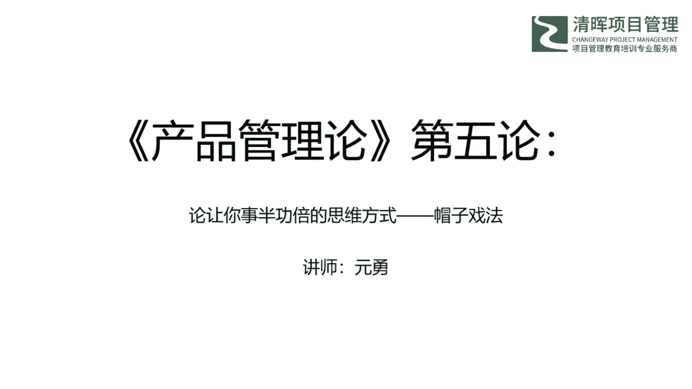

那我今天的分享分为这四部分，那么首先是一个六顶思考帽的概述，六顶思考帽是一个思考的工具，那么首先我们要看一下哈，我们为什么要用这种方式来思考这种方式，它相比于其他思考方式的优劣势是什么。

那么六顶思考帽适用于哪些场景。

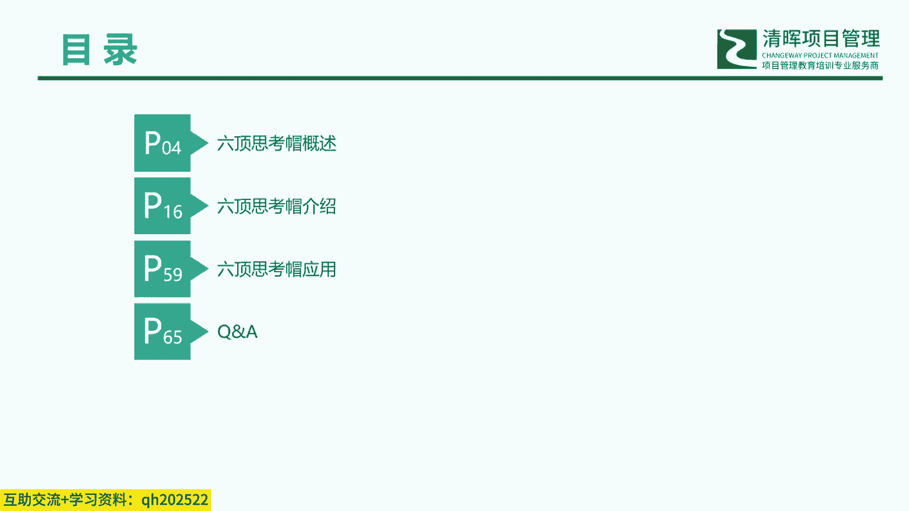

针对这些点哈，那么咱们进行一个简单的一个说明，那首先啊，咱们来看一下这个六顶思考帽的概述哈，就那个简单的列了一些问题，因为咱们其实日常工作当当中哈，虽然没有说很直观的这个感受到。

但是其实咱们思考问题的这个方式哈，却时时刻刻的是在影响着我们的，只是它的表现形式呢是不一样的，所以下面我列了几种，就是我工作当中碰到的例子哈，那这个就是因为是我是做，刚才也是介绍，我是做这个信息系统的。

咱们听这个分享的朋友当中，有一些呃朋友跟我的这个工作背景相似的话，可能也会碰到这些问题，那首先就是我们那个，现在做产品或者项目的时候，我们越来越多地采用了这种跨职能部门，来组成我们的团队。

那这个跨职能部门的沟通，其实难度还是比较大的啊，那大家的沟通语言是不太一样，看问题的角度也不太一致，那么理论背景当然也是不一样的，那我最近的接触的一个项目呢，它就是这样的啊，因为我们公司现在做项目啊。

还是采用那种比较传统的那种瀑布模式，只是在需求阶段的时候，我们的设计人员，开发人员和测试人员，那么都已经介入进来了，那么对方案进行我们内部的评审以后，我们再和客户去沟通，避免把不成熟的方案拿给客户。

那这个时候我们就会发现，这个以需求人员和这个测试人员为一组，以设计人员和开发人员为代表的这一组人，那么这个沟通起来是很费劲的，那么这个他们是天天掐啊，其实这个时候咱们认真看一下，他们掐的这个过程。

那么可能会发现双方说的他都有道理，只不过都是从各自的角度去考虑问题，试图去说服对方，因为需求面对的哈，他是客户，他想到的呢，就是我怎么去解决客户提出的这个问题，下次讨论的时候。

我怎么去跟客户去讲解这个方案，客户能满意，这个是需求想的，那开发想的呢是这个功能我要怎么去做，那这个功能是不是对其他的功能有影响，但是会不会影响我的效率啊，那这个是开发想的。

所以说其实很多时候这个双方想的都不一样，那么他们在在展开这种讨论的时候，这个是很可怕的，这个根本停不下来啊，是这样，那么第二点就是什么呢，这个这个情况也是比较常见，就是我们日常召开的这种各种会议。

那最近可能由于这个疫情的原因啊，大家估计在家里边，远程也办公了一段不短的时间，那也估计开了不少的会哈，开会其实是很考验这个会议，主持人的把控能力的，如果不提前规划好，那可就变成一个茶话会了。

那大家就是那个喝喝茶聊聊天了，那我在前几年哈，我刚转行做这个产品的时候，就曾经做过这么一个项目，这个项目呢那么当时也是在这个项目的初期，那么一开始这个主持人就把我们这个几个人啊，四五个人拉到会议室里呃。

说那个我们开个会吧，然后我们这四五个人呢就一脸懵，然后就互相看，因为谁谁谁其实也没听到说要开会的这个通知，那么然后进入进入会这个会议室以后，负责人就组织大家就开始想，那我们接下来要做什么。

那针对什么问题来讨论啊，想出一个问题，那谁想出来的，那这个人就开始讲，讲完了就歇歇会儿啊，出去买点东西回来就是一边吃一边聊，然后继续讨论第二个问题，那这种会议他其实开会之前负责人是没有想好。

我为什么要开这个会的，他只是想组织大家一起来，就就是做这个工作，进展工作，怕大家没什么思路啊，所以就开始开这种这种主题，不确定时间不确定，内容不确定的会啊，那这个问题也是也是非常要命的。

那么第三个问题就是这个思维混乱，理不清头绪啊，这个也是会我们会经常会碰到啊，那我到现在也是做过很多公司的这个项目啊，也接触管理过很多的这种运维团队，那其实运维团队的工作是很重要的。

他呢是在第一线对接客户，可以了解客户的喜怒哀乐，对产品的满意不满意，他们都是最最清楚最了解的，也是一个很重要的一个窗口，但这里呢有个矛盾是什么呢，就是通常技术比较好，能力比较强的人。

他是不太愿意在这个岗位做很久的，因为觉得这个岗位没什么技术含量，那大概率经常碰到这种同样的问题，需要给不同的人解释，所以通常都是公司来公司没多久的，这种新人去做的，但新人呢他也也也是也是有个问题的。

那么他由于刚来那个公司不久哈，那么也没什么经验，所以碰到事情呢，他就很容易抓不到点，思维就会变得很混乱，那我就碰到过一些同事哈，这个只是信息的搬运工啊，只是信息的搬运工，他一股脑的从客户那接收很多信息。

在一股脑的不加总结，不加分析的就往下流啊，那当后续流程的人有什么问题的时候，要进一步就是问他的时候，他也不知道，那么他再去问客户啊，实际上就是个传声筒，所以你很难从他们的报告中，了解他到底想说什么。

所以这个也是很很致命的一个问题，那第四个就是文案结构很混乱，那文案结构混乱，这个也是比较常见的，我们在那个实际工作当中要写各种各样的文案，那售前要写标书，要写投标的PPT需求，要写需求调研报告。

需求规格说明书，设计要写设计文档，测试要写测试用例，测试报告啊，很多很多这种文档，那咱们这儿哈，以这个标书为例来说一下这个问题，标书还是比较强调这种逻辑结构的啊，我们一般拿到一个标书。

我们首先看招标文件，招标文件我们先看个两三遍，把里边的最重要的是把非标项看一遍，然后根据这个招标文件里面的投标文件的要求，我们就开始去写这个投标文件，那这个也是有一个逻那个前后的逻辑关系的。

你前面哎我在最前面我要写一个需求的个描述，紧接着是功能的描述，后面是一个非那个就是那个呃那个呃，那个非功能需求的描述，然后接下来是一些项目实施相关的描述，哎所以这个是是有一个一脉的承接的关系的。

但是很多的时候就有个问题，就是说我会漏掉，我会漏掉招标文件里面的描述，甚至我里面会有非标项投标文件的，前后也是矛盾的，前边诶没没有这个业务需求，后面有功能，前边有业务需求，后边没功能。

那这种问题也是很很常见的，所以这个文档结构是非常的混乱啊，那这种标书通常是通不过的，所以说这个写文案的能力也是非常的重要，那我之我，我之前哈，就是跟一个，就是我曾经服务过的一个政府机关的朋友。

也聊到过这个问题啊，说想在政府机关有一个更好更快的发展，这个写文的能力是很重要的，那写文能力强的人，他通常升职也会快一些，那讲到这哈，咱们把这个就是我这边经常碰到这些问题，咱咱们这边那个大概给大家。

那个那个就是介绍了一下，那可能有一些朋友可能会发现，这些这些问题也不是我这自己碰到的，那咱们实际工作当中也碰到这些问题啊，所以说其实这些问题哈，我们其实是很想办法去避免额，或者说是缓解一下这些问题的。

那当然解决这种解决办法有很多种，那今天我实际上就是想从这个思维模式上聊聊，因为今天主题是六顶思考帽对吧，那看看是不是可以通过转换一下，咱们的思维模式，就能比较好的去解决这些问题。

那我们谈到这个思维模式哈，我想先简单聊一下这个辩论啊，因为咱们刚才说的这个跨职能部门。

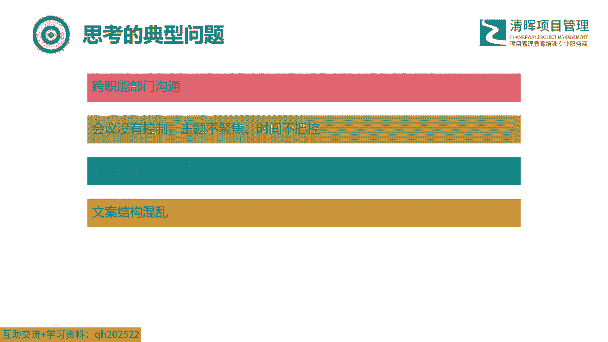

第一个第一个那个问题，它实际上就是辩论啊，那辩论就是怎么回事，就就跟这张图一样，就跟这张图一样，就是双方互相站在自己的角度，有自己的观点，想方设法去说服对方，那这里打个比方，这个A他就是这个产品跟需求。

就是我们刚才举的那个例子里面，那么B它可能就是这个技术和开发，那双方互相要说服对方啊，那我现在我现在的这个工作情况哈，我基本都是在客户那里办公的，那我跟那个需求的那些小姐姐们，是坐一间办公室的。

那我就经常会看到他们和开发的沟通情况，那他们甚至有一套专门的那个QQ里边的那个，就是发表情的那个啊，是是用来跟开发聊天的，就是咱们那个网上经常常见的那种，阿猫阿狗互相掐的那种啊，以表达他们的不满。

所以我们现在也是花大力气想解决这个问题啊，这给我们工作带来了极大的浪费，拖慢了我们的工作节奏啊，所以这是这个辩论，就是这这么这么一种情况。

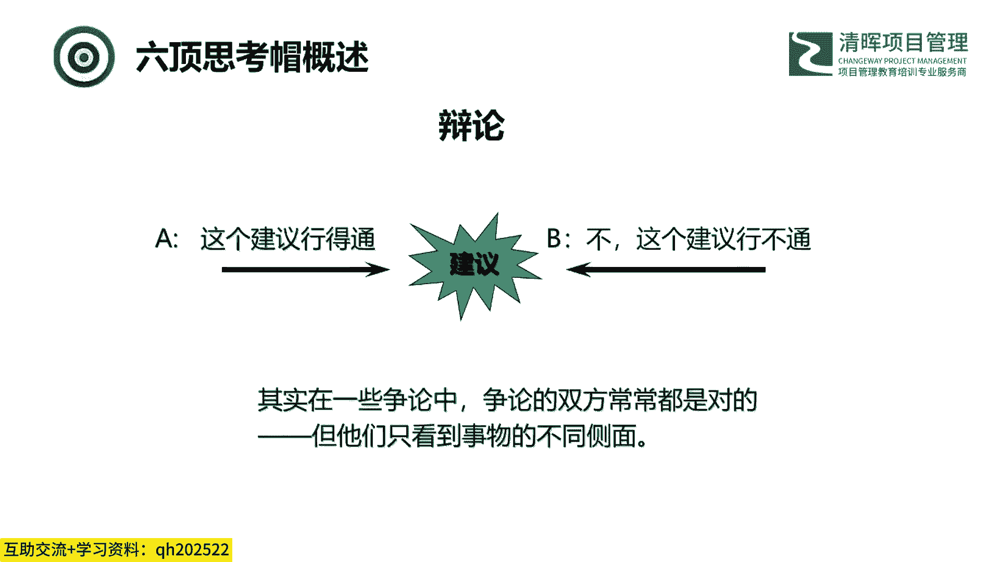

那我们来看一下什么是辩论，辩论呢就是提供一定的理由，说明自己对某一个事物或问题的看法，通过揭露对方的矛盾，以说服对方接受自己的认识和意见，达到共识的一种方式，我们生活当中充满了辩论啊。

走哪都能看到大家在那边，就是在呃在辩论，这是为什么，因为大家都有自己的一套行为模式，大家都有，那么只要周边环境发生的事情，跟我这个模式产生了冲突，人们自然而然就想去进行辩解，去去进行分辨啊。

所以辩论是我们经常能看到的这种情况，那么与辩论对应的是平行思维，平行思维是通过提出所有的可能性啊，各方将所有信息都揭露出来，在公平的前提下就问题进行讨论，形成最终统一意见的一种方式，这里画个重点啊。

可能性可能性可能性这个词是非常重要的，这个是一会在那个创意猫那部分，会重点的分析一下，那打个比方就是我们打个比方法庭，法庭里面的律师是在进行辩论的，这个没问题，他们要举证啊。

他们要从各种角度去去去去说服这个陪审团，说对方是错的，我是对的，这是他们要做的事情，那陪审团是做什么的，陪审团他就不是辩论，他是从双方律师团队提供的，这种数据信息的基础上。

他去全面地去看待整个案件的情况。

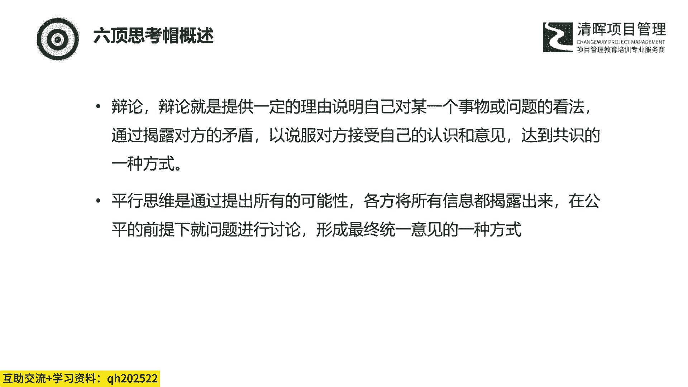

这其实就是一个平行思维，那那再打个比方哈，我们来看看这张图，这张图呢是假设有一个很漂亮的一个房子，那么这有四个人从这个房子不同的角度，那么去看看这个房子，那么他们可能就是能得出不同的结论。

那么这个例子呢他也是一个比较极端的例子，他哎就是这四个人不沟通啊，他们的目的完完全全就是为了说服对方。

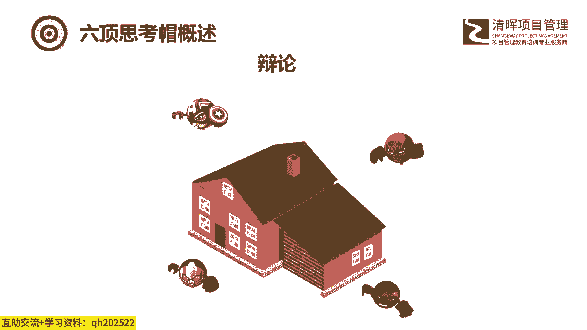

说自己是对的，那么这个就是很典型的一个辩辩论的一个情况，那么平行思维如果运用平行思维，那么这四个人就会绕房子一圈，分别看到房子前后左右四个面啊，所以呢在每一时刻，每个人都对同一点，这个就是平行思维。

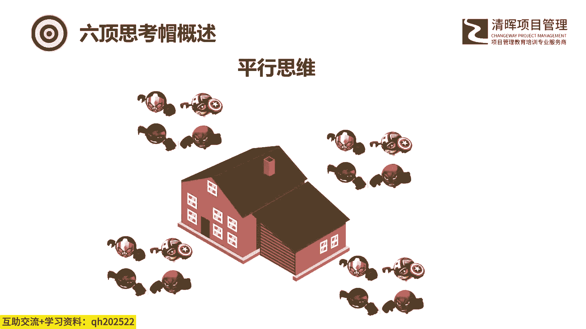

那下面我们来看一下这个辩论和平行思维，他有什么区别啊，有什么那个共同点，首先哈辩论的这个焦点是放到了这个，这个是什么呢，他关注的是什么，它是一种批判性的思维啊，他是非对即错。

就是针对放在你面前的事情做出反应，那这个时候是很有效的，那辩论我们通常在这种思维，我们通常在什么时候使用呢，就是我们通常在学院学院派做理论，这个时候是要采用这种辩论的方式的，那么他对错他只有对和错。

他没有说其他的一些其他的一些方向，所以说在学院他们是采用这种批判性思考，他们是采用这种辩论的这种方式来去做，他们，做他们的一些学问的研究和工作的，啊那么平行思维是什么呢。

平行思维的关注点是放到了可能会成为什么，那么这个实际上是一种发展的，它是一种建设性思考啊，所以这边诶来了这个重点就是可能性啊，那么在这个时候，他相互冲突的这个观点呢会被兼容啊。

那么大家所采取的方式呢是这种聆听理解，设计和创造，我们平时在创新的时候，我们现在在商业上，我们从事的所有的工作，我们的思维方式就是平行思维啊，所以说这是两个两个相相，那个稍微有一点对立。

这么关系的辩论是学院派，我们搞理论，我们可以用这种辩论批判性思考，但是我们做商业，我们做创新，我们一定要是这种平行思维，我们要用用用一种建设性的思考，来去考虑这个问题。

啊那这个呢就是辩论和平行思维的区别啊。

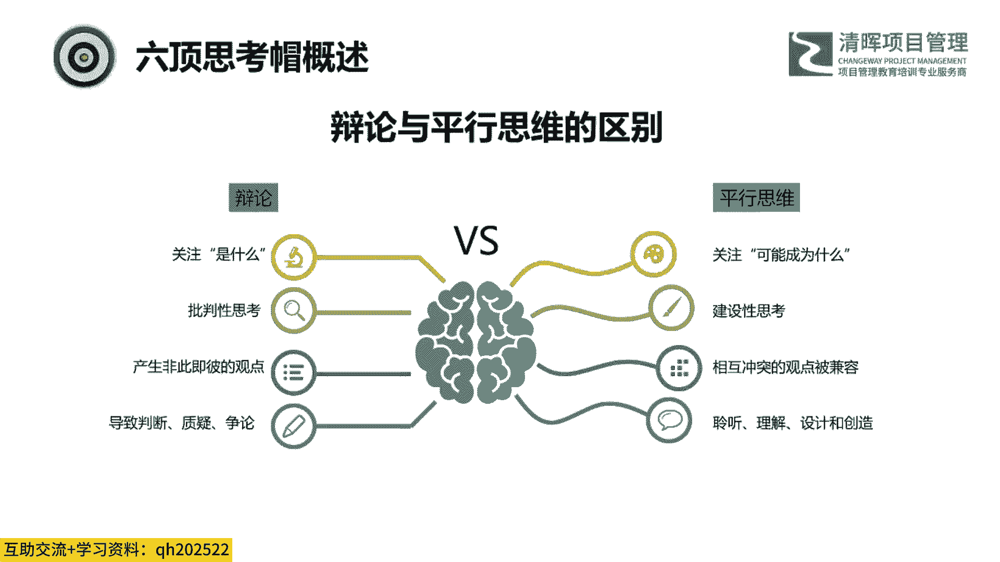

那讲了半天哈，这个平行思维，那我们来看这个平行思维是怎么来的，平行思维呢是这个爱德华德博诺博士啊，他是这个六顶思考帽的创作人，那么平行思维也是他发明的，还有水平思维这些，那么他是英籍马耳他人。

他是一个地中海的一个小岛国啊，那么他呢也是一位天才哈，他15岁上的大学，那么这个呢在国内，也就是咱们那个中科大那个少年班了啊，21岁拿到了医生的资格证，然后进入牛津，他有两个学位，两个博士学位。

所以说这也很厉害，那么他在64年呃，67年34岁的时候，他提出了这个水平思维，那么后来这个水平思维这个词，写进了牛津的英语词典，他创造了这个词，那他在80年代提出了平行思维。

后来基于平行思维的这么一个呃思想，提出了六顶思考帽这种可落地的，具体的操作方法是这样，那么六顶思考帽它是一种什么呢，它是一种问题解决及头脑风暴的技术。

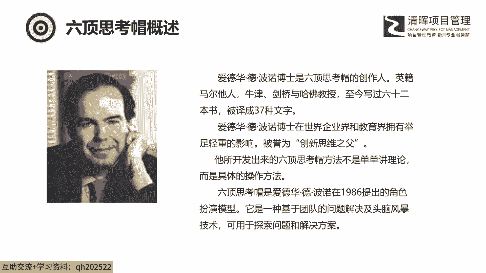

所以它可以用于探索问题和解决方案，是这样啊，那这个六顶思考帽，就是因为它是80年代发明的嘛，那他到现在也是有了这么30多年的发展，那么它在很多一些知名的企业，它也是获得了一些认同啊。

那么极大的改善了这些公司的一个会议的效率，我们看一下啊，这个这个我们大概过一下是哪些公司曾经用过，那么第一家是那个是呃IIIBM，IBM公司在引入这个六顶思考帽这个方法后。

他们开会时间缩短到了以前的25%，1/4，也就是以前需要一上午的时间，那么他们现在可能只需要一个小时，那么就能得出他们的结论，西门子在西门子公司有37名培训专员，负责培训六顶思考帽方法啊。

那这个37名是过往的数据，那现在可能也是有更新，它每个部门有专门的应用六顶思考帽方法的，这种创新小组啊，是这样，那摩根那他的开会时间缩短了80%，这个比前面的那个IBM缩短的还还要多，那APP电器集团。

那么他在使用六顶思考帽的这个方法以后，他原来要花30天才能完成的跨国项目讨论，那么现在两天时间就可以，那么这家公司是挪游的呃，那个挪威国家石油公司，那么他们曾经一个钻油塔就是出现了一个问题。

它导致每天呢他要损失10万美元，去对它进行维护啊，那他们在引入了这个六顶思考帽的方法以后呢，就讨论了12分钟就解决这个问题，那这个每天10万美元的这个维护费用，他们也是省下来了，那最后是保德信。

保德信是全球最大的保险公司啊，那么他们呢长期用这个六顶思考帽，他们总部的地毯是用彩色的六顶思考帽图案，编制而成的啊，那这里举了六个公司的例子，那这个六个公司的这个这些，这些例子是哪来的呢，是六顶思考帽。

这个官网上我去我去找来的啊，那这个像这里面这些公司，其实说白了我也没去过，像那个下面说的那个呃，地毯是用那个彩色的，这个编的，我也没看过啊，所以这个呢咱们现在就简单这么了解一下啊。

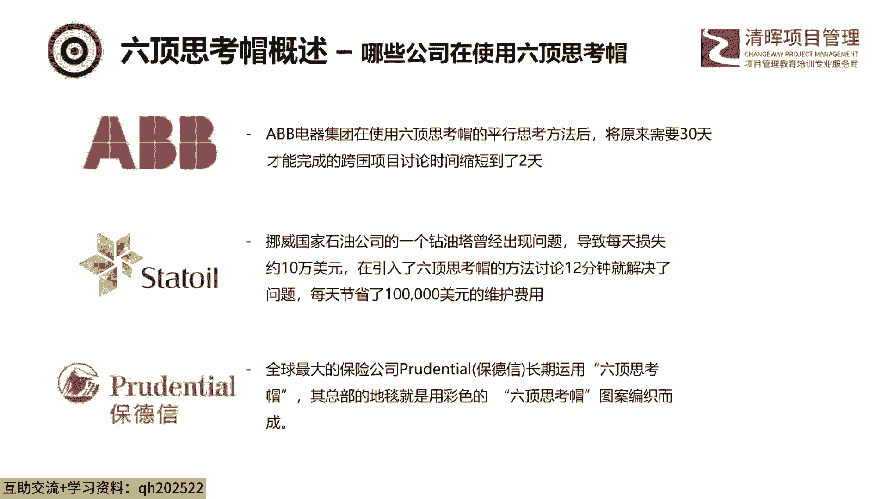

最重要的是它对我们的工作有哪些帮助，这个是最重要的，那么下面我们来看一下这个这六顶帽子哈，这六六顶帽子，这六顶帽子啊，帽子的颜色呢，是采用了我们这个国家的这个中华五色，我们中国的中华五色。

这个哈没准儿那个博士在创立体系的时候，也专门研究了一下中国传统的这个文化，这个是我最一开始想到的啊，我最一开始想到的，那么咱们中国传统文化里面的五色是哪些呢，是清赤黄白黑，就是我们经常说的东方青龙。

西方白虎，北方玄武，南方朱雀，东方厚土啊，这五色这是最一开始给我的想法，那最后边我看到了这个绿色啊，这个我就知道是我想多了啊，这个很明显啊，这个应该是纯属巧合，他可能是没有研究过，没有研究过。

那这里这个这个六顶帽子，它只是代表了思考的六个方向，那在每次思考的时候，采用一采用其中的一种方向来来进行思维，那么为什么要分成这些方向哈，那这里要提到人们在进行思考的时候，有可能出现的两个问题。

一个问题就是判断和争论，那就是在人们在讨论问题的时候，会不经意地进入你对我错的争论当中，会使思考过程极其的低效，这个呢是一种习惯，那这个后面我们可能也看到啊，到我们在讲到黑帽的时候。

我们哎那个我们可能会讲到这一点，人是非常善于挑错的，那么第二点是什么呢，第二点就是混乱，人们思考的时候总想同时做好很多事情啊，他又要考虑情绪对吧，又要考虑这个数据，又要找优缺点啊，所以这个很难做好。

很难做好，因为他要同时做很多事情，那这个那个后面我再讲那个案例的时候，有个例子可以讲到这一点，所以说在基于这种情况，那么德蒙诺博士就将咱们的这个思考，过程的细化分为了六个方向，那就是咱们这个蓝帽。

蓝帽是控制帽，它负责控制和调节这个思维的过程啊，同时他也监管其他各种这个帽子的使用，白帽白帽是什么呢，白帽是信息帽啊，白色是中性的，客观的，白帽只关心客观的事实和数据，那么红帽红帽是红帽是情感冒。

那么红色呢可能会让人想到生气发怒啊，这种各种感情，所以说红帽他提供的是感情方面的看法，黄帽黄帽是什么呢，黄帽是利益貌，那么黄帽呢是从一个乐观的从正面去考虑问题，黑帽是什么呢，黑帽是谨慎帽。

那么黑帽讨论否定方面的这个这个问题，那事情为什么不能这么做啊，他有什么风险，有什么问题，这都是黑帽考虑的，那么绿帽绿帽就是创新帽啊，那个绿帽呢是表示这个创造性和新观念，那么其实我们我我这边是这样的。

我们之前我们公司就是我这边的团队，在采用这个六顶思考帽子的时候，我是把这个绿帽做了一点调整啊，我我没有说这个我们要戴这个帽子，我我是说我们戴的这个创新帽啊，所以这块呢可能根据就是各个各家公司。

各个文化的不同，我们可以对这个去进行一些细微的一些调整啊，但今天我们主要是讲的还是，因为是六顶思考帽这一套理论，所以我们还是遵照它原有的这种说法，我我我们来分享来讲。

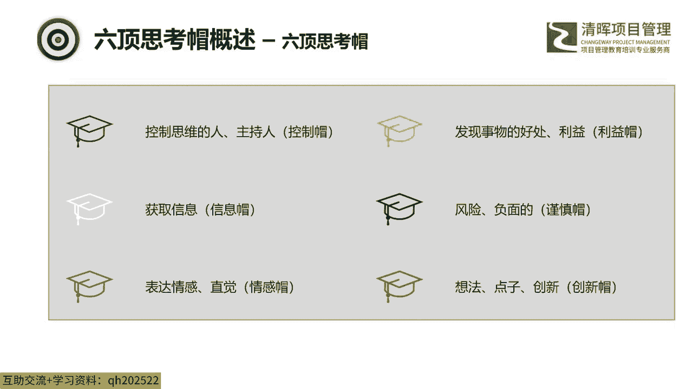

那六顶思考帽它适用的场景啊，他是这样的，首先它是一个比较简单的工具，它可以在应用在我们生活的方方面面，我们个人和团队是都是可以用的啊。

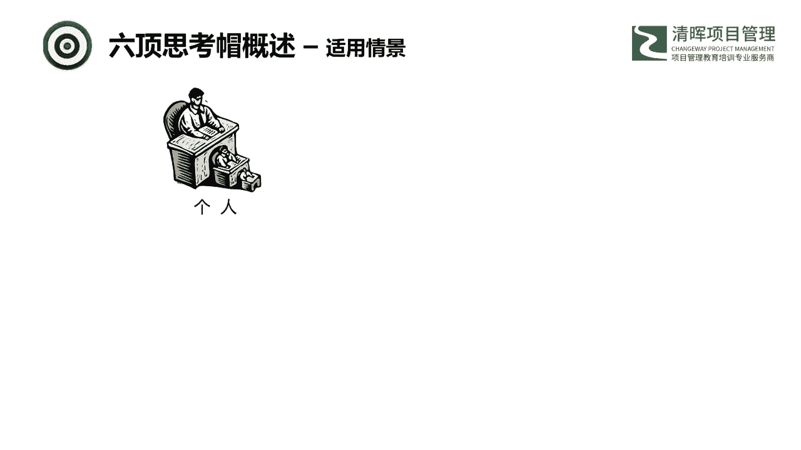

那这里就是有这么六种场景，我们都是可以去采用的，比如说我们个人对于个人来说，我们可以去独立的去思考，独立的去思考，那写备忘录，写邮件，写计划书之类的，那这些我们都可以去个人去做啊。

那么写计划书也可以是由团队团队来做，那么团队方面呢是应用在这个小组的沟通，会议当中用的比较多的，还是在会议里面哈，因为团队所能激发这个激发发出的，它是1+1大于二的效果，可以达到这个事半功倍的情况。

那这个也特别适用于这个六顶思考帽。

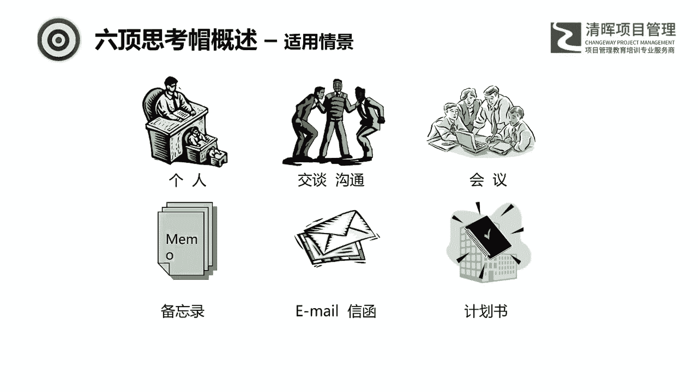