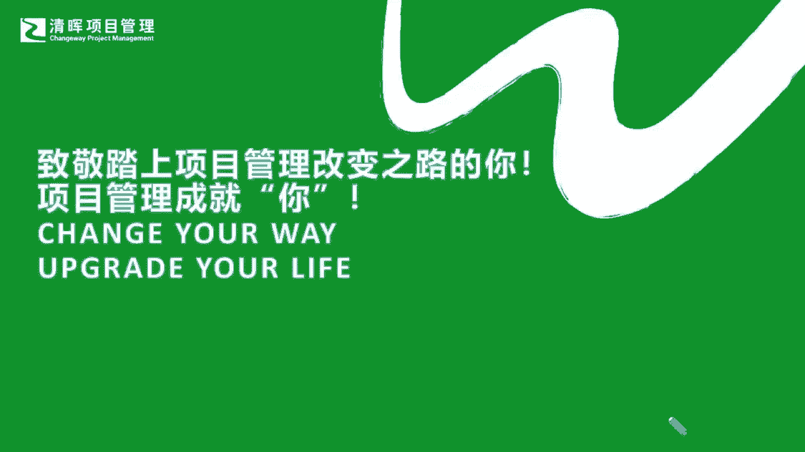

# 产品经理所需的知识和技能 - P2：2.产品经理进阶之路一一能力篇 - 清晖Amy - BV1w1421k7wt

部分我们就知道我们其实最根本的，我们也在今天的尾声再去不吝跟大家赘述一遍，我们的产品经理想要进阶大家的商商业能力，我们暂且讲是这种战略的视角的能力，是一定要非常非常这种宏观。

并且有一定的这种非常良性和扎实的基础的，我们必须要懂，就像刚才有同学讲的，懂业务，懂你的财务，懂你的资源调动的能力，懂你的价值模式，懂你的企业价值，懂你的这种战略定位，这其实就是一个战略呀。

就是一个大局的一个战略思维，那在这样的一个整个的一个，战略能力的一个部署当中，我们就需要不断去实现，我们更多的这样的一个呃突破性的能力，包含，像比如说我们有很多这种啊优秀的一些企业，像小米啊。

像我们的很多刚才举到的一些例子啊，大家会发现他其实会分成很多个方面，从他的key partner，从他的客户关系，把客户细分在我们整个的商业画布的设计上，这其实商业画布就是一个战略的画布。

你怎么样去做到每一个环节上的一个正确部署，他其实是花了很多的一些心思，和一些战略的重塑，来让他实现到他想要的一个目标上的，也就是说，你会看到，你在研究每一家企业的这种进阶的时候。

它无一不是在从战略的各个角度把它再切分，切分完之后，他才也知道他下一步的这个企业战略指导下的，产品战略怎么去实现，那么在这个过程当中，我们的产品经理就需要不断的去给自己加码了，刚才也提到太多东西要学啦。

那就是我们要从这个具体的一些，比如说做事的思维，然后要抽离出来，变成一个这种战略的宏观的思维，那那同样我们也要去不断的这个补充，我们的这种企业的一些逻辑的，一些解决问题的能力，以及怎么样去更好地。

围绕在产品管理的价值核心来去，连同协同到我们的一些执执行力，把我们的沟通学习呃，协调的领导力以及管理心理学的一些认知啊，这个部分我是一直要去强调和补充进来的，也就是说可能我需要大家去非常明确的一点啊。

我也希望大家学一个东西，不要仅仅学表象，因为所有的最终的沉淀都是跟人在打交道，你的产品最终服务的也是人是吧，所以我们的心理学，它往往就是我们最根本的管理的一个，服务的本质，所以在这样的一个过程当中呢。

我们其实就会看到，在我们的一个非常有名的这个miss burg的，一个5P的一个战略上，当然如果大家有去系统的再去学学MMBA，学学NPDP的话，你可能会涉及到我们的产品战略，它可以呈现为一种plan。

一种计划，那么同样产品战略它也是一种谋略，也是一种计谋，他也是一个啊非常需要去提前谋划的东西，它不是一个说你这个啊看随机应变就能去做的，那么同样还需要去把这样的一种模式把它做好。

把它怎么样很好的能够展现出来，那么同样我们这个positioning一个定位，自知之明，怎么样更好的在一定的程度上去，把我们的产品做好，把我们的企业也拱到一个新的高度。

这其实所有的positioning也是一种产品战略的体现，那同步呢产品战略，它也是一种对未来的期望和观念的一个管理，也就是说我们一直在强调它不是仅仅看眼前，它是关于未来成功的一个押宝。

甚至是一个对于未来成功的一个投资，所以strategy，它是一个perspective的层面的一个东西，它是需要提前去管理，提前去预测，提前去规划项目，线上读书会，严老师也会再推出一系列。

跟战略相关的一些书单，感兴趣的同学也可以扫码啊加入我们，如果你是社区会员，应该是可以直接来看这些专栏啊，那么同样我们在咱们本次分享的尾声呢，我也再次强调大家啊，万丈高楼平地起。

我们想要去成为一个优秀的产品经理，其实就跟我们换一个概念，我们偷换一个概念，就是想要去成为一个优秀的人一样，它永远也是会存在有多元综合的一些要求，但是尽管这些要求再高再多再综合。

它总归也是有一个最主要的一个环节，最主要的一个逻辑线能够供我们去参考，供我们去快速提升的，那么我也希望严老师持续的线上讲，产品的系列微课。

能够让大家在这样的一个茫茫的理论的常识，和，茫茫的众多的这种，我们所有的这个产品管理的困难点当中，也能看到这些星星之火，我们一步一步来去解决掉这些问题，我们不疾不徐。

只要我们在正确的道路上能够去涉猎到这些，大家每次能够听明白那么几个点，甚至可能听明白我们所强调的一些要义，那么剩下的就是大家怎么能够，快速把它变成自己的行动，那在这个行动的转换的过程当中呢。

严老师也会在后续的一些微课当中，给到大家一些更多的一些推荐，那么同样也欢迎大家去了解我们体系化的，NPDP的课程，那这些知识体系的指导永远是最短平快的，所以可能在更高层的一个层面上，如果行有余力。

大家也可以去看看我们的这种战略思维，MBA的部分，那这个肯定是要投入更多的一些时间和精力，但是他的回报也是最直接的啊，也会给大家一个直接上台阶的一个阶段啊，好那么也非常感谢各位同学的坚持啊。

我也谢谢大家对闫老师这个嗓子的谅解啊，啊谢谢啊，我们每一位同学的参与，积极参与，我也希望在我们周五的分享再次看到大家，也在我们后续的读书会，也能看到大家，每一位再次新老朋友加入到我们当中来。

那严老师也会再给大家更多的关于实际当中，遇到的这些有意思的话题，也许咱们换一个视角就能解决你的实际问题，也能让咱们共同赋能，共同上台阶。

好我们今天就先分享到这里。

