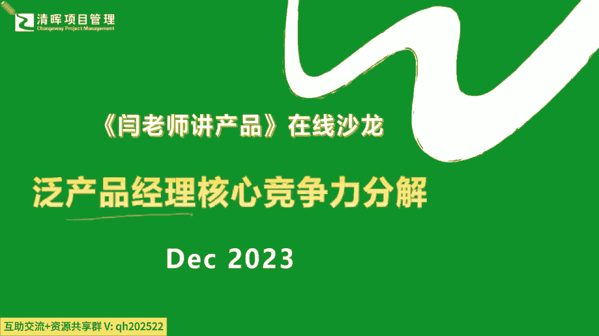
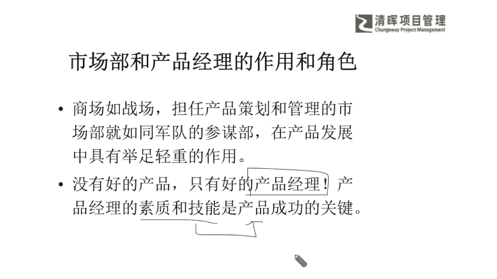

# 产品经理所需的知识和技能 - P3：3.产品经理主要责任 - 清晖Amy - BV1w1421k7wt

好我们清晖在线学堂的各位伙伴们，同学们，大家周一晚上好，咱们又相聚在闫老师讲产品，在线沙龙的这个环节了啊，因为我们周中的时间还是一如既往，非常感谢大家能够抽出播种啊，抽出这样的时间来跟我们进行。

两个小时的这样的一个放松的一个交流，那同步呢咱们也在周中，因为毕竟啊可能这个时间大家晚上的时间，有时候这个工作加会儿班呐，回去又比较晚呐，可能大家的这个环境尽可能的呢，我希望大家既然在听啊。

在这样的一个时间点，咱们花了这个时间，咱们就尽可能的找一个相对安静的一个环境，那咱们这个互相听清楚哈，为什么呢，因为颜老师也是嗯，请大家要谅解，那因为这个感冒的原因，那我的声音可能会比较低沉啊。

那可能相较于以往比较洪亮的这个嗓音，那我的这个整个的一个啊输出的这个音音符呢，可能比以往要稍微低一点，所以如果有听不清楚的，咱们的小伙伴啊，尽可能咱们找一个相对安静的环境，那同步呢啊如果有画面卡顿。

或者是声音还没有那么流畅的同学，也可以重新尝试再登录一下啊，我相信这个也就是网络的一个基本的问题，那我们今天呢，接着咱们之前尹老师讲产品的这个在线沙龙的，一如既往选题的这个标准啊。

咱们都是在去挑一些跟产品管理相关的，但是呢跟咱们考证的，跟咱们考NPDP又会相辅相成，又不是那么完全一样的这么一些话题啊，我们来去展开关于在产品实践领域，产品管理的实践领域。

那我们怎么样更好的来去应用和去了解到，咱们的这个产品管理啊，这个角度我们作为一个产品经理的话，那应该怎么样能够，去把我们这个角色和我们的这样的一个能力，把它结合起来，能落回到我们的十处去。

就是我们不仅仅可能，有些同学已经开始在学NPDP，有些同学也还没有了解，但是可能在这样的一个体系化，考证的这么一个环节当中呢，它可能又存在有一定的这种门槛和难度，就是大家如果要去每天啊。

可能就是抽时间去进行考证，这些内容和知识框架的学习的时候，你会发现其实它比PNP要学的东西呀，一点也不少是吧，因为产品管理这是一个非常非常呃专业，也非常精深的一个话题。

但是今天呢咱们在讲产品在线沙龙里面呢，我们尽可能不跟大家去用到，特别理论化的东西啊，那我们通过实践的应用，通过我们的一些话题的一个不同的思考点，让大家既能放松的去听，又能大概听明白90%以上啊。

那而且在这个当中呢，能够更好的便于帮助自己去疏通，咱们后续的一些，这个关于产品管理学习的一些思路，也可以让自己呢有更多的一些这种，多维的一些视角和见解，让大家能够对产品经理这个角色。

有更加深入一些的理解和了解啊，那么我们今天我们所选的话题，叫做这个泛产品经理的核心竞争力，分解这么一个话题啊，大家一听到这个话题的时候，首先它跟产品经理的核心竞争力，跟他的RR有关。

那我们还要去涉猎到它很多方方面面的，关于他怎么样去形成这些核心能力的，一些思考的角度，也许这些角度呢是大家暂时还没有涉及到的，不过没关系啊，我们既然跟上了，那我们就希望每位同学呢尽可能能够听明白了。

也非常非常一如既往啊，严老师也非常希望大家也鼓励大家，可以把你们的想法，问题都可以放在我们的评论区，大家积极的不要通过这样一个屏幕的隔阂啊，让我们彼此之间的距离变远了，有任何的一些问题啊。

没有什么这种偶像包袱，我们都是在线的网友是吧，我们也不需要有觉得哪些问题能问，哪些不能问，只要你觉得还有一些疑惑的地方，或者跟你的这个现实问题结合的比较紧密的点，你想要再去搞清楚一点。

那完全可以剖在我们的评论区，严老师一定是有问必答的啊，那从另外一个点上来讲呢，大家也都清楚，我们永远这种一对一啊，我们去定制化回答大家问题的，这种价值是远大于去上大课的，是不是。

因为我们往往有时候每个人嗯，一会在自己的这个工作历程当中，所遇到的一些状况，情形都不见得完全一样，所以我们能去聚焦解决你的问题呢，这其实也是一个非常好的一个机会和平台啊，把你的一些问题抛在这里。

严老师也一定会啊。

知无不言，言无不尽，那同步呢，我也非常希望大家来把咱们的这个问题呀，建议呀扫码一定要留言给严老师，给我们的在线小牵头，因为我们所有的每一位同学的意见反馈和建议，其实恰恰就是你们最需要的地方。

我们是需要知道大家到底还有哪些点，哪些实际的问题，其实是非常感兴趣，也是想去深入再去了解了解的，因为咱们这个在线沙龙啊，这些小微课程每次只有两个小时，我们也并不会涉及到非常多的理论的常识。

那我们主要讲什么呢，就是讲实践呢对吧，也就是说我们实际上做的这些事情里面，到底有哪些部分，我们也许能够做得更好，或者以前不太会做的一些领域，我们现在应该怎么去做是吧，所以可能这些实践性的东西。

他就必须要去针对性的，一针见血的帮大家解决问题，所以务必啊有任何的想法或意见或建议，扫码留言给我们啊，那么在这样的一个部分呢，我们就希望可能咱们清晖在线学堂的这么一个。

所有的呃咱们的一个这个同学的一些期望啊，我们讲所有的期望其实就是我们的硬性需求，就是严老师在进行下一次课程规划的一个基础，我再次跟大家来分享啊，严老师一个根本点，就是希望我不是为了去讲一些课。

讲一些话题而去跟大家分享，因为这样子太生硬了是吧，我们为了去灌输一些东西跟大家分享，而是基于大家想要听什么，你的问题点在哪里，也许我们一次讲不透没关系，我们会234持续一步一步的深化下去。

你势必一定能够听得懂，听得明白啊，因为从咱们整个的一个课程的建制上，从咱们的讲法上，严老师还是非常有信心，能够让大家能听懂大半部分啊，那么从另外的角度，如果这些还不足以解决你的问题，那么留言给我啊。

那么同步呢，今天咱们既然提到这个，我看到线上陆陆续续还在上线很多新老朋友，那么严老师也期待把所有的一些行业，我们在啊清灰这个企业内训，在我们的很多咨询项目当中，所有去经历过的。

大家共性的一些优秀企业遇到的问题，以及我们非常优秀的一些学员问到的一些问题，我们也希望定期如果有机会分享给大家，那些我们能去扬长避短的部分，我们哪些能够向人家学习，那哪些其实我们自己也要学会方法。

去拓展我们自己的一些边际的能力，所以在这个部分呢，我也希望能够跟大家有更多的一些互动啊，那么同样我们清晖在线学堂的各位会员啊，各位会员的这个朋友，应该是可以在我们的在线学堂。

再去往期的名师专栏也可以看一看，当然不只是严老师的小微课程，我们清晖在线学堂，还有很多优秀的我们的专制老师，以及我们的分享的这种实践性非常详，详细和务实的，这些我们的工具课程，还有一些小微课程。

不占用大家时间，又能解决一些问题的，那我相信这个对大家的这种及时的帮助，应该是非常非常大的啊，那么我们也是务必要落地来去帮助到大家，这才是我们的己任啊，那我们回归到我们今天讲的这个话题的，开篇之外呢。

我想先来举一个例子啊，通过一个非常啊，我们讲就是来去把这个复杂的问题，把它简单化理解，那如果我们尝试来透过现象来看一看，咱们的本质的时候，咱们能去怎么理解这个事情呢，比如说有两个互相竞争的一个企业。

那这两个boss呢，他们想通过一个就我们出去野餐吧对吧，出去搞一个这个野炊休闲的方式来讨论，两家公司是不是能够携手共进，能够合并，在这个讨论的过程当中呢，双方其实各有坚持，互不相让是吧。

那双方都坚信能够吞并对方是吧，战胜对方就是在一些这种细节上，他不愿意去进行一些什么更多的一些妥协，那么在这样的情况之下，你怎么办呢，突然就在这个大家互相争执不下的时候，突然我们发现什么，在这个树林里啊。

跑出来了一个大黑熊啊，一个大黑熊，那这时候，其中一个老板就急忙的打开了这个旅行包，拿出一双运动鞋穿上，那另外一位老板就特别困惑，说，难道你穿运动鞋，你就能跑得过大黑熊吗，那这位老板就回答说。

那我不用跑过大黑熊，我只要跑过你就行了是吧，大家其实在很多地方也会看到类似的这样，当然我们也不仅仅是个小笑话是吧，我们就通过这样的一个故事来去看看，这个本质在哪，如果今天你作为一个公司的产品经理。

你再去规划一款产品，它的竞争力，你再去规划这款产品，它能怎么样的方式能够去成功的上市，甚至成功的落地，那其实如果假想你就是在不停的在这种啊，可能各个boss之间在周旋再去谈。

甚至可能还会遇到更多的黑熊是吧，那遇到这种情况的时候，你怎么办呢，那遇到这种状况的时候，我们怎么办呢，其实这样子啊，就是我们在看到这样一个现象的时候，首先我们对它的一个认知，我们在看到这样一个现象。

我们对它的认知，我们的产品是什么东西，大家一直在说产品管理，产品经理，什么叫产品啊，什么叫产品，我们一直定义是产品，它一定是会从什么，就像一个10月怀胎一样，从刚开始它是一个概念阶段。

一直到它的中间环节，从beginning对吧，到中间的process是吧，一直到最终的什么这种deliver是吧，Deliver，然后它还有一个回归到它的一个end of life。

就是它的一个生命周期的终结点是吧，那其实在经历这样的阶段的时候，你会发现这个产品它其实是什么什么一种东西，跟我们什么样的东西很相似，大家可能看到这个例子的时候，一定会有些困惑啊，到底我们在比喻什么。

但实际上我们想比喻的就是一个life命啊是吧，你命在讲生命的时候，产品有没有生命，当然有生命了，那你管理一个有生命的东西，它是不是这么容易就去管得很清楚，或一成不变的，一定不是是吧。

也就是说今天如果你所谓叫产品经理，不如我们戏谑一点啊，把这个产品经理我们把它变一个title，变一个这样的一个职能的这个职这个名称啊，叫做什么，叫做我们的生命周期管理者，是不是啊，生命周期经理是吧。

生命周期你管的是，你不管你今天这个产品是什么产品，软件产品也好，硬件产品也好，服务性产品也好，还是你的其他的这种这种创新型产品也好，总归都叫产品是吧，那么产品在这样的一个环节当中的时候。

它其实就是要管它的生命周期，那管这个生命周期，也就是说他可能在一定程度上去选择做什么，你要去判断要做什么最有价值，其实就跟这个遇到大黑熊一样，他会一个人拿出来这个旅行包，把这个运动鞋穿上，它。

不管你这个产品是不是一个绝对成功的产品，他其实还是要干什么，拿到市场上去跟人家比的，对不对，那比完之后呢，你其实就是来比，你这个生命周期和对方的生命周期，哪个生命周期更长，谁活得久。

谁是不是就相对能成功的概率多一点啊，我们不讲谁活的久一定是最成功的，但是谁活的久，就是一定是什么成功的概率要更大一点是吧，也就是说如果你的生命周期是比较短的，你其实在这个当中。

你是没有办法去什么长期具有这种竞争力的，所以我们就是所谓的，就是产品经理的核心竞争力，就是我们要活得久一点，是不是如果讲白话是这样子讲，但是我们其实在分解的时候，什么又叫做酒嘞，什么叫做九，同志们。

我们讲的都是很糙的话啊，很糙的话没有讲那种很理论，那什么叫做九酒这个词，我们再把它理解到企业管理，理解到产品管理的时候，它是指什么什么样的状况才能让它久一点，就像我们今天你作为一个人。

你想要活的生命更久一点，你要怎么做，你肯定不能整天就是吃了睡睡了吃，是不是啊，你要干什么，哎我要去保持一个健康的生活状态，我要去运动是吧，而而且我要干什么，饮食上我要注意，而且脾气是吧。

我的整个的一些这种跟外界的一些能量的交换，也要正能量是吧，而且是什么一定要保持一定的这种运动，而且人要比较正向正能量是吧，这其实都是什么，都是什么，都是你想要survive，想要去久一点。

你所采取的战略能理解吗，也就是说你其实自觉不自觉的，你的产品战略就已经决定了，你能不能活的久一点，如果你压根这个战略都还搞不拎清啊，你就不知道这个人，他是是不是有健康的一个这个生活习惯。

是不是有健康的一个生活理念，那你战略都没有，你更谈不上他能不能活多久的问题是吧，所以可能我们在讲到战略的时候，我们就会去看到我们提升到这样的一个角度，我们就知道其实产品战略管理。

它包含了一系列的这么一些理论高度，只不过呢咱们把它说的比较白话糙一点，其实在产品战略管理当中，它包含了我们企业，产品经理对于环境的一个反应，你比如说来了一个大黑熊。

那你要怎么去反映你的产品经理要怎么反应，其次呢，你的产品战略它还包含了若干的重要的决策，注意啊，这是决策，不是决定啊，我们之前在讲PMP课的时候，严老师也特别开过一个玩笑，说到底什么是决策，什么是决定。

那决策我们是要干什么的，要去长期视角去进行有取有舍这样的一个BENNY，废到什么会盈利，到长期发展的这么一种什么这种战略，也就是说它并不一定是什么一个很快速，很仓促的一个决定，但是他一定是做出来的。

决策是对什么长久有益的，也就是说大家还是在讲那个字，想survive久一点嘛，久了就是就是一个最大的竞争力啊是吧，所以会看到它包含一系列若干的决策，所以是坐以待毙呢，还是赶快跑呢，还是与大黑熊去搏斗呢。

这其实就是战略决策的问题啊，那么再次呢，我们的产品战略管理就需要包含行动了，光去光去考虑，光去想不行，你还得能够行动起来，所以行动就是你要以什么样的方式，比如说我们第一个boss。

最快的速度穿上运动鞋是吧，这就是他的行动，那么这其实就是战略变成行动的一个，最有效率的一个转化，那么最后呢产品的战略管理，他也为了去达到最终的这样的一个目的，因为你所有的产品。

最终你都是要有一个生命周期的，你生命周期的长短，其实你就知道你想要比别人更成功，那更成功，它就是一个你产品战略管理要达到的一个目的，比你的竞争对手要跑得更快，要活得更久咳所以在这样的一个情形之下呢。

我们一定能够理解到啊，我们从一开始跟大家去谈到了，我们的这种这种整个的战略选择，从透过现象去看到了这个若干的一些本质，那么我们再回到我们的产品经理这个角色啊，既然你看他又要看反应，又要看决策，还要落地。

快速落地行动，并且始终对标我们最终达成的目的，那么产品经理它到底包含了哪些，他必须要去做到的一些主要职责，才能去达成这么一个高标准，严要求，甚至很多是战略严丝合缝的一些。

为了围绕最终的这个这个所谓活得久一点，这个目标能去快速做到的这么一种能力呢，其实我们可以先去看看咱们以前啊，之前在分享过的，一直在掰扯说，产品经理会有很多的RR职责是吧，那么职责这个东西你怎么理解啊。

我暂且先把它最重要的这个六个方面，咱们先掰扯掰扯啊，我们也简单回顾一下之前讲过的，只是从不同的维度上讲的啊，那我们首先来看看我们的产品经理，他是需要去负到什么样的职职责，第一个产品的一个中长期竞争策略。

也就是说这就是一个战略啊，这就是刚才所说的，你要中长期活得久，怎么样活得久，就是就说白一点就是要活得久，你要想想你自己都没搞清楚，你这个东西到底能活多久，你的竞争策略是什么，想都没想过的。

一定是失败的产品啊，那么第二个就是制定全年上市的一个计划，和销售预算，也就是说你有中长期了，中长期一般都是至少三到7年是吧，那你全年就是看什么，这是看你眼皮子底下你能不能立即站得住脚。

今天我们就要讲你一个小baby，你怀胎10月，你也存在有优生优育，你生下来的时候是不是健康，也就是说你生下来是不是健康，就决定了一部分先天，其实能决定很大一部分后天是否健康，所以其实你就这么来理解。

如果你有非常好的说，我这个孩子我以后要把他培养到清华北大去，然后我还让他有什么样的学习环境，有什么样的，我带她去滑雪，带她去干什么是吧，这些都可以去制定，有美好的畅想，但是你眼皮子底下。

你得先把他健康的生下来是吧，健康的生下来，而且这他要能自己健康的存活下来，这其实就是眼巴钱，你要去把他的一个上市计划和销售预算，把它要搞清楚，他能够立足先立起来是吧，这是他的一个责任之二。

那么第三个责任呢就是开始要跟很多的这种啊，第三方啊，或是我们的一些marketing啊，sales就开始去做，就怎么样去确保它的一个成功了，因为产品经理还需要去做到，我不仅要让他立足。

还要让他去什么传播出去，也就是说我的产品它一定是太多的，这种叫SCALELEB叫什么，一定要能够什么大范围的复制啊，就是我们在讲的，你这个产品总归不能只卖给那么几个人。

是不是肯定是希望能够大面积的快速去复制，那可传播的这种整个的一些动作，其实产品经理也需要去负责，并且去兼顾到他的一个成功与否啊，就像我们很多产品这个他怎么样去做广告，广告的风格。

你的logo怎么去设计你的广告语，这些都是CEO，甚至董事长，可能在产品经理角色上，他是盯得非常死的是吧，那么还有他的第四个职责是什么呢，持续激励和支持销售，这就是你必须要让他的生命周期。

生命周期可以活过来，也就是说你最生下来立起来传播，一直到它能够闭环，闭环是什么，今天我把这个产品投入市场，投入出去之后，你还可以看到你这个产品能够把你初期的价值，甚至更多的价值能带回来。

变成一个close loop，也就是说你前期投入的东西，在你后期的这样的一个闭环当中，你是能够把你的一这个成本收回来，并且还能够让你的所有的这个啊，价值能够最大化是吧，可持续去发展。

那么其实在这样的一个过程当中，我们就能够看到最根本的一个点啊，最根本一个点其实就是我们要确保我们的产品，它是能够什么长永久生存下去，并且满足我们一定的要求的啊，不不不是光是苟且的活着是吧。

我们就暂且用一个例子，它不是苟且的活，它要活的非常好是吧，就是一定要盈利，并且这个盈利能够持续的让他生活得非常好，那么这是他的第四个主要职责，还有第五个职责，他还要不断的去搜集产品在市场上的信息。

就是你其他竞品的状态啊，客户的一些VOC啊，就是客户的一些声音，产品出现的一些问题和机会呀，到底有哪些，那其实这个市场就是代表什么，我们就是要不断的，今天我们知道就像我们现在这个带孩子一样，很卷。

是不是啊，别人去考什么，别人去报什么培训班，我们也去报，我们也去跟风，这其实就是很多父母在搜集市场信息呀是吧，看人家出国，我们也出国，但你出国这个整个的一个立足点是干什么呢，你以后想把他怎么培养呢。

其实这些东西并不是完全一样的，是每一家每一个孩子都会有不同，所以跟产品是一模一样，你就需要自己也去分析清楚，你在市场上的这样的一些信息，那你哪些是需要去自我升级，不断解决，哪些是需要模仿竞品，是哪些。

需要去关注到客户的一些更深层次的一个反馈，来不断的迭代自己是吧，所以这是我们自己要去对标的问题啊，对标的问题，那么我们第六个主要的责任呢，我们也可以看到，他还要不断的去改进和发展产品，以迎合市场的需要。

所以我们一直在提，产品经理永远是在做两件事情的，一个事情就是干什么去满足市场的需要，另外一个事情就是来去开拓市场的需要，什么意思，满足，就是说现在看起来已经有了，这样的一些什么需求啦。

那我们就是赶快投入市场，把这个这个市场的占比，还有一些服务做得更好，让大家能够选择我们，那还有一种产品经理在干什么，在做原来没有的事在开拓，比如说你在最早这个智能机上市的时候，它就不动声息的。

就把我们的什么这种键盘机是吧，就给猎杀了，非非智能机就退退下了历史的舞台，那像这种开拓性的，它也是一种开拓性的产品经理，他可能要跑在客户需求的前面，就是客户也许还暂时没有说，他其实想要更便利的一些操作。

但是可能我们的产品经理他已经能够遇见，甚至能去开拓这部分客户的一个什么诉求了，所以可能在这个点上，我们知道了这样的一个主要责任，我们不仅要再去看一下啊，我们一开始跟大家去介绍产品经理。

他既然有这么多事情要做，那他的角色也是非常非常多元的，也就是说产品经理如果你要能去胜任的话，你是一定是一个什么，就我们在敏捷项目管理里面也学过，一个叫做T型人才，大家还有印象吗。

啊也就说我们的T型人才一定是逃不过的，就是你必须去干什么，必须去做到你的一个基本的一个，什么广度和深度的一个涉猎是吧，那广度和深度一个涉猎，也就说你在整个的一些多元角色上，你其实都都要能够去有所涉及。

并且能够让自己具备一定的这样的一个，什么判断和团队组织能力，比如说有哪些角色呢，你像我们通常是讲的你的产供销一体化是吧，你的销售啊，你的生产啊是吧，你的一些研发呀。

甚至你的一些市场面的marketing啊，还有你的service服务啊，售后服务啊是吧，所有在这些不同的多元角色下，我们就一定能够感受得到，产品经理它的核心竞争力，其实还是源自于我们本身。

从活得久的这个战略去延展下去之后，他能够承担什么，我们讲的叫生命周期，我再总结一下啊，生命周期n to n，就是一个端端到端n to n的这么一个，全生命周期的一个管理能力，啥意思。

你还不能仅仅只知道说你的产品是什么，很多的早期的一些产品经理，他会只专注我把我这个产品研发出来，这个产品非常非常好，但是这种其实整个的状况呢，你不能翻着去思考它，反而一位优秀的产品经理。

他应该以市场需求为导向，而不是以研发出来非常厉害的产品，我就是觉得我这产品好得多啊，所以可能在这些看到我们整个的这些什么啊，非常好的一些产品，我就觉得你们要是不买，那就是你们没眼力是吧啊。

但是我的产品是最好的，我做的东西是最好的，其实这个不是最终的一个目的，而是我们应该怎么样，更好的把我们的产品和需求连接在一起，让客户，让我们的所有需求端，能够切实认知到我们这个价值。

也知道我们这个价值在一定层面上，怎么样能够更好的让他活的更久一点，从而在我们未来的一些多价值的开创上，又能够很好的来达到我们的一个产品，的生命周期的延长，并且价值生命对于客户的交付的周。

生命周期的延长这么一个目的啊，那么其实在这样的一个角色经历角色之下，你会发现他甚至还要懂法律，还要懂我们的什么多元的，就像现在讲的产品经理去搞自媒体是吧，我们的整个多多媒体的平台等等等等这种角色。

那其实在这样的一个过程当中，我们其实也会看到，这也是为什么我们在项目经理这个角色啊，我们之前也讲过，产品经理和项目经理这个角色，有什么样的一个啊不同，那么其实在这样的一个点上，我们也知道我们怎么样能够。

产品经理也能很好地跟项目经理去协作，把我们的这样的一个项目把它带落地，并且能够拿到未来长久更好的一个口碑，定义客户的这种更大的价值是吧，那么有了这样的一个角色的一个定义认知，我们也清楚了，产品经理。

它其实是非常啊，综合和多元以及深度的这么一个岗位，那我们怎么去leverage，怎么去看这些部分呢，比如说我们一直在讲商场如战场是吧，那我们担任这个产品策划和管理的这个市场部。

他其实就是要去考量到这个现有这个产品，发展当中，这个不同参谋啊，不同策略之下，我们到底能够达成什么样的一个目的是吧，那么这个目的如果不能去达成的时候，我们怎么样能够啊，把这样的一个情形能够搞清楚。

那没有好的产品，它就没有这样的一个，我们能够共同去立足的一个长久发展的一个点，也就是说俗话有一句话啊，讲的非常的这个实在说没有完美的产品，没有完全好的产品，只有好的产品经理，那么在这个好的产品经理下。

那么产品经理的素质和技能，也是产品能够成功的一个关键，那么在这个成功的关键里面呢，我们又能够去看到，也许我们的产品经理，不能去对我们的这个产品啊，就是事无巨细地去吹毛求疵，是不是啊，所以我们要去想办法。

提升我们自己的一个什么素质和技能，来去让我们的产品更加的成功，这才是一个正常的，我们在考虑到现在这个市面上整个产品研发，我们的产品的概念和产品管理当中，各个不同的角度，我们也也许能够看到很多元的这样的。

一些呈现的一个原因，就是因为我们其实首先要立足，就是我们今天这样讲啊，啊我们甚至讲一句戏谑的话，比如说我们把呃小米的雷军啊，我们把这个我们的这个呃，可能锤子的这个啊罗罗这个罗胖是吧。

然后还有就是我们像这个苹果的这个乔布斯，我们把它放在其他的一个产品线上，也许它们的特质呢也是能够去走到今天这一步，比较成功的一个境遇，因为他是有同样的一个特点，那就是他们自己本身先是一个什么。

非常极致的产品经理是吧，就像现在最近我们说的这个伊隆马斯克一样，他做了很多的一个创新的尝试，那么也看到了啊，我们最新推出来的这样的一个，这个我们的这个新车是吧，还大家也看到了。

这个像一个完全是一个防防弹甲的，装甲的一个存在是吧，大家都想不到的东西他去推出来，那其实这些部分，恰恰就是他一个什么产品经理的这么一个，立足点之上，他去做到的一个全新，开拓需求和满足需求的一些尝试。

也就是说没有完美的产品，产品都在迭代，但是我们的产品经理，他其实是可以更好的来去把这样的一个部分啊，能够补足起来。

