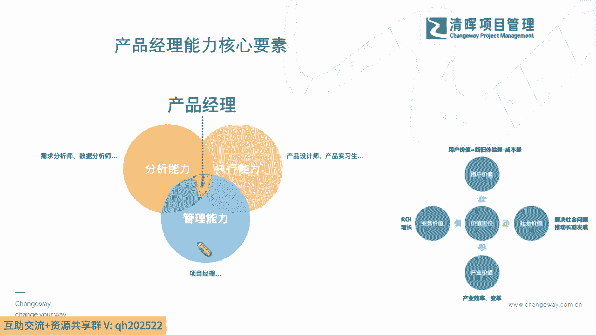
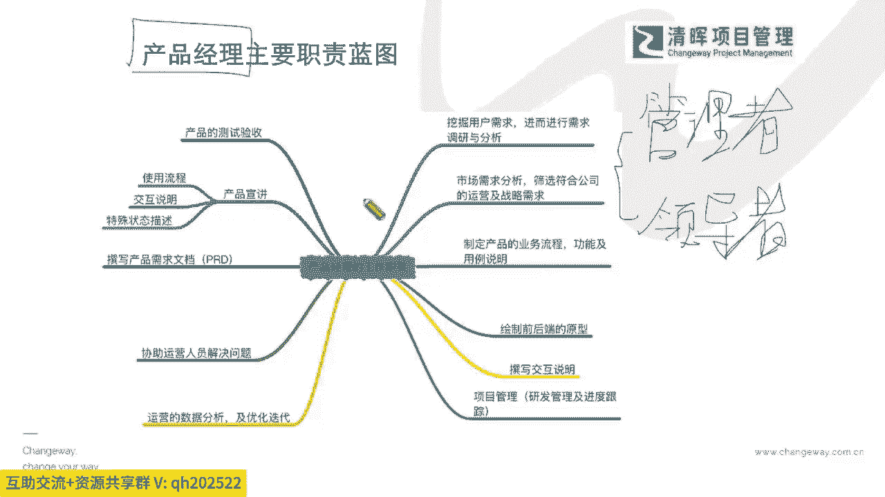
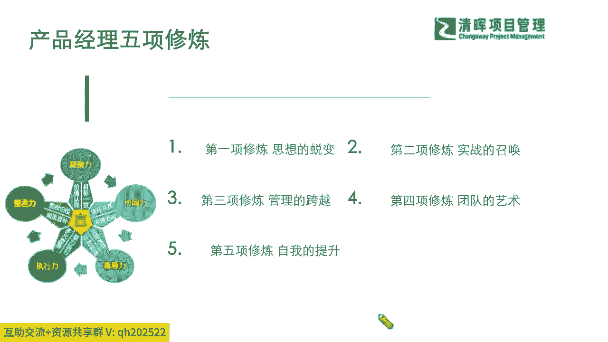
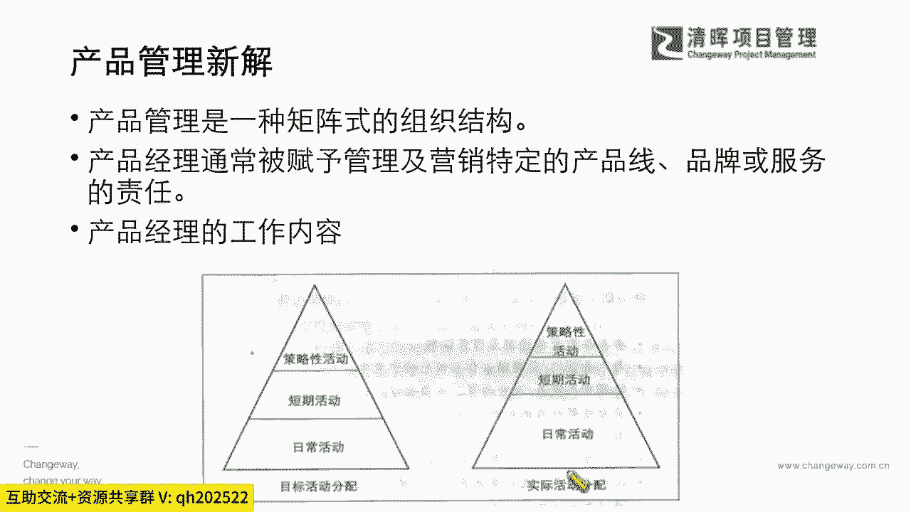
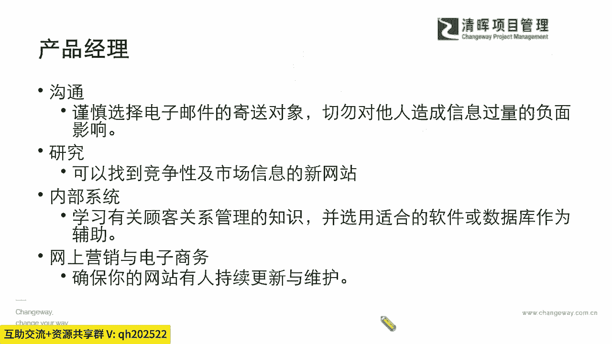
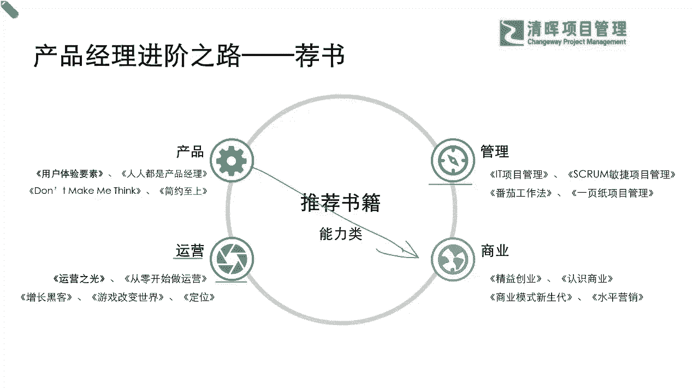

# 产品经理所需的知识和技能 - P4：4.产品经理能力核心要素 - 清晖Amy - BV1w1421k7wt

我们就能够看到我们产品经理的，它的一个核心素质呢，就是从我们的管理能力，从我们的这种战略的分析能力，从我们的执行的一个能力上，我们简单可以把它变成一个什么，就是你既既敢想又敢做，又能什么当责，是不是啊。

其实这就是一个非常非常综合和战略的，这么一个岗位，那么我们嗯知道了这样的一个情形啊，我们就知道所有的这个部分，那在我们整体的这样的一个环节当中，我们产品经理既然要负责这么综合的一个流程。

一个多元，那么我们看到他的主要职责，在我们整体的层面呢，我们其实有很多除了我们的三大文档，那三大文档是严老师尽可能简化，让大家去理解是吧，你通过市场的需求文档，通过商业需求文档。

通过你的这个我们的一个产品需求文档，你其实能够非常非常看出来，这种非常直接的这样的一个环节上的不同是吧，那么我们其实也能够看到，在产品经理的这种细则上，其实还有很多非常非常详细的一些工作职责。

需要去落地，也就说我们这个产品经理，你不仅仅是要当一个leader，就我们之前讲了，在PMP里面也讲过，我们不仅要做一个领导者，还要做一个管理者，什么意思，领导者是谈战略的，领导者是谈战略的。

管理者是干什么嗯，落地的是吧，也就是说你作为一个领导者，你必须把视野放开，要懂得前因后果是吧，要懂得它的价值，能去理清楚这里面的一个战略方向，那不仅仅你是一个领导者，你还要down to earth。

你要去接地气，能去把这个事情做出来是吧，那么在这个过程当中呢，我们一定也能够非常清晰的知道，我们的产品经理。

他其实应该是一个能够非常非常快速自我提升，又能够去带动团队，也逐步去匹配这种需求，的一个重要的一个岗位角色，那么在这里我们之前也或多或少跟大家提到过，咱们的产品经理，他会有非常重要的五项能力的一个修炼。

那么在这个修炼的时候呢，我们也会跟大家去提到一个点啊，我们不仅仅是需要去提升我们的个人的，这个能力，我们还要需要从我们的管理能力，从我们的团队领导力，从我们的整体的这种实操作战的能力上。

也去给出我们不同的这样的一个提升点，那么在这个提升点之上呢，我们就可能会跟大家去提到啊，也许你会看到在我们的整体的这样的一个。

产品的管理当中，那我们的产品管理，它本身就是一些这种战略性的这种活动是吧，它可能通常会有很多这种那种策略性的一些，短期啊，长期内容会交织在一起，去，让我们去进行制定和落地，你会发现有一些活动。

它可能会有一些短期的效应，但有一些活动也会有长期的一些这种，这种benefit是一些收益，那么在这个过程当中。

我们的产品经理就必须要非常非常具体的，务实地去进行一些沟通，去进行这种研究是吧，那我们看到这样的一个环节的时候，我们就知道了啊，我们还需要去做什么样的事情啊，我看到手机尾号七幺呃。

7017的一位同学提问说，人人都是产品经理，这本书您怎么看，这本书我大致翻过一遍啊，那呃首先啊就是我，我觉得这位同学如果你感兴趣，我还是建议咱们以后也在咱们的在线读书会，一个月读一本。

那这个书呢也至少啊，严老师多多多少少是读过几遍筛选一下，那其实有一些书他其实给了一些要点啊，因为这本书我大概只翻过一遍啊，我可能内容不太记得了，但是在里面的一些东西，我觉得可能啊。

你需要去选择的一些入门级别的，产品经理的书呢，也许是一个不错的读物，你能够快速从标题，从他讲的一些基础道理上能get到一些东西，但是如果我们想去切实的升级的时候，其实像这样的书也许啊不一定够深度。

所以我想要给大家提一个建议，就是说如果你实在不知道怎么去选书，那你是咱们的社社区会员的话，那可以去看一下闫老师读书会的这个书啊，那应该社区会员是免费的对吧，只要加入我们的会员。

那我相信可能有一些选书和看书，它也是逐步在深入的一个过程，也不能是一直在停留在某一个阶段，就像你可能上幼儿园，你可以看绘本是吧，你但是你到小学，你再给他看绘本就不合适了是吧哈。

所以他其实是有个阶段性的啊，那读书会应该是我们呃，在线名师专栏的一个项目，你可以翻我们的在线学堂的这个专栏啊，也可以咨询我们的在线的小仙童啊，那我们也回到这个部分。

我们在看到这个部分的时候，我们既然提到这个，其实严老师也推荐在进阶的时候，可能初阶可以去听听这个人人都是产品经理啊，这些书我大概翻过一遍啊，但是我更加想要去让大家去提升的，就是我们可以划个对角线啊。

你先去看看什么呢，你先去看看一些战略的东西，比如说你的整个business，你的商业模式啊，商业战略啊，然后还有一些偏管理的，像这种你的项目管理啊，一页纸管理啊，敏捷管理啊。

你还有这种做运营的运营是什么，运营其实就是持续把你的变现嘛，能够cost down啊对吧，这些都是很落地的东西，所以在这个里面你可以先去尝试一下，但是我们很多的书啊还是一样，每个人读书是知人知义的。

见仁见异的不一样的是吧，所以如果实在是觉得，哪些书读起来不一定能达到你的目的，没关系，咱们一起来共读啊。

