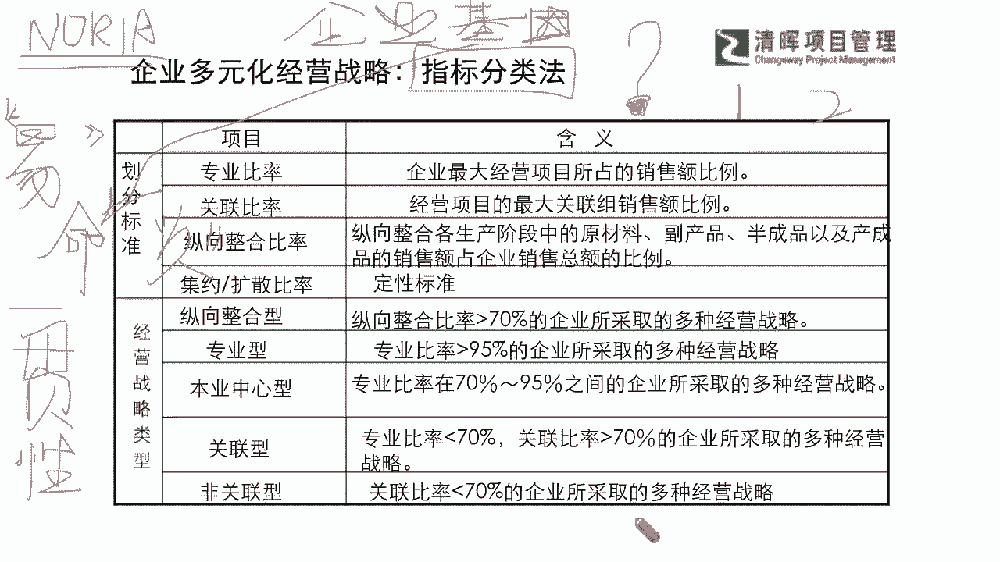
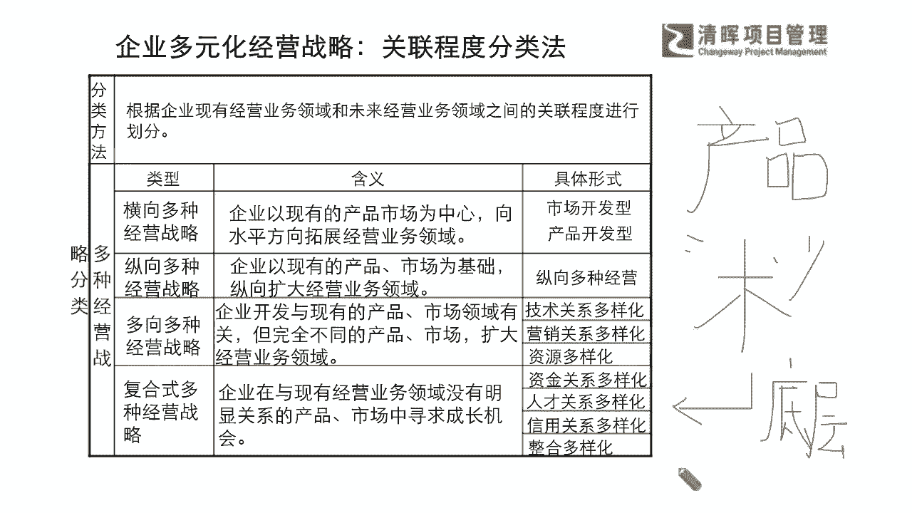
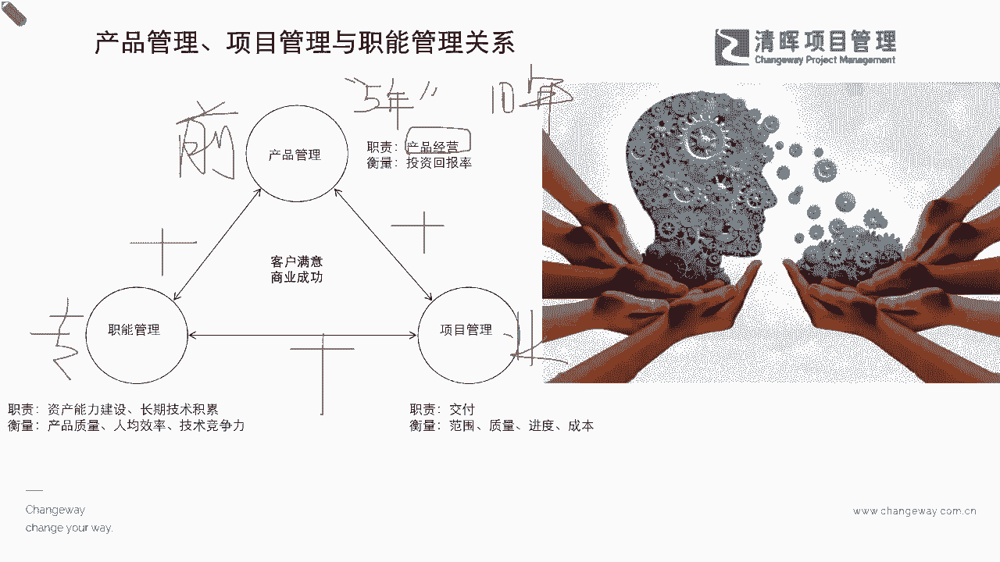
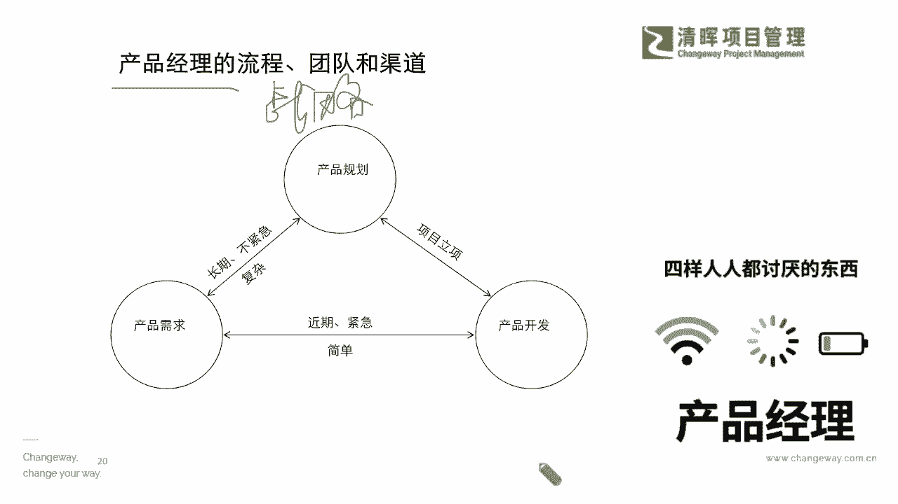
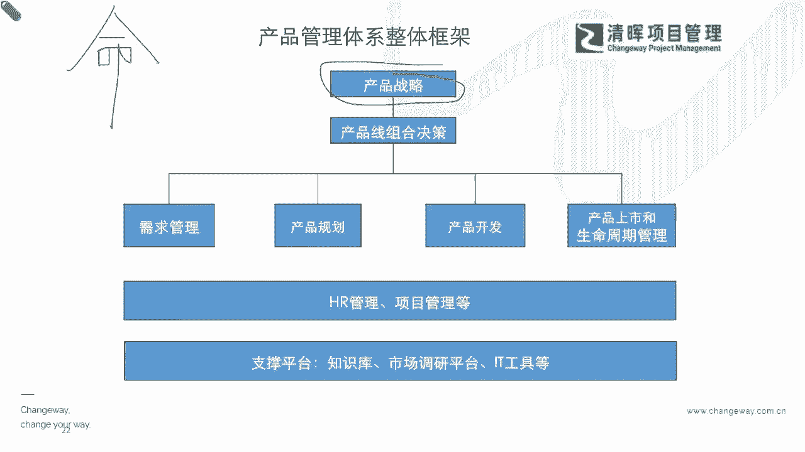

# 产品经理所需的知识和技能 - P5：5.企业多元化经营战略 指标分类法 - 清晖Amy - BV1w1421k7wt

体系化的一个企业管理的东西，就是我们的企业多元化经营战略的一个部分，那么在这个战略当中，为什么要跟大家去啊，引入这么一个概念呢，让大家稍微也拓宽一点视野呢，就是我们会知道我们企业为什么去投资。

一些产品的开发，为什么会特别重视某一类产品，管理的一个这种成果，其实都跟企业这种战略的经营的这个方针，是离不开的，也就说我们最终的产品经理，你也是要服务于我们的什么企业的，企业的战略啊。

那么这里面我们稍微跟大家拓展的一个点，就是我们企业多元战略上，怎么样去进行这种指标的分类，我们其实从很多种类型上，可以去进行这样的分类，我们首先来去了解一下，我们的一个叫指标分类法。

那它里面就会有一些多元的划分标准，比如说你的专业比率啊，关联比喻啊，纵向的一些整合比率啊，还是你的集约或扩散的比率啊是吧，那么企业战略的类型就会有这种纵向整合，有这种专业型，有这种本业中心型是吧。

就是我只专注我的自己的最擅长的东西，那还有关联型和非关联型是吧，有的企业可能跨界跨的也比较大的是吗，我们在看到这个部分的时候，我想请大家先思考一个问题啊，我们的产品经理。

你的产品战略是否需要随着你的企业，多元化的战略来去进行调整呢，我想问大家一个问题啊，问大家一个问题，是否你的产品战略需要去跟着你的企业的一个，经营战略去调整呢，是还是不是认为是是的，同学打个一，不是的。

同学打个二，你的产品战略是否需要跟着企业的战略去进行，调整呢，好我再重复一下啊，我们在线的各位同学啊，我也希望大家跟上这个节奏啊，虽然严老师时不时也在咳嗽，是吧啊，这个嗓子也有点低沉。

但是我希望大家听了咱们就要有一些收获啊，我也非常竭尽全力跟大家来，把这个东西尽量讲的这个简单一点啊，不要搞得这么复杂是吧啊，我们都是一边倒啊，有没有同学认为不需要看的，我们看从爱丽丝同学到姜文斌同学。

冯素娟同学啊，林一同学，还有AUTHIA同学，杰克船长同学collar man同学都是一啊，好肯定要考量是吧，那说明什么，说明我们现在在线的同学，你们其实已经有一些战略思维的基础了。

就是有这样的大局观的，这个是非常好的，给你们点赞啊，那同样那我们都知道要考虑，那但是我们产品经理你看你在哪里去考虑它嘞，就像我们很多就像我们讲这个项目经理一样，项目经理很容易就抱怨整天变需求。

不是这样干，就是那样干是吧，也不知道一天，这个天上的这些神仙们在想什么事情，总之呢就是这个不变就不行，变完了之后一堆的这个麻烦一些变更是吧，又搞得这个非常的复杂的一些流程，然后又会耽误时间是吧等等。

那其实在这个过程里面，我们都知道要去考虑，但是我就还是想请问怎么考虑嘞，作为产品经理，你看我就给你指了指标分类法，产品经理你怎么去考虑这些指标，如果你今天你从第一个刚才介绍过的，那个叫什么商业的。

什么这种我们的一个商业需求文档BRD上，你是不是要去考虑到你的经营战略，到底是纵向整合型的，还是专业型的，还是本业中心型的，还是关联型的，还是非关联型的，一定要去考虑的。

你不考虑你后面就等着你这个产品要有问题的，是不是啊，为什么，因为你会发现你们所有企业的战略的一个方向，其实是就是你产品的一个方向啊，我们暂且用一个相对啊，可能不是那么太贴切的一个比喻，但是话糙理不糙。

就是我们通常讲的，你们可能在买一些理财产品的时候，这个你的理财项目经理都会先让你干什么，先让你做做测试是吧，看看你到底是风险追求型的，还是什么保守型的是吧，到底是不是愿意去承担一部分。

这种可能我们前期要投入，但是有可能他会赚，也有可能他不转是吧，那么可能在这个过程当中的时候，我们怎么样能够，更好的把这个部分能够去了解清楚嘞，那其实就是你从最早的这个战略上。

你就要去搞清楚它属于哪种类型，你的产品的从商业需求阶段，到我们的我们的市场需求阶段，一直到我们的产品需求阶段，你都要始终如一的叫consistency，叫一贯性，你不能脱离你的母体是吧，一惯性。

就像我们今天在再举一个糙糙的例子，就像今天我们每个家庭啊，你自己家自己家的宝宝，谁家娃像谁，是不是啥意思，就你不可能你这个基因不可能生出来，跟你完全不像的东西是吧，这肯定就不是你家的娃了。

是不是也一样的，也就是说我们在这个产品的开发上，其实也是存在有这样的一个基因性的，也就是说我们其实有很多的企业公司，不是不知道去进行改变，我们就举一个例子，像比较早期的NOKIA是吧。

我们的这个诺基亚手机多么多么的坚硬啊是吧，我们的整个落摔实验，我们整个的一个市场占有率，原来是那么厉害的一个品牌，甚至可能从管理上也是有，屡屡给我们提供了很多非常优秀的这种企业，管理的一个方式方法。

那其实它是一个很优秀的企业，但是为什么它在整个的这种智能化手机的，这个市场上，它就处于这样的一个劣势了呢，这其实存在于，它有一些我们叫做企业基因的问题，企业基因的问题，也就是说我们的基因这个东西啊。

这个是很多东西我们没有办法去改的，这个就是我们现在有很多在讲，大家平时涉猎的时候，有没有去看过那个易经啊，就中国传统的这个文化数据，有一个叫易经，就简单的那个容易的易易经有看过吗啊，我推荐大家啊。

尽可能除过一些实际工具类的书本，还是要读一些看似没有用的书啊，但其实它挺有用的，你自己去体验体啊，易经里面就告诉我们，其实是咳其实我们的很多的一些东西，我们叫做什么不同的这种命数是吧，什么叫命啊。

刚才我们讲生命周期也叫命啊是吧，你这个命里面能决定你活得久的，我们刚刚才提到了，我们要去想好啊，就是请把它升好呀，给他规划好啊什么的，但是有一个东西你是无法去改变的，就是基因，大家有没有想想明白这个点。

也就是说你这个命天生来的时候，他是带着什么样的一些基因来的，这其实就是你在原来的企业当中的战略，你你的一些企业的战略文化，这种氛围，它带给产品经理，产品管理的一些战略层级的一个这种一贯性。

那么有了这个一贯性的，我们就会能够看到，其实我们没有办法完全去什么脱离开企业战略，能去单纯看说这家公司，你看同样的一些新产品开发，在某一些公司就能成功，在苹果就能成功，诺基亚他自己发现了。

他可能在某些点上他已经落伍了，他没有在智能机上去赶上这个潮流，他也想去改变，但是为时已晚，但是企业基因上来讲，它就已经是出现了很多这样的一些什么，这种很缓慢的一些这种步骤。

他没有办法去跟得上这个节奏了是吧，所以这也是他的一个mean所决定的，所谓命就是基因嘛，就是你天生的氛围呀，环境呀，你那些无法去改的部分，所以我们讲尽人事知天命嘛，其实我们也没办法跟天斗。

但是我们要尽人事是吧，所以这是我们能够了解到的。

那我们还有一个分类法呢，我们也想跟大家去介绍一下，就是我们在企业战略当中，我们还有一个叫做关联程度的分类法，这个是大家要去体系化的学习，咱们的这个企业这个战略啊，整学习我们的这个企业的经营战略。

才会涉猎到的点，但是我们今天跟大家稍微拓展一点点啊，那么在这个当中，我们其实会有一个啊，非常重要的一个理念是什么，我们的产品管理它永远是在为什么未来的成功，未来的产品而去什么做设计。

做什么价值的一个提升的，是不是，也就是说我们不会去为了以前怎么样，那么在这样的一个环境下面，我们就需要去嫁接一个桥梁，就是你要知道企业原有的这个经营业务领域，和未来的经营领域之间。

它们的关联程度怎么样去很好地划分是吧，那么在这种划分上，它会有很多种划分方法，比如说它有市场开发型的产品开发型，它具有横向多种的一个经营划分，那么还有纵向的多种的划分，以及复合式的。

比如说你到底是呃注重你的哪些，到底是以现有产品为主，还是完全不同的这种新增的产品为主是吧等等，你就要怎么去切分嘶，所以这些东西也是非常关键的一个点，我们需要去把它和产品的战略理，紧密联系在一起。

这也是为什么我们需要在明年的读书会，严老师觉得有必要啊，读了3年的一起共读书，每个月一本本书，我觉得有必要咱们过渡到一个阶段，就大家都知道这些数啦，都知道这些数啦，就是我们知道可能需要去学一些工具。

学一些流程，我们也知道我们的一些责任，但是回归到本质上，我们不仅仅是要知道数，我们也要知道它底层要关注什么，如果它的底层千变万化，你的树上面就会一直在变动，你就觉得永远学学多少东西。

好像都跟不上这个节奏一样，其实不是这样，它其实是会出现有一定的这样的一个啊，这个规律和它的一些底层逻辑，这其实就是一个底层逻辑的一个战略的思维，还是在战略思维角度，就是你要知道你怎么样能。

更好的去做好你的产品，你也要了解你这家企业的战略是什么，不仅仅是产品的战略是吧，所以还是那个底层战略的思维的协同，非常非常重要，那么在这样的一个过程当中呢。

我们也会需要去把产品经理啊，然后再抽离出来，我们之前也跟大家讲过，其实产品经理跟我们的项目经理，跟我们的职能管理啊，职能经理之间呢，这个区别还是非常非常大的，那么这个区别既然大，我们的产品管理。

刚才我们深度的，分析了他的一些核心的能力，核心的职责，也讲到了他所需要去顾及到的方方面面，那么其实就能够看到这在这样的一个过程当中，我们就需要去注重产品经营的一种思路，也就是说刚才提到企业经营。

你产品也是一种经营的思路，也就是说，你其实不能脱离开企业战略思维的一个，什么高度来去进行单纯的产品管理，这其实是可能不能接地气的，我们始终要围绕在这种什么，我们整个的一个产品的一个高度。

战略的高度来去协同到我们的经营管理的高度，我们才能去理解产品经理，为什么价值这么大是吧，甚至我们的产品经理，你像这个啊乔布斯啊，雷军啊，我们的这个罗总啊，他为什么自己是一把手是吧。

就是这个他自己本身就是一个，非常优秀的产品经理是吧，他能把这个产品的价值，从市场价值到到这个商业需求价值，到这种产品的价值，它都能够讲的非常的清楚是吧，所以这是一个非常重要的一块。

那么还有呢我们就是要分清楚啊，其实很多同学也会非常这个一直在问，说这个哎呀，我这个原来是可能只是在function部门，那我原来可能是做项目管理，那我在转产品管理的时候，是不是会有很多东西需要去学。

或者很多东西是我们的一些短板，那其实在这里呢大家要搞清楚，他们三个本来的立足点都是千差万别的，也就是说如果今天我们硬要去做一个区分，或者说我们硬要去给他们戴个高帽子的话，那其实产品管理者。

它所需要的具备的能力是更加综合和多元的，也就是说，它不仅仅需要像职能部门那么专业精深之外呢，它还需要具备项目管理的这种，整个的一些思路思维，并且还要去结合前端的所有和后端，生命周期管理的更多的一个东西。

它其实是在不断的把这些功能做加法，它是一个非常多元综合的这么一个岗位，所以如果大家今天在我们严老师讲产品的，这个在线微课的这个咱们各位同学啊，我相信你们肯定是具备了一个初步的一个认知，是什么呢。

就是你们想要去做得更好，想要去提升到另外的一个战略高度，这其实是非常非常厉害的一个成长型思维啊，那怎么去做到呢，就像我刚才跟大家提到的，还是回归到先抓根本，把战略思维培养起来，它是有方式方法的。

那么先区别于我们，现在我们就讲非常明确的一点，如果你的工作年限在5年以内啊，我们就大面上啊，如果说闫老师这个粗略的讲，并没有非常细致的划分，也请大家谅解啊，如果你的工作年限年限在5年里以内。

基本上我可以断定，如果你是在大公司，你是完全接触不到这种战略性的一些事物的，因为年限太低了，你可能只是在做一些执行端，协调端，你还接触不到一些核心，你如果在大企业能做到10年以上。

也许随着你的职位的晋升，你会逐渐的去接触到一些战略层面的东西，什么叫战略层面，比如说你开始关注，你开始关注企业的一些战略的一些指标啦啊，财务指标也会也会由你来去负责，要去达成一定的这种所谓的这种战略。

财务的一些这种要求是吧，我们的margin啊，我们的revenue啊是吧，这些东西属于战略层面的，那么这其实就存在一个点，如果今天大家都是在一个比较啊，应该说是年轻的阶段，我们想给自己更多的一个机会。

想要去提升自己，那从另外一个角度，能够更好的把我们的这个综合能力提升起来，以匹配我们在更短的时间，能够晋升到更高的一些职位的这种要求呢，大家其实就需要提前去学这些啊，一定不是滞后去学啊，一定要提前学。

所以可能在这个点上，我就希望大家能够抱着这样的一个，这个整个的这个正确的思路，我们要有一个长期的规划，产品经理，它既然是战略层面的东西，我们就一定需要有一个战略的长期的一个思路。

也就说我们必须从n to n，从这个前端后端一个环节，一个环节先从战略了解开始，再去了解我们的整个的什么，这个产品的范围是怎么样，我们的整个管理范畴是怎么样，以及我们再结合企业的战略。

我们怎么样去实现它，怎么样能够把这个价值发挥到最大化是吧，所以可能在这样的一个过程当中，我们能够预见到，能够看到他是一个长期主义的行为，也就说我们不可能一朝一夕，就能有一个非常优秀的这种项目经理是吧。

所以可能这个产品经理和项目经理，他会更加多的要求就是产品经理，他这个也不是通过我们这样子跟大家讲啊，你如果没有去系统的学过NPTP，也许你还不了解它里面的细则，但是一样你即便考了NPDP。

你更多的实践层面还需要去补充一些战略思维，但是好在啊，我们的产品经理认证的这个NPDB，它在封面上就印了一个叫做产品经理的一个，知识体系的一个指南，它并不是像PMP的一个叫做最佳实践指南。

大家有没有注意到这个不同点啊，感兴趣的你去看一下这个NPDP的红宝书，红宝书的封面，它叫做产品经理知识体系指南啊，我们的PMP的书的封面，它是指的是产这个项目管理的最佳实践指南。

其实在这样的一个看起来是有一些这个，用词上的不同，其实恰恰代表它战略上的不同，NTDP所有介绍的一些体系，就是它我们刚才所提到的，从前面到后面所有的N图N的东西都会有，从你的开发流程，周期管理。

组合管理，从你的深度上都会涉猎到这些知识体系，所以他其实是一个迷你版的，综合多元的一个能力的一个MMBA了，所以我们知道了这样的一个情形呢，我们也会进一步的能去看到。

我们产品管理体系的这个框架嗯，它所要求我们的这些核心竞争力和能力，其实是跟我们的NPDP这个体系，是非常非常契合的，我们其实就是在就是在管理他所有的这个这个，生命周期是吧，生命周期。

那么可能在这个过程当中，你会发现你会比其他人更在意，你这个产品，是不是能够有强大的一个长期的生命力，因为这就是他的战略思路去要求他的，也就说可能我们会看到，很多优秀的企业的产品经理。

他开发了一款优秀的产品，这个产品也许都能够让这个企业，只靠这一种产品，就能够长久的有竞争力的生存下去，就像我们很多的日本的企业，是不是他会去提到他一生只做一件事情是吧，只把一个东西能去把它搞清楚。

那么我们看到这样的一个部分的时候，我们也能够去理解到，其实在我们整个的产品管理的这个，体系框架之下，我们作为一个这个入门的产品经理，你想要去更好的上这个台阶，那我们建议大家就是一定要从战略这条。

战略这个基本基准点上去落脚啊，千万不要倒着去学了，什么意思，我们因为有一些同学在我们线下沙龙的时候，会跟严老师来来提这个说啊，我现在为了去当产品经理，我开始要去学财务了啊，我要去学这个我们的市场。

学我们的销售，这些周边的一定是需要涉猎一些，但是请大家不要本末倒置啊，不要本末倒置，毕竟人家能在销售领域做10年，和你去学销售，学一个星期，学一个月，那个专业度还差得远是吧，还差得远。

但是如果你能在产品战略上能去，比别人要更加综合，更加全面，更加看得远，这才是你核心的竞争力，这才是你应该去正向去建设的，或者是打好基础的地方，所以大家一定要搞清楚这个先后的顺序啊。

