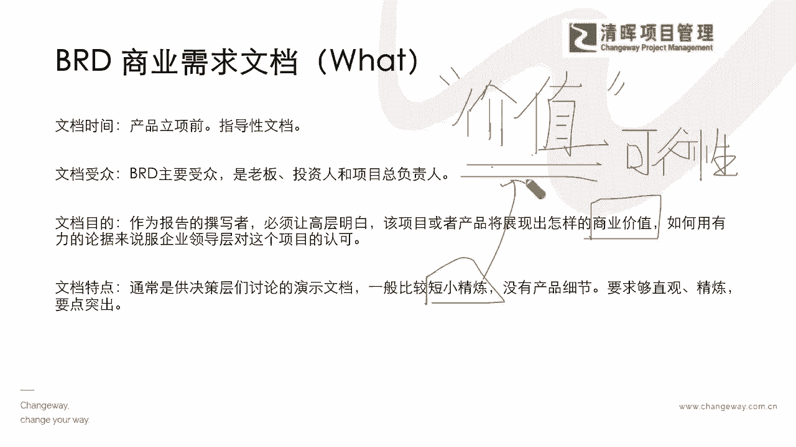

# 产品经理所需的知识和技能 - P1：1.产品经理所需的知识和技能 - 清晖Amy - BV1w1421k7wt

下我们可以看到其实产品经理啊，他所需要去补足的一些知识和技能，那就非常非常的广泛啦，那么在这个广泛的基础之上，我就想请问大家好，如果今天你是在你的行业当中啊，你想要从某一些岗位转型到产品经理。

或者想去做产品管理的话，那么我想请问大家，你会去把这些所有的东西都学一遍吗，比如说什么样的东西啊，就是你的你研发，你，你是不是就去了解你所有的技术的一些细节啊，你也变成一个研发专家。

那么如果你要去了解市场，了解这个这个呃整个的一个销售，那你是不是变得比你的销售，比你的市场人员更加专业呢，我想请问大家，平时如果你们自己在补充这方面的专业智技呃，技能和知识的时候。

你有什么样的一个问题和困惑，你现在知道，既然产品经理要求这么高，这么多元，这么综合，那你有没有一个想法，你怎么样能够通过什么样的方式来补足，你的一方面的这个知识和技能，你可以最快速的去胜任这个产品经理。

这个岗位呢，好我想提一下，提问一下我们在线的各位小伙伴啊，如果在线的同学啊，我们也在我们的评论区，敲出你们自己的一些简单的想法啊，你们想想看，如果我们今天要求这么高。

那你你认为你最先啊我们就来问一个问题，你最先应该是提升的能力是什么能力，第一步step one啊，Step one，我们最需要去提升的一个能力，如果今天让你去当这个产品经理。

你认为最需要去补充的第一个能力是什么，好大家来想想看啊，如果你去当产品经理，你最需要补充的第一种能力是什么能力，我想请问大家啊，来，如果你要当产品经理，你认为最需要补充的能力是什么，能力好。

有同学说要懂业务啊，COLLEMAN说同学说要懂业务嗯，业务我的理解是说你是指business，对不对，就是你综合的这种就是商务的东西是吧，好，那么冰侯同学说这个沟通能力啊。

嗯这个立足点其实都非常的尖锐是吧，好还有没有同学有想法啊，小丑鱼同学说这个业务和用户嗯，把商业能力和用户都包含在里面了，冯冯素娟同学啊，好说到沟通了好好，现在我我再去问一遍啊。

如果你是你是想当一个产品经理，你第一个先要去学的东西是什么，好as tre同学说要懂用户是吧，好我们很多很多同学说懂业务呀，沟通啊，沟通也是跟干系人沟通，对不对，那么用户那那懂用户怎么个懂法嘞。

你怎么知道用户有什么样的想法，啊杰克船长同学说到竞品了是吧，非常好啊，那我就想顺着大家这个思路啊，你自己来想想看，我们既然说到又是业务，又是用户，你怎么去能够理解你，你你说懂用户，我们怎么样学什么能力。

你就懂了用户了，你学什么能力，今天我们就就要落地这个东西，你怎么才能去懂你的用户，每个人其实我们每一家产品线，每一个品牌都在不断的想要去触达到客户，想要去了解客户的需求，因为这就是生命线呀。

是不是非常好啊，小丑鱼同学提到了一个需求，用户画像非常好，非常好啊，给你点个赞啊，就是实际上有一点大家有没有关注到，其实严老师在开始讲咱们在线上课程的时候，我每一期都会去请大家要扫码。

把你们的意见或建议要留给我们，为什么，其实就是我在不断的去收敛我们的用户群体，也就是说大家的需求在哪里是吧，如果今天我们所有涉猎的一些内容，所有涉猎的一些这种话题，大家可能非常感兴趣呢。

这就是我们最大的一个什么价值，因为1+1永远是大于二的，我们也希望能够给大家带来更多的一些价值，那如果这些不是大家感兴趣的，也许我们就需要快速去调整了，是不是啊，所以也可以看到啊，我们在这样非常好。

我们其实这里面，第一个需要去达到的一个技能呢，其实就是要要有这种什么，我用一个稍微专业一点的词啊，因为我们各个同学多少都涉及到了一点点，但是我们稍微专业点的词，就是你需要去有一个什么。

知道怎么去收集你的闭环反馈的需求，就是闭环反馈，也就是说今天你所有的想法都可以是正确的，你没有经过市场验证的时候，其实所有的一些新想法也许都是创新，但是你你你不知道，哪一个才是你最应该去着手的。

你不知道你的需求在哪里的时候，你这就是一个很大的风险，所以我们需要去学会闭环反馈，了解需求，那这个闭环反馈了解需求从哪里学呢，直接告诉大家啊，这个闭环反馈了解需求，在我们所有MMBA的管理学。

这是第一课，叫做我们的business strategy，叫做商业战略，就是我一开始跟大家所讲的，你必须要有战略思维，战略是什么啊，战略不是简单一个拍脑门的想法，他是要落地，要去做到。

做到了它就能实现它原本预设的战略价值的，能理解吗，也就是说大家必须要有一定的战略思维，战略思维我就用这个稍微有点学术专业啊，我们叫闭环的反馈，了解需求的能力，其实闭环所有的反馈了解需求。

这样有很多同学讲的，这个用户画像都很专业了啊，其实就是我们在必须要去搞懂，我们的战略是什么，这个战略里面就是我们讲的长期的有取有舍的，我们要去达成什么目标的，并且可能这个战略规划就决定了。

你能实现多少价值，战略思维是第一步要去学的，从哪里学MBA第一课就会学，如果没有系统地学过管理学的同学，你应该或多或少在学PMP的时候也会涉及到，但是PMP还是教一个项目怎么管，那你在学NPDP的时候。

你会更加有这种想法，就是知道怎么去做这个事情，那你怎么样的方式流程能去管好这个产品，那我们等一下也会涉猎到这个简单的流程，但是我想告诉大家，所有的优秀的产品经理必须要有战略思维。

这是一个第一步必须要有的，如果我们再糙一点的去说呢，它其实就是一个什么宏观的全局观，你就知道怎么样能，你想要闭环，你就得考虑到中间很多的若干的干扰啊，也就是说你很多东西你不是说一一发一收。

你就拿回来的东西是可可参考的，可借鉴的，正确的东西，你其实要经过很多分析，甚至你的小范围试错，投放的一些目标客户，你的市场的反馈的一个周期，以及它实际的数据的收集，是不是这样子能够借鉴的。

这些其实就是你在战略当中的一个，非常重要的一个点，所以我们也让大家来了解一点啊，这个爱丽丝同学说的非常对啊，说闭环反馈了解需求，也就是说我们其实讲了一步六的能力，这个能力那个能力。

那个能力那个能力你在哪个行业，就有哪个行业的要求，还有领导力的综合要求，但是归根结底啊，我们就讲一些本质的东西，我们要有战略思维，他这个战略思维怎么培养啊，我们刚才说了，当然NBA是很好的一个路径。

但不是所有人都去读那个NBA是吧，那我们平时在工作当中，怎么样去涉猎到这种战略思维呢，那你其实就需要有一个根本性的全局思维，全局思维是什么，就是你要非常我教大家一个很简单的方法啊。

如果你现在还没有理论化的去学过NPDP，这个还没有理论化的去学过这个PMP，甚至没有理论化去学过MBA没有关系啊，你尝试去用一个很简单的方法，在你的日常生活当中，你会逐渐地培养出来这种全局思维。

怎么做呢，你就每个星期啊，我们先不讲一日三省吾身，说以一天三次反省自己，我们先不讲一一天三次反省啊，我们就讲一周反省沉淀一次是吧，那一周沉淀一次，怎么去沉淀呢，你拿出一张A4的白纸。

就是我们正常打印纸的A4的白纸，你在白纸上中间，比如说这是一张A4的白纸，你在这张白纸的中间去画一个分割线，左边打上加号，右边打上减号，干什么呢，你就去回顾，花半个小时时间啊，也不要太久。

花半个小时时间去写，你本周哪些方面是积极的，带来更多价值的，你做得好的，拿到了正向反馈的，并且对后续有利的一些事情，1234把它全部列下来，正就代表积极的正能量，但这个减号代表什么，就是做错了。

产生负的影响啦，对我的某一些可能有一些造成不良的影响，这种事以后要少做，甚至要杜绝不能做，那就是把这个负面的东西呢，也把它123全部列下来是吧，全部列下来，每周坚持做这个事情，你自己去梳理一下，从正面。

从负面去梳理，梳理完之后干什么呢，再花另外半个小时时间来去给出，你怎么样能够把加号的东西发扬光大的一些action，能够哪些能够把减号的东西杜绝，甚至避免降低出现几率的action。

也就是说行动把它再加上他的行动，每周一个小时的时间来做这件事情，你就会发现你逐渐的看事情，你就会变成一个什么，Pros and cons，就是我们既有看到正向的思维，也有看到什么反面的思维。

就像我们今天在讲光的正面，你迎向光的时候永远是刺眼的，但是如果你遮挡的光，你在你的背面，它永远是有阴影的，所以一件事情它不是绝对的正确或者绝对的好，它一定有它的好和不好，你要去看到每个阶段可能哪些是好。

哪些是不好，你要扬长避短，甚至有策略的去采取，阶段性的一些这种战略思维，所以这种全局思维，也是可以通过练习来去练出来的，那么如果接下来如果有感兴趣的小伙伴，也可以关注后续啊，就是严老师啊。

这个在线学堂的读书会呀，我们的还有在线的微课啊，严老师在明年4年啊，有老学员应该知道我们读书会，严老师在线学堂这个读书会呢也已经3年了，我们明年就第4年了，那么明年我的一个择书的一个重点呢。

会主要在锻炼大家的全局战略思维，有了这样一个正确的框架，其实我们不愁往里面放的东西是不是正确的，那从另外一个角度来讲，你只要你的地基是打得足够好，我们其实就是要一点一点，把里面填上一些合适的东西。

你就会发现你后面越来越得心应手，如果你没有打地基的这个过程，就像我们通常讲万丈高楼，平地起不了，它是要有地基的，平房才是地基比较浅或没地基，因为它不能抗震，不能抗一些这种极端天气的一些这种影响。

所以我们往往这种高楼大厦，它的地基也是等比例的深，所以我们的全局思维其实就是大家一个基础，你想要在产品经理也好，在管理岗位上也好，做得更好，这些就是你的基础，感兴趣也可以持续关注严老师的在线读书会。

明年24年我们会带来一系列前沿的这些书籍，来帮助大家落实怎么样去做，当然我举的这个例子呢，只是其中一个小小的最简单的方法，我们还有很多的工具和方法论能够帮助到大家，那么有了这样的一个知识和技能的打底。

我们会再去返回到我们产品经理的一个，我们大家非常熟悉的一个工作流程啊，比如说我们一开始知道我们的这个product manager，我们的产品经理从前期的这个idea阶段，是把一些初级初级概念阶段。

我们就需要去做这种足够的充分的市场调研，那我们还要去，刚才有同学说到那个竞品分析是吧，这些都非常非常关键，但有了这些竞品分析之后呢，我们还要去有一些对这种需求的一个抽象分析。

再去不断提炼出新的交付成果的这么一种能力，把它需求抽象的东西变成具象的这种产品，设计的一些需求点是吧，所以可能看到这样的一个整体的，这个部分的时候，我们再会去协调到内外部团队，怎么样把这个产品做出来。

做出来之后呢，我们还去关心他的一个整体的生命周期的一个，新陈代谢是吧，所以可能在这些点上，大家会发现整个的过程，就是刚才我们所提到的叫做产品的全生命周期，它其实就是管他的命。

从一开始我们怎么样把他生出来，怀胎哈，一直优生优育嘛，我们讲的这个是吧，然后一直到把他能够生出来，生出来之后呢，还要负责管他，还要上大学，还要上研究生，还要读博士后是吧，尽可能要让他更成功。

所以可能在这个期间，我们就一定有产品经理的，最需要去拎得清的一些环节，在这里呢严老师把它稍微精简了一下，因为咱们时间和这个啊有限，还有咱们的整个这个理念上，我也不不想给大家搞得太复杂是吧。

那我们就先把它简化来了解最最重要的核心点，那我们可以看到产品经理，他其实在我们的商务需求，在市场需求，就刚才有同学说那个那个业务需求是吧，那就是商务的，那我们还有市场需求，要去了解用户，还有产品的需求。

你怎么样去创新和去开拓这种，我们的这个客户和他这些啊，在线的这些所有的我们我们的这些用户，他们最极致的一个这种啊整个的一个反应是吧，所以有了这样的一个部分，我们就知道。

这也是生命周期当中最主要的一个标志，那么看到了这个部分。

我们就接着来看啊，如果有这三项的话，那么我们看看在产品生命周期当中，它最重要的一个三个文档其实是在哪里呢，那我们可以看到有三个大家如果学过NPPP，或者是稍微有所涉猎的话，没学过没关系啊。

我们来看看提前有个概念，有三个文档其实能够拎得清，他这个在里面的所有的一些点啊，那么可以看到有一个叫business叫BRD是吧，叫business requirement的一个document是吧。

叫商业需求文档是吧，那么还有一个叫做MRD叫market requirement document，叫市场需求的一个文档是吧，那么市场需求的一个文档，我们也能够看到我们的PRD就是product的一个。

Requirement document，那产品需求的文档又是什么，它从what why和how3个方面，其实让产品经理通过这样的一个简单的一个点，能够去搞清楚啊，怎么样的一个啊。

重要的一些节点能够把它管理清晰，那我们通过这三个文档也去了解一下，这个产品经理在过程当中，他所所需要去承担的这种职责。

和他需要去做到的一些事情，那我们首先来看看这个what，那我们在讲到这个商业需求文档的时候，其实就是指我们的业业务需求，那通常呢我们需要在产品立项之前，就要把这个需求。

整个的这个business要摸清楚是吧，到底要搞什么东西，就是你不能稀里糊涂的就直接冲上去了是吧，我们肯定是需要搞清楚这个立项前，你的一个商业需求在哪，就是要懂你的业务需求。

而且这个商业需求文档主要是给谁看，就用我们一般来讲像我们的投资人呐对吧，我们的一些老板呐，我们的这个总总负责人，金主爸爸呀是吧，那可以看到这个文档最终的一个目的呢，是为了让这些关键的干系人能够明白。

我们的产品要实现什么样的价值，价值就是它商业需求文档，最主要论证的一个东西，也就是说大家要认可这个产品，就是我们一开始说哎，我们要生一个优生优育的宝宝是吧，要去塑造一个人才。

那么我们肯定从一开始如果有畸形的是吧，有生病的啊，我们就肯定要提前告知提前检查是不是，那其实价值也是一样，商业价值也是需要提前被论证的，不是等到你去做的时候，你才发现它是行还是不行。

不是这样子价值是提前要去计算清楚，它有一个叫做经济可行性的一个报告，其实就是我们讲的商业论证，大家如果学过PMP的这个同学，多少有些印象，就是指我们早期的一个商业文件，叫做经济可行性的一个认证。

叫做啊我们的这个商业论证，那么这个商业论证呢，它其实最主要的一个目的，就是来去研究和告诉大家价值在哪，值不值得做，到底能做成了，能够有多多少的一个回回报的闭环，的这么一个价值。

那么这个文档最大的一个特点呢，就需要能够比较简练的把它展示出来，最直接最要点突出的把这个价值展示出来，也就是说它是短小精悍，不需要赘述太多，你吹的牛越多，别人越不信是吧。

你就是需要在这个商业需求文档里面言简意赅，1234，把你这个价值就突出出来是吧，让所有人能够搞得清楚，你现在做的这个产品，做这个事情，它是有非常大的一个投资回报率的。

而且可能它就是一个非常重要的一个点嗯，怎么样能够看到这样的一个完整的一个，这个价值的可行性的一个路径，那么这就是商业需求文档。

他讲了what是讲价值的，那么我们再看看这个讲Y的市场需求文档，那讲Y要为什么要做，为什么要做，其实为什么就是来去刨需求了，你的需求其实就来源于什么，你的这些客户的画像，刚才有同学说的是吧。

你要找什么样的客户，作为你的一个这个服务群体，你找到这个客户之后，你怎么跟他们建立链接，那同样你怎么样去明确你的这个用户群体，它是正确的是吧，因为我们非常知道，我们整个地球上这么多的人口，它是不可能。

不可能，每一个客户群体都是我们去服务的一个对象，这个大家也是有非常自知之明，我们是一定有一个什么目标群体的，也就是说我们才能去集中我们的一个最简单的，一个什么资源和最简练的资源。

我们来去配置我们整体的这么一个这个啊，聚焦的这么一个部分啊，那么看到这个部分，其实MRD在市场需求文档上，它重点是为一个新产品，或者已经有的产品要去更新迭代，进行市场需求的一个再定义。

就是来确保这个东西他是能活，就我们再回到这个讲啊，活得久，活的久，你为啥要做这个事，因为他是最最应该去选择一个，最能够活得久的一个点是吧，所以有了这个部分，我们就可以看到。

它其实跟前面的这个商业需求文档不一样啊，他可能会指出来这种啊，整个解决方案的一个细节，就前面那个商业论证它其实没有细节，但是在这边呢它是有细节的，就这个是讲原因的，是细的是吧。

商业论证前面这个商业需求文档，它它是相对指言简意赅的是吧，那么这样的一个情况之下呢，我们就能知道它这个市场需求这个重要性，就刚刚大家纷纷回复的，这个其实非常好的一个视角啊，你也能看到需求其实很根本。

但是我们往往就会忽略掉，怎么样能够把这个需求抓准，或者是一方面要被开拓开拓嘛，要不然就去找到这个需求并满足嘛是吧，所以我们知道这是Y的部分，它是一个非常细的，那么我们还有一个文档。

就是我们的产品需求文档叫做how，怎么去实现它了，请注意啊，这里的产品需求文档，和我们的这种市场需求文档它不是一回事啊，不是因为都叫需求啊，你就把它混成一谈了，不是的，那产品需求文档。

它是从概念化阶段进入图纸化了，也就是说它需要去告诉大家怎么做出来，不是光是研究它的可行性啦，研究它的价值啦，他是要怎么去做出来，就是要画出来，画出来图纸能去移123的这个步骤，怎么去把它做出来是吧。

所以他是这个阶段进行落地阶段，甚至我们讲它就是一个operation阶段，最重要的一个文档啦，因为你operation就是要去把这个做出来，deliver出来是吧，那么它主要就是像我们讲的这种呃。

项目的一个开发组啦，然后你的一些这个生产组啦啊，要直接去测试啦，要直接去做啦是吧，那么他的目的呢就是让所有的参与人员嗯，能够有清晰的一个认知，让所有的技术人员能够明确具体的开发要求，就是要去做了。

就直接要去落地的，告诉大家怎么样去做这件事情，那么有了这样的一个概念呢，我们不仅也会看到啊。

在整体的这样一个环节当中，我们这三个文档呢，它的PRD的文档里面，可能就会更加细节的去讲，它这个产品，不管是软件产品还是硬件产品，你在这个产品当中是怎么去做的，也就是说产品具体是什么样子的。

然后我们该怎么去实现呢，然后你的产品有什么样的一个界定的标准，就是你的验收标准呢是吧，那这些就是要非常具体，就是细细节的把这个体现出来，那么也就是看到在这样一个详细的需求文档。

它其实更加我们在学PMP的时候，也会知道我们PMP是包含两重的范围的，两重的范围的，那我们有一重范围在中间像鸡蛋黄一样，它讲的是什么产品的范围，就是来告诉我们产品的那个什么spec呀。

就是它的一些规格呀是吧，一些要求啊，怎么样去验收算是合格呀对吧，然后他要实现什么样的功能啊，它的一些尺寸是什么呀，那么在外层呢叫做什么项目管理的范围是吧，这在PMP里面是有明确的一个定义的。

我们暂且就叫做管理的范围吧，也就是说咳，我们的管理也是其中非常重要的一个点，我们整个的管理的范围，也是需要有一个清晰的文档来指导，我们怎么样做好这样的一个管理，这个管理呢它其实是属于我们的产品战略管理。

里面的东西，请注意啊，我为什么举这个例子，如果咱们同学大部分都是考过PMP的，一定要分清楚这里面的PRD，产品经理讲的产品范围，它是指的是它的项目的这个管理范围，就是这个管理范围加上产品范围。

两者合二为一的内容啊，这是在产品管理有点特殊的地方，它不仅仅是指的这个给死spike，它还有关于怎么实现，请注意啊，一定要搞明白啊，那么关于怎么实现，你就不仅仅去拿产品的验收标准了。

你就还得拿什么你的产品管理的一些战略，你怎么去管它过程怎么管是吧，所以能够看到这样的一个情形的时候，我们也应该能够了解到，我们这样的一个区别和异同，我们就知道可能在这三个重要的节点上。

这三个重要的文档上，我们其实产品经理也需要花费很大的一个精力，和这样的一个技巧以及时间是吧，来去把这些东西要捋顺了，搞清楚了。

那么看到这样的一个东西的时候，我们的啊嗯简单的总结呢，你会发现就是我们刚刚提到这三个，我们的商业业务需求的文档啊，市场需求文档，产品需求的文档是吧，那我们这三个文档，它都会出现在产品工作的不同阶段。

咳咳我们的商业需求呢是起初的想法，我们的市场需求呢它就是一个具体的提案，那我们的产品需求呢就是要怎么去实现了，从我们的想法到我们的proposal，具体方案和落地去实现，它是逐层进阶的啊，逐层进阶的。

那么在这样的一个呃三步骤的里面，我们能够清晰地了解到了产品管理，产品经理他其实所面临的这种核心的要求，从i idea阶段到整个出方案阶段，到流程的实现面，它都是需要去进行这样的一个深度管理的。

这也是为什么，这是他的一个我们讲产品经理，其实基本上我们也可以叫他做准CEO，是不是啊，那这是我们的一个认知啊，那么在此之外呢，严老师也给大家补充一些啊，我们听得懂就听听，听不懂也暂时没关系啊。

