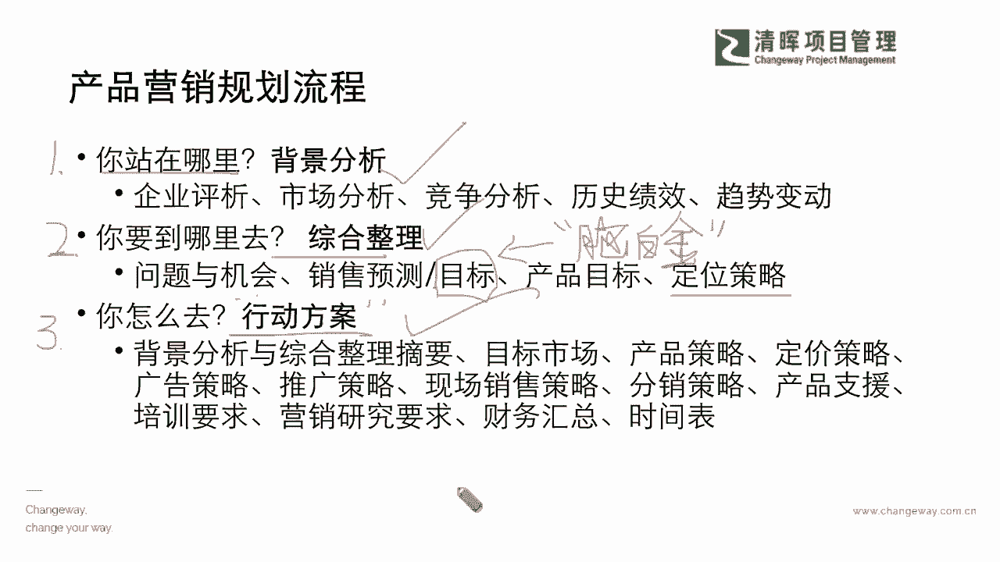
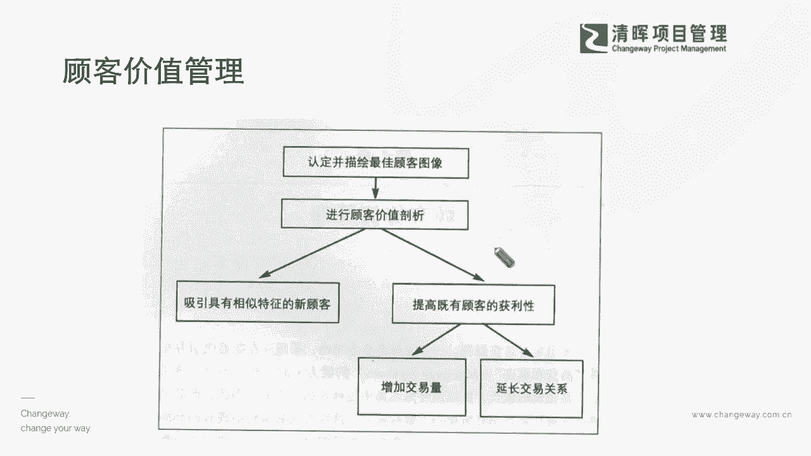

# 产品经理所需的知识和技能 - P6：6.产品营销规划流程 - 清晖Amy - BV1w1421k7wt

我们来看看啊，我们有几个重点，我想还是给大家稍微拎一下，因为刚才提到了三个重要的文档，但是我们其实在讲，虽然讲起来文档很容易，但是我们在进行产品营销规划的时候，落地的时候其实哪有那么容易啊是吧。

你需要去分析的，你需要有的这种意识是非常非常多的，你比如说我们举个例子啊，咱们在接近尾声的时候，咱们在最后半个小时也跟大家在掰扯，一些这种可能有用的细节，但如果今天我们想要去规划一个产品，到底卖不卖。

做他能不能活得久一点，能不能去赢得更大的市场，能不能规模化，你其实要先搞清楚你在哪里，你站在哪里，也就是说今天非常重要的一点，你永远不可能通过去研发出来，一款是市面上已经有太多人在用的。

或者已经变成这种红海的一些这种产品，就是大家太多人在竞争啊，然后这样子的一个过程当中呢，我们其实就会发现，你根本没有办法去在这样的一个更加，这种密集呃，我们讲劳动密集型是吧，这种行业当中去赚取这个利润。

因为劳动密集型它最主要的一个点，就是通过不断降低人力成本是吧，但实际上你这个你就永远是通过降价，通过价钱，这不是一个长期的这么一个行为是吧，所以你要先搞清楚你现在是站在哪里。

就像我们我再举一个这个不恰当的例子啊，就说说白一点，你得先去看看你现在你企业几岁了，你现在这个产品是处于什么样的一个阶段，你想做一个什么样的产品，你自己的定位在哪，你的体检出来。

你能够承担的那些这个可能进行一些这种产品，投资也好，研发也好，你能够承担的那些点你的痛点，市场需求，你你可能有十个需求，你其实只能集中你所有的资源去解决，那么最痛的那么一个是吧。

也就是说这个背景分析你站在哪，这是非常重要的，第一步一定要去做，这个是要结合企业的战略和你产品的战略，同步来做的，也许我为什么把这两者要分开讲，也许有一些公司你的企业战略和产品战略。

它就是可能背道而驰的，这也是他为什么他有一些是什么故意性的，因为它可能会需要去区分市场，区分它未来发展的一个战略，和它现行战略的一个点，所以大家不要被迷惑啊，很多的这种东西它一定是人家能去做到。

提前去所有的东西部署好，就是一定是预则立，不预则废，不是做做看再去调整的，不是这样子的，是一定要提前把战略的东西去想清楚，你自己到底处于什么样，你就好好先把你的小学生，把你的这种群体服务好。

那如果你是更好的一种，这种整个的一些市场占有，那你应该怎么样去开发出来，更好的一些这种需求，你自己的站位，你想吃掉多少的市场，那其实这些都是要通过很多的分析来去达成的。

那么第二个就是你到底想想达成什么样的目的，你的目标在哪儿，有很多，比如说我看到我的市场有十个亿，我到底是要去做十个亿当中的1亿呢，还是我只能抢到十个亿当中的5000万呢，还是我十个亿都想要。

那这个就是它的一个目标，设定目标不同，你的投入的资源，你的战略产品战略也是不同的，就像我们今天非常，鲜明的一个例子啊，我们举一个大家可能之前还有所有所记忆的，我们有一个广告，大家还听到这个叫脑白金吗。

还记得吗，就是这个洗脑式的一个广告是吧，脑白金天天在那，这个我们讲这个央视最佳黄金时间段，天天给你唱是吧，那就是让你记住，甚至我们电视机很多地方，其实网络还不见得那么发达，但是电视网络很多家庭。

也许在我们现在一线城市，我们很多家庭已经不看电视了是吧，但是还是大部分的电视的普及率，在我们东西部还是非常非常高的，所以很多的一些二三线城市家庭，非常非常看电视，非常去看这些东西。

所以可能在里面看到的这个广告，这种洗脑式的广告，投入了很大的一个资金，去占用黄金的一些时间段，它其实是什么，他不是傻啦，他不是说这个一个亿的广告费，他不知道贵，而是他的目标就是什么，全国占有率。

它的市场占有率要达到多少，他需要去找寻一个最，稳妥最快速的一个渠道能去达成这个部分，所以在这个部分之上呢，我们就能够看到，其实它是有非常明确的目标的，如果你今天仅仅是一个地区性的目标。

大家有没有发现我们有很多的一些超市啊，很多的一些这种本地化的一些这种商业机构啊，他其实只要做好他自己的一个，什么本地化就行了，他并没有想去占有股这种这种全国的市场，它就不会去把资金，把资源。

把产品营销花在这些方面是吧，能理解吗，所以其实你你你想要去实现多少的市场，你的目标是什么，就决定了你怎么定位，你要投入多少，你怎么去做你的过程是吧，这是很重要的，那么第三点呢就是你的行动方案。

就像我们今天讲这句话怎么理解啊，就你怎么去，那我们中国人最智慧的一点就是什么，逮着耗子就是好猫是吧，我们不太去什么关注我们到底什么样的方式，甚至我们早期野蛮式成长的时候，只要能卖出去钱，只要能去赚到钱。

这个产品只要能够这个推向市场是成功的，我们不惜采用这种什么降价格战略，但是现在越来越随着市场机制的一个完善，和大家这种销售群体的一个成熟，你会发现什么，你反而太便宜的一些这种东西别人不敢买了，是不是啊。

啥意思，人家也会知道一份价钱一份货，那你在这样的一个过程当中，你要怎么去实现它行动方案，比如说我们就举一个例子，你像现在的新一代的苹果手机啊，我们暂且不去讲，我们的苹果手机价格有没有完全降下来啊。

也没有是吧，也挺贵的是吧，那我们看到也许你会发现华为他也没有很便宜，所以他没有打这个价格战是吧，但是为什么他还会有非常清晰的这么一个这个，客户群体的一个区分，大家都能够去啊有这样的一个市场的份额。

甚至可能在某一些战略上，各自都在发挥着自己的这个全全能的一些领域，像我们有很多这个苹果，就会投资很多的一些这种资源，在做什么呢，再去打造这个打造一些故事是吧，比如说苹果会有很多的这种小故事短片来讲的。

苹果怎么去通过这样的一个手机拍摄出来，一个温暖人心的一个这种小短片，讲故事就是在在你的身边，很多是高于价值的东西，它在帮你实现，它在帮你发现生活之美是吧，所有这些利益，这是他在讲故事，那华为在干什么呢。

华为会发现我们在搞情怀是吧，当然可能老早是讲情怀，但是后来发现其实华为手机还不错，挺好用的，各个功能也都一点也不落后是吧，其实我们就会发现，他一定是从各个行动方案切入点上。

他去做他的一个这种competition，做这样的一个竞争，以及他怎么样去成功变成一个这种人人都接受，人人都能去这个认可的这么一个部分，那实际上在这个啊过过程当中呢，我们怎么样能够把这样的一个啊部分。

把它很好地涉及到这个，那么我们可以看到在这样的一个过程当中呢，我们怎么样能够让大家一步一步的，把这个落实到根本上是吧，所以在这个过程当中呢。

啊我暂且先把咱们的这个最终的顾客价值。

因为我们所有的钱都要从我们的stakeholder，口袋里面去掏出来是吧，所以可能我们在这个当中，我们是一定需要去掌握完整的这样的一个价值，和，Stakeholder。

价值链和干系人管理的这个链条的一个基准点，我们才能更好的去实现在这个环节之上，我们每一步的一个这么一个加持是吧。

