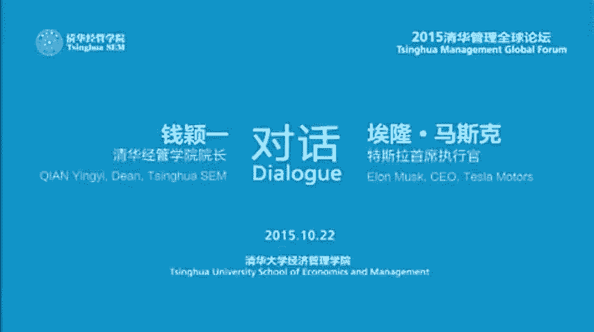
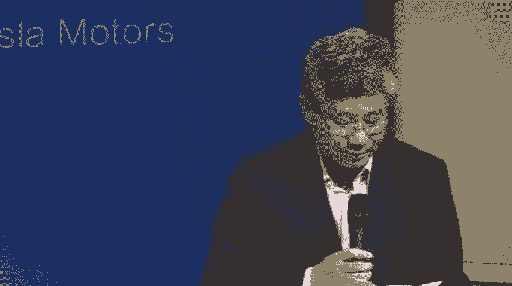

# 人物志：埃隆马斯克 - P1：1_1_马斯克：自学优于正规学习 大量阅读+敢于实践 钱颖一对话_【人物志】埃隆马斯克（全6集） - 清晖Amy - BV1S1421r76x

Good evening， ladies and gentlemen。 Welcome to the 2015 Tinhua Management Global Forum。

 My name is joined by As dean of Tinghua SM。 I will be your master of ceremony tonight。

Please allow me to introduce the guest speakers for this evening。Mr。 Elon Musk。The CEO。

It's very popular。The CEO and product Arch of Tesla Nottors。

 the CEO and Chief designer of Space explorationation Technologies， SpaceX。

And the chairman of Solar City。Prior to these three companies， Ellen co founded PayPal。

 the world's leading internet payment system， and served as its chairman and CEO before PayPal。

 Ellen co founded Zip2， a provider of Internet software to the media industry。

Eian has a physics degree from the University of Pennsylvania and a business degree from W。

Our second distinguished speaker is Professor Qian Yingyi。

 Dean of Tinghua University School of Economics and Management。

Ding Qian graduated from Tsinghua University in mathematics。

 he received his PhD in economiccons from Harvard University。

Ding Qian was on the faculty of Stanford University， the University of Maryland。

 and the University of California， Berkeley。He was appointed as the dean of the School of Economics and Management at Tinhua in October 2006。

Please give a warm welcome to both speakers as we invite them on stage to take their seats。

Guests from Qinghua's faculty。Professor朱帮峰。Department of Physics。

An academic mission of the Chinese Academy of Sciences， Professor Oyang Minggao。

 Department of Automotive Engineering。And Professor Zheng Rog。

 chairman of the Department of Electronic Engineering。

They are all senior faculty members in their respective departments and experts in their respective research areas。

They will join the conversation this evening， welcome。

Now I would like to turn over to Ding Qian to kick off this forum，ingian。Thank you， Choungen。

 for the introduction and welcome to 2015 Tsinhua Management Global Forum。

Each year in connection with our advisory board meeting， which will take place tomorrow。

 we organize this global forum and feature each year， we feature one board member。

 Last year was Tim Cook of Apple。 And this year， we are very。

 very honored to have Yellon Musk to join us tonight。😊，I feel very honor。

 honored and humbled to be with you tonight。 By the way， all of the audience here。

 except some people from the media， all the students from Tinghua。

 Most of them from not from the School of Econs and Management。

 They are from science engineeringering from Tinhua X lab， Tinhua accelerator all these places。

 So most of them are science engineering majors。 They are the lucky ones because we have very limited seats available So they are very lucky to have to secure seat here。

 They are all your admire。 You can see that the students are very enthusiastic。

 very keen to listen to your insights and stories and with them to share your insights with them tonight。

😊，We also broadcast this through CCTV in this building。 There are several some other classrooms。

 So for those people could not get into this this auditorium now。Since we are in a university。

 most audience students I would like to start my question from your college experiences。

 so I know that you moved from your home country， South Africa to Canada to attend Queenncy University for two years and then you transferred to University of Pennsylvania and both in both places you started as a business major。

 but then you added another major of physics。So。I think all these students are interested to know that what the most important things you learned from college。

😡，From in economics， in business。And in physics， how this college learning experience。

Effect your later career。 So tell us about your college experience。

 So it wasn't really my college education was really super well planned out。 It was。

In fact I wasn't sure whether I wanted to go to college at all in the beginning。

 you are not even think about going to college at the beginning， I wasn't sure whether should on。So。

🎼I。Notぱカ。Notpa cottage。诶。But originally I wanted to get to to America because it seemed like a lot of cutting edge technology was moved1 myself without parents without really an explicit plan of going to college I where that was your intuition basically at the time every I read North America so has been North America。

I like fix。As soon as I got near when I was 17 I went to Canada against my wishes actually me。

You're fled away from home basically from your the technology。

I could' have convinced my friends to move， so then I just move myself， okay。Before818， you did that。

And I is before the Internet or anything。So I wrote I had some distant film in Canada。

 I wrote letters to them but I didn't get any letters back so well I had like a great uncle in Montreal and when I read Montreal。

 my mom finally got the letter back that said he was in Minnesota for the summer。

 so then I was just like。So I just stated like a student hospital and board a bus taken across Canada anyway。

😊，So then I worked for several months in various computer related roles mostly in Toronto。And。

 and then I decided that I wanted to go to college because otherwise， I would have a。

So because everybody was like much older than I was at the companies than I was working at。

 so it seemed like。ThatI would be missing out on an important social experience。

So that was really the deciding factor。Why did you choose business to major at Queens Well。

 I actually was considering two possibilities。 One was to study computer engineering at University of Waterloo and the other one was to go to Queens and。

And I went to Waterloo。I saw there were not many girls there， not many girls there。

So that seems like okay， that might not be so much fun So then yeah， so then I went to Queens。

 which I meet my wife there， so that worked out Okay， good。😊，And I did a broad range of subjects。

 so commerce and engineering and math and so it was kind of a broad range of subjects and then somebody that had been at Queens went to they transferred to U Penn Wharton。

And。they gave it a very good report。 And I thought， well， I'll apply to go there and。

But I didn't have any money。In order to go there， I needed to get a scholarship。

 so I thought I would not get a scholarship。And then they did give me a scholarship gave you a scholarship。

 you you been so you went so then I that。And。Now I finished the business courses in a year。 and then。

 but you have a minimum。I see。 So then I thought， well， I like physics。

 so I'll just study physics for the second year and。And then I thought， well。

I could either go to Wall Street or。Go more into kind of a science and engineering thing and said I'd rather do science and engineering so I stayed an extra year and finish with the physics degree and then went to Stanford with the idea of working on advanced capacitists for use in electric vehicles and there was some fundamental physics involved。

 so it was kind of a combined physics and material science sort of program。

Dropped out and started the company after how many days you drop out。 Yeah， like three days。

 three days。two or three days I went on deferment technically okay， yeah。

 you still still can go back。😀Yeah。So you said you started business and then studied physics。

 you found physics。Then business and all economics， or。ten in physics and。And just in general。

 in science。What of trying to understand the nature of reality。 You know， what's it all about。

 What's the meaning of life， what。What questions should we ask about the nature of the universe？

You know， that's that was really my main motivation。Sa he Vi， I was worried that if。W and。

 and then I'd， and then I'd have to work with someone who had a business degree and。

But then if they knew special things that I didn't know， then I would have a disadvantage。

 So basically， just want。鬼去 with the off。Future bosses。 That's the。 Yeah， just like。

I was mostly afraid of having a boss that。ok。So then you can become your own boss。

 so you can avoid that。Problem， right， right， exactly。

 So So you mentioned in many occasions that physics about physics。Talk about。

First principles of physics。Big。Complic things and alright so tell us。

Give us some examples why the principles principles are physics so important。

To shape your life or your way of thinking here。又或的。Physics is essentially。

 I think about the best framework for understanding new things that are counterintuitive。

 counter counterintuitive， yeah。s it's very counterintuitive。

 It doesn't seem as though should work that way， but it does。

 and it's experimentally verified to extremely high precision and so the way that physics is able to make progress in in these counterintuitive fields is by boiling things down。

Fundamental truths and reasoning up from there。I think this is a very important approach to really the only approach that could work when you're trying to get into something new。

Patory， because normally the way we get through life is we think by analogy， So we。

We basically do whatever else is doing with minor variations。

That's that's that provides a mental shortcut。 So that sort of。

The amount of thinking that's required to do that is not much， and that's fine for everyday life。

By first principles， because it's just too computer intensive in trying to understand new things。

 this is extremely important。By making a point that if you really want to be original。

You have to think in terms of first principles， everything go back to the fundamentals。 Yeah。

 that will be creative。We are doing minor variations of the using analogy， basically。 Well。

 you don't know what's really true or what's really possible if if you reason by analogy。

And they can sound very compelling。 But analogy is really just a story。 It's just a story。

 It's just a story。 And they said they can be very appealing seductive stories。

 but it's really just a story。Okay， I think that's very， very inspiring common。

 But here we accustomed to the analysis that。Because that it' a shortcut， basic， it's a short。

 It's a shortcut so。otherwise get okay in order to survive order to be creative original have principles right So key think physics professor you maybe。

You have a microphone there， yes。Quantum mechanics。 So that's out of my field。

 So So I'm very pleased。都都都黑。You like physics in particular from the principle， first principle。

 I want to know what's your opinion about the。Science education in high school。嗯。The Chinaa嗯。

It is we know that physics and science is important for the technology innovation。But the非得。

Is a very tough course for students。Nowdays， China education experts think the。

Where the America students。Study very easy and enjoy life。

 but the Chinese students have a very heavy workload so。

The education administrator want to reduce the working order of China high school students。对骗人。

To reduce the physics。What do you think， Well， I mean。

 I think I'm going to be relatively pro physics。 You are。I think the， I mean。

 the biggest issue is that physics is not。 the the way the physics is is is a series of rot formulas。

 Remember this formula， this， you know， in this formula and this formula and。

TheThe fundamental meaning is not conveyed like what do these things。

 what do these formulas represent in reality， It's incredible that that they can be a formula that actually describes reality。

 That's amazing。Indeed， the wonder and awe of physics is not conveyed in classrooms。

And it's very important also to teach to the problem and not to the tools you can imagine like if you say we want to understand how an internal combustion engine works。

 the best way to do that is to say， okay now let's take it apart and look at and pieces and then put it back together again and then what tools would we need for this。

 okay， we need a screwdriver we need a wrench， we need maybe a winch and on these variouss and then as you take the engine apart and you put it back together you understand the reason for these tools but if on the other hand you had a course on screwdrivers。

 a course on wrenches。That would be a terrible way to do it。

 and it's difficult to remember and the way that our mind has evolved is to remember things that are relevant。

And so unless you establish relevancy， it is very painful and difficult to remember things because they seem abstract and unimportant。

 so you have to establish the relevancy and importance and establish the why of things in order for the knowledge to naturally stay in your brain。

So physics is important but should be taught differently not just remember all the formulas but have to attack the problems。

 what' are the fundamental problems Yeah so I think that's very very interesting you want people to you know the amazement in awe and feel incredible and feel like a story you know not just a bunch of formulas that seem meaningless。

Very good。 So that's something that。Here at Xinhua。

 that's very relevant to our teaching of physics here， so。Now， I am a to。Now， now I have。

 I brought a。This is a table， MIT technology review。50 smartest companies。wy1 fifteen。

There are 50 smartest companies in the world now。Kesla Motors。

 So City and Spacex occupies three places。Of this table， number one， number 9 and number 22。

Is't that amazing。I think for me or anyone here， if you have one company to be listed here。

 you will be very proud of。 you have all three。😊，And Tesla is also on the first place。

 So that's quite incredible。😊，So my question is， I know that these are the three companies you have been working with since 2001。

 So before that， you created two other companies， zip2 with your brother and X do com later becomes Paypal。

 That's very important detail。 So my question is before we get into each of these cases is that in the early 2000 when you sold the other company you started these graduate these three In addition to the capital you gained。

 of course， you invest in this。 What other lessons you learn from your 1990s experiences you work as a founder of those ventures for your later the next 15 years know in these three very different industries。

 aerospace， automobile and clean energy。 apparently， seems to be。

 there's no connection between the two the first。Two companies are all Internet companies。

So can you share with us some of your。Thoughoughts at the time and your just by it' just accident or that's by chance。

 No， Well， not really。 I mean， I mean。When I was in university。

 I thought I would like to be involved in things that。

woWould have a positive effect on the future and some things that would have a significant effect and the five areas that I thought were that way were the internet。

诶。Sustainable energy， making life all planetary， genetics and AI。

And the last two I was sort you know thought those would be kind of a double edge sword A artificial intelligence and okay biology。

 so these two you have not got into intelligently I've gotten into them。

And I didn't think I'd actually be involved in all of them。

 but it turned out at least for the first three that that I have been。

 but it was really more from the standpoint of I wanted to be involved in things that I thought would have a big effect on the future as opposed to creating a company to create a company in fact。

 in the beginning I actually tried to get a job at Netscape so it wasn't from the standpoint of trying to start a company but in 95 Netscape was like the only Internet company really and I sent in my resume but I didn't get a reply you didn't get a reply from MavK so helped you a lot and I tried I tried hanging out in the lobby but I was too shy to talk to anybody。

嗯。And so then I thought， okay， if I don't start a company， then I don't know what else to do。

 but it wasn't， yeah， and that's why I created my first company。Okay， basically。

 when you don't find a job or interview， that's a good opportunity for you to start your own company。

 that's the number one learned all these students you have to follow I mean。

 it's mostly the optimization I was trying to I just wanted to to do useful things to be maximally useful。

 That's really the main thing。 Well， I think all these people here that they want to do useful things but think about that take an example of space X。

This is the area traditionally， we would think it is exclusive for government to do it。

 It's very high hurdle from a technological point of view， from financial point of view。

 from regulation point of view。Many people， I guess they want to get into this area。

 but they feel just impossible， about what made you think you could do it。

 And you started this in 2001， right？2002 2002， but yeah。

 I can tell you the origin of SpaceX was really not from the standpoint of trying to create a company。

In 2001 I was showing to a friend of mine and I was just wondering why we had not gone to Mars because if we had gone to the moon in 1969。

 then surely by now we should be very close to getting to Mars okay that's your original question why now we got into Mars Yes I so I thought well I'll go on the NASA website to find out when we're going to Mars okay and they went on the website and they couldn't find it and then I learned that that actually that had now been taken off of the NASA goals at that time。

So I thought what I would do is try to do a philanthropic mission to send a small greenhouse to the surface of Mars because the public responds to precedentnce and super polls。

 and this would be the furthest that lives's ever traveled。

 the first life on Mars as far we know and you have this great chart of green plants on a red background and I thought that this would perhaps get the public excited enough to increase NASA's budget so that we could kind of resume the dream of Apollo。

That was actually the origin and actually I went to Russia three times try to buy some used ICBMs to send the mission to Mars and I did negotiate a deal。

 but but I came conclusion that I was actually my premise was incorrect I actually thought that the reason that we' had not gone to Mars was because of a lack of will but in fact I think the will is there。

 but people must believe that there's a way， if people think that there's no chance of it being successful。

 then they will give up so I decided that I had to try to start a company to reduce the cost of access to space to improve rocket technology because it had been essentially in stasis since the '60s there's no fundamental improvement that's occurred in fact arguably it' it's gotten worse on a cost for unit mass to over basis。

So， that was the basis for starting。SpaceX， but at the beginning of SpaceX。

 I thought maybe there was a 10% chance of success， 10% chance， maybe at most。So the take。

 you took the risk。Yeah，It seemed like if there was not something。

 if something wasn't done to improve the。rocketet technology， then we would never get there。

 So Russian did not sell the rocket to you or you thought it's too expensive or so we wanted to develop your own。

 Well， the they actually， I did， did come to terms with the Russians， but。

But then the only reason that the rockets were were lower cost was because of arms reduction tos。

 So they were essentially scrap rockets。 So even if one could use those rockets。

 but once you run out of the。scrap rockets because on reduction talks。

 then you'd be back up at the high or high prices again。

 So that most the short term possibility it would not result in a long term benefit。

 It would certainly not result in the establishment of a self-sustaining city of Mars。

 which is really I think the goal that we should have in the space program。

 Okay now you have the will now you did some initial work。

 you contact Russians and you thought there there's no progress made in the last few decades。

 So there's a possibility。 but then rockety science very hard science。

 So you are not only a chief executive officer， but also chief technology officer。

 So your college degrees from business and physics。

 You didn't you only spend three days in a PhD program。

 So my guess is that not guess I'm pretty sure you self taughtaught。 You learned all these。

Hard science， engineering， computer programming， physics and all others by yourself。 engineering。

 How did you do that， Tell us the student that you can do that without going through the form programs。

 Basically， I'm sure you can learn much faster than the programs。 You can do。

 You can learn faster than formal programs。 Tell us that share some secrets with us。

 read that books read a lot of books。 read lot of books and talk to lot people。😊。

You can become rocket scientists by reading books without， well and experimenting， of course。I mean。

 experiments and books， you need to， you know， because sometimes the things in the books are not correct。

Yeah。O。But that's basically how it works， I mean， you can learn things very quickly。

If you just read the books， I mean， information is all there。

You pick out the books you learn and become an expert in this hard science engineering area。

 you could do that Yeah， I mean at the risk of something like a robot。

 your data rate in reading books is much faster than in a lecture。

 you can read information far faster than you can hear it。So then it's much faster to read。 Well。

 I'm a little bit worried。 we'll be out of the job now。 if that's the case。 But Professor Zhu。

 that we teach many physics courses here， right， for physics majors。

 you probably have some questions here that about what courses。Yeah。

 I think junior students can self study physics。嗯。But anyway。

 the fix is based on experiments and in particular for the engineering。

 hard technology is also should。ToTo do some experiments， even to do some machine in the factory。嗯。

HowHow can you get to such a rare experience。嗯。From self study。

And I have another question about well， what kind of physics course do we like most？嗯。

Which fixed cost do you think a motor helpful for your？For your company。

 for your career for thinking， for your so wonderful companies。

 Sure actually justky the fundamentals of physics is that's what's most helpful the very framework of how to think about physics is by far the most helpful and to sort of understand how did the first scientists learn anything and how did they change the way that they learn things。

 how did they change their framework of analysis over time as they learn that one mode was better than another。

This is extremely helpful to know so honestly it's like physics 101 is like the if people really pay attention physics 101。

 that's the most valuable and then I mean I thought quantum mechanics was really interesting too。嗯。

It's just it's amazing that quantum mechanics is true，'s still hard to believe， really。

So I'm thinking that to put quantum mechanics as a required course for School of Es and management students in the future。

So it's a hard have it's a hard one。Which part is hard iss mathematics part or principles part or which part is hard for you quantum。

 It's counterintuitive。 It's extremely counterintuitive， so。

That you can't just use the way that you normally would think about the way that reality works。

 which you can in many other areas。So because you just don't have your intuition is not a good guide that makes quantum mechanics quite difficult。

 it also combines quite a lot of advanced math and statistics at the same time。

 so actually if you're very good at statistics， then quantum mechanics that would really help。Yeah。

Okay， idea statistics。 Yeah， so and statistics is quite hard too。 you like statistics。

 absolutelyutely， statistics is very interesting。 I think everyone want you know statistics， too。

 Everybody should know Yeah， very important。Because otherwise you can get tricked too easily by these things as you know。

 there's that famous saying， I'm not sure who it was a maybe Church or somebody said there are lies。

 there are damn lies， and then there are statistics。 That's right。 There are three types of eyes。

Yeah。Did Church say that I maybe I'm certain。Isra is yeah， I know that。 This was British guy。

Very good。 So now， so we have So it's been 13 years since you started SpaceX。😊。

I know your aspiration is to send human to Mars。And with reusable rockets。

Reduce the cost by effect of 10。 I think also with the effect of 100。Ultimately， back of 100， okay。

Now， I remember you said in 2011 that at the time you said in 10 to 20 years。

 you could put man of human on Mars。Now we are 2015， so that will actually happen。

If your prediction is correct， will be 2020 or 2030。It's not that far away from now。

 Are you still optimistic， I think about 10 years in 10 years， roughly， roughly by you。 Yeah， that's。

Well， I mean， there'll be others， not just me， but we have a very talented team at the company。

You know， 5000 people that's basic。 So yeah， it's not it won't be easy， right。

 Reusable Rock is because nots a stopped space shuttle。It's very expensive thing。

 So I'm not expert on that， but I guess it's not that easy。

 So why you are so confident that you could do this。Well， I mean， at this point。

 I feel quite confident in at least achieving boostage reusability because we've been able to land the boost stage twice in the ocean and we've been able to at least hit the ship twice。

On the second time， it took several seconds for the rocket to explode。

 so we're making progress I think。I am highly optimistic that in the next 12 months or so that we will be able to land the boost stage safely and re it and that one is I think highly likely。

 highly likely 90% plus okay， what's the probability in 10 years that I will see？A person on more。

What's the probability I' give the 10 years， I make that the sort of 50% likely。

It sort of depends on what happens with the world。You but if one would extrapolate current trends for SpaceX I think 2025 is around。

 you know approximately correct， 2025 10 years from now。

 so that's yeah approximately so I think the fact that usability is important this is an example of where first principles analysis makes sense because if you were to look to look at say by analogy and say。

 well let's look at prior efforts to achieve reusability such as the space shuttle or the Russian Boron program and say。

 well those attempts at ususability did not result in any improvement in the cost of space flightlight。

 in fact， they increase the cost of space flightlight so the shuttle on a。

shuthutle budget was about $4 billion a year and there were typically four flights per year so obviously the cost was roughly  a billion a year and this was much more than an expendable rocket of equivalent failure capability so then people would look at this and say well based on that it would be that reusability increases the cost it does not decrease it。

 however that this is not true if you look at it from a first principal standpoint because if you look at say what is the cost of the propellant used if you use a low cost propellant such as refined jet fuel and in case of our rocket the propellant cost is approximately $300。

000 per flight but the rocket cost 60 million。So。That's a pretty huge difference you know you've got the cost of propellant essentially half a percent of the cost of the rocket。

It's comparable to that of a large jet， essentially。And so obviously， if you can achieve reusability。

 you can start to approach the cost per flight， of the cost of flight would asymptically approach the cost per balance。

You're factoring in maintenance and other issues， and so if something similar to aircraft occurred with rockets。

 then you might have the cost of maintenance of Earth be roughly equivalent to the of cost of fuel as it is with airlines。

 which would mean say a $600，00 cost of a flight。Over time。

Which would therefore be a2 of magnitude reduction。

So this is really a good example for show that I think in terms of first principles。

 radically different from think using analogy， right using analogy was not find。

Anything possible but from the first principle Abute and the same can be said of even building the rocket a reasonable building rocket whether expendable or reusable to say what should a rocket cost one could look at what rockets have cost historically and say well。

 that's what rockets will cost or you could say what other material constituents of the rocket if you were to say what is the weight of aluminum titanium in canal。

Carbon fiber and other elements and if you had them sort of arranged in a pile in raw materials on the room and had a magic wand and can rearrange the elements into the shape that you want。

 that would describe the minimum possible cost of any given physical object and so then the trick is how you get them in the shape effectively。

And if you do that， you can see that with the actual cost of raw materials in a rocket。

 again expendable or reusable is quite small， it's only a few percent of the price so then the trick is how do you rearrange those raw materials into the shape you want efficiently？

Well， the lesson is again， go back to the first principle。

 everything goes back to the fundamental assumptions。I know that your dream。

 your aspiration is to send human to Mars， but your dream is to build a city on Mars。 Is that true。

Well， if you think of it sort of broadly， the history of human civilization will fundamentally bipaca along two directions。

 either we will become a multiplant civilization， be out there exploring the stars or we will be a one planet civilization until of some eventual extinction event。

 whether self inflicted or natural。And， you know， I think the。

These sort of former is the better way to go。In order for that to be the case。

 we have to establish a self sustain civilization on some planet。

 Mars is really the only realistic possibility。And。And so I think we should try to do that。

 and this is the first time in the  four and a half billionaire history of Earth that has been possible for some life form to extend life as we know it beyond Earth。

That window may be open for a long time or maybe be open for a short time。

The prudent thing would be to assume that it's open for a short time and take action while we can。

Very good。 So that's really our dream。Yeah， I mean。

 I think one outs dreams in the sort of context of existential threat minimization， I think it is。

Something we should aspire to from the first principle of physics， you think that's also possible。

 Yeah， absolutely。Very good。So。Now， your name is very closely associated with the Tesla。Motors。

 because Tesla is a public company。 Space is not。 And also。

 Tesla make cars that's for consumer market。 So it's very natural that people know you through the Tesla cars now。

I know that there are many car makers that making electric cars。You have a Nissan leave， You have a。

G M Chevalier B。 You have Ford focus。 I mentioned these three because the three Cs of these companies are my advisory board。

 But none of them here today。 I will be there tomorrow。 So there are a lot of competition here。

 Everybody knows that EB or electric cars is the way to go Now， I know that you are different。

 You are not from Detroit， your Tesla is located in the Silicon Valley and it's very different type of company。

 different type of philosophy and ceter。 So what make you think that you are you have the advantage over those traditional car manufacturers or some potential entrance from other Silicon Valley companies I don't want to name but there are many there。

 So tell us about your idea about the Tesla cars。 And Well sure much basic。

 I thought the chances of success of Tesla in the beginning werere extremely low。I mean。

 the history of car company startups in the United States or probably elsewhere too is not a very good one。

 there's a large graveyard filled with attempted car company startups and in fact in the history of the US the automotive industry thus far only Tesla and Ford have not gone bankrupt。

Onlyly Tesland for。 Yeah， everyone else is like you study the history of that。 Yeah， it will， yeah。

Yeah， so the probability assigned at the beginning。

 the success of the survival test was even smaller than SpaceX about the system par tiny， 10% yeah。

Yeah， not knowing anything else and I wouldn't say that that assessment was particularly off because we came very close to dying many times for both Tesla and SpaceX I mean before SpaceX the first three launches didn't work and I only budgeted for a maximum of three flights and fortunate we scraped together a fourth flight and the fourth flight did work but if that fourth flight hadn't worked it would have been there would have been it。

And。And then for Tesla。Many times we came close to bankruptcy and you know all the way to。

TheThe financing round at the end of 2008， we closed the financing round on the last hour of the last day that it was possible。

 which was Christmas Eve 2008。 And if we hadn't close that we would have gone bankrupt a few days after Christmas So I think the you know the。

Weve really， very， very narrowly survived。Now today I think both companies are in a much stronger position。

Tsla's got the Model S and now the Model X coming out。SpaceX has。

Contracts with a large number of companies， in fact。

 most of our launch contracts are actually commercial， a lot of people think it's mostly announced。

 but it's actually mostly commercial launching communications and broadcast satellites。

And so we made it through some quite difficult times， but I think the probability of success was low。

 so I do think there was some good fortune in our survival。

Whether you are lucky or I think there's something else there。I think， I think it's。

I think we're at least partly like yes。Pular， at least part like yes， Okay， and model S and model X。

 theyre all quite expensive and luxury cars。 So people want to have a great and affordable cars your future model 3。

 I guess， right， will be。 So there will be a many this type of cars because that will be the defining moment to decide which company will win the market。

 I that no， that's the wrong way to think many winners。 Yeah， the car industry is very big and。😊。

Almost 100 million new cars and trucks built every year。

There's 2 billion caution trucks in the fleet and the most market share that any one car company has is 10% so I think there's certainly room for many winners in the electric vehicle space and there will be so I think it's really。

You know， it's not a one company takes all or anything like that。

 I think it's really's a it's not a natural it's not an industry where there's a natural monopoly。

 This is it's sort of naturally quite a competitive industry and。Yeah。

 and I think all cars will really all transport with the ironic exception of rockets。

 will go fully electric。 I think this is very obvious。 Everything goes to electric。 everything。

 airplane， everything said rockets。Except rocket。 Yeah， it's difficult to overcome you。

 So there's still room to do electric rocket for the future No， no， you are so sure。 no here。

And you need to react a mass so unless you you know because once you're in vacuum。

 there's nothing to push against， so unless you shoot something at the end， it's not going to work。

ok。Now let's talk about more about cars。😡，Your concept of car is a bit different ideal from others。

 You consider them as pets。 somewhere everywhere。 may be wrong。

 I mean of you have to take care of that。 you have for example， you're doing many things。

 For example， this thing of it's called Ota。 over their air。 you can upgrade software。

 you don't have to go to garage。 This is a different kind of experience。

 this is something that just think over the updates are kind of normal。

 That's what people come to expect in consumer electronics devices。

 if you have a phone that didn't do over their updates， It would be pretty strange。

 So we're really just doing the things that would be considered normal for phones or laptops and applying them to a car。

 electric car is basically just a laptop on wheels。 It's laptop on wheels。

 So this is your concept of cars。 It electric cars。So it maybe seems unusual for the car industry。

 but it's quite normal for consumer electronics， and so we're just doing the things that we're just doing the normal thing really。

You think this is a very natural Yeah， normal Yeah， this remind me of cell phones。 you know。

 cell phone a concept cell phone used to be you make phone calls。

 Now everybody has this smartphone has many， many functions there， help you locate and do many。

 many things， but making phone calls just a tiny part of that。 So the cars in the future will be。

You know， very different concept from the cars today， it's not just a moving vehicle。Well。

 I think where things they can go is to full autonomy electric。

Fol autopilot is that called autonomous cars or driver what's the name for that I think the autonomy grows grows by grow in steps we released autopilot version1。

 which is a sort of semi autonomous capability for the car and this will get。

Better rapidly over time。My guess is that within three years or less， there'll be cars that。

that production cars that you could buy that are fully autonomous pending only regulatory approval Okay。

 there's no technological problem there it's just a regulatory problem there yes。

You think the day will come if you will think further ahead。

 that it will be illegal for human to drive a car。Is that possible？

I mean I don't want it to be illegal， I think that some jurisdictions may decide that it's unsafe for people to drive cars and theyafter。

 but this is not something， I mean， I'm in favor of people being able to drive their cars。

But it's possible that some jurisdictions may make it illegal to drive a car because it's too dangerous Okay。

 there are some jurisdictions on earth。Would make illegal for human to drive car because it's too dangerous。

 I mean， it might。Okay statistically speaking， this will be true for sure。But now。

 the regulator face the problem that without a driver that consider to be too dangerous， right。

 right now。 So you are really thinking that。In an opposite way Well， yeah， I mean。

 at the point in which an autonomous system is demonstrably statistically safer than a human driver。

 the question will be。Should you allow this or not。

 but this will be up to various communities to decide whether something that's more dangerous than a person driving。

 or if it's more dangerous for a person to drive should this or should it not be illegal some will probably make it legal okay so this is a legal and regulatory issues but not the technological issue with at all。

Correct， correct technologically this will be no problem in three years， no problem。

We have an expert here on electric cars， Professor O Yang。

 he is a professor senior professor from our automotive engineering department。

 so Tsinhua has a Department of Auto engineering， so he is an expert on electric cars I would like to mention something happened in China。

 the EV output volume。呃，It's。Apply150000 this year in Chinas number one the world15000 cars made in China year the number one in the world'ss awesome know。

You know， so we also have the high speed electrified railway okay and also a large amount of e bike。

 Yeah，200 me。 Yeah， something like that。So what are your value？

Under the role of China in the global transportation electrifications， and also。

What role will tla motortors play。In the EV development in China and what the special plan do we have to serve the middle income Chinese customer。

Sure， well I think it's very impressive that China has such a high number of electric vehicles being built。

 I think that's great， and I was also really impressed to read about the CO2 cap and trade plans for China so I think this is great that Chinese becoming a world leader or is a world leader in sustainable energy both on the production and consumption side。

 so I think that's a really really cool thing。From a Tesla standpoint we're doing our best to help others in the industry so we've taken our patents and we've made our patents open source or just freely available so any company can use our patents at no cost so I think that hopefully that is helpful they don't even have to tell us that they're using it so hopefully that is being helpful to some companies in China and then of course as we create new cars。

 then those can be case examples of what's possible with an electric car and part of the reason for example we try to achieve very high performance numbers like very high zero to100 kilometer acceleration is to show that an electric car can be a really fun high performance car and it doesn't have to be slow。

And。So we were trying to make electric cars cooler than gasoline cars。

 I think this is very important。嗯。But yeah， I think it's very exciting what's happening in China on the electric vehicle fronts。

 and I think what the government is doing to encourage electric vehicles is great。

So I think a very promising future， I think。Yeah， I think the most difficult。

 difficult things is to balance the long range。And cost。

What do you have a special things Tesna can do in this aspect。Yeah。

 I think without third generation car， Model3， that will be half the price of the Model S。You know。

 long term， we also expect to do local production in China。

 which will help quite a lot because we currently have to pay quite high import duties。

 which increases the cost of the car to consumers in China。 So we are。

In the long term with local production， they wouldn't have the import duties and the car would be at much higher volume and it's designed to be an affordable car so effectively it would be maybe a third of what the current car costs in China。

 only one third of the it would be sort of one half but then factoring in local production。

 it would be one third one third something like that so that will be truly affordable car long range as well had a long range。

So there's no technological difficulties there。 or you think you solve that already or you are still on a way to do it。

 Well， were about two years away from， you are two years away from that。Yeah， yeah。 Same as you。

 I do feel confident about the better technology and the E's future。However。

 the market share currently is below1% right now worldwide have everywhere1%1% below 1% below one1%。

So what's your prediction。But the future in five years，10 years。And。How do you think how long。

The electric vehicle can replace conventional cars。 and what。

You makes what make you believe your conclusion is reasonable。Sure， so about five years ago。

 I met with a friend that 20 years from then， so 15 years from now。

 a majority of all new cars produced would be electric。

So 15 years from now I'm highly confident that more than half of all new cars produced will be electric 2030 by 2030。

 more than 50% of new cars produced electric it will still take a long time to change out the fleet because the new car production capacity is about 100 million and the fleet is 2 billion because you know the average age of a car before it's sort of scrapped is about 20 years。

So even at the point when it's more than 50% of new cars produced our electric。

 it will still take a long time for the fleet to electric costs but I feel very confident that in making that prediction do you think China will have an even bigger share in comparison to other countries。

 I think probably China will have the biggest share。Because。Well。

 because China is in terms of industrial capacity， China will have the biggest industrial capacity in general for everything。

 well everything， almost everything， almost I mean in every industry。

certainly in terms of macro macro industrial output。

 no question China will have the most actually agree agree with you So in order electric car war。

 in addition to car itself， you need a battery and electric charging infrastructure you need a network you need a huge infrastructure here China as this reputation that they can China build infrastructure very quickly and at a massive scale if you think that this is also the area that China could actually leap forrog to other advanced countries because first this infrastructure requires a lot of investment。

 but investment is needed to increase China's growth rate for example。

 and the government has some ability to do that with resources so what do you think of compared China。

 infrastructure investment in China and in US or Europe or other developed countries my guess is China will be。

And then lead in this area。Certainly I mean， it's possible that some some some of the smaller countries may be ahead。

 but of any large country it's very likely that China will be in the lead in this front。

 which small country is that Well， you know there's you know small like like Norway is really Norway okay but Norway is great。

 I love Norway， they're really there or some leaders in electric always leader in electrification on a percentage basis on percentage basis。

Among large countries China， China for sure， Yeah， for sure， yeah。Very good。

 So that's also good for growth。 I'm economist。 So we are looking for places that make a， you know。

Usethful investment， not wasteful investment So like this is the area charging infrastructure all this I also think it's actually going to be easier than people realize because electrification is is already quite widespread I mean it's rare that someplace doesn't have electricity so and most electric car charging will occur at home and then some at the office and and then for long distance so I think a lot of times people think well you have to have charging stations all over the place like you have gasoline stations。

 but this is not true you only to really have charging at home at the office and then for long distance purposes but with the exception of certain municipalities where if you have street parking you need some way to charge a car for street parking but this is on a total population basis。

 this is a small percentage of the population but certainly in places like like Beijing or Shanghai。

 you would need to have some sort of that's where where government。

Help is important because people they need someplace to charge their car， essentially。

Wherever their car spends the night or the day， that's where the charging needs to be。

 but it doesn't need to be at like supermarkets and convenience stores and that kind of thing that's not necessary。

 people will end up charging their car where they charge their phone。

I think youre quite right in terms of a rational analysis in terms of a physics。

 but there is a psychology a psychological problem here right， people's anxiety。

 people thought they need a lot of charging stations。

 otherwise they are afraid this is the anxiety there， theres a psychological problem。😊。

overcome yeah think I think it's really just a psychological problem the reality is if you have an electric car you will have no problem if you have a long range electric car so you need to have at least you know sort of on the four or 500 kilometer range if you have that level of range then charging is never a problem so you're saying that the main problem is psychological problem it's just yeah exactly so it's people getting used to the idea。

So we need to have a psychology course here again。Very good。

 So now I want to move to another company You help create that solarlo city。😊，Is a clean energy。

s in one of the three areas you want to make a difference。 Now， actually。

 the Chinese have been very enthusiastic in this area。 perhaps over enthusiastic to such extent。

 we have in the last couple of years， several big companies actually running into the problems。

 You probably know that some famous Chinese photovoltic generation know energy generation companies that went bankrupt。

 So in your case， the solar city， what's your secret of the success。

 avoiding these missteps or the traps。 So was the business model or the technology or what。😊，Well。

 I mean it should be said that China is the largest producer of photovoltaics today。

 so although there have been some prominent bankruptcies。

 nonetheless China is the leading producer of photovoltaics and I think that's a pretty that's a pretty great thing well with a lot of government subsidies and yes a I know the huge production but the economically or financial yeah I mean the subsidy question is interesting one because I mean general as a general and sincere as an economist。

 I think you probably agree that generally government intervention in the economy is usually not the best idea but I think the reason for that is that is is you don't want to increase the error in the economy so prices prices are just information and if a government action causes the information error to increase that will generally result in a negative impact on the economy。

I mean， I think at a meta level， the government should really be thinking is how do they reduce the information error and the prices in the economy？

And like I said， usually subsidies increase the error that don't decrease the error， however。

 in the case of sustainable energy， I think anything that places a price on carbon。

is reducing the error in the economy， so to the degree that one believes that the CO2 capacity of the ocean's atmosphere is public good that has being consumed at zero cost。

 anything that causes that cost to be above zero is reducing the pricing error in the economy。Now。

 generally taxing CO2 is not a popular thing， so therefore what the government tries to do is to subsidize low carbon activity。

 so photovoltaics and electric vehicles and that kind of thing。

So this is not as good as pricing CO2 of course， pricing CO2 would be the best thing。

 but that's really what's occurring that is to try to even the subsidies on clean energy or on electric vehicles it's an attempt to correct the pricing error of CO2 producing entities。

 another way to think of it is there is a huge subsidy on anything that's CO to producing that is not being paid。

Now I can see you did study Econ 101。 So basically you make this argument。 right fan of 101。

 You are of Econ 11。 You found it as useful physics 101。

 you think theyre equally equal physics1 great subjects。What levels of economics。

 everyone should understand that。Yeah， I've been teaching Econ 101 Xinghua for the last 12 years。

 I lovecon 11 good very good。 So now back to the question that what's your secret to make this solar company very successful。

 avoiding the many pitfalls of other other similar companies business model or in the case of So city。

If you looked at the， the fully installed cost of solar power。

 it became apparent that the non panel portion of the cost was really dominating。

So essentially the cost of designing a solar installation for a rooftop and getting the solar panels there and installing it and doing the wiring。

 connecting the inverter and the permitting。And the maintenance and all these things。

 which were largely unglamorous。And not sort of part to that their technologies in and of themselves。

 but they are actually technologies。Essentially the balance of system costs were dominating the fully installed cost of solar power。

 and so that was really where entrepreneurial energy was needed and so I was。

Able to convince two of my cousins who are very capable entrepreneurs to start a company in solar。

 to address this non essentially the non sellll portion of of the constant installed solar。

 So you identified the problem and asked your two cousins to do it。What were their background。

 they are engineers or their work。One's engineering and one's sort of more on the kind of sales and overall leadership leadership but they're both very very good guys and they'd actually created a company that I had nothing to do with called Everdream that was developed to do large scale management of computers and computing devices so if you're somebody like say FedEx and you've got 60。

000 computers around the world， how do you manage all those computers so they software for managing huge numbers of computing devices from a central location which actually works out well for managing then millions of solar rooftops from a central location and so they're able to do that in the case of that I thought there was a higher probability of success than Solar City or than Tesla or SpaceXX I thought that was a good chance of success in that situation and they've done an amazing job。

For Solar City， I just show up at the board meetings to hear the good news， that's my contribution。

You are chairman of the board。 Yeah， and you are a large shareholder， yeah。So you gave advice。

 basically， your cousin doing the work。 Yeah， just some advice here and there。

But it's really the credit is OM。Okay， it's a publicly listed company also。 this is。

 we have also expert from W E。 The E engineering。 Now， Tsinhua has a very。

 very good double E department。 Our founding de， Zhu Rongji。 You' are going to meet tomorrow。

 He graduated from this department。 They， they do a lot of energy related issues。

 So I will invite him to。Okay， ask questions。 Thank you。

 And I got to know that solar City will build two solar planes for Apple in Sichuan provinces， yeah。

And I， I know。 And it's a good news for you， I think。In China。

 we plans to install about 5600 GBW in the next 15 years for solar。So what I want to know is is。

Could you give us your vision about the future and world。And what do you want to do most？

In your energy， plan your energy dream。 Okay， thank you。Sure， well， I think the I mean。

 what I hope Solo City does is accelerate the advent of solar power。

And does this become some really just an economic question。

 the lower the sort of the expected cost of energy from solar。

 the faster it will be adopted and I think there's good progress being made every year。

Although it is hampered by the fact that CO2 producing power is effectively not paying its not not paying its way。

 They're not， They're not paying for the CO2 capacity of the。Oceans and atmosphere。

 but despite that impediment， I think solar power is making progress and will continue to grow every year。

I'll be not as fast as it should grow， but it'll continue grow every year。嗯。Yeah。

 so I'm not sure if I'm answering a question quite， but。Yeah。

 I just wanted to know what's the all vision about the Andrew energy system or infrastructure or even the male wall。

 like what percentage do I think will be yes yeah yes I think in the long term a majority probably a supermar of all energy production will be photovoltaics essentially we have a giant fusion reactor in the sky called the Sun。

 and it's very handy so and I think people don't quite realize just how much energy reaches the earth from the sun。

 it's one gigawatt per square kilometer。iss that that's the solar incidence on Earth。

 so in fact if you took most nuclear plants and you took the clear area around a nuclear plant。

 which is usually quite significant and youd just put solar panels on that clear area。

 you would usually generate more energy from the solar panels than you would for the nuclear plant。

Okay， and I just have another question。I think you people Space X and Ni Tela are very different。

Is there anything common in common among these three things？Which three Paypal Pay， Tesla。

 Tesla and speech， anything common， Yeah， anything other than it's all done by him， right。

 other than this factor， What things in common。I think there are commonalities between any sort of new technology development there is think new technology is developed in a similar way。

 so I mean PayPal is really a software company， a software technology company。And。Obviously。

 Tesla is a sort of car and energy storage technology company。SpaceX is a rocket technology company。

 and the way in which one say organizes engineers to achieve a particular outcome in technology development is the same。

 I think， in any arena。诶。Okay， thank you。 Yeah， so I want to follow up on that pass that to ask some question。

 general question， not specific to So City or SpaceX or Tesla。

 because I think there are because you raised the issue there might be some common things there。

 you mentioned earlier that you actually face SpaceX and Tesla faced very。

 very difficult times almost died in particularly in 2008 before the Christmas。NASA gave you a call。

And then the you， the Tesla got the， in the last moment。

 got the finance all happened before the Christmas Eve at the Christmas Eve， right， So this is。

 you know， for anybody， thats is's a huge pressure。😊，A real danger there。

How did you survive this and you thinking you have a conviction or you think you are lucky or think in your DNA。

 you fight to the last minute for all these things。

 So what's your personal experience during those very difficult times。

 I think that share that with students， maybe help them when they face difficulties or encountering encounter those difficult times。

 Well you do just。Well， I think it's a very difficult thing to create a company， honestly。

 I'm not sure I would recommend it。I mean， generally the way that things go with creating a company is that in the beginning that they seem quite optimistic。

 You know， this sort of this initial。Period of of optimism and possibility。

 And that might last for six months， maybe as much as a year。 And。

 and then then there's usually several years of extreme pain followed by failure。 That's。

 that's normal That's normal。 That' normal。😔，That's normal。 So then how to deal with that。

 how to go through that。Yeah， I mean I think should only do it if you think that there's a really compelling。

Reason to do it， What's the compelling reason？I think it varies by individual。And in my case。

 it was just， I thought it wast important to make progress with electric cars and space technology。

And I mean my initial thought was which SpaceX and Tesla and Solar City to a lesser extent was that。

I would take half the money that I made from PayPal and then if I lost half the money。

 that would be fine because I would still have you still have the other the other half。

 it's no problem。But this is not how it works。 You know， and I mean。

 I think you're putting more than a half in the end。

 I think I think this is true for a lot of people。 But for me。

 it was like the company becomes like a child。 Okay， The company is a child。 Yeah， and so then。

How do you say that your child should not have food？They should have food， right？So， okay。

Think your company as a child， then。That's good at analogy。 Yeah， this is our force principles。

 This is an analogy。It's a good analogy， right？So this is a takeaway right from this。

 so this gives you the strong will to。😊，To do things。 plus， you feel you are lucky。I think so， yeah。

 there's a close call， it's a close call， it's a close call， yes indeed。Now。

 I know that you read a lot。 You， you just mentioned that you， you are self taught， space technology。

 energy， many， many at the computer program， many other things。 Now。

 I like to know that what do you read other than technology。Both。

What do you like most in science fictions， philosophy， religion， history， or even biography。

Can you share with us that what do you like most in those non technological books。

I think books on history are really interesting， history， history， interesting， history， biographies。

 I mean， there's a lot to be learned from the lessons of history。

Some examples of there's a lot of examples， yes。And I think just in general。

 to read about interesting people through history and the difficulties they faced and how they overcame them。

 this is， I think， really compelling。And。And I think just reading in general is great。You know。

Amazing people like Sha， Shakespeare。It's one of my favorites， one of my favorite sixs。

 I been white hockey， of course。But there's just a lot of amazing things。A big kind of Ben Franklin。

 Ben Franklin， big inventor， Yeah， among other things， among other things， and you know。

 he did the right thing at the right time。You get right thing at the right time。

 So you're also thinking you are doing the right thing at the right time。 That's another analogy。

Yeah， I thought he was great。I mean certainly you know， all these people you know， Newton， Einstein。

 Darwin， Darwin is a great writer， Darwin， Darwin's a very writer， but great writer， great writer。

 yeah。So we believe in his evolutionary theory， yeah it sort of seems likely be true It seems to be true So you like science fiction too。

 right Yeah I do I think the thing about science fiction is that it's free from the normal constraints。

 Yes whereas you know books that are。That are sort of set in the known context or the normal context。

 they can be interesting to read， but they're within a confined framework。

A limited set of the degrees of freedom are limited， whereas in science fiction。

 there are many more degrees of freedom。嗯。I mean， recently I was reading the books by Ian Banks。

 the cultureul series， that's amazing。That's a really super gut。

 butmm a big fan of Asimov and Heinland。You know， obviously Clark and those guys。

 I think there's a lot of amazing books in science fiction。

 a lot of really interesting ideas so you've got inspiration from it or you've got some ideas from it because it's free of many constraints that we used to write exactly yeah yeah I must have I mean I think I certainly got inspired by a lot of the science fiction books。

You know， the。I mean， then that they they， they sort of。Really have this incredible imagination。

 I mean， it's sort of， if you can you imagine going out and。you know。

 exploring the stars that would be an amazing thing and so I think we want to be on a path to making sure that those books are not always fiction like one day we want them to be true so give you an inspiration right for that Have you heard a science fiction book of China。

 the most famous wise call three body？Have you heard that？ No， I read it probably。

 It was translated into English。 Okay， I recently got some huge prize。

 So this is the best known China's science fiction。😊，Things called three body， okay。

I'll get' got a copy of that。And do you think you are more an engineer or more an entrepreneur？Well。

 I suppose probably if I'm give those the two choices， I'd say probably more an engineer。Yeah。

 I'd just like to。I mean， I think I'd just like to try to be useful。I try to be。A usefulness。

You try to be useful。 You try to be useful。 Yeah， exactly。

 And sometimes that usefulness means that one has to do something entrepreneurial。

 Sometimes it's an engineering thing。You know， it's just。Yeah。Yeah。

 usefulness because you already answered my next question。

 My question is what kind of person you want to be Basically， you are saying you want to be useful。

Yeah， is that the so what？So。😊，What kind of person you want other people think you are。

I suppose the same thing， same thing。 People think you are useful。 Yes， that the matter is engineer。

 that the matter is an entrepreneur and try to be useful。😊，Yeah， exactly。

 So this is the legacy you want to leave that all you have not thought about。

 I think that's a good general optimization。 I think this's generally， you know。

 if if someone did something and that was useful， that was productive， You know。

 helped fellow human beings。 then thats that's a good outcome。 So so far。You are in the early 40s。

 so you are pretty satisfied with what you have done so far that I mean seems to so far so good。

 you know so far so good。You want to go to Mars in your lifetime Yeah I mean I like I mean whether I go to Mars or not is you know I'd like to go to Mars。

 but that's neither here nor there， I mean hopefully that the technologies that SpaceX develops can enable large numbers of people to go to Mars and hopefully makes good progress towards helping humanity become a space sparing civilization。

Okay， before the meeting had a discussion with Professor Zhu。

 he has a counterfactual question for you。So you are very， very successful。

But if time could be reversed。嗯嗯。哈嗯。Could you re design and rechoose your career， your life。

 your education and the max most perfect。Well， what's your advice to the students of Qinhua。

There are a lot of people who are taking you as an example。嗯 what's your advice to that？Sure， well。

 I think it's a good idea to study a broad range of subjects。You know， a lot of。

Innovation comes through crossization from one area to another because increasingly as our knowledge base grows。

 we've become quite sort of siloed in our knowledge so you'll have someone who's very specialized in one area or another area and then they but if you can combine these specialties and create something that's greater than the sum of the parts there's a lot of opportunity for innovation by doing that。

 so that's why I encourage people to to study a broad range of subjects and to study if somebody's in engineering to study study economics。

 to study literature and to study many different fields。I mean。

 I'd encourage someone to do like the 101 of almost everything。

 you know anything that they find intrinsically interesting and to think how they might combine things from one discipline to another。

 I think this is a great way to come up with new ideas。

This is what we have been doing here at the School of Economic Management。

 we call general Education and also at the university。

 also Tsinhua is also moving know put more emphasis on general education rather than。

To early specialization all this type of thing so we think that's something that's very important Yeah I I think having a good general knowledge is very important and then even one specialization because if somebody specializes in say two areas where you can achieve a combination of the two yeah that's where I think great opportunity exists to that yeah so in addition to this general knowledge but also you know that this year in particular that the Chinese very enthusiastic about entrepreneurship startups many is Tinhua students here。

Want to build China's Tesla， Solo City， Paypal， etc cetera。

 So what advice you can give to these students I that a good thing to start a company in college or during the graduate studies or what are the important characteristics。

For being entrepreneurial， even without starting up your own company。Sure。

 so what are the general advice you can give to these？The younger generation。Well。

 I think if you identify something that some need in society or some want。And， and then。

That's really and a good way is if you can see that this is something that you would really want or you know。

 your friends would really want it， and then you need to sort of find like minded people。

 grouping together and then try to solve that want or need。that's really it。

And the best time to do it is when you're in college or just outside of just finished with college because your obligations are low。

 you know， you don't have a family to support or， you know at times when your obligations are low。

 this is when you should take the most amount of risk。

So it's a personal decision because we know there are famous entrepreneurs。

 some of them drop out college after one semester， you know who I'm talking about。

 there are some who drop out after two years。And you drop out of a PhD program in three days。

 But you finish， you， you finish college with double degrees。I did。

 although I did have an external reason for that， which is that if I didn't I would have to leave the US because I didn't have a green card。

 so I had to stay yeah， I had to stay in university although they would kick me out oh there is。

Fing reason for that。😊，So then you， you got your green card because you are there， yeah。

And I think also for the PhD program the value that I saw there was that Stanford had all these great labs that I could just use for free and that would be。

 you know for developing electric car technology that would be very helpful。

 You did use Stanford lab're going youre going to that's a good idea actually say on campus to use for free labs。

 Yeah absolutely that's a very， very great have resources。 they have yes， indeed。

 the university has a lot of resources underut So we should have this interesting。

 very interesting now。We have very limited time， but now I still want the students to ask them questions。

 So now the floor is is open to for student but we will give priority to students。

 So please identify yourself first where which where youre from and make your question very short and concise。

 only one question， not two or three questions。 Okay， now we have here's my question。

 Can I take selfie with you Okay， probably not another question。

 Well I read about a lot ofs written by team urbanr。

 talk about a lot and there's one article I read about okay about the AI some days later。

 we will reach the AI。 probably by the by 2060。 and you want to send people to because you want to have a backup of human beings。

So。When the AI reached a God point， it doesn't matter whether we have a backup or not because either we're going to go extincted or we're going to be eternal。

 so what's the point for you to move people to Mars when you know that we are going to reach the God point。

 that's my question， thank you。😡，Well， I think making life multiplanetary or life as we know multiplanetary extends the probable lifespan of civilization。

 or life as we know it substantially， because certainly we would be protected against a natural disaster such as an asteroid collision or super volcano or some sort of shifting of internal shifting growth magnetic field。

 I mean there's a bunch of potential life life extinguishing things that can occur as has occurred many times in the fossil record。

 so just for that alone， I think that。It's worthwhile to become multiplanetary and then there's also the self-extinguishment of possibility。

 I mean I certainly hope there isn't a World War III but there could be one and if there is a World War III in the future it may be quite devastating given the power of technology today and so then it would be good for us to be a multiplant civilization at that point。

And then but I think the defensive reasons for becoming multi planetetary are not as compelling to me as the exciting inspiring reasons。

 I mean I just think that if we were to create a city on Mars it would be a very exciting adventure。

 I think the most exciting adventure that I could possibly imagine。

 it would be very inspiring and I think even for people that don't go， it would be very inspiring。

 just as the Apollo program was inspiring for the whole world。

 even though only a handful of people went。嗯。In a sense， we all went to the moon。

And and it's important that there be things that are inspiring and exciting， I mean。

 if life is just about solving one miserable problem after another， why it live at all？

Wd lived the all。Wow， very profound answer question here。 So let's have a question in this side。

 we just have this。That that one。Good evening， Mr。 Musk， firstly。

 it's so exciting for us to meet you here in our school。

 You are really the hero of the Chinese boys who are interested in business and technology just like me and。

😊，Also， I think the dream lover of the girls， I guess。What's our question？Sorry。

 I'm a member of the accelerator。 I graduate from Tinghua I C M， and there are my people here。

 We are all running our own companies。 My question is， as we know。

 the innovation from zero to one is becoming more and more important for our economy as the genius in this part。

 Could you give us the young entrepreneurs some suggestions。

 how we can to break up the traditional mindset and find the new continent in business。 Thank you。

 sort advice on sort of how to your company succeed and I that whats good general entrepreneurial advice。

What what's what's a question idea？Give us some suggestion in。

 in generation for in innovation for the startup company， sorry。

Okay sure well I mean I think I've touched on a few of those areas already which should be it's good to cost totalize different domains so if you look at say what's being done in one domain and see what what part of that is perhaps transferable to another domain if you combine them that can be quite helpful so like for example with。

With rockets and cars， the auto industry is very good at producing large complex mechanical objects at low cost。

 it's remarkable how little at car costs given its complexity and so applying those manufacturing techniques to rocketry is very helpful and going the other direction。

 the rockets are very good the rocket industry has become extremely good at mass optimization。

 making things very， very light。Because if you don't make them light， you can't reach over it。

 so then taking those advanced design techniques while making things very light to cars can then help with making a lighter car。

 which in turn allows the car to have greater range。

So that's sort of an example of cross hospitalization and also we talked a lot about kind of first principles analysis of really boiling things down to what seemed to be the most fundamental truths in a particular industry and then reasoning very carefully up from there to reach conclusions。

And then I think it's always good to solicit as much negative feedback as possible。

And particularly from France， like your friends used if there's something that's not quite right with your product or company。

 your friends probably know， but they're not telling you。

 so you have to coax it out of them and for people that care about you they will tell you if you really want to know and they feel you won't be heard by the answer it doesn't mean they're always right。

 but you should try to get as much critical feedback as possible and。I mean。

 I don't you always take the approach that whatever you're doing is some degree wrong and you want to minimize the degree to which it is wrong。

So he is from this is called X eerator。 We our school created two entrepreneurship platform。

 One is called Xla。 and that is called accelerator。 So we like letter X。

 I know you like letter X very much。 You started from X dot com。 and you have a space X。

 you have a model X。 you are even a trustee of X prize foundation。 the triple X situation Well。

 I try to find the reason why you also like the letter X。 is's triple X， just for that。 No。

 So whats what's the reason why you like letter X。 I mean。

 I guess it's underreciated letter is' underappreciated letter。 students no。😊。

X is always in math equations， That's right， it's true， it's also x exactly x it's always x equals。

 you know， y yeah yes， so it's underappreciative level， X is the horizontal axis。

 Yeah X is also on the horizontal。😊，I dont know I have a question from this side， yes， please。Yes。

 please， yes。Some possibility in the future， your company will pay。More attention to the Oh。

 okayir freshmen and pay more attention into to the biology。 maybe the truth of the life。

 maybe the present place we are living。 I mean， the Mar is in the future。

 maybe the earth in the nowaday。Will will company will pay more attention。To earth。Sure。

 thank you I mean I think Tesla and yes almost here that's yeah yeah。

 it's intended to help solve the accelerate progress towards sustainable energy。

YouI think hopefully they will yeah accelerate the advent of sustainable energy。

 So I think sustainable energy is the single biggest problem that we have to solve the century。Yeah。

 sooner the better。I have a question in the back。 Anyone in the back， yes。

So I last saw you speak three years ago in my native London and back then Teslas SpaceX。

 Paypal had already been created since then you've given the world Hyperloop。

What I want to know is when you think you're first see that implemented and what are you working on that's going to stun the world in the next three years。

 what's the next big thing I a look when I see you in three years time what's it going to be Sure？

I mean， Hy I just basically wrote the paper and published it and just made it freely available because I'm pretty strong out between SpaceX and Tesla so it was sort of impossible for me to do something in addition to that but there are a couple of companies that are attempting to commercialize the Hyop idea and I'm hopeful that one or more of them will be successful and then。

And then SpaceX is to sponsoring a student competition for the Hyperloop to see who can design the best pod。

 so we're creating a little one and a half kilometer long test track near our headquarters in LA。

 and then we're sponsoring et cetera。An annual competition for pod technology。

 so I think that' should really be quite fun。And in terms of future things， I mean。

 I think there's a lot of potential out there for companies in genetics and possibly at the human brain so the brain machine interface I think。

Things that have been considered science fiction in the past， there's a lot of potential there。嗯。

I think as much like the electrification of all forms of transport except for rockets。

 so doing electric jet， electric ships， like these are opportunities。

 I'm actually a big fan of tunnels， that's sort of also something that's underappreciated。

You know I think we really need to have transport go 3D and you can either go 3D up or 3D down if you go 3D up with flying cars you've got a lot of challenges with noise and potentially things falling on people's heads but tunnels and you also have weather constraints within any aircraft but with tunnels you can go just as 3D with junk with tunnels and you don't have any weather constraints。

You know with no noise。And so I really think there's a big opportunity with tunnels。

 The Hyloop is the idea that you propose that。From LA to San Francisco。

 600 kilometers of 400 miles in 35 minutes。So I know you are， you are， you are living in L A。

 but you often very often travel to San Francisco Bay Area for Tesla business。

 So you think that how many years will see this such a one marvelous。Tme in 35 minutes。

It's half the distance from Beijing to Shanghai。Sure。600 km in 35 minutes。 Is that technologically。

 financially or feasible。 You don't have time to do it。But you can ask someone else to do it。 Yeah。

 no， I think it's， it's it's definitely feasible。I mean。

 the paper that I published has all the math behind it and multiple outside entities have gone through and confirmed that it is correct。

 so I think it was initially met with some skepticism， but then。So far， I've already said that， yeah。

 it is certainly doable， I mean， I think it is。definitely doable there's a question of maybe the economics。

 but I think the economics would be lower cost than high speed rail because the cost of the tube per mile would be significantly less。

Because it's basically just a tube。What's the probability we're going to see this in 10 years or 20 years？

I think there's a high probability of us seeing the Hylo implemented on at least some route in the next five to  ten0 years。

 quite quite high in the next five to ten0 years， yeah， yeah。

 it's mostly about those getting the right of away in the approvals as opposed to the fundamental technology。

Yeah。I think it's actually it's really technologically pretty straightforward straightforward。

 I pretty straightforward， I think。😊，Economically， financially， it's not clear。

 I actually think actually， economics were pretty obvious， too。 It's just a tube。 Just a tube。

 It's a tube。And a pod with an air compress on the front and air bearings on the airb skis。

I mean like it's very， very straightforward， very straightforward。

 yeah you just don't have time to do it。No， y'all。I encourage other people to do that？Yeah。

 absolutely。And I think it be quite exciting。 Not quite exciting。

 I think it be quite exciting see See it happen。 we have a last question。 Yes， this one So actually。

 I came here tonight by taking one of your first batch of Tesla in China。 actually。

 one of the eights。 So actually， we have a similar business model like a solarlar city in China。

 but not know by the whole the house the roof of the house， but by the small factories。

 because we have already hundred of thousand customers for cooperation So they have the you know。

 many， many roofs but in China， we don't have so many houses。

 So if have the chance to contact one of your colleagues。

 So maybe we can discuss a potential opportunity to coerate to promote your ideas in China。 Okay。

 thank you。😊，Sorry。Is that comment or is that that question do you have any plan to promote your solar city model in China。

Well， in case of solar City， I mean I pretty much leave it up to those guys to decide when you know what they want to do on an international basis。

 I certainly have encouraged them to expand internationally。

 but theyve they've kind of had their hands full just operating in the US and now recently they' have expanded to Mexico and know maybe in a year or two they'll be able to expand to China and other places and maybe find partners to work with so your。

Okay， I'll give a last chance to a female student Elon。

 we really like you and my question is youre just a superhe just like monkey King in the journey to the West in my heart my question is like for example Chinese novel a super hero my question is like space Xs is such a wild dream。

 the kind of human welfare in the long term but like the modern financial system might chase the short term reward or they will like put a lot of their opinions on entrepreneurs。

 so how will you deal with like the wild great dream that might not bring the short term rewards with like the modern financial system because one last sentence because like Nicholas Tela I just know him because。

😊，the car but on when he was living like the JP Morgan decided to stop financing to Nicho Tesla to finish his great plan。

 And that was so such a pity for human being。 So how do you think about finance entrepreneur Te。

JK Morgan stopped financed for him。But but you become very rich first and then you can bear the risk and of course you can finance yourself but entrepreneurs like with I mean I think something like cars or rockets kind I call that sort of phase two entrepreneurship because because as you point out that there is a significant capital requirement for something like rockets or cars。

 so it's probably not the best place to start out if somebody you's starting out as an entrepreneur and doesn't have a lot of capital and the only capital you have is what's in your head right and so that's why doing something and say software is a great initial thing to do because software you don't have to build anything you don't have capital equipment or factories or anything yeah so it's the best way to start out I think as an entrepreneur and then。

To required some capital then doing things that are capital intensive is an option。

 but it's usually quite a difficult thing to start out with a good advice phase one。

 phase two to software first to make some money and then to the phase two to realize your dream real dream Okay so that's a very。

 very good advice to faces entrepreneur Thank you thank you。👏We have to stop。 We can go on forever。

 but we have to stop。 Thank you so much for sharing with us your stories and the inspiring advice for our students。

 really appreciate。 Well， thanks for。 That was a great question。 So thanks for having me。

 It's a pleasure being here。😊，Thank you so much。😊，So now you're the member of advisor board。

 so come here often。All right， thanks to please stay。

 thanks to Ding Qn and Elon for this wonderful conversation for this wonderful dialogue。

 the School of Economics and Management has prepared a souvenir for you and now let's invite Ding Chen to present this well。

 this is a Mars it's a model of Mars。😊，But it says Tinhua Management Universal For。 Okay。

 we' are going to hold not a global forum， but universal forum on Mars。 So I'm sitting there。 Also。

 you are sitting there with Tela cars nearby。 Solar City in front。

 and Sprse X in the back and Tinhua S E M also on the side。 So this is for you。

 It's made by 3D printer。😊，This is our dream to hold this forum on Mars。 Okay， that would be cool。

 Okay， very good。 And El has also prepared a gift foring Chan and the School of Economic Managementment。

 Model S from studio。 Thank you。 this is your signature Okay。😊，Thank you。Okay。

 take Pi Romney up pass。rightThank you so much。 Okay， it's not the end yet。

 Now I would like to invite Professor to Professor Oyang and Professor Chen to come on stage and have a group photo。

 Yes， please， please， Thank you so much。 Also， thank you。😊。

