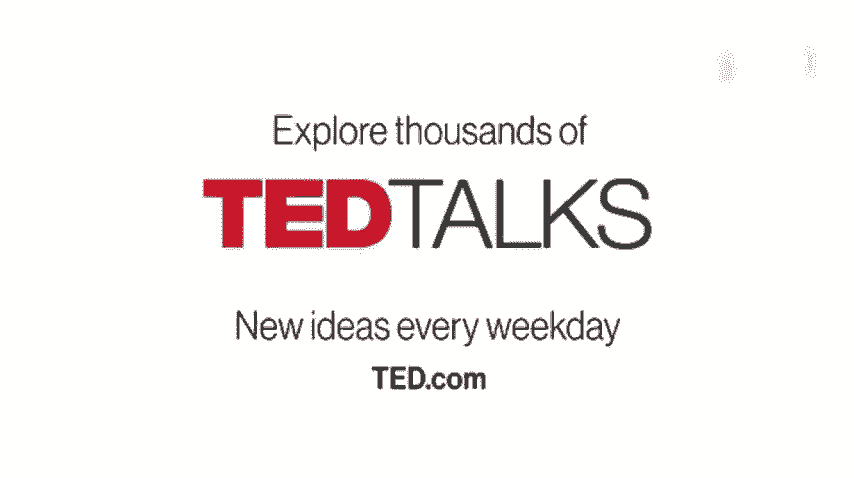
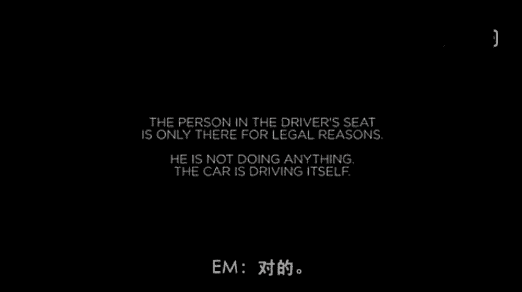
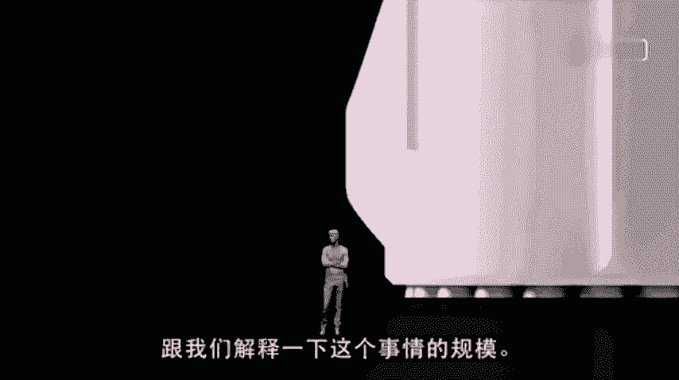
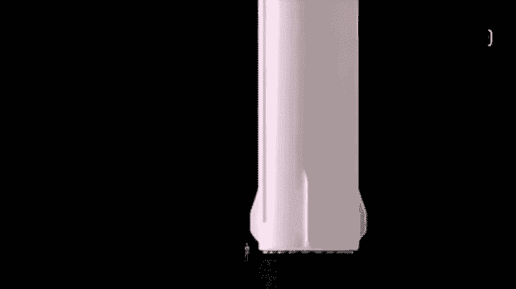
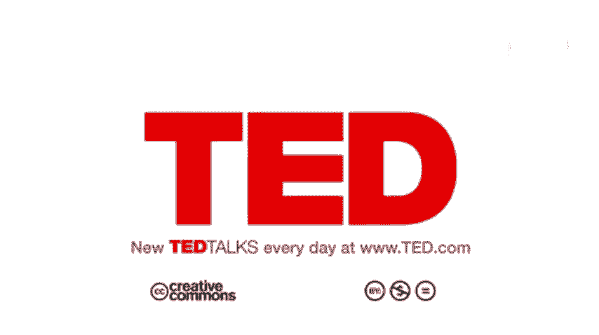

# 人物志：埃隆马斯克 - P2：1_2_马斯克：我们创造的未来 TED演讲_【人物志】埃隆马斯克（全6集） - 清晖Amy - BV1S1421r76x

Yeah。

You know。Hey， welcome back to Ted， it's great to have you here。 nice time。

So in the next half hour or so， we're going to spend some time。

Exploring your vision for what an exciting future might look like。

 which I guess makes the first question a little ironic。😊，Why are you boring？Yeah。

 I asked myself that frequently。😊，The we'， we're trying to dig a hole under L。And this is to create。

The beginning of what will hopefully be a 3D network of tunnels。To alleviate congestion。 So， I mean。

 right now， I think one of the most soul destroying things is traffic。

It affectfs people in every part of the world。 it takes away so much of your life。 and it's horrible。

It's particularly horrible in LA。And。So I think youve you've brought with you the first visualization that's been shown to this。

 coming， Can I show this。 Yeah， absolutely。 So this is the first time。 Yeah。

 we just to sort of show what we're talking about。 So that a couple of key things that are important in having。

😊，A 3D tunnel network。 First of all， you have to be able to integrate the entrance and exit of the tunnel seamlessly into the fabric of a city。

 So by having a an elevator， of sort of a car skate that's on on an elevator。

You can integrate the entrance and exits to the tunnel network just by using two parking spaces。

And then the car gets on a skate， there's no speed limit here。

 so we're designing this to be able to operate at 200 kilometers an hour。

 about  200 kilometers an hour or about 130 miles per hour。

So you should be able to get from， say， Westwood to AliX in six minutes， five， six minutes。呵。

So possibly initially done， it's like on a sort of toll road type basis。 Yeah。

 which I guess alleviate some traffic from the surface streets as well。

 So I think people notice in the video， but there's no real limit to how many levels of of tunnel you can have。

 you can go much further deep than you can go up。 The deepest mines are much deeper than the tallest buildingss are tall。

 So you can alleviate any arbitrary level of open congestion。😊，With with a 3D tunnel network。

 this is a very important point。 So a key bundle to the tunnels is that if you add one layer of tunnels。

 then that will simply alleviate conventionalional get used up and。

And then you'll be back where you started back with congestion。

 But you can go to any arbitrary number of tunnels， any number of levels。

 But people seem traditional， it's incredibly expensive to dig。 And that would block this idea， yeah。

Well， they're right。 to give you an example， the L A subway extension， which is。

 I think it's a two and a half mile extension that was just completed for $2 billion。

 So it's roughly a billion a mile to do the subway extension in in L A。

 and this is not the highest utility subway in the world。So。Yeah。

 it's quite difficult to dig tunnels normally。 I think we need to have， at least。

A 10fold improvement in the cost per mile of tunneling。And how could you achieve that？I guess。

Actually， if you just do two things， you can get to approximately an order of magnitude improvement。

 and another can go beyond that。 So the first thing to do is to cut the tunnel tunnel diameter by a factor of two or more。

 So a single road lane tunnel according regulations， which has to be 26 feet。

 maybe 28 feet in diameter to allow for crashes and emergency vehicles and sufficient ventilation for a combustion engine cars。

 But if you shrink that diameter two what we're attempting， which is 12 feet。

 which is plenty to get an electric skate through， you drop the diameter by a factor of two and the cross sectional area by a factor of four。

 So and the tunneling cost scales with the cross sectional area。

 So that's roughly a half order of magnitude improvement right there。

 then tunneling machines currently tunnel half the time。

 then they stop and then the rest of the time is putting in reinforcements for the tunnel wall。

 So if you if you design the machine instead to do continuous tunneling and。

Ping thatll give you a factor of two improvement。 combine that and a factor of 8。 Also。

 these machines are far from being at their power or thermal limit。

 So you can jack up the power to the machine substantially。

 I think you can get at least a factor to maybe a factor of4 or five improvement on on top of that。

 So I think there's a fairly straight series of steps to get somewhere in excess order of magnitude improvement in a cost for mile。

 And our target actually， we've got a pet snail called Gary。

 This is from Gary the snail from South fog。 mean sorry spongeb sponongeb square pants。

So Gary is is capable of currently， he's capable of。

Going 14 times faster than a tunnel boring machine。Okay。YouYou want to beat Gary。

 We want to beat Gary。 he's not a patient little fellow。 and we want that that will be victory。

 Victory is beating the snail。 But a lot of people imagining dreaming about future cities。

 They imagine that actually the solution is， is sort of flying cars， drones， etc cetera。 you take。

 you go above ground。 Why isn't that a better solution， You save all that tunnel and cast。😊，Right。

 I'm in favor of flying things。 and obviously do rockets。 So I like the things that fly。

 This is not some inherent bias against flying things， but。

There is a challenge with flying cars in that they' be quite noisy。

 the wind force generated will be very highs。Let's just say that if something's flying over your head。

 there are a whole bunch of flying cars going all over the place。

That is not an anxiety reducing the situation。You don't think to yourself， well。

 I feel better about today。You're thinking like， did they service their hub cab or is it going to come off and gelillotine me as it blind pass。

嗯。And so， so you you've got this vision there， futureture cities with these。

 these rich 3D networks of tunnels underneath。 Is there a time here， with Hyperloop。

 Could you apply these tunnels to use for this Hyperloop idea de you had you released a few years ago。

Yeah， so you， we've been sort of puttering around with the hyplo stuff for a while we built a Hyloop test track adjacent to SpaceX just for a student competition to encourage innovative ideas in transport and actually ends up being the biggest vacuum chamber in the world after the launch Ha and collider。

By volume。So so it was sort of quite fun to do that。 but it was kind of a hobby thing。😊，And。

 and then we we， we think we might。 So we developed a little pusher car to push these。

 the student pods。But we're going to try seeing how fast we can make the pusher go if it's not pushing something。

So， I mean， so cautiously optimistic we'll be able to be faster than a the world's fastest bullet train。

 even in a 。8 mile stretch。 who， the break。's yeah， I mean it's。Yeah。

 if youre going to smash into tiny pieces or but you could picture them a hyperlo。In a tunnel。

R quite quite long distances， exactly so。In looking at telling technology。

 it turns out that in order to make eternal。You have to， in order to seal against the water table。

 you've got to typically design a tunnel wall to be good to about five or six atmospheres。

So to go to vacuum is only one atmosphere。Bor near vacuum。So actually。

 it sort of turns out that automatically， if you build a tunnel that is good enough to resist the water table is automatically capable of holding vacuuming。

哼。So， yeah。And so so you can actually picture this like， what kind of length tunnel do is。

 is in Elon's future。Turninging hyper。 Yeah， I think there's no， there's no real length limit。

You could， you could。 You could dig as much as you want。 I I think the， like。

 if you were to do something like。A D C to New York。Hperlo。

 I think you probably want to go underground the entire way because it's a high density area。

 It going， you're going。Under a lot of buildings and houses。And if you go deep enough。

 you cannot detect the tunnel。 This is Sometimes people think， well。

 it's going to be pretty annoying to have a tunnel dug under my house。

 Like if that tunnel is dug more than about three or four tunnel diameter beneath your house。

 you will not be able to detect it being dug at all。

factIn fact if you're able to detect the tunnel being dug， whatever device you're using。

 you can get a lot of money for that device from the Israeli military who is trying to detect tunnels from Hamas and from the US customs of Border controlol that trying to detect drug tunnels so if the reality is that Earth is incredibly good at absorbing vibrations and once the tunnel death is below a certain level。

 it is undetectable， maybe you have a very sensitive seismic instrument。

 you might be able to detect it。So you've started a new company to do this called the Boring Company。

 Very nice， very， very funny。 what's funny about that。😊，How much your time is this？It's， it's。

 it's maybe。2 or 3%。You you've bought it a hobby。 This is。

 This is what an Elon Musk hobby looks like。I mean， it really is like we actually， you know。

 this is basically interns and people doing a part time。 So this is。Like we， like we bought。

 you know， some secondhand machinery。 and it just， it's kind of pottering along。

 but it's making good progress， so。So an even bigger part of your time is being spent on electrifying cars and transport through Tesla is one of the motivations for the tunneling project。

 The realization that actually in a world where cars are electric and and where they're selfdr。

 that may end up being more cars on the roads on any given out than there are now。Yeah， exactly。

lot of people think that when you make cause autonomous。

 that they'll be able to go faster and that will alleviate congestion。 And to some degree。

 that will be true。 But once you have shared autonomy where it's much cheaper to go by car。

 you can go points of point。诶。The full of。Of going in a car will be better than that of a bus。

 like it would cost less than bus ticket。So the amount of driving thatll occur will be much greater with shared autonomy。

 and actually traffic will get far worse。I mean， you started Tela with the goal of persuading the world to that electrification was the future of cars。

And a few years ago， people were laughing at you。 now， not so much。 I mean， okay。mean， I don't know。

 isnn't it true In't it true that pretty much every auto manufacturer has announced serious electrification plans for the short to medium term future。

Yeah， yeah。 I think almost every automakerr has has some electric vehicle program。

They vary in seriousness。 some are very serious about transitioning entirely to electric。

 and some are just abbling in it。And some amazingly， I still pursuing fuel cells。

 but I think that worked last much longer。But't， isn't there a sense El where you。

 you could now just declare victory and say， you know， we did it。 let let the world electrify。

 You go and focus on other stuff。Yeah。I intend to stay with Tesla as far as the future as I can imagine。

 And there are a lot of exciting things that we have coming。've got mostly Model 3。

 that's coming soon。 will'll be unveiling the Tesla semi truck and we'rere going come to this。

s model 3。 So it's coming it's supposed to be coming in July Yes， Yeah。

 it's looking quite good for starting production in July。 Yeah wow。

 one of the things that people are so excited about is is the fact that it's。😊，It's got autopilot。

 And you， you put out this video a while back showing what that。

What that technology looked like or would look like。 Yeah。

 There's obviously waterpilot in Model S right now。 what are we seeing here。

Yeah， so this is using only cameras and a GPS。 So there's no lid or radar being used here。

 This is just using passive optical， which is essentially what a person uses。

 The whole road system is meant navigated with。Passive optical or cameras。

 And so once you solve cameras or vision。Then autonomy is solved。 If you don't solve vision。

 it's not solved。So that's why our focus so heavily on。

Having a vision neural net that's very effective for road conditions， right。

 Many other people are going the Liar route。 you want cameras plus radar is， is most of it。

You can absolutely be superhuman with just cameras。

 like you could probably do 10 times better than humans with just just cameras。

 So so the new cars being sold right now have have 8，8 cameras in them that they。

 they can't yet do what that showed。 When will they be able to。😊。

I think we're still on track for being able to go from cross countryry from L A to New York by the end of the year fully autonomous。

 so by the end of the year， you're saying someone's going to sit in a Tesla without touching the steering wheel。

 tap in New York off it goes。 Yeah won't have to ever touch the wheel by the end of 2017。Yeah。

 essentially November or December of this year， we should be able to go from yeah。

 all the way from a parking lot in California its a parking lot in New York。

 no controls touched at any point during the entire journey。没。

Part of that is possible because you've already got a fleet of Teslas driving all these roads。

 You're accumulating a huge amount of data of that national road system。Yes， the。

 the thing that will be interesting is that I I， I'm。

 I'm actually fairly confident it will be able to do that route。😊，Even if you。

Change the route dynamically。 So it's， it's fairly easy。

 if you say I'm going be really good at one specific route， that's one thing。 But I。

 it should be able to go。Really be very good。 certainly once you enter a highway to go anywhere on the highway system。

In a given country。So it''s not sort of limited to LA， New York， we could change and make it Seattle。

 Florida that day， or you know， in real time， so you were going from LA to New York now going from LA to Toronto。

So， so leaving aside regulation for a second that in terms of the technology alone。

 the the time when someone will be able to buy one of your cars and literally just。

Keep the hands off the wheel and go to sleep and wake up and find that they've arrived。

 How far away is that。To do that I think thats what。That's about two years。

 The real trick of it is not， you know， how do you make it work， say 99。Poin9% of the time， because。

 if a car crashes say one in 1 thousand times， then you're probably still not going to be comfortable falling asleep。

嗯。That's。You know， you shouldn't be， certainly。but but by the it's not gonna be。

 it's never gonna be perfect。 No system is gonna be perfect。 But if you say it's perhaps its。

 if the is unlikely to crash in 100 lifetimes or 1000 lifetimes， then people like， okay， wow。

 if I would live 1000 lives， I would most likely never experienced a crash。

 then that's probably okay to see I guess the big consent of yours is that people may actually get seduced too early to think that this is safe。

 Yeah， and then you'll have some horrible incident happen that。😔，P， put things back。 Well。

 I think that the autonomy system is likely to at least mitigate the crash。

 except in rest circumstances。The the thing to appreciate about vehicle safety is this is。

 this is probabilistic。 So that there is。And there's some chance that any time a human driver gets in the car that they will have an accident。

 That is their fault。 it's never 0。And so really the key threshold for autonomy is how much better does autonomy need to be than a person before you can rely on it。

 But once you get that hand literally save handsoff driving the power to disrupt the whole industry seems massive because at that point。

 you've spoken of people being able to buy a car drops you off of work。

 And then you let it go and and provide a sort of Uberlike service to other people， earn you money。

 maybe even cover the cost to the lease of that car you can get a car for free。

 I is that really likely， Yeah， absolutely this is what will happen。

 So there will be a shared autonomy fleet where you buy your car and you can choose to use that car exclusively。

 you can choose to have it be used only by friends and family。

 only by five star other drivers who are rateed five star， you can choose to。Share it sometimes。

 but not other times。That's 100% what will occur。 It's just a question of when。Wow。

 so you mentioned the semi。 and I think you're planning to announce this in September。

 But I'm curious whether there's anything you could show us today。

 I will show you a teaser shot of the of the shot。😀。It's live， okay。

 No that's definitely a case where we want to be cautious about the autonomy features。😊，嗯。Yeah。

 is that that。we can't see that much of it。 It doesn't look like just a little friendly neighborhood truck。

 It looks kind of bad ass。 How， how sort of what sort of semi is this。

So this is a heavy duty long range semi trucks。 So it's like the highest weight capability and and with long range。

 so essentially it's meant to alleviate the heavy duty trucking loads。

And this is something which people do not today think is possible to think the truck doesn't have enough power or it doesn't have enough range。

 And then with this with the Tesla semi， we want to show that no electric。

Truck actually can out torque any diesel semi。 and if you had a tugleable competition。

 like the Tesa Semi will， will tug the， the diesel semi uphill。😀。Yeah。😊，That's pretty good。

 And short term， these aren't drivers。 These are these are going to be trucks that truck drivers want to drive。

Yes， no so whatll be really fun about this is you don't have you have a flat toque RPM curve with an electric motor。

 whereas with a diesel motor or any kind of channel crash engine car。

 you've got torque RPM curve that looks like a hill。 So so this will be a very spry truck。

 you could drive this around like a sports car。😊，There's no gears。 It's like single speed。 So。

 there's a great movie to be made here somewhere。 I don't know what it is。

 And I don't know that it ends well， but it's a great movie。 It's quite bizarre test driving the the。

😊，You know， when when when I was driving the the test prototype for， for this truck。

 it's really weird because you're driving around and you're just。

 you're so nimble and you're in this giant truck。 Wait， wait， you've。

 you've already driven up prototype that I drove it around the parking lot。 And I was like。

 this is crazy， wow。😊，This is no v。Like driving this giant truck and sort of making these mad maneuvers。

 This is cool。 Okay， from a really badass picture to a kind of less badass picture。

 This is just a cute house from desperate housewives or something。 on earth is going on here。 Well。

 this illustrates the picture of the future that I think is how how things will evolve。

 You've got electric car and the driveway。 if you look in between the electric car and the house。

 there are actually three power walls stacked up against the side of the house。

 And then that house roof is is a solar roof。 So that's an actual solar glass roof。

 Okay so that's a picture of a admittedly， it's a real fake house that's a real fake house。😊。

So so these， these roof tiles some of them have in them， Yeah， basically solar power the ability to。

 Yeah， solar gas tiles where you can， you you can adjust the texture and the color a very fine grain level。

 And then therere sort of microlovers in in the glass such that when you're looking at the roof from street level or close to street level。

😊，All the tiles look the tiles look the same。 whether there is a solar panel behind it or a solar cell behind it or not。

So you you have an even， even color from， from the ground level。

 If you were look at it from a helicopter， you， you would be actually able to look through and see that some of the the glass tiles have a solar cell behind them in sun and。

 right， You put you put them in the one but they're likely to see a lot of sun。 Yes。

 that makes these roofs super affordable， right， not not that much more expensive than not just tiling the roof。

 Yeah，The we're very confident that the cost of the roof plus the cost of electricity a solar glass roof will be less than the cost of a normal roof plus the cost of electricity。

 So in other words， this will be economically a no brainer。 it will look。

 we think it will look great。 and it will last。 I mean。

 we thought about like having the warranty be infinity。 But then people thought。

 well that might sound like we were just talking rubmish， but。Actually， the， like the。This is like。

 this is top in glass。 Like， well after the house has collapsed and there's nothing there。

 the roof will。 The glass tiles will still be there。 I think you' running。そい。

So you're running this out in a couple weeks time， I think， with like four different roofing types。

 Yeah， we're starting off with two， two initially。 and then the second two will be introduced early next year。

 What's the scale of ambition here， How， how， how many houses do you believe could end up having this start of roofing。

I mean， I think， eventually。I think eventually， almost all houses will have a solar roof。Now。

 the the thing is to consider the time scale here to be。Probably on the order of。40 or 50 years。

on average， a roof is replaced every 20 to 25 years。But you don't。

 you don't start replacing all roofs immediately。 But eventually。

 if you stated would have fast forward to。Say 15 years from now。

 it will be unusual to have a roof that does not have solar。

I is there a mental model thing that people don't get here because of the shift in the cost economics of solar power that like most houses actually have enough sunlight on their roof。

 pretty much to power all of their needs。 If you could capture the power。 Yeah。

 it could pretty much power all their needs， right， you could go off， can of。 Yeah。

 it depends on where you are and what the house size is relative to the roof area。

 But it' it's a fair statement to say that most houses in the US have enough roof area to power all the needs to the house。

Okay， so so the， the key to the economics of the cars。

 the semi of these houses is is the the falling price of lithium ion batteries。

 which you've made a huge bet on as as Tesla， in many ways， that's almost the core competency。 And。

 and you you've decided that to really like。Own that。Competncy， you。

 you just have to build the world's largest manufacturing part and kind of double the world's supply of lithium ion battery。

 is with this guy。 what is this。Yeah， so that's， that's the gigafactor。

 the progress so far in the giggafactor。 eventually。

 you can sort of roughly see that there's there's sort of a diamond shape overall。

 when it's fully done， itll be it'll look like a giant diamond。 Well that's the idea behind it。

 It's aligned on true north。 It's a small detail。 and capable of pretty like 100。😊。

Eventually like 100 gigawatt hours of batteries a year，100 gigawts。 we think probably more about it。

 yeah。And they're actually being produced right now already here。

 right You're as you guys put up this video。 Yeah， I mean， is that needed it up， that's。

 that's the slow down version。how fast does it actually go？Well， when it's running at full speed。

 you can't actually see the cells without a strobe light。It's just blur。😀Yeah。😊，And help， I mean。

One one of your core ideas， learn about what makes an exciting future for the future where we no longer feel guilty about energy。

How， help us picture this。 I mean， how many gigabfactories if you like。

 does it take to to get us there， It's about 100。 roughly， It's not 10 It's not 1000。

 most likely 100。See， I I kind of find this amazing。 Like you could actually picture。that's right。

 you can picture what it would take to move the world off this vast fossil fuel thing。

 It's like you're building one。Cost $5 billion， maybe the next one or whatever $5 to $10 billion like it's。

It's kind of cool that you can picture that that project。

 You're planning to do a Tesla or at least another two。 An another two this year。😊，I think。

I will willll announce locations for somewhere between 2 and 4 gigafactories later this year。 Yeah。

 probably 4。Wow。Okay。👏I can't， I can't tea no more teasing from you for here。Like where continent。

You can say no。we need to address a global market。Okay。This is cool。😊，I think we should。Took for。而且。

Double market， so I'm。I have to ask you one。 going ask you one question about politics。 only one。

 I'm kind of sick of politics。 but I didnt ask you this。

 you're on a body now giving advice to a guy who have said he doesn't really believe in climate change。

 And there there's a lot of people out there who kind of think you shouldn't be doing that。

 they'd like you to walk away from that。 What would you say to them。Well。

 I think that's first of all， I'm just on two advisory councils where the format consists of going around the room and asking people's opinion on things and。

So there's like a meeting every month or two， you know， that's the sum total of my contribution。

 but I think to the agree that there are people in the room who are arguing in favor of doing something about climate change or know other you social issues。

I I've used the meetings I've had thus far to argue in favor of immigration and in favor of climate change。

Youばハち呢。There't That wasn't on the agenda before， so。Maybe nothing will happen。

 but at least the words were said。ok。👏So's， let's talk Spacex and Mars。 last time you were here。 you。

 you spoke about this what seemed like a kind of incredibly ambitious dream to develop rockets that are actually reusable。

 And you've already gotten and done it。 I mean， took us through this。 What are we looking at here。😊。

Yeah， so this is one of our rocket boosters coming back from very， very high。

 very high and fast in space。 So just delivered the， the upper stage。At， at high velocity。

 I think this may have been sort of mark 7 or so。Delivery of the upper stage。嗯。Yeah okay。

😀So that was， that was， that was a sped out。 That's a slowed down person。 Yeah was That was。

 But I mean that's amazing。 And several of these failed before you finally figured out Yeah how how to get to do it。

 But now you've landed you've done this5 or six times。 I think we're 。

8 or9 and for the first time you've actually reflown one of the yeah rocket landed。

 So landed the rock booster and then prepped for flight again and float again。

 So it's the first re flight of booster where that re flight is relevant。

 So it's to appreciate that reusability is only relevant if it is rapid。😊。

raapid and complete right so like an aircraft or a car， the reusability is rapid and complete。

 you do not send your aircraft into to Boeing in between flights right so this is allowing you to dream of this really ambitious idea of sending many。

 many， many people to Mars Yeah what in 10 or 220 years time I guess in the next 20 years and you've designed this outrageous rocket to do it help us understand the scale of this thing。

Well， think visually， you can see that's。Person。

Yeah， that's theba狗。对。So if that， if that was a skyscraper， that's second。40。

 did I be that 40 storiesys。 Yeah， a little more， yeah。The， yeah， the， the， the。

 the thrust level of this is really this configuration is about four times the thrust that this of the Saturn 5 moon rocket。

four times the thrust of the biggest rocket humanity ever created before。 Yeah， yeah， I mean， in。

 as one does， yeah。meanIn units of 7，47。747 is only about  quarter quarter million of thrust。

 So that's so there are every 10 million of thrust。 That's 47，47。

 So this this would be the thrust equivalent of12747s with all engines blazing。

 And so even even with a machine designed to escape gravity。

 I think you told me this thing could actually take a fully loaded 7，47 people cargo， everything。

In into a bit， exactly this， this can take a fully loaded 747 with， with maximum fuel。

 maximum passengers， maximum cargo on the 7，47。 This can take it as cargo。😊，So so， so based on this。

 you， you presented recently this interplanetary transport system， which。Is visualized this way。

 And this is a see picture what in I mean，30th time，20th time。People walking into this， this rocket。

 I， I'm hopeful it's sort of in the 8。8 to 10 your time frame。Aspirationally， that's our targets。

 Our internal targets are more aggressive， but I think。Yeah。Okay。

So the vehicle seems quite large and is large by comparison with other rockets， I think。

The， the， the future spacecraft will be， will make this look like a rowboat。 I mean， this is。The the。

 the future spacious will be truly enormous。 why， why Elon， Because this。

 Because like why do we need to build a city on Mars with a million people on it in your lifetime。

 which I think is kind of what you've said you'd love to do。Yeah， I think it's important to have。

A future that is inspiring and appealing。 I mean， I just think that there。

Like there have to be reasons that you get up in the morning and you want to live。Like。

 why do you want to live， What， What's the point， What， What inspires you， What。

 what do you love about the future， And if， if we're not out there。

 if a future is not include being out there among the stars。And being a multi planet species。

 I find any。it's incredibly depressing。 if that's not the future that we're gonna have。

You people want to position this as either or that there there are so many desperate things happening on the planet now from climate to poverty to you know。

 you pick your issue， this feels like a distraction。 you shouldn't be thinking about this。

 You should be solving whats what's here and now。 And to be fair。

 you you've done a fair bit to actually do that your you know， work on sustainable energy。

 But why not just do that。Well， I think there's。I think I look at the future from a standpoint of。

 of。The probabilities， it's like， it's like a branching stream of probabilities。

And there are actions that we can take， that effect。Those probabilities。

Or that accelerate one thing or slow down another thing。I make introduce。

Something new to the probability stream。嗯。Sustainable energy will happen no matter what。

 If there was no Tesla， Tesla never existed。 it it would have to happen out of necessity。

 It's totallyological until you， if you don't have sustainable energy。

 it means you have unsustainable energy。 eventually， youll run out and the。

 the lows of economics will drive。will drive civilization towards sustainable energy inevitably。

 the fundamental value of a company like Tesla is the greater to which it accelerates the advent of sustainable energy faster than it would otherwise occur。

So when I think like， what is the fundamental good of coming like Tesla。

I would say hopefully it does， if， if it。If it accelerated that by a decade。

 potentially more than a decade， that would be quite a good thing to occur。

 That's what I considered we the。The fundamental sort of aspirational good of of Tesla。Then。There's。

Becoming a multitime species and spacepar civilization。This is not inevitable。

 It's very important to appreciate。 This is not inevitable。 The sustainable energy future， I think。

 is largely inevitable， but。Being space virtualization is definitely not inevitable。If you look at。

 at。The the progress and space in 1969 were able to send somebody to the moon。1969， then we had。

the space shuttle， the space shuttle could only take people to low earth orbit。

 Then the space shuttle retired， and the United States could take no one to orbit。

So that's the trend， the trend is like down to nothing。This is not。

If you are a mistaken when they think that technology just automatically improves。

 It does not automatically improve。 It only improves if a lot of people work very hard to make it better。

 and actually， it will， I think by itself， degrade， actually。

You look at great civilizations like ancient Egypt， and they' were able to make the pyramids。

 and they forgot how to do that。 And in the Romans， they built these incredible aqueducts。

 They forgot how to do it。You know it always seems。

 know listening to you look at the different things you've done that you've got this。

 this unique double motivation on everything that I find so interesting。 we， you know。

 which is one is this desire to work for humanity long to good。

 The other is this desire to do something exciting。

 And it's often it feels like you feel like you need the one to drive the other with Tesla。

 you want to have sustainable energy。 So you make these super sexy， exciting cars to do it。 You know。

 Solar energy， we need to get there。 So we need to make these beautiful roofs。

 We haven't even spoken about your newest thing， which we only have time to do。

 But you want to save humanity from bad AI。 And so you're going to create this really cool brain machine interface to give us all infinite memory and telepathy and so forth。

 And on Mars， it feels like what you're saying is， yeah， we need we need to save。😊。

Humanity and have have a backup plan。 But also， we need to inspire humanity。 and this is。

 this is a way to inspire。😊，I think， I think the。The。

 the value of building inspiration is very much underrated。 No question。 But I want to be clear。

 I like， I'm not trying to be anyone savior。 That is not the I I just trying to。

Think about the future， and not be sad。👏Beautiful segment。

I think everyone here would agree that it is not。None of this is going to happen inevitably。

 the fact that in your mind， you dream this stuff， you dream stuff that no one else would would dare dream or no one else would be capable of dreaming at the level of complexity that you do。

 The fact that you do that， you know， Musk is a really remarkable thing。

 Thank you for helping us sort of dream a bit bigger。

 But you're tell me if it ever starts getting genuinely insane right。😊，😀Yeah。It was really。

 really fantastic， it was really fantastic。guys。三。

