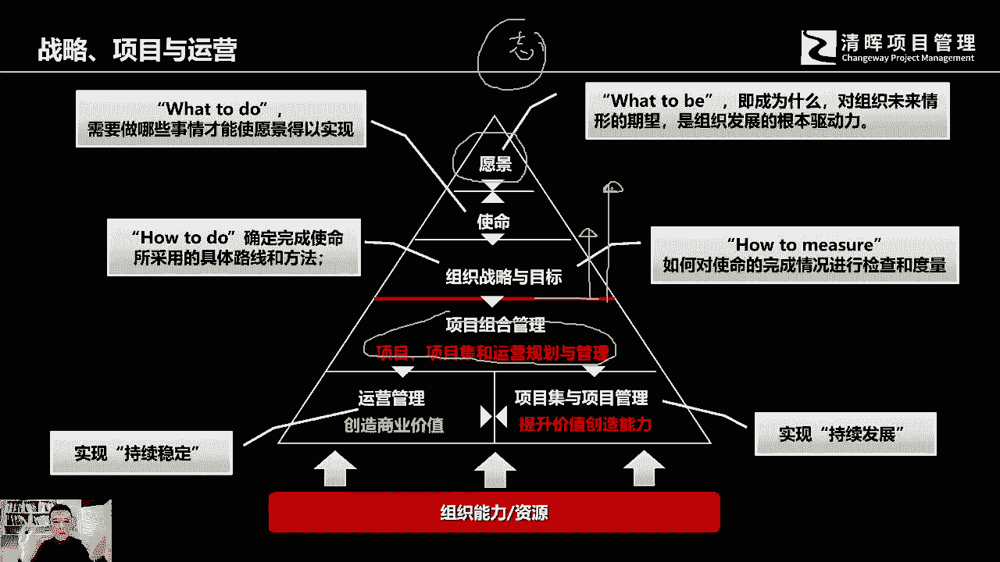
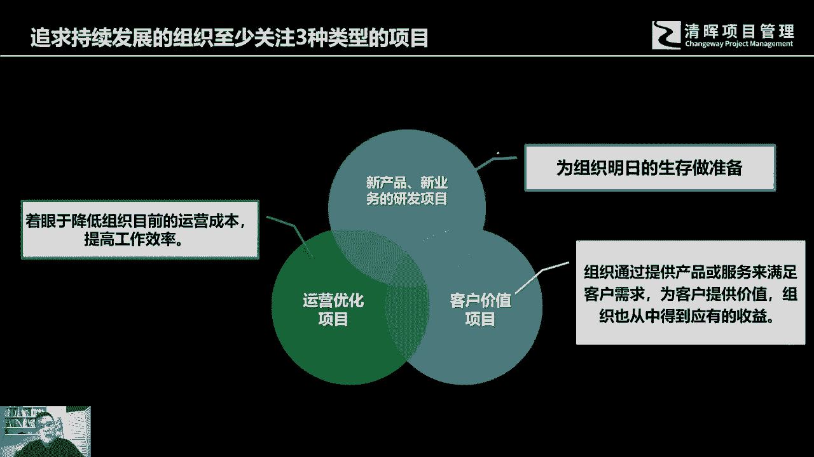

# 什么是项目风险？我们应如何管控？｜ 管理好项目需要的技能有哪些？ - P1：5.战略、项目与运营 - 清晖在线学堂Kimi老师 - BV14V4y1Q7Rc

项目在整个组织的经营管理，或者说在运营的过程当中，经营的过程当中，项目处在一个什么样的位置，在总体的企业的这个经营，这个各类活动当中，它处在一个什么样的位置，这里面我想跟各位去分享这样一个模型。

各位可以去了解一下，首先我讲任何的企业啊，它都会有一个长远的发展目标，可能有人会说我这只是一个初创型的企业，我可能我们只是我们只是为了生存，我们暂时先想先想的是，如何把自己啊能够活下来，其实这也不尽人。

当你去真正开办一家公司的时候，也成为一个公司的真正的领导者的时候，不管你公司的规模现在到底有多大，也不管你的企业现在存续的时间有多长，但是我想在你的心中一定会有一个对你来讲，算是一个比较长远的。

一个所谓的期盼或者期望的目标，那当然如果一个企业它到了一定规模，已经持续了足够长的时间，我相信这个愿景可能会更加的远大，所以多和企业都会有一个所谓的愿景存在，就像人一样，我们讲人贵在有志。

贵在有志志气的志对吧，所以的话这个我的笔不太好用啊，用鼠标在写啊，所以的话这个企业跟人也相同啊，人有这个所谓的志气理想，企业有自己的愿景，所以那个愿景呢它代表什么呢，其实代表的是what to be。

我想成为什么，小时候我们可能都会有理想，我想成为你成为科学家，成为运动员，成为军人，那企业也一样，我相信各个老板都会对自己的企业，会有一个长远的一个思考，那么对企业未来的情况会有一个所谓的期待。

就是所有组织发展的根本性的驱动力，那么当你有了一个所谓的志向以后，当你企业已经有了一个所谓的愿景之后，我们就会有一个所谓的使命，那使命是什么，实名指的是what to do，为了达到我的这个终极目标。

达到我的理想，达到我的企业愿景，那我需要做哪些事情，才能够让我的愿景得以实现，让我的理想得以成功啊，得以展现，所以这就是使命，使命代表是说，为了我要达成这个最终的理想，我会去做些什么事情。

但是这个仍然还是很大，无法落地，最好的落地方式是什么呢，你把它细分一下，然后呢分成阶段去完成，分阶段去完成呢，其实就形成了组织的战略，就how to do，怎么去实现我应该去做的那些事情。

然后确定完成这个使命，所应该采取的具体路线和方法，分阶段去展现，去分阶段去实现它啊，这就形成了我们的组织战略，那么在使命为前提的这个上端，然后我们制定了相应的这个战略。

那每个战略的阶段都会有一个具体的目标，那这个目标战略性的目标，它其实是一个可以可以帮我们去度量，去检查，去检阅，我们实现了这个阶段性成果的实际情况，就是如何对使命的完成情况进行检查和度量。

其实目标是我们提前规划出来的啊，比如说我们呃对个人来讲，我们讲小一点哈，想小一点，我们想马上夏天到夏天要到了，这个很多胖子开始苦恼，我们到了鹿肉计，很多人都会定一个所谓的阶段性目标。

我们希望能够在78月份前，我们的那个体重能够减一下，我们这个腰围能够减一下，我们在原有的那个这个体重基础上面，去去减个15kg好吧，15kg这个这个太厉害了哈，按照正常来讲，10kg，其实呢。

这个10kg其实就是你制定出来的一个目标，然后呢你实际执行的情况，是不是达到了这个目标，所以目标本身当你制定出来以后，你可以拿来去检查，去对照你实际减实际行动的结果好，那么这就形成了我们这条红线上的。

一系列的这个高层的决策啊，好那么我们如何去实现它去落地呢，我们就需要一系列的项目组合，项目集和运营管理出来，实现我们这条红线之上的这些理想使命，战略目标好，那么这里面运营工作，重复性的劳动是必不可少的。

刚才我们已经提到过了啊，重复性的劳动其实是必不可少的，只不过从业者在这个过程当中呢，他不断的在重复原有的知识和经验，无非来说他会越来越熟练，所花的这个时间代价成本会越来越低，但它这个创造性还是不够好。

那所谓的运营性的工作，它可以啊创造我们的这个商业价值，保持组织的稳定，他把我们所投资的这些项目，通过后期的运营投放市场，销售各种相关活动啊，给赚回来好，那么项目它是干嘛呢，它是持续发展。

它可以帮我们去做创新，提升我们现有的能力啊，举个例子，比如说我们讲这个twitter，twitter刚刚成立的时候，应该是这样讲，推特还没有成立的时候，他因为这个创业黑马会啊。

使得这个在原有的短信的基础上面，获得了这个产品的革新，很多年轻人就觉得哎呀这个东西不错，就觉得啊要去用一用，要去玩一玩，然后下载下载使用呢，觉得啊这个大家都觉得这个东西不错，然后一传十十三百。

很快这个容量就特别大，这个这个参与的人员会越来越多，当时当他已经开始有3000多万，这个用户下载量的时候，已经开始有5000多万用户下载量的时候，推特还不是一个公司，还只是一个大，还是还只是几个大学生。

加一个年轻的，这个刚刚的上班族的这样的一个发明创造好，那么当这个大家使用，发现原有的那个服务器已经支撑不了并行，这么多人的去使用的时候，没办法，那就成立一家公司，然后呢扩大了原有的这个这个这个啊服务。

同时服务的这个并发量，使原有能够几千万人在里面去下载使用，可能长时间都没有办法登录上网的这种情况，后来通过一系列的组织改造设备啊这个更新，然后这个这个容量扩大扩大扩增，而使得组织能够在单位时间内。

能够服务将近上亿客户的使用和下载，这就使得组织从原有的这个状态，提升到一个新的状态，所以项目其实它是可以推动的，组织成长，使得比如说能力得以提升，好比如说我们在这个中国的这个改，革开放的早期啊。

出去去这个访问，去过日本，去过德国，当他们去参观日本的钢铁生产公司，和德国的钢铁企业，他们非常的感慨，感慨什么呢，感慨当时这个两个国家之间的，这个生产能力的对比的差异，真是天上地下。

日本和德国同样的年钢产产能，对方的公司只要不到7000人，而同样产出相同年产能的钢材产量的，中国企业却要10万人啊，这就代表着是个能力差距，当然后来中国一系列的这个中国的这个啊，改革开放啊。

这个技术引进人才的这个培养提升，参与国际化的竞争啊，中国现在很多企业在很多能力上面，他已经得到了提升，也同样可以花比较少的代价和人员投入，使得有同样的这个产出，当然在你的公司也会从。

也可能会存在同样的情况，优化原有的流程，可能会使得我们整个公司的这个。

运营效率得以提升，所以任何一个，所以任何一个说追求持续发展的企业，他至少都会关注三种不同或者三类相应的项目，那么首先呢可能我们需要面向未来，组织终究是要长期存续的，那么面对未来的竞争，新的产品。

新的业务的这个研发项目就是其中的一类，还有一类呢，就是现在我们将要服务于我们的客户，我们的客户可能会有这样或者那样的需求，这样或者那样的问题，可能我们需要去满足需求，满足现在客户向我们提出来的各种问题。

不管是集团化的客户还是零售型的个体消费者，不管是某个具体的客户还是某一大类人群，那么我们现有的公司可能为了获得客户价值，为了满足客户的需要，解决客户的问题，未来进行产品开发。

或者在原有的产品上面进行革新，那么当然在企业运营的过程中，我们除了去开发新产品，对原有的产品进行革新，满足客户的需要，好进行商业化交易，同时我们也要向内看，可能我们需要解决低效问题。

可能我们需要解决成本优化问题，那么这个时候着眼于降低组织目前的运营成本，提高工作效率也是一类项目，它可能是一系列的解决方案，对原有流程的优化或者改动原有的组织结构，或者引入新的管理理念或者管理流程。

工具或者方法，都有可能会解决低效问题，降低成本，所以在任何一个组织，我们的项目要进行推进和开展，我们要持续发展的话。

