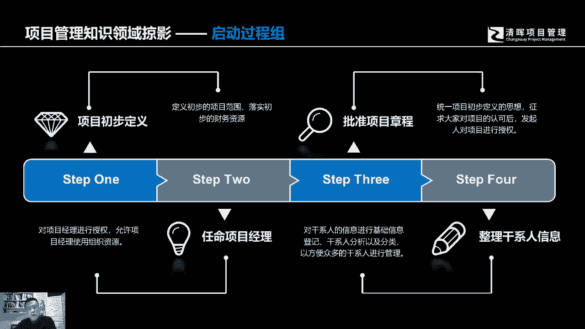
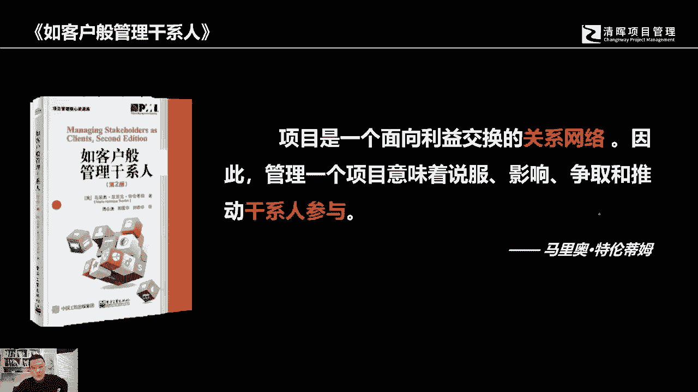
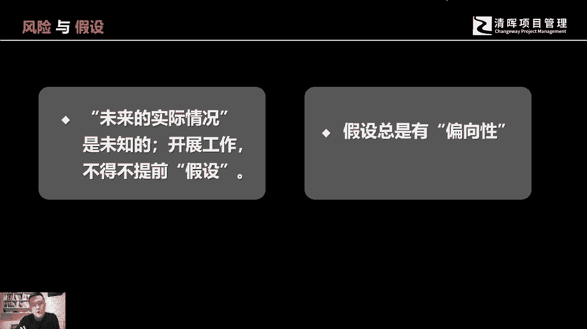
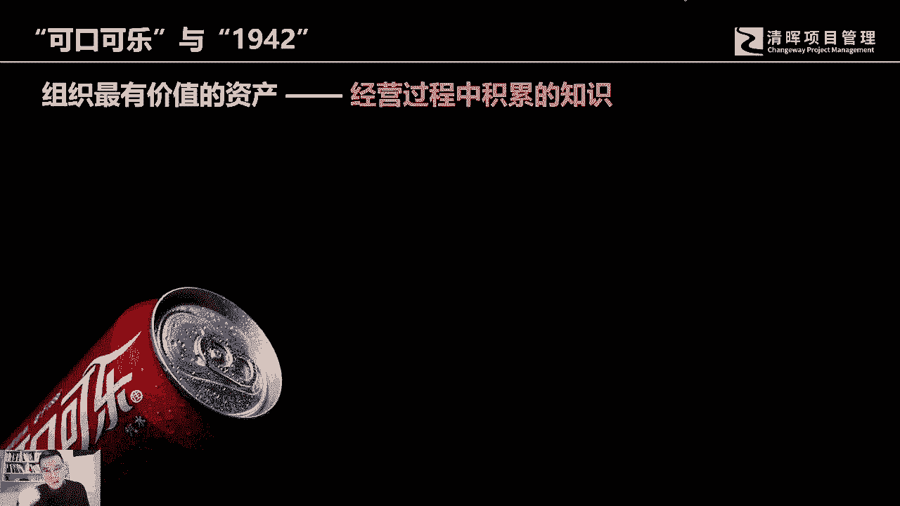
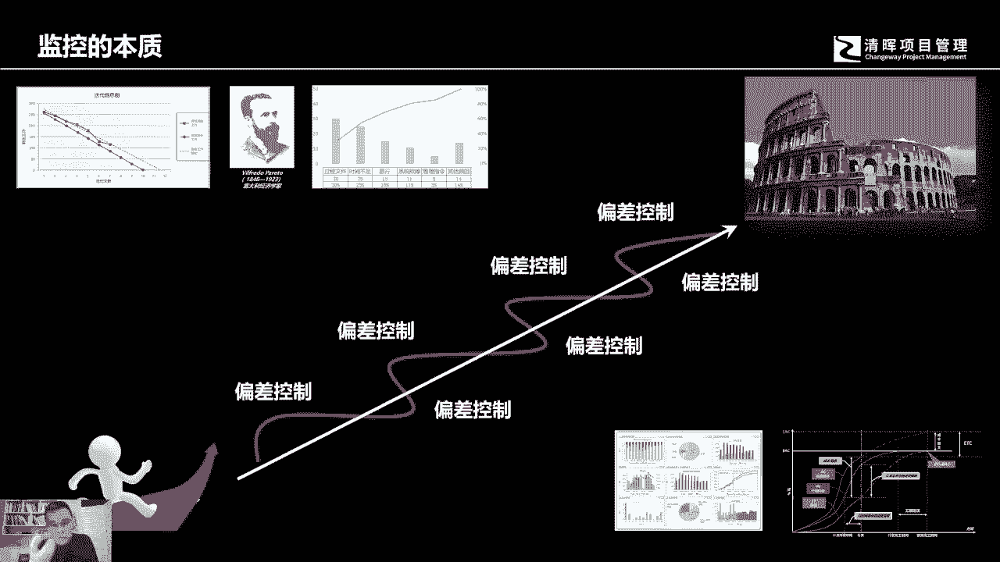
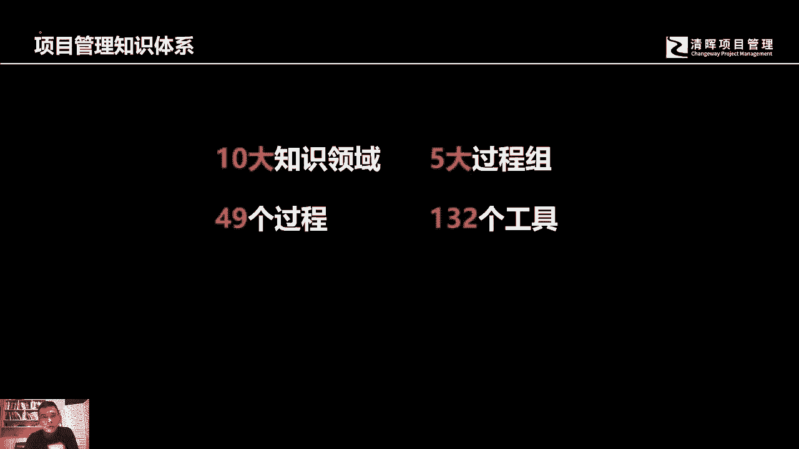

# 什么是项目风险？我们应如何管控？｜ 管理好项目需要的技能有哪些？ - P10：10.项目管理知识领域概括 - 清晖在线学堂Kimi老师 - BV14V4y1Q7Rc

好，那么我们跟各位去分享一下我们的五大过程组，都会去学一些什么东西，都会去了解一些什么东西，对我们项目管理有起到什么样的帮助。

首先第一个我们在启动的时候，一定要首先去关注，跟我们的项目之间有利益关联的这些人，因为项目它本身是一个面向利益交换的网络，这就意味着我们的项目经理，我们的项目管理团队要不断的去说服证据。

和推动该写人的参与。

那么在这个过程当中，我们所有的知识领域中的相关内容，都跟人有关系，都跟相应的干系，人有相应的直接的关系，比如说需求，我们讲范围来源于需求，需求的话是要满足人的需要的，所以需求的来源都是人的。

都是人的需要，人的期望，人的期待，人的要求，那么在执行的过程中，我们刚刚我们之前说到三重制约，有了范围之后，我们的进度和成本也会形成相应的制约，那么这个里面进度和成本都有可能会来自于，各种不同的干系。

人提出来的制约因素，人都会要求说一个项目具体会在什么时候，我一定要看到成果，或者说我们这个项目只能投多少钱，然后会通过什么样的方式来，分阶段的支付这笔钱，这个都是相应的制约因素，然后呢因为跟人打交道。

自然就会沟通啊，沟通的这些这种过程，自然是要根据人的习惯和特点来团队管理，我们的团队成员都是核心关键的干系人，我们如何去激励他们，与如何去管理成员间的冲突，这也是跟人有关联，采购不用说了。

我们也是跟人打交道，外部的供应商，外部供应商的管理者啊，相应的项目，其他的这个供应商的项目团队，我们也是在跟人打交道，还有就是风险管理，很多人认为风险管理怎么会跟人有关系呢，很简单，人是不一样的。

有些人他是很积极的，很激进的，抱有一个很乐观的态度，所以他在做事情的时候，他是非常激进的一种方式，可能留给的，比如说激进的人，他所制定的项目的这样的一个时间持续周期，他可能会做得非常的严谨。

但人也有可能会是保守的，有些人是悲观的，那这个时候他会给自己留下很大的余地，留下很大的回旋余地，这个时候有可能他制定的项目进度，计划就变得非常的长，所以这个里面呢，人的态度直接影响着风险的管理计划。

这里面就会有一个叫效用的东西，就是他跟人的主观认知色彩，决策习惯有直接的关联，这都跟人有关系，那么启动阶段会有两个非常重要的文件，一个是项目章程，一个是假设日志，这里我想跟各位分享一下，这个假设日志。

其实恰恰就是项目的主要风险来源，那么假设日志里面，当然我们从这个望文生义啊，这个假设日志里面它包含着很多的假设条件，当然它不仅仅只有假设条件，那还有其他的制约因素之类的好，那么首先是一个假设条件为。

假设这个东西是必然要去做的事情，你在开展任何一个工作的时候，你都不太有可能去等到说所有的啊实际发生了，你才去做决策，那是不可能的这个悖论，所以在任何执行任何工作的时候，不管你是生活也好。

不管你是工作也好，在日常的工，在日常的生活工作工作过程中，你都会去假设很多人很多工作，很多信息，假设是你一开始认定它就是一个正确的，它就是个对的，然后你不需要去验证它，就认为他是个对的。

你先假设他是个对的，然后你再去执行它，但是如果它发生错误了，或者说你假设不对了，它就自然就是一个风险的来源，比如我们在项目的开始，刚刚规划启动开始的时候，我们会假设说我们的甲方啊。

比如说我们签了一个合同，他会按我们的约定支付相应的里程碑的款项，这是我们的假设对吧，但是实际它会不会延期呢，会不会有其他的一些状况发生呢，我相信各自都会有相应经历吧，第二个，我们假设我们组成的项目团队。

成员都是向心力很强的，都是积极工作的，而且不会离职，但是实际情况呢会不会发生呢，离职呢会不会发生冲突呢，而这些冲突有可能造成严重的负面影响，迟滞了整个项目的开展周期呢，这也有可能对吧，所以的话没有假设。

没有办法开展工作，但是假设是风险的来源，假设是你一开始认为他就是错的，但是人做假设都会有偏向性，就像刚才我们讲的风险一样，他会有自己的偏好，有些人是偏好激进，有些人是偏好保守。

有些人可能会是相对比较理性，但是只要是跟人有关系，你都会发现它都是有偏向性，作为管理者应该去关注这些细节。

那么规划过程组，规划过程组，我们要去做什么，我们会去做一个完整的项目管理计划，项目管理计划是什么，它要求的很简单，他简单来说就是要让我们的项目经理，有一个全局观，有一个全局的去把握和掌控整个项目规划。

然后呢去为执行项目啊提供一个全局的思考，同时还要注意，因为项目它是有独特性的，因此我们会花很多的更多的时间，更多的精力出去做前期的规划，那所以这个项目管理计划是我们在规划的时候，要去认真执行的一件事情。

好做出来的一个成果，他给我们项目经理提供了一个全球化的思，考和视角，那么在执行过程中呢，我们会去做些什么事情呢，当然我们首先肯定是依据我们所做出来的规划，做出来的，制定的项目的计划去来执行我们的工作。

最终做出一个我们所需要的可交付成果，有可能是新产品的开发，有可能是对老产品的改造，也有可能是对我们工作流程的优化，anyway，不管什么样的项目，我们都会遵我们在执行的过程中。

都会遵照我们之前的规划来去执行它，那么要在执行的过程当中，什么东西对我们来说是最有价值的，我个人认为知识是最有用的，我们应该产出啊，对项目团队来讲，你交付了以后，那么项目团队自己留下了什么。

有的人会说我们拿到了钱好，我们得到的工资，我们得到的奖金啊，其实这个不尽然，但是我想更长远的是，你在这个实施的过程中所积累的知识和经验，就像可口可乐公司的老板，他曾经说过一句话，我相信这个很多人都知道。

他说我的企业付之一炬，一夜之间全部烧光，但是我相信，我可以在短时间内去建立我的商业帝国，他为什么会有这样的自信，品牌影响力可能是他的其中一个重要的原因，那另外一个是因为他自己经历过成功。

但凡经历过成功的人，他再次成功是有很大的机会的。

他有这种气，成功的驱动和相应的能力，这个里面有个什么东西在作怪，是知识，是他曾经经历的成功的知识，他知道走哪些路径，规避哪些陷阱，又有可能使他获得新一次的成功，我相信各位应该看过这部这部电影。

我想很多人知道他，就他的他的影片的名字叫1942，这个1942它里面有一段台词，当时我看这个台词的时候，我深有感触，他说的是那张国立，你跟着我最多5年我就可以重新做回财主，在这么一个兵荒马乱。

这么一个落魄的情境下面，他还有这个自信，但从另外一个角度，我从他那个台词中读到了另外一个东西，它有这样的自信的原因，是因为他从他做过财主，他知道该怎么成为一个财主，如果各位我们去来回忆一下啊。

近段时间有一个我觉得有个风云人物哈，可能有些人不太在意哈，这个人姓季叫季齐，我不知道有多少人记记齐斜玉边的一个棋啊，我用鼠标写字可能有点麻烦，个人各位知道季奇是谁吗，有有有多少人知道季奇是谁吗。

各自量携程吧，滑柱儒家，在他的医生现在50多岁，不到60岁，他经历了四次敲钟，推动了三个上市公司，这说明一件事情哈，他他不断的在重复着自己的成功，他知道自己啊，之所以他知道自己应该运用什么样的知识。

运用什么样的方法可以让自己再次获得成功，所以不管怎么说，我觉得在经营管理的过程中，包括在项目管理的过程中，知识很重要，那么知识呢它就有分显性和隐性的，显性的知识呢它是结构化的。

我们可以明确的在传递的过程中，充分利于理解的，隐性知识呢恰恰是在很多企业里面，这个是很重要的一个东西，因为企业里面大概有超过40%以上的，这些知识都是存在于个人的大脑中，他是个人的一个领悟。

个人一个一个体会，可能他没有办法把它啊，通过一些标准化的语言给表述出来啊，展现出来，但这个隐性知识恰恰是一个企业的一个财富，我们可以通过不断的啊这种这种隐性知识的挖，掘，这个把它转成相应的显性知识。

这是我们在项目执行过程中，其实是最有价值的一部分东西好，那么监控过程组，监控过程组其实就是在走偏差，我们制定了我们制定了项目管理计划，在这个计划的过程当中，你会发现一个实际情况，就是我们执行的时候。

不太可能百分之百贴的这个计划执行，它都是围绕着这个计划，它会产生相应的偏差，而我们这监控的本质其实就是在控制偏差，我们有很多的工具和方法去帮我们去找到偏差，分析偏差背后发现发生的原因。

制定相应的备选方案，然后选择排序优先，去挑选一个切实可行的解决方案，去纠正我们现有的偏差，那比如说我们这个执行过程中，这个进度发生了偏离，成本发生了偏离，我们都可能会啊，通过相应的工具和方法。

去来发现和制定备选方案，最后纠正它，所以监控的本质其实就是在纠偏好。

那么收尾的时候，我们自然去交付我们的成果，去来解决相应的增益，把钱收回来，做了经验教训总结，然后个人绩效评价最后可以解散，我们整个这个过程中，会有一系列的行政收尾的过程，这就是我们项目管理的知识体系。

它有十大知识领域，五大过程组，49个过程和132个工具啊。

这是我们可以相对比较完整的啊。

