# 什么是项目风险？我们应如何管控？｜ 管理好项目需要的技能有哪些？ - P11：11.项目经理如何促进个人发展？ - 清晖在线学堂Kimi老师 - BV14V4y1Q7Rc

作为项目经理来讲。

作为个人来讲，我们每个人都会去成长，在学习这个项目管理的过程当中，我们的p p s p啊，在这个台阶上面，我们可能会一开始是一个技术性的人员，任何人进入职场，你一开始都会在一些相应的技术性的岗位。

这里的技术哈，各位不要把它单纯的理解为，我们什么信息化技术啊，软件开发呀，硬件的设计啊，绘图啊，这些叫技术，不是不仅仅是你，比如说你说你是在财务部门，那财务部门的技术是什么。

会计的原有的吃饭的技术是什么，做账嘛对吧，他能够按照国家法律法规，公司的管理规范，相应的规则，税务不能要求，然后把项目给做出来，这就是他本有的工作岗位所赋予的相关技术，那你说律师的技术是什么。

了解最基本的法律规则，诉讼规则啊，法律相关的知识，然后能够在后期去发挥，那他的技术岗位是什么，它的技术岗就是发挥自己本有的法律知识，所以不要把它单纯的认为是软件开发，所以你会看到项目管理。

它是在很多领域里面都可以被用到的，那么管理跟实际的技术发挥是不一样的，管理它主要针对的是人，促进更多的人大家一起去干事情，而不是你自己亲自去亲力亲为，那么学习好项目管理。

你就有机会形成一个向上发展的路线，向上的直线的纵向发展路线，会从技术人员通过学习到如何管理单一项，然后呢管理一组有相互关联的项目，然后呢再往上发展去管理，虽然没有关联性，但是能够调配。

学会合理的去调配企业的资源，去来满足战略发展的需要，这样的一个项目组合的一个能力，所以这就形成了一个纵向的发展，那这个纵向发展呢，就是使得我们整个项目管理的规模，覆盖面实施的这个跨度决策周期。

经营的这个周期会更长，所以它就形成了一个项目经理的发展重现。

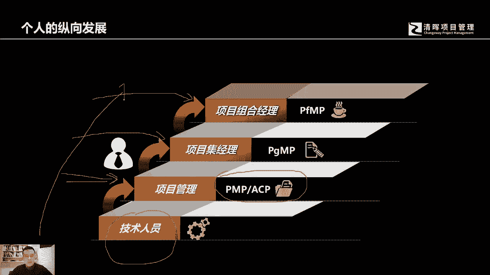

当然如果你学好了这个项目管理，你也同时具备了横向发展的选择能力，也有可能会从一个啊技术人员开始，然后学会了啊，我们我们获得了相应的这个专业资格认证，学习到了这个基本的项目管理知识，那么这个时候。

也许有些人会认为，自己不会像项目管理这个纵向去发展，他会想横向的去向市场，像产品这个方向的横向发展，那么我们的项目管理的这样的一个学习，它也为这个横向发展奠定了一个基础。

那么这个横向发展呢就使得我们学完以后，我们有可能会进一步深入学习商业分析的知识，使得我们知道为什么我们要启动一个项目，如何去发现启发分析需求，使得项目的成功概率得以进一步提升。

然后为企业贡献更多的有价值的这个解决方案，获取更丰厚的商业价值回报，那么再往横向发展啊，就有可能会去啊成为一个产品产品总监，产品经理会管理一个更或管理一条产品线，因为一条产品线。

一条一个产品它需要多个项目，就来在整个产品的生命周期去，来提供相应的知识，那么这个就使得我们的个人能够有一个，横向发展的一个选择机会。

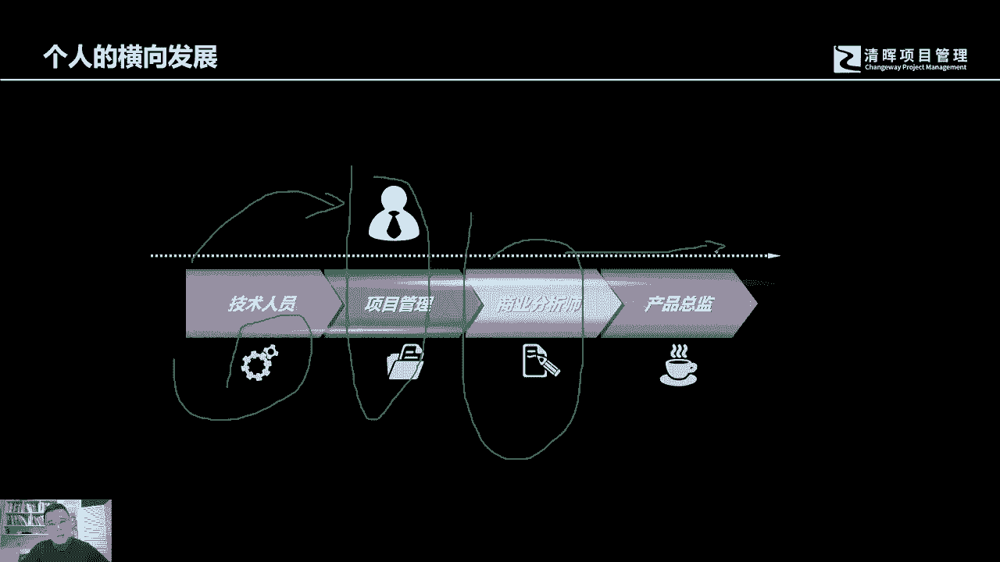

那么现有的项目管理协会，美国的项目管理协会pmi在现在刚刚做的统计，我们在全球现在已经有110多万的p p啊，各类其他的一些专业认证，比如说a c p现在已经有4万多了啊，p ba啊。

还有还有我们先新刚出现的这个da啊，还包括这个项目组合，项目集管理的专业人士啊，都已经非常多了，好，那么我们这里面呢差不多有1/3强的，都是啊p m p都是中国人，都是华人啊，各位可以想一想为什么啊。

一个是社会市场发展的需要啊，另外一个是我们各个企业发展的需要，同时我们中国人也会非常贪，其实中国人也是非常善于学习的，对吧好。

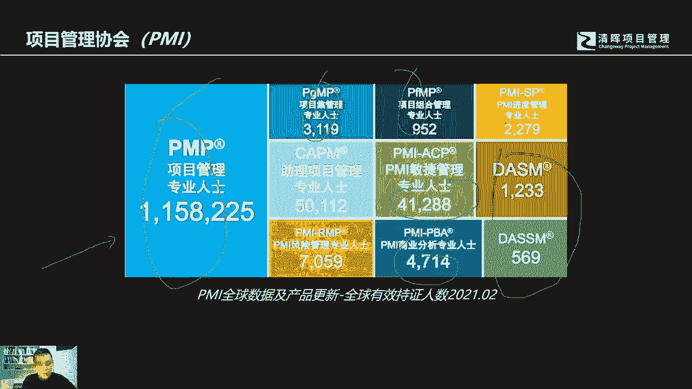

那么这个呢是我们的偏僻的相关认证的证书，和其他的一些知识领域之间的关系，pp呢它是我们的基础，它是我们的基石，是我们的基地基，那我们把这个地基打牢以后，我们可以纵向学习很多的跟项目相关的啊。

项目管理相关的这样的一些知识内容啊，有了这个基础，后期变得就不会太难，有很多学员一开始就问我说，这个这个项目管理的学习最难的科目是什么，是不是不是后面的什么项目组合管理，项目集管理。

我说诚然那些东西也会比较复杂，考证的时候也可能有它一定的难度，但是我告诉你最难的是什么，就是男的恰恰是偏僻，你有了这个基础之后，再去理解其他的后面的一些相关知识，你会轻松很多。

你的成长就已经有了一个很牢靠的基础啊，这是我们能够提供的相关的资格认证啊，这也是我们可以提供的相关的咨询服务啊。

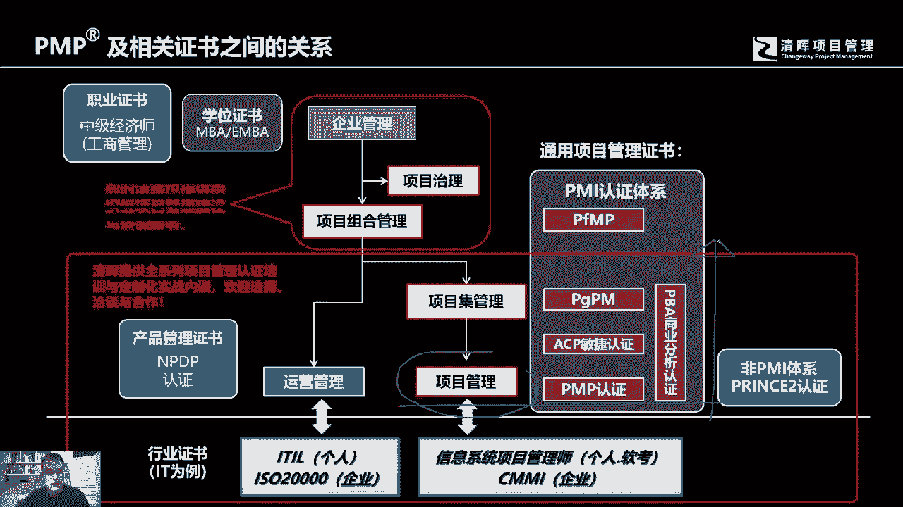

好，所以现在你会，各位可以看得到我们的这个p p的啊，在行业领域里面的一个分布最多的还是信息啊，信息技术那么成长最快的，成长最快的，那是我们的这个这个我们讲这个航空汽车，健康医疗。

这恰恰是近几年我们的中国啊，这个行业发展最快的相关的这些产业啊，他的最专业的这个项目管理，专业人士的需求也是非常多的好。

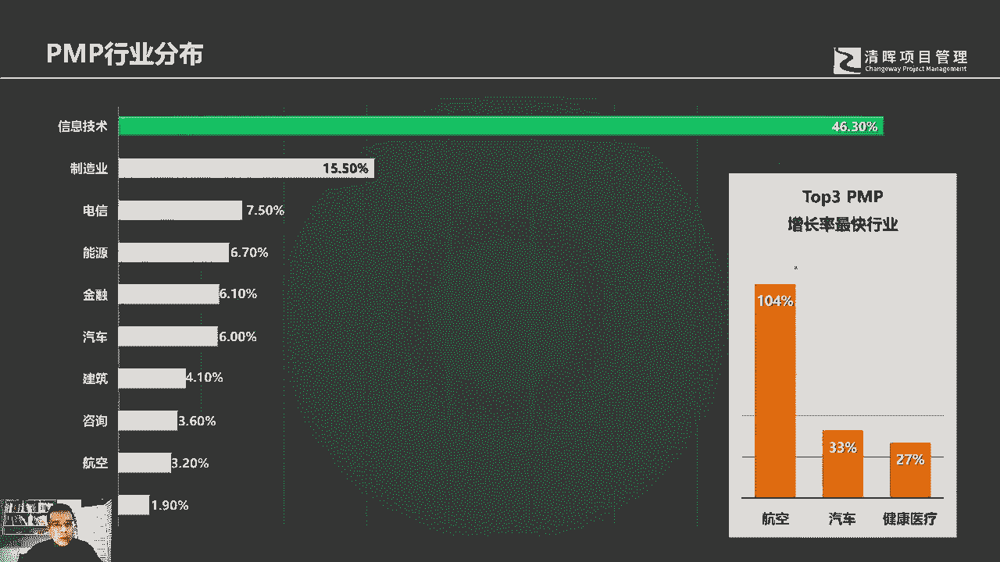

那么这是啊相应的一些企业性质的分布哈，有些大部分来自于民营企业，然后还有来自国企的，当然还有专门的这个国家政府机关的，我曾经看到过有相应的专业的税务部门啊，国家的税务税官收税的官员啊。

他们都来学习项目管理哈，好所以这个啊各位可以了解一下，其实我们现在来讲，中国本地报考人数的总量，其实已经远远超过外资企业，这也是社会发展，也是中国的市场发展的一个必然的一个趋势哈。

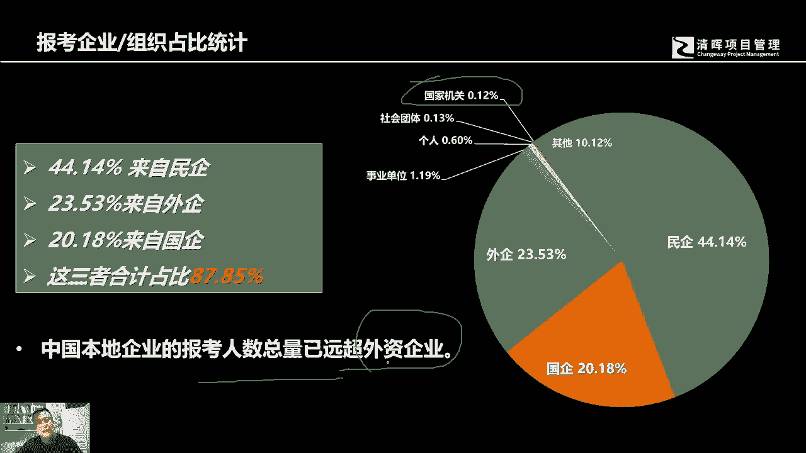

好这是每年的这个人数，报考人数的成长，每次都是每年加较上1年度都是指数型成长，都是成倍的成长，我们现在的这个2021年的话，预计已经有应该会有20多万人次哈，所以今天你会看到是。

今天我们很多机构都在去抢考点，而且我们很多教务老师都是通宵达旦，真的是通宵达旦，就是早上九点钟到，第二天早上七八点钟还在上班，你知道干嘛呢，就是去为自己的学员去抢考点，这里面有一个很很很很重要的原因。

很重要的原因就是参与的人数太多了啊，社会需求太旺盛。

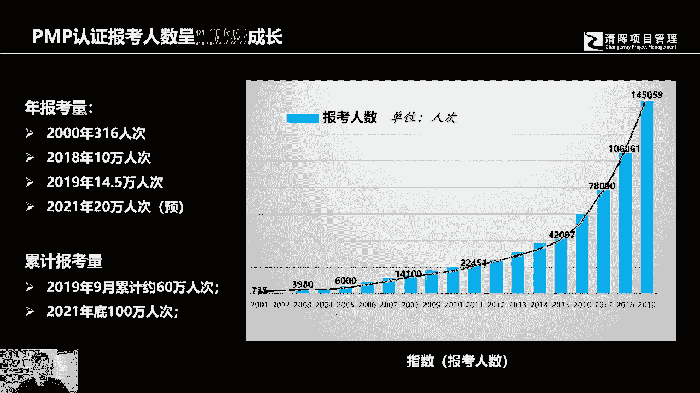

那获得相应的这个资格认证之后，我相信每个个人都会特别关心，说自己的薪资成长，这是一个pmi的一个pm脉搏的一个统计，就是在中国国内现在的这个薪资成长，获得认证之后的，个人1年内的薪资成长的一个比例。

那各位可以参考一下，比如说这个这当然是个平均值的统计哈，好那么所以你会看到有上涨10%的啊，它是比较多啊，平均是上涨13%哈，他说在我们的学员当中哈。

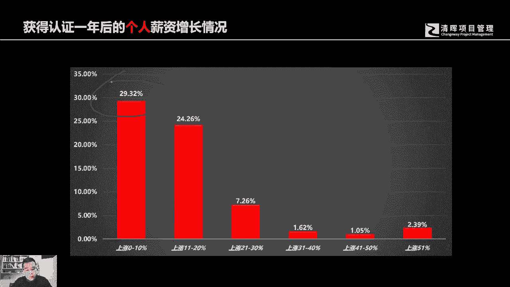

对我们的，在我们的学员当中，我们会有特别极端的情况。

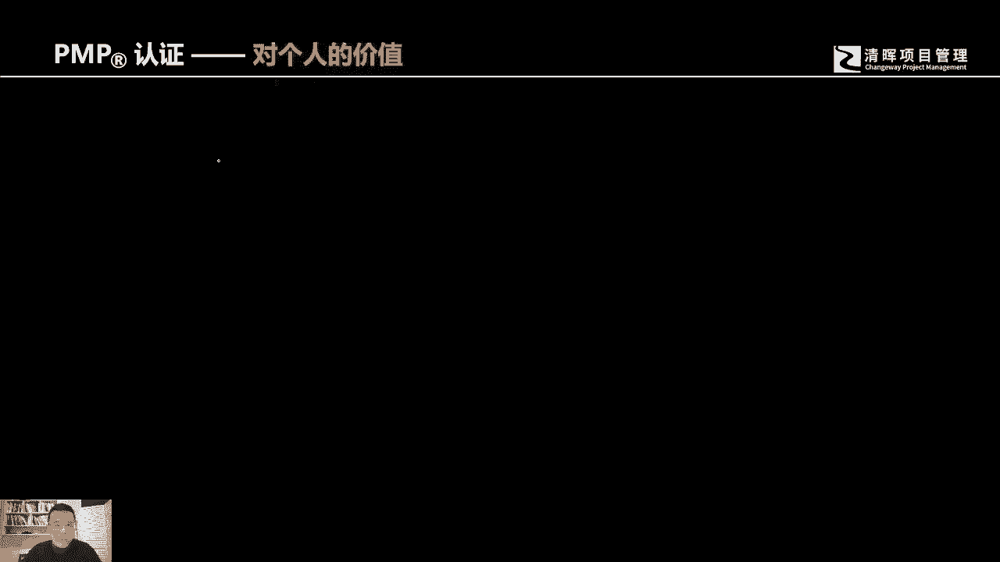

极端的情况是什么呢，就是工资涨幅75%，甚至有些学员是成倍的增加，那么如果说他这里还没有专门的去被新的公司，新的老板去要求带项目，那如果带项目的话，有可能在原有的基础上还会再涨50%。

所以的话这个也充分的说明，这个项目管理的这个资格认证，对个人的一个啊个人的一个价值好。

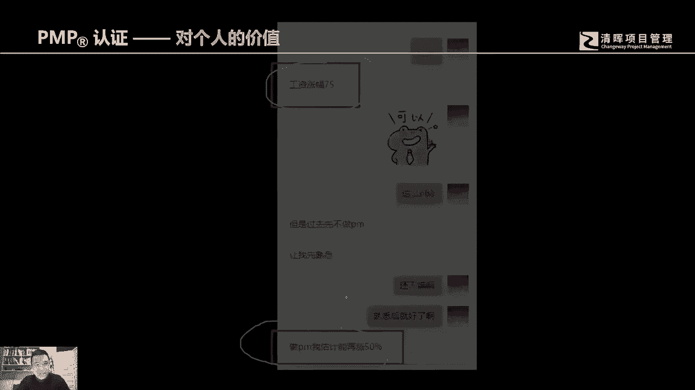

所以那个除了知识之外，还有能力的提升项目管理专业技能，提升领导力的提升啊，战略战略和商业管理能力的提升，都是我们在学习好偏偏认证啊，获得了一些个人能力提升上面的一些帮助啊。

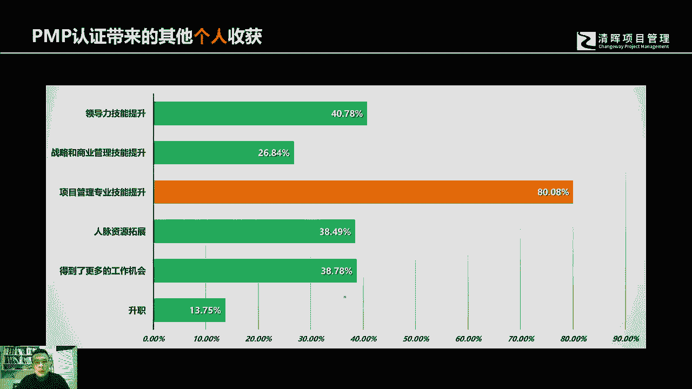

这是最新的一个考试啊，各位可以了解一下，当然我们在这个地马上我们就会改版，马上我们会改版，会改成第七版，但是我想在这里特别说明一下，无论是第六版还是第七版，现在我们业界有一个大致的认识。

作为一个小白来学习专业的项目管理，可能一开始各位听出来啊，我只是在去讲实无矩阵，没有去讲八道及效率三大这个内容环境人过程，这是第七版的，但同时我们会有一个认识，就是什么呢，作为一个小白。

如果一开始从这个从这个方向去学，你会发现你所需要的跨度还是蛮大的，但是如果你一开始说15矩阵，这个比较有结构化的方式去了解项目管理知识，它是非常有帮助的，而且现在虽然改了考纲。

但是我们的基础内容并没有太大的变化，基础性的内容并没有太大的变化，虽然它会有一个在结构上面的一个所谓的创，一个1111个颠覆性，但是一开始的学习还是以实物举证啊为核心。

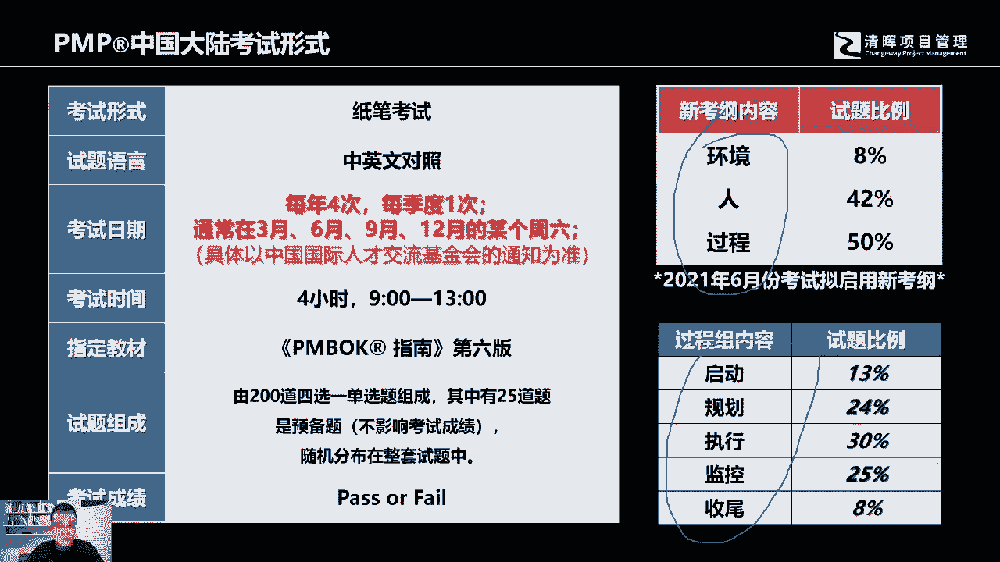

可能学起来会更快一些好，那么今天呢我们的内容就到此为止啊，我们今天的内容就到此为止，跟各位去介绍了什么是项目啊，项目的价值对个人成长的帮助，以及我们相应的职业发展，以及整个市场对于专业的项目。

管理人士的一个需求，各位可以看得到这些相关的第三方的，数据的一些支持，所以这这所以各位可以做出一个自己的判断好。

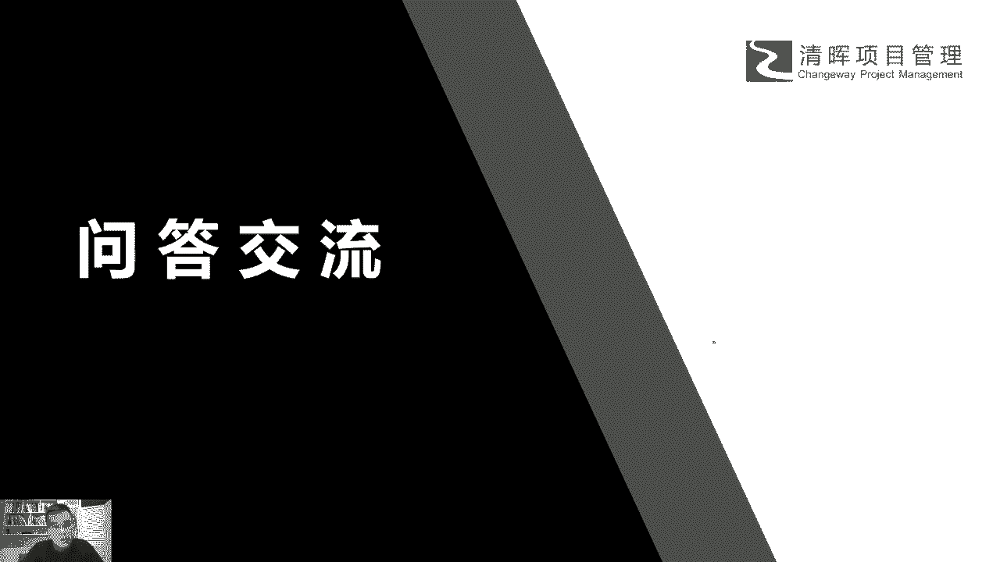

那么今天呢我们就先到这里。

