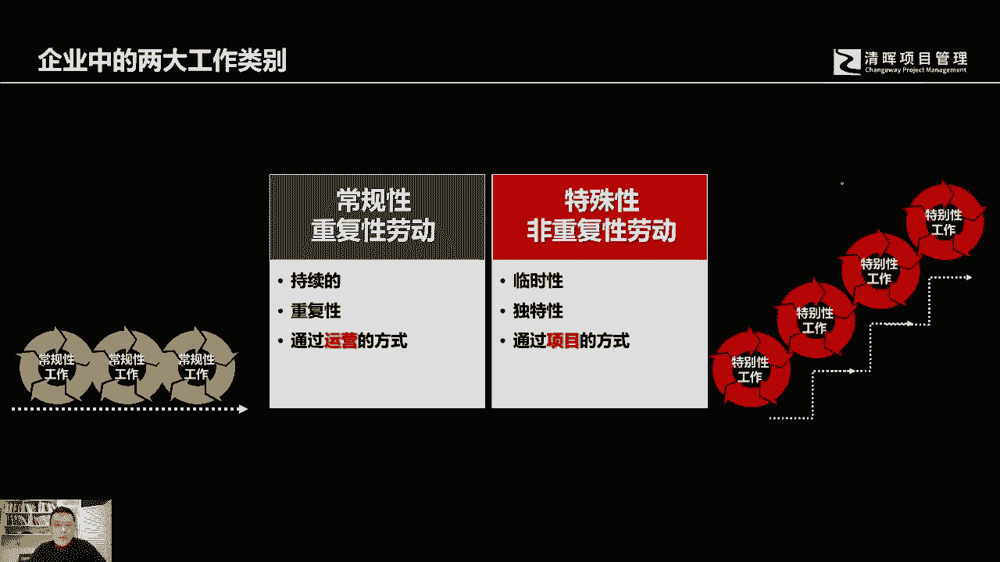

# 什么是项目风险？我们应如何管控？｜ 管理好项目需要的技能有哪些？ - P3：2.企业中常见的两大工作类别 - 清晖在线学堂Kimi老师 - BV14V4y1Q7Rc

那在一个企业当中哈，我们如果说把我们的相关的经营活动或者劳动，进行分类的话，你会发现其实在我们的企业当中有一类的劳动，它是重复性的啊，无论你是看到在这个生产线的一线，去做这个一线工人啊。

你会看到有做一线工人，当然还有说你可能这个啊有些白领啊，可能他是在上班啊，他在做这个电脑前的这些办公室的工作，但是你也会发现，其实他也是在做重复性的一些劳动，或者说你看到比如说开出出出租车的运营。

或者酒店中的一些服务接待服务人员，那你会发现他这个都是在做一些重复性的劳动，重复性的劳动有一些比较显著的特征，比如说你今天做的事情，这些重复的劳动者，今天做的事情和昨天做的事情没有太大的差异。

今天创造的成果和去年创造的成果，其实也不会有太大的差异，对于人的能力的提升来讲，你可能会比新手更好的一个地方，就在于你的重复性，劳动的熟练程度会比很多新手要强，那这么多的重复性的劳动，其实所创造的价值。

它的这个创新性其实并不是很高，他不断的在利用原有的知识，原有的技能无非来说就是你会越来越熟练而已，那其实在企业当中呢，你还会看到还会有另外一些劳动，这些劳动呢它是创造性的。

他可能会依据曾经的历史经验和知识，但是他会在这个过程中创造一些新的知识，而且呢还会创造一些新的成果，可能以前并没有这样的产品，它完全是创新的，或者说在原有的产品上做了革新，做了改革，创造出一些新的功能。

或者提升了原有的性能，使得市场的需求产生了一些新的，这样的一些啊机会，那这些劳动呢，你会发现从业者他今天所创造的成果，可能远远高于他去年所做的事情，那么在未来来讲，他的知识会不断地在依据。

他现有的这个工作劳动，在不断地逐步的提升自己，而他所创造的这个成果，正好推动着他的企业不断的革新，建立了自己的更啊，这更强有力的竞争力，同时呢他们这些成果呢也推动了社会的发展。

所以这个企业里面呢它其实就有两类劳动，一类的我们称之为重复性的劳动，那么这些重复性的劳动在企业当中，我们都称之为叫运营性的工作，那这些运营性的工作哈，他其实就在不断的常规的重复。

他所要求的其实是保持企业的稳定，充分的去利用现有的资源，发挥现有的知识和能力，但是非常非限的劳动呢，它就不一样，他不断的在唱创造，在革新，有可能是开创性的，有可能是在原有的基础上做了相应的改造。

和创新或者优化，但是他在不断的提升，一方面，一方面，它的产品的性能功能可能在不断的丰富和提升，同时呢个人的知识能力，组织的的知识能力也在不断的提升和前进，所以在一个企业当中会有这么两类的工作。

其实各位可以静下心来去思考一个问题，如果作为你来看的话，你认为你希望从事哪一类的工作。

其实现在这个社会，你会看到很多的这个专业技术啊，科学技术都在不断的涌现和发展，人工智能各位可以看得到，它逐步的在代替很多人，所谓的这个人类个体的一些重复性的劳动，无论你是在生产的一线。

甚至还是说你可能会具备，可能在有些人看来，它已经具备了某些，比如说有一些专业基础知识的基，础之上的一些劳动，比如说我有个朋友，他是律师，他曾经就跟我说过，他说其实在律师行里面，已经有一些工作。

被所谓的这个计算机和电脑所代替，我发现他们比我更强，后来我问他为什么呢，我说你作为律师，你这个知识性会很高啊，你专业程度会很高啊，可能会比这个，我们讲在工厂里面的一线的劳动啊，这个生产车间的工人。

你这个档次完全不一样啊，那它的替代性可能会更高，你的替代性相对来说会差一些，他说其实也不尽然，他说其实现在的话有些这个专业技术的软件，他已经收敛了，在法律界相关已经非常啊。

这个所有的这个相关的这个案例啊，法官的判例，现有的这个法律法规的一些条文准则，那么当有相应的咨询人，当事人在询问相应的法律服务的时候，其实电脑可能比我们反应更迅速，提供的知识和参考面会更广。

而作为一个人来讲，他的记忆反应程度和他的这个偏好性，其实都是比计算机啊，这个提供的这个服务要狭窄的，其实回过头来可以想象一下，你律师这样的岗位，都有可能会受到人工智能的这个危机，这个这个影响带来的危机。

那何况很多在工厂一线的这些重复性的劳动，所以的话作为个体的打工者来讲，作为作为我们所有人，这个在在社会上从业的这些从业人来讲，你可能会有所触动，你可能会觉得是说嗯，这个可能会给我们带来一些危机。

那么对于项目管理这一块啊，其实他这种创新性的管理，创新性的管理方法可能会是我们计算机，人工智能所能可能逐步代替的比较晚，或者说甚至代替不了的，那么所以人它是有创新性的，它是有灵感的，那么关键在于是说。

我们是要陷入到这种不断重复性的劳动，当中还是说你希望能够从事相应的这种，开创性的工作，或者说革新性的优化性的工作，这是完全两类不同的工作。

