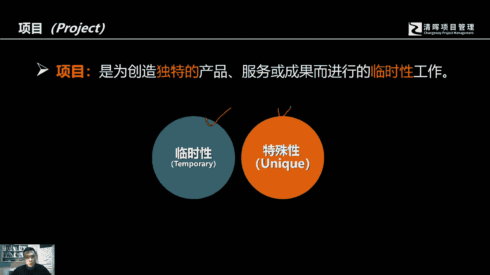
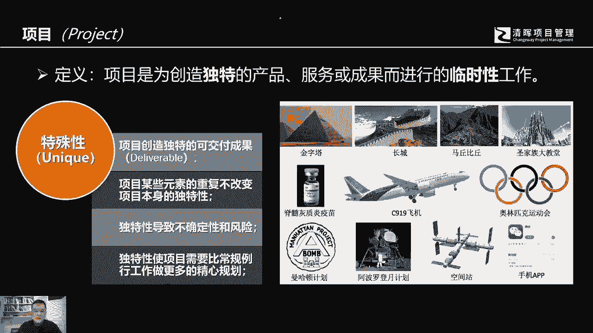

# 什么是项目风险？我们应如何管控？｜ 管理好项目需要的技能有哪些？ - P4：3.什么是项目？ - 清晖在线学堂Kimi老师 - BV14V4y1Q7Rc

刚才我们讲了很多的关于什么是啊，这他提到了这个这个公司内部的啊，不同的这种劳动，那这个时候其实我们提到了很多啊，是项目项目，那什么是项目，这里我们给出一个定义，作为这个pi美国项目管理协会。

他可以除了这个定义，项目是为了创造独特的产品，服务和成果而进行的临时性工作，所以对一个项目来讲，它其实就有两个最基本的特征，一个特征呢我们称其为叫临时性，另外一个特征呢我们称之为叫独特性。

或者叫特殊性，那么临时性指的是什么呢，临时性，首先我们得理解临时性，它是代表有气有终的，也就是说一个项目它是有起点，然后同时它会有一个终结点，项目因为什么而起呢，因为我们可能要去解决问题。

可能要去抓住相应的商业机会，我们可能会产出相应的产品，可能我们会对原有的产品进行革新，甚至我们要对现有的公司的运营进行相应的调，整，优化解决低效降低成本，这些都有可能是像那他的起点，那那那有了起点。

那就是有终点，临时性代表项目它是有终点，那重点在哪里呢，就是我们交付了最终的一个可交付成果，可能是有形的产品，可能是一个解决方案，甚至说你可能是一个调研性的一个结果，它可以解决当初我们发现的问题。

或者说满足我们当初所发现的商业机会，所以项目的临时性代表它是有起有终，它并不意味着我们的项目时间短，你可能会看到有很多的项目，其实在真正的这个实施的过程当中，所谓的起点到终点。

这个时间跨度之间所花的时间非常的长，那么举个例子，比如说我们看到的，比如说像这个中国有名的故宫啊，明清两代啊，我们的圆明园虽然在八国联军被烧毁了，但是呢他从乾隆年间开始修缮。

一直到八国联军开始烧他的时候，那个那那那段年份，他们也正他们也在不断的去扩充和修缮，新增啊他们这个建筑群体，所以你会看到有些看到项目，它所谓的临时性并不代表短，可能我们大多数人更多的机会是在去从事啊。

相对来讲时间跨度不长的项目，可能1年2年，甚至有些项目可能是几个月啊，一两个季度开发一个新的软件的应用，当然也会有跨度比较长的项目，现在的比如说你说坐919大飞机啊，这个中国的这个航母啊。

或者说我们要做这个这个中国的人造太阳，那前段时间有有报道，把我们的这个中国的这个可控核聚变，取得了这个举世瞩目的成果，当然还有很多其他的一些项目，但是总而言之，项目的临时性并不代表它的时间持续短。

那么另外一个临时性还要注意，虽然项目是尤其有终的，项目的整个过程有起点有终点，但是他所创造的那个结果，它可能会延续很长时间，产生的影响可能会是持续的长久的，跟各位举个例子，就是我们在这个位置啊。

各位可以看到哈，我这个最右下角的那个红色的区域，有一个这个这个形状的一个物件，我不知道有多少人知知道，说这个物件是个是个什么东西，这个呢是中国的一个，代表着中国传统文化的一个东西。

它是你要中国的传统文化里面，最有代表性的很多，对不对，那有一个是中国的玉文化，中国人很崇尚美誉啊，你会看到这个这个很多的这个达官贵人，这个中国古时候的附庸风雅的文人啊，甚至包括这个粗放的侠客啊。

他们身上都这个古人都喜欢佩玉，当现在的话有很多人也也很喜欢配玉，包括我也喜欢玉，所以的话很多中国人，他是有这个好像是中国文化的传统基因里面，他就喜欢玉石，那中国的玉文化最早呢其实有两个发源地。

一个呢是内蒙古赤峰县的叫红山网炮，那另外还有一个叫良渚文化，在小时候我们在读初中的时候学历史啊，最早的中国中华华夏文明的开源啊，这个开端啊都会了解过，那这个其实是最早的中国的专家。

见过中国鉴定以后得出一个结论，这是中国最早的叫c型龙玉佩，龙玉佩abc的c好，这个c型农业配呢，好各位把给发掘出来以后，ok那各位在想另外一个事情，有谁在印象中啊，还有没有人知道说中国有个机构哈啊。

一个金融机构叫华夏华夏银行，华夏银行的logo是个什么样子，华夏银行的logo，各位如果有有些人去留意的话，你就会发现他也是个c形c形状a b c的c哈，他就是根据这个赤峰县发掘出来的。

这个c型容易配啊，按照这个为原型设计的，所以我想讲这个事情都代表什么呢，也许在七八千年前啊，六七千年前，这个中国的这个啊老祖宗，也许有这个工匠，他接了这样一个制作龙玉佩的活儿，他说完花的时间并不长。

当他交了这个活儿以后，他没有想到他教的这个成果在六七千年以后，对他的这个后代，对我们的现代啊依然能够产生相应的影响，所以项目它的临时性代表尤其有终，并不代表整个过程短，同时虽然它尤其有终是临时性。

但是它的结果可能影响深远啊，这就是我们项目中的一个特性，那么另外一个特点是什么呢，项目它是独特性，它有它的它能够创造独特的产品服务或成果，那我们的独特性代表是说，项目可能他创造的这个成果。

有可能是这个这个前任没有制造过的，没有产生的，或者说通过在原有的基础上革新而得来的，那么项目这个独特性呢，它还代表着是说，可能在很多时候最中意的一个可交付成果，它是独特的，但是它中间的某些元素。

可能在不断的去重复使用啊，比如说我们可能会用到相同的管理方法，去管理这个建筑工地的现场施工实施啊，但是我们可以最终创造出一个独特的，叫鸟巢的建筑物啊，他在他最终的那个成果，在全球找不到相同的建筑物啊。

这样的一个成果，那当然还有水立方国家剧院，它中间所运用到的管理方法，原材料，整个施工步骤，监理过程，它可能都是一些重复性的元素，但是它创造的那个结果却是独特的，因为项目的独特性哈。

所以导致到我们刚才一再提到，他不断的在创造，在创新，在原有的基础上做革新优化，这就代表另外还有一个有意思的地方，就需要参与管理的这些人要特别注意，就是独特性会导致不确定性的因素和风险。

因为你在实施的过程中，必然将面对一些新的，你所没有曾经没有碰到过的情况，有可能是新，有可能是你要采取新的技术，有可能你会要采取新的管理方法，所以这个不确定性就代表着这个独特性，就引起了项目的这个不特。

这个这个不确定性，继而产生了相应的风险，因为这个独特性有可能超过成相应的风险，那么我们就需要对项目本身在开展的过程当中，进行认真仔细的规划，比惯常性的，普通性的常规划的工作。

进行更深入的规划和精心的规划设计，所以这是项目的另外一个特征。

独特性。

