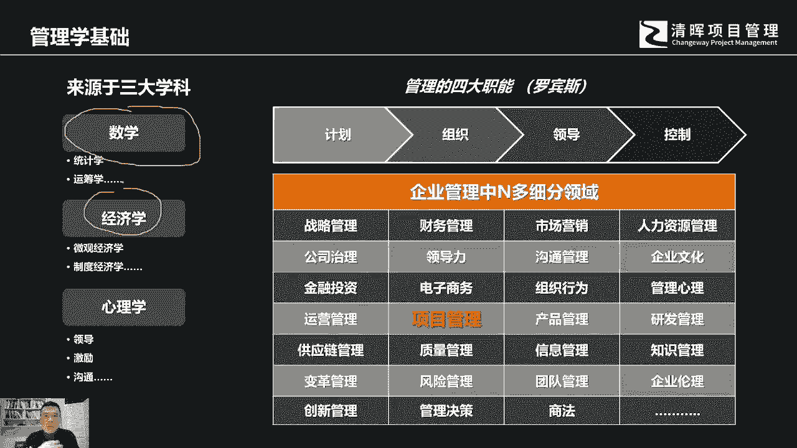
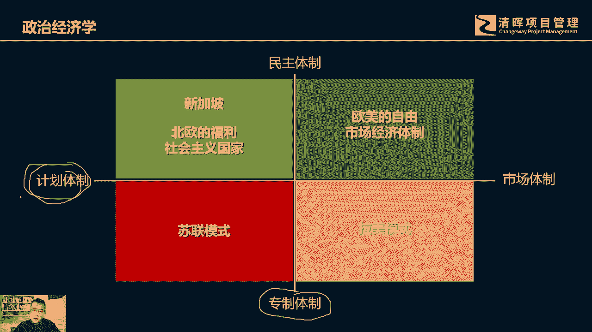
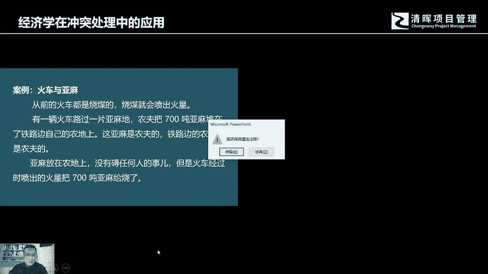
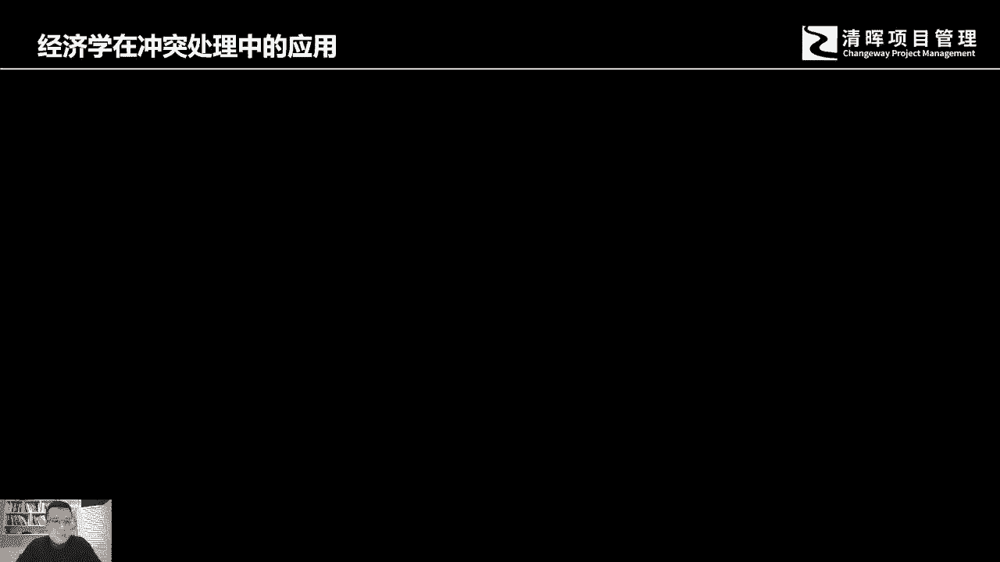
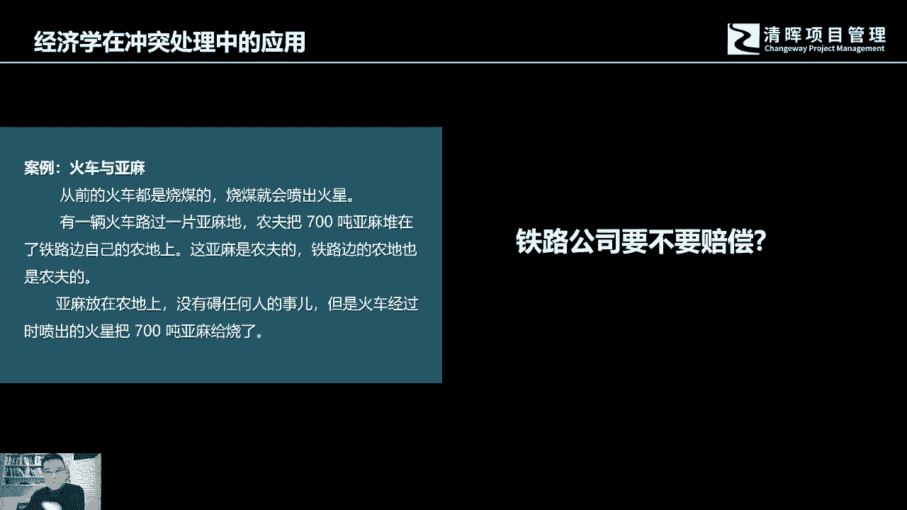
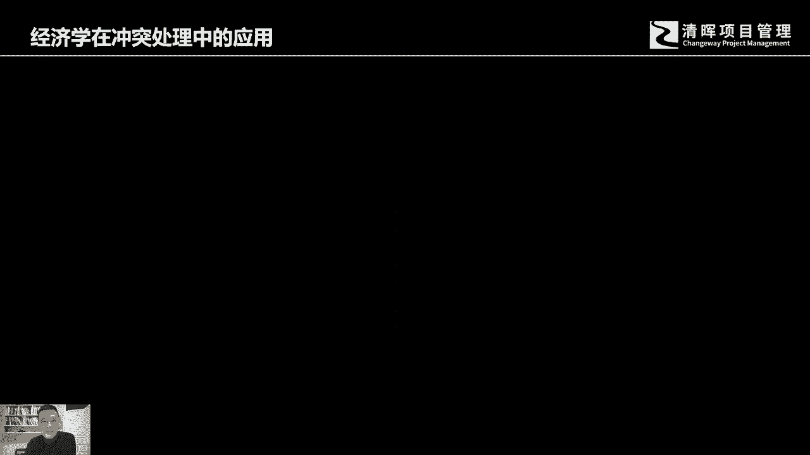
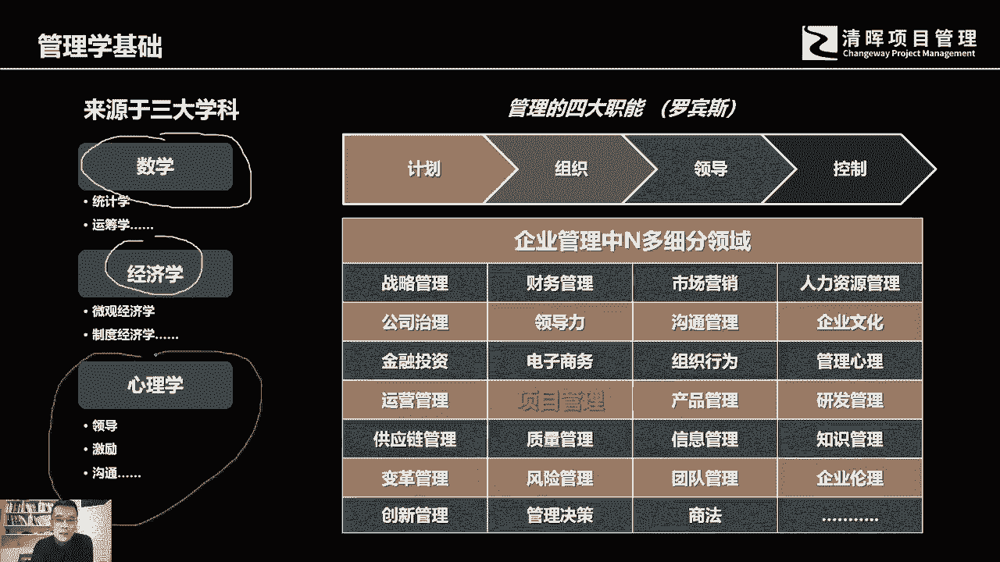
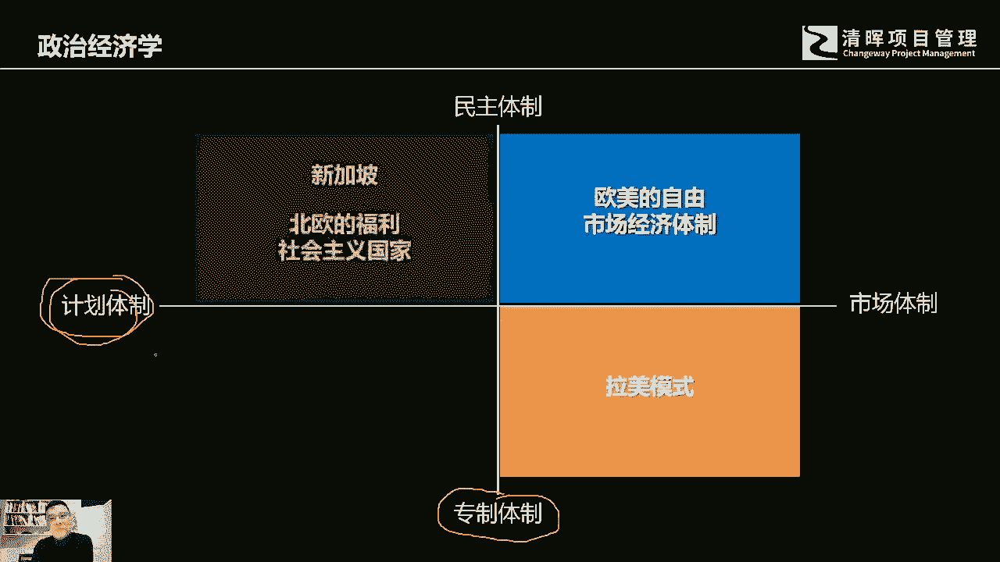

# 什么是项目风险？我们应如何管控？｜ 管理好项目需要的技能有哪些？ - P6：6.管理好项目需要的技能有哪些？ - 清晖在线学堂Kimi老师 - BV14V4y1Q7Rc

好那么为了管理好项目，所有的项目都是需要人去参与，作为人来讲，作为管理者来讲，项目管理是你必须要去学习和了解的，相关的能力以及相应的工具和知识，那么谈到管理学，项目管理是众众多的企业管理。

这个细分领域中的一个组成部分，那么谈到管理的话，它的基本上来源于三大学科，首先的话肯定是数学，数学告诉我们，所有的管理者，我们必须要有量化性思维，我们对现有的价值投，我们对于现有的项目的投入。

项目的价值的产生，我们希望所有的管理者都具备数学思维，所以你会看到一些优秀的企业经营管理人员，都具备，我们经常都会说他们都具备财务知识，其实这个财务知识本身就代表着这些人，他都有啊，这个这个数学思维。

不管你的生意做得大还是小，数学思维都是基本，你哪怕是菜场里面去卖葱的那个啊，这个阿姨或者老太太，他都能很明白今天进了多少斤货，卖出了多少金，成本单价是多少，卖出了多少，哪些那个损耗有多大。

然后我们今天赚钱赚了多少，运费是多少，他一笔账一笔账算的很清楚，所以的话这个数学思维哈，他就是我们管理上面特别要去强调，然后呢，是我们所有的管理者，都应该具备这种量化性的思考。

那么第二个呢说的就是经济学，为什么要去作为管理者，为什么要去学经济学，我们讲管理学和经济学啊，我们经常会说经济学是管天的，管理学是管地的，为什么会这样说呢，其实经济学它讲究的是企业所身处的背景。

没有任何一个企业存在于一个真空环境，它都身处在一个特定的经济环境当中，这个经济环境啊，我们经常一谈，它会是会分为什么呢，宏观经济学，微观经济学，微观经济学，他讲的是什么讲的供需条件。

宏观经济学讲的什么讲的货币啊，投资啊，劳动啊，啊这个这个这个相应的这个啊，这个国家的总体的经济建设，或者是一个大的区域的经济建设，经济形势发展趋势好，所以的话，企业是必然会身处在一个特定的环境当中的。

当你身处在这个环境当中，你作为一个企业的管理者，你必然要去了解当地的，或者你身处的这样的一个经济环境，当你只有了解到相应的经济环境里，所做出的决策才会有价值，才会有成效，你不太可能说脱离原有的这个。

脱离现有的这个这个经济环境，去来做制定企业的经济政策，而且在现在中国是个应该算是一个国际化的，应该是国际国际影响力逐步在增大的国家，中国现在有很多企业已经都走出去了。

你可能会想象不到有很多这个这个中国的，有中国这个外贸金额现在啊这么大，而且这个很多企业都参与到国际化的，这个产品竞争，也会参与到国际化的项目建设，所以在这个过程当中，我们更应该去了解经济，了解经济学。

因为每个国家每个地区它所生。

他这个经济环境它是不一样的，那么一谈到经济学的话，我们相信很多人一直在读书的时候就会了解啊，他是你经常会讲政治经济学，政治经济学，因为政治和经济他是密不可分的，相应的推行什么样的经济。

经济这样的一个啊这样的一个背景，它都有它的相关政策，而且经济这一块是由国家政府去统一啊，有些有些政策它是国家会统一制定的，当然会有你会看到有不同的背景的一些情况，那我们大致的分享类你可能就会了解。

是说你可能就会了解，专制体制经济呢，我相信很多人会知会会会会了解说，我们有计划体制，市场体制，中国的市场经济建设呢是从90年代初期开始，我相信如果稍微年纪大一点的人，比如说类似我吧，当然一丢丢。

为什么呢，我记得小时候我是武汉人哈，武汉人各位应该知道武汉人过早，我们管吃早餐叫过早，过早喜欢吃什么，各位应该知道吧，热干面，对不对，我记得我小时候买一碗热干面，一毛钱二两粮票我都有。

我想我想问一下有多少人用过粮票去买东西，对吧好，那么我们讲这个政治经济学，政治经济学，那么政治经济学里面啊，这个可能啊这又分成了，因为这个市场体制，还有这个我们讲这个政治体制它不一样，它分成了四个区间。

加上一个所谓的市场体制，自由竞争是国家少插手参与市场竞争的，所有企业自由竞争，各各自发挥所长，各自发挥能力，然后通过这个选举制啊，啊那么这个就是很典型的叫欧美的自由主义啊，自由市场经济体制。

那这个像美国典型的经济学派叫芝加哥学派啊，他就是典型的自由自由市场经济，他强调的就是是政府少插手，尽量不要管啊，这个当然你现你现在发现，其实即使是美国欧美国家到了一定时候，政府一定会跳出来管，对吧好。

那么我们再看，它是专制的，你比如说像拉美，像这个阿根廷这个智力啊，这是他军政府，但是他呢市场呢却是自由市场体制，它不是个计划，为什么呢，他离美国太近了，所以别人说那个拉美国家是美国的后花园啊。

是美国的那个后院啊，所以这个里面呢你因为离离美国太近啊，自由主义市场自由主义影响特别深远，而且美国也需要他们把市场打开，所以的话呢他那个那他那些国家也挺怪的，政治呢它是专制体制。

但是市场它也是个自由竞争，所以你会看到拉美模式它就是这样好，计划体制，你会看到像新加坡这样的国家，它是比较典型，而政府机制它是那个那个民族的三权分类的，选举的啊，然后这个市场呢它有它的计划性啊。

控制力非常的强好，那么另外一个象限啊，这个是啊我们就已已经啊不存在的哈，哈一个一个一个国家为例啊，各位一想那个就是苏联啊，有些人还会说他是北朝啊，朝鲜也是哈，所以的话是计划体制，又是一个专制。

那因为这种经济背景啊，我想告诉大家的就是，为什么我们作为一个管理者，我们讲经济学，它是管天的，就是管理的背景，环境的管理，一个企业所身处的实际环境当中的，那么为什么要了解这个，因为这是个必然情况。

因为你所做出的所有的决定，都会受到这些因素的制约和影响，你有可能在中国推行的管理方式，管理方法是有效的，但是同样你作为老板，你有机会走出国门，在其他的国家开设自己的分子公司。

那你这个时候要遵循当地的经济规则，那你可能运用到的决策，决策方法流程，参考的决策要素也都不一样好，所以这就写啊，我们作为管理者需要去了解的经济学。

那了解经济学，可能大家会觉得经济学会很大啊，这个好像离我们很远，其实也不近人，其实经济学可以解决团队冲突，经济学中的一些规则和原理，其实也可以解决团队冲突。

我给各位举个例子，各位看怎么看哈，这里有个案例，这里有个案例，这个，这里有个案例啊。

好嗯。

各位来看一看这个案例哈，这个案例我念一遍啊，他讲的是一个，讲的是一个火车和亚麻的一个故事，当然这是个真实发生的一个案子，这个呢是在100多年以前，没有电气化火车，也没有高铁。

当时的火车各位应该知道是烧煤的对吧好吧，然后呢这个火车呢啊铁路公司啊修了这个火车，但烧煤的火车啊，那个烧煤的火车他会经常往外冒火星啊，你要加你要加速，你就往那个糖里面，那个那个燃烧的那个燃烧室里面燃烧。

塘子里面要加很多的煤对吧，那烧煤它就会自然就会迸火星出来，那有一辆火车呢路过一片亚麻地，农夫呢把700吨亚麻都堆在了铁路边，但这个铁路边的那个农地啊，那个农场的那个片地啊，是属于那个农夫的。

属于那个农场主的，这个亚麻是农夫的，路边的地也是农夫的，那这个时候呢因为亚麻这个可燃物嘛对吧，它是容易点着的，放在农地旁边呢，没有让没有阻碍任何人的事，这个这个事也没有去阻挡那个铁路线。

但是他只是在那个铁路线旁边，结果那个火车开过去冒火星，结果把这个亚麻给烧了，我想请各位问一个问题哈，你认为谁应该负责任，铁路公司应不应该赔偿钱，给这个我们讲这个企业，这个这个农场主都可以想一想。

其实各位应该想得到哈，其实在当时你做过判决，当然是这个火车农村赔这个火车，这个铁路公司去赔偿这个农场主，但是那个法官呢就其实是有自己的意见，后来法官呢就在那个判决书的下面就写了一条，他类似这样的情况。

原则上应该负主要责任的，应该是谁，是农场主，为什么呢，这里举这个例子是其实是想告诉各位，其实想告诉各位哈，在处理所有的这种矛盾当中，谁解决问题的成本代价越低，谁就应该负主要责任，我们在生活中。

我们在这个团队冲突当中，我们不可能凭着所谓的感觉，去来做相应的决策和判断，但是我们如果遵循相应的原则，好比如说这个经济原则，谁来调整改变，做出改变的代价越低，谁就应该负主要责任。

说白了就是如果农民把这亚麻挪开，火星见不到这个亚马，它的代价相较于铁路公司改变现有的铁路线，谁的成本代价低，我相信应该是农场主的代价低，农村股的代价低，所以他在今后处理类似的情况，他应该负主要责任啊。

其实就是经济学的一些相关应用，刚才我们讲到了。

还有心理学，因为人是管理的基础啊，所以你会看到所有的这个参与过程当中，都会有人的参与啊，不管你是做什么样的管理工作，所以想跟人打交道啊，就是需要去掌握相应的心理学的一些东西。

回过头来如果你去学项目管理的很多知识，你就会发现其实有很多工具和方法。

它背后都有一套自己的心理学模式啊。

