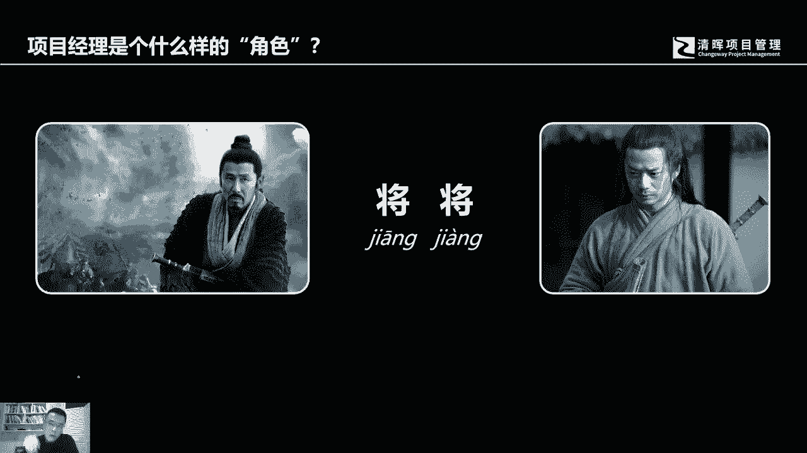
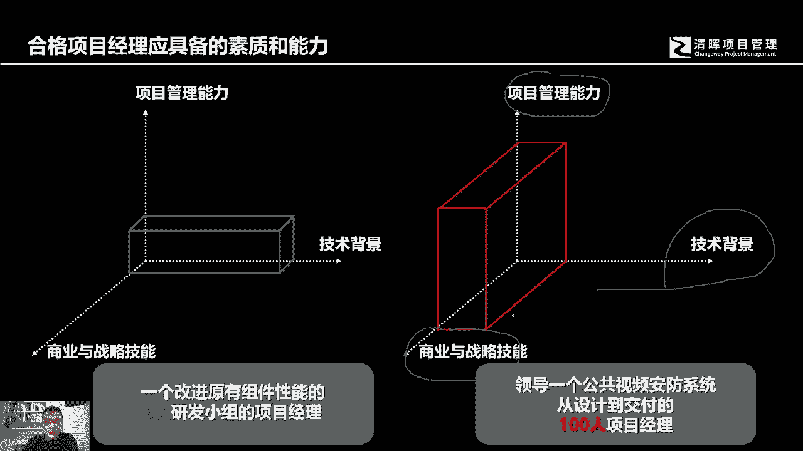

# 什么是项目风险？我们应如何管控？｜ 管理好项目需要的技能有哪些？ - P8：8.项目经理是个什么样的”角色“ - 清晖在线学堂Kimi老师 - BV14V4y1Q7Rc

好那么管理一个项目，管理一个项目主要的角色是谁，主要的角色是项目经理，项目经理是个什么样的角色呢，在我看来，项目经理是一个将将的角色，这个字两个字一样，但中国的这个字都是多音字，这两个字呢应该这样读。

叫将将，前面这个姜是个动词，后面这个将是个名词，为什么我们说项目经理是个将相的角色呢，其实原因很简单啊，这个是有典故的，从哪里开始呢，从韩信跟刘邦的对话开始，当年韩信跟刘邦对话，刘邦问韩信。

他说将军你带多少兵，这韩信就是说我多多益善，那刘邦又问又问韩信，那你觉得我可以带多少兵，那韩信说你充其量10万人，这刘邦一听就心里不高兴，然后就下了个套，他就问他，刘邦就问韩信，那为什么你是将军。

而我是皇帝呢，那如果说这个韩信回答的这个不到位啊，这个一句话说错，可能那个人人头落地咔嚓一下就没了，但是最后也被咔嚓了，对吧好，那么韩信就说韩信很聪明，他说军战将将，而我善将兵。

所以这个这句话呢从他们两个人的对话里面，这两个词是从他们两个对话里面来说，来此出现的，所以那个将将是什么意思呢，说白了就是你就把我管上就可以了，你看你可以带兵打仗，你帮我管上出谋划策，你把张良管上啊。

统筹谋划，集聚粮草，你把萧何管上，你可能不善于带兵打仗，你可能不善于这个统筹规划，你可能不善于出谋划策，但是你把这些人管上就可以，你总管这么几个人，而我们帮你做事，所以你是皇帝，而我是将军。

所以回过头来我们讲说项目经理。

他是个什么角色，其实他就是个将将的角色，在很多时候，如果说我们从事的项目，它的规模不大，你可能会发现你确实需要亲力亲为去动手干活，而之所以你能够带领这个团队，团队成员之所以能够认可你，信任你。

在很多时候恰恰是你能够亲力亲为，做事活比他们干得好，但是如果说一个项目的规模变得很大的话，你不太有可能有机会去亲自干活，你不太有可能亲自去出谋划策，你不太有可能亲自去啊算账。

你不太可能有亲自去带兵去冲锋陷阵，但是你是将军的角色，你不太可能亲自去编写软件，穿墙啊，这个这个这个这个这这这这个砌砖啊，这个这个上网呀，你不看可能轻易行为做这种事情，因为这个规模大了。

如果你真的在这样的一个规模里面去做事情了，而且还是自己亲力亲为做的话，那只能说要么就是你不够格，要么就是委任你成为项目经理的那个人不够格，因为当一个项目的规模扩大以后，技术背景亲力亲为的能力，你有没有。

我相信有，但是在这个实际当中过程当中，你不能去做，你在这个时候，因为管理的团队规模变大了，管理的项目规模变大了，那这个时候你应该发挥的是什么，你应该发挥的是项目的管理能力，然后呢。

各种商业协调战略规划参与的能力，你要知道你的项目为什么会产生，然后因它会项目的结果会贡献什么样的价值，在整个过程中，我们应该如何规划，如何执行，如何去管理偏差，如何去做预测，最终如何去交付。

而不是在这个过程中亲力亲为，去写代码，去搬砖上瓦，穿墙打洞拉线线，你不是做这种事情，所以的话作为一个项目项目经理。

