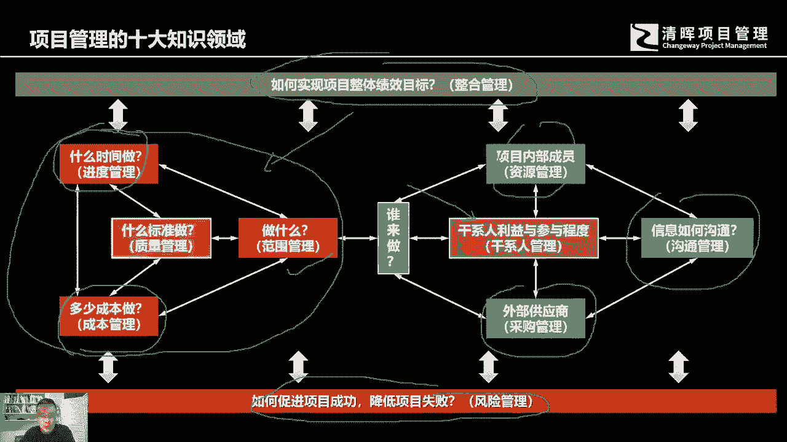
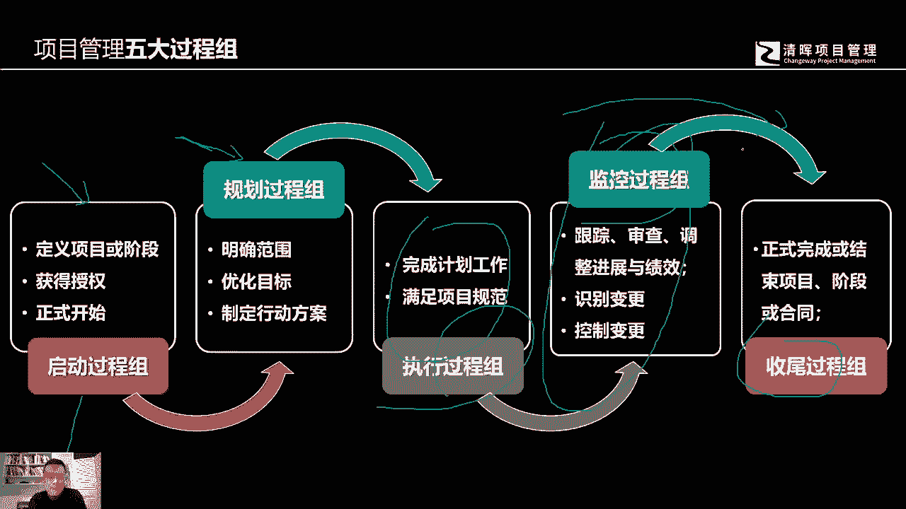
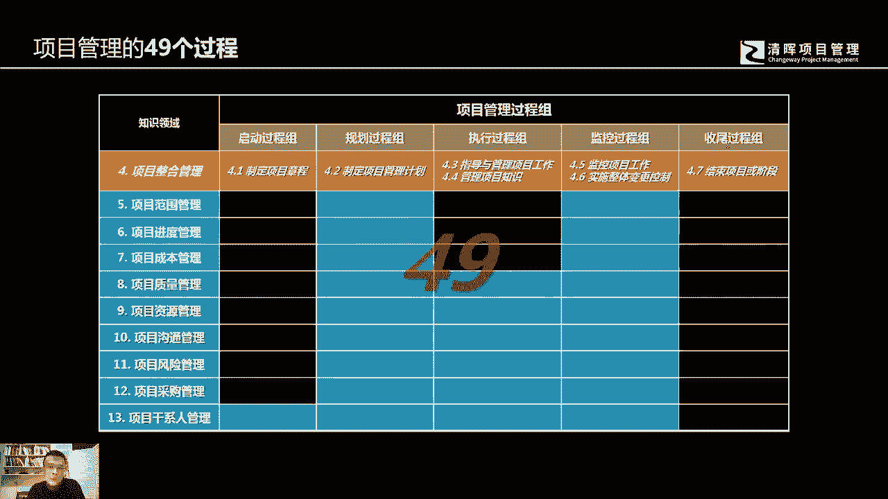
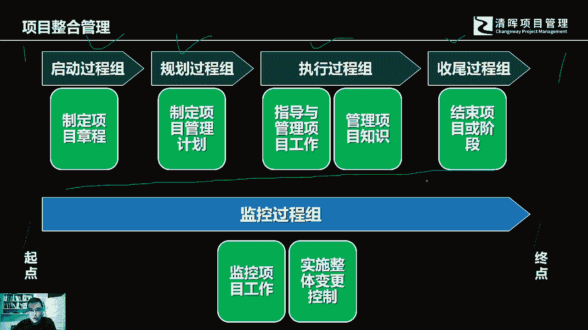

# 什么是项目风险？我们应如何管控？｜ 管理好项目需要的技能有哪些？ - P9：9.项目十大知识领域和五大过程组 - 清晖在线学堂Kimi老师 - BV14V4y1Q7Rc

那么如果你想做好项目经理，做好一个管理者的角色，项目管理的十大知识领域是你必须要去学，那么我们可以去看一下项目管理，它这十大知识领域都涵盖什么东西，首先第一个我们可以看左边的里面呢，各位仔细一看。

好像跟我们刚才讲的那个三重制约很像，对吧啊，这个范围代表我们做什么，然后进度管理就是需需要多长时间做，在什么时间做，然后呢成本管理呢考虑我们要花多少钱，花多少投入，质量管理呢。

就是我们要达到什么样的标准和指标，这些呢都是我们项目管理的相关的硬的知识，但是如果我们要完成一个项目，光有这些车，这些最基本的硬知识还不够，因为我们还要带领着一帮人去做事。

所以项目经理的软技能的要求还是很高的，而且非常高，比你去亲力亲为的这些具体工作的，专业技能要求要高得多，因为你可能要协调各种不同的干系人，有的呢可能是我们的团队成员，有的呢可能是有些部分我们要去外购。

你要跟供应商打交道，除此之外，你可能还会面临着各种不同的，比如说甚至有政府单位的，有公司高层的有同应该是同同样的职位等级的，其他的项目经理，同类的项目经理处置内部的一个公司里面。

不太可能会只开展同一个项目，它可能会有多个不同的项目，那么其他的项目经理之间的一些协调关系，那么还包含什么呢，还包括我们可能会跟最终的用户打交道，会跟中间的相关客户打交道，跟客户的管理者打交道。

这些都是相关的干系人，他们的利益我们都需要照顾到，只要是跟人打交道，都会要牵涉到，都会要牵涉到这个信息，如何沟通好，这是我们项目管理的最基本的八个知识领域，那么这上面还有一个我们叫它整合管理。

整合管理的话就是我们整体的思考，如何去实现我们的项目目标，实现达到我们的整体绩效，那么另外一个知识领域是什么，是我们的风险管理，风险管理呢他强调的是如何促进项目的成功，降低项目的失败。

因为在项目的管理过程当中，因为项目本身的天然的特征独特性，带来了我们的项目，它是天然有风险的，它是有很多不确定性因素的，那么在这个时候，有很多的不确定性的事件或者条件，它都会有可能会发生。

那么我们的风险管理是贯穿始终的，那么在这个过程当中，我们啊这十大知识领域，还要结合着我们相关的五大过程组，去来进行相应的啊这个管理执行规划监控好，所以五大过程组呢是什么呢，是我们的启动规划。

执行监控和收尾，我们的项目经理要被授权，然后在这个过程中，我们要有一个全局观去来规划我们的项目，然后我们会按照大家所共识的标准，以及商定好的管理过程和流程，然后去执行我们的项目，在这个过程中呢。

我们不断的去发现偏差，去纠正偏差，去找到偏离我们当初规划的，这个事件的根本原因，然后制定各种不同的备选方案，然后去执行相应的变更，最后呢我们可能去完成的项目，我们要去交付啊。

然后对我们相关的这个知识经验教训，做相应的总结好。

那么这中间呢就会牵涉到啊49个过程，五大过程组加上十大知识领域，这中间会有49个过程好，那么我们在整个项目。

我们讲这个实际的管理过程当中，它的起点我们之前讲过项目的起点，它是来源于项目的立项，终点在哪里呢，重点在于我们整个项目他有最终的收尾交付，然后呢做完做完总结之后，团队就会解散了。

那么在整个的项目管理过程当中，我们整个的从起点到终点的，这个整个的生命周期当中，我们的五大过程组都会起到相应的作用，我们这个五大过程组呢，它并不是一个简单的线性关系，它是一个立体的相互平行的关系。

这中间呢首先是经历了启动规划执行收尾。

