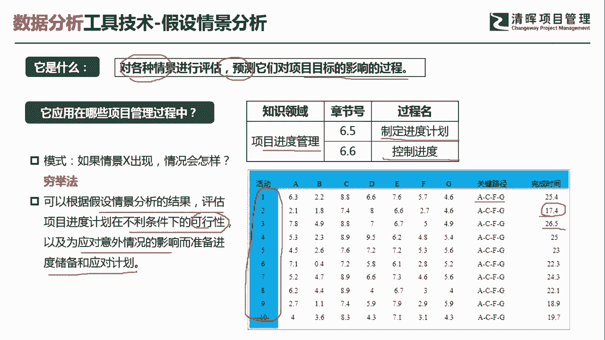
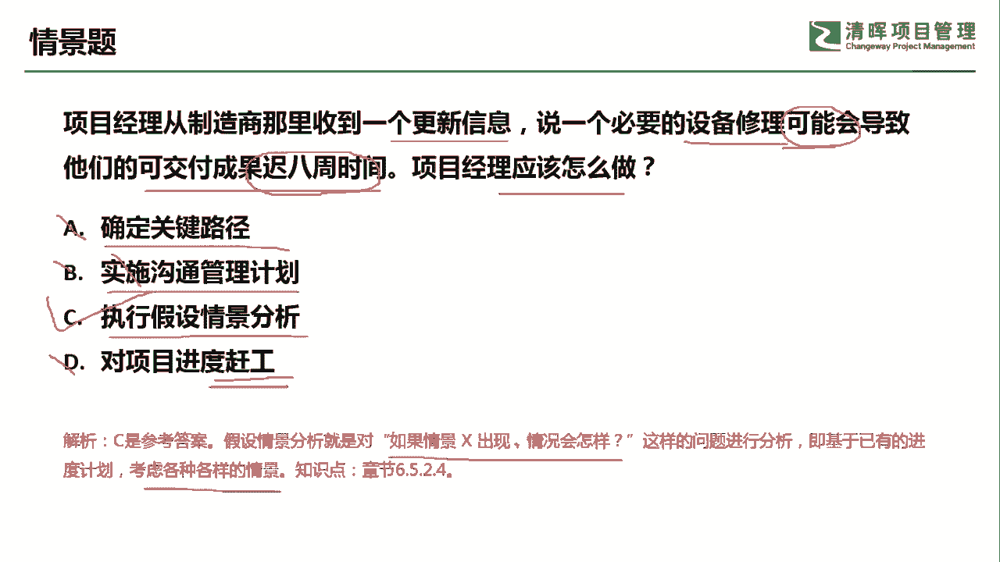

# 什么是项目风险？我们应如何管控？｜ 管理好项目需要的技能有哪些？ - P12：假设情景分析 - 清晖在线学堂Kimi老师 - BV14V4y1Q7Rc

同学大家好，我是宋老师。

今天我们来看假设情景分析这个工具，什么是假设情景分析呢，它主要是对于各种情景进行评估，预测他们对于项目目标的影响的一个过程，所以呢它是叫假设情景，假设就是假设在各种情景，然后呢对他们进行预测。

对目标的影响，假设情景分析在进度管理的制定进度，计划过程中以及控制进度的过程中会使用它啊，他的模式呢一般是一个情景当中呢，会出现一种情况，如果这个情况出现，那么会带来什么样的结果啊，这是它的一个模式。

我们看右边的这个图呢，就可以看到这个呢是一个关键路径的一个假设，情景分析啊，总共有a b c d e f g6 个活动，那么这个六个活动当中的，其中a c f g呢是一个关键路径。

我们把各个活动的持续时间，我们都进行了一个假设情景分析之后呢，你可以估算出来这个关键路径的这个时长，那最高的大概是多少，那最低的又大概可能是多少，所以呢这种情况呢就是一个穷举法，穷举法。

比如说我们举了多少次呢，我们举了十次来进行假设情景分析，这个关键路径，这个呢就是假设情景分析，也就是说我们根据假设情景分析的结果，评估项目进度计划在不利条件下的一些可行性。

以及为应对意外情况的影响而准备，进度储备和应对计划，他是为了这个应对一些意外情况的出现。

然后呢提前做一些准备好，我们具体来看这样一道题，项目经理从制造商那里收到一个更新信息，说一个必要的设备修理，可能会导致可能会导致他们的可交付成果，延迟八周的时间，问项目经理应该怎么做，好像这个描述呢。

它其实就是一个不确定性事件，它并不是已经发生的，他说我的设备修理是要花时间的，所以呢我可能导致我的可交付成果，就延迟八周时间，a选项确定关键路径，关键路径的确定，并不能解决你的这个时间可能延迟的问题。

所以a呢它是不对的，b选项叫做实施沟通管理计划，本身项目就要进行沟通，你当然是要实时沟通管理计划，所以呢b叫做正确的废话，一般的我们选择沟通管理计划呢，前提都是说。

这个沟通管理计划可能会出现一些社会问题，比如说沟通的不畅，某些相关方呃信息滞后，那这种呢我们可以审查沟通管理计划，但绝对不是实时沟通管理计划，c选项执行假设情景分析，假设我的设备真的去修理了。

那我的可交付成果是不是确定就是延迟八周，所以呢它是符合一个假设情景分析的，这样一个这个模式的，d选项，对项目进度进行赶工，那么赶工呢在什么情况下用呢，它是在我们这个延迟八周确实发生了，我们再去赶工。

或者呢快速跟进啊，所以我们这个情景并没有发生，所以不要去选赶工，因此呢我们这道题目呢，应该是选择假设情景分析，也就是对如果情景什么出现，我们情况会导致什么样的结果，它是基于已有的进度计划。

考虑各种各样的情境好，今天呢主要和大家分享的是，假设情景分析这个工具，我们下次再见。

