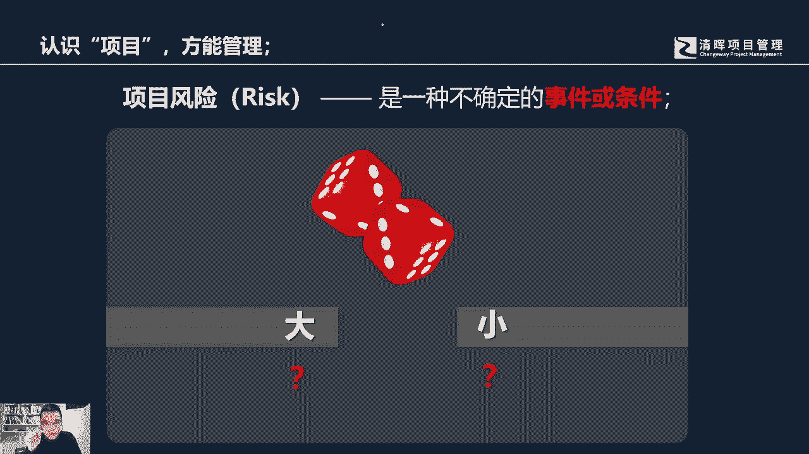
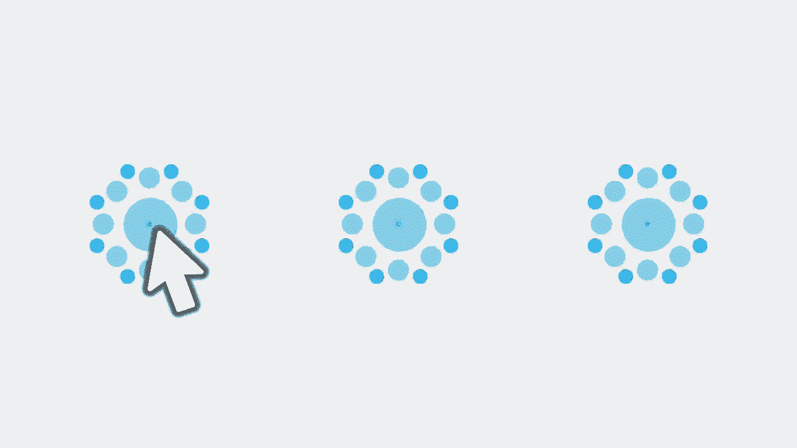

# 什么是项目风险？我们应如何管控？｜ 管理好项目需要的技能有哪些？ - P5：4.什么是项目风险？我们应如何管控？ - 清晖在线学堂Kimi老师 - BV14V4y1Q7Rc

因为独特性所造成项目的风险。

它是与生俱来的，是是他天然所带来的，那么这里提到风险的时候，我们可能要稍微做一下解释，那什么是风险呢，作为项目的定义来讲，项目的风险是一种不确定的事件，或者条件不确定，那什么叫不确定呢。

很多人会以为哈风险只要我们在日常提到风险，就认为风险它是必然的负面，他一定会对我们产生负面影响或者损失，或或者对我们造成经济损失或者损害，其实对于风险来讲，我们对它的这个定义的表达。

各位可能要去认真思考，所谓的不确定并不代表它一定会带来负面的，他只是说当你在做决定的那一刹，那，你并不知道你的决定会造成什么样的结果，因为接下来我们刚才所说的项目的独特性，接下来会接下来你都要面对你的。

在你的历史经验，经历过程中都没有碰到过的情况，所以你在做这个决定的那一刹那，你并不知道你做的这个决定所造成的结果，到底是好还是坏，所以这个不确定指的是这个含义，那么我们举一个更加通俗易懂的例子。

比如说我们我相信很多人都啊都啊去过赌场吧，或者说你玩过吧，或者你没看过赌场，没进过赌场，你至少在我们看到过的很多港片里面，你看到过那个赌场的场景，对不对，假设说有赌客去掷骰子，你把你自己想象成那个赌客。

你去支散子的时候，到底在这个吃下去这一块儿，一次压大还是压小的，你其实这个时候将面临的就是风险，这个时候你并不知道，这个色中摇出来的骰子到底是大还是小，在你压押宝的那一刻，在你去压定啊。

买定离手的那一刻啊，这个这个在那个开宗之前啊，你其实并不知道最终你将面对的是大还是小，有说白了你将不知道你到底是输还是赢，所以风险的项目的独特性所带来的风险，风险其实是你可以把它理解为它是个中性的。

他并不必然带来负面，他也有可能会让你赢对吧，他也有可能是个正面的，只不过在你做出决定的那一刹，那，你并不知道结果，所以这才是项目的风险，所以我们在了解风险的时候，它指的就只是不确定好。

那么因为项目它有不确定性，必然带来风险，那么我们怎么去管理它，我们可以通过一个这样的这样的这个活动啊，这个马拉松有一个启示啊，跟各位去分享一下，在1984年东京国际马拉松比赛的，这个邀请赛中。

一个名不经传的选手三田北一，获得了马拉松比赛的冠军，其实大家可以去想象一下，我们经常看电视转播节目啊，你会看到获得这种长距离跑步比赛的，尤其马拉松比赛，他最终获得冠军的人种是什么。

你会发现经常是黑人兄弟对吧，天然的身体素质会特别的好嗯，耐力特别的强，所以他们经常会获得冠军，所以一个亚洲人，一个黄种人，他能够获得马拉松比赛的冠军，这个有点让人不可思议，后来记者记者就去采访。

他说山田你怎么获得冠军的，三田就说我是依靠智慧，这个说起来有点搞笑哈，这个体育比赛的选手，他依靠的是智慧获得了比赛的冠军，其实3年并不是，只有一次获得了国际比赛的冠军，他多次获得了国际比赛的冠军。

后来他退役以后，写了一本回忆录，揭示了他获得冠军的秘密，他在每次参加，他说自己在每次参加比赛的前一前一前几天，他都会沿着比赛的路线去跑一遍，他会记住，比如说过了十分钟，他会跑过一座桥。

过了30分钟他会跑过一个纪念碑，过了50分钟他可能会跑过一座公园，过了60分钟可能会跑过一个大学的门口，过了80分钟可能跑过市政府门口，然后随着比赛的节奏越来越接近尾声，他远远地看到了比赛的终点的场馆。

他把一个漫长的42km的比赛，切分成了很多的阶段，就使得他能够分阶段的去分配自己的资，源和体力，他不会因为一时比别人慢而变得急躁，他也不会因为一时快过去，快过其他所有的选手而觉得沾沾自喜。

它都是按照自己所规划的这样的一个方式，把一个漫长的不确定的过程变得相对的确定，所以在项目管理的过程中，我相信很多人都会有这样的经验，也许项目会持续很长的周期，1年四个季度，三个季度。

甚至2年3年会有更长时间长距离比赛，我们不知道未来的情况，那么长时间的项目在未来发生会发生什么，其实我们大多数情况下面也不一定真能知道，但是为了更好地去管理项目，我们有可能会把一个项目切分成不同的阶段。

来进行应对，那么在这个过程当中，我们可能在阶段与阶段交替的时候，会设置相应的检阅点，评审点测试点，这就是我们所设置的相关的里程碑，也许在一个离我们近的，离我们做出决策，相对时间点比较近的这个周期内。

我们可能会有很丰富的信息，很准确的数据，中期的我们可能只是适度的，远期呢我们可能只有一个方向是粗略的，但是随着时间的推移，我们不断的可能会去见，会发现项目是信息会逐步逐步的完善，以前适度的信息。

现在因为推进，导致到我们可能会进一步的获得更可靠的信息，以前的这个远期的中远期的信息，我们可能已经只是一个方向，只是一个粗略的，但现在呢可能我们会获得一些，适度的一些相关信息。

就使得我们可以逐渐去明细这样的一个项目，所以项目的独特性也会给我们带来，项目的另外一个特点就是渐进理性，我们在管理的过程当中会去渐进明细，去管理这样的一个项目，所以项目的特点我们稍微总结一下。

我们讲项目管理，讲项目管理，那么什么是项目，项目是啊创造独特的成果的，可交付成果的临时性的工作，所以它有独特性和临时性，因为天然的特征导致到我们管理的过程中，需要对它渐进明细的管理好。

