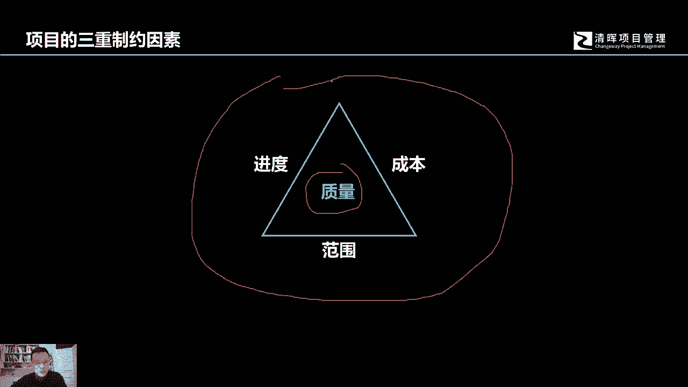
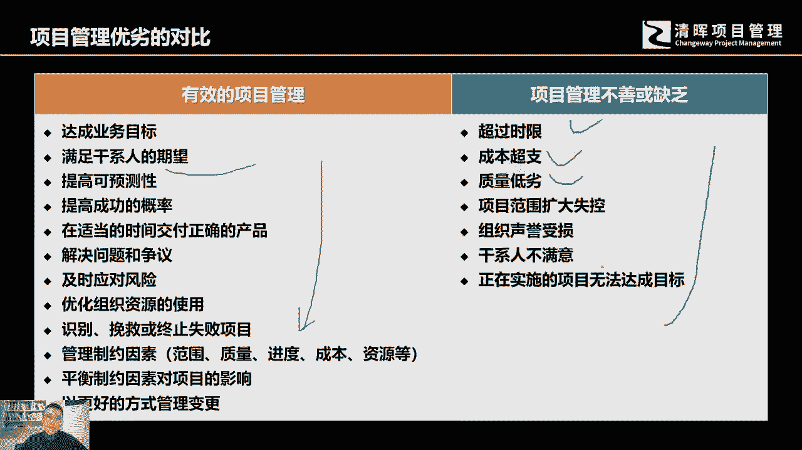

# 什么是项目风险？我们应如何管控？｜ 管理好项目需要的技能有哪些？ - P7：7.项目“失败”得三原因 - 清晖在线学堂Kimi老师 - BV14V4y1Q7Rc

项目它中间有一些失败的原因，我们如何要去管项目，其实有很多原因，各位要去理解，项目之所以会失败，你会看到有可能是因为项目不可能实现，什么叫不可能实现呢，组织现有的资源条件没有办法达到最终的需要。

没有这样的能力，所以它是不可能实现的，那么还有一些项目之所以是失败，是因为我们虽然项目啊，这个不难，我们都有能力应对，但是呢这个时候没有被恰当的管理，这种失败非常可惜，还有失败情况是什么呢。

是因为项目的约束条件太多了，那么讲到约束条件，那么项目有哪些约束条件呢，最基本的范围，进度，成本是约束着项目最终完成的三个基本条件，它形成了一个三角形，三角形呢就形成了一个稳固的最简单的线条。

边最小最少的一个平面，这个时候要在这个时候就代表着，当我们任何一项发生改变的时，候，任何的其他两项都会相应的发生改变，他们是相互制约的，我们讲一个我们经常碰到的一个常规情况来看。

我们的范围会经常发生变化对吧，所以在座的各位你会去想一个问题，不太可能你在从事的某个项目当中，你的工作范围，就是说你要去做的相关的项目工作，或者要实现的某些功能，客户跟你说从头到尾不会变的。

我们经常会发现，我们的客户经常会跟我们提要求，经常去变对吧，所以这个世界上好像很难存在一个，从头到尾不会发生变化的项目，所以呢范围经常会发生变化，因为三角形形成了一个稳定的平面，稳定的形状。

那么如果范围，也就是说范围的这个范围量，由原来的发生了相应的变化的时候，如果成本在原来的这个啊，这个这个投入上面没有发生变化的话，那他这个就已经不是成为一个三角形，它就会形成一个空缺。

这个空缺就会有个东西溜出去好，那么这个时候你会想，老板就会说我们只有这么多钱，那你那个事儿就事儿还比较多，你看你能不能把这个事儿都搞定好，那如果成本不变，范围还增加了好，那么接下来还有个问题。

那么你既然前置要那么多慢，我们换个方向吧，这个范围由原来的这么多，要增加了这么多啊，增加了一定比增加了一定工作量啊，你如果说钱不能这个这个增加好，那你这样你延长一点工作时间吧，让我总有点呃。

总有时间可以去完成这个工作吧，那如果说时间也不发生变化的话，好那么这个时候又形成了一个空缺，而这个空缺又有一个东西流出去，就溜出去的是什么呢，就是质量，当我们的工作经常会发生增减变化。

我们的工作量经常发生这个被增加的情况，而如果我们的成本投入不发生变化，我们的这个进度又有太大的压力的话，这种时候我们的项目有可能做出来的，是表面看似，但是实际不是他中间溜出去的，就是这个质量。

所以有很多项目之所以失败，就是因为这个压力太大了，好所以在座的各位在学习项目中，我们整个项目管理中的一些基础，最基础的重要的核心啊，这个这个知识点，其实就是对这个三重制约的理解，如果我们啊范围增加。

我们相应的其他的边也会发生相应的增加，如果你不变，你就会发现项目很难得完成，即使完成了，最终它也只是一个表面看似好像是的，但是实际上它里面的这个质量很难去把握，你会看到很多豆腐渣工程就是这个样子。

钱也没给够，工期又很短，工作范围还还还还还这个工作量还比较大，那你说你能做出来做出来一个什么样的东西。

你肯定是质量难以保证对吧，所以一个优秀的项目管理啊，它会啊有效的项目管理，会帮助我们去达成我们所需要的这个目标，然后的话满足干系人的相关期望啊，包括种种啊，当然如果说我们管理不善。

我们就有可能会超过原有的实现，超过时间就有可能会错过商业的竞争机会，你的产品比你的竞争对手晚推出，现在的互联网时代，你会发现赢者通吃这种情况，也许你花了很大的代价和成本投入。

但是你最终得不到应有的商业回报，因为你的整个项目的实施周期时间太长，还包括可能会成本超支，你的成本完全覆盖不了，你最后可能回收的那个收入，那这样的话长期亏损企业也是支撑不下去的，甚至说包括质量低劣。

造成这个投诉，造成商誉的影响，造成整个企业的信用，在整个市场中被人不认可啊，包括其他的一些管理不善的问题。

