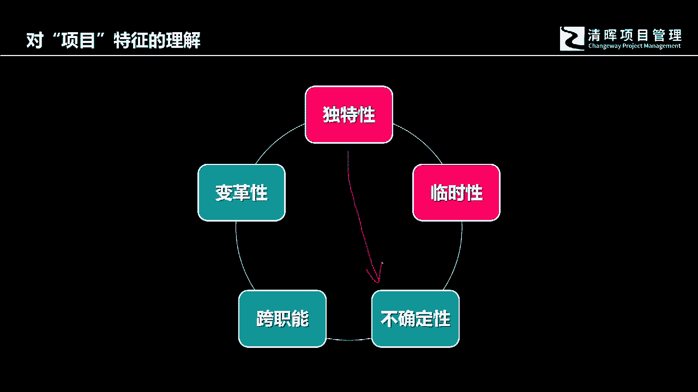
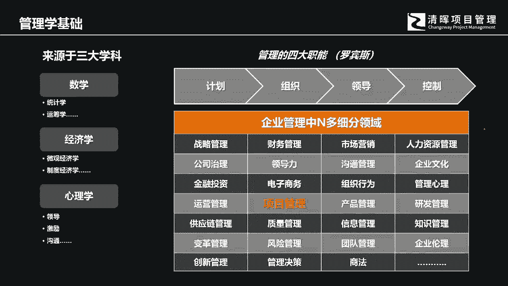

# 从技术走向管理的第一步 - P2：2.管理学基础知识 - 清晖Amy - BV1rr421574M

好那么讲了这么多，我们的项目管理在其实是诸多的管理细节当中，的企业管理细节当中的一个啊分支，一个细分领域，我们如果要讲到企业的管理，那按照robins的管理的四大职能计划，组织领导和控制。

在我们的项目管理中间也是有具体的体现的，所以各位看看五大过程组，你就会发现他也是从啊规划执行啊，我们讲启动规划执行监控收尾啊，这样的方式来体现管理的管理本身的职能。

那非常有意思的地方是任何一个管理的学科，它到管理学科，它是一个综合化的，任何一个管理学科，或者说一些管理企业的一些人员哈，他们都没他们都来自于很呃，来自于这旁边的这些三大学科的这些人员啊。

比如说有可能是做统计的，有可能做经济做业务的，有可能是啊热衷于学习这个心理学的，其实管理它本身就是一个综合化的学科，所以对于这三大学科的学习，在我们的这个PNP项目管理的学习过程当中。

他是有充分的表现的，比如说我们讲数学，数学给我们带来什么呢，数学给我们带来的第一个其实就是量化思维，我们中国人要充分地体会量化思维，当然我们讲说咱们年轻的一代，改革开放以后呃，西方的这个管理。

各种管理学科的这种知识进入中国以后，我们新的这一代的成长起来的管理者们啊，新的这个职场人，其实在这一点上面，应该是有非常非常强的一些体验体会的，中国人的文化传统更容易，因为叫所谓的这个儒释道的内容啊。

他很容易就让咱们中国人很很习惯，用定性的方式去描述，定性呢就是不偏不倚了，就是它中间的弹性会很大了，留给说话的人的这个这个余地是很多的，你不信和回想一下，咱们日常生活中间的各种交流。

很容易体现这个定性的方式的描述，但是在管理的过程当中，我们一定会要会会要用到定量的，为什么呢，这个时候我们就得体会一下什么叫定性，什么叫定量，数学思维恰恰就是要我们用定量的思维。

定性的思维跟定量的思维最大的差异是什么，什么叫定性呢，不同的人对同样一句话的描述，产生各自不同的理解，那就说明现在的描述，这句话它就有极强的定性色彩，因为他留给所有人的思考，空间和弹性都会非常的大。

那什么叫定量呢，这一句话描述出来，所有人的，所有不同背景的人的理解都会是相同的，这个叫定量，所以的话你看我们的无论是目标管理中的smart，质量管理中的一些规格，还包括我们的时间管理。

成本管理中间都会有包括采购风险，你都会看到他都要要求定量的管理，为什么呢，就是使得所有的人能够产生整齐划一的共识，能够形成上下一致的步调，就像刚才我们所说的，项目的有一个特征，因为它是跨职能的。

跨职能的含义是什么，跨职能的含义是所有参与项目中间的，这些团队成员，每个人都来自各个不同的专业领域，既然来自不同的专业领域，那么对于同一件事物，如果你只是用定性的方式描述，它，就会展开。

用自己的专业经验和专业知识，对他来进行自我理解和解释，那么大家就很容易对一个事物产生矛盾和冲突，所以数学给我们的第一个就是量化思维，那么数学中间去体现的很具体的，还包括我们中间会用到统计运筹。

我们仅以就以统计学为例，各位如果可以好，在后面的学习，你会看到我们会学习回归分析，那回归分析它就是一个统计学的点表现好，那么还有参数估算，你看我们叫做这个成本和进度估算的时候。

你就会发现我们会用到参数估算，参数估算是什么呢，它就是把我们的历史数据啊进行统计来发现，这个来对用历史数据的统计结果，以及相应的产生的认知，然后呢，对现有的项目的成本和进度来进行估算啊，这就是参数估值。

它就会用到统计学，但是在自然管理里面也也会用到相应的这个，比如说叫统计抽样，那统计抽样就是什么啊，比如说100件产品，他从中间抽出15%的15件产品啊，结果来进行测试和检测，用少数局部代表整体。

那这个就是会用到统计抽样，它也是统计学的一个表现，那另外一个当然就是经济学，那我就想问一个，我就想问一个各位的个问题，各位对经济学，各位那个认为经济学是学什么的，教什么的，经济学研究什么，各位有感受吗。

今天这堂课没必要没必要，不是个必须听的哈，各位有兴趣就听，没有所谓的强制性啊，我就问各位一个问题，你们认为经济学学什么管钱，政治政治是政治，经济是经济哈，政治谈的是权力的产生和分配，经济还经济形势。

经济学管钱哈，经济学没概念哈，简单来说，经济学不要各位把它想的很复杂，经济学研究的就是人和人的判断，资源配置，呵呵呵啊，经济学其实研究的就是人和人的判断，人如何做出决策的，你们可能想象不到吧。

经济学居然不研究钱吗，经济学当然研究钱，每个人都想利益最大化，但是经济学研经济学研究的是人在情境下，在不同的情境下做出决策的时候，如何是如何做出决策的，他怎么去趋利避害的，我们当然讲比较浅显的。

会认知说经济学他就是研究研究钱啊，或者研究这个经济发展呢啊，其实经济学如果要细分，各位应该知道它是分宏观经济，微观经济，宏观经济无非谈的是什么土地啊，投资啊，货币啊啊劳动啊，人口啊，国家经济政策啊。

贸易啊对吧，那微观经济学谈到的是什么，微观经济学谈到的就是供需条件呢，供方和需方啊，这跟我们的项目管理是有直接的关联关系的哦，但是同时宏观经济学上面的研究内容，你以为跟我们的项目的日常管理也没有关系吗。

也有极强的关系，这个时候我们在上课的时候，会一一跟各位做出解释，简单来讲，经济学其实研究的就是，人和人如何做出决策和判断的，可能跟各位的想象完全不一样，所以我们会发现一个很有意思的情况。

所有经济学的学者，包括得诺贝尔经济学奖的学者们，很多都是心理学的教授，也是心理学的学者，所以经济学跟社会心理学跟人的心理学，其实是有极大的关联关系的，他研究的是人在不同的情境或环境下面。

如何做出对自己有利的决策，那他不断的去研究这种决策，比如说我们后面会讲到的一些，经济学的一些决策，你看到经你会听到经济学的一些名词，比如说沉没成本，其实沉没成本在心理学上面它叫沉没效应，还有呢机会成本。

还有呢还有就是我们讲说这个呃沉没成本当中，沉没效应当中，我们如何去利用它来掌握或者驱动人，做出我们的相应的选择啊，所以经济学其实挺有意思的好，那么，怎么PPT是微观的，呵呵PPT是微观的哦，金曲。

当然因为我们现在要讲的是跟项目有关系吗，项目的宏观经济学研究的内容，跟项目的关系有受到影响，但是还没那么急，直接微观经后你只看到了这个词，然后难道你没有看到后面我还打了六个点吗。

我们的我们的教我们的教案上面，那还有还有还有六个点吗，我不能描述的，还有那还有制度经济学啊，还有还有其他的呀，对吧，我们只用六个点来代替了，篇幅有限对吧好，那么还有心理学哈，心理学其实是呃。

当然我们讲说你作为一个很优秀的领导者，我们在学习偏僻的这个嗯沟通管理，资源管理，干系人管理，你都会发现中间有一些内容和技巧，工具和方法都会跟心理学有直接的关系。

