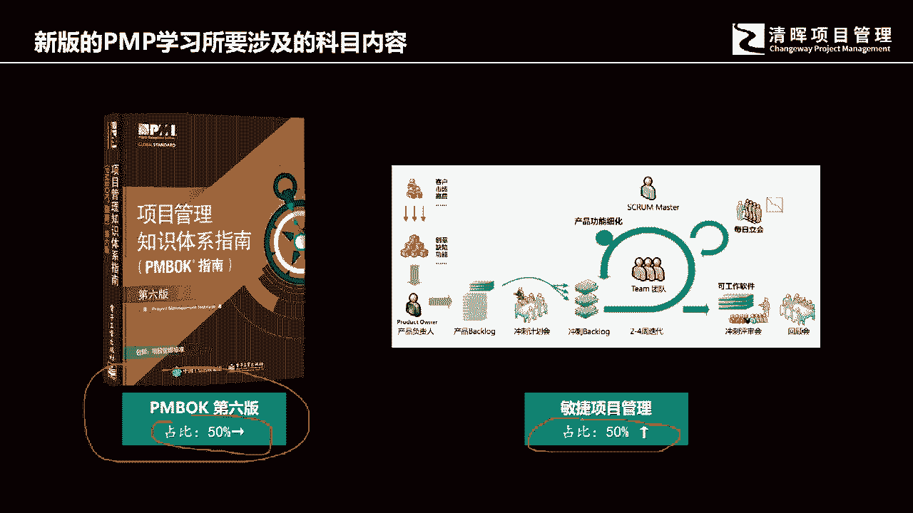
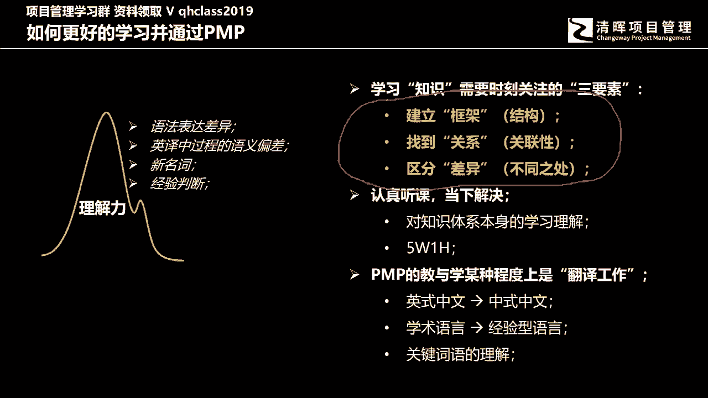
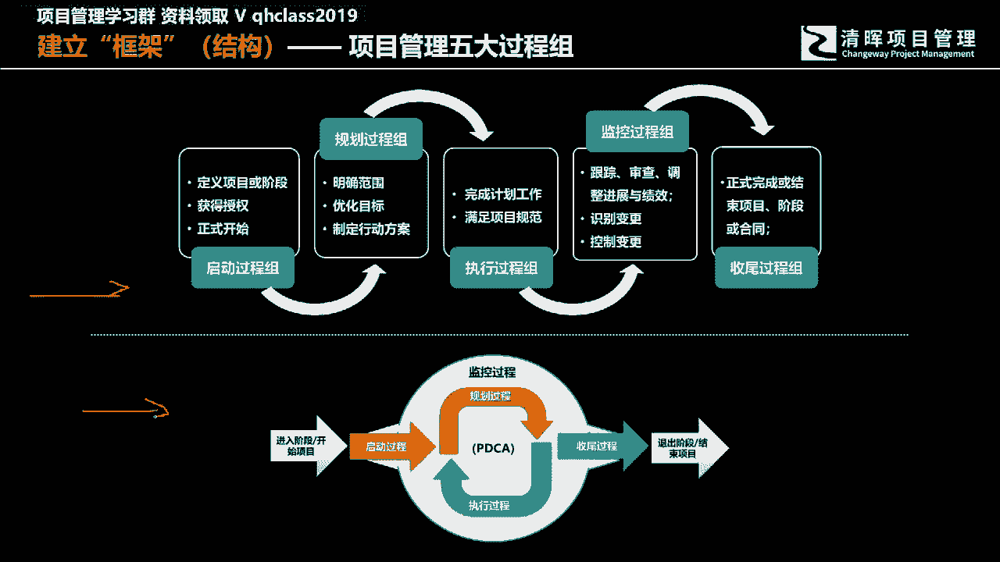
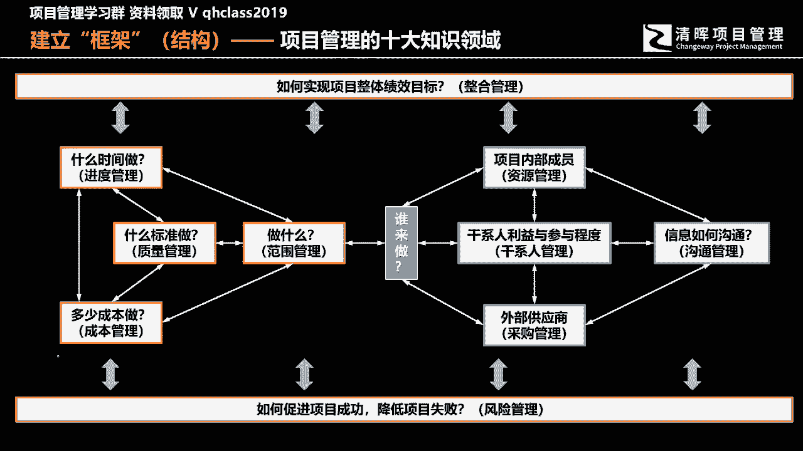
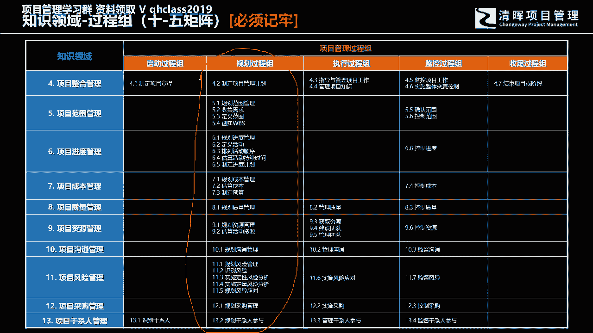
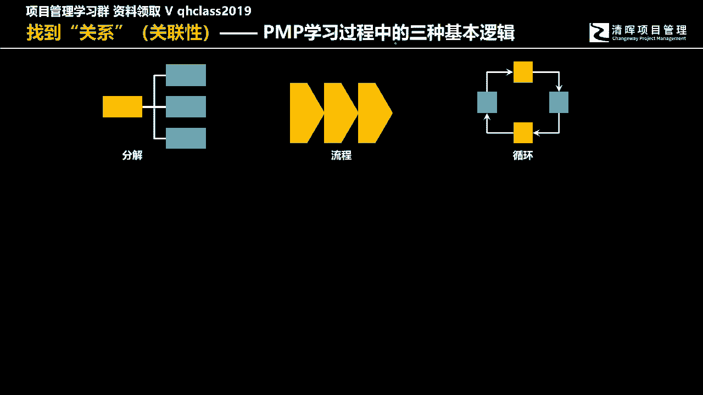
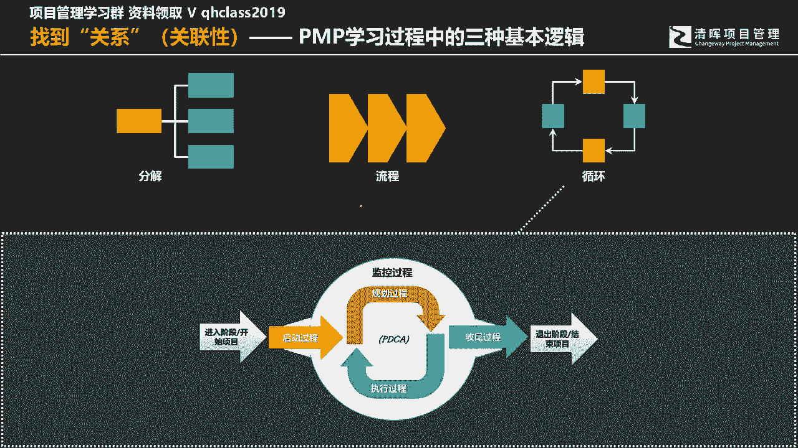
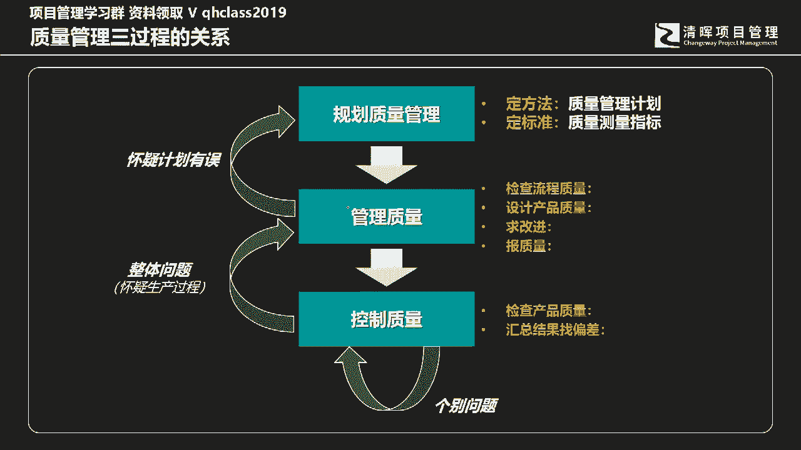
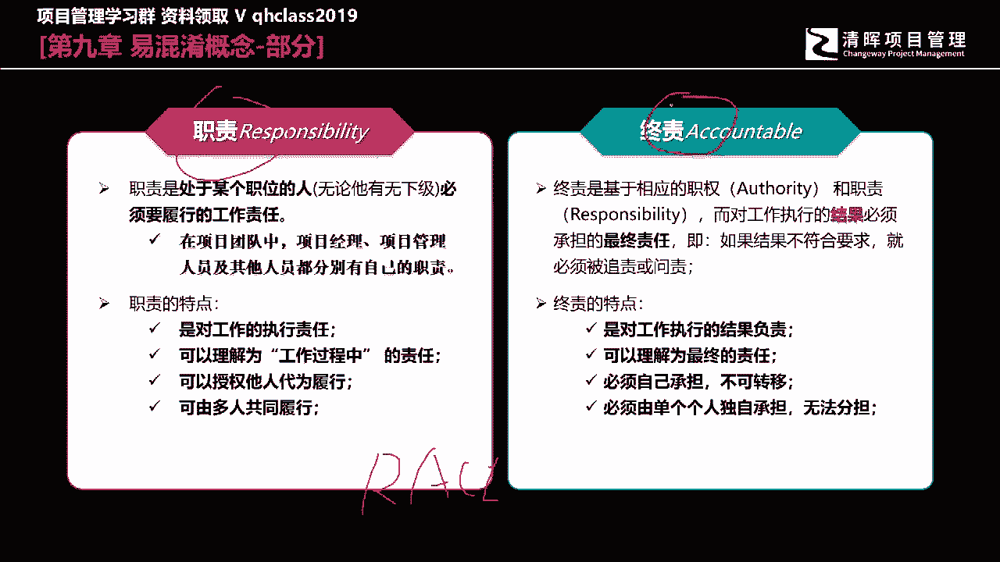
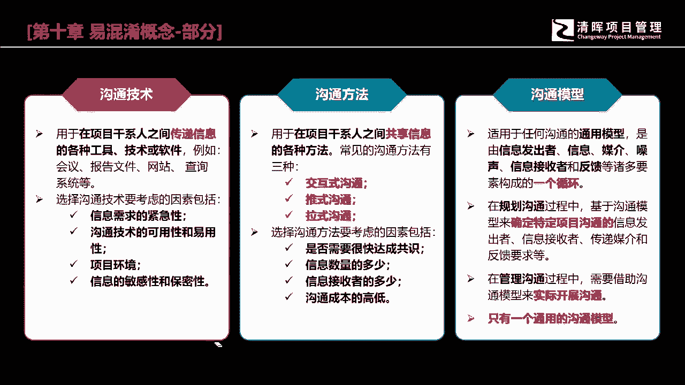

# 从技术走向管理的第一步 - P4：4.学习项目管理知识的基本方法，哪些将是应掌握的重点？ - 清晖Amy - BV1rr421574M

那么接下来呢我就会根据这我们未来的考试啊，未来的学习，我们我就分成了两个部分来跟各位做分享。

一个部分呢就是我们传统的PNP的内容，传统的PMP内容呢，我们这个时候啊要学习的时候，考验的是各位的理解力，以及包括各位的细节的记忆能力，在这个学习的过程当中，我们所要掌握的学习方法其实不难。

说起来不难，但是各位需要在日常是要学好下功夫的，所以在这个过程当中，我给各位提了一个建议哈，其实我们在学PMBO的时候，PMBO各位拿到这本书的时候，第一反应是什么，各位在学习PMBO的时候。

有拿到书的同学，第一反应你的感觉是什么，你的第一反应感觉是什么，当你拿到pn book的时候，你的第一反应感觉是什么，有拿到书的同学吗，厚厚有点厚，还有呢重吗，重不重，太厚了，700多页，对不对。

太厚了，OK所以当我曾经拿到PMBOK第六版的书的时候，我最早第一次拿到的时候，给我的第一反应是，我的天哪，这本书不是拿来学习的，是拿来锻炼身体的，也许我通过两三个月的学习啊。

也许知识啊掌握了同时呢体力还增加了，每天扛着这本书跑，也许我的这个这个这个跑步的，这个这个这个体能啊会得到进一步的提升，第一反应他是足够足够厚，足够重啊，可以挡子弹啊，可以可以打，可以砸的死人啊。

所以在我们学习的过程当中啊，因为它是以十大知识，引领领域的方式进行展开啊，他书里面分了三大部分，但是我们具体在讲的过程当中哈，他分了三个啊，它是它这三个组成部分，我们要真正学习的是以十大知识领域的方式。

进行展开的这个章节，那以十大知识领域展开的时候，它有个非常大的问题，如果各位有去看这本书的话，我相信第一次看这本书的人，翻了头几页，你可能会把你曾经顽固的失眠症给治好，因为翻几页你就睡着了。

在这本书它没有什么，他没有例题，他没有故事性，大量的概念全部是一些概念的解释，所以你还没翻几页，你就会睡着，那怎么解决这个问题呢，如何把这个十大知识领域，这么这这么区隔的很清楚的。

这样的一个这样的一个啊知识体，这在一些知识内容给真正好好的学，跟真正的好，应该说是学习好呢，其实我这里跟各位介了介绍了一个方法，这个方法是什么，就是这里面其实也是在考验我们双方的配合哈。

第一个呢我们就是要建立框架，第二个我们要找到联系，第三个我们要区分差异，建立框架，其实就是我们要通过123章的学习，去来了解整个整本书的结构体系，其实今天我就跟各位要去讲结构体系，第二个呢。

我们要找到知识点跟知识点之间的联系，这个联系在座的各位，对在座的学员来讲，其实是有个很大的挑战的，他其实是要考验的是讲师的功夫，说白了，讲师是有责任去来跟各位，去把所有的知识点做相应的连接。

去来产生相应的联想，因为对于人来讲，对于人大脑，每个人在学习的过程中，大脑一个很偏向性的东西，就是越孤立的知识，他的记忆力是越差的，而这个知识联系点越多，触点越多，关联性越强。

你对这个知识点的理解和记忆就会越深刻，但同时你还会在学习的过程中发现一个问题，就是你会发现在这本书里面有很多的具体概念，它的英文单词还有中文词句非常的相似，我们在考试在学习过程中的理解。

都会产生模糊混淆的情况，所以在这个过程当中，作为讲师是要有责任跟各位去来做这个区分的，去区分清楚那些很容易让各位混淆的知识点，而在这个过程当中，我的课程当中，也会带领着各位去来做这样的一件事，情。

包括今天的课，你都能够看得到一些最基本的内容。

所以我们第一步要学习PN，我们分了两个部分，一个是针对PMP，一个是针对什么，针对敏节，一个是针对瀑布式的学习，一个是针对敏捷的学习，在今天我都会跟各位去做一些介绍。

那么第一个各位要看到我们在学习的过程中，首先是要有一个建立框架和结构的，有了一个总体框架，有一个整体的认知，有了整体的一个认识，那么所有的知识在里面都会有它具体的位置，否则的话你就会变得是学的时候。

你是学的是盲人摸象，你只是看到了局部，而没有一开始看到一个整体，等我们看到整体再往里面去填细节，我们所有的知识就会变得非常的紧凑，而且你会有一个从抽象到具体细节，的一个整体认知。

那么我们的框架结构的顶层是什么，框架顶层框架结构的顶层其实就是实物矩阵，第一个就是我们会看到的是，以五大过程组来形成的一个相互联系，启动规划，执行监控收尾，而这五大过程组它不是一个简单的线性关系。

并不是如这条线上面的第一行，各位看到的情况，它不是一个简单的从启动规划，执行监控，然后到收尾的一个简单线性过程，而是一个什么，而是各位应该看到的是，第二个，就是各位在讲义中应该可以找得到这一页。

它是一个循环联系的，相互影响的，我们启动开始进入项目，开始工作，我们规划其实又是在做计划，确定基准，看设计行动方案，然后呢在执行的过程当中，我们会有具体的工作，绩效数据和信息的产生。

具体执行的结果就会对比规划，也就是对我们具体执行的结果，对比规划中间的相关基准和计划过程步调，去发现中间的差异，怎么发现呢，它其实是通过的是监控过程组发现的，去发现各种偏偏差，去来来管理这些偏差啊。

这就形成了一个闭环的过程，从规划到执行，然后通过监控持续来进行滚动，直到整个工作的完成，结果满足了初期的制定的验收标准，我们就可以进入到收尾，所以我们的偏僻的学习。

第一个我们的这个大的组成部分PNP的学习，也就是我们传统的这个瀑布式的项目，方法的学习，它不是一个简单的线性逻辑关系，五大过程组不是一个简单线性逻辑关系，它是一个什么，它是一个有结构的循环的。

是一个闭环结构。

其实是一个闭环结构，那么第二个框架是什么，第二个框架其实就是十大知识领域，这十大知识领域它不是简单的分裂，它是有相应的组合，相应的集合的，你要用一个整体的眼光去来看中间的内容。

而这中间有很多的知识点是相互影响，相互联系的，所以在这个过程当中，也许我们的各个各位来自于不同的班级，每个不同的班级都会有对应的老师去来做，带领各位去学习，但是各位在学习的过程中，最需要去来仔细去聆听。

仔细去推敲琢磨的就是一方面，就是相就是本知识领域本身的具体概念，工具方法，输入输出，同时你要再做一件事情，就去体会本知识领域和其他知识领域，之间的关联关联关系，比如说一个简单的事情。

它都跟资源管理有关联关系，这是一个基本的管理常识，简单来说，你如果要工作的进度变得更快，资源管理也就是我们的人力资源的投入，资源投入的质量水平越高，进度就会越快，这是一个很通常的通俗的道理。

所谓的我们讲说你的能力越强，工作效率就会得以提升，如果放到西方管理学上面，你就会发现，就如这个学习曲线一样，这个学习曲线就是随着人的时间的不断的投入，单位时间的工作效率，随着你的练习的水平。

练习的投入时间越来越多，你的时间效你的工作效率就会越来越高，越来越高，那么你的这个时间周期也就做相同工作的时候，所做的这个时间周期就会相对越短，但同时你要面对的一个是反向的关系。

就是你所引入的专业技术水平的人，员的能力越强，它的要价也就会越高，那么在成本管理的时候，你就会发现能力越强，成本就越高，它就会形成一个正弦正向关系，那么进度跟成本之间都跟资源有关系，进度那么进度越快。

你所需要的资源就会越好，但是同时成本的支出也会减，也就会越高，这就是一些最最基本的一些逻辑，当然还包括我们讲说中间你要去来进行的，其他的一些工作，比如说我们讲说这所有的点都跟一个。

这所有中间各位看到的这些知识领域，都跟一个东西有关系，就是风险，就是风险，因为所有的过程都会有风险，所有的知识领域都会有具体发现风险，识别风险的工具，那么在那么到第这个11章，风险管理的学习过程当中。

我们就会来具体的去来进行展开，但是在此之前，其实我们我就再举一个例具体的例子，比如说像范围管理，各位如果第一开始学习，老师们就会教你，这里面有个大有有个非常核心的工具叫WBS，WBS是工作分解结构。

把我们的工作通过逐步的逐层的分解，从抽象宏观变得细节具体，使得我们的工作能够具体怎么展开，下一步该怎么做，能够得到一个具体的基础，能够获得相应的这样的一个，前期工作的一个支撑，那么它跟风险有什么关系呢。

WBS其实跟风险管理有最直接的关系，做WBS的工作的这个人，也就是你要做工作分解的时候，这个人的专业水平和曾经的经验，起到了非常大的作用，简单来讲，如果你没有类似的工作经验，你是无法做工作分解。

如果你是一个项目管理的团队的经理，这个时候你可以通过这样一个方法去来发现，我们的项目团队中间人员的能力水平，是不是有这样的经验，真正可以开始这样的工作，很简单，你让他你就问他一个问题。

这个工作到底该怎么做，你用WBS，你说你把这个工作给分解一下，如果它能够分解，而且分解的很清楚，中间的依赖关系，层级化的关系非常的清晰，就说明他是有经验的，那如果说他是没经验的，他就没办法分解。

如果你要用这样的人，那开展继续接下来的工作，你就会发现你要面对无数的风险，成本也会越来越的高，而且你还要花时间和资金的投入对它进行培训，而且你的质量也会受到影响，各位能明白，各位能明白吗。

这就是我们讲说你要建立框架，你就你要去建立框架，所以这个框架的学习它是需要老师的引导，各位在学习的过程中，所以我今天这堂课，为什么要在这里去讲这个内容，原因就是要各位一开始就有这样一个铺垫。

要知道自己该怎么去学这个东西，我们的十大知识领域它不是独立的。

不是分割开的，它是有相互影响的，那么以十大知识领域和五大过程组相互的结合，你就会发现他们就形成了这实物矩阵，49个过程，这49个过程中间也有很多有意思的地方，比如说我们看到五大过程组。

中间数量最多的那个过程组，过程最多的过程数量最多的那个过程组，就是规划过程组，各位发现没有，知道为什么吗，知道为什么吗，这就是管，这就是项目管理的具体特征，独特性造成的。

因为独特性我们知我刚才又跟各位说过，独特性其实是你把它翻译过来，其实就是项目要面临的风险，简单来说，任何一个组织，任何一个个人，无论你是开展工作还是日常生活，当你在面对风险的时候，你只有两个方。

你只有两个，和你只有两个类别的工作可以真正来应对风险，一个就是充分的经验教训总结，另外一个就是对未来的认真仔细的规划，所以在项目这种具体的商业活动，展开过程当中啊，项目工作展开的过程当中。

为什么它在规划过程中会有这么多个过程，规划过程组中的过程为什么这么多，原因就是因为项目的独特性，因为它是有风险的，我们必须静下心来认真仔细的规划，以减少风险发生的概率啊，这就是原因啊。

但这是你要背的哈，这是你要背的好，那么建立框架的时，那么建立框架结构的时候，在我们这个书里面哈，我们大致是有这样一个逻辑关系，我们的顶层上面，我们的五大过程组，十大知识领域。

再接下来你会发现它会分解成49个过程，然后在49个过程，你会发现每个过程它都会是以ITTO的方式，来进行分解的啊，来进行这个描述的，所以的话我们的这个整本书，其实它也可以用WBS的方式啊。

工作分解结构的方式来进行拆解来进行拆解，注意五大过程组，十大测试领域49个过程，每个过程都是以ITTO的形式进行，描述和呈现啊，你可以来进行这样的一个分解好，这就是我们讲的是啊，我们的这个框架结构好。

那么接下来呢接下来呢我就想说，这里面我们要找到一些相应的联系，其实整个PNP瀑布式管理的学习的过程中，整本书三个最显著的基本逻辑，第一个就是分解数，第二个就是流程关系，第三个是什么，就是三。

第三个是闭环的循环逻辑，那举具体的例子，各位可以看一看。

第一个是什么，我们讲说分解结构，在我们这本书里面的分解结构非常的多，除了刚才我们讲到的WBS工作分解结构之外，它还有什么，如果按照我们的学习的过程来讲，我们的项目前期工作其实是商业分析工作。

商业分析工作，我们的产品分解结构，是依托于商业分析工作的成果交付的，商业分析的成果交付，中间有一个内容就是解决方案的范围，他明确我们的项目要去做什么，项目管理的工作是在干嘛，呃，你的项目的工作的。

你项目工作的这个核心在于如何去成，如何去开展工作，他强调的是号啊，你怎么做，那么我们在整个pp的学习当中，你碰到的这个第一个BS其实是产品分解结构，然后呢，产品分解结构再往下就会有工作分解结构。

然后到了进度管理，你会把工作分解结构的底层的工作包，再进行进一步分解，分解成具体活动，也就是我如何去实施，一个具体的工作包的交付的步骤，然后中间还会涉及到resource，resource也是资源分解。

那整个过程中间你还会看到这个风险啊，各种风险的分解，内部的外部的管理的技术的啊，还有这个财务的采购的各个方面的各种风险啊，你可以来进行分解，同时呢管理的过程中，人力资源的来源，人力资源的来源。

会通过我们讲说这个，这个各个职能部门来进行分派啊，所以的话你还可以，你还可能会看到一个结构，就是OBBS，也是组织分解结构，所以任何一个分解结构，任我这里面提到的任何一个分解结构。

都会以一个逻辑分解树状图的方式来进行呈现，所以所有下面提到的这些具体的分解结构，最终都会你会发现它是一个逻辑树状图的结构，来进行来进行呈现的啊，这就是我们讲说，你在书中可以看到很多的这种分解结构的。

这样的一个逻辑分解的这样的一个逻辑好，然后呢再举具体的例子，各位就可能会有更有感触，就是我们的项目管理计划，你看我们的项目管理计划，就是一个典型的啊逻辑树状图对吧，它里面就有what啊。

也就是所有的包含什么东西，它里面包含三大项啊，项目基准，项目的仔细划，还有其他组件啊，每个三大项，这三大三个，这个三大项下面还会有具体的二级分解，那我们的这个项目基准会有三大基准子计划，会有十个。

其他的六个子，六个这个其他组件啊，所以你看到的这个关联关系哈，我们在整个书里面的关联关系啊，你就会发现它有很多的，这是以逻辑树状图的方式去来进行重现的，那第二个逻辑是什么，第二个逻辑是流程，又是流程。

那第一个流程你会看到贯穿我们书中间，如何进行管理控制的，关于进度，关于成本，关于范围，关于资源，他们其实是在实际的管理工作当中，它是有先后逻辑顺序的，所有的工作都是要依靠前项工作的完成。

前项工作的高质量的完成，才能够得到后续的工作的开始和高质量的完成，否则的话，后面的工作是无法得到有效的开展和完成，比如说我们要做进度管理，进度管理就是踩在范围管理的肩膀上，才能够完成，没有范围的分解。

只是一个笼统抽象的工作呈现，那么这个时候你想来安排具体的进度计划，你做不出来，如果没有具体的进度计划，你就无法来往中间去分配，具体的人力资源的安排到底在哪个步骤，需要多少人。

需要什么样类别专业技术的人员参与，才能够完成这项工作，你无从谈起，如果没有资源分配作为前提，我们的成本估算也无法进行估算，我们的预算也无法进行制定，所以在整个书里面都会有这样的。

就都有大大小小这样的一些逻辑，它是以过程的方式，是以流程的方式去来进行重现的，那各位在学习的过程中要找关联，我们讲说既要建框架，有一个宏观的认知，要通过分解结构来进行呈现，因为单纯的抽象和宏观。

你无法来具体开展这个具体工作的，所以我们讲说宏观和具体，宏观和微观，具体和细，具体和抽象，它是必须要对立统一的，那么另外一个就是你会看到的，就是我们看到的，就是这个流程的这样的一个流程结构。

那么这个书里面还会有一些贯穿性的流程，还包括什么呢，交付物的结构啊，交付物的流程，那我们的所谓的可交付成果，它要经历相应的过程才能够最终被交付完成，在这个书里面，它也有会有这样的一些贯穿性的。

一些这样的一些流程，那当然各位在学习的过程还会碰到什么，流程变更，管理控制流程问题，解决流程，风险管理，流程冲突管理流程，我们讲采购过程当中的争议，管理流程也发生了，采购中间的一些关于这个推定变更。

和这个有争议的变更，我们该如何进行处理，它也有它的一套流程，如果在资源管理中间，团队发生了各种冲突，那么冲突管理的过程当中也会有冲突的流程，如果落脚到具体的考试细节，你就会发现。

类似于流程管理这样的一些考试题目的提问，他有个非常显著的特征，在最后一句话，他就会问你，项目经理在上述的情境当中，下一步该做什么，或者还换换一个方式，它首先应该做什么，事先应该做什么。

这种提问方式都是以流程的方式来进行展开的，所以在接下来的学习当中，当然我们也会清辉在整个学习的过程当中，都会给出相应的资料来供各位进行参考，在咱们班啊，我给的这。

我也会给相应的通过我个人的整理的各种资料，分享给各位好，那么另外一个还就是我们讲循环流程啊，不循环的逻辑结构，这个循环的逻辑，就刚才其实我们已经讲过一个了，我们讲说这个启动规划。

执行监控收尾这五大过程组，它不是一个简单的线性关系，它是一个循环的逻辑关系，它是一个闭环关系，那么这个循环关系我再跟各位举个例子，在书中间是质量管理。

它是一个很典型的三个过程，形成了一个闭环关系的这三个过程。

我们先首先看，如果各位要如果提前预习的话，你就会发现我们的质我们的过，我们质量管理是有三个过程的，第一首先第一个就是规划质量，规划质量做两件事情，第一个我们的质量管理工作该如何开展。

以什么方式来进行呈现呢，项目管理计呃，这个项目的质量管理计划，第二个我们的交付结果，什么叫称其为合格，他就要他就要定标准，那么规划质量管理就会有一个输出，就是质量的测量指标。

那么接下来我们会引用质量管理计划，对质量进行管理，对我们的结果进行评价好，那么这个时候就会有个问题，如果我们发现了交付结果的个别问题，大批量交付结果中间只是个别问题，我们通过QC就可以完成。

各位如果在自己的公司里面，在自己的组织当中，你们在做质量管理，通常也会是用这种方式，你交付1万件产品啊，1万1万个弓箭，中间只是发现了某，偶尔发现了两三个可能不满足规格要求的结果。

你充其量就个别问题个别对待，要么就是报废，要么重新再做一遍，那如果说你发现通过质量控制抽样检查，你发现除不是个别问题，它是大批量的整批问题整体问题，那这个时候你就你就得往上回溯了，有可能在规划过程当中。

我们所以我们所有有有可能在管理过程当中，我们所执行的管理流程，管理方法QA没做好对吧，但是如果说我们的管理政策，管理流程计划都得以切实的执行和实施，但是依然会有大批量的结果被判定为不合格。

那这个时候你得你就得回想一下，你就得回再往上回溯，回溯什么，你就得怀疑计划本身是有误的，你的项你的项目的质量管理计划本身，它的指标制定指标的选项是有问题的，标准的定力过度严苛。

就有可能造成即使我按照要求去开展工作，但是我依然有大批量的结果会判定为不合格，所以你会发现在我们的很多在我们这个书里面，我只是列举了一些些许的例子，告诉各位，我们这里面在学习的过程中。

第二个重要的学习方法，就是我们要找到相应的联系，在联系的过程中有三个最基本的逻辑，那么第三个就是我们我们会发现，很多内容都是有循环关系的。

它是一个闭环关系好，那么这个闭环关系其实抽象一点，讲讲一些所谓的哲理，在我们的日常工作和生活中，最大的荒谬就在于，因为我们在用重重复，用一成不变的方法，却期待得到不同的结果，所以我们在管理的过程中。

尤其在项目管理的过程中，为什么对管理方法要求特别重要，我们要作为项目经理，要特别关注管理的过程，其实原因就在这里，就是因为我们在项目管理过程当中，项目本身的独特性造成我们的交付结果，并不是啊。

我们的经验和我们的知识完全能够覆盖的，也就代表着我们曾经的历史的工作方法和手段，不一定能够在新的环境下面，依然产生我们所期待的效果，所以我们不要唯经验论，经验对我们是有帮助和参考的。

但是我们不能唯经验论，我们都不能够简单地照搬照抄，所以我们得持续不断的去改进，我们一种方法不行，我们就可能会调整另外一种方法去来开出来，开展接下来的工作，使得我们的工作最终的交付结果。

既能满足客户的需要，也能够给公司给组织带来收益和价值，所以过程和结果之间是一个相互循环的关系，所以在整本书里面，各位可以看得到我们的规划执行监控，收尾的所有的这些每个知识领域的这些过程。

它们之间都是一个循环关系好，所以这就是我跟各位总结的，我们在学习的过程中的第二个我们需要掌握的，也就是我们第一个叫做建框，这个大框架有个整体结构的宏观认识，有个整体认知，第二个就是找联系。

找联系有三个最基三个在这个偏偏偏book里面，它有三个最基本的逻辑，树状逻辑，流程逻辑和循环逻辑好，那么第三个其实就是找差异了，这个找差异就变得非常的具体。

在座的各位如果有兴趣，其实是可以call，可是可以截图的哈，我跟各位把所有的章节中间的部分哈，你听清楚是部分容易搞混淆的地方，容易搞混淆的地方跟各位展示出来，并不是我在上课中间所引用的，全部只是部分。

只是部分，比如说第四章容易搞混淆的引导技术，引导研讨位有时候偏P考试，我告诉各位，不管是新版的考试还是旧版的考试，他所要面对的情境是什么，考的就是细节，多一个字少一个字，在考试的时候。

你所面临的情境它是有它是天然不同的变化，那么这个时候我们就得揪细节，而纠细节的过程当中，这本书特别麻烦的地方，就在于它有很多的专业名词术语概念解释，无论是英文还有一些中文，很容易都是容易让我们混淆的。

所以在这个学习的过程中，我跟各位做了很多的功夫，做了很多的功课，各位就可以通过这些图，这些这些这些我们讲说知识卡片的对比，来找到不同的概念和术语之间的差异，然后呢继而对他产生理解和记忆啊，这是第四章的。

那我再跟各位看一看啊，这是第五章的，比如说需求跟踪矩阵和验收标准，很多时候我们就很容易在考试的时候选择错误，需求，跟踪矩阵是5。2的输出，验收标准是5。3的输出，都是输出，考试的时候选题的时候。

我们很多学员很容易搞错，不知道该选什么，但是在上课的过程中，要求的各位是认真听讲，及时学习啊，有问题马上能够解决，第二个就是在于我跟各位都做了提前的准备，所有容易混淆的点都跟各位指出来了。

然后第六章关键路径法和关键路径，多一个字少一个字，结果是完全不一样的，是两个完全不同的概念，那么在考试的时候，有很多时候PMI坏就坏在他故意让你搞混淆，而且还把那个错的答案还写在上面。

让你觉得好像自己选的是对的，实际上呢这种陷阱各位在日常的学习，还包括包括我们备考的中后期，各位就需要来不断的去刷题进行体验，然后找到题感，对这些这个这个概念和题目，做相应的这样的一个啊。

这个概念和题目做相应的一个记忆和强化好，这是第七章的那完工尚需估算和完工估算好，这是第八章的核对单和核查表，然后这这就是我跟各位讲的，那英文单词也有相应相似的地方，中文的表达也有相似的地方。

那么我们有很多学员在考，在考试备考前应该说是不仔细，我们读书的时候读的读的读的，就像刚才有课学同学说我看了两看了几页，看了十多页，我都睡着了，在这样的一个精神状态下面啊，那我们要求所有人都要高度集中。

其实有时候是很难的，我如果不特别把它做出一个对比差异，把它单独拎出来，把容易搞混淆的概念形成卡片做对比的话，我相信更多人更难的把它给记住，所以咱们班的学习，我就会用这种方式来告诉各位如何做区分。

当然这也在现实的我们讲具体的工作的过程中，也是有它的意义的，在这个训练的过程当中，我们虽然通过具体的方式来考试，但在这个训练和备考的过程当中，其实我们是会改变很多，我们曾经曾经的一些积累下来的一些经验。

或者积累下来一些，我们讲说这个经验可能是不是个好经验哈，比如说似是而非，比如说囫囵吞枣，比如说就这样吧，比如说差不多就行了，这种这种在偏僻学习的过程中是一定要避免的。

所以细致细节是整个PMP考试的核心啊，好那么这是第九章啊，职责跟职责，我们讲RACI矩阵，这是我们第九章的核心工具，RACI矩阵，那R代表什么，R代表职责，那A代表什么，代表A代表中者。

那职责跟中则在我们的管理过程当中，即使在实践的过程当中。

我们也要把它个概念给区分清楚，那么到了第十章，你就会发现，那那这三个概念四个字，每个概念都会有两个字是相同，50%的字都是相同的，但他们都在讲什么，所以在沟通管理里面，什么是高通技术，什么是沟通方法。

什么是高通模型啊，我们没有把它给区分清楚，你考试的这个错误概率就会变得更高，这是我跟各位呃，这是我跟各位，来，这是我跟各位来做的这个区分啊，有学员问什么配置管理计划，配置管理计划，你现在先这个不下是吧。

哎我有时候没看这个手机留言啊，这个，配置管理计划，什么叫配置，估计你没仔细看书吧，配置是什么，配置就是我们讲一个一个一个一个一呃，一个可交付成果的物理特征和功能特征，也就是它强调的是结果。

它强调的是交付物，那这个交付物该具备怎样的功能特征，或者是物理特征，它是由配置来进行定义的，那么对于配置的具体管理，它就会有一系列的具体方法，那么这个时候这个管理过程，包括配置可不可以改，可以改怎么改。

它肯定有流程，谁可以批准改，那肯定有相应参与的人员和权力分配，这个就是配置管理计划好，那么刚才刚才有学员说这个独特性，临时性，跨职能性，项目各个核心点困难在哪呢，为什么独特性系项目这么难做呢，那当然了。

独特性因为它是有风险存在的风险它是风险，它是要通过一系列专业方法，才能够对它进行管理的，这个我们在哎，你这个问题都各位现在提的问题都非常好哈，这说明有个这这说明一个事情哈，这说明一个事情。

就是各位要知道哈，我们现在的学习并不是马上去解决问题，而更多的是发现问题，你如果各位各位有兴趣的去看那个吉德林法则，吉德林各位是不是经常会听到一句话，就是当你发当你能够清楚的去描述问题。

当你能够清楚的去描述问题，那么问题就可以解决一半了，各位也听过这句话吗，各位也听过这句话吗，这个，当你能够清楚地描述问题，问题就会就会得以解决，嗯这至少可以解决一半了，各位听过这句话吗。

这句话叫做吉德林法则，这个集的零法则呢其实就是要告诉各位哈，我们首先是发现问题，你先别急着去解决，如果各位在预习的过程中，在预习的过程中一定一定先发现问题，而且你能够就像刚才有个学员。

就像刚才是刚才有个学员，你看这个这个JJM，我叫JAMES，你叫JAMES，OK我多你一个S啊，这个JM说啊，独特性，临时性，跨职能性，这三个项目类型，各核心点困难在哪里好，为什么独特性项目这么难。

你能够提这个问题，就说明你有过思考，同时呢你发现了自己不懂的地方，我们先别慌着去解决，在这本书里面，我相信类似这样你比较模糊的一些概念会更多，你先要我们先第一步是发现问题，把各个我们讲说。

你在阅读预习的过程当中，发现的问题先标注出来，在学的过程中呢，你仔细去听，听完了以后你还没明白，我们单独解决或者说交流集体解决都可以，今天这堂课更多的是帮助各位发现问题。

