# 从技术走向管理的第一步 - P5：5.项目管理者应具有的基本思维 - 清晖Amy - BV1rr421574M

那么我们刚才我们讲了一大堆，讲了一大堆关于偏僻的内容啊。

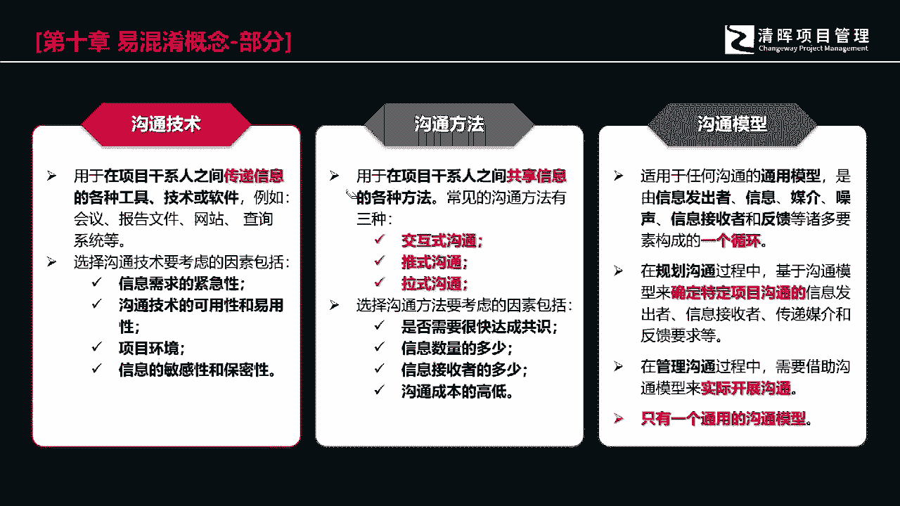

讲了一大堆不关于偏僻的内容，那接下来其实就跟各位去分享一下，关于我们的PNP考试中间的敏捷的内容，所以好接下来还有15分钟时间，但是我肯定会拖堂，我肯定会超过这个时间，有兴趣听呢，各位就听下去。

如果没兴趣听呢，各位可以听回放，我并不特别强制要求各位哈，因为今天这堂课呢算是一算是一个啊，算是一个应该说粗初试探的初见面，然后呢初期的一个总体了解，各位有兴趣有没有兴趣听我把它讲完哈，有兴趣吗。

有的话就写个一哈，没兴趣我就快速过，有兴趣我就讲下去哈，没兴趣我就把它给给给给给快速过哈，好，那么刚才我们其实讲了很多的，关于偏僻的学习哈，pp学习，首先各位要建框架，找关联，发现差异。

那么关于VOCA的学习，我们可能就要换一个思想了，那么关于敏捷的学习哈，我们讲说乌卡环境下面，我们用敏捷的方式进行应对，这个基本概念我就不跟各位去练了，那么首先第一个敏捷并不是各位想象的说。

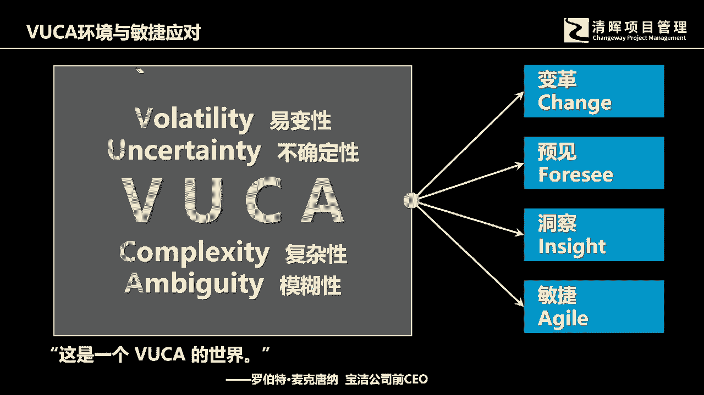

我们在管理的过程当中都是软件公司的啊，用的比较多，其实敏捷的管理更其实敏捷更好讲，敏捷更好讲，如果要面认识敏捷的话，我们先从ZARA开始，各位知道ZARA吗，各位知道ZARA吗，各位买过ZARA吗。

有买过ZARA的衣服吗，ZARA这家公司挺有意思哈，ZARA在我看来其实是呵呵，其实远早于软件公司，用敏捷的方法管理自己的企业，ZARA他怎么管理自己的企业，你就得要从ZARA这样的一个企业背景。

和他这个行业特性来进行了解，来进行了解。

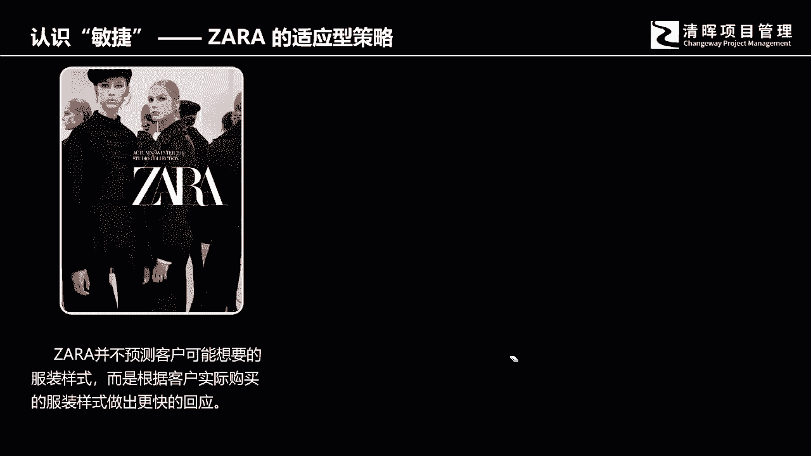

哎对有人说他是快消品，对是就快消品，ZARA其实是一个快时尚品牌公司，西班牙的一家公司哈，嗯各位可以这样去设身处地去想一个问题，如果你是一个服装设计师，现在我问你一个问题，2023年。

整个全球时尚界会流行怎样风格的衣服，你回答得了吗，质不质量的，我们不管它，它之所以叫快速，叫做叫做叫做快时尚产品是有原因的啊，他就是上新快，它并不是质量好，我就问一个问题，如果你作为这个这个时装设计师。

现在我问你，2023年，你要流行怎样的这个这个全球的时尚界，它要流行怎样的服装款式，作为时尚是时尚服装的设计师的礼，你能够做出明确的判断吗，其实你做不出来，你发现没有，ZARA也一样，很多这个服装设计。

服装生产公司，品牌公司它都一样，他的设计师们都做不出来这样的预测，他们只能假设，然后呢他们会做一件事情，以前的方法是什么，以前的方法他这样做，他说他们会设计好多种风格，然后呢都生产出来进行销售。

关键问题在于，这种方式会对服装企业产生一个极大的影响，而且这个影响是很负面的，就是他的打折品会比例会很高，比如它生产十款啊，十个类别，然后有他的服装鞋帽的各种服饰，然后投入到市场，发现只有3~4款。

在这今年才会有大量的客户去购买，它，去崇尚追捧，那当然这个客观原因会有很多客友宣传，当然还有明星效应，还有其他的一些所谓的故事，那么影响消费者的决策，但问题来了，那么剩下的剩下的那些卖不动的品牌怎么卖。

卖不卖不动的类别怎么卖，那么这些品牌公司就会干嘛，就会就会打折卖，所以你最早看到的奥特莱斯，它不是像今天中国的奥特莱斯所谓的工厂店，他就是为了打折去用的，所以ZARA也发现这个问题。

ZARA也面临这样的一个困境，那ZARA后来怎么办呢，你看到ZARA的一个一个一个贡献是什么，他就是改变了原有的传统的行业领域，中间的运作方法。

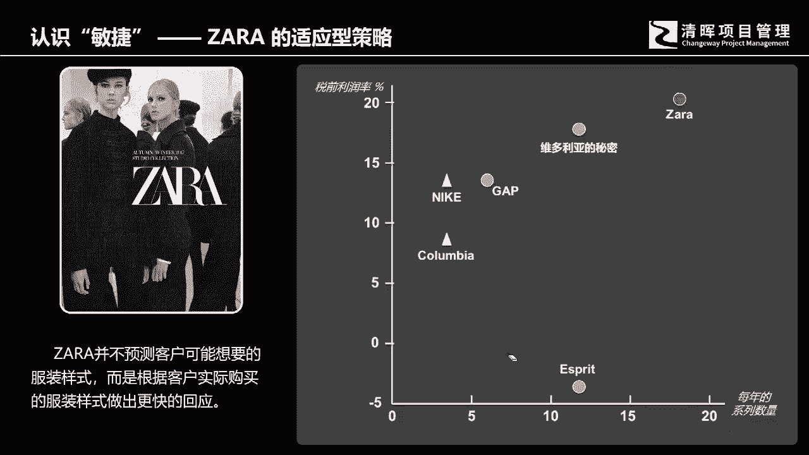

他在上个世纪就开始在做调整，在他七八十年代就开始做调整，这家西班牙的这家公司哈，他的母公司叫蒂泽诺，他在西班牙是全球的这个，四大时装零售集团之一，类似像HM。

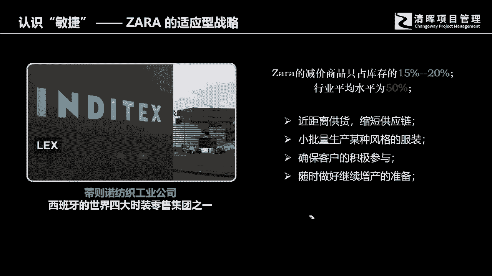

像这个gap，美国的这家公司，gap也是四大品牌之一，还有包括瑞典的HM，还有包括这个应该是记得荷兰的一个CNA啊，荷兰的一个CACNA，还有这个HNM，这就是是所谓的四大。

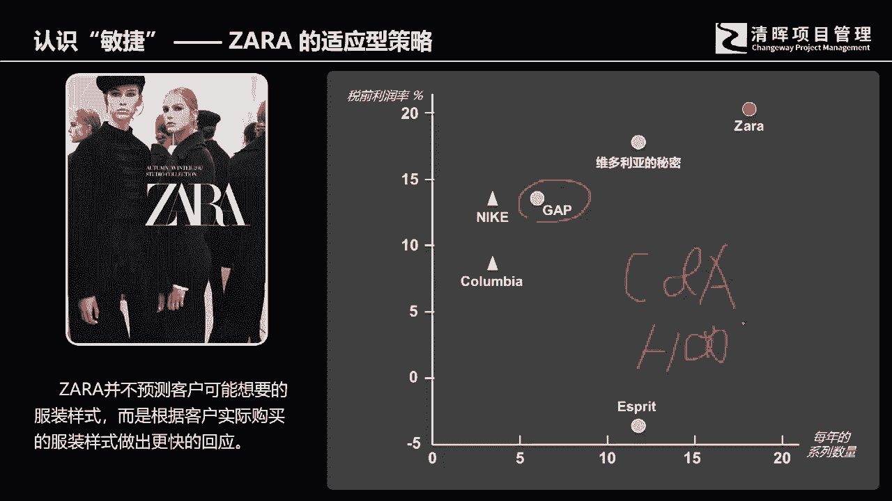

这个所谓的四大这个这个时装零售集团，它就快时尚嘛好那么这个时候呢，ZARA的具体贡献就在这里，它首先第一个近距离供货，缩短供应链，所有的这个他的这个在欧欧美国家，欧洲的啊，包括在中国。

现在现在其实也有很多这样的一些合作，就是它的这个物流体系和生产体系，离市场都是非常近的啊，尤其生产单元跟这个市场的前端的销售单元，都是非常近的，能够在一个相对短的时间内。

就可以把生产的产品运送到前端的销售，创销售网点，第二个就是小批量，小批量是什么，它不像以前设计师设计出来一款产品，然后呢会成批量的生产啊，然后卖不动就会打折，他不会，他只保证所有的店面都上报库存。

只要求他们能够留一周的库存，如果这一周有些产品销售的比较好，他就会要求就近的生产合作企业马上加班加点，批量增产，如果卖的不，如果卖的不好，那么这个时候呢他会要求马上打折卖，所以他的这个库存的减价。

商品的打折商品的库存，它只占他总库存的15%到20%，而行业的平均水平是50%，在这个过程当中，他要确保客户的积极参与，随时做好生产的准备，这一系列的过程，这一系列的过程导致到ZARA。

它的盈利远比其他的竞争对手更高，所以你看到的你看你你看到的。

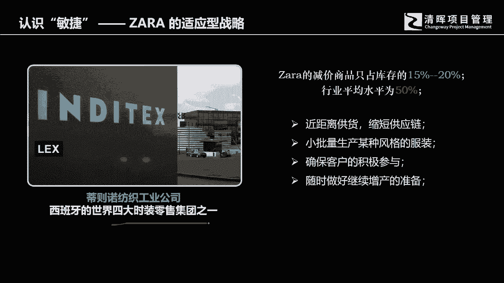

比如像这个耐克哥伦比亚男生喜欢喜喜欢的啊，女生的什么维多利亚的秘密啊，其实在这个在这个领域里面，我们会看到的是我们看到的ZARA，他就是用这种方式来进行开展工作好。

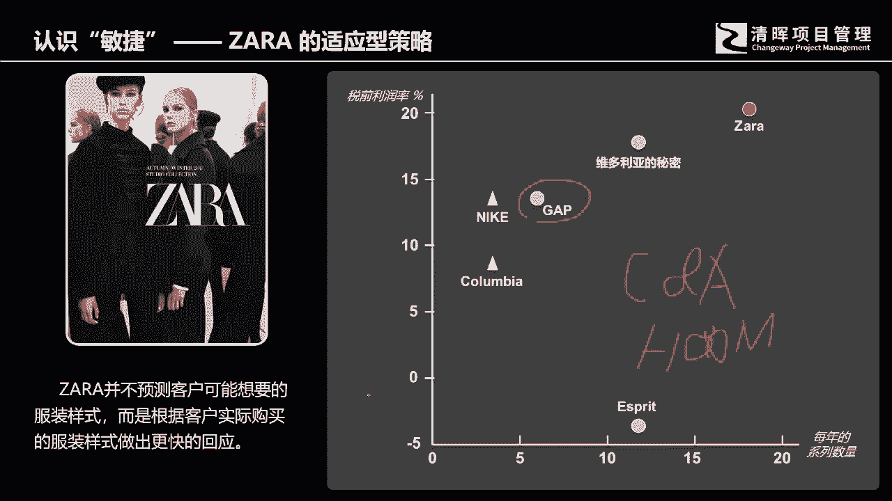

那么这个其实对他整个团队的要求，其实是很高的，包括跟客户间的交流，其实要求是很高的，所以我们在整个的预测性管理跟瀑布，是这个这个预测性管理的瀑布管理方法，和敏捷的适应性生命周期的这种管理方法。

它最大的差异在哪里，瀑布式管理方法在这个过程当中，你会发现需求在这个阶段就做需求设计，在这个阶段就做设计指导，最终的工作通过测试交付，而敏捷管理呢在所有的周期当中，每个周期都会有相应不同的人员共同参与。

然后呢，在一个短周期内去快速交付，一个完整可用的增量，完整可用的一个增量的结果，对客户来讲是有一个完整价值的，这个对整个团队的要求是什么，他的互动要求会更高，前端的跟后端的物流跟生产销售。

财务库存生产这些环节都被打通了，才能够实现前端的打折率，打折率打折商品会更比例更小，否则的话他是做不到的，他必须要所有的团队成员能够，或者说整个体系中间的所有的生产参与者，经营参与者必须高度配合。

它不是依靠一个简单的流程工具去来完成的，它靠的是持续的短周期的互动，而且是频繁的高度的互动。

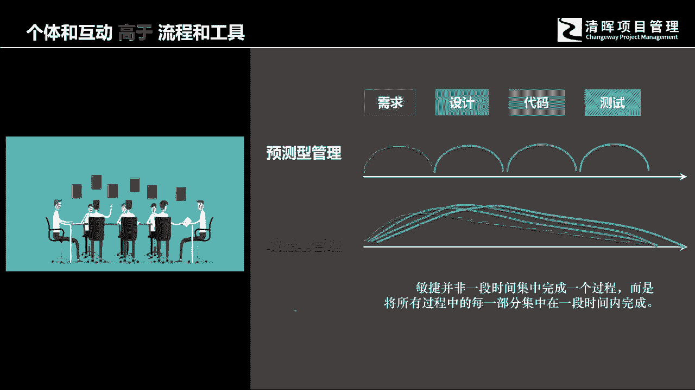

否则的话他是达达不成这样的一个工作效率的，平均行业的平均打折率是50%，而它只有减价商品，只有这个15%到20%。

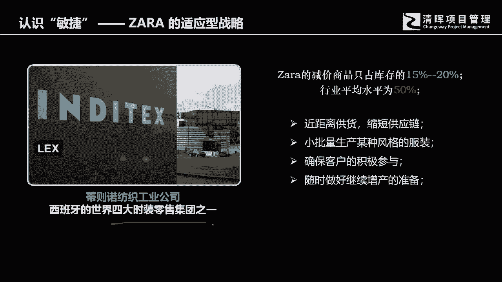

没有整个体系的运作是做不到这一点，这就是瀑布式方法跟敏捷方法的一个最大差异，它的具体体现，当然后期你会发现有这个这个这个很多，这个软件开发领域里面的专业人员啊，通过这个共同的相互的一些协作。

开发出了什么chrome啊，XP啊，或者其他的一些敏捷化的管理方法，但是不要忘了，其实传统领域里面，也给后面的一些行业的发展奠定了一些基础，包括像ZARA这样的企业。

其实各位要知道像类似像这个有人跟我说过啊，类似像这个我们讲说这个海底捞，他在他的管，他的他在他的那个内部管理系统里面，用了看板管理来提高他们的工作效率，来提来解决整个实施过程中的瓶颈好。

那其实这都是一些你会发现在很多领域，你会看到的一些先进的管理方法啊，现在你以为它都是软件行业的吗，不是的，传统领域里面也会有好，那么第二个就是我们敏捷管理中间。

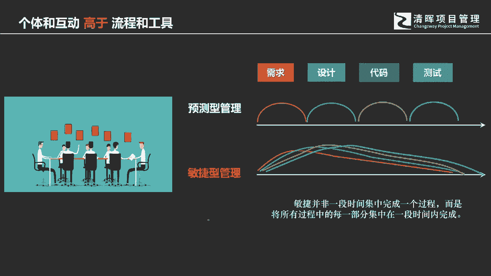

你会发现刚才我提到了一句话叫做快速交付，完整可用结果，这是对组织来讲，对客户来讲是最有价值的一个判断，原因是很简单，对于组织来讲，我们交付的结果如果是一个半成品，我们是否能够获得收益，对于客户来讲。

客户需要半成品吗，其实都不是，我们大家都这个这个这个结论，这个这个问题的结论的判断，其实是很显而易见的，所有的公司他在面临自己的下游客户的时候，他要交付的是下游客户所要求的，完整可用的东西。

而不是下游客户所要求的一个半成品，否则的话你的商业价值是无法展开的，你无法通过你的产品的交付来获得收益，这就是个问题，而且客户是不可能买一个半成品的东西的，就像这里我展现了这样一张图一样。

客户在所有的过程当中，他所需要的都是完整可用的，也许在这个阶段，产品交付的这样的一个功能和质量的呈现，并不能够满足客户的所有要求，但至少我们的客户拿到的是一个完整，可用的产品，我们讲的商业价值。

有些时候，它并不是一个所谓的，用单纯的经济价值去来衡量的，站在企业的角度，它是通过不断地完成可用的产品的交付，来试验市场，来发现市场的这样的一些需求，来发现客户的反馈，进而调整产品的研发。

然后呢在所有的阶段，它不仅可以获得我们讲说经济价值，它同时也可以马上获得市场的这样的一个反馈，而不像第一行各位看到的，它是用瀑布式的管理方法，直到最终一次性完成，我们的客户才会获得一个完整可用的产品。

但是问题，我们在整个交付的过程中是需要时间的，而越复杂的项目，在交付的过程中所需要的时间是越长的，你不能够完全保证在整个交付的过程当中，市场不会发生变化，客户不会发生变化，如果用上一行。

用第一行的工作方法，你会发现一个很很要命的问题，这个要命的问题是什么，就是客户如果发现市场变化，或者自己的经营方向发生变化，如果用瀑布式的管理方法，他问你，我现在没有没有钱给你了。

无法做这个项目的继续投资，请问你项目现在进度有多少，你现在跟他讲，我进度有60%好，你拿60%的结果给我，你拿60%的结果给我有吗，各位有60%的结果吗，用瀑布式的管理有60%的结果吗。

各位问个各位问题在问题来了吧，用瀑布式的管理方式，你有60%的结果吗，因为我是个半成品啊，别人要一半的东西吗，肯定没有啊，但是你有敏捷的管理方式，你用迭代加增量的方式，每一个都是一个完整可用的增量。

有一个每一个每一个阶段，都有一个完整可用的增量，它都是可用的，客户可能到某一个阶段，他跟你讲，我后面的不要了，我现在就要这个东西，到第四阶段，你告诉我，你工作完成了百分80%，OK好。

那你给80%的东西给我没问题，我现在就可以给80%的结果给你，这就是敏捷，所以瀑布式管理它必须一次性完成，直到最终有结果的交付对吧，这就是两个工作的不同，但是各位，我们不能够完全否定瀑布式管理的优势哈。

如果我们的结果是非常明确的，瀑布式管理方法的效率，会比敏捷方法的管理效率更高，但是问题在于，当我们面对的乌卡环境下面，我们用敏捷的方法会更好，所以尺有所短，寸有所长，这句话各位一定要记清楚。

并没有哪种方法适用于所有的环境好。

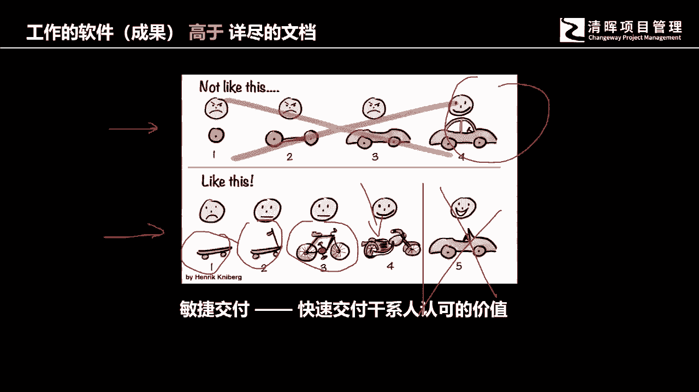

那么接下来在我们要看到，在整个交付的过程当中，计划驱动我们所面临的问题在于，我们要用计划驱动的方法去面对乌卡的环境，你的尴尬之处在哪里，计划驱动的方法，也就是我们讲瀑布式管理的方法，你要面对的乌卡环境。

你最尴尬的地方就是你用瀑布式的方法，在于你越早，你在你在相对的早期，你要完成所有的需求的明确，而且要非常明确，你才能够开展用瀑布式的管理方法，一步一步往下推进，但这又是个悖论，而一开始你就会发现。

我们在很多时候用在乌卡的环境下面，你一开始是无法获得很多很明确，有足够的信息和数据支撑的，这样的一个结论去帮助我们开展项目，这就是个很危险的事情，而我们的整个工作的过程是什么，我们要随着时间的推移。

其实我们对的，我们的知识才是我们的知识和经验，才会逐步的成长，逐步的提升，我们的需求是在随着工作的过程不断的去推进，改变优化，重新再排序的，重新再调整的，所以我们用计划驱动的方法去。

在乌卡管理的环境下面，我们碰到的尴尬和危险就在这里，因为我们无法用早，无法在早期能够把所有完整的需求全部明确好，这就是我们的一个在乌卡环境下面。

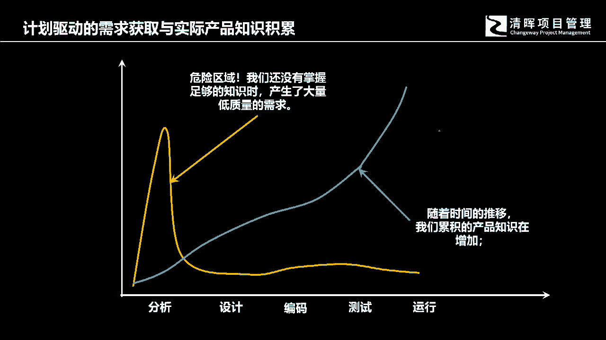

用激化驱动方法，它所面临的尴尬之境，这也带来的一一个问题，这也带来了一个问题，如果各位所身处的行业是一个高度变化的，不确定的，模糊的，难以捉摸的易变的这种环境下面，我们在开发产品的过程当中。

我们自身本身项目管理团，项目团队本身是一个学习的过程，最早的时候其实我们是最无知的阶段，我们最早期我们可能是通过很多的假设，拍脑袋来确定一个当前我们要开展什么工作，或得到一个什么结果的判断。

但是我们不会以它为终点，我会我们会在工作的过程当中会快速的调整，通过一个又一个的迭代，在交付迭代的结果的时候，跟客户做反馈交流，一次又一次的迭代交流，一次又一次的迭代交流，我们的知识经验水平。

对客户的了解，对客户的理解，对客户需求的理解会越来越清晰，在这个过程当中，我们通过跟客户的反馈的学习，对产品的认知，对技术环境的变化，对市场环境的变化，我们的知识和经验不断的做，在在做调整和积累。

这就是我们的敏捷，强调的是我们高度的互动啊，然后呢去通过知识的不断的积累去来解决问题，好那么敏捷是什么呢。

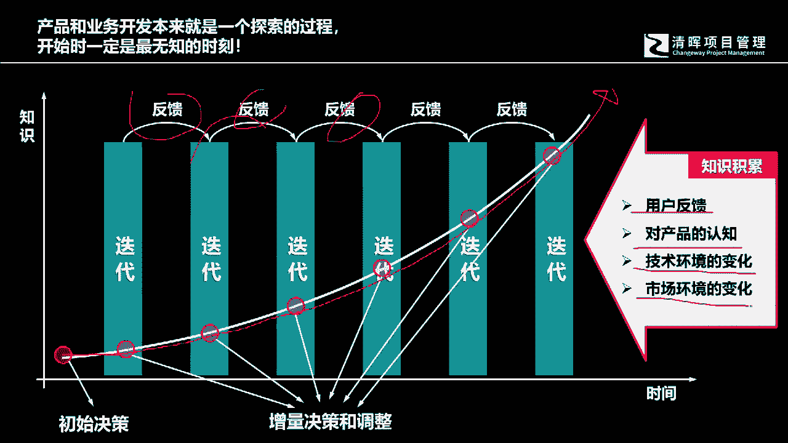

敏捷还有一个情况，各位看过这个片子吗，各位有人看过这个片子吗，各位看过这个看过这这个电视连续剧吗，有人看过吗，没看过没看过，赶紧看，有人看过吗，有啊，这个片子叫什么纸牌屋对吧，纸牌屋好看吗。

纸牌屋为什么好看呢，纸牌屋好看吧，觉得好像很抓得住人的心哈，很抓得住人的心哈，这个所以所以纸牌屋为什么好看呢，各位奈飞啊，他在纸牌屋的这个拍摄的过程当中啊，各位要知道纸牌屋它并不是美剧哈。

他是奈飞从英国引进的，奈飞呢当初从英国引进这个纸牌屋的时候，纸牌屋最早是英国的英剧，因为我们这个这个这个，这个有些影视平台上面的分类来讲，它不是美剧，它是英剧哈，那后来是奈飞把他弄到美国以后重新再改版。

然后重新再调整，但是呢他做了一件事情，他跟以前传统的电视连续剧拍摄的方式，他有个开创性的变化，这个开创性的变化是什么，去充分跟客户进行合作，什么跟客户进行合作呢，那第二是嗯他们首先做调查。

首先第一个就是这个这个这个投资方发现哈，就是这个电视连续剧，如果这种题材的话，观众喜欢由谁当导演，然后呢观众喜欢谁来当主演，通过大量的社会调查，他们发现喜欢大卫芬奇来当导演。

同时呢还喜欢演员kevin spacey，KEVINSPACY呢加入这个啊这个这个团队之后，加入这个啊拍摄这个美剧之后，他发现奈飞的这一个做法是非常有开创性的，这个开创性除了在初期组成团队啊。

寻求这个客户的这样的一个一个一个一个，认知和理解，还包括支持以后他拍摄的每一每隔一个阶段哈，他都会做客户调查，做客户调查以后呢，编剧们会根据客户的反应去来调整，自己的这个故事情节和。

人物的故事脉络的发展走向，就有点像今天各位去看网络的一些网络小说，还夸过一些网络的电视连续剧，你会发现网络小说中间，比如说有些作者他会写几集，然后呢啊会写个1~5级啊，3~4级这样的一个情况。

然后呢他会根据读者的反馈去来调节，会来调解他整调整整个整个故事发展的脉络，比如说有个人物，可能本来作者的初衷想法是，这个人物活不过两集，结果呢大众的反应，读者的反应是什么，听众观众的反应是什么。

希望他能够活过20集，好，没办法啊，顾客是上帝，我们要与顾客充分的合作，所以的话他做了一个改变，就把本来自己没想让这个人活过两集的，结果呢让他活到了20级，30级，这就是我们讲说现代的一些。

这个这个电视连续剧，包括一些网络文学中间的一些故事发展，其实它是跟客户是高度啊配合的，跟客户有充分的交流和互动，所以在同一个时间，奈飞的这个纸牌屋，它每集的这个观众数量，是在150到270万。

相比其他的一些电视连续剧，收视率一直是不断在刷新，而且是排名非常靠前的，原因，秘诀就在于它每拍摄一段剧集之后，他都会充分的去来分析所有观众的反应，然后呢根据反应编剧制片团队会导演。

还有包括演员会来进行再一次的调整，会把原有的故事方向，人物还包括故事脉络的细节做调整，以符合观众的喜好和偏好，所以才会有创造了这个house啊，这个这个我我们讲这个纸牌屋的这个奇迹。

而KEVINSEPY当时在加入这个团队的时候，在加入这个拍摄团队的时候，他恰恰看到了奈飞的这样一个开创性的举动，他决定他做出了一个决定，拍这个剧集的时候，他是没有片酬的，而且他还投资了，他有一个要求。

就是这个电视，这个这个美这个电视连续剧拍完以后的分层，它占一定的比例，他要求的是这个，所以的话这就是我们讲说，客户的合作是高于合同谈判，原因就在这里，你要获得客户的市场的这个追捧，获得市场的好的反馈。

你就需要与客户高度的合作，这种合作的过程是以客户的需求为出发点，他不是一个以合同的谈判，一种对立的角色来进行这个这个这个合作的，而合同一般签订以后，它是具有法律效力的，你变更的时候会变得非常的麻烦。

所以的话这个过程，我们更要求的是与客户的高度的协作好，那么在我们这个社会还会有些变化哈。

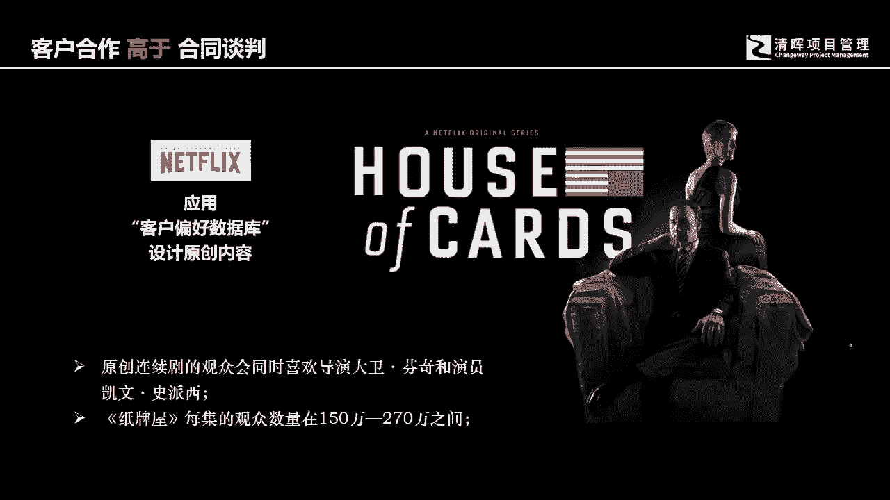

这个变化在哪里呢，我们就以这样一个例子跟各位去讲，首先第一这有个例子，就是各位也许玩过这样一个游戏，这个游戏叫愤怒的小鸟，各位玩过吧，但是愤怒的小鸟的第一版，它的生命周期只有四个月，它的高峰点在哪里。

当它挂到网上被下载下载了1000万次，这个从零到1000万次，他花了多长时间呢，72个小时，这72个小时使得我们玩的这个经典游戏，愤怒的小鸟一下子啊爆发成长，但同时它也快速的衰退，它也快速的衰退。

所以它的生命周期只有四个月，它的生命周期从它开始到这个完全没有人下载，只有四个月，当然后后续会有很多的这个这个这个版本，比如说什么太空版呐，什么樱花版呐，中国的端午节版呐啊和各各种版本。

那都是那都是后续版本的改进，而它的最原始的第一版只有四个月的生命周期，各位可以回想一下，这就是互联网时代，这就是我们，当，这就是我们现在所面临的这个，这个市场竞争的态势。

你会发现这个信息的交互速度非常快，触达到每个人，而同时产品的生命周期也变得越来越短，成功就也就在几个小时之间，所以我们再讲再跟各位举另外一个例子。

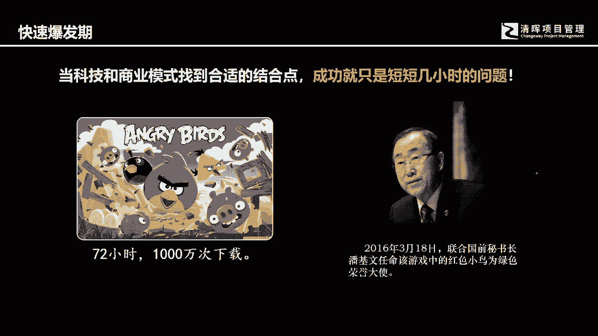

这个例子是投资的一个例子，各位玩过，我不知道各位玩过这个游戏没有啊，这个玩这个游戏叫我画，你猜这个游戏叫我画，你猜就是两个，它既有这个社交社交的这个属性，也有沟通的属性，还有什么呢，就是我们两个联网。

然后呢，我我我，我用电子笔在我的手机屏幕上画一个图画，然后让你猜这个是谁啊，猜中了啊，我也许会这个平台会有一些啊互动啊，或者奖励啊，特别有趣啊，它促进了社交，也促进了这个信息沟通。

这个游戏呢也是非常的火爆，然后呢这里这个游戏呢它是他是他是他是谁发，谁开谁开发的呢，这个公司这个游戏公司叫oh my god pop，然后这个oh my god pop，他开发了这个游戏以后呢。

上面这有家公司，这个这个单词我不知道该怎么念啊，ZYNGA一个念ZG呃，ZAGA啊，也是美国的一家公司，它也是一个游戏公司，他因为他有前面的一个游戏，已经这个这个这个没有什么市场了。

所以他想引快速引进新产品，然后呢这个时候有一个非常有意思的情况，他用资本的方法去买了这个oh my god pop这个公司，然后呢，继而获得了这个你画我猜这个游戏的版权。

然后你画我猜这个游戏被买过来以后呢，他是希望因为他看到了这个游戏的快速成长，客户数量非常的非常的迅速，2012年的1月份开始投到市场，然后客户数量下载数量与玩的这个游戏的数量，的人群的数量快速增加。

所以呢这个ZAGA呢他就买了这家公司，他就希望这个你画我猜的这个游戏，能够给公司带来一个新的一波的成长，但是麻烦点在哪里，各位这个麻烦点就在于，它收购的点是在这个位置。

我查过一系列的这个oh my god pop这个游戏，这个你画我猜的这个游戏被ZARA这家公司公司，各位可以在网上找得到的，找得到这家公司啊，找得到这家公，这家公司其实非常有名，他收购这个企业的时候。

它的收购点，各位看一下收购点在哪里，他用1。8亿美元收购欧my god pop这个公司，它的点在哪里，他的点恰恰是在这个，你画我猜这回这个游戏快临近高峰的，这个点也差不多。

在他的客户数量是在一千三四百万，这个时候当当然他收购了以后还会有一波成长，然后接下来迅速的消亡，迅速的消亡，而这个游戏再就没有了，1。8亿就打了水漂，完全是投出去以后也就不到。

那它因为后面就是个长尾了吧，后面就是个长尾了，这个长尾就代表，其实也就是你要用这个这个收割策略了，那你基本上也就没有什么价值了，已经没有人去下载了，所以后面你真正后面客户数量持持续在下降。

持续在线被新的游戏所代替，所以客户啊，我们讲说很多时候客户其实他的关注度，注意力或者潮流走向啊，他是快速发生变化的，这就是无卡环境下面的一个，我们称之为叫易变性好。

那么就使得我们那那这个ZAGA这家公司。

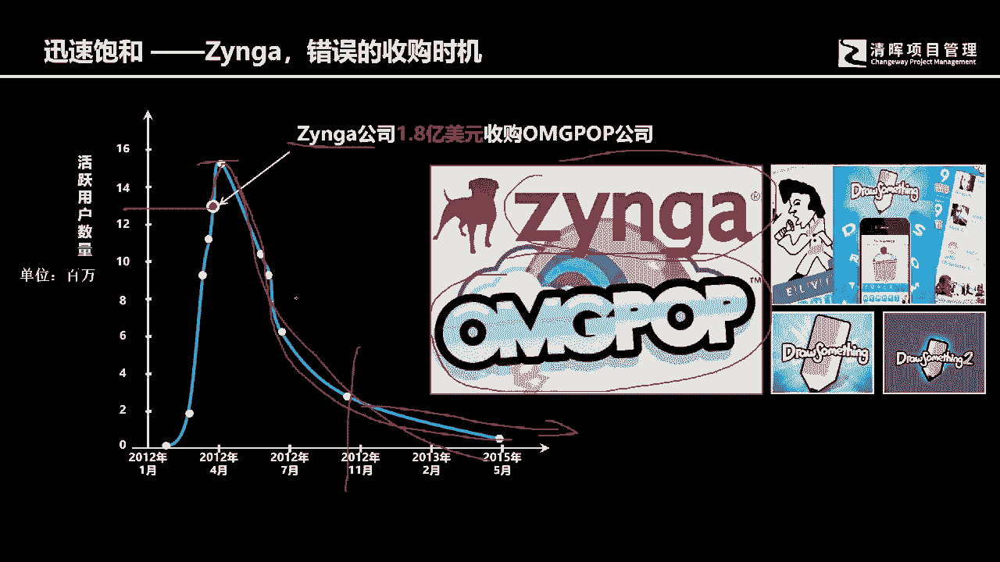

就是收购失败了，我讲这两个例子，其实就是想告诉各位，对于敏捷来讲，对于敏敏捷这个环境来讲，乌卡环境下面，我们所面临的市场发生了翻天覆地的变化，以前我们在规划市场的过程当中。

会有一个叫中型曲线的这样的一个分类方法，把我们的客户分成了五五个类别，有所谓的创新者，产品的尝鲜者，早期大众，后期大众落伍者，但是实际上现在互联网时代有很多的产品，它经过不了这么长周期。

它只有两个非常短的周期，一个周期叫做什么叫爆发期，一个周期叫什么快速跌落，那么这个时候你就会发现他的产品的发展曲线，就由原来的中型曲线，变成了一个我们称之为叫鲨鱼鳍的，这样的一个曲线，像不像一条鲨鱼。

像不像露在水面上的鲨鱼背啊，快速的成长又快速的消亡。

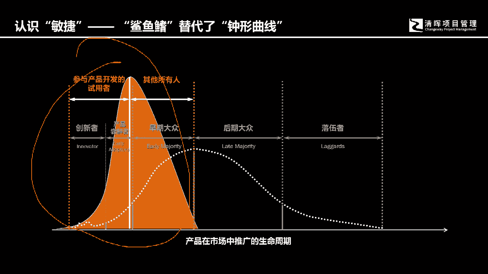

这就是我们讲现在很多产品开发所面临的情境，它快速的爆发，同时又快速的迅速的饱和，所以我们的这个市场变化，客户会这个市场变化会非常的突然，然后呢要么就是非常快，要么就是压根就没有市场。

一个新产品被研发出来，压根就没有人过问，那客户呢反倒成为企业的竞争对手，这个里面是要打引号的，因为我们的时代已经发展到了客户，要要占领客户心智的时代，以前是我们只要有客户信息就可以，八九十年代。

后来呢我们占领渠道，有市场就可以，现在呢是什么，现在因为我们的市场客户发展太快了，我们需要的是什么，占领客户的心智，客户的大脑是企业的竞争对手，可能企业跟企业之间反倒还不是竞争对手。

你能够占领客户的大脑空间，你就能够获得胜利，但是背后根本原因就在于市场的变化太快。

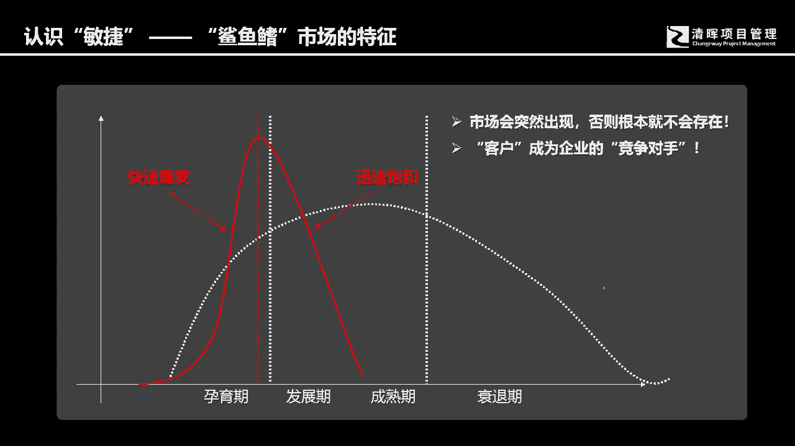

太易变，所以这里面就有一个叫荷花定律的东西，这个荷花定律讲的是什么呢，就像一个池塘，这个池塘中间有一朵荷花，每天这个荷花就会成长一倍，数量会多增加一倍，假设30天可以把这个荷池塘开满。

请问第28天荷塘里面有多少荷花，各位听明白了吗，有一朵荷花在荷塘中间，每天荷花的数量会成长一倍，假设30天，这个荷塘的荷花会开满，请问第28天这个荷塘有多少荷花，1/4对吧，1/4对不对。

你大脑不哈哈哈，29天是一半，28天当然是1/4咯，29天当然是一半咯，28天就是1/4咯，所以荷花定律给我们看到的，带来的一个情况是什么，就是你先开始会发现它其实变化并不太大，对不对。

你每天可能从这个荷塘边经过，第一天只有第一朵，第二天两朵，第三天四朵，第四天八朵好，假设第30天才开满，29天的时候，它是它就会开一半，28天的时候，他只有1/4，27天的时候，他只有1/8。

26天的时候，他只有1/16，但问题来了26天到30天，这个过程当中会突然的变化，所以你会发现市场的变化，它不是算数型的，它是指数型的，这个各位听明白了吗，先开始的变化它会非常的小，但是随着后面积累。

它会突然的发生变化，会突然的成长，也就是虽然现在马云在国内出现的次数很少了，但是马云曾经说过一句话，当你感受到变化的时候，你已经跟不上变化了，也就是原因，这就是因为荷花定律在里面作怪。

你先开始是看不到它的变化的，当你看到它的变化的时候，你已经来不及跟上了，它已经是成倍的在增加了，所以我们响应变化。

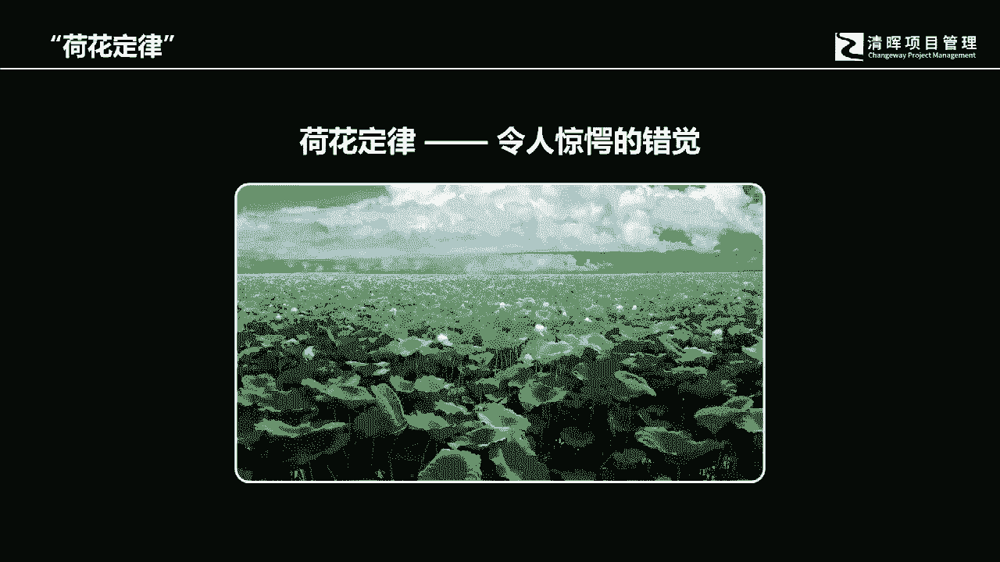

为什么说响应变化要高于遵循计划的，因为世界在不断的变，而且是快速在变的，我们以前的预测型方法是通，是用一个非常啊，我们以前的我们我们的传统的方式，典型的方式是什么，典型的方式是我们以终为始。

有目标做计划，做规划，做执行，做监控，但是呢在这个过程中，外部环境在发生变化，项目实施的进程当中，世界就在不断的发生变化，而这个变化的效率会非常的快，那么敏捷环境就是在面对这样的一个情境。

在很多的行业领域里面，我们无法用快速，我们无法用简单的瀑布方式来进行应对，我们需要的是能够快速应对变化的，这样一些方式，所以它在他会把一个长的过程，切分成细小的阶段，这个细小的阶段。

它的节奏略略快于外部环境的变化，然后呢，在阶段之间不断的去应对外部环境条件的变化，也就是我们强调的所谓的欢迎变更，欢迎变更，直到整个工作的完成，所以为所以这就是我们强调的，在敏捷管理中。

我们的响应变化是高于遵循计划的，因为你遵循计划，是无法应对外部环境的快速转变的。

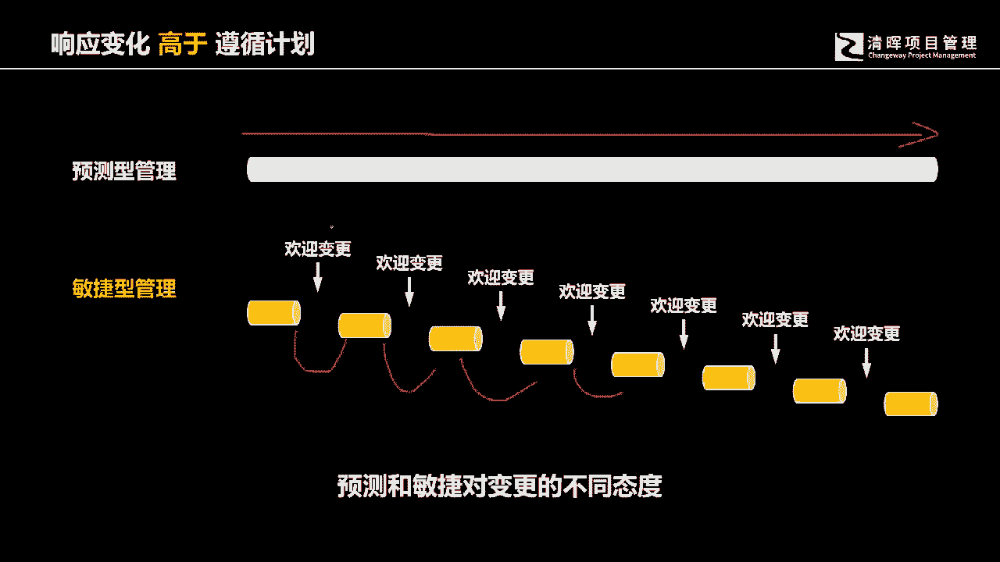

所以默多克曾经说过，世界处于快速变化中，以大胜小的局面是不复存在了，取而代之的是以快制慢，而我们的适应型的方式，战略策略，包括适应型的项目管理方法，重点在于方法，我们在于不断的调整方法。

而这个方法的核心，各位今天就可以感受一下，它是以时间为单位的，它是以时间为单位的，所以后面各位要学习敏捷的管理过程当中，敏捷管理其实是他考试是7A7A的时候，它里面会有一个叫价值价值路线图。

它有七个过程，其实这七个过程是逐步分解的过程，这七个阶段是逐步逐步分解，逐步逐步细分，它的细分的核心要素是什么，是时间，是时间，各位后期学习的时候会有这样的体会。

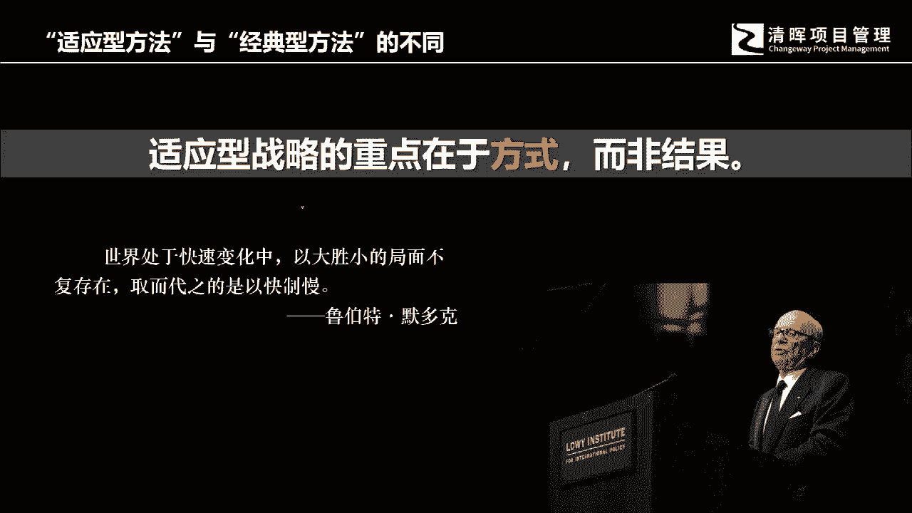

今天你记住我这句话好，那么稍微总结一下敏捷管理，中间我们要跟客户充分的互动，然后呢我们要交付完整可用的结果，然后呢在与客户的合作，远高于我们跟他的合同谈判，我们要快速的响应变化，而不是遵循计划啊。

所以这就是敏捷管理中间所强调的内容好。

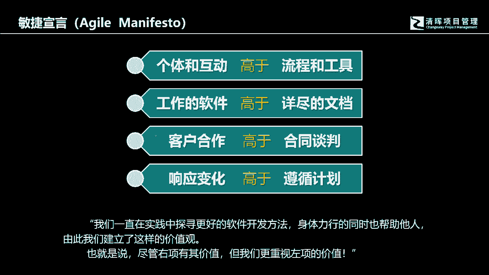

我们也超时很多了，我们已经进入到最后的内容，跟各位简单说一下，我们学习PMP的一些心路历程哈，一开始各位一定是惊震惊的，因为这本书刚这本书刚刚刚拿到的时候，是绝对够厚，就像我们刚才所说的，可以打得死人。

挡得住子弹啊，够重，可以让你锻炼身体，所以我们一开始我们初次阅读的时候啊，是要看目录啊，了解总啊，了解他的一个总概，然后呢泛读形成初步印象，第二个阶段我们会经历什么茫然茫然，从开始看书到第一次课之间。

你有很长一段时间可能是在做自我预习，你会很茫然，因为你找不到重点，你无法知道说这个里面哪些是你该看的，哪些是不不该看的，但是篇幅又这么大，没有例子给你做参考和学习，只有大量的概念和学术化的术语化的表述。

会让你看得昏昏欲睡，你会越看越茫然，这个时候其实你要做的事情是发现问题，就像今天这堂课，我相信各位在学的过程中，会发现自己的很多的问题，但是这个没关系，这是在这个阶段你最需要去做的事情。

你需要把自己发现的各种问题详细地记录下来，好那么第三阶段你会很烦躁的啊，因为正课正整个课程结束前哈，你会发现你自己会很烦躁，为什么呢，太多了太细了，内容知识点太多了，时间又很短，自己生活也忙，工作也忙。

但是坚持坚持就是胜利，我们很多工作都是在日常完成的，所以每次上课不要迟到，跟随着老师的节奏记录重点记录考点，记录难点好，那么到了第四阶段，你会变得很愤怒哈，告诉各位，因为开始刷题的时候。

又是你在重新再认知，重新再整理知识的过程，这个时候你会发现从学到记到理解，然后再把它用出去，这个用出去就是在做题的过程当中，你会发现自己已经花了很多时间和精力，记住的一些知识，现在却忘了，记不起来了。

或者说错了，你会觉得很愤怒，会很觉得呵呵，觉得难受，但是没办，但是没办法，这是你必心必定要经经历的心路历程，所以刷题刷题再刷题，平起平心静气，充分利用好每一次刷题，每一次交流的时间，不要去纠结啊。

然后在这个过程中，你不要去纠结完美答案，你因为管理的过程啊，尤其在pp刷题的过程中，你要体会到他是管理学，它不是数学，管理学有很多东西，他只是说这是最佳建议，但它不是个必然建议啊。

所以你也许根据你的经验会认为是说，这个这个选项好像不合理啊，不对，我的经验认为是这样的啊，你先放一下，我们现在要面对的是考试，先把考试通过PMI认为在这个过程当中，哪些是最佳选择。

你依据他的聊这个描述去来进行学习和做题啊，你不要去纠结它啊，好呢，那么到了最后一个阶段，要么奋进，要么摆烂，考试前三天，很多人可能会认为，哎我一呃刷题效果也比较不错，有信心，那么这个时候非常棒。

但是你也有可能会摆烂，为什么呢，你会发现好像自己刷了很多道，很多套卷子，依然分数提不上去，但是你不要放弃，回归书本，查缺补漏，整体理解，最终你会考试通过的，相信我好，这是我们整个学习，等你考完以后。

你会发现整个PMP其实不过如此，没有什么觉得很难的好。

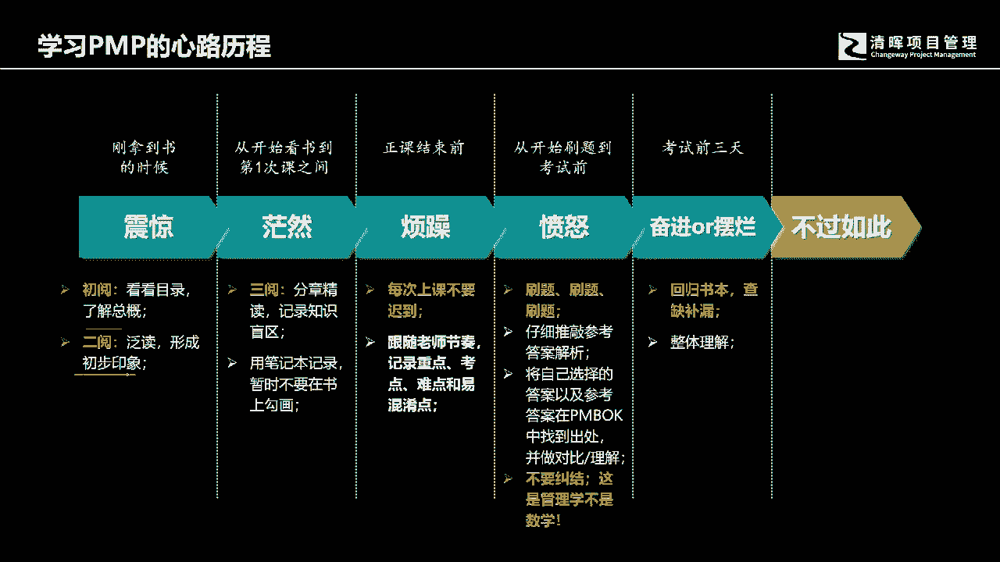

那么最后哈，最后最后三页，如果还有还有学员在吗，没有学员在，我就跳过了哈，最后几页啊，首先今天来听课的学员们，我以个人的名义会有些书籍分享给各位，这里有21本精选的项目管理书籍送给各位，你们如果有需要。

可以通过你你们听清楚，如果你们有需要，可以通过你们的班主任向我索取，另外还有24种常用的项目管理模板。

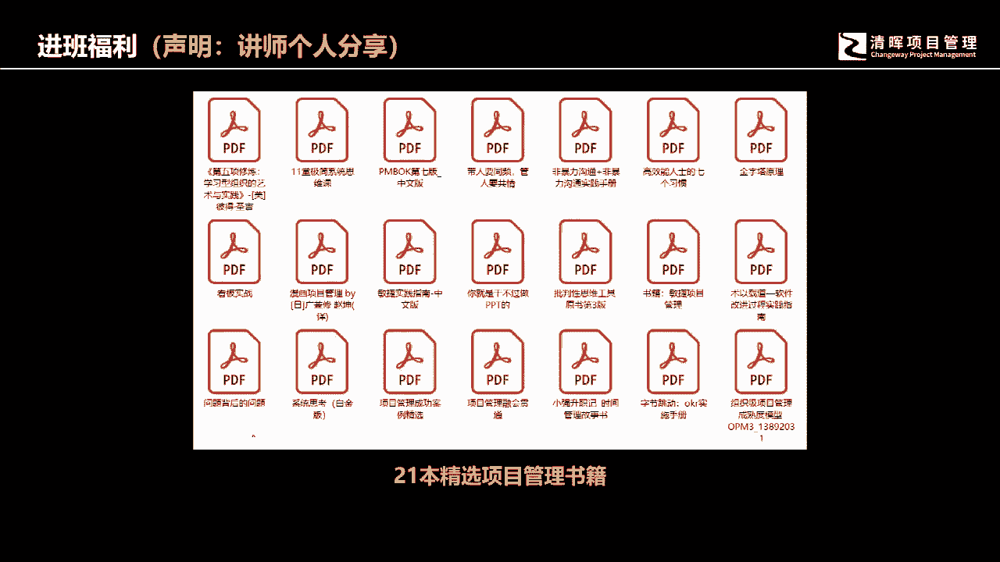

这个模板有两个作用，这个作用第一个作用就是可以通过这个模板，让你去通过另外一个侧面和角度去理解，PNP所学，第二个你可以用到自己的日常工作当中。

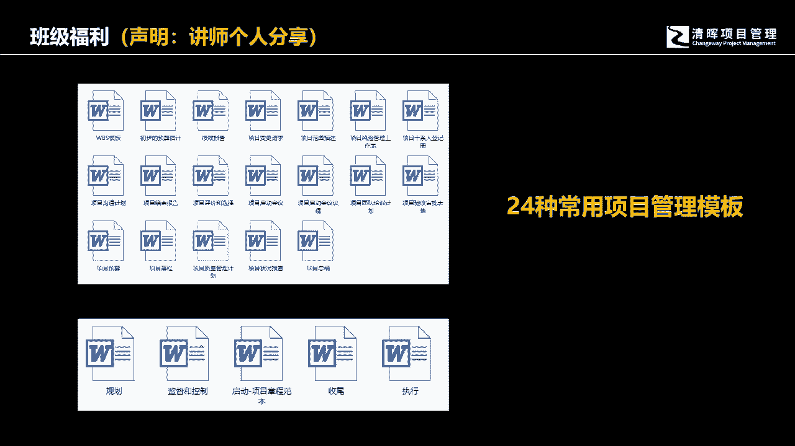

第三个就是分享给各位的，就是到年底了，很多人要做工作报告了，要做工作总结了，要做述职了，要开始用PPT了，这里呢有相应的PPT的工作汇报的模板，然后呢会有1000多个。

将近一两千个各种PPT的图形图表分享给各位，在各位日常的好，也就是每个人到年底要面对的这个工作总结，当中可能都用得到，但是再次声明，这是我的个人分享，和咱们公司统一标准的资料是不一样的。

只是我个人的分享，如果再然后再说明一下，如果各位有需要，请通过你的班主任向我索取，OK好。

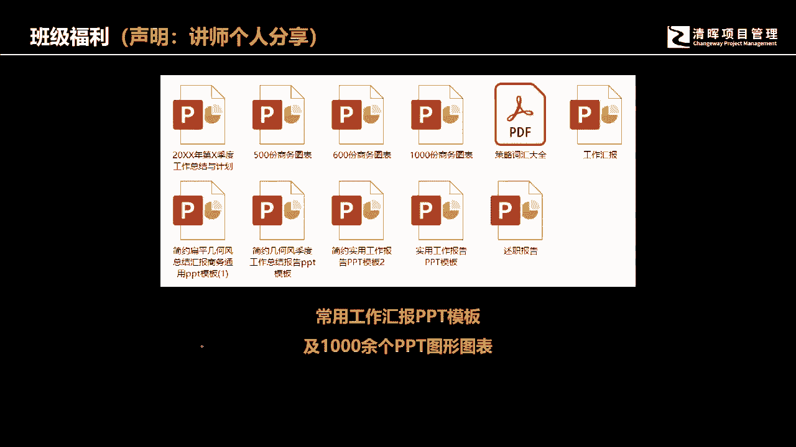

今天我们内容结束有点超时，超了半个小时，各位，有有什么想问的吗，怎么还有老学员啊，你们都还没通过考试吗，我今天就是我今天就是专门针对新学员的啦，需要下载啊，下载什么啊，你找班主任，我来分享就完了。

没有课啦，讲完啦结束啦，PPT可以分享吗，PPT不能分享，捧场的哈哈哈哈，捧场的OK谢谢谢谢捧场，新学员听不懂，新学员听不懂，那你我只能说你要不断，因为今天呢只是跟各位讲，我们要有什么内容。

下次有有没有课啊，下次有没有课，我带班啊，你到你在班上就可以听得到我的新学员，好焦虑，别焦虑，有什么好焦虑的，跟着节奏来，跟着节奏来就可以了，下次课下次课上下次课我都不知道什么时候，应该是在月底。

12月底就正式上课了，下次12月底就是正式上课了，咱们班的新学员都不要焦虑啊，咱们班的新学员，这个12月12月周末班的周末，一班的学员不要不要焦虑啊，没什么没什么大，没什么大不了的东西。

学习的过程当中跟着我走就完了，跟着我跟着我的节奏来，今天呢只是告诉各位，我们会学什么，只是告诉各位我们我们会学什么啊。

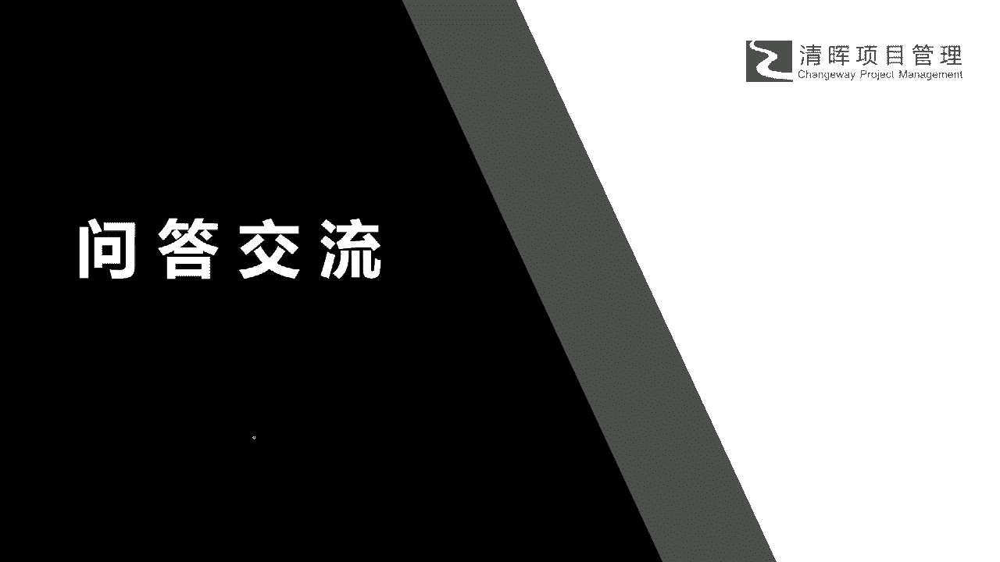

对不过如此，我们的学习不过如此，等你学完以后会发现没有你想的那么难，我没有微信啊。

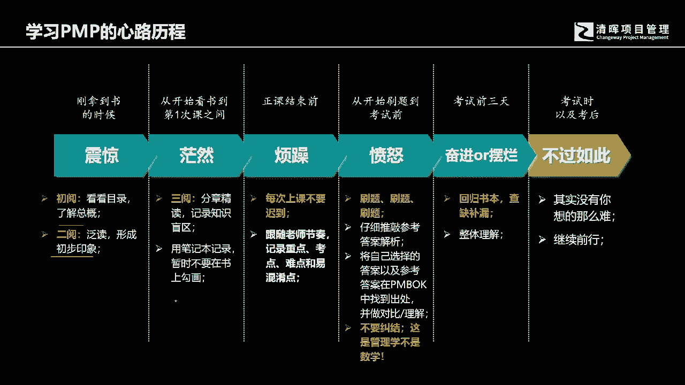

你们找班主任，如果呃班我会通过班主任发给各位。

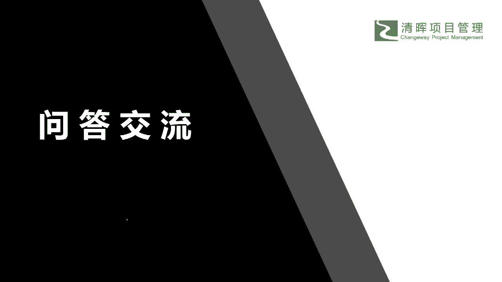

如果各位有这个有这些资料的需要的话，OK我们的课已经讲完了啊，我们的课已经讲完了啊，我们可以下课啦，我不在杭州上课，我在网上上课，我在武汉上课，没那么难，没那么难，各位放平心态就可以，再见各位。

武汉什么时间，武汉到1月份了，通过网线找老师吗，那好长哦，你在哪个城市啊，你要你要顺着网线来找我，确实有点困难哈，我不知道你摸网线能不能摸到我这儿，因为我有一段是无线，苏州的可以没问题，可以通过班主任。

你要你你你让班主任找我要，我会通过班主任，我会通过班主任发给你们的，苏州的可以没问题，只要是各位听课了，你们有需要我都愿意发，我都愿意分享，没问题，包括书籍模板和PPT的，这个这个这个这个这个图表图标。

西安啊，西安离武汉不远，来呗，可能这一期我还会到西安讲课，宁波，今天你如果都听懂了，就说明很不错，但今天你没听懂，很正常，原因很简单，因为你会发现很多问题，只要你能够清晰的把自己的问题给描述清楚。

后面的学习对你会很有帮助，每个时期会有每个时期的问题的，OK再见，各位再见，有需要的找我要哦，通过班主任老师，通过班主任老师找我要哦。

