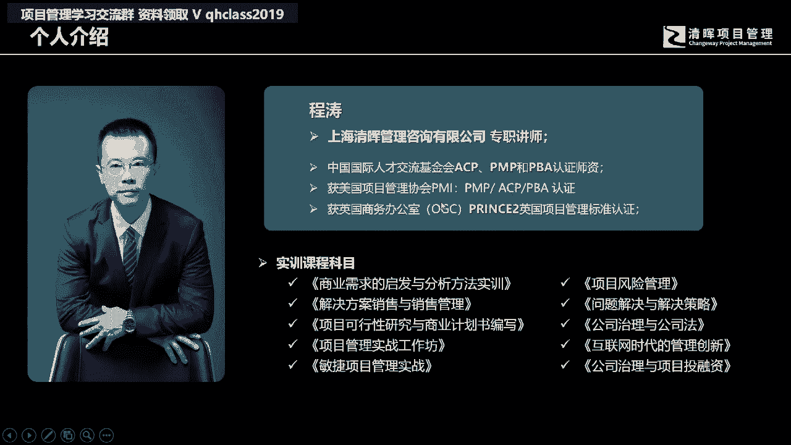
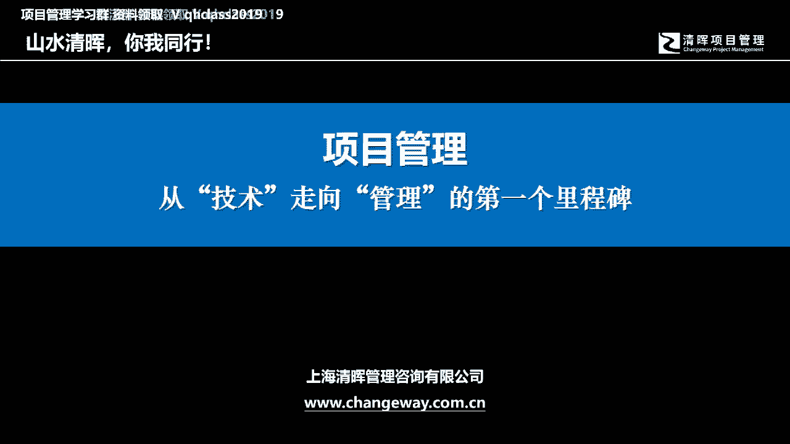
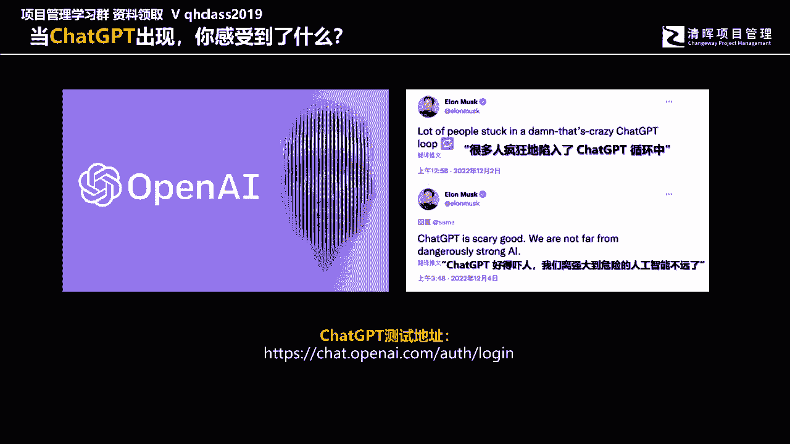
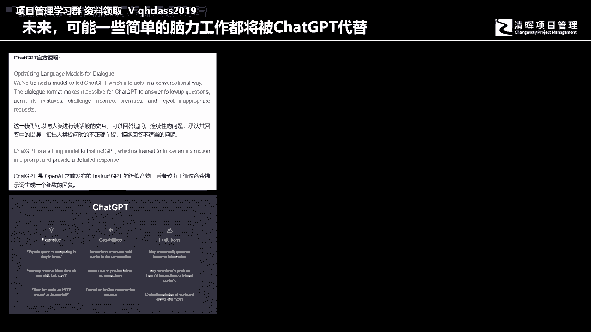
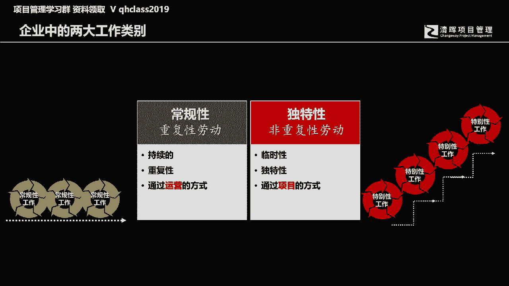
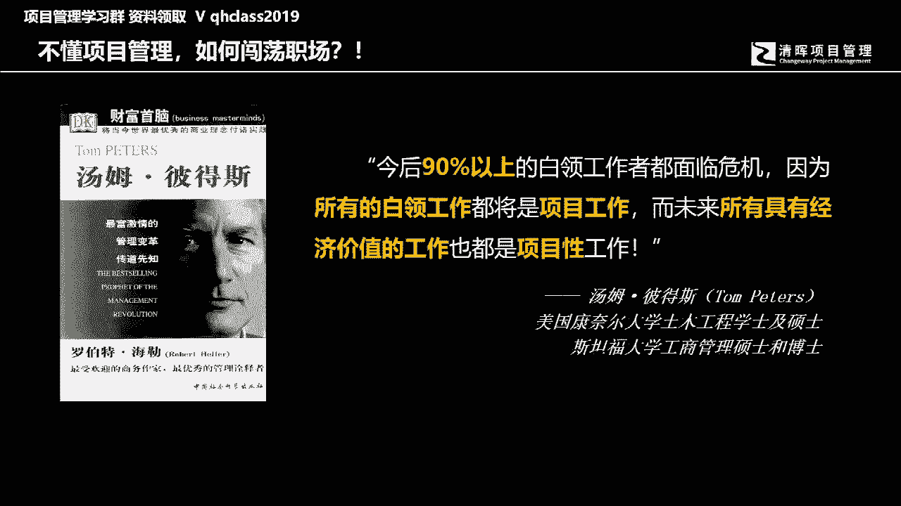
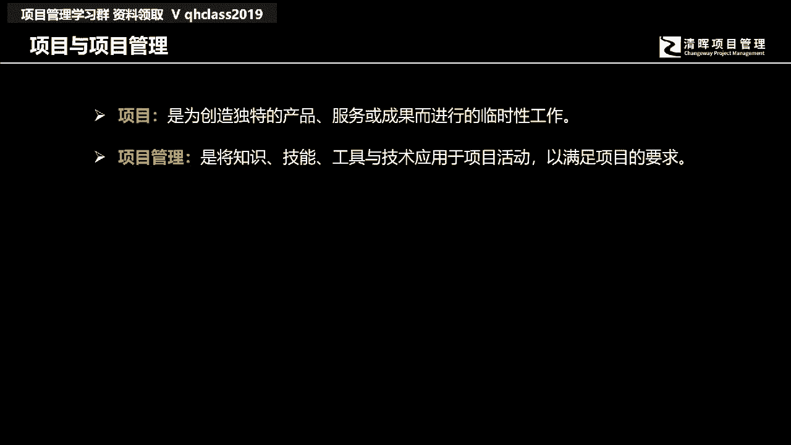
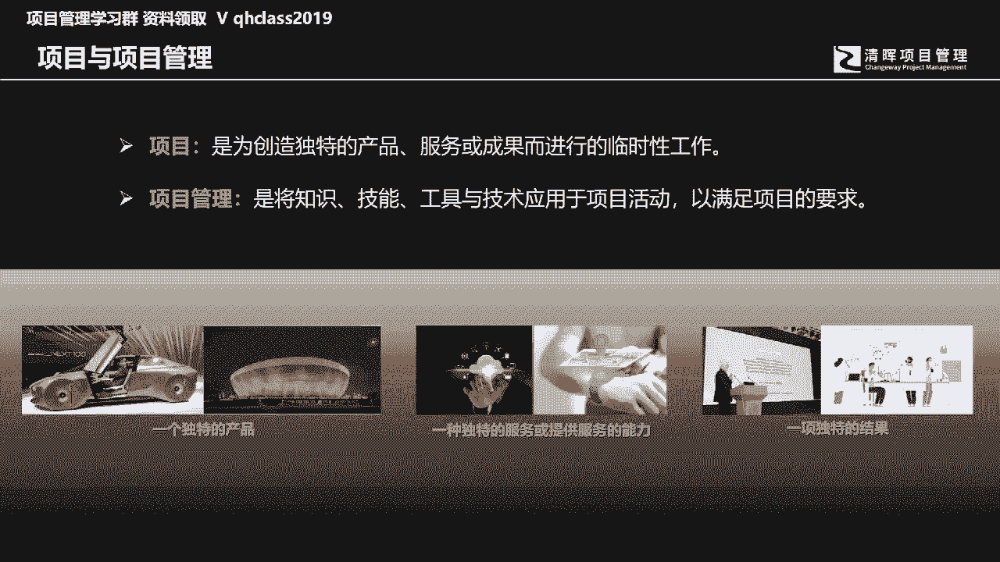
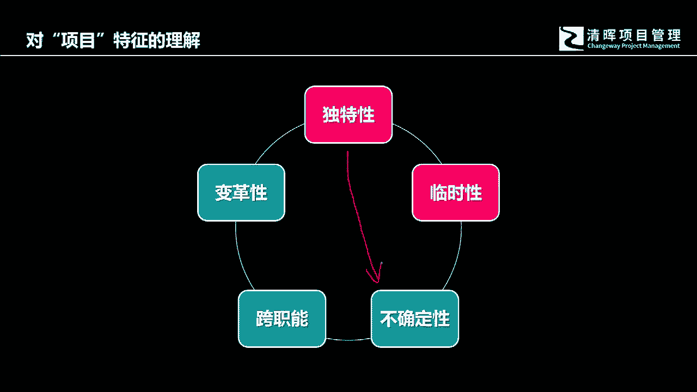

# 从技术走向管理的第一步 - P1：1.什么是项目管理 - 清晖Amy - BV1rr421574M

大家好，哈喽哈喽，Hello，大家好，这个时间有延迟哈，这个我说话以后，然后听到反馈的声音会延迟那么几秒钟，所以待会如果各位在问答区里面提问题的话，有可能会啊，我这边也是会延迟的，OK好，那么这样哈。

我们还有2分钟开始，各位可以调试一下自己的设备呃，然后第一能听得到我的声音吗，这是第一，第二能够看清楚这个投影的啊，这就是那个PPT的画面吗。

这power point的画面吗啊OKOK的话可以写个666啊，OK的话可以写个666，OK两个内容都检查的很清楚，OK那就写一个666好，非常方便哈啊那个，666多打一个，六是更加顺利是吧。

大海景哇塞，好我们还有一分钟左右准时开始哈，然后各位听得到我的声音，然后也看得到我们的PPT画面，POWERPOINT的画面，那么各位就写一个666啊，就代表我们的设备，代表你的设备都是OK的。

然后的话我们就可以顺利进行，今天晚上的两个小时的分享，好我们时间到了哈，时间到了哇，欧洲尾城快递，哇塞现在就是快递比较慢，中午点个餐，结果晚了一个小时，听说很多快递员都都都都休息了，因为得了新冠对吧啊。

伪声伪城快递，OK现在要呵呵，画面只是一片通红吗，不是我的画面应该不是通红，应该是通黑啊，都是黑的，哼蓝色蓝色，OK这位毛毛雨同学，你是不是得刷一下哈，好我就不再提醒各位了，我们课程时间已经到07：

30钟准时开始呃，为了保障整个直播的效果，我没有开这个镜头，所以各位看不到，我看不到我的这个这个人的画面哈，但是各位只要看得到我们的PPT，PROPOINT的画面就可以了啊，我们重重点在学习啊。

我们的讲师不是靠也不是靠脸吃饭的啊，我们就是靠这个，我们都是知识的搬运工啊，然后的话希望能够在这个过程当中，给各位带来很多的啊带来一些帮助啊，能够在各位未来的职业发展的过程中啊，起到一定的助力。

嗯今天这个开始前呢。

我先做一个简单的自我介绍啊，我是上海清晖的专职讲师啊，我姓程叫陈涛啊，然后获得了一系列的证书，平时呢也在这个除了这个好，我们讲说政课啊，我我经常说正课正呃，这个认证课程啊，就PMPPPA。

这是我的两个专项的课程，其他的时间呢我们就会来做很多的科研工作，包括这个课件的编写，题目的梳理啊，各种解析的这样的一些这样的一些梳理啊，除此之外呢我要进偶尔写写文章，然后做做视频。

然后还这个有一些这个这个这个实践课程啊，但今天呢我们的课程内容呢呃课程呃，这我我这个人并不重要哈。

我只是带领着各位去做学习的，那我们的学习内容是最最重要的，OK好，那今天这门课呢我们的题目叫这个项目管理，从技术走向管理的第一个里程碑，我一开始被同事问到，说如果我们要举办这样一次课程。

那我们的题目该怎么去起嗯，首先第一个我想说说清楚，说今天我们一开始设计这门课程，跟各位做分享的时候，我们的初衷是面对我们的学员们，这个学员呢，就是即将这个参加2023年的第一期课程，也就是零三。

应该是零三班啊，应该是二零，那应该是2303班，也就是我们计划是在明年的3月份考试的，这个啊PMP学习的这样的一个班级的学员嗯，我们还没有正式开展第一次课啊，这还没有正式开展开始第一次课。

今天这堂课呢如果对我们的学员来讲的话，我想第一个作用是什么呢，就是啊算是一种导读吧，然后的话通过一些概念的分享，然后的话让各位知道啊，我们的项目管理都在学些什么内容，然后在面向零三的考试的时候。

二就23年的第一期的考试的时候，那我们在这个学习的内容上面，会包含包含哪些嗯，我们可能需要去学习到的一些重点知识，的一些部分内容哈，因为今天我们毕竟只有两个小时时间。

而我们的政课的时间是要有这个五个整天，35个学时，所以我们不太可能在两个小时，把所有的所谓的啊考试细节给各位解释清楚，那但这不是个难事，因为我们后面会在啊，这个政课的学习的过程当中啊。

跟各位做一一的分享和讲解，那今天呢只是在告诉各位，我们该怎么去学，有哪些内容我们会去会需要去注意，会有哪些重点呢，我们需要在提前呢有一个知晓，把我们学习的各种方法，通过提前的这种感受。

我们今天强调的更多的是一种感受哈，呃谈不上所谓的很具体知识的一些学习，但是会对后面的学习有一定的启发作用啊，有一定的启发作用好，那第二个呢就是我们要针对一些准学员，也就是我们有很多的呃这个准学员。

他是在各种渠道或者说去了解，他想在未来的时间给自己的一个提升，那提升的过程，在这个过程当中呢，他想知道说诶这个项目管理跟我的工作，跟我的生活啊，为我未来的职业生涯的发展。

给我的事业的啊成长和发展有怎样的一些帮助，嗯还不确定我要不要去考试，那我想听一下，没问题，在今天这堂课呢也算是针对所有的初学者，我们的第一堂课嗯算是一种啊，算是一种什么呢。

嗯就是我们的第一堂课会讲到的一些，所谓的一些最基本的一些认知，我们要去了解项目，了解管理，然后呢对企业对个人有怎样的一些帮助，这个副标题从技术走向管理的第一个里程碑，我为什么要写上这样一个副标题。

其实是有原因的，因为在座的各位都会去啊，因为你你今天只要是坐在这里，或者说你在家里面，你要打开手机来听这堂课，我相信各位对未来的自己是有希望的，是希望自己能够成长到能够能够有所提升，能够比现在过得更好。

然后呢从这个现有的岗位能够获得更进一步，上升到一个新的岗位，但是各位要知道我们这个社会啊，在座的公司任何一个组织，它都是一个层级化的，这个层级化的组织里面，就会有一个非常显著的现象，这个现象是什么呢。

在这个层级化的组织当中的，每个人都会成长到他所不能胜任的岗位，这句话是什么意思呢，这句话是个什么原理呢，这句话其实是管理学中的三大原理叫彼得原理，他说的是每个人都也，因为我们讲用通俗的中国话来讲。

叫人往高处走，水往低处流，每个人都想提升，都想成长，都想通过自己的努力获得所期待的回报，都想提升自己啊，获得更多的资源，但是问题在于，我们在成长提升的过程当中，我们面临的组织它本身就是个层级化的。

当你提升的过程，你会提升到你所不能胜任的岗位，这个是什么，但这个所谓的不能胜任的岗位是怎么理解的，我想每个人都有成长私心，但是对于对于说这个所谓的这个成长，到一个所谓的不能胜任的岗位。

是怎么样一个理解呢，其实也不是很难理解嗯，用用咱们中国的老话来讲，叫做学而优则仕，各位应该听过吧，各位听过这个学而优则仕这句话吧，这个学而优则仕呢就是相当于是说呃，咱们古时候啊科举制。

自从有隋文帝开始啊，中国的这个寒门子弟们就有了一条上升之路，那有了这条上升之路呢，那么这个时候哈我们的这个寒门学子们，通过自己的学习，能够啊可以当官儿走上仕途，有别于普通老百姓啊。

我们讲书里面叫往来无白丁嘛，对吧好，那么这个这个时候呢关键在于学而优则仕呢，我们以前的那个古时候的这种科举制，他是不是能真正从中间去选拔一些好的，管理和治理社会的人才呢，其实这个要两说，这个要两说。

不排除有些人在专门去专营那些八股文，但有些人呢他会去学习那个经世啊，治世的学问好，那么这个时候你就会发现，我们很多这个学堂里面，古时候的学堂里面，然后我们的这个这个考试的过程当中啊，选拔考试的过程当中。

科举制的考试的过程当中，所学跟最后你所担任的那个职位之间，他是有差距，它是有差异的，所谓的学而优则是就是你高中啊啊，你这考试高中这个中榜了以后，但你学的东西跟最后自己要去啊，比如说你要去当一个县官。

那那个县官里面所要学，所要掌握的那些管理方法和治理社会的方法，其实在课堂里面是没有教你的，这就形成了一个很有意思的情况，就是你得重新再来重新走向，当你走上岗位的时候，你得重新再学对吧好。

那么放到今天这句话应该叫变一个字就可以了，叫既而优则仕，什么叫既而优则是呢，这个G就恰恰就是计数的计这个技术呢，这个这句话怎么讲呢，其实呃通过PMI自己的统计，大概有在中国有将近七成的通过偏拍啊。

这个偏P认证考试的这个学员们，其实都是从一线的技术岗位成长起来的，然后以前在技术岗位上面，每个人都是独立自己去过做工作，自己把自己所负责的那块职责，所职责所在的事情做好就可以了。

但是你各位回想一下自己所身处的公司，你就会发现一个很有意思的情况，就是当你把自己的本职工作做得非常棒的时候，你就有了晋升的机会，你的上级你的老板就会说诶这个小伙子不错，诶这个女孩子不错。

OK好你们的工作做得很好好，那么我想提拔你成为一个管理者，然后你带领一个团队，然后再来做事，然后勤，那然后呢成为一个管理者，那问题来了，既而优则仕，你想说呃进入到一个管理岗位，然后呢。

以前其实自己把自己的那摊事做好就可以了，这个时候就会有一个问题，就是以前的经验积累放到一个新的岗位上面，其实你能够用多少呢，就用的已经非常的已经应该说是几乎不多了，所以你这个时候就得从头再来啊。

从头再来审视自己的工作好，然后所以呢我们经常说那个彼得原理，就是你所成，你每每个组织，他都是有一种所谓的层级化的，那身处其中的每个人，都会提升到所不能胜任的岗位，其实就这样去理解。

那为什么我说我们说要有这堂课的原因，就是因为每因为现在每个坐在啊这个电脑前啊，或者捧着手机的你，你都希望对未来的自己是有所期待的，那以前的工作嗯，你非常能够擅长，但是现在你有你想进入到一个新的管理岗位。

那么进入到新的管理岗位，那么我们原有积累的经验和知识，是否能够在新的岗管理岗位上面，进一步能够被用到，能够用多少，这个其实是有待商榷的，基本上你会淘汰很多，所以各位回想一下你在大学中学到的东西。

你真正能够走上社会，用得到的知识有多少的比例呢，10%，20%，亦或多一点或者更少一点，对吧好，那么这就是为什么我们今天会有这堂课，的原因啊，好那么进入到我们的啊这课程的内容的主题哈。

那么我想说，这两天我们在科技的各种板块里面看到了，有这样一个东西，有多少人见过这个，有多少人那个ChatGPT，这这这个这个这个在座的各位，这两天有没有关心这个这个东西，这两天有人看这个东西吗。

有人玩过这个东西吗，用了吗，感受怎么样啊，今天没有PDU，今天没有PDU哈，今天我再一次强调，今天没有PDU啊，今天是面对我们的新学员的第一堂课啊，算是一种啊提前的一种学习，算是一种提前的感悟。

呃不是针对已经是这个拿过证的啊，有人还在问有PDU哈，嗯所以这当前两天我看到这个报道的时候哈，也看到了这个马斯克啊，我们中国的网友去转发的马斯克的这个呃，这这个这个评论说很多人陷入了哈。

疯狂的陷入到这个AI的循环当中来，change GPT的循环中啊，这个GPT好得吓人，我们离强大的危险的人工智能不远了啊，其实我当时看到这个看到这玩意的时候，我当时也是有一种很莫名的感觉。

我们十多年前在讨论中国社会，或者说我们的这个职场发展的时候，我们很惊叹有所谓的数控车车床，它代替了很多重复性的体力活动，使得有很多一线的员工们，一线的工人们面临了极大的职场压力，今天呢可能有更多的白领。

就会面临很多重复性的劳动，其中有一部分的脑力的简单工作也将被AI代替，AI有呃，那GPT呢它有官方的一些说明，当然他也说他也描述了一些，他所面对的一些制约和限制，但是很多国内。

国内国外的网友们都在用这个GPT的时候啊，有很多的感触和惊叹，有人拿它编程序。

有的人拿他写小说，有时拿它来编一段这个虚啊，这个虚拟机编小说的人呢，要求这个AI用某种特定的人物风格来写文章，写得非常好，而且这个GPT呢对中国的中文的这个网友们，也有很大的这个也应该很良好的一个界面。

因为他对中文的识别还是非常的不错的，但是网友们也指出，GPP现在的一些制约和限制以及它的不足之处，也就是当我们给到一些标题的以后，比如说啊写一些小说，他会给一些框架好，然后的话有一些人物啊。

这些最基本的文章架构，它还都是有嗯，那如果让他从中间去引述一些，曾经的一些中国的诗歌散文啊，这个戏曲他就有点胡说八道了，但是不管怎么样，我们现在面临的一个问题是，GPT现在它只是刚刚起步，对不对好。

然后呢，我们回想一下我们曾经的人工智能的发，展历史啊，他的这个发展速度也是非常快的，所以现在给我们的感触是什么，在职场中，我们十多年前去说，我们职场中有很多的简单的体力劳动，都将被人工智能。

都将被这个啊综合化的智，有智能成分的系统给替代，那现在我们已经出现了一个新的苗头，可能在不久的将来，可能有一些简单的脑力工作，都将被这个GPT给替代，因为它的发展速度太快了，所以刚才我们一直在强调一个。

强调一个组织当中的一些工作，划分这个组织中间呢，如果你用一种要素，比如说这个劳动的重复程度，你就会发现在任何一个公司里面，都会有一些简单重复性的劳动，它是一些常规性的工作，这些常规性的工作。

我们现在面临的是什么，面临的是它的竞争，人跟人的竞争，我们我我们昨天还在跟有些朋友在聊天聊天，说到说有些简单的工曾经的体力劳动，有些这些体力劳动，他不仅要面对人跟人之间的卷，现在当这个GPT出现以后。

未来可能人不仅仅跟人之间要卷，而且人跟这个AI之间也开始要卷起来了，好那么这些什么叫重复性劳动呢，重复性劳动，各位可以想象一个场景，比如说我问各位一个问题，在座的各位你可以回想一下自己的工作。

比如说某一天下班，一个人可以很潇洒地拎起自己的包，马上就走，不为今天的工作做任何的停留，也不会为明天的工作做一分钱的思考，因为昨天跟今天是一样的，明天跟今天也是一样的，那么你这个时候你就会发现。

其实你在做什么工作呢，你在做的其实就是重复性劳动，重复性劳动很容易被替代啊，重复性劳动最大的一个问题在于，我们永远都是在用老知识面，曾经的这个老知识，在没有没有任何变化的在应付。

当前的工作在十几20年前吧，可能有很多的这个国有企业，或者国家的一些相关机构在进行这个精简，和国有企业的个有一有一股，当时我看到有些媒体上面有一篇报道，也是感触良多，说有一个高速公路。

一个高速公路这个收费站要被撤销掉，其中有一个40多岁的老阿姨，就到自己这个单位的这个领导面前就哭闹，他说我把自己的青春我十多岁就开，20岁不到就开始在这个收费站工作，现在已经快50岁了，那我亲我。

我一辈子中最最好的时间，以时光都用到了这个收费站，现在收费站说撤就撤，我们未来就没有工作了，我会什么，我什么都不会，我只会收费，我收了十多年的钱，我最擅长的是过收过路费，然后我想想想一下。

可能在这个社会中面临这种问题和困难的人，可能不会只有他一个，这就是所谓的重复性劳动，所以结合刚才我们所聊到的这个内容，我们在讲是说那我们作为人未来的发展，不管是人跟人之间的竞争，还是未来人。

跟我们讲说职场人跟一些科技之间的竞争，作为职场人，我们最具有的优势会是什么，其实聊来聊去，脱不开人的创造力，人类是有极有创造力的，我们发明了很多东西，那么在这个过程当中。

在职场中或者在一个企业商业环境当中，我们就会看到有一些劳动，它不是重复性的，有规律的，日复一日的工作，有些活动呢在你的组织当中，你会发现，当你一天工作完了以后，你不得不停下来去思考，今天我获得了什么。

今天我有哪些工作其实是有问题，有缺陷的，我们需要静下心来去做认真的总结，去面对未来的，或者说接下来一个周期的工作，当然我们也接下来要面对一个问题，就是接下来的工作有可能有大量的工作内容。

是我们没有碰到过的，是未知的，我们现有的知识是无法覆盖的，有极强的风险，有很多的不确定性，我需要静下心来，跟我的团队一起，去认真地对未来进行规划和思考，让我们面对的风险和不确定性。

对我们的影响尽量降到最低，让很多的风险的概率不要有太多的发生，所以有很多开创性的非重复性的劳动，恰恰是我们所有人，应该是所有职场人啊，面对很多内卷事件的时候的竞争力，所以在任何一个职场。

在任何一个组织当中，我们如果简单把工作分成两个大的类别，有一类我们称之为叫常规性的重复性劳动，它是持续的重复的，日复一日的运用相同的知识在开展相同的工作，昨天跟今天一样，今天跟明天一样，去年跟今年一样。

明今年也跟明年一样，如果在管理学上面，如果在经营管理的过程中，我们用一个名词去定义它，它就是运营的工作，那么还有一类的工作呢，恰恰是我们接下来要重点跟各位去分享，我们称为叫项目性的工作。

它是独特的非重复性的，我们无法用自己曾经积累的所有知识，完全覆盖掉，接下来的工作，我们终将要面对很多的未知，如果项目的工作比较简单，这个未知性可控性相对可未知性相对比较少，可控性相对比较高。

但如果说你要面对的工作是极具开创性的时候，风险就会变得更高了，不确定性就会变得更强，我们以前的知识和经验，也许在新的环境当中将无法获得真正的效用，我们不得不认真去思考，我们要开要用怎样的方式开展工作。

要跟我们的团队，要跟我们的客户，要跟我们一系列的干系人进行充分的沟通，然后不断地用我们的老的知识开创新的知识，开创新的未来。

这就是我们的项目的工作，所以美国有一个很著名的学者tom peters斯，他曾经很早就说过一句话，他说今后90%以上的白领工作，都将面临危机，因为所有的白领工作都将是项目工作。

而未来所有具有经济价值的工作，也都是项目性的工作，说了这么多，什么是项目呢。

项目其实就是如果各位有在座的各位哈，我问一下已经拿到书的学员，写个一，已经拿到书的学员写个一，有没有同学已经拿到书，或者说已经翻开书，看了那么几页的啊，有看过有看完前三章的写有吗，有看完前三章的有吗。

哈哈哈啊哇很多哈，OKOK非常棒，还没有拿到书，还没开始翻啊，OK好，那什么是项目呢，这就有区别于我们曾经的重复性的劳动项目的，今天，我们并不是讲课，而是一种分享，更多的是一种对偏僻学习的思考。

以及对我们职业发展的思考，当然这中间也脱离不了，我们要面对即将到来的学习的内容，那么项目是什么呢，项目是为了创造独特的产品服务或成果，而进行的临时性工作，所以未来我们在讲课的时候，我们会说项目会有的。

会有的两个最显著的特征就是独特性和临时性，那我们的项目管理呢，就是将我们的这些知我们的知识和技能工具啊。

应用到我们的活动中，以满足我们的项目的要求，那我们的项目包含什么呢，我们称为我们能够称为的项目会是什么，首先第一个项目各位要考虑清楚，就是它会是一个最终将项目的交付，它最终有可能是一个独特的产品。

可能是一个新概念的汽车，可能可能是新的储能设备，可能是像卡塔尔，这一次的这个世界杯比赛的主会场，它是一个独一无二的建筑，那项目它可以带来什么呢，它可以是一种独特的服务，或者提供服务的一种能力。

比如说我们的云服务，比如说我们通过这个北斗来进行的，城市定位的一些服务，或者说项目是一项独特的结果，可能是一份学术结果，是一份学术报告，可能也是新的研究的成果啊，新的研究的成果，这就是我们的项目。

它是有区别于我们日常的，日复一日的重复性劳动的，它将面临的是独特性，也就是我们的曾经的知识无法完全覆盖，面临了很多，我们需要用新的方法来解决问题的啊，这样的一些知识啊，这样的一些我们讲说方手段好。

那么对于项目的特征啊，我们简单可以理解一下那项目的特征，第一个就是所谓的独特性，独特性怎么呈现呢，在项目管理的过程中，如果各位手边有书的话，你可以拿起今天的课，也会涉及到在我们后续学习中。

可能会讲到的一些知识点啊，不管你是不是陈老师的班儿啊，你是不是在我这个班里面啊，跟着咱们一起学习啊，无论是谁啊，在这个过程当中，你都可以啊掌握在今天的课程当中，你都可以掌握一点啊，这个知识做好一些铺垫。

那所谓的这个独特性，独特性其实在偏僻的学习，或者在项目管理的过程当中，它最显著的特征就是以风险的方式去呈现的，什么叫风险呢，可能在很多人脑海里面认为的风险是负面的，其实在我们的下，在管理的过程中。

风险它的特征词不是负面，特征词是不确定，所以各位如果手边有书，你可以翻到第，或者说你有讲义，你可以翻到第11章，什么叫项目的独项，项目的风险，它是由一系列的啊这个事件或者条件啊。

然后呢它会影响一个或多个的这个项目的指标，会产生正面或者负面的影响，所以你听这句话，他是既有正面，也有可能会带来负面的影响，它是不确定性的，一系列不确定性的事件或者条件，所以它的特征词独自独特性。

它在管项目管理的过程当中，它所体现的其实就是这个风险，他用风险的方式去来呈现这个不确定性之，这个不确定性怎么理解呢，简单一点讲，各位去过澳门吗，去看过赌场吗，如果你没有去过赌场，你看过香港的赌片吗。

你看看那个周润发演的赌神吗，当他们摇骰子的时候，你看赌场的规矩是什么，赌场的规矩是玩骰子，摇骰子压大小点，这种游戏非常简单，就是你去判断接下来荷官会摇出几点，然后呢你先下先下注，先下注。

相当于你要先做决策，然后呢合官再去开几点的点数，也就是你后发现结果，那这个时候问题就来了，你先做决策的时候，你面临接下来的问题在于有可能赢，也有可能会输，并不是说你你下注的时候，你做这个决策的时候。

他一定会输，对不对，所以每个赌每个每个赌赌博的赌徒们，赌客们他都期望自己会赢，但是事情是有变化的，有风险的，这个风险代表是说它是有不确定性的因素存在，所以当你做决策的那一次。

那那个时候你并不知道未来的结果会是什么，你只是说期待自己会赢，对吧好，那么接下来你有可能赢，也有可能输，那么放到项目管理里面也是一样的，当我们来假设某些我们的工作方法，我们的手段。

那么这个时候你就会发现，我们这个手段是不是真的能够解决客户的问题，为客户带来价值，实际上我们是要通过一系列的测试，一系列的跟客户的验收才能够得到的，然后呢我们必须要跟客户持续的进行沟通，获得客户的反馈。

才能够使我们的交付结果，能够有满足客户的要求，能够有个正确性，第二个就是项目的特征，它是有临时性的，也就是它是有起有终的，它会经历一个完整的生命周期，临时性呢它只是代表有起有终，并不代表时间很短。

你看有些项目，可能我们大多数人所面临的一些项目，它的周期都比较短，以月计或者是以季度计或者一两年，但是各位看一看，咱们中国啊，我看了一下2020年，2021年，咱们中国在全球的这个这个。

这个有影响力的20大项目中间，中国占了好几席，那我记得应该超过超过五个还是六个，你像这个我们讲说中国的这个天宫计划对吧，还包括政府的那个15啊，那这些都是项目，但是他们经历的周期其实是非常长的。

经历的时间是非常长的，所以临时性它只是代表有起有终，但并不代表说他时间短，而有些项目他经历的时间是很长的，好刚才我们有讲到过啊，我们的项目它的独特性的显著特征，其实就是刚才我们讲到的不确定性。

那对于项目管理的过程当中，参与者，你就会发现，这个团队他不会只有一个职能部门的人员，他是跨职能部门才能够协作完成的，职能部门和跨职能部门或者叫项目团队，他最大的差异是什么，其实职能团队。

我们讲说很多公司现在的组织结构，你会看到他们在部门划分的时候，它都有什么，它都有特很明确的职能化特征啊，比如说这是财务部啊，这是市场部，这是销售部，这是研发部啊，这是生产，这是物流啊，这是安全保障啊。

这是这是这是质量审计，OK所以职能部门是什么，就是由相同背景和专业知识的人所组成的部门，他叫职能部门，但是一个项目在从开始到完成的过程当中，他所要经历的工作范畴其实是非常多的，从一开始跟客户打交道。

如何跟客户进行业务和这个需求的启发，然后呢我们的业务人员或者说这个前期的啊，这个售前人员把客户的需求带回来以后，我们有后期的这个啊设计讨论分析，形成圆形，然后呢再来交付给客户评审，然后再来进行这个生产。

进行制造，再来交付这个抽样检查，最后成批交付，你看中间涉及的人员，他就不仅仅只有跟客户打交道的业务人员，它还有什么，它还有生产管理设计啊，它会有一系列的包括质检啊，包括这个我们讲相应的一些管。

相应的各个部门的管理者，他都会参与其中，所以项目管理呢，它绝对不会只有一个单一的职能部门参与，就可以搞定，它是需要跨职能进行完成的，那么对于项目特征的理解，第五个方面。

其实就是项目本身交付的成果是能够带来变革，或者叫这个变更的，它会给最终的使用者，给我们的客户和用户带来一些变化，形成了一些对客户来说是有价值的一些结果，比如说提高了进一步提高了工作效率。

产品用起来更加的顺手，然后呢体验感更强，我们的这个成本更低啊，然后的话我们的客户的这个这个这个资产，价值的提升啊，得到进一步提高啊，这其实都是啊，这其实都是我们项目交付的结果。

