# 从技术走向管理的第一步 - P3：3.PMP的新版考纲有什么不同？ - 清晖Amy - BV1rr421574M

好那么我们要了解项目哈，我们就得知道说项目本身。

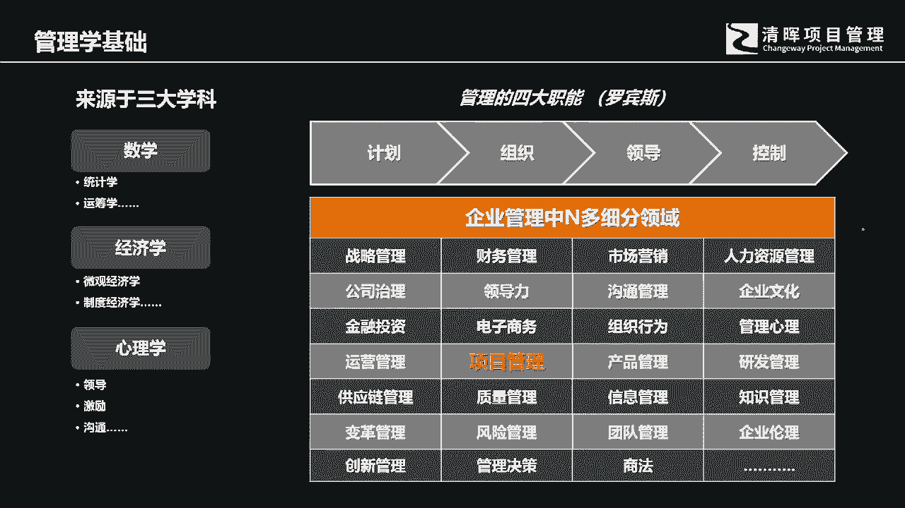

项目本身它在整个公司的经营的过程当中，它的位置和作用到底是什么，任何一个公司参与到市场化的竞争，离不开两离不开一个东西，就是产品可能是有形的，也有可能是无形的，那什么叫产品呢，其实产品就是项目的结果。

而项目简单来讲就是实现产品的过程，我这里有一张图给各位去做分享，各位要用一个更宏观的角度去来理解，项目，对整个公司的经营和竞争起到的价值和作用，我们之所以有项目，项目的目的。

就是为了能够交付我们所规划出来的产品，项目的作用和位置，在整个的这个产品化的经营，产品的生命周期当中，它起到了非常重要的一个环节啊，所以我们讲说你要去了解一个事物啊，爱因斯坦曾经有说过一句话。

叫问题产生的层次，你是找不到答案的，你是找不到答案的，所以的话我们要用一个要用一个更宏观的视角，去看待项目在整个公司经营和产品的发展，生命周期当中的价值和作用，这是两者之间的联系好。

那么我们讲说所有的工作从哪里开始哈，所有的工作是从问题开始的，这个问题我们要打一个引号，这是我们在经营和管理的过程当中，企业经营和发展的过程当中，我们看到的一个又一个的落差，其实就是所谓的问题。

问题的本质其实就是落差，他是发现了我们的企业的当前状态，和我们所期望状态之间的差距，然后呢，我们通过一系列的创造性的方式去来，弥补这个差距，使得组织能够成长和发展，所以我们的一切的出发点。

都是从发现问题开始的，所以对于一个项目经理来讲，管理很重要，但同时发现问题的眼睛也很重要，也要有很强的，你要有很很敏锐的眼光，然后呢你要突破一些思维上的障碍啊，当然这个不是项目本身需要去注。

并不是PMP课程本身需要去讲，但是从数字本身来讲，作为项目经理也需要有这样的能力，然后呢我们会创造性地去解决问题，会发现解决问题的多种选择和路径好，那么我们在对问题本身进行solo。

因为我们在创造性解决问题的过程当中，必定会经历两个过程，两个阶段，这两个阶段第一个呢是我们的一个发散阶段，通过创造性创意的方式，比如说通过头脑风暴，通过集思广益的方式，各种工具的引导。

使得大家不会拘泥于曾经的经验，用更开阔的眼光，更灵活的眼光去来看待，现在所面临的各种问题和商业机会，然后呢第二阶段呢我们要去solo发散，最终我们要去收拢，为什么要收拢呢。

因为收拢是一个我们叫做你要回归实际回归，因为我们在做事情的过程当中，你会发现我们受到一系列的资源条件，环境的约束和影响，我们能够在当前的条件下面，选择的最佳选项会是什么，这就是我们的啊。

在创意之后的一个收拢阶段，当我们明确要去做什么工作，要交付一个怎样的可交付成果的，可交付成果以后，我们就会去立项，这个时候才会进真正进入到项目的阶段，我们通过项目章程的方式去来确立项目的地位。

确立项目对组织的价值和贡献，然后呢我们进行一系列的开发，通过原型，然后通过这个转化啊，成为具体的商品或者产品啊，然后呢在上市之前我们可以来进行批量化生产，接下来呢我们就进入了一系列的，市场的生命周期。

市场的生命周期，那那这个时候我们从我们的产品就进，就进入到市场，从导入增长成熟退市，当然在退市以后呢，因为环境发生了变化，因为需求发生了变化，客户在使用的过程当中也会有新的意见产生，我们就进入了。

我们就进入到下一期的循环啊，我们就进入到下一期的循环好。

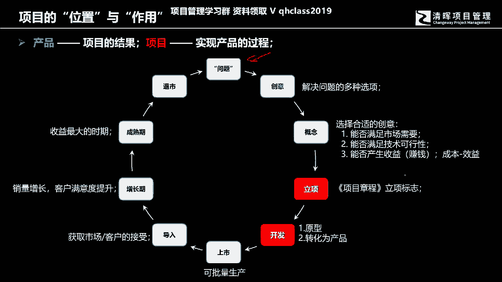

那么我们在学习这个偏僻的时候，接下来我们来学习这个偏僻的时候，那么我们会面临的学习，会用到怎样的工具和方法，在开始我们接下来的内容的时候呢，我们要引入一个模型，这个模型呢是来帮助我们去来分辨。

我们在怎样的环境条件下面，选择怎样的工具方法是最合适的，所谓的尺有所短，寸有所长，并没有哪个方法能够在所有的情境下面，都能够被适用，都有其价值，我们要根据实际的情景和环境来选择，我们的工作方法。

也就是我们具体的项目的啊开展方式，这个模型呢我们叫CSTACEY复杂度模型，CDC复杂度模型呢我们通过背景和方法的比较，就可以明确的知道，我们会用怎样的方式去来解决当前的问题，来开展怎样的项目管理工作。

那STC呢这个STC复杂物模型呢有两个维度，一个维度呢叫技术维度，这个计数维度可以，你可以把它理解为供方的项目团队的能力，技术条件所具备的各种资源好，然后还有一个维度我们称之为叫需求维度。

这个需求维度很明显就是我们的需求方，我们的客户，我们的甲方他们要什么东西，那这个时候呢，我们用确定和不确定，来对我们的情境来做这样的一个划分，那么这个时候你就会发现，我们这个所谓的确定和不确定哈。

之前我们有讲过，这个不确定的是项目的独特特征，对不对，好就代表你在做决策的时候，你其实你并不知道接下来会发生什么，或者说有没有可能会背离，或者超出你曾经的规划基准或者预期啊，这就是所谓的不确定。

但是确定就是百分之百的啊，就是你很明确接下来会发生什么，那这个时候呢，就把我们的这个啊各种情境做了分类，如果我们的我们有一类，我们有一类工作哈，其实作为项目团队来讲啊，完全有能力完成都在我的能力范围内。

同时呢我们的客户呢，能够把自己的需求讲的非常的明确，连具体的验收规格，它都有非常明确的这样的一些阐述，那么在这个时候，目标清晰，方法明确，我们要开展工作的时候，其实是非常方便的，很简单好。

那么还有一类工作呢，我们称之为叫烧脑，这个烧脑是什么呢，就是你可以想象一种情境，各位可以回想一下，自己本身曾经从事和经历的工作，你就会发现其实并不是我不行，我们整个团队包括我自己具有很丰富的经验。

客户提出的所有的各种需求问题我都能够解决，但是问题是客户提不出需求，客户只能提出一个大概方向，感受体验很模糊，我们需要不断的去来进行沟通和相互的磨合，然后呢不断的去来进行某种方式去进行确定。

客户才能够明确知道哦，原来我要的是这个东西，所以并不这个这个地方为什么烧脑呢，就是对方描述不清楚，虽然我有能力，但是对方却描述不清楚，这其这个地方我们称其为叫复杂，这个复杂呢它叫啊completed。

但是另外还有一个复杂，这个复杂叫complex，这个复杂强调的是什么，就是客户可以提出非常明确的要求，但是作为我们的项目管理团，我们项目团队我们的技术储备不够，我们的经验不够。

我们的技术手段得有不断的更新啊，不断的去来进行这样的一些调整，才能逐步逐步满足客户的需要，这个复杂呢我们称之为叫棘手好，那么还有一个呢就是我们讲说技术也不明确，需求也不明确，它就是一个高度混乱的。

如果你是一个商业化的组织，你在市场当中参与竞争，如果你要面对作为一个团队的带领导者啊，你或者说你作为项目经理，你如果要从事这样的一个项目工作，你就得认真思考一下这个事情值不值得做。

如果做他的失败概率会非常的高，所有的投入都会付之东流，那么我有没有必要去参与进去，那么当然还有一个第五种，我们称为叫模糊的，部分的需求是清楚的，但是部分的需求呢客户描述不清楚。

有一部分的工作我们可以借助经验，但是有一部分的工作呢，我们需要不断的去进行开创，不断的去进行试验和试探，我们才能够进行完成，所以这就把我们的所面临的情境，分成了五种类别，这五种类别呢其实恰恰就是五种。

项目管理的方法，应该说是只有四种项目管理的方法哈，在这个图中间产啊，对应的是四种图的项目管理方法，那第五种我们称之为一个决策，叫什么，这个混乱的这个混乱的地方，第四个混乱的地方啊，千万不要去碰。

因为作为商业管理，你不要去碰它，好，那么，我们去来，我们去来这个哎我什么什么标，我的弹幕什么意思，没有人标你的弹幕啊，没有人标你的弹幕好，那么我们这个，没说话啊，每个人都是这样的。

你每个人打开的时候都只是标自己的，不会标别人的啊，每个人一开始进来的时候，都只会标自己的弹幕啊，各位不用担心哦，我还以为你有什么，刚才有没有不明白的问题哈，我再次说一下啊，各位如果有什么不明白的问题。

可以可以简单提问哈，可以简单提问好，OK这就是我们讲CDS模型，其实我们在管理的过程中，并不必然说哪种方法是最好的，我们只有适合的，而没有最好的，关键是在于我们在学习的过程中，我们在实际工作的过程中。

需要把这个情境做分类，然后呢再把这个方式方法做相应的对应好。

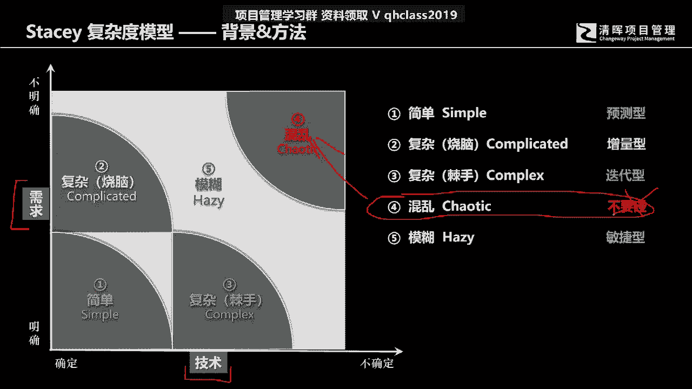

那么我们跟各位做一个简单解释哈，在未来的学习的过程当中，如果各位是已经报名开始学习，准备来学习这个PM1的时候，这个预测型的生命周期各位肯定是需要掌握的，而这个预测型的生命周期。

所谓的啊这个瀑布式的管理方式，其实恰恰面对的，对应的其实就是刚才我们讲到的这个简单区间，一个简单的那个区间，需求明确，技术方法明确，目标是清楚的，我们可以以终为始，各位可以听明白，叫以终为始。

然后呢来开展相应的工作，那么这个以终为始呢，就是我们在开展的过程当中去可以啊，根据结果倒退着做计划，然后顺着计划去执行整个管理的过程，整个管理的过程我们其实是可以通过这个啊，这个这个应该叫做纠偏的方式。

其实我们整个管理管什么，管的就是偏差，管的就是偏差，管的就是我们实际的工作，和我们的计划之间的差距，就相当于右边这张图，各位可以看到的就是什么呢，就是我们可以通过假设说有一个项目啊，我们有三个阶段。

这三个阶段呢我们要完成三个功能，那完成三个功能呢，那么这个时候所谓的简单区间的工作，我们用瀑布式的方式来进行应对，你就会发现我们可能一开始，第一阶段会把所有的相关设计工作全部完成。

然后再来把所有的建造工作开始完成，然后直到最后完成以后，我们来进行测试和交付好，那么这个时候呢。

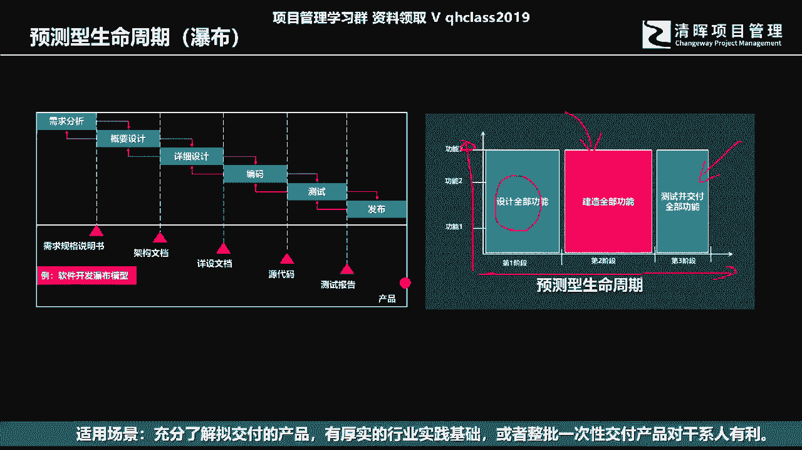

我们就是一个面对简单区间的工作，那么另外呢各位可以看到我们刚才有讲到，有两种所谓的复杂，这两种所谓的复杂，一个是我们称之为叫迭代，一个称为叫增量碟，那么首先各位各位问一个问，介绍一下哈。

这是我们用一种用这样一个例子，跟各位介绍一张一种情境，这个情境叫什么呢，就是我这里提一个要求，就是也许各位在实际的工作中也可以举一反三，联想自己的工作的情境，比如说假设这里有一个建筑设计师。

或者说一个一个房屋的一个内部装潢的设计师，他接受到的一个任务，跟客户交流的过程当中，客户提出的要求是什么，我想有一个舒适温暖的卧室，那什么叫舒适温馨呢，什么叫舒适呢，什么叫温馨呢。

这个概念其实每个人的看法都是不一样的，这个时候啊，客户能够提出来的所谓的要求也就是这个了，那对于设计师来讲的话，我怎么能够交付一个，对我当前的这个具体用户来讲，叫称被他能够称其为叫舒适温馨的卧室呢。

这样一个交付成果我怎么做得出来呢，我用什么样的方法，我用什么样的方式可以把这个结果给做出来呢，其实这是一个很困难的事情，因为客户连自己要有一个什么样的，一个具体的交付结果，它无法描述。

无法用量化的方式进行陈述，他只能表现自己，表述自己的感受，表述自己的各种各种各种体验，而这而对于生产者，对于设计者来讲，他会他要强调的是什么，他要强调的是具体尺寸，造型颜色材质。

客户其实是不具备这样的专业知识，我们能够做的方式是什么，在这个领域里面，你看到的就是对设计师来讲是什么，设计师所面临的情境是你跟我讲的，所有的具体的东西我都可以完成，关键是你讲不具体。

我得不断的跟你去沟通，不断的去做出来，让你去感受，那么这个时候呢我们用到的方法是什么，其实用的就是增量交付，所谓的增量交互，举个简单的例子，你说那这个卧室要温馨舒适，那我就那怎么叫温馨舒适，床。

要有暖床，要是一个什么样的风格，整体应该是一个什么样的风格，灯光应该是是一个什么样的风格，客户客户其实是描绘不出来的，作为这个设计师，他可他面对这样一个设计项目的时候，他可能会这样来做。

他说这样我来给你设计，你说行，我我就留下来，你说不行，我就跟你换，一直换到你认为合适，比如说诶我说床哎，你看这样的一个欧式风格行不行，客户说缺点意思啊，那么简约风呢，诶有点像了，OK我们把颜色调整一下。

哎客户说不要太老，不要太老成，OK那我们用换名鲜明一点的颜色，OK那觉得可以好，床确定下来好，接下来呢我们来做设计灯光，那你说灯光的话，我们是用水晶吊灯还是用吸顶灯啊，用多少用多少瓦的。

然后呢如何去做控制开关啊，墙体墙体用什么样的颜色，是用床，是用墙纸还是用油漆，那还有其他的一些设计，梳妆柜啊，类似这样的一些具体细节，一个板块一个板块，一个板块跟客户进行确认交付，逐步逐步完成细节。

直到最终完成整体的交付，这个我们称其为叫做什么叫做增量交付，增量交付所面临的情境，用需用设计师，用项目团队的视角，你看到的情境是什么，就是客户提的所有的具体要求，其实我都可以在我都在我的这个技术范围内。

但关键是客户提不出来，我得不断的去试验，不断的去拿出一个具体的东西给客户看，OK我就留下来啊，这个局部就完成了，如果不OK我就我就得不停的去来做调整，换改稿，一直到最后所有的细节都完成，直到最终的交付。

那么还有一种情境是什么呢。

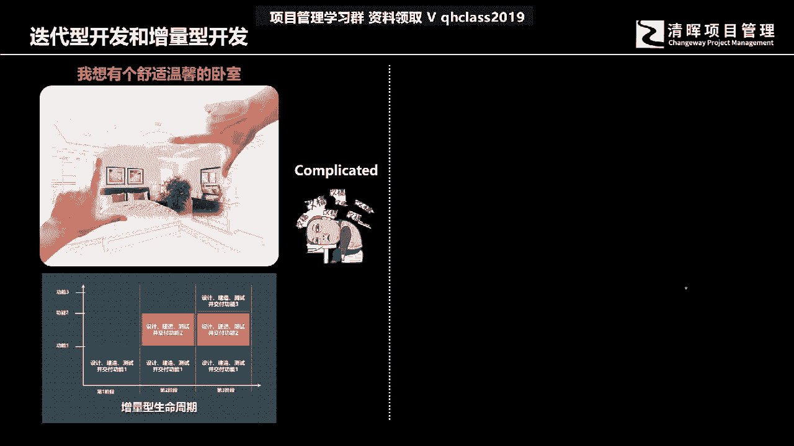

还有一种情境就是客户有非常明确的要求，因为现在我们假设说我们每个人，其实啊可能上下班通勤，并不是很多时候都有自己的私家车，即使在类似像上海这样的城市，你待个几年以后，你就会发现你有辆私家车，还不如没有。

为什么停车很难，而且的话停车费还很贵，所以还不如我在这个上下班的时候用公共交通，关键公共交通的时候，最后一公里那件事情是很难办到的，所以我很想要一款可折叠的电动驱动的，重量轻的。

可方便携带的一辆电动自行车，我可以说的非常具体，甚至说包括这个尺寸，我说我可以背得起，我可以背起来重量不要超过多少公斤，好类似这样的具体的需求他都可以说出来啊，问解问题是为了达到客户的需求。

现在也许接这个设计，接这个生产活的这个团项目团队，他可能并不具备所有交付这样一个完整结果的，所有的技术细节以及管理方面的啊，这样的一些细节，那这个时候呢对于项目团队来讲是什么，他是在交付方式上面。

交付方式上面他面临了问题，客户可以把需求描述的非常的清楚，但是在技术层面我们如何去完成，其实是很麻烦的，就像这幅漫画上面，各位可各位可以看到这句话叫什么，甲方说logo放大的同时进还要缩小一点。

看客户的要求明明明明不明确啊，其实客户的要求是很明确的，但是我做不做得到啊，很难做到啊，这个技术上面我们并不具备啊，这是开玩笑哈，但是在具体的这个产品交付的过程当中哈，产品交付的过程当中啊。

可能我们有些个，我们有些项目是客户，能够说出一些很具体的要求，但实际上呃我们并不具有专业的能力，能够在当前能够完成。

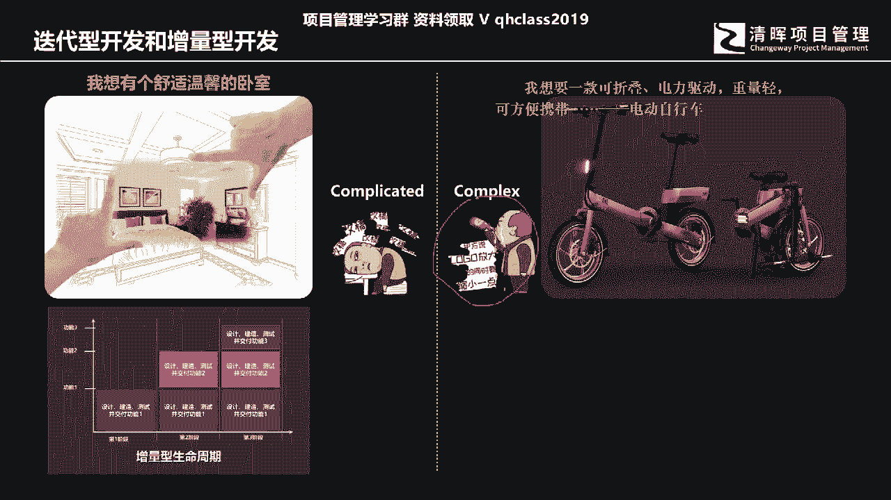

我们得不断的去试验和试探，这个呢我们称其为叫迭代迭代迭代，站在技术的供给者，站在项目团队的角度来讲，就是我在方法上不断的去更新，在方法上，在交付的结果的技术组成和管理方法上面。

我们不断的去通过试验的方式，逐步逐步来趋向于客户的要求和结果啊，通过一代又一代的产品的交付结果，来检验我们的客户需求，达到客户的期望，同时也检验自己的技术能力，提升自己的技术能力。

其实这就是我们的迭代跟开发的差异，迭代和开发的差异，那么在第七版的书里面，在像在PMBOK，现在我们虽然学的还是，我们是我们现在的这个偏僻的考试哈，他还没有用到新版的教材，他只是在用新版的考试方法。

知识的内容还是在第六版里面，但是在第七版的英文教材里面，我们提前看到他已经开始在着着重强调一些，曾经我们在之前的PMP学习里面，说忽略掉的一些内容，所不重视的一些内容啊，所以各位在今后的学习当中。

尤其这一尤其咱们这一新的一期哈，你既要学习跟PNP相关的历史上面的那些啊，瀑布式的管理方式，同时也要学习新的管理方法，也是敏捷，所以敏捷的内容在新几期的考试呢当中，它占的比重都是非常高的。

那我们的迭代和增量呢，其实它组合起来就是我们的敏捷，敏捷是在一个相对短的周期内，不断的去来通过增量交付的方式迭代，同时也用迭代的方法，然后呢去完成交付，然后呢去来进行这个自我的这样的，一个学习和成长好。

那么我们刚才讲到了迭代和增量。

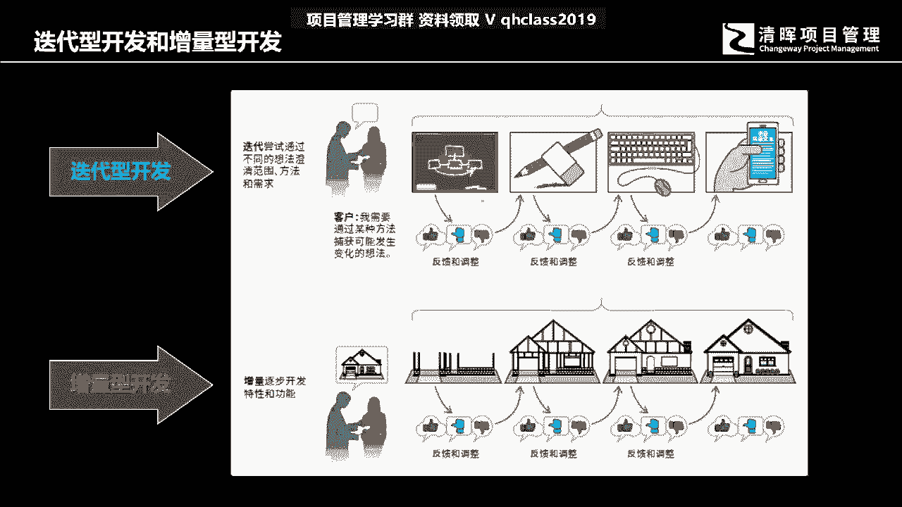

那么其实敏捷，其实就是既迭代又增量的一种方法，那我们在今后的啊正上正课的时候，来开始讲适应性生命周期的过程当中，面对我们的这个叫模糊的领域，叫乌卡的时候，叫WOA的这样的一个情境，下面的管理方法。

我们会用到敏捷的具体的方式和方法，那在新版的考试当中，新版的考试当中，我们所用到的这个这个敏捷的这个实践，当然同间同时里面还有一些比较小，比较少数少部分的XP也有极限编程的内容，但它所涉及到的这个知识。

它基本上是以概念的啊，最基础性的内容，来跟各位去来做这个学习和解释和分享，所以但是在新版的考试里面，我们既有PMP，也有这个CP的一些部分的内容啊，asp的部分的内容，这个所以各位面临的挑战。

其实比以前的偏僻学考生要更难了啊，比以前的考生要更难了。

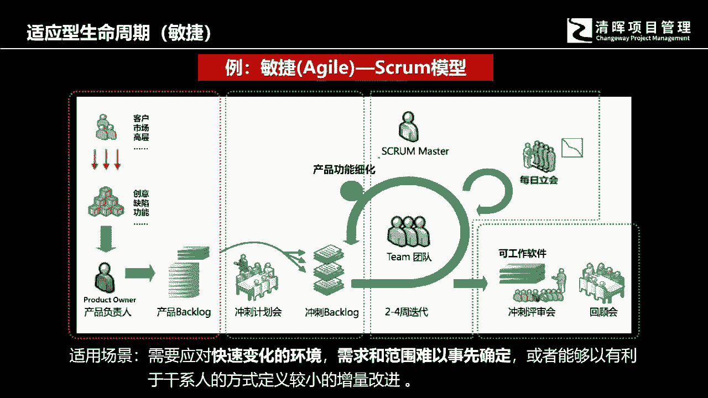

好这就是我们讲这四种生命周期，那么简单来讲的话，就是各位要明白一个道理，就是我们要根据情境，根据环境去来选择不同的管理方法。

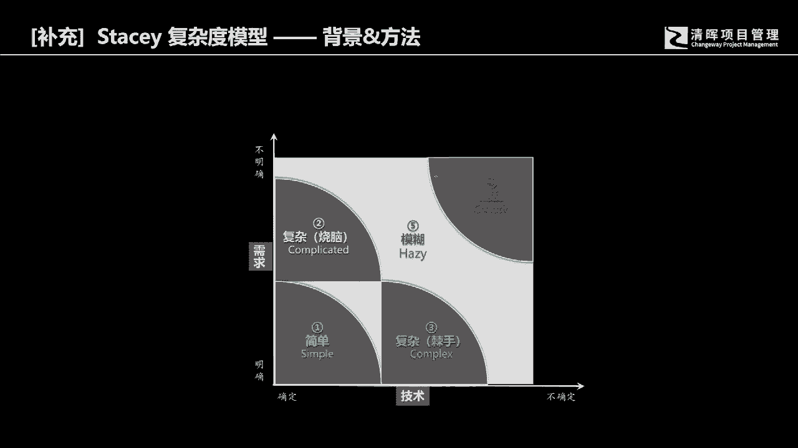

那么针对简单的管理方法，我们会用到的是瀑布式的管理方式，那针对这个复杂的烧脑的，我们会用到的是增量的方法，那么如果面对的是我们客户需求很明确，但是我们的技术手段包括管理方法。

并不是完全能够解决当前的问题，我们就需要迭代的方式，不断的去优化当前交付的结果，同时通过一代又一代的产品的交付，既满足客户的需要，同时也使自己的专业知识和经验水平啊，得以提升，至于说这个模糊的。

它是既迭代啊又增量的这种方式，它是一种，它是一种这个包含了迭代和增量的两种方法，融入到整个的整个的这个敏捷管理的，迭代周期当中来进行呈现的。

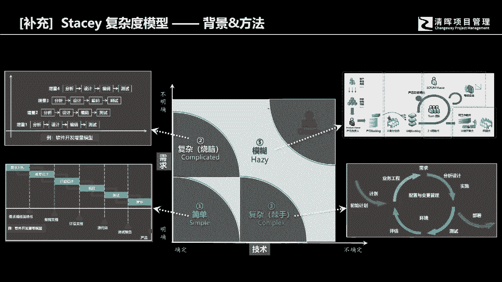

所以新版的考试PMP的学习内容呢，它所涉及到的科目内容，既有各位拿到的这本书，它占有50%的内容，同时呢敏捷的内容呢，以我们现在看的前几集的考试的经验来讲啊，有这个逐步在提升的这样的一个趋势。

上一期的考试的学员当中，有很多人说，考试的题目当中差不多有50%以上，甚至有60%的题目，都是以敏捷或者以混合型的项目，生命周期的题干描述来进行考试的，其实这也是一种趋势，因为社会在变化。

因为我们的社会变得越来越复杂，越来越不确定，有很多模糊的地方，不确定的地方，我们而且还发现了一而而且还发生了一些情况，就是它的变化速度太快，现在你今天所确定的事情，明天就有可能会发生变化。

你今天所能够用得到的，你认为可行的工作方法和手段，那么放到下一个阶段有可能就会失效，那这就是是因为环境在发生变化，所以偏偏mi本身也在发生相应的这样的，一些改变去来优化我们的专业知识啊。

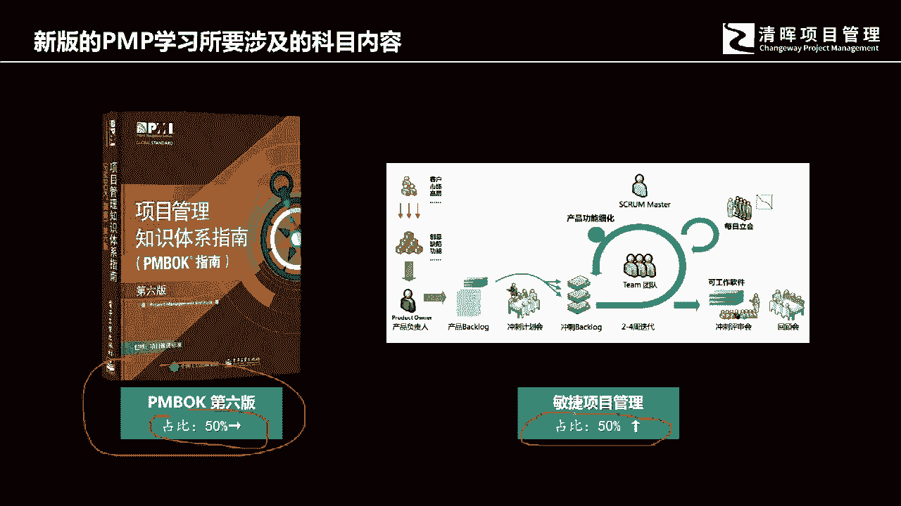