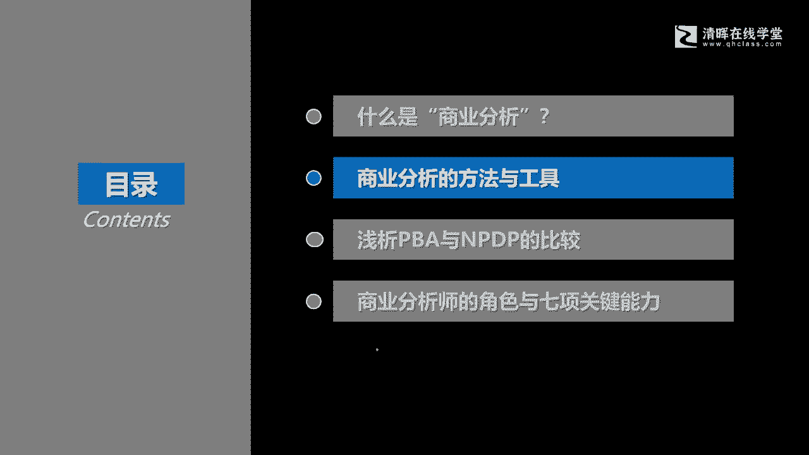
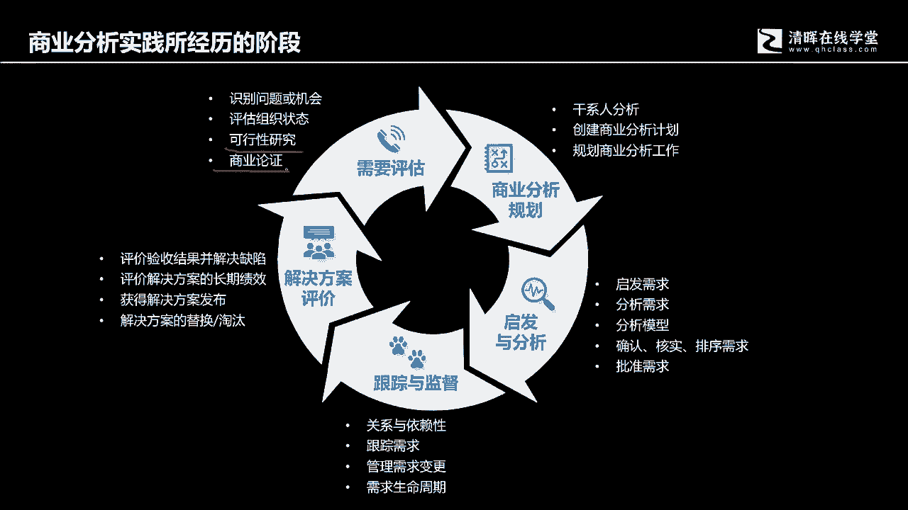

# 从项目管理到商业分析，从“单环学习” 到“双环学习“ - P3：3.商业分析实践5阶段 - 清晖Amy - BV13J4m1w7Wh

好那么这我们了解了什么是商业分析，那今天呢我们抽一点时间去跟各位，去去去分享一些商业分析中间的方法与工具啊。

方法与工具很典型的一些方法和工具，首先第一个呢就是我们要知道，刚才我们有说说商业分析，它是为了交付与商业目标保持一致的解决方案，为组织提供持续价值的一组活动，那这个一组活动包含什么。

我们首先从需要评估开始，各位记住啊，他不是需求评估，而是需要评估，他是明确方向啊，明确项目的投资目标的好，那么需要评估包含什么呢，你要去发现所有的缘起，都是从发现问题和机遇开始。

如果在座有人是有学过NPDP的，你一定回忆得起来，所有的这个产品开发的过程当中，一开始是来去评价或者说发现识别问题和机会，然后呢再来评估组织状态，什么叫评估组织状态。

其实当我们来发现问题或者说发现机遇之后，我们得做第二步，一个很自然的思考，我有没有能力去完成它，抓住机会解决问题，所以我会对组织现有的状态和，所期望能够解决问题的。

或者说抓住机遇的那个状态之间有没有差距，所谓的评估组织状态其实就是组织能力的评估，这是和这是一个很自然的时刻，就像你在街上，或者说你在读，你在思考，你在看书，你在跟很多人交流，你发现了很多的商业机会。

但是所有的商业机会，你是不是都想去参与一下呃，这个参与一下呢，这个时候你首先第一个反应就是，我有没有能力参与，比如说你跟着一帮大佬大，现在大佬说哎我们这个一起啊，搞个几10亿，做一个基金。

可以投资某某行业，投资某某赛道，我老人家我就是个打工的，我一个月也就那么几千块钱啊，努努力可能有个一两万块钱，我我我我我我我哪有能力去搞，搞一谈，几十呃，分分钟上下几十呃，呃几几10万上百万的生意呢。

搞不定嘛，我没那个能力嘛，我得先解决能力问题啊，所以很自然的一个思考，当我们发现问题和机会以后，我们第一个反应是什么，第一个反应就是我有没有能力去抓住它好，假设我们复合能力要来，要来作为组织来讲说。

我要抓住这个机会，我一定要要要抓住这样的一个机会，解决这样一个问题，提升自己的竞争力好，那么这个时候评估完能力，我们就会发现我们能力上是有差距的，所有的项目启动就是来填补能力差距。

但是解决一个问题不会只有一种方案，也不会只有一个措施，就像古时候的军师，跟自己的主公去来推荐策略一样啊，主公我有上策，中策下策啊，也就是说解决一个问题其实不会只有一种手段，每种手段有它的好的一面。

也有它负面的一面，那我们那我们就会根据现有的状态去评估，最佳的选择会是什么，那这个过程叫什么，就叫可行性研究，那可行性研究我们就会评价各个方面，比如时间上面，允许成本上面，允许技术能力上面有。

不允许我们后期运营维护上面我们有没有条件，而这个各个方面，包括组织的文化，包括我们可以通过一系列方式去来进行验收，确认我们用没用方式进行测试啊，然后呢我们还有包括会承担怎样的约束啊。

会有哪些假设条件啊等等等等，这些都是来评价可行性的要素，我们来做一个选择，我们来做一个解决方案的评价，其实又会有考虑12个方面，会考虑12个方面，那当然我们讲说你其实落地的时候会做裁剪，对不对啊。

所有的这个裁剪的概念是持续存在的，裁剪的概念持续存在的，所以你在做可行性研究的时候，可行性研究的时候，其实你会有当然会有参考的12个方面，那你不会说每个不每个大大小小的项目，复杂度啊。

不同规模大小的股东，你都会把这个方方面面都会想想，都会都会来啊分析一遍，这也大可不必，你也可以根据你的实际情况来做选择，最后呢那我们就会有商业论证，其实商业论证呢就是把前三项做了一个整合啊。

形成一个最终的一个一个文件，这个文件就是一个非常重要的一个文件，这个文件拿来干嘛，它是经济可行性研究，这个商业论证就是经济可行可行性研究，他研究研究，研究的目的，这是我们看到的第一组活动。

第二组活动我们称之为叫商业分析规划，我们会进行干洗人的分析，因为商业分析的过程当中，商业分析师自身所具有的专业知识和技能，它是有限的，尤其是各种信息，各种知识，它需要该系人的参与参与，让希望干些人。

能够参与到我们的商业分析活动中，贡献自己的知识经验，技能资源，帮助我们完成商业分析工作好，所以我们会做商干系人的沟通协调管理好，然后呢还有就是这个通过跟该行人的互动啊。

最终我们来创建这个商业分析计划和规划，商业分析工作如何展开好，那这个就是我们的商业分析的规划的工作，我们需要去完成好，那么第三个方面就是启发和分析啊，我们通过一系列工具啊，我们谈到如果要启发啊。

在我算下来有九类启发工具，分析工具呢它有五大类，20多种分析模型好，然后呢再就是会经历确认核实排序啊，也批准这一系列的啊管理过程去明确，最终我们会有一个叫需求文件，如果这个文需求文件被批准了。

就形成了需求基准，所以各位再回想一下需求基准，其实就是我们在项目管理，在项目管理，项目管理的第五章范围管理中间，我们的啊这个这个规划范围管理，非常重要的一个输出啊，好然后呢第四个就是我们要持续跟踪了。

跟踪的时候会考虑依赖关系，项目的需求的状态的变化，会用到需求跟踪矩阵，但现在我们在商业分析里面讲到的，需求跟踪矩阵，供我们在PNP里面学到的那个需求跟踪矩阵，它描述的更复杂一些。

PNP里面所描述的那个需求跟踪矩阵呢，他只是提出了一个概念，如何跟踪跟踪什么跟踪的细跟踪的方法，它是一个怎样的一个结构化结构化的呈现啊，这个都是啊，我们讲是商业分析中间特别要去展啊。

这个学习和这个理解的，那第最后一个就是就做解决方案的评价了，有基础的验收标准啊，满足验收标准的评价，另外还有一个就是要跟踪长期的绩效好，如此循环，当你评价完了以后，也许又会发现新的机会。

也许发现了新的问题，那我们就可能又会开始新一轮的循环，以此来持续推动我们整个组织的成长和发展啊，所以商业分析实践所经历的各这些阶段，以及我们要所谓开展的叫一组活动，所谓商业分析的那一组活动指的是什么。

就是这一就是这五大类的啊，结构化的啊，清晰的这样一组活动啊。

