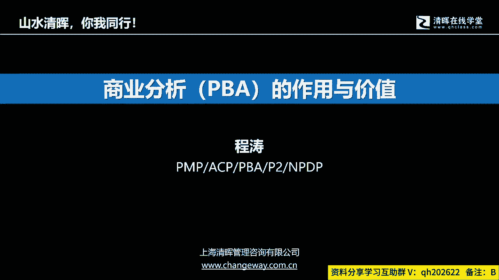
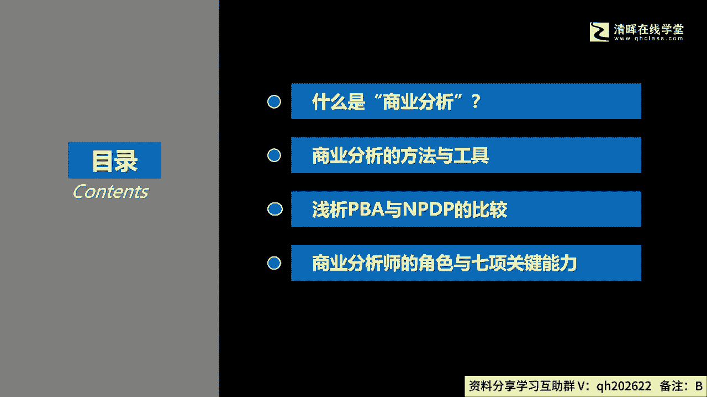
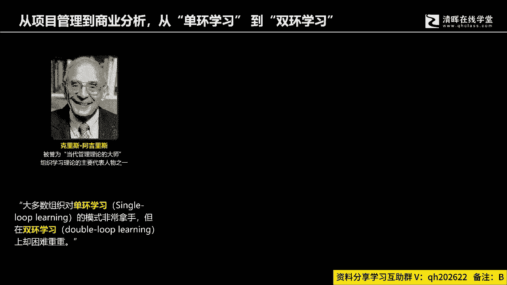
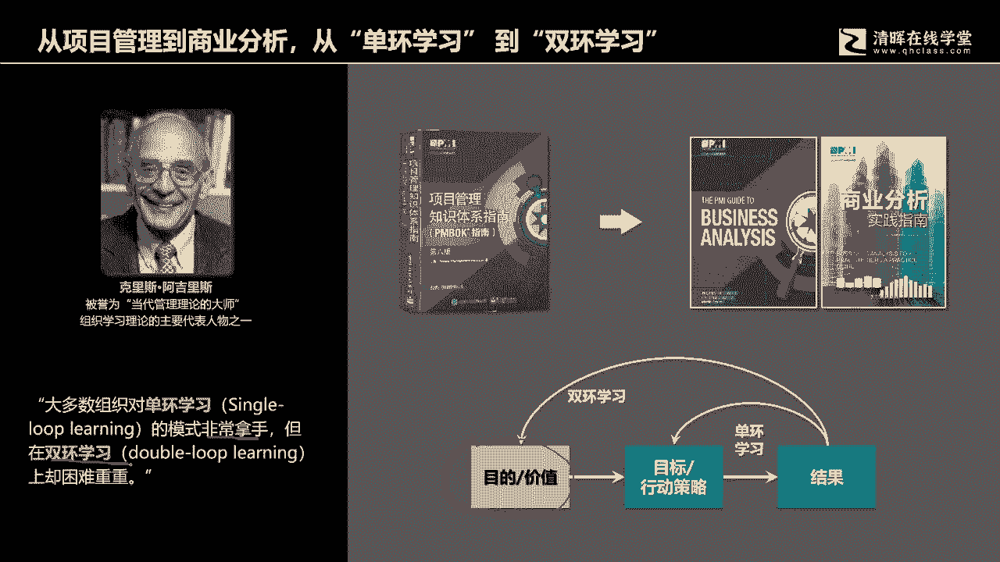
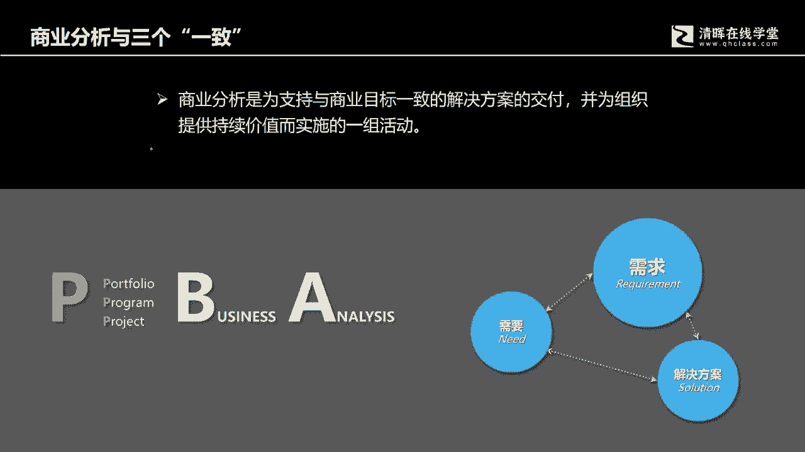
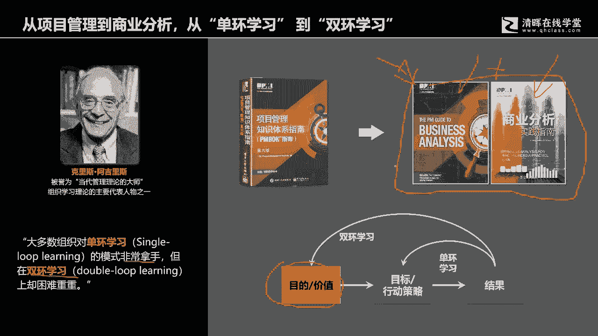

# 从项目管理到商业分析，从“单环学习” 到“双环学习“ - P1：1.从项目管理到商业分析，从“单环学习” 到“双环学习“ - 清晖Amy - BV13J4m1w7Wh

我们今天开始一个介绍课啊，介绍什么呢，介绍商业分析，PBAPMI的三大基础课程之一，我是今天的分享讲师，我姓程叫程涛嗯，今天的内容呢我们分四个部分。

想跟各位去了解一下，因为时间毕竟有限，我就拎重点跟各位介绍什么是商业分析，商业分析给我们带来的价值和作用，然后呢现在有很多同学，我们是8月19号考试的，今天啊，这一周这一周这一周是我们拿到的成绩对吧。

我们拿到了这个盼望已久的那个考试，结果很多学员考的还非常棒啊，3A的我看到有好多PMP考试的，然后还有考ACP的呃，据我所知，ACP的考试的结果是好像全员都是A哦，不不全员都是通过的哈。

还有学员呢可能之前努力去学过n pp，很多学员也在思考，说当我学完这些课程之后呢，我还可以再学点什么，前两天我看到清辉的一位学员，真的是激励到我了，我们清会一共有13门课程，他已经拿到九个证书。

最新获得了一个PGMP啊，绝对的大脑还绝对的大拿大脑，对吧哦好然后呢，所以今天呢我们会有个第三个内容呢，就是跟各位去啊分解一下，当然是浅析啊，我们的PPA跟NPDP之类的比较。

其实很多学员在学完这个PMP，学完这个项目管理ASP之后呢，他会来思考一个问题，就是我接下来的路该怎么走，我的职业生涯发展，我需要怎样的一个知识啊，体系架构去来支撑我未来的发展，呃。

有些学员呢他是一条心，向着项目管理的方向去前进啊，去学了这个PMPSPPGMP啊，还会补充一个prince two，有些人呢还会去考一个这个软考啊，是自己在整个项目管理体系啊，这个知识体系当中呢。

构建一个非常棒的一个完整的一个结构，但另外还有些学员是想往产品啊，企业经营，商业管理啊这个方向去发展，那有的学员呢可能站在十字路口啊，去去去左右为难，那我到底是先学一个PPA，还是先学一个PNNPDP。

还有一些学生可能就是学完PMP，学员项目管理，学完这个NPDPP之后之后呢，他还在问自己一个问题，就是我要不要去学一个PBA啊，所以我们今天第三个部分呢，就是跟各位分享一下。

这个PBA跟NPDP之间的这个这个比较好，然后第四个呢当然就是我们要认识，作为商业分析师这个角色，他应该具有的关键能力，这个能力可能非常抽象啊，他是属于这个数值能力啊，你不是不是单纯的去谈谈专业技能啊。

比如说这个数学的能力啊，数据分析的能力啊，口语表达的能力啊，绘图的能力，我们不谈这个我们谈的是什么，作为商业分析师，作为其实作为一个啊这个这个管理者，产品管理者，商业分析人员啊。

他应该具备的这个啊这个素质啊，这个所谓的叫职业素养方面的能力，所以今天呢我们分四个部分跟各位做介绍，呃。

那一开始呢啊我一直在想，我怎么去来引入一个话题，就是什么是商业分析，为什么我们要去学商业分析。

其实这也是一直以来，我们有很多学员去学完很多课程之后啊，那他想梳理课程跟课程之间的关系的时候，他也是困扰着大家的一个问题，呃其实这样来讲哈，我们把这些课程科目都给抛开，无论是ACP也好，偏book也好。

敏捷实践指南也好，商业分析实践指南也好，等等等等等等啊，产品经理啊，这个知识体系也好哈，你都把它抛开，我们从一个更抽象的角度去思考问题，其实在我们的企业管理，不论是做经营管理还是做这个项目管理嗯。

在绝大多数组织当中，我们都希望我们的组织和参与组织经营的个人，不断的通过经营活动，项目管理活动，提升个人的专业知识啊，这个啊还有包括从中间体会啊，各种各种知识，然后提升自己的技能。

然后呢如果你是在刚刚去做啊，或者说你学完这个项目管理之后哈，你会发现我们曾经在讲项目管理的时候啊，有多少人让我们稍微回忆一下啊，这个毕竟考完试以后，我们也有两个多月的时间。

其实我相信有很多人是没有碰过书的，或者说没有时间去啊，去这个这个回想这个我们的书本中的知识的哦，我记得在讲PNP的时候的第一次课中，我们去介绍PMBOK的实物矩阵，尤其在讲五大过程组之间的关系的时候。

有一张图是非常有价值的，他说的是啊，我们的是一个p DC的一个关系，这个关系是什么呢，就是我们做完规划，我们就会去执行，执行跟规划之间形成了一个闭环，它后面还有一个环就是监控，这个代表什么呢。

代表是说当我们在既定的目标啊，已经明确目标，已经明确目标之后，那我们为了实现这个目标啊，无论是交付新产品还是改进产品，还是优化方案啊，这个提高组织的经营效率啊，然后呢提高组织的资产利用率。

简化流程等等等等等等，或者开辟新市场呃，项目的类型会非常多，我们身边我们的生活啊，处处皆项目啊，然后的话呃，我们会在一个既定的目标前提下去开展工作，当我们发现我们的结果啊，我们的结果没有没有达到。

我们的这个目标要求的时候，我们就会去回想过程啊，我们的过程是不是真正有效，然后呢去优化调整结果啊，然后再希望通过我们有效的这个过程去，来得到我们所期待的结果，所以它就形成了一个所谓的单环。

形成了一个单环，形成了一个单一的闭环，但这个单一的闭环它有个很大的一个背景的，我们在讲PNP的时候，在讲项目管理的时候啊，ACP的时候其实是没有提到的，就是说我们的目标它到底是怎么来的。

为什么会有当前的目标，当前目标的价值和意义又是什么，那这个价值的意义，那这个价值或者意义他又是怎样定义出来的，它通过怎样的一系列过程去明确的，如果我们的方向一开始就是错的，那么我们的PDC也好。

我们的工作方法也好，做得越高效，其实离这个方向就会越来越远，我们真正要获得的要达到的目的地，要获得的预期收益也就无从谈起，也就会啊甚至背道而驰啊，越跑越偏，越跑越远，所以当环学习呢只能告诉我们。

对既定的环境下面啊，既定的目标，下面这个目标已经明确的时候，我们通过持续的PDC，通过持续的PDCA啊，然后呢去高效地实现这个目标，他强调的是作为一个管理者，或者作为一个执行团队，执行一个一个执行团队。

他如果如何更正确的去做事情，但是什么是我们的正确方向呢，正确的事情应该是什么呢，这个目的价值是什么呢，他是怎样定义出来的，怎样获得的呢，这个在我们的项目管理体系里面，其实它是没有过多去介绍的。

当然有个好的地方就是ACP呢，它或多或少会提到，但是它更还是强调于在一个乌卡环境下面，我们如何去获得啊，这个满足客户目标的这样的一个结果，但是至于这个目标如何制定，如何去明确。

它也就只有PO他一个人可能更关注，然后呢，那一身在其位必谋其政，那身不在其位不会谋其政，所以的话，PO他是有责任去来确保方向的正确性，那除此之外，其他的团队成员，更多的其实是在一个既定目标环境下面。

开展工作，所以的话啊虽然说在敏捷管理里面，我们或多或少提到过，但并没有讲的更深入，也没有对他进行深刻的梳理，但这个趋势是非常有价值的，就像刚才所说的，如果我们一开始的这个目的项目，投资的投资的价值。

项目集被投资的价值没有变，明确它的这个过程是模糊的啊，然后的话目标是目的实现是不清晰的，那么这个时候呢我们所设计的所有的目标啊，我们的工作方法，我们后期的这个工作方法想得到这个目标。

其实如果这个目标都不对啊，目标的方向都是偏离的，我们只会越跑越远，所以像当代的这个管理理论大师啊，克里斯阿吉利斯啊，他就提出一个大多数组织其实都是单环学习，非常拿手，一个单环学习的这个模式。

它是非常拿手，也就是单环的PDC，但是所谓的双环学习上却困难重重，为什么会困难重重呢，就是我们缺少一个东西，在我们的知识体系结构里面，缺少一个可以帮助我们去实，去发现真正的目的和目标的啊。

发现项目被投资的价值的一环，而这一环恰恰是被啊PMI体系里面的商业分析，这个内容给弥补了，所以我我我有时候一直在思考，说我为什么，或者说啊大家为什么要去学这个商业分析，其目的其实也就在这里。

让我们更有一个更更更宏观的啊，相对更啊更宏观的一个思考，去思考我们工作的价值啊，所以这个呢是啊，我们学习商业分析的一个呃价值意义所在好。

那么商业分析到底是什么呢，在PMI的商业分析实践。

商业分析指南和商业分析实践指南这两本书，刚才我们看到的这两本书啊，这是我们的教材，这是我们的教材，他两本书都会讲啊，一个是方法体系，一个是作为这个我们讲说是这个知识领域，两者之间结合，形成一个完整的。

