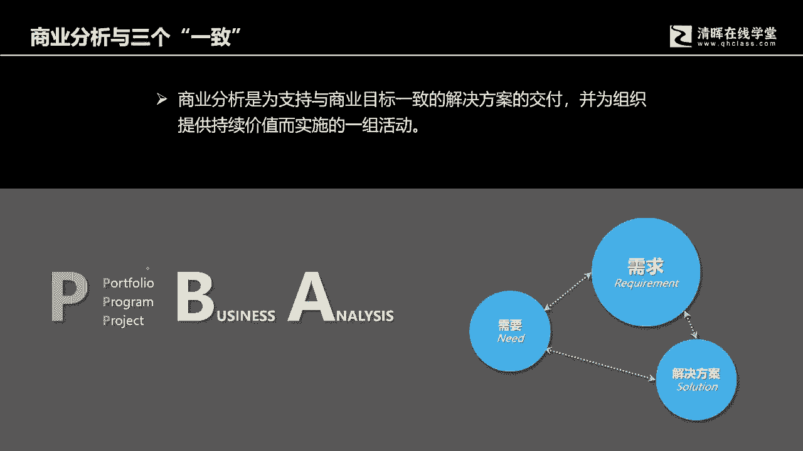
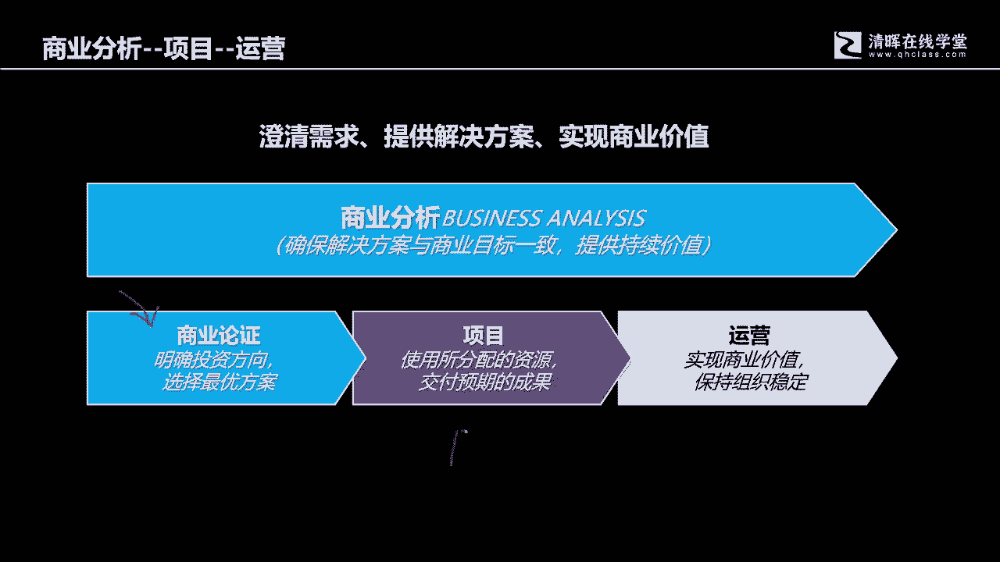
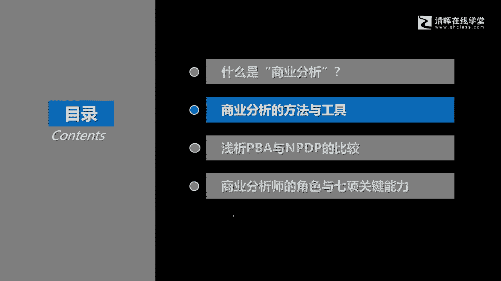

# 从项目管理到商业分析，从“单环学习” 到“双环学习“ - P2：2.商业分析与三个“一致” - 清晖Amy - BV13J4m1w7Wh

好那么这两本书都提到对商业分析，什么是商业分析的一个定义，那什么是商业分析呢，它有很多的关键词，首先一个是支持与商业目标一致的，解决方案的交付，并为组织提供持续价值的一组活动，所以这里面有好多的关键词。

第一个呢就是我们商业目标，要我们要明确一个所谓的商业目标，其实商业目标呢比我们想象的更抽象一些呃，他是脱离了技术层面的思考，不是说我们未来的产品应该具备怎样的功能，特征啊。

这个这个这个物理特征或者质量要求，它不是这个，他强调的是我们最终的交付物，应该实现怎样的商业目的，然后呢实现怎样的收益价值，简单来说其实就分两类，一类呢我们称其为叫啊，这个扩大自己的营业规模。

提升自己的营业收入的一些这种扩张性策略，策略背景下面所制定出来的一些目标，比如说新产品开发，满足市场的需要啊，然后的话对原有产品的改进，然后呢继续符合市场需求，然后呢进入新的市场开拓市场啊。

这些是扩张性的策略好，另外还有一些呢就是我们讲说是节流嘛，我们要组织经营，其实它背后都有一个非常简单的财务公式，利润等于等于收入减成本，我们既然有收入层面的扩张性思考，那必然同时也会进行一个在优化层面。

在于这个节流层面的思考，比如说用更少的人做更多的事，用更少的投资代价获得同样的收益结果，或者说我们啊在这个同样的投入成本下面，我们获得更高的收益，那么这个时候我们必然会考虑啊，这个人员技能的提升。

新技术的引入啊，资产利用率的提高，流程的简化，组织结构的梳理等等等等等等，这些我们都称其为叫商业目标，这些商业目标，它背后其实都是一个一个具体的解决方，案和措施来实现的，这些解决方案和措施。

最终都是以项目或者项目集的方式来进行啊，这个被投资啊来实现最终的交付，这交付有可能呢是具体的有形的产品，或者说是一系列的管理措施或者方案啊，最终支持着我们企业的营业收入的提升啊，这个成本代价的降低。

然后风险经营风险的可控等等等等，这些我们都称其为叫商业目标好，然后呢再就是后面的环岛它要保持一致，它保持什么意思呢，因为我们要交付解决方案，解决方案最终的交付呢，就是我们的项目最终的那个交付结果。

那个叫可交付结果，它能它必须要满足，或者说必须要实现我们的商业目标，那必须要实现商业目标，曾经我们在PMP讲课的时候，我记得有一个有一个环是非常有价值的，叫价值环，在NPDP的课程当中。

也也有些老师会讲那个价值观，那是现在这个这个价值实践啊，这个收益指南中间的一个环啊，从战略开始啊，目标措施啊，output啊，也就是输出啊，然后呢再就是成果all out on啊，Outcome。

然后呢再就是啊价值啊，收益价值好，那么作为现在的项目经理，你不仅仅要看这个十大知识领域当中，你会看到的这个我们讲说三重制约删除之夜，中间是交付这个高质量的结果啊，在满足进度和成本要求的前提下面。

交付一个啊满足客户需要的结果啊，满足这个一系列内在特性，满足要求的这样的一个结果出来，你同时还要这个结果，他要能够产生商业收益，所以这个解决方案呢它是要能够满足商业目标，它不仅仅只是在创造库存。

创造一个啊这个所谓的交付结果，而这个交付结果他一定要有商业价值，这也是项目被投资的根本化前提，因为所有因为项目本身就是一个投资行为，无论是企业内部的投资，还是说吸引外部的投资机构啊。

投资人某些特定项目进行投资，但所有的投资人的思考都有一个最根本的目的，无论最终的交付结果的形态，功能特征和物理特征如何，但它最终都有个最核心的目标，就核心的目的就是它能够产生收益。

所有的项目投资者都都是一个共有的思想，无论你的投资在哪个行业领域当中，所以要交付的解决方案，它不仅仅只是一个结果出来，它还要满足这个商业目标，是符合商业目标，所以这个商业分析它有个啊。

一开始的这四个方面啊，商业价商业目标解决方案，而且还要保持一致啊，保持一致好，然后呢在这个过程中啊，要交付跟这个商业目标一致的，但这个说起来很抽象，那怎么去实现它呢。

其实有一些知识在偏僻里面或多或少提到过，比如说如何确保一致呢，你看我们在曾经的偏颇里面的5。2啊，我们来回顾回忆一下啊，回忆一下PMBOK6。0米里面的5。2，叫收集需求，收集需求是干嘛的。

收集需求就是要确保我们交付的结果啊，是满足客户要求的，那么如何要保持一致呢，那么对于需求我们要明确，第二个，在管理的过程中，我们会对需求的各种提出涌现变更，进行合理的跟踪管理好。

所以这就是能够有一定的手段啊，当然我刚才说的这个是典型的手段，但不是全部的手段啊，而是其中比较重要的核心部分啊，持续的跟踪管理啊，然后呢在跟踪管理之前，我们必须标准化或者叫基准化啊。

所以这个会有需求文件的基准化啊，然后呢持续的变更管管理控制好，就可以确保在整个项目实施的过程当中，各种涌现出来的新的需求，需要被淘汰的，替换的一些老的需求啊，不管我们在管理过程当中的各种变化啊。

各种变更啊，我们就可以确保它保持一致，交付呢我们在pp里面也提到过啊，就是交付过程中会有一个很重要的环节，就是验收对吧，5。5确认范围就会验验收，但商业分析里面也有啊，那如何去确保交付呢。

他必须要在两个层面进行思考，一个是结果必须要满足规格，你眼熟标准，这是最基础的，如果连这个验收标准都无法满足，后面我们还要谈到一个更高一层次的评价，就是交付物的长期的这个商业价值评价。

就是一个一个交付物交付到市场中，交付到客户手上，它不仅仅要满足最基本的验收标准，它同时还要产生产生什么，产生这个商业收益啊，既满足客户解决问题的需要，同时也跟企业也为企业带来经济收益啊。

我们讲说商业价值啊，它商业带来应该不仅仅只是经济收益，应该叫商业价值，因为我们曾经在这个PNP里面说到过哈，商业价值分有评价值，无形价值，有形价值包括经济收益啊，啊股东收益的增加呀等等等等等等好。

还有包括啊费呃这个无形的价值，无形价值，包括啊这个知名度的提升呢，客户满意度的提升呢，还有这个商誉的提升啊等等等等啊，这些都是我们商业分析要去评价的内容好，那么就涉及到指标的选择，评价工具的安排啊。

以及评价方法的啊这个展开啊，这是商业分析要强调的一部分工作，另外还有一个呢就是如果我们讲的更细致一点，如果我们讲的更细致一点，那这个一致啊，这个一致啊就特别强调什么，就特别强调我们在三个方面的一致。

在偏在我们的PBA里面哈，首先第一个是我们强调的是，需要跟需求要保持一致，需要need啊，各位我们在这个PMBOK里面其实也提到过啊，就是一系列就是我们交付的那个交付物，他要实现的目的是什么。

举个简单的例子，比如说我们去买一个商品，那个商品你买的是这个商品的功能吗，你去消费的是一个具体商品的功能吗，其实不是的，更多的时候你买的是这个商品的功能，给你带来的你所认为的价值，你所认为的能够解决的。

你的某种特定需要的问题，那比如说你去买一瓶水，而这瓶矿泉水呢可能解决最基本，它的功能就是解渴对吧，他可以满足你的生理需要，但是有些人喝水他是有要求的啊，比如说你说咱们中咱们咱们中国的那个啊。

非常有名的思聪哥，他喝水就有要求对吧，他不仅仅满足的是一个解渴的需要，他有一个身份的象征啊，一类似的，你包括你买一块手表，那手表的基础功能是什么，走时准确帮你去指示时间。

但是有人买手表并不是为了去看时间，他会来用手表展现自己的价呃，这个身份社会地位，所以我们买的是商品嘛，是商品的特定功能吗，其实不是，他买的是一个所谓的这个，这个要实现的某种目的，那实现了某种目的。

它跟什么相关呢，他就跟马斯洛的需求层次相关，所以在这位各位我们可以回忆一下啊，这是回忆我们曾经在PMP里面的学习的知识，你看我们项目管理，其实我们今天这门课也算是项目管理，通过有限的时间引入老的知识。

来体会新的知识啊，那么我们曾经在讲马斯洛的时候，那最基本的就是啊这个生存的需要安全的，需要社会的需要啊，这个自我是这个这个这个认可认同的需要，还有这个啊，这个啊我们讲说是还有一个叫自我实现。

自我实现的需要，对吧好，那么不同的人即使买同一类的所谓的商品，他都会有自己特定的啊，特定的满足自己某种需要的啊，这样的一个层级的特征好，因此呢我们就会来进行，从抽象到具体的一个演化过程，这个演化过程。

我们会通过一系列的工具去来评价，我们要去了解这个干系人，了解他的背景，做人物分析啊，做角色分析，做这个需求分析，然后呢通过具体的工具，比如说访谈呐，焦点小组啊，观察呀等等等等等等。

这种方式从一个相对比较抽象的概念，形成一个实际啊，可以被设计成产品具体功能特征，物理特征和非功能特征的产品，所以他是从需要变成需求啊，他需求必须要满足啊，刚才我们讲的我们客户要实现的某种目的，那需求呢。

它就会有一系列的工具和方法来进行启发啊，一一系列工具和方法来进行启发，还会有特定的模型来进行分析好，然后呢还会有记录的要求，因为你看啊，我们假设是一个高效的管理团队，那么我们在统一语境的时候。

我们统一专业术语的时候，我们必然会有相应在语法术语表啊，这个方面会来形成统一，为什么要形成统一呢，原因就是避免歧义减少冲突减少，我们在后期交付的时候，也许规划者的含义，客户的需要，规划者的所表达的意思。

跟执行者所理解的意思它不一致，那么很有可能我们最终交付的结果，就不满足需要，那么这个时候我们的时间，我们的成本都浪费了，但是也我们换不回来，我们所需要的商业回报收益，所以呢记录呢是一个非常啊非常诶要求。

非常规范的一套模式好，然后呢我们还会进行核实，进行确认，进行跟踪管理啊，直到最终最终能够实现，所以呢这里面会有三个一致啊，第一个一致呢就是我们强调的啊，需要跟需求的一致，那另外需求呢。

它最终是要通过一个具体的解决方案来呈现的，那需求就会被设计到具体的解决方案当中，那解决方案就会形成，我们最终要交付的那个结果，那结果和需求之间它是有对应关系的，那客户的具体要求就会和最终产品要呈现的。

功能特征和非功能特征啊，它要保持一致，那这个时候我们通过一系列的验收啊，一系列的这个这个测试方式，你看我们各个行业都有自己的测试方式，软件有软件的阿尔法测试，beta测试，对不对。

好我们硬件生产有硬件生产的工程管理，有工程管理的啊，硬件生产里面什么防跌落测试，防尘测试啊，对不对，还有包括什么运输测试啊，防水测试啊等等等等等等啊，还有包括长期的这个所谓的这个这个啊。

我们讲说还有这个长期的价值跟踪啊，等等等等啊，这个需求它必须要跟解决方案要保持一致，所以第一个一致呢是需要跟需求做演化，第二个呢是将需求构建到这个解决方案当中，我们会通过一系列模型分析模型来进行呈现。

然后呢通过一系列的跟踪检，跟踪监督的手段进行维护管理，最终呢还会通过一系列的测试手段，来进行评价啊，所以就会有需求跟解决方案之间的这个一致性，好解决方案被交付出来，我们就要进行和需要之间的这样的一个。

一致性的评价，这也是第三个方面，我们刚才说了，需要呢不是简单的验收标准，不是简单的符合验收标准规格，那么解决方案要跟需要我们所要实现的，这个客户使用某种产品的特定目的啊，要能够保持一致。

我们就会跟踪长期绩效，这个长期绩效是难点，是所有企业的重点，也是所有企业管理中间的难点，但这个不是靠一堂课或者一门课的考证，你通过了你就可以解决企业的根本化问题，只不过呢我们在培养种子。

让所有人能够意识到说这个长期绩效跟踪啊，他是要有投入的，要跟踪客户的使用情况，要获得客户的反馈，要持续的做市场调研，要来收集客户的声音，然后呢形成下一次的产品改进的依据啊，所以它有三个方面的一致啊。

这就是商业分析啊，好然后的话呃怎么体现持续价值呢，其实就在于这张图，这张图我没有把它画成一个简单的线性关系，而是画成了一个啊这个循环关系啊，需要到需求需求到解决方案，需要解决方案到需要。

它其实就是形成了一个持续的推动啊，是持续的一个推动，推动着组织能够向前发展啊，那里面会有一组一系列经安排的结构化的活动，这个呢就是我们恰恰是商业分析要学习的啊，各种知识点的细节好。

那么这这一边可能有很多同学注意到了，我写了一个PPA，尤其写P的时候呢，我特别高亮了一下，就是要告诉各位商业分析，有很多人会把它理解为你看那个商业分析，它叫business啊，对business啊。

business的话有很多人会把它翻译翻译的啊，翻就是翻译的时候啊啊翻这个翻译的时候，会会会会认为说是这个商业管理，商业管理呢它就会理解为是跟NBA相关吗，跟企业的战略管理相关吗，其实相关。

但是不是重点，它更靠近的是什么，是业务，是我们身边的一个又一个需要改进的问题啊，需要去解决的问题，抓住的机遇，抓住的机会，通过项目的启动，项目集的启动，通过内部的资源分配组合管理啊。

然后呢实现我们的这个项目交付的价值啊，所以他跟项目管理是直接挂钩的啊，所以这里我要特别强调一下啊，当然真正的PBA里面这个P是专业的意思啊，啊professional的意思啊。

只不过我在这里做了一个演绎啊，做了一个演绎好，这就是我们的商业分析。

那商业分析呢有很多人会，那我这里要解释一个，很容易让我们产生误解的地方，这个误解的地方在哪里，很多人认为说，商业分析就是项目前期的商业论证，这也恰恰是在偏僻学习的时候。

我们有一张图是展现了这样的一个情况，就是在项目启动前会有商业论证作为输入，对吧啊，来帮助我们这个制定项目章程，就很多人认为说，那项目的商业分析不就是商业论证吗，其实这个不尽然啊，这个不尽然。

所谓的商业论证呢，它确实是项目的前期工作，他通过一系一系列问题的发现，机会的发现能力的评估，一系列的这个可行性研究，最后组合成一份文件，变成叫商业论证好，那就明确了一个项目的前期啊。

我们的项目的初始立项的一个基础，明确了我们的方向，明确了我们当前最优的选择，也就明，同时也明确了我们被投，我们的投资的这个这个价值和意义，就公司要把时间要把资金，要把关注度。

要把精力把人员资源投入到一个具体项目上来，你得有理由，对不对，你不仅仅你不是一个自己拍着脑袋的，你必须要说服很多人，那如何去有条理，有条理，有论据的去说服人们啊，那就是通过商业论证。

那很多人当然这个当然没错，但是它不是一个完整的商业分析，商业论证，只是整个商业分析活动的，一个非常重要的组成部分之一，那除此之外，商业分析还包含什么呢，它包含了。

那我们的这个当然也第一肯定是包含了商业论，商业论证，第二个呢包含了这个商业计划的编写啊，还包含如如何做启发，如何做分析，所以你看到后面我们会跟各位介绍，这个商业分析的很多模型，很具体的模型啊。

帮助我们去澄清明确客户的需求啊，所以就要因为我们从需要到需求之间呢，刚才我们讲的那个三个一致，那三个圆，那需要到需求这一步，其实是非常关键的，也是非常困难，所以我们会引入很多的模型，大概20多个模型。

五大类去来组合化使用，最终实现对于需求的明细啊，对于需求的明确好，然后呢还包含什么呢，当然在整个项目过程当中，商业分析师跟项目经理会通力配合，作为商业分析师，他会去干嘛，他会去来管理需求方面的变更。

那么他会去持续跟踪管理需求，然后呢解决方案交付以后呢，他还有责任，项目经项目工作结束了，产品还有其生命周期，它会持续跟踪跟进，到进这个后期的运营阶段，项目交付到生产环境，项目交付到使用环境好。

那么这个结果交付过去以后，他要持续跟踪它的长期收长期价值，然后呢再来发现新的机会，新的问题，以此类推来进行循环，所以的话商业论证是属于商业分析中间，一个非常重要的环节，商业分析是一个更大的概念啊。

是一个更大的概念，好好，那么这我们了解了什么是商业分析，那今天呢我们抽一点时间去跟各位去去，去分享一些商业分析中间的方法与工具啊。

