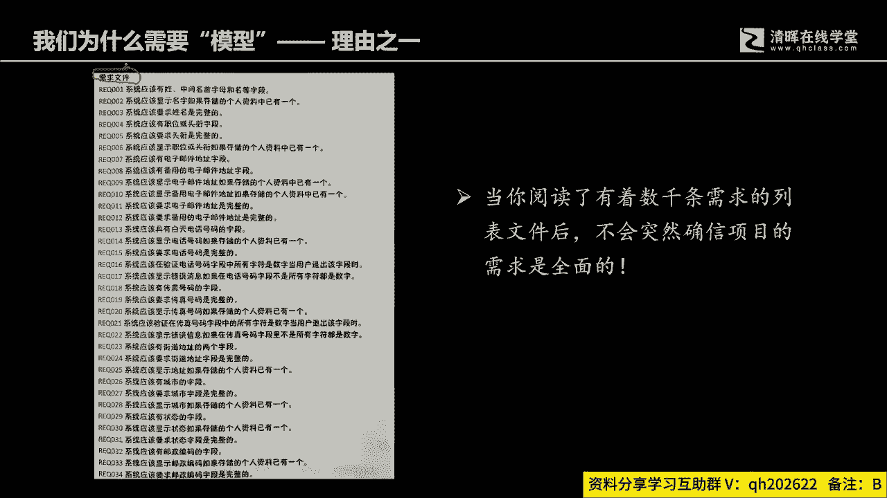

# 从项目管理到商业分析，从“单环学习” 到“双环学习“ - P4：4.商业分析模型分类 - 清晖Amy - BV13J4m1w7Wh

一些那另外商业分析师呢，他是一定离不开分析模型的，因为我们在从需要到需求的过程中，其实是一个沟通过程，这个沟通过程它面临了很多的障碍，其中最基最最直接的障碍就是，你会发现有很多这个客户用户消费群体。

他们其实是不善于表达，或者说不愿意表达自己真实需求的，那么如果不善于表达自己的需求，我们如何去构建一个真正满足客户需要的产品，或者交付的解决方案出来呢，如果一开始就没有做对的话，你后面是越做越错的。

所以PMI本身是有过分析的，他通过大量的统计发现，项目之所以失败，39%以上就是有非正，就是不正确的需求，有40%到50的项目之所以失败，是因为过程当中我们的管理方法是有缺陷的。

所以导致到项目是越跑越偏啊，初衷也许是好的，但是实际在整个过程当中是很有问题的，尤其是在一开始，根本就没有清晰地呈现客户真正的想法，他只是有个模糊的一个要求，而且同时你在跟客户沟通完了以后。

你如何去确定你收集的需求是完整的呢，就像我们项目管理范围管理里面，他特别要强调完整性，第二个你怎么去确定你交付的结果的正确性呢，你看PMP里面，它的管理过程，又又要强调一个交付质量管理里面。

他特别强调的是正确性，但他这一切的基础从哪里来，其实都是从商业分析师和商业分析师团队，告诉大家，那商业分析师，商业分析师团队他依靠的是什么，他依靠的就是大量的分析模型，去来逐步澄清客户的需要啊。

所以我们要学到很多的模型，但学到模型。

我们为什么要学模型，这里面有个很直接的原因啊，很直接的原因就是如果我们作为你，你看啊，假设啊假设你是某一位管理者或者某个客户，那么现在呢有人给你一份文件，这个文件呢他问你诶啊张老板李老板或者张总，李总。

王总好，我现在有一份这个需求文件，是我们刚刚收集整理的啊，呃您也参与其中，你是我们的关键干系人，请您尽快的告诉我，这一张表格当中哪些需求是你需要的，哪些需求是你不需要的，还有哪些你需要做补充的。

如果哪一天，你真的是有一张这样的一个表摆在你面前，让你马上做出一个决定，我相信所有人都会犯懵，何况这个表还是非常简单的，只有十几20条，但是真正的项目开发的过程中，像类似这样用列表的方式呈现的需求。

它可能不是几十条，他可能是几百条，上千条，那你的感受是什么呢，那你的感受是什么呢，你的感受是一脸犯懵吧，所以啊有研究表明啊，在大量的管理过程当中，很多的实际情境，管理者都是依靠临时性的信息汇总记忆。

做出快速的决策和判断，除非他自己认为有必要静下心来反复琢磨，那么所谓的大多数如果用帕利托的法则来讲，其实80%在管理场景中，很多的管理者在实际的管理场景，它都是依靠信息的临时性记忆来做选择和决策。

那么临时性记忆是人大脑中要有一个限制，你如果能够短期记住的信息是多少呢，有个神奇的数字叫米勒函数啊，叫米勒魔术啊，魔法的模数字的数啊，米勒魔术，米勒魔术这个神奇的数字就是七加正二，就是你未经训练。

而且通过一次性就是阅读一遍，然后做出决策和判断，你的短期记忆能够真正记下来，无非来说是七个项目或者七个不同的事项，注意比如说七个七组数字，七个地名，七个人名，七个物件的名称，超过这个以后。

你必须反复记忆，你才真正能够记得住，但是大量的管理场景，却又是要求管理者能够快速，根据临时的信息整合来做出判断，这个本身就会有一个非常大的悖论，如果我们仅仅只是用纯粹的文本方式。

要求我们的管理者做出这样的决策和判断，真的是强人所难，所以我们为什么在项目管理，你会看到项目管理特别要求，在工作绩效报告的时候要用图形化，要用可视化，而且在很多场景下面，他特别要求你一定要你。

你你你有必要去考虑可视化的模型去呈现信息，它原因就在这里，可视化的模型可以把数据信息进行有效的整合，然后通过一个模型化的方式，可视化的方式去展现出来，然后呢找到信息跟信息之间的关联关系。

能够一眼就去发现哪些是缺失的，哪些是多余的，哪些地方是需要做补充的，哪些位置需要去做澄清好，就像我们去做一个试验啊，现在会有这一组数字啊，一组字母啊，就会有这样的一组字母，这一组字母呢各位看一下。

这组字母里面缺少什么，这组字母里面缺少什么，如果我们不通过某种特定的方式去来做信息的，这个这个模型化呈现，你就会发现你的方法就会特别的原始，然后效率会特别的低，比如说你会用ABCD。

EFG这样的方式继续来找，但如果说我们换一个方式，我们把它模型化或者把它条理可视化整理清楚，你就会发，你就会很快的，你不需要在心里面去默念一遍，什么ABCDEFG对吧。

你就可能够很快的发现egg也就是ABCD，一是缺少的，HII是没有的，IR是没有的，OK这就是为什么我们需要模型。

另外还有你看，如果我们要面对复杂的结构来进行，文来进行描述的话，我们曾经在PMP里面去，就学到过最基本的方法，在PMP里面，其实告诉过我们很多的管理学道理，而不仅仅只是表面的那些工具使用的概念。

比如说WBS跟WBS词典，为什么特别强调可视化工具跟细节，描述性文件相整合，使用原因就是，你如果纯粹的只是用文字来进行描述，比如说你就用纯粹的文字去描述，这样一个机械构件之间的联动关系。

或者管理系统之间的相互关系，纯粹的用文字描述，你能写的出来吗，或者说你写出来的代价会是多大呢，如果你写出来阅读者的难度又有多大呢，所以为什么需要可视化的模型，这是第三个原因，它能够很清晰。

很直观的通过可视化的方式去呈现部件跟部件，组件跟组件单元跟单元之间的关系，然后再辅以文字性的细节描述，这样的话就可以非常明确的形成一致和共识，就像我们曾经学到的WBS跟WBS词典一样。

因为我们在一些很规模庞大，复杂度很高的项目，我们如果纯粹的只是用图形化呈现，它虽然可视化啊，虽然结构清楚，一目了然，但是缺少细节，但是如果我们仅仅只是用文字的方式进行表述，规划者跟执行者。

他就没有一个在宏观认识上的一个统一，所以我们为什么要用模型。

这是比这是有原因的，另外还有啊，我们讲说你那我们要学，刚才我们说了啊，我们有五大类模型，20多种模型，那会有哪些呢啊什么范围模型啊，过程模型，规则模型，数据模型，接口模型啊，模型中间的具体模型工具啊。

特别的多，什么生态系统图，我们曾经在pp里面学到过的几个啊，系统交互图是我们在5。3里面学过的啊，PMBOK5。3里面过程流模型那就不用说了，在8。2里面质量管理啊，规划质量管理管理，质量管理。

质量都会用过程流模型，用过程流模型去发现非增值性活动，各位还记得吧，我们知道日常的组织安排，会有这个组织结构图啊对吧，我们学过鱼骨图啊，会有分解模型，分解模型的一个特一个特别的例子。

在我们的PMBOOK里面是WBS对吧，那当然还有什么还有PBS啊，什么PBS我用鼠标在写字啊，有点难看，还有什么OBS对吧，就是组织分解结构啊，还有这个还有这个RRBS，也就是所谓的啊。

可能是风险分解结构，还要这个资源分解结构，对不对，好，我们还学过什么学过原型法啊对吧，还还学过什么决策树，还记得吗，各位我们在风险管理，量化风险里面11。4，PMBOK的11。4学过好。

我们学习学习这个敏捷的时候，哎我们会学过这个用户故事对吧，好你其实你看其实我们都学过一些这个模型，但是这些模型属于哪一些类别呢，怎么用呢，什么时候用呢，它的作用又是什么呢，这个在PMP里面是没有讲。

尤其在我们讲说是这个叫啊，这个需求管理的过程中，如何去澄清需求，它的价值和作用又会是什么，在PMP里面也没有过多的去描述它，更多的只是在描述工具概念啊，你知道的就是工具概念啊，还有一个叫数据流向图。

我不知道各位有没有留心过，因为每一个清灰的讲义啊，偏僻里面的讲义，每个知识领域结束以后，都会有一个该知识领域的数据流向图，范围有范围的进度，有进度成本，有成本的，每一个知识领域结束。

各位再重新把自己的这个讲义翻开，你就看到每个知识领域结束以后，都会有一个数据流向图，它是属于数据模型，这是我们曾经学到过的东西，只不过呢很浅显，或者说你只看到过，但具体是什么样的一个情况。

哎了解还不深对吧，所以但是呢我们在这个PBA里面，都会是一个一些重点的内容啊。

好那么为什么要去学模型，怎么去用模型，模型会有哪些对吧，刚才我们解释过，那我们怎么去用模型呢，模型使用的时候一定是组合化使用的，也许在座今天听我讲课的同学并不是，咱并不是我带的偏僻班。

如果我带的pp班里面，我每次讲课都会特别强调，工具一定不要单独使用，因为一个工具都有其主要特征，它的它的作用和功能，他不可能在所有的场景中都能够发挥它的作用，所以我们在分析一个系。

我们来做系统化分析的时候，分问题会有很多的方面，问题会有很多的分解组成部分，每个部分都有其对应的更好的更适用的工具，所以我们的一个工具，不可能在所有的方面都能够发生，都能够产生价值。

所以我们必然是要把很多的工具组合使用，所以我们在使用的时候，应该是将一系列的工具组合使用，才能够真正的系统化的分析，我们所需要分析的对象，无论是需求，无论是组织，无论是管理啊，无论是各个方面。

生活中的工作中的各个方面的，所以呢如果我们要真正的看清全局，不可以主观片面。

