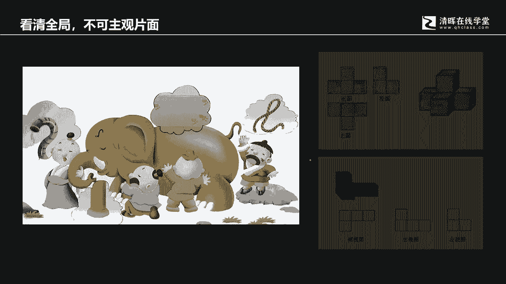
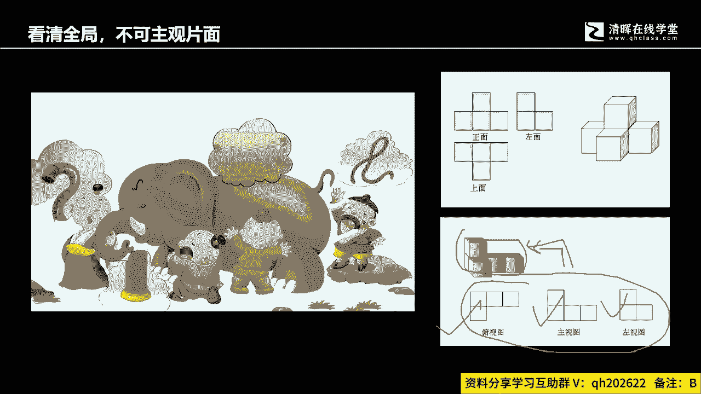
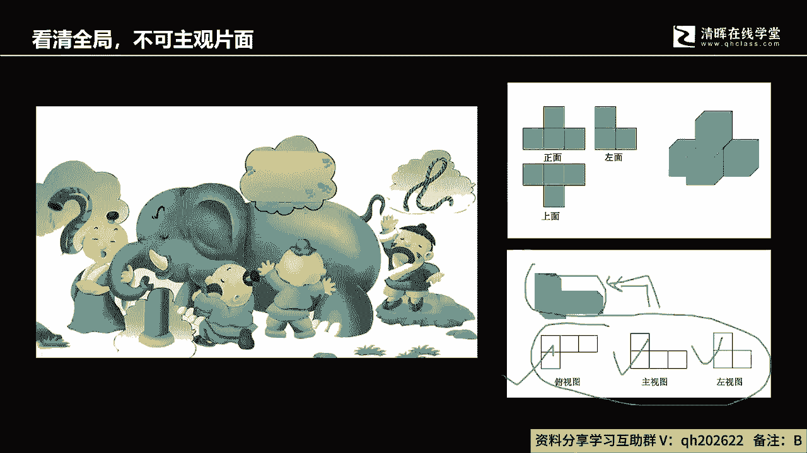
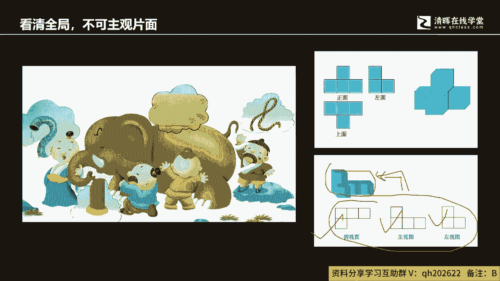
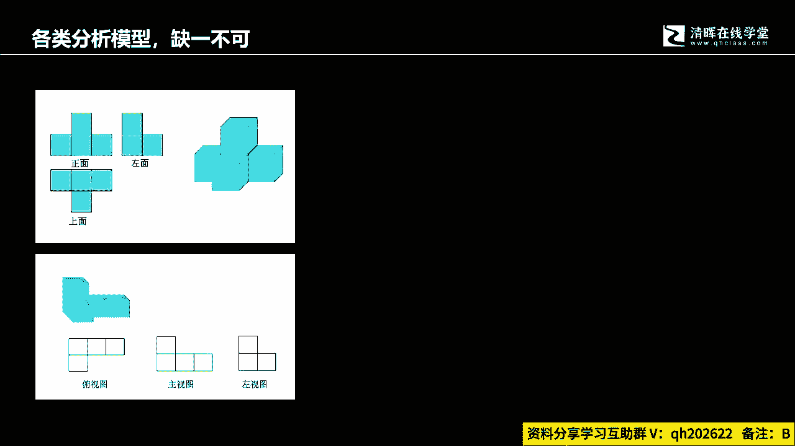
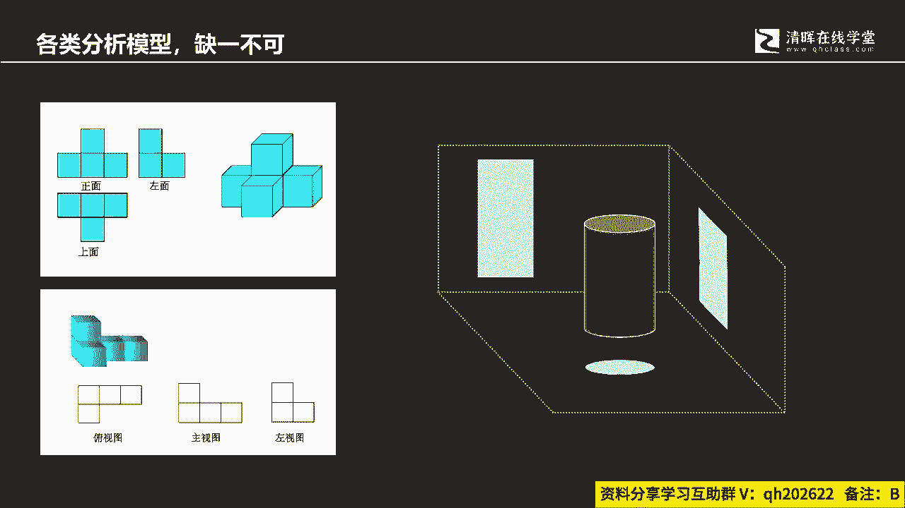
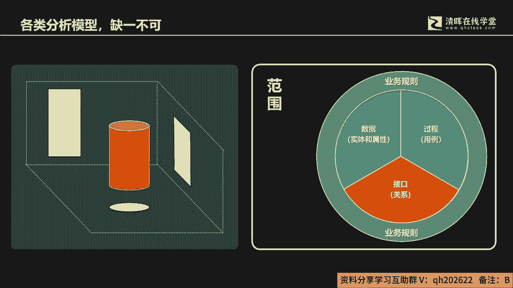
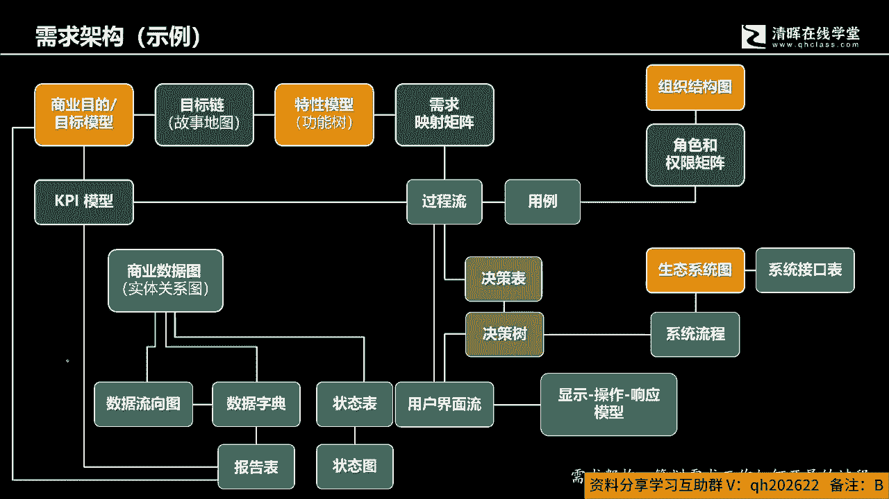
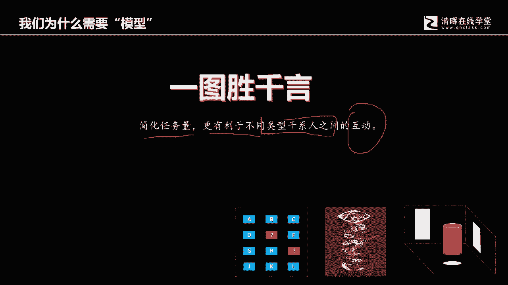

# 从项目管理到商业分析，从“单环学习” 到“双环学习“ - P5：5.需求架构(示例) - 清晖Amy - BV13J4m1w7Wh

就是要集合化地用各种工具组合使用，简单来讲就是刚才我们提到的这五类模型，什么范围，数据过程规则接口，我们在无论项目的规模和复杂程度的情况下，面，这五类模型的每一类都会选择特定的模型。

在你所需要实践的环境中去应用，它，就好像什么呢，就好像你要去描绘一个在实际，三维空间中的物体一样，如果学过这个工程制图的同学，可能会更容易理解，我们如果要去描绘一个在三维空间里面的物体。

我们在工程制图里面有一个叫三视图的工，这个这个技术它通过正式测试，复试这个俯视这三个方向啊，得到的这个这个这个图啊，得到的这个图，然后呢把它组合在一起就可以形成，或者说就可以得到。

我们在实际三维空间里面的实体图，那么每个这个方向，每个这个方向它都是什么，都有一组对应的模型，都有一组对应的模型，每个方向都代表着啊，都我我我我，我说的这个代表是这个理解含义的啊。

这个抽象对应含义呃，这个含义上的这个模型，那五组模型。

就好像我们在三视图中间的某个特定视角，它们它描绘着某个特定方向的情景，我们必须把它组合在一起，才能够真实的去反映外部的三维实体世界，但如果说你只是用其中的一个模型，或者说一类模型去来想去分析。

得到你看到的结果，实际上就好像是什么，好像盲人摸象，你只是片面的去了解了某个局部而已啊。

好那么如果延伸一下。

那就是你会看到各类模型它是缺一不可的。

而这各类模型都会是，通过我们刚才的五类模型的组合，再次强调，他不论是这个项目的规模程度如何，复杂程度如何，他都会啊，用得到都会用到这五类模型去来进行分析啊。

好那么这是一个示例啊，这是如果我们要来进行啊这个需求分析的时候，这是指这个示例只是代表其中一个例子啊，它不是代表一个啊标准化的，一个一个一个相互之间的关系，它只代表一个一类啊，一个特定项目中间需求分析。

它所用到的这个模型之间的关联性啊，模型之间的关联关系啊，所以从这个模型各位要理解的是什么，他要理解的是，我希望各位理解的是，你要分析一个现实的需求啊，一一类需求你用到的工具是非常多的，而工具呢它都有。

它是一定组合使用，他是来规划需求，工作开展啊，各个方面你都会要去采用到对应的，不同类别的模型好。

所以我们会有说哎这个一图胜千言啊，一图胜千言，那我们如果要简化工作量啊，然后呢便于更多的不同干型，该不同类型的干系人之间的互动和沟通，我们都会用到模型，因为作为商业分析师，你其实是一个桥梁。

你担任着谁的，你担任着我们的开发团队，和这个需求方团队之间的一个桥梁，就如果各位还记得，各位还记得吧，这个PO他有连接着两类不同的人群，一类呢是我们的客户啊，市场或者公司高层。

另外一类呢是我们的开发团队啊，开发团队开发团队是具有专业技术能力，他们也有自己特定的环境和语言，我们的客户呢他有他的使用环境，对自己的工作场景非常的了解，也明白自己啊。

或者说他能够理解自己需他的他的困境是什么，他需要解决的问题和自己所面临的情境，会是什么啊，这个词叫情境啊，然后呢以及自己的啊，这个问题或者期待又是什么，或者说叫期望啊又是什么。

然后呢中间有个纽带性的角色，这个纽带性的角色就是PO，他其实是在中间起着一个，我们简单理解第一个责，第一个责任是什么，做翻译，他要能够把客户的商业化语言，变成可开发的技术性语言，解释给开发团队去听。

开发团队呢会，这会由借由这些信息来对自己的开发工作，比如说这个冲刺待办事项列表进行优先级排序，来对开发的方法或使用到的开发工具，进行选择和决策，然后呢对于工作分配呢进行内部的自组织对吧。

这是我们曾经在敏捷管理里面学到的，同时呢，如果有阶段性的结果产生了，开发团队会来进行演示，但开发团队演示它中间必然是缺少不了，作为PO这样的一个角色存在的，PO就会把演示结构中间。

开发团队所描述的那些技术性语言，转化为客户能够理解的，尤其是客户想要解决的情境问题，期望的那些啊语言表达，让客户能够理解和认识，这样的话可以弥合两者之间的，因为这种语言表达上的矛盾和冲突。

进而推动双方能够有效合作，使得我们的产品最终的交付，不是仅仅满足验收规格标准，而是能够真正解决客户的问题，满足商业的需要啊，这是PO啊，所以你会看到PO，它是一定会用到大量的这种模型来进行，展示和呈现。

去发现需求的完整性的问题，正确性的问题，清晰程度的问题，所以呢模型一图胜千言，实际的目的就在这里啊，简化我们的工作量啊，不是纯粹利用文字进行描述利用啊，那更有利于不同类型的干系人之间的互动啊。

