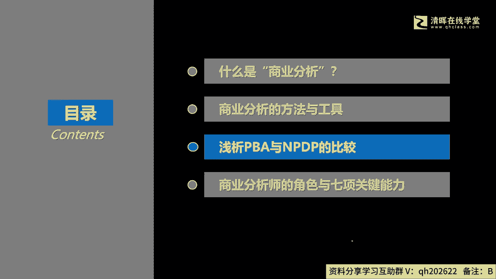
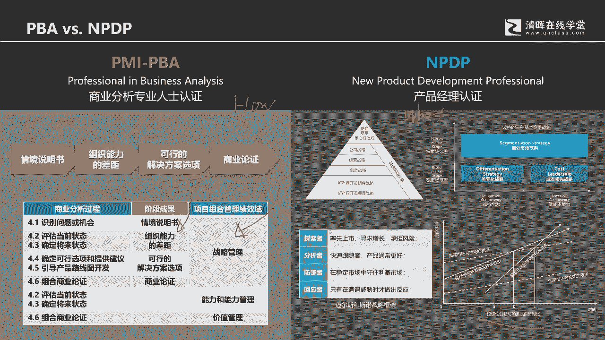
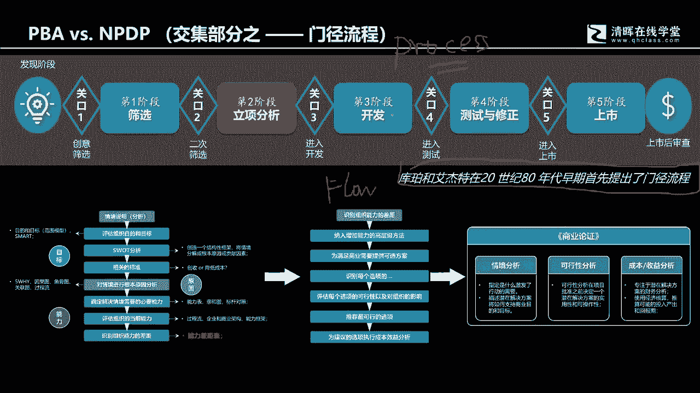
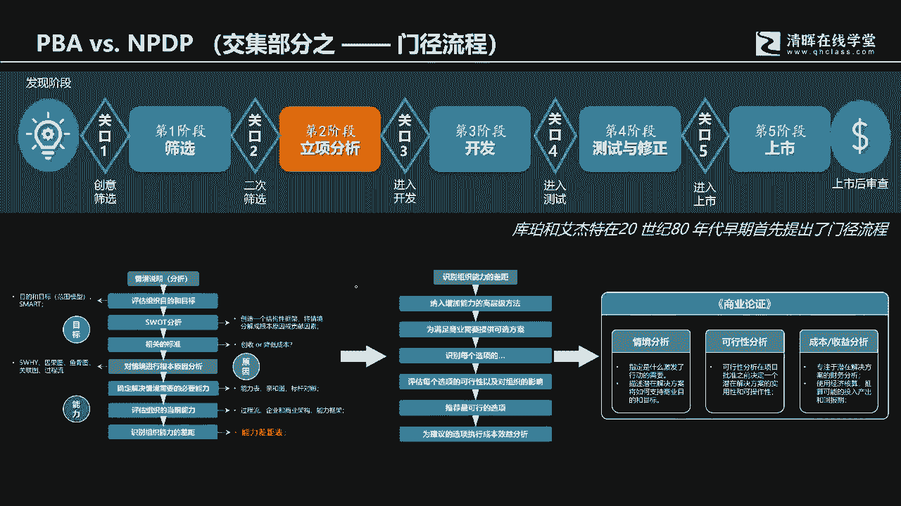
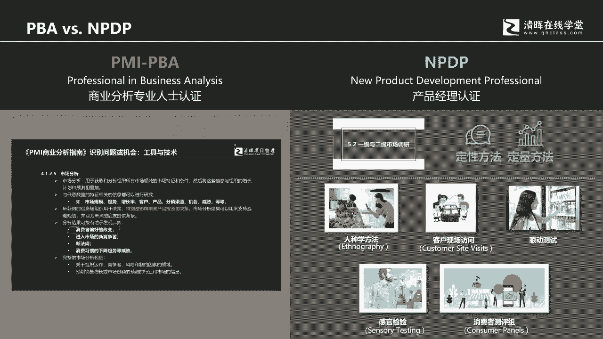
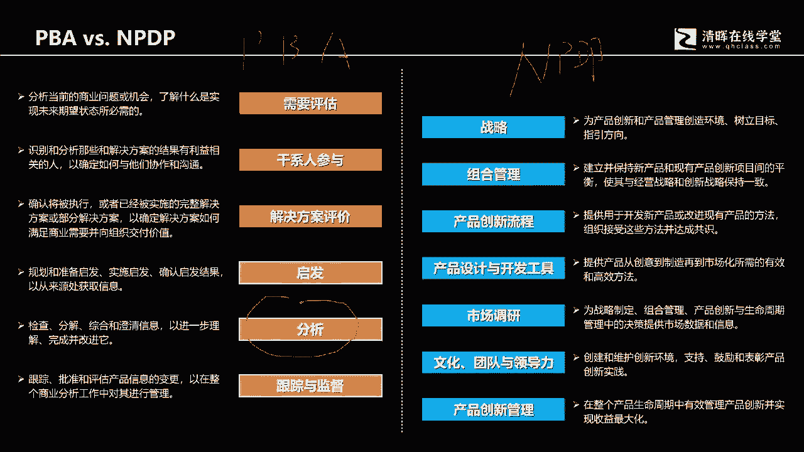
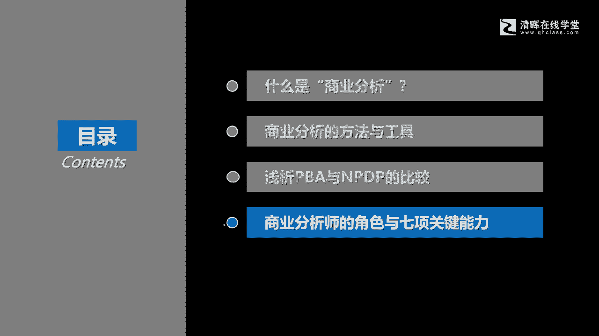
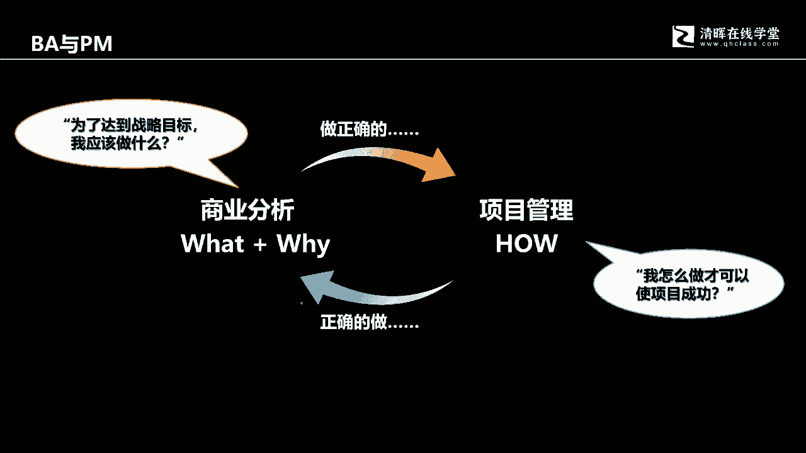
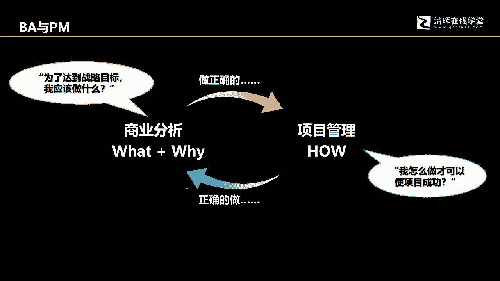
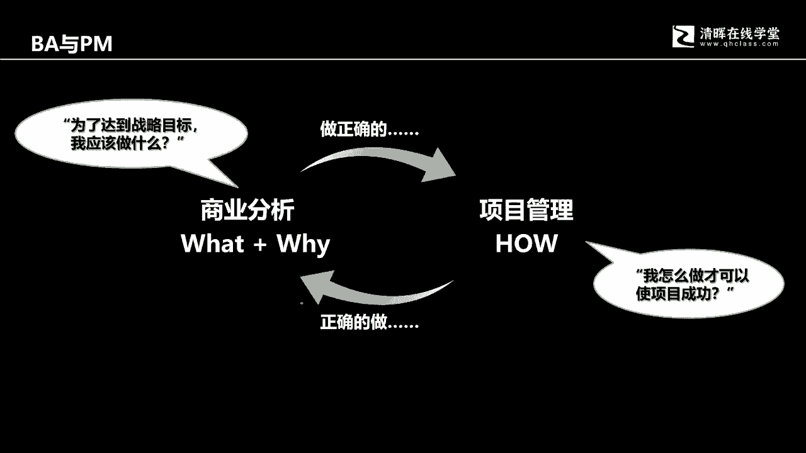

# 从项目管理到商业分析，从“单环学习” 到“双环学习“ - P6：6.浅折PBA与NPDP的比较 - 清晖Amy - BV13J4m1w7Wh

然后呢很多同学刚才我们说到了，我们仅仅我们不仅仅只是学了这个项目管理，学了这个PMP，学了ACP，还有一些学员呢，可能第一个情况是站在一个十字路口，我接下来到底是要学PDA呢，还是要学NPDP。

还有一些学员呢，还有一些学员呢是已经学完了，大量的项目管理的科目啊，SP也好，PNP也好，prince two也好，然后呢也学了NPDP，现在在犹豫说我到底要不要学去去学这个PBA。

实际上来讲也应该去学，只不过看你用哪种方式去啊检验自己啊，好那么这里呢我们简单的去描述一下啊，分析一下这个PBA跟NPDP之间的比较，包括它们之间的联系以及可能的这个差异啊。

可能的这个差异，这是PBA跟NPDP的这个知识体系结构，这样的一个这样的一个框架图，那学过NPDP的，或者没学过NTPTNPDP的同学呢，你可以看一下这个图啊，没学过PPA的，你也可以看一下这张图。

这张图呢下面还有两组定义，一个是对于商业分析的定义，另外一个是对于产品创新的定义，从某种程度来讲，NPDP更加强调的是产品的问题，也就是它更强调的是对外竞争，要促进企业的生存经营发展，提升竞争力。

扩大啊，扩大我们的经营规模等等等等各个方面，它有一个非常重要的手段，就是不断的有满足市场需要，又满足自己的经营目标和战略规划要求的，产品的出现，在商业分析里面，它是没有产品概念，它其实也会用产品这个词。

它跟但是它更多的是强调的是解决方案，他更多的强调是解决方案，在某种意义上，解决方案的这个这个这个所所概念，所包含的范围，它更高于那个产品好，但是呢这两者呢之间呢，它其实是高度融合的。

没有这个所谓的替代性，尤其是当我去学完这个PBA，也去学完这个NPDP以后，我充分的理解到这一点，就是这两者之间它不是一个对立关系，它属于一种统一关系，两者之间是相互互补的，即使是学了PPA的人。

你最后你需要说，让自己的这个商业分析的管理能力，能够得以提升，我倒是觉得NPDP里是应该学一下，那学完NPDP的人呢，当你要面对一个产品规划，如何让需求更加的清晰。

整个管理的过程非常的这个步骤非常的明确，有个结构化的管理，那你一定是要去了解PBA，所以这两者之间它不是一个对立关系，说或者说替代性关系，说学了PPA就可以放弃NPDP的学习。

学了NPDP就可以放弃PPA的学习，这两者之间恰恰是一个融合的关系，这个融合的关系简单，我们可以了解一下，PBA其实是实践方法，NPTP呢是知识体系，NTP叫产品经理认证知识体系。

PBA是所谓的叫商业分析专业人士认证，它更在我们的学习体系里面啊，在我们这个星辉的教学体系里面，PBA是更倾向于实践方法，尤其是解决方案设计过程的实践方法，它两者之间的差异就在于PPA。

它更强调的是我们通过一系列的过程，步骤细节去来从无到有，无论是解决方案还是产品，他其实都会经历两个阶段，一个是从0~1的过程，从0~1的过程，也就是从我们发现问题，发现机遇，发现机会开始。

其实NPDP也会有强调，你的产品设计也是从零开始的，这个零从哪里，就是从发现问题，发现机会，发现机遇开始，然后呢通过一系列的操作让这个原型产生好，那么另外一个阶段呢，就是当有原型产生，我就得把它商业化。

把它商业化以后就会投入到市场，投入到市场以后会进入引入成长，成熟衰退的阶段，PBA也强调这个，但是PBA呢更更需更需要强调的是，当解决方案投放市场以后，他的这个带来的新的缺陷，新的不满足。

我如何通过刚才我们讲的从需要评估啊，这个商业分析规划，解决方案评价，通过一系列的启发分析跟踪，然后呢发然后呢从发现机会开始，又得到了一个新的轮回好，但NPDP呢它就完整的去描述了一个产品，从无到有。

从有到市场中衰退，它更像面面对外的，所以PBA呢它的实践方法啊，他是他是我们之前讲的，他是他倾向于解决方案啊，解决方案是包含产品和内部的各种优化的，方，优化的这些解决方案的，那NPDP更倾向于产品啊。

尤其强调对外的好，然后呢也都第二个阶段呢，他是从用我的理解，它是从1~0啊，我们之前讲过是都是从问题机遇开始，然后呢有原型产生，然后呢让原型商业化，然后呢又投入到市场，投入市场呢经历了一个周期。

又回到了零，当然第二个零和第一个零含义不一样啊，第一个零呢他初始的这个这个问题，他的情境呢是当时的那个情境，但是随着一个是一个产品或者解决方案，的时间周期，它会产生新的问题，那这个零呢它会是新的机遇。

新的问题啊，所以第二个零跟第一个零，它的背后的这个差距或者差异它是不一样的，好，那么产品管理呢更紧更管理，他会把从1~0的所有的这种啊管理过程啊，会描述，比如说在引入阶段，我们的什么产品啊，渠道啊。

促销啊啊这个啊这个价格啊，各个方面它是如何去制定好，然后到了这个成长阶段，成熟阶段，衰退阶段关于CP的四批啊，这是我举举其中的一个例子啊，4P的这些变化啊，啊然后呢，但是商业分析呢。

它更强调的是最终的我们那个价值上面，是不是能够真正的获得我们所预期的价值，而它不强调在市场中间的那个啊，这些所谓的市场经营的这个部分好，这呃简单来理解呢，就是PBA呢它更像实践方法。

然后呢这个NPTP呢就像知识体系，举一个例子啊，举一个例子嗯，我们举一个生活上的例子吧，嗯举个生活上的例子，我们举一个炒菜的例子好不好，就是我们要做一个番茄炒鸡蛋，NPTP的不PBA呢，教教会我们干嘛。

你要去获得番茄炒鸡蛋，那么我们要先理解番茄从哪里来，鸡蛋从哪里来，然后呢会通过怎样的操作过程啊，要切番茄打鸡蛋啊，然后点火烧油，先炒什么再炒什么啊，什么时候放味，放盐，什么时候放其他调料，最后出锅。

他把整个的步骤过程给咱们描述得很清楚，那把这个步骤过程给描述得很清楚，而这个N而而这个NPDP呢，它不是这个他没有告诉我们如何操作的步骤，但他会告诉我们，如果要做番茄炒鸡蛋，那番茄啊。

我们可以用的番茄会有哪些啊，有有有哪些是国呃，哪些是本地的，哪些是外地的啊，鸡蛋呢有这个付息蛋，有这个普通蛋，有土鸡，有土鸡蛋，有走地鸡下的蛋啊，它类似它有各种各样的出处啊。

比如说我们就像有些管理工具一样啊，我们想说门禁管理啊，门禁管理也是个流程，后面我会讲到那它里面就会特别长的，都特别说明诶这个门禁流程是什么时候，然后由谁啊首创的，然后呢它的它是什么，它有哪些步骤。

它的作用价值在什么环境下去用啊，他会说这个，然后这个门禁流程在什么时候用呢，啊他前一个步骤，后一个步骤我们需要考虑什么呢，他提到但是不详细，而PBA呢他会提到非常详细，第一步做什么，第二步做什么。

第三步，第四步做什啊，然后呢那那还有我们讲说这个，比如说再举一个更更更更更有意思的例子，就是你番茄炒鸡蛋，你要放盐吗，对吧，呃，我们的PPS只是告诉你在第几步，你要去放盐好。

然后的话NPDP会告诉你什么盐啊，我们既然有这样的一个工作叫盐那个盐油，那有什么有有有有什么样的盐，有海盐啊，有有有有一些公有一些来料啊，他是他是他是这个他是那个啊矿盐等等等等，你要买你要用酱油。

那酱油会有这个啊会有这个海天酱油啊，会有这个啊，会有这个什么什么什么叫什么那个什么核啊啊，前段时间的那个啊这个啊也比较有名的啊，什么啊什么李锦记呀啊，你他会告诉你这样的一些出处啊，那你知道啊。

你的知识体系里面啊，每种工具都从哪里来的，什么时候来的，由谁开发的，它在我们这个过在这个里面它的作用又是什么，但是呢它不强调步骤关系，他不告不会告诉你说呃，我们要开发一个产品啊。

他只告诉你说我们要考虑的方方面面，所以你会看到他的这个知识体系，他要告他，他告诉你你要考虑的这些方方面面啊，都会是什么，而商业分析呢他会告诉你说你的第一步，第二步，第三步，第四步你要怎么去做啊。

他会标注的非常的详细啊，那如何去进一步理解呢，啊，你可以把它理解为，就是说PBA跟NPPP之间呢，它是一个高度融合的关系，它是个高度融合的关系啊，好那么我们举两个例子，各位可以理解下什么是这个啊。

实践方法，什么是知识体系啊，你比如说像PPA它就是实践方法的话，他就会比如说我们要做商业论证，那商业论证的第一步是干嘛，他要写一份情境说明书，那写一份情境说明书，他也会告诉你第一步做什么，第二步做什么。

第三步做什么好，第二步啊，第二个过程阶段，就是我们要评价组织的能力差距，去发现我们够不够条件，够不够能力去解决我们从情境啊，因为情境它是来对问题的结构化描述，那第二个大的步骤就是我们要强调说。

我们有没有能力去来解决这个问题，那么如何发现能力差距，我们第一步做什么，第二步做什么，第三步做什么好，然后第三个呢就是我们会看到哎，我们要进行可行性研究，因为解决同一个问题。

比如说我们发现说我们抓住机会，是因为人的人力资源数量不够，那人力资源数量不够，我怎么获得人力资源的书，有就这个有专业能力的，又是啊这个数量又满足要求的这些人力资源呢，那途径会有很多，比如说内部培养。

外部招聘，那这些策略在当前的环境条件下面，哪个策略是最优的，我们就会综合化考虑，那策略跟策略之间的比较，选择排序就会考虑一系列的指标，那这个就叫可行性研究，那然后呢再来做整合。

把前面的这三项做的研究加起来啊，就可以来进行一个，就会得到一个商业论证，而这个商业论证呢就会给到领导去做审批，它里面就会标注非常详细的一些过程步骤，但是呢它的缺陷在哪里呢，因为不要说每个科目。

它是它是它是它是都是完美的哈，不论是哪个科目，不论是PBA也好，NPNPTBA好，它都有其这个有缺陷的地方，那它的缺陷在哪里呢，比如说啊其实它里面也会谈到战略啊，你如果去看这个啊。

PBA的分析指南和实践指南，你就会发现诶它里面有描述，比如说我们看到的，比如说问题识别能力评估啊，可行性研究，商业论证，它属于战略管理，但是战略管理很多时候呢，他只是在战略管理。

这里面会描述一个什么是战略，然后战略的定义会是什么，仅此而已，但是在NPDB面，各位不要忘了NPDB刚才我们说的它是什么，它是知识体系，对不对，什么叫知识体系呢，它会把整个我们要看到的那个战略体系。

要包含的内容会描述的非常的清楚，比如说他会从愿景使命，核心价值观开始，然后呢会来跟我们去解释什么是公司战略，什么是经营战略，什么是创新战略，什么是产品组合开发战略啊，产品开新产品开发组合战略啊。

什么新产品开发项目战略，还有其他的什么能力战略啊，还有什么知识产权战略啊，平台战略呀等等等等等等，它会有一个结构，然后呢他会告诉我们诶，我们在罗在做这个战略管理的时候，会有这个竞争战略，那么竞争战略。

最典型的是迈克波特的基本竞争战略，而在我们的PPA里面，它是不介绍这些啊，这个战略模型他只告诉你诶，我们有我们在这里会做战略管理，它更强调的是具体方法，实践方法，它更强调的是具体方法。

而这个方法它会引用到怎样的一些模型，它没它只是点到为止，但他会详细描述过程步骤，而NDBTNPDP它在于一个开发过程中，它的详细程度，它只有在它只有概括过程，但是它没有细节过程，它最有价值的地方就在于。

NPDP里面的价值地方，他就会把这些战略的东西描述的非常的清楚，比如我们战略模型会用什么，比如说会有会有哪些，至于怎么用，他要你自己去琢磨，他告诉你我们在什么，它大致会在什么阶段啊。

做这个公司战略的时候，我们会有波特的啊，做产品战略的时候，我们会有这个迈尔斯和斯诺的战略框架，什么探索者，分析者，防御者，回应者，每个呃他们的行为啊，他们的这种战略的优优点，缺点等等等等。

还会考虑到这个克莱顿，克里斯坦森的，延续性创新和颠覆性创新的产品战略，好，他们这个战略啊，他会怎么，它是怎么样的一个逻辑，它是怎样的一个定义啊，然后呢会做相应的是什么的解释。

所以解释起来呢就是你会发现呃，PBA呢它更强更倾向于如何进行需求管理的号，而NPDP呢它会强调知识体系的what啊，知识体系的what啊，这是一个方面，所以所以我总结下来我的认知。

PBA就是他其实更倾向于是实践方法，NPDP呢是一套知识体系，既然是知识体系，它就会包含所有的这些啊，各种学者开发的工具，什么时候做的啊，他开发的历史，然后的话它的作用啊，它的价值，它的定义。

它的模型构成啊，它的模型使用啊，好然后呢比如说啊我们再来说一下的对比，因为你也可以看到在NPTP里面，它也会有一些有过程化的模型，为什么我要特别强调是过程化的模型呢，因为这里有两个单词。

各位是需要去理解的，一个叫process，另外一个叫flow，各位从这两个单词，你能不能理解这两个单词的含义，process啊，因为我用啊，我是用鼠标在写字，有点这个这个难看啊。

那process呢其实在翻译的时候，它会被翻译成过程或者流程，但更多的我们其实是认为是说princess，它其实是过程，floor是什么，floor其实就是流程，流程强调的是步骤。

Step by step，过程强调的是端到端的阶段，它可以从一个原点到另外一个结束点之间，描述的非常的啊这个概括性，然后呢，但是它完整性会很好，它缺乏细节性，它可以理解为是过程模型的第一层L1级。

但是这个里面啊，我们讲说NPDP里面会有一个叫，cooper和艾捷特，在20世纪80年代早期，首先提首先提出来的这个门禁流程，这个门禁流程它就是一个过程，它会从啊比第一步发现阶段。

就是我所说的发现问题和机会，然后经历第二第呃，然后经历这个12345个阶段，然后A上市，然后中间会有12345个，这个这个这个这个关口好，那么它的可以，你可以把它理解为是LL1级的过程，但它不是个流程。

为什么呢，因为它里面筛选怎么筛选立项，尤其像尤其讲的是，比如说这个我们讲说是商业呃，说叫商业论证，他怎么做，他只是告诉你这里要做逆向分析，但这个逆向分析的步骤怎么展开呢，它是没有的。

但是商业分析会把这个立项过程，讲的非常的细致，比如说他从坟他的他会从门进他，他这个他这个门禁流程的第二步啊，第二个阶段它叫逆向分析，那么NPTP它就只是描述了，有这样一个过程阶段。

但是PBA呢它会告诉你说，哎这里面要经历的步骤会有哪些，会用到怎样的工具啊，我们如何去啊它的上一步啊，诶它的上一步会是什么，我们会做情境分析，会做问题描述，然后呢我们会来评估组织目标。

会引用source模型去发现我们的优势和劣势啊，然后或者说发现我们的这个这个啊新的方向，然后呢结合相应的组织发展的这样的一个标准，然后去做对情境的上情境的这样的一个评估好。

然后呢结合一系列具体模型工具呢，去做这个必要能力的评估，组织当前能力的评估，以及啊这个能力差距，这个能力差距呢，接下来诶通过能力差距，我们还会来进行，接下来一步又一步的分析得出啊。

我们的这个啊在能力补充上面，我们来做啊解决方案的构建的时候，哪个解决方案是更是最佳选择，可以帮助我们去弥补能力上能力上的差距，继而解决问题好，然后呢再来形成哎我们的商业论证。

那商业论证呢就要汇报给公司的决策层，给到我们公司的负责人来，就来做最后的审批，他会把这个步骤解释的非常的清楚啊，你第一步，第二步，第三步做什么好，这是商业分析，它为什么是实践方法中间的一个特征。

所以它会有硫的概念，就刚才我们说的它是floor的概念，而我们的NPDP里面呢，它的模型它更强调知识体系，它会告诉你诶这个这个这个工具它的发展历史，它怎么来的，然后它是由哪些。

它是呈现在怎样的一个形态啊，经历哪些步骤，经历哪些关口，然后呢他是有这个我们称之为叫process的概念啊，process的概念它也有过程，它也有流程，只不过呢它很宽泛啊，很概括。

但是商业分析就很细致啊，这是NPDP跟PBA之间的一个比较啊，你就会发现PBA里面，它更倾向于对于需求的细致细致化管理，最后得到一个切实可行的解决方案，无论你是做的是新产品开发，还是做内部的优化改造。

流程改进等等等等等等，他都会用到这样一套方法好。

那么那NMDP的话，跟PBA里面比较的话，那PBA里面我刚才说过，任何一个科目都有它的优势的部分，它也有它的缺陷的部分，那PBA的缺陷它也有，我们要客观去认识，比如说我们要做组织的问题的识别。

组织问题识别我们就会用，我们会提议说诶，我们要去做市场分析，但市场分析它只是概括的去描述，市场分析是什么，然后呢我们做市场分析呢，会要了解怎样的一些信息，然后呢会有助会。

思想分析给我们带来的价值和作用又会是什么，但是呢会用到哪些模型呢，他却没有说，所以你要你要你要能够把它给补充源码，你必须要去了解n pp你现在要做市场分析，那会有哪些工具方法呢，去怎么做呢。

具体有哪些工具和方法呢，比如说我们会强调第一个概念，就是你要会你有可能会去做第一级市场，二级市场调研，你有定性的方法，你也有定量的方法好，然后具体模型里面呢就会强调诶，我们有人种学方法。

有客户现场访访问，有什么眼动追踪，有什么感官体验，有什么消费者测评组等等等等等等等等，这些都是可以帮我们来进行了解消费者，了解市场，了解了解消费者偏好的，你看但了解消费者偏好变化，对不对啊。

那么具体的工具是什么，所以呢你就会发现，其实科目它没有所谓的说说那么的圆满，那么的完美每个科目都有它的这个这个偏向性，所以这样的话我用这两用这两张图的例子啊。

用这是两个表的例子，其实是想告诉各位PBA的优势在哪里，NPDP的劣势在哪。

然后呢这个PBA的劣势在哪里，那NPDP的优势又在哪里，所以它们是相互融合的，是相互融合的，PBA你可以从pa身上学到实践方法的具体过程，然后呢你可以在NPD里面，NPDP里面学到很多的丰富的这些。

这些这些商业啊应该就是产品管理的模型工具，然后了解它的背景，了解它的归类啊，这个归属两者做充分的融合，就可以很好的应对商业管理，产品管理，企业经营啊，所以这个我是客观来说，各位可以自行做选择啊。

自由做选择好。

那么除此之外呢，你会看到你像比如说NPDP，我们的右边是NPDP啊，这是NPDP啊，然后我们的左边是PBA啊，左边是PBA好，那么简单来说的话，你把两把两个科目放在一起，这个不是个对比对应关。

这不是个映射关系啊，说需要评估对应着战略管理，不是不是啊，这里面只是说把两个科目做一个整体对比，你就会发现NPDP呢，它的长处就在于告诉我们，有很多很丰富的这些知识体系啊。

组合管理有怎样有一些组合工具组合方法，产品创新流程里面什么门禁流程啊，敏捷流程啊，精益流程啊啊，新产品开发的，还有包括什么cheesy啊这些这些体系啊，然后呢市场调研刚才我们说了，有这个什么一级市场。

二级市场产品设计为开发工具里面有什么啊，这个创意阶段呐，概念阶段呢初始设计原型啊，这个规格阶段呐啊等等等等，它会用到怎样的一些方法，而PBA里面呢，它会告诉我们我们如何从问题开始。

一直到啊通过这个问题识别啊，机会识别能力评估啊，然后再叫啊可行性研究啊，然后呢做商业分析计划啊，做解决方案的评价好，然后呢还会有这些启发分析，还有这个跟踪的方式，方法工具，他讲的非常的细致。

然后呢还有这个具体的流程啊，所以这是两者之间的对比，就像刚才我跟各位介绍这个分析知识领域，中间的那五大类模型，它就会很丰富，很具体啊，帮助我们去来做需求，从轻的工作，帮助我们去完善。

去帮助我们去真正的去管理需求的完整性，正确性和清晰程度啊，所以这是两者之间的差异，各位可以完全根据自己的需要，来做学习的决策啊，来做学习的决策好。

那么最后啊，最后我们花点时间跟各位去分享一下，如果你真的要作为一个商业分析师，你想成为一个商业分析师，那作为数字层面SR，作为商业分析师的七个关键的能力啊。

我们来做一个分享，首先呢我们得明白啊，商业分析师跟项目经理两者是是高度配合，是高度配合，他们的角色跟职责之间其实有一部分是交叠的，两者如果能够充分配合，其实是可以交付一个极具有商业价值的，交付成果出来。

它不仅仅这个交付成果能够满足验收标准，更有价值的是，最终那个交付成果能够带来商业收益啊，商业价值的收益好，那么既满足客户的解决问题，或者说这个满足自满足客户期望的，这样的一些需要。

同时也能够给企业带来有形的价值，和无形的价值，那商业分析到项目管理呢，其实商业分析更强调的是what跟why怎么解释呢，因为我们之前一开始就跟各位去介绍啊，双环学习项目管理更强调的是正确的做事。

但是正确的做事来源于我的目标的正确性，我的马很好。

但是跑错了方向，他跑的越快，我离我真实的目标就会越来越远。

那我需要的目标是什么呢，正确的事，正确的方向又在哪里呢，它是通过商业分析来确定的，所以我们要做怎样的方，怎样的项目，项目应该包含什么样的内容，以及为什么要投资当前的项目，它是通过商业分析得到的。

然后呢作为跟项目经理配合，项目经理就会来实现这个目标，通过一系列对于范围进度，成本质量的管理来实现这个目标。

