# 从项目管理到商业分析，从“单环学习” 到“双环学习“ - P7：7.商业分析师的角色及在各阶段的工作职责 - 清晖Amy - BV13J4m1w7Wh

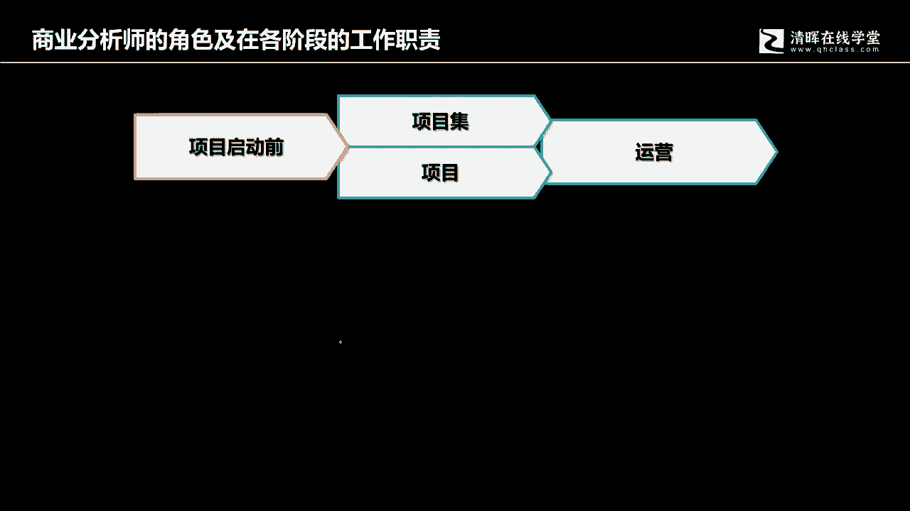

那作为商业分析师的角色，在各个阶段的工作职责啊。

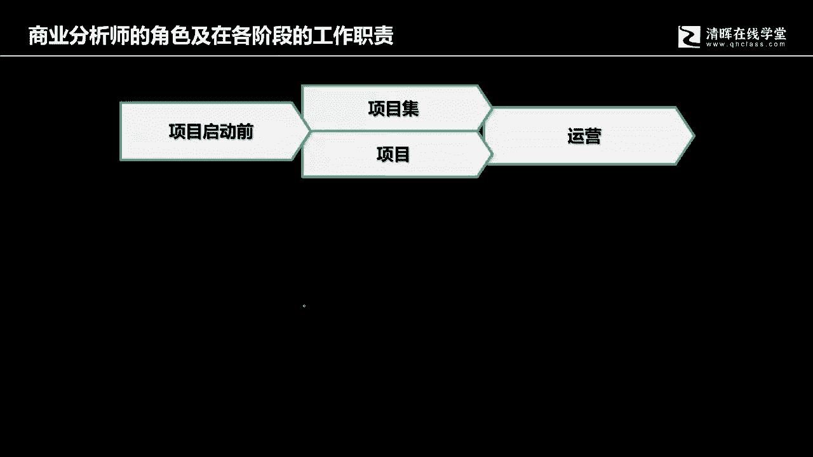

其实我们也可以分解一下，在项目的启动前啊，项目还没有立项，作为商业分析师，在他之前呢，他要通过一系列的论证去论证，我们要投资的项目，它它具备的价值和可能给我们带来的收益，然后呢。

向所有的干系人去来明确启动一个项目的理由。

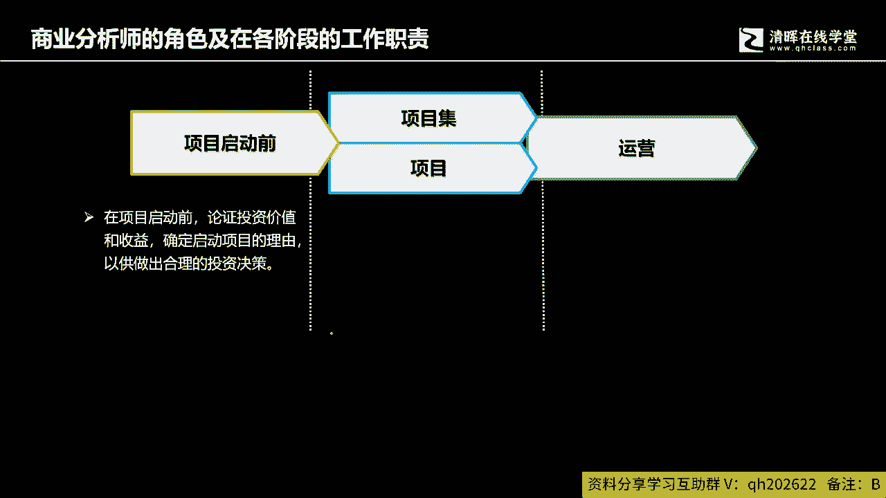

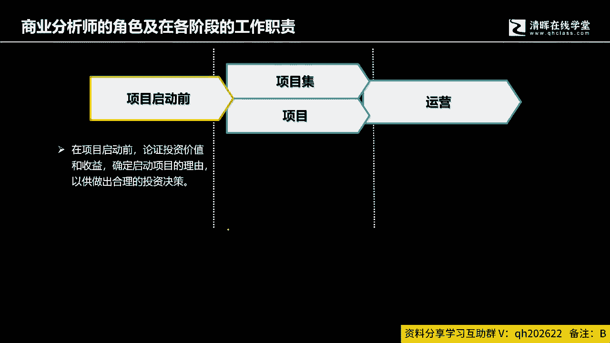

因为做任何事情都是要有理由的啊，无论是经济层面的，还是还是还是还是其他方面的啊，然后呢以供做出合理的投资决策，像商业分析师，他不是做最终决策的人，他更多的像一个军师啊，更多的像一个军师啊。

出处或者叫参谋啊，我们现在的选择会有哪些好，然后呢在整个项目或者项目及实施的过程当中，它会针对需求的变更进行持续的跟踪，监督和管理，因为整个项目的变更，包括像进度，工作范围。

成本质量那些都是啊包括什么项目的风险管理，项目的这个啊这个啊沟通啊。

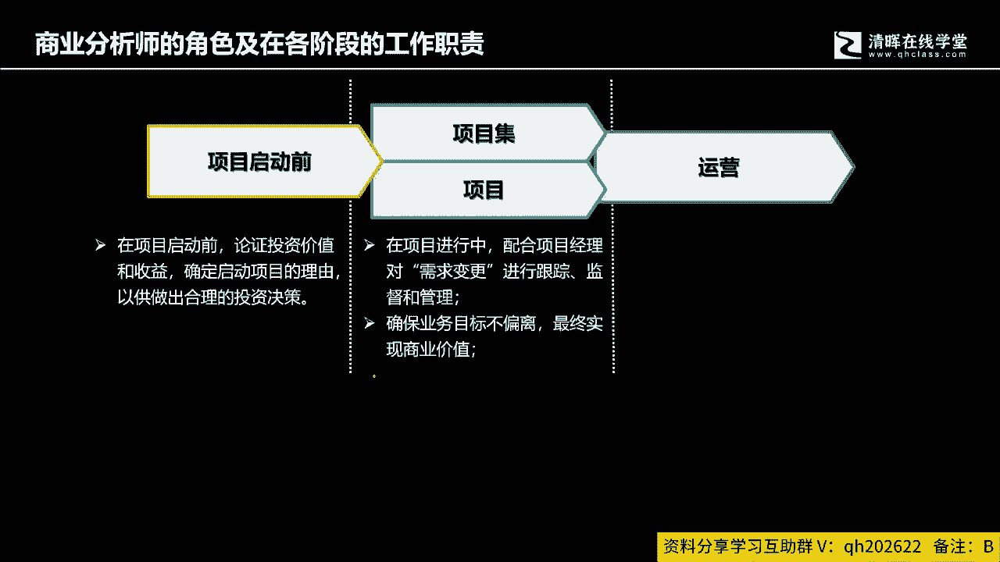

干系人管理那都是项目经理的事，但是根本化的变更其实是需求的变更。

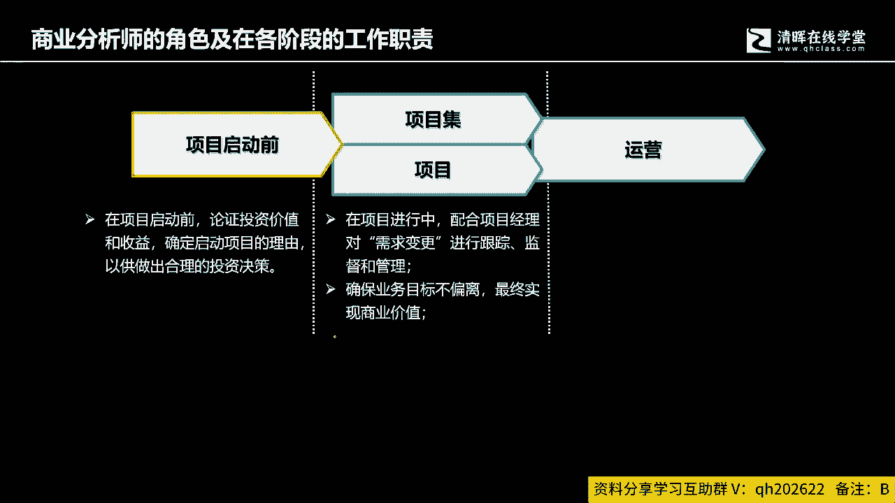

需求的变更是牵一发动全身的需求的变更，是触动基准，设计基准，那在这个过程当中，他要确保这个业务和目标的不偏离，最终实现这个商业价值，然后呢运营呢，运营呢他是他是他是这个在项目完成之后。

对解决方案这个价值进行持续的这个评价，发现新的新的问题和商业机会的好，我们如果来用形象化的方式去来描述，一个商业分析师的角色的话，我想有四个方面哈，第一个作为商业分析师，他是应该是一个敏锐的观察者。

因为一切的起源都是从问题和机会开始啊，如果我们不啊不不明确问题和机会，你后面的所有的这些所谓的可行性研究也好，所谓的跟踪也好，所谓的这个使用分析模型去澄清需求也好，根本就没有这个无从谈起。

一切的缘起都是从发现问题和机遇开始，所以商业分析实施是一个敏锐的这个观察者，然后呢当我们论证完了以后，我们要知道在现实的情况，如果你作为一个非常丰富的一线的管理者，项目的管理者也好，商业分析师也好。

其实有大量的工作，其实在现实中我们是有其重复的，我们其也就也就代表说，其实我们是有历史经验的，我们很容易会产生一种直觉，尤其是在你在某一个特定的领域里面，这个这个经营了很多年，然后有丰富的经验的时候。

当前的机会你发现以后，你很容易去找到对应的解决方案，但是呢有两点，其中有一点非常重要，这一点强调的是什么，就是你说服的不是你自己，也许你的直觉，你很容你很快地去发现这个目标啊。

发现这个解决问题的措施或者手段，但是你不能凭直觉去来说服其他人，这个时候怎么办，你就得有一系列有结构化的，有条理的去阐述投资一个项目的理由，那做决策的人不是咱们不是商业分析师，而是你公司的高层。

所以你的角色当中其实是一个参谋，而且是一个高明的参谋，是能够说服很多关键干系人支持你啊，好那么，BA跟产品经理的角色其实可以由一个人担当啊。

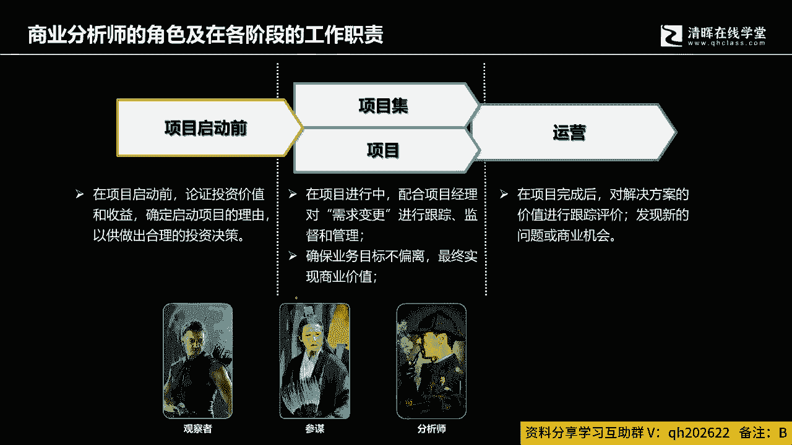

刚才跟各位说过啊，就是NPTP也好。

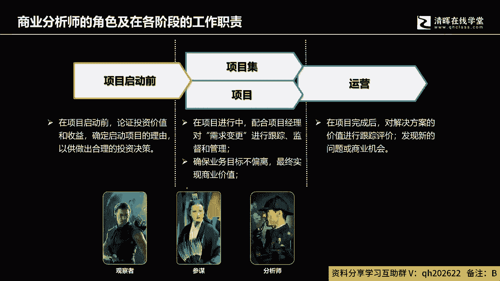

pp也好，其实你是可以同时选，然后呢相互做补充，你可以同时一个人担任，好然后再就是你是一个分析师嘛，啊作为分析师的话，你分析所有的可能性和这个，这和这个不可选择的理由，然后的话当这个过程它又不是静态。

尤其在我们项目执行的过程中，它不是一个静态环境，它的环境背景不断地发生变化，会有新的需求，会有新的技术，会有新的条件，原有的成熟的现在可能不具备原有的不成熟的，现在变得更啊更容易获得。

所以你在这个过程中，你会持续的分析这些错综复杂的关系，通过我们的一系列的工具和方法啊，得以实现啊，然后呢再就是你是一个教练的角色，因为你要创造一个更好的沟通环境，更好的沟通环境，要是大家具备相同的认知。

具有相同的近似的知识体系结构和这个经验，工作技能水平，为了能够更好地促进大家的这个，在商业分析过程中的一些交流，所以商业分析师是有责任去成为一个教练，教会大家什么是商业分析，为什么要做商业分析。

商业分析如何展开，应该用怎样的工具和方法等等，当你能够创造有这样的一个环境，大家都具备相相同或相似的，这样的一个认知和技能水平，那商业分析工作本身就很很好地开展啊。

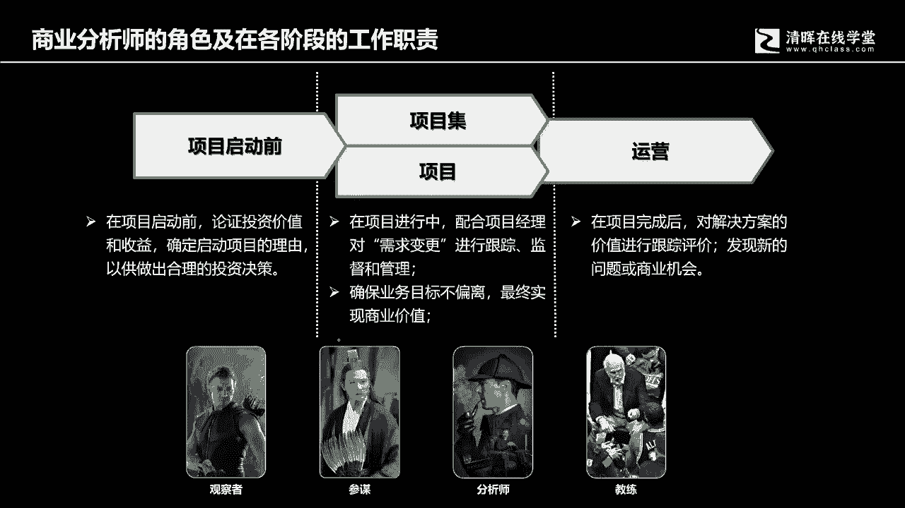

好然后呢我想七个方面，第一个方面呢就是我们要有一个敏锐的眼睛，能够发现问题，尤其是我们要知道发现问题啊，这个问题思维就是我们有时候是被动接受问题，在很多场景下面，我们是很容易被淘汰掉的。

所以我们要学会去主动发现问题，才是获得竞争优势的关键，那么什么是问题呢。

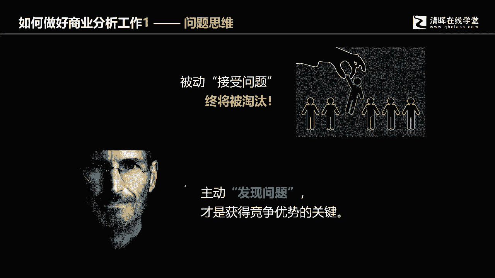

它是一个抽象的哲学性的回答，那所谓的问题是指期待的状态和现状，之间的落差，每个人都有其期待的状态，在我们的生活中，你可能会对于自己的人，对自己的个人收入，自己的学历啊，自己的生活水平，自己的生活环境。

工作中对于工作的场景职位啊，对于自己的子女，对于自己的朋友，对自己的家人，对自己的同事等等等等等等啊，具体的有很多的事，婚丧嫁娶，红白喜事对吧，你都有自己的这种期待，那你的期待状态。

和你真正面对的现实状态之间的差距，我们称之为叫落差，而这个落差其实就是问题，其实就是问题，如果落差越大，问题就越严重，填补落差的手段也就越杂，而这个填补落差的手段，就是我们启动的一个又一个项目。

举例来说，你认为自己的学历不够，你希望能够有一个研究生水平啊，恰好诶清辉有这个联考，对吧好，那么你可以通过一个周期的学习，努力获得这个啊这个学历证书的认可，然后呢获得这个职场中的提升。

那这个过程呢就取决于你的当前状态，比如有些人他是个中专毕，有些人是大专毕业，想获得联考获得这个，比如说你要想读MBA，那可能中间你要弥补的那个知识啊，这个差距会很大，你在有限的时间内去完成。

工作的难度也就会变得更大，你要付出的精力和投入也就更多，当然当然如果说你啊，现在就啊本身就是一个很优秀的，然后呢本科毕业，然后呢呃日常也在不断的去积累和学习，从没有放松过对自己的追求过。

那学习都一直没有落下，那这个时候呢你可能面对的这个难，面对这个问题就不会很大，所以每个人的状况会不一样，但是问题是什么，问题的本质其实就是落差，就是你所期望的状态和现状之间的落差。

所以我们曾经有一句话哈，就是在通用汽车公司有一个管理者，他说当我们发现问题并能够把问题澄清，其实问题本身就已经解决一半了，这充分说明发现问题和描述，问题本身是一个很重要的事情，诶而且是一个很重要的开头。

这个人叫什么叫吉德林，所以有个叫吉德林法则，那个吉德林法则就是面向问题啊，面向问题的发现，面向问题的这个描述的呃，所以作为商业分析师，为什么第一开始要去发现问题，为了工作的缘起。

本身都是从问题和机会开始好。

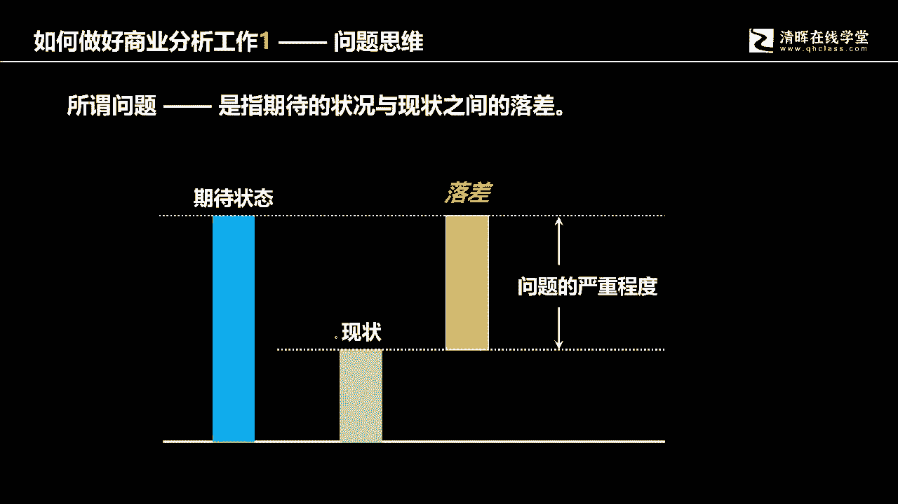

当我们发现问题之后啊，我们要把问题进行分解，为什么要分解呢，其实有一个人是各位一定要去了解的，一定要知道这个人，这个人就是笛卡尔第二个方法论里面，他特别提到解决一个难题的方法，用到的就是分解。

用到的分解，因为我们人类要解决问题，我们无法一次性去解决那些宏大的难题，所以要必须对那些难题进行拆分，拆分完了以后拆分成一个又一个的组成部分，这个组成部分呢，我们对于每个组成部分。

都能够对它进行合理的控制和管理，那么我们解决其中，我们先从这个简单的入手，逐步逐步在解决难的组成部分，继而解决那个宏大的难题，所以没有人能够一次性解决那些宏大的难题，要解决都是从分解开始。

这就是为什么在项目管理的知识体系里面，它会有特别强调，在范围管理里面它会有分解，进度管理里面其实也有分解，资源管理里面也有分解，成本管理里面也有分解，他特别强调就是分解，分解再分解。

然后呢去让我们了解说我们如何管理和控制，什么叫如何管理和控制呢，你对他所要对要解决一个问题，所投入的时间，资源成本风险，各个方面能够得到估算，而且相对准相对准确，我们没有必要做到精确。

但是要相对准确的一个估算，对于后期的变化，我们可以就可以对它进行合理的控制，这个叫能够有效的管理和控制，但它的前提都是从拆分来，那就像这个啊，这个这个这个大家知道现在是世界首富吧对吧，马斯克。

其实马斯克经常说啊，他解决问题是从所谓的第一线原理，或者第一线原理来啊来描述的啊，来进行分析的，来进行这个思考的，其实所谓的第一性原理讲的是什么啊，其实说白了就是他也没有离开笛卡尔的这个，拆分逻辑。

因为一次性是一次性解决任何问题是不可能的，所以我们必须回到矛盾本质，这个原点来进行拆分，所以他想哎我要星际移民这个难，这个问题太宏大了，首先我要实现这个我得有，我得有资源基础，我得有钱。

所以呢你看啊他最早他创建了一个paper，后来又把它卖了啊，赚了十几亿，然后呢后来又投资，你看他投资的东西其实啊包括解决通讯的问题，解决人工智能的节省人的这个体力，脑力的问题啊。

解决这个这个啊这个交通的问题啊，所以说那个管道啊，这个叫高速啊，什么高速城市管道列车对吧，可以做到每小时1000英里啊，其实这些都是啊，包括现在脑机互联，人工智能等等等等等等啊。

他其实特殊是一个又一个大问题，逐步逐步拆解啊，一直往下拆解，拆解到可管理，可控制的这些细节，解决小解决小的才有机会解决大的，其实所谓的第一性原理，本质就是它所用到的工具方法，其实就是分解。

简单来说就是当我们发现问题之后，很难一次性把问题解决，所以我们自然在商业分析的过程中，你会看到它，包括在项目管理中，你看到他第二步永远都是做分解好，分解完了以后呢。

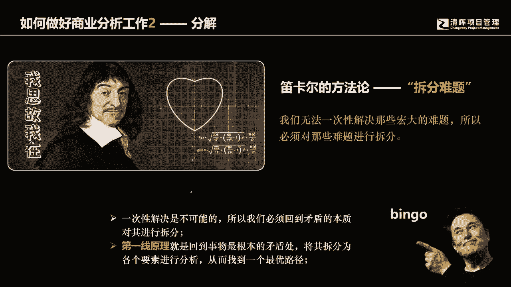

我们再要进行进一步的思考，就是说我们要把它归类处理，我们要把它结构化，我们要把它做做处理，做分析，那做处理做分析的，那你要做分析的的时候，你要把它进行这个，相应的信息跟信息的一个处理，信息跟信息的处理。

其实是一个结构化的树状整理结构，你要对数据本身，零散的数据本身进行归纳，进行这个梳理，进行这个归类，进行这个关系之间的这个这个梳理，那么这个你看到的啊，你会看到我们所运用的思考方式。

你会看到所有的研究对象之间，它一定是一个树状逻辑关系，自上而下呢我们称之为叫分解，分解完了以后你可以发现啊，这个分解中间的一些细节啊，找到这个相互排斥是完全穷尽，我们曾经讲过的M1C1原则啊。

能够把这个子层次百分之百等于母层次对吧，然后呢向上呢就是子层次啊，百分之百等于母层次，母层次向上向下的下一层之间啊，我们假设这个下一层之间呢，他是这个他这个M1C1原则对吧，向上呢其实是一个整合。

向下呢其实是一个分解，从上至下呢是从抽象到具体的过程，从下自下而上呢是从详细到抽象的过程啊，他会强调匹配好，所以管理问题，管理各种拆分以后啊，刚才我们说了，你发现问题要拆分问题，拆分问题以后。

你要对问题，要对拆解后的各种各种组成部分对象，来进行这个这个整理，整理中间的一个方法或者一个逻一个一个逻辑，它是什么，它就是层级化好，形成一个树状图结构层级化，所以你如果要学商业分析。

你就会发现有很多层级化结构梳理的工具，包括什么功能模型啊，包括这个需求跟踪矩阵本身也是啊，你看啊我们讲说这个这个需求跟踪矩阵。

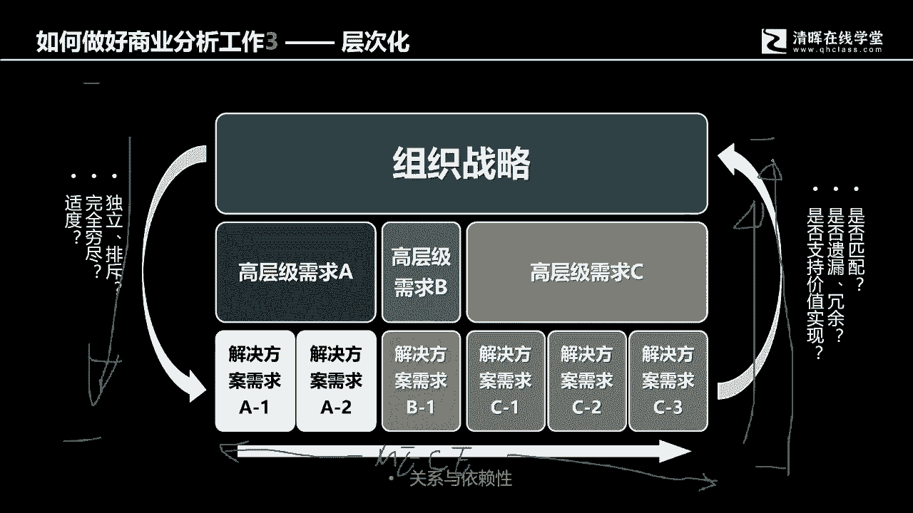

你看需求跟踪矩阵，我们在讲需求跟踪的时候呢，会用什么，会会强调说需求之间的派生关系，在PMP里面其实只是在讲需求跟踪矩阵，它是个怎样的概念，他没有说过，这个需求跟踪矩阵到底该做什么方面的，需求跟踪。

他其中有一个跟踪，其实跟踪的是所谓的派生关系，我们在PMBOK里面，其实是有描述过什么业务需求啊，干系人需求啊，解决方案需求啊，然后再就是项目需求啊这些概念的，但是没有说明这些概念之间。

其实是一个派生关系，这个派生关系我们举一个例子说啊。

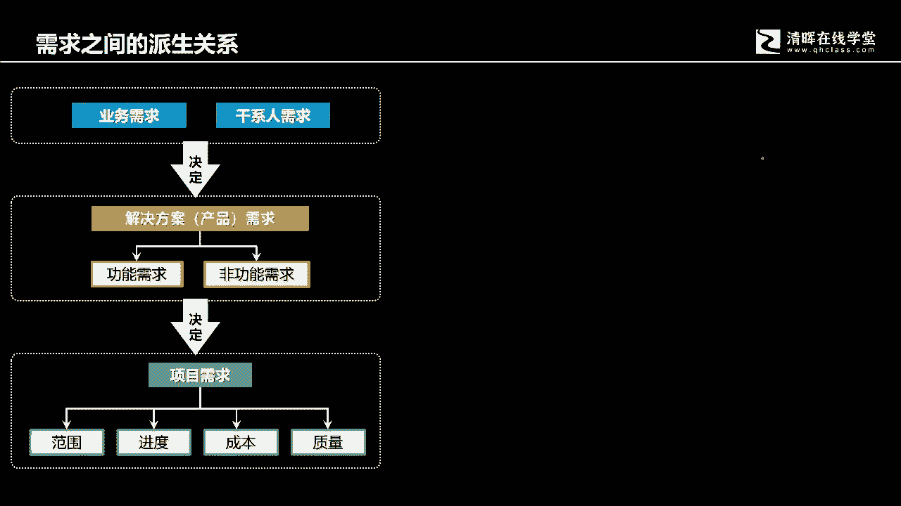

我们举一个例子说，比如说有一家公司，他是做汽车的，他现在发现了他经营上的问题，也就是他的商业问题是什么呢，就是他的车型很过时，然后呢，与其他车企之间的竞争和市场需求是脱离的，竞争力不够。

导致到他的营业额大幅下降，收入在降低，所以管理层就得要解决这个问题，那解决个解决这个问题，很显而易见，他要开发新的车型，那开发新的车型，这个就是他的商业目标和商业需求，那开发新的车型，必然开发新的车型。

我要卖给谁，这就是我们的客户，我们要有定位，我们到底是卖给年纪大的，成为这个白发经济中间的一个组成部分，还是说我要卖给年轻人，形成新兴市场中的新力军的这个供应商好，那么这个是要有思考的。

可能要根据我们对于市场的调研，未来的发展趋势，企业所具有的能力，各个方面来做研究，假设说我们要把我们的新的所谓的要挽回，这个企业的营业收入，下降的这样的一个所谓的叫商业问题得以解决。

我们的产品定位给年轻人，那我们就得了解年轻人这个群体的干系人需求，也许会有一个说法叫做什么呢，这个年轻人想要一个一款新型的汽车，来体现时尚，但是问题来了，这个时尚这个词是很抽象的，概些人需求。

也许说我要一个年轻人，说我要一个时尚的汽车，但这个时尚的汽车干系人，自己有可能都无法准确地精细地表述清楚，那作为啊这个商业分析师，你得把它往下进一步拆解，进一步推演啊，我们就通过解决方案本身。

解决方案本身来进行这个拆解，那什么叫体现时尚，从车型颜色啊，这个这个内饰所用到的科技能源，各个方面来体现时尚，又恰恰在上周我看了一个叫问界吧，新的一个车我记得应该叫问界吧，啊是叫问界吧，我没记错。

我对新能源车我了解不多啊，我看了他的一个广告，这个广告我觉得体现那个车的这个这个现代感，时尚科技啊，体现的非常棒，它体现了一个就是车灯，就是车的那个大灯，它解决几个问题啊，比如说啊我们讲说你要从一。

因为我们看开车会在路上会有几个不同的，这个车道，假设你要切换车道，你打了那个转向灯以后，我们老式的汽车那个车灯啊，它是永远只是向前的，对不对，所以它只是一条直线，但是那个问界那个车的大灯啊。

你打了转向灯，你要切从从内道往外道去切，或者从最中间车道往快，往快速这个超车道上去切，他那个车灯一下子就变成了一个S型，既照着你当前的那个行车路那个车道，同时呢，它的另外还有一个还有一个方向。

是照着你要即将切换的目标车道，那这就保证了安全性对吧，你可以看得到你正在行驶的那个车道，和你要切换的那个车道，你都能够看得很清楚，他用这个高科技方式体现了这个开车的便利性，以及它的时尚。

跟以前的那个车灯的那个不一样啊，这个车灯它我们以前的我们现在开的车，这个车灯它只能向前，对不对，它只能向前啊，好还有呢再就是啊他这个拐弯的时候，他那个车灯它变成一个弧形好，然后呢再就是当你去靠近一辆车。

你为了去避免这照射到前面的那个车的，这个后视镜啊，造成这个不必要的这个这个远光灯的一些影响，他会永远盯着那个路径，然后呢当你靠近前面的车的时候，那个那个车灯的那个照射距离，会自动的向下调啊。

如果说他停在那个人人行横道上面，它就会以大致人的膝盖的那个高度，去照着那个人行横道去照亮这个人，人行横道既方便你看到人行横道上面的人，也可以方便在人行横道上面走路的人，能够起到照明啊。

就说这一人它本身也就体现了时尚，不管他什么时候有的，但是我想说的是，这里面核心点是跟踪这个工具，这个需求我们是层级化的，我们从商业需求派生到干系人需求，再来派生到解决方案需求，我们谈的是工具本身。

我只是举一个例子，就来描述这个工具本身的价值，嗯所以呢我们需要去看了解真正的啊，这个这个核心到底是什么，所以我们现在只是在讲工具啊，不是在讲产品具体的技术性开发啊，好那么这种层级化思维呢。

其实就是在商业分析中间是特别需要的啊。

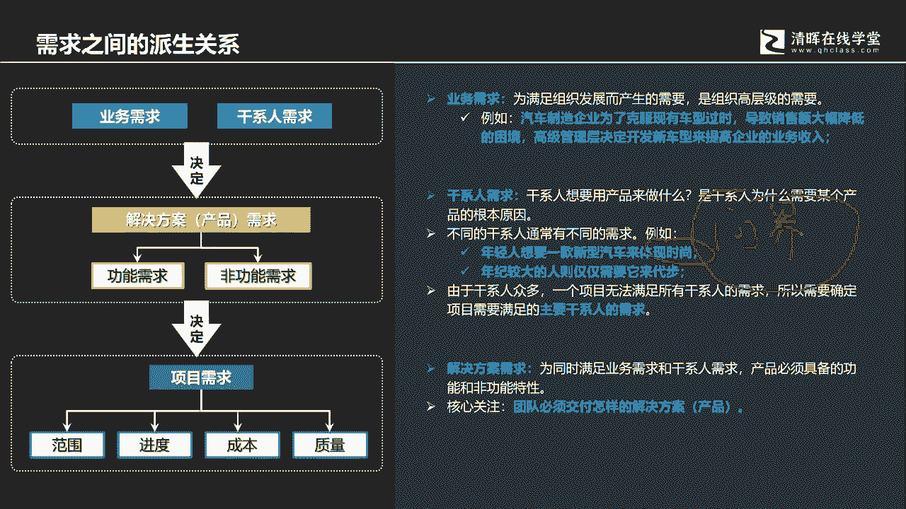

这个层级化思维，如果如果用一个更形象的表述的话，就是啊我们可以我们可以通过分解，在整理各种信息和对象的时候，信息对象本身就是一个父子集或父子级关系，他会有自上而下的层级梳理。

他的层级化跟踪可以起到很多做一点。

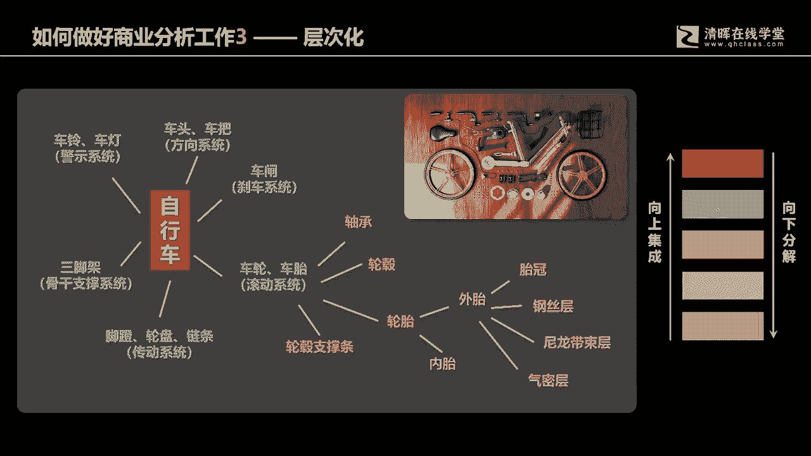

第一个呢它可以帮助我们发现缺失的工作，比如说我们有一个大方向，我们要做，我们要做的这个，比如说这个汽车的转向系统，照明系统或者汽车的内饰，但是如果说我们在具体工作的过程当中，没有具体的范围安排。

没有具体的部件规格来支撑着，最最终性能的体现或者特性的体现，就说明我们的工作没有进一步分解，这个工作本身是有缺失的啊，缺少细节来支持这个大的啊，大的这个组成部分好，那同时呢我们还可以防止蔓延。

那因为有了这种自上而下的从商业需求干性能，需求解决方案，需求解决方案，需求当然也包含这个功能需求和非功能需求，对不对啊，自上而下的这个跟踪，那么这种派生性的跟踪，可以帮助我们发现我们提出的各种变更。

他是不是被统一管理了，会不会有蔓延的情况，当有小的要求被提出，那么我们这个小的要求是不是被有效的，通过我们的管理控制流程，来进行统一化的管理控制，去发现这些啊蔓延的情况好，所以这就是我们在管理的时候。

会通过一系列工具和方法，但是我们的核心需要建立一个所谓的。

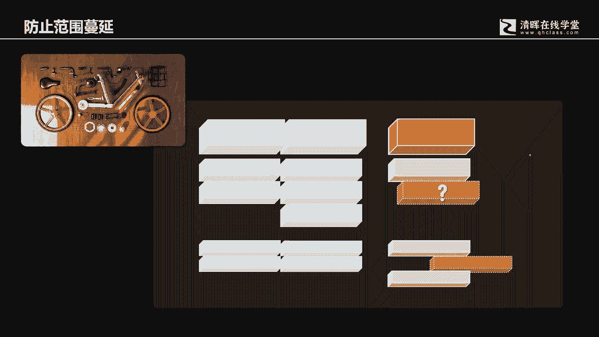

叫层级化的层次化的逻辑结构好。

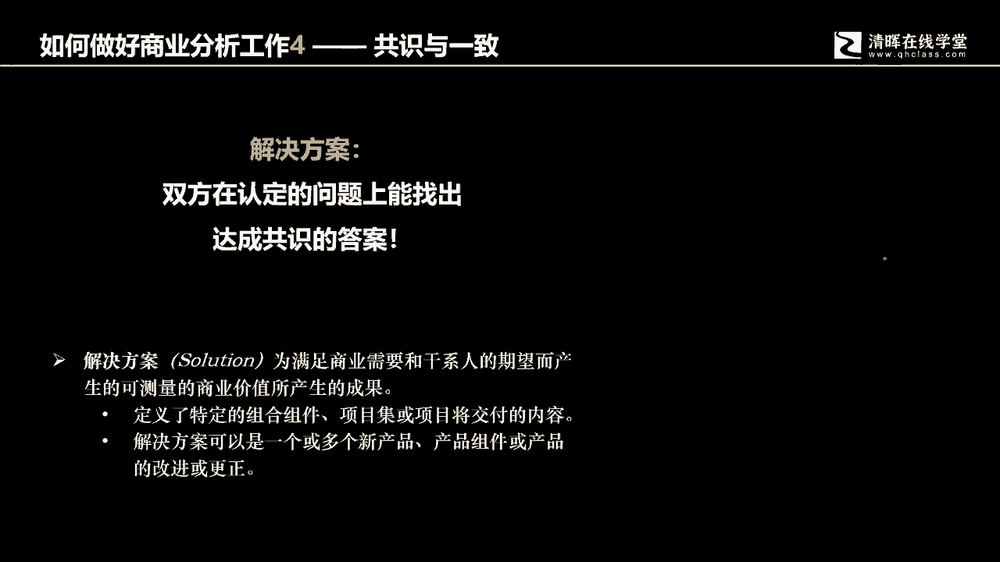

另外还有一个呢就是我们要在交付解，因为我们从问题开始有了对问题的分析，最终我们要交付一个解决方案，什么是解决方案，解决方案无非来说就是问题的答案，但是解决方案不是偏向于某一些，特定是特定人群。

特定干性人，他是一个共识的结果，它是一个共识的，这也就是说，交付的解决方案是既能够解决客户的问题，满足客户的需要，同时交付方，它也能够从交付的结果和过程中产生收益，如果这个共识共赢的结果没有了达到。

其实解决方案也无法最终被签署，所以商业，所以我们在管理的过程当中，需要有一个共识性思维，然后所有的解决方案它都是可测量的，你必须要有测量的方式以及测量的手段，包括知道要去测量哪些指标好。

无论交付怎样的解决方案，它最终是需要具有商业价值，当然也就代表着说，我们不是在满足所谓的技术性的验收标准啊，技术性的规格要求，而是要满足商业价值的需要好。

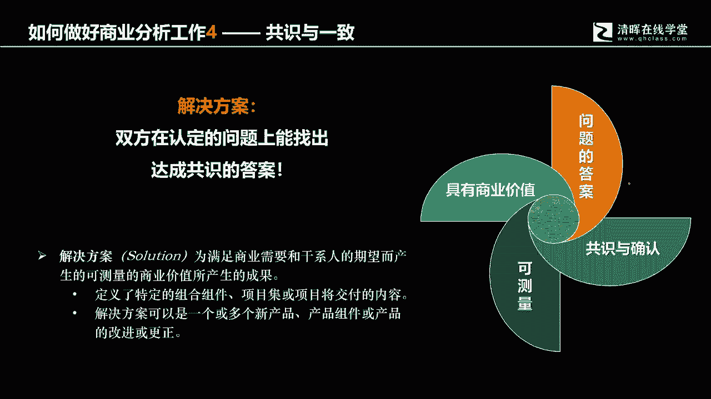

那么既然我们要满足价值，其实我们在商业分析的过程当中，在商业分析工作的过程当中，我们所有的工作其实都是价值导向的，我们通过引导客户的价值，协助客户验证并确认价值在逐步的交付。

价值交付了完了以后去评估价值的满足程度，其实是一个传递过程，其实是一个价值传递过程，客户在这个过程中，它的价值是逐步积累的，我们在这个过程中，收益是通过价值交付而产生的。

一切的工作并不是以满足验收标准为目标，而是以满足商业价值为导向好。

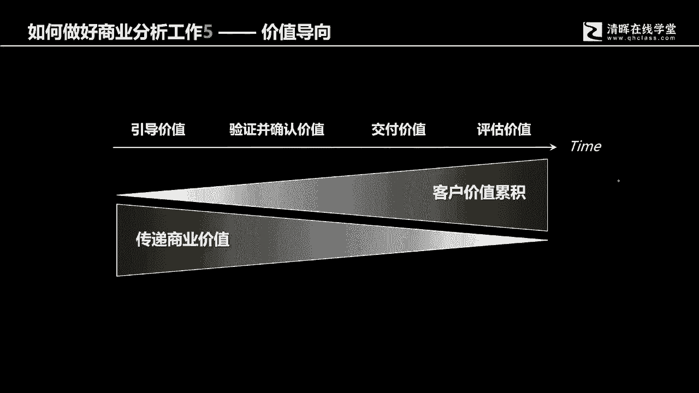

然后第六个方面呢，我想是说从商业分析师是要有全局观的，从项目层面，经营层面以及战略层面。

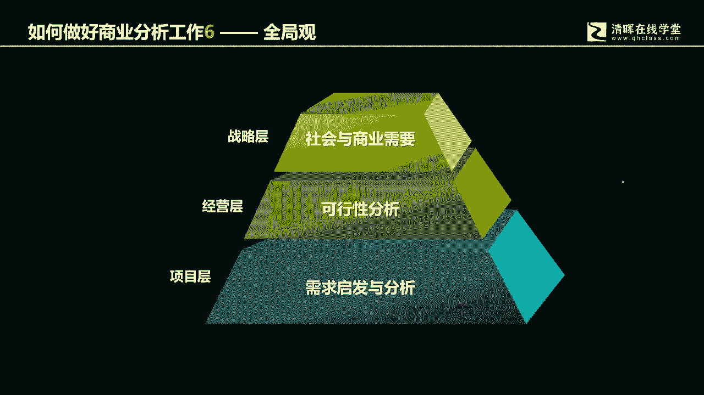

从运营组合与组织目标层面，他是要综合考虑，代表着我们商业分析师，他是既要能够低头拉车看细节，同时也能够抬头看路好，看到更宏观的啊，更更更广泛的目标好。

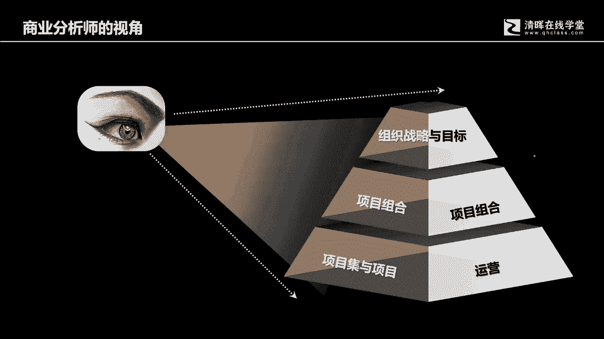

那么最后一个方面，作为商业分析师，这也是最重要的一个方面，因为我们一直在强调，其实刚才也说过，说作为商业分析师其实是一个桥梁，它起着连接开发团队和这个客户之间，说市场之间，那么他要具备的思维。

一个方面是概括性的概念思维。

另外一个方面就是，同时也要具备这个细节的具体思维，那我们在学习的过程中，会通过一系列的工具去整理，这里跟各位分享一下。

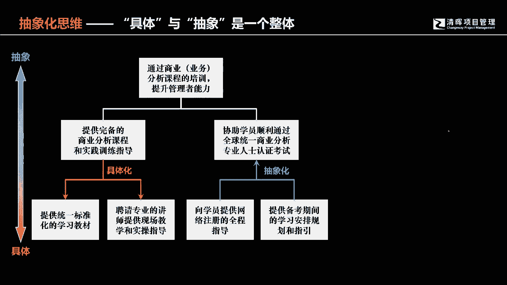

其实所谓的具体跟抽象是一个相对的整体，具体和抽象只是一个相对的整体，首先我们怎么获得那自上而下，在通过逻辑树状图这个工具来进行梳理的时候，是一个从抽象到具体的过程，如果通过逻辑树状图自下而上。

其实是一个逐级抽象的过程，我们在管理的时候，很多管理者是停留在高度抽象化的认知上，而缺乏细节，但有些一线的执行者是具有细节性思考，但是缺乏整体的抽象化的认识，这两者其实都不可取，作为商业分析师就要明白。

就是首先第一个是你只有单纯的抽象，是无法能够安排具体的活动，也就是我们如果只有抽象思维，就会变得很模糊了，很笼统，你无法开，你无法开展，比如说我们下一步要做什么，第二步要做什么，第一步要做什么。

第二步要做什么，那如果仅仅我们只知道细节，缺乏宏观的认识，其实是也无法来知道概括，无法知道整体，从而也无法能够跟市场跟客户来产生交流，只能指导一些局部的细节工作展开，所以作为商业分析师这个桥梁。

它不仅只是在做语言上的翻译，在思考上面他也应该具有从具体到抽象。

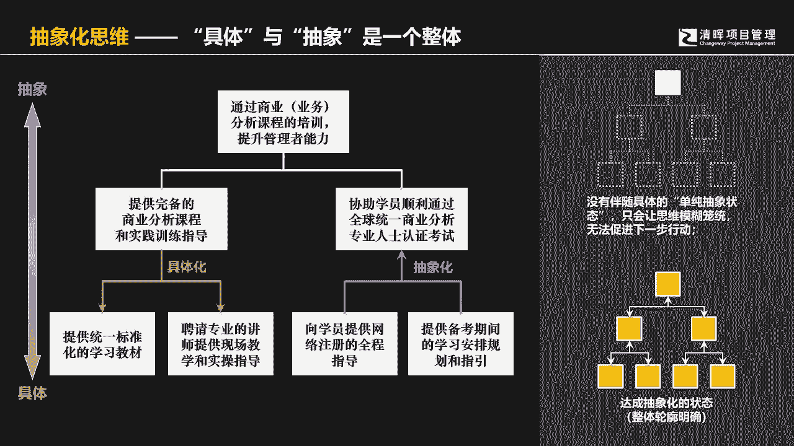

形成一个这个思考的逻辑桥梁，稍微总，稍微总结一下商业分析师的七个关键能力啊，在我整理上面，整本书里面都会强调，比如说这个问题，思维逻辑分解。

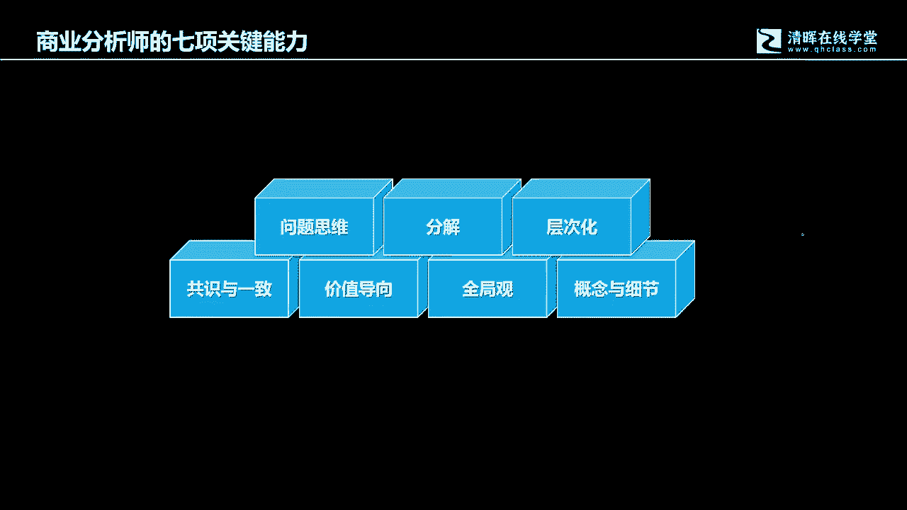

层级化管理和跟踪解决方案，形成共识与一致。

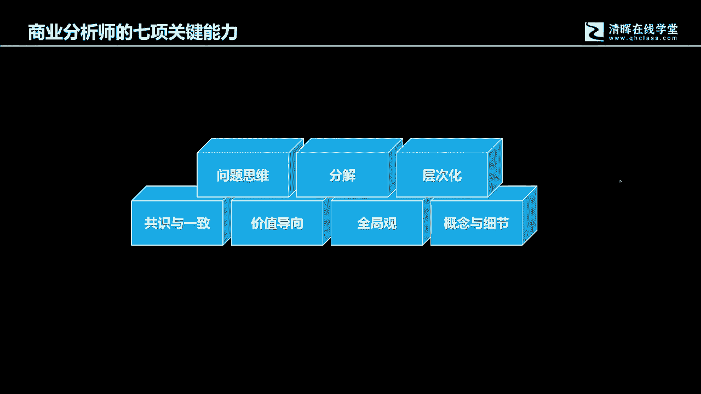

交付解决方案是要满足价值需要的，作为商业分析师需要具备全局观，如何去体现全局观，会通过概念与细节，抽象与具体这样的一些方式。

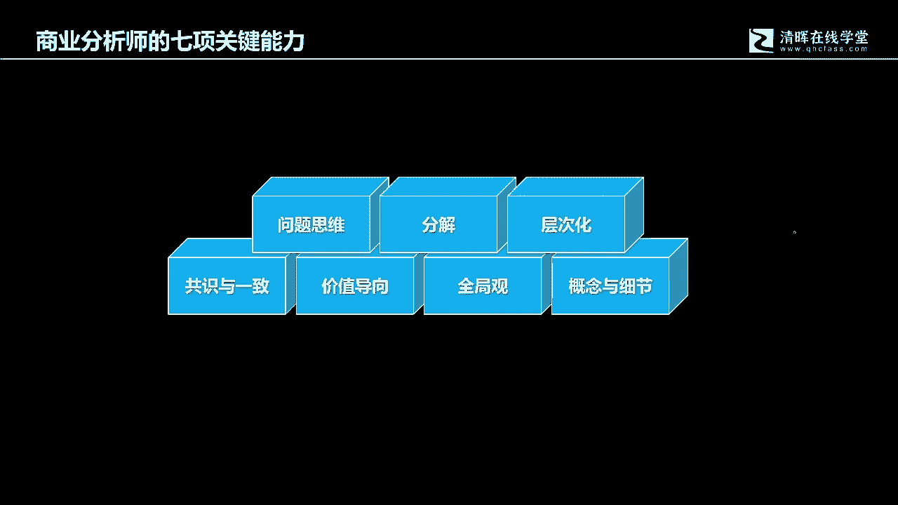

技术工具来得以体现的呃，最后做一个总结，其实在绝大部分的企业里面，没有特别的所谓的商业分析师，这样的一个职位，所以商业分析师不是一个所谓的title，它更像是能力啊，不管你叫什么，你可能就是项目经理。

你可能就叫产品经理，你可能就叫架构师，也许在你的title下面，你做的工作本身，其实实质上是在做商业分析工作，那什么是商业分析师呢，我们不管title是不是叫这个名字，也许你就叫项目经理。

但是你也可能在发现问题，推荐解决方案，推动解决方案的落地，并且不仅仅只是来交付一个，满足验收标准的解决方案，而是在实现最终价值，虽然你叫着商，叫着项目经理的名，但是实际上你是既做项目。

也在做商业分析的工作。

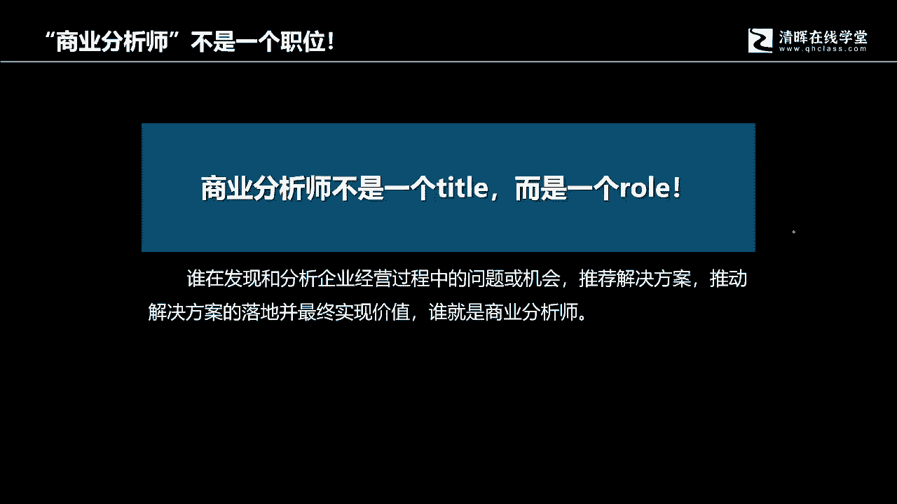

那么商业分析的最终目标是什么呢，终极目标是什么呢，如果用现代管理语言来说，其实就是持续用我们现在的这个书里面的话，来讲啊，支持持支持组织实现有效产出啊，谷与银，我们叫胜兵乃先胜而后求战。

我们所有的工作在真正开始，也就是我怎么开展工作之前都要有其思考，胜兵也就是你经常要打胜仗的人，不是随随便便踩着西瓜皮溜哪溜到哪儿算哪儿，都是有其规划的，胜兵乃是先求胜而后求战，也就是我们先做谋划再做啊。

这个实施那更直白的支持组织赚钱，这是商业分析师啊的价值所在，终极目的所在啊。

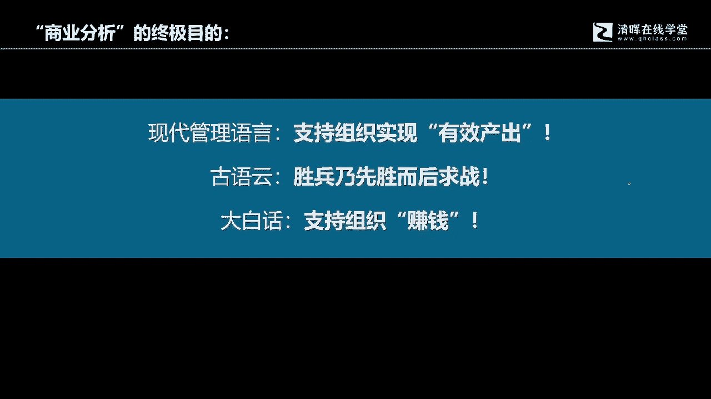

好我今天的分享呢就到此结束，欢迎各位能够参加PDA学习，在座各位，有这个问题吗，啊我没有留过多的时间去来跟各位去去去呃，分享问题我恰恰是两个小时的内容，恰恰是两个小时的内容啊。

希望各位有机会我们来参加PBA的学习，OK好，也许各位现在一时提不出很多问题，不过没关系，我们可以通过线下，也可以通过问卷调查来进行交流，感谢各位再次参与啊，再次感谢各位的参与。

我们希望能够在课堂上见面啊，我是秋辉的老师程涛，我们能够在商业分析的课程上见面啊，哪些项目对商业分析的能力要求比较高，所有项目，从逻辑上来讲，所有项目都是这样，你如果不先想清楚怎么干。

你凭什么会说服别人投资给你，或者说你怎么能够说服所有的干系人支持你呢，项目的价值和意义在哪里呢，价值和意义不是你就这样说，就就能够说服人的，它是有理论根据的，有理由根据的，你怎么得出这个结果呢。

就像我们考试的时候，原来做数学题的时候，你写个答案，老师顶多给你一分，写个过程，老师可能给你五分，知道吗，原因就在于你的过程其实代表着你的思考，如果过程加结果都是正确的，你肯定是得满分。

也就是说你是过程和结果都不能缺失，就像做数学题一样，OK感谢各位，我们今天到此为止，感谢各位的参与。

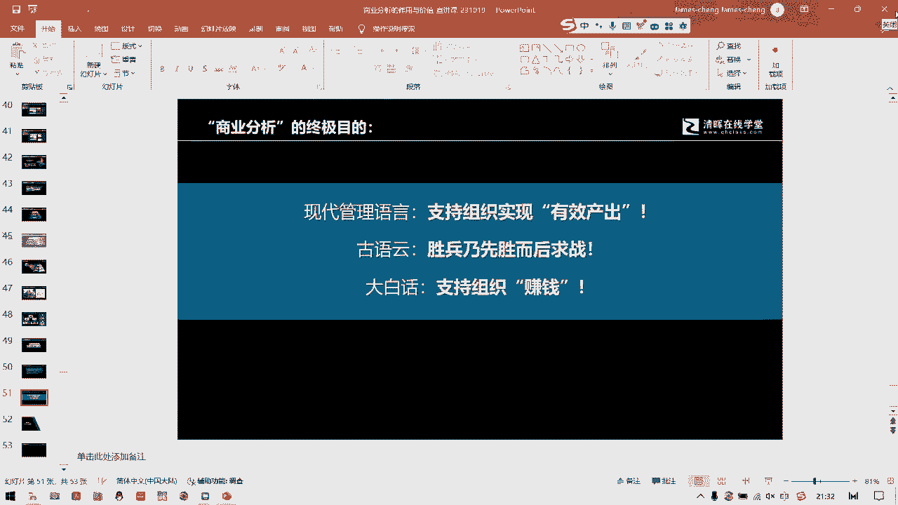