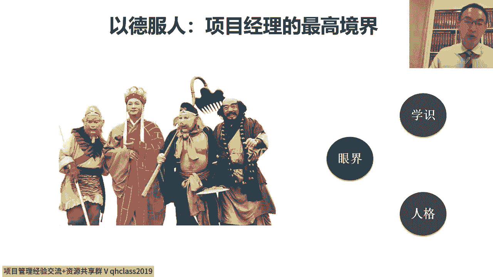
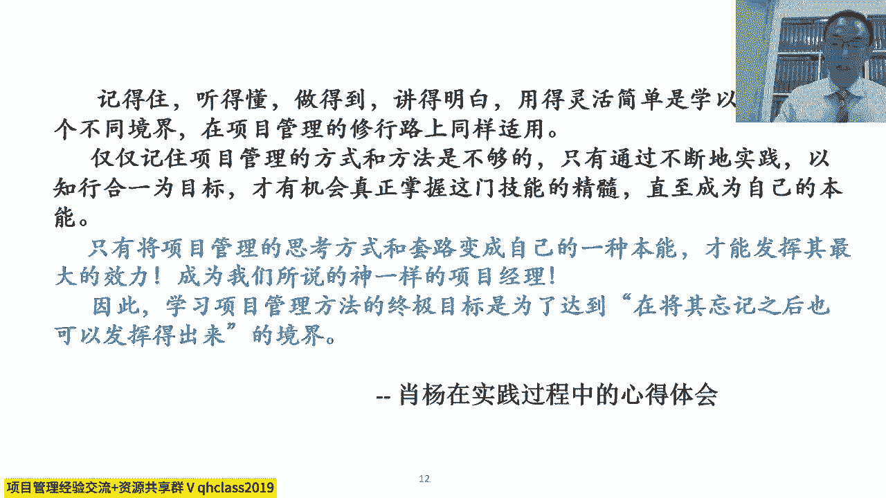
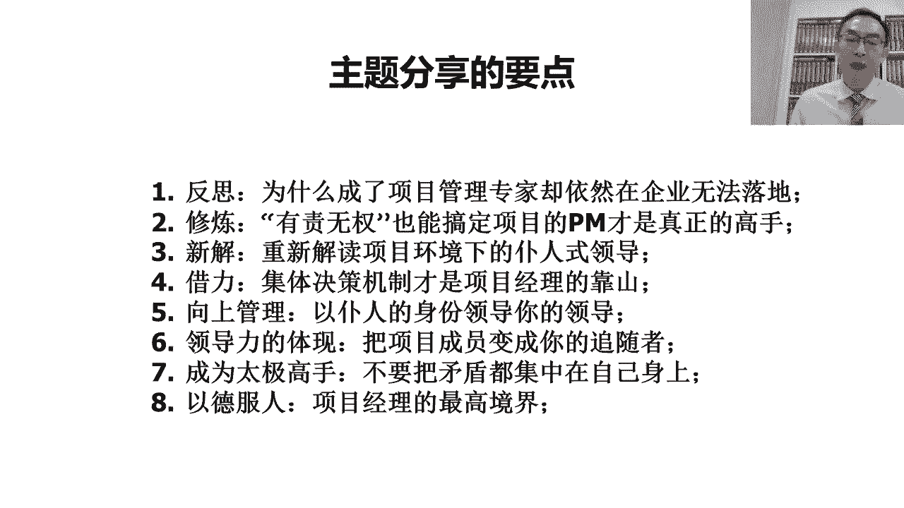
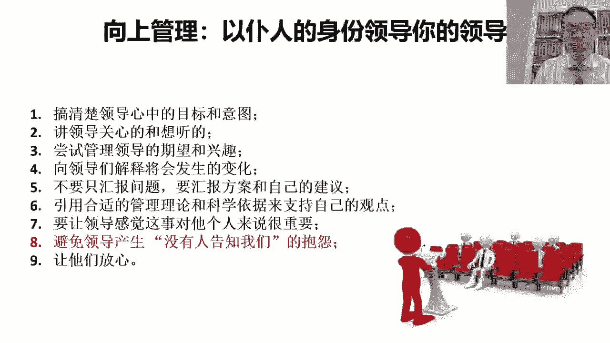
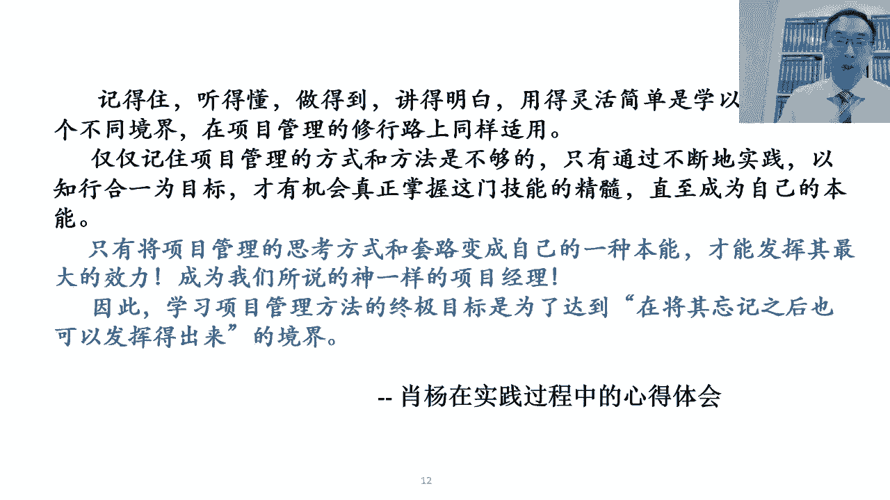
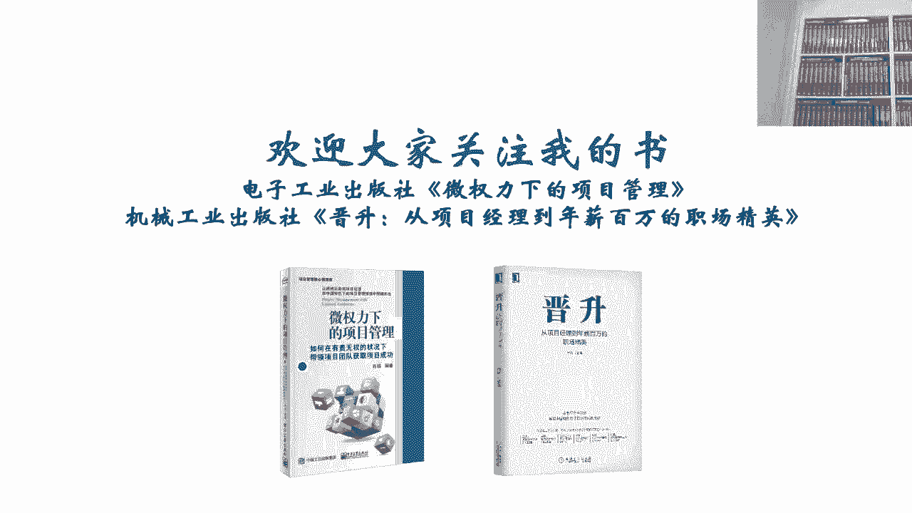

# 以德服人--项目经理的最高境界 - P1：1.以德服人--项目经理的最高境界 - 清晖Amy - BV1yb421E7GE

那为了达到这一点呢，项目经理要修炼自己内心的境界，就像之前的时候呢，我讲课的时候经常会举这个西游记的例子，西游记呢是典型的中国式的项目对吧，我们说取经本身就是一个很有挑战的，很独特的对吧，前无古人。

后无来者的项目，在这样的一个项目团队中对吧，我们说唐僧是我们的项目经理，唐僧很符合东方的项目经理的状态，所以这点呢其实一直是美国人不太理解的对吧，我们如果站在美国人的角度想，这项目经理得选最有能力的呀。

那得是最有能力的那孙悟空啊对吧，但是我们实际上会发现，孙悟空不是项目经理，唐僧才是项目经理，唐僧当项目经理，不是因为他有这个常常规意义上的能力对吧，既不能打妖怪，也不能腾云驾雾对吧，但是他有强大的内心。

能够做到以德服人是吧，目标很坚定，有大局观，替天下苍生思考，而且对待这几个徒弟对吧，这几个犯了大错的妖怪的徒弟对吧，没有任何的偏见，那更多的其实对吧，努力的去感化他们，通过取经的过程。

原先一群犯了大错的妖怪对吧，纷纷的成了佛，成了使者，完成了这种内心的历练对吧，完成了对他们内心的净化，这是一种非常高尚的品德，对我们说在这个取经的过程中，历经了998 11难。

克服了自己的内心的各种的这种缺点，然后去完成自己过程的修炼，而且还度化了别人，那其实这个呢他其实都是一种以德服人的，非常高的境界，这个过程中呢我们说呢他离不开对吧，我们说作为一个唐僧，最有道高僧。

离不开他的学识，学识是什么，就是我们学习ping报和项目管理知识体系，我们学了一大堆的东西对吧，那要学识系统化的，学习的目的是为了提升我们的眼界，然后是为了帮助我们去树立更正确的人格。

但是我们还要在我们实践的场景中对吧，去把我们所学到的东西真正的运用下去，在实践的过程中呢，去体会作为一个优秀的项目经理吧，如何能够去带领一个项目的团队，去克服重重的困难对吧，未知的挑战嗯。

相关方的冲突去实现最终有挑战性的目标，所以呢项目经理呢要有强大的内心，要有包容性对吧，然后要有感化别人，带动别人共同实现目标的这种觉悟啊，这才是我们说真正优秀的项目经理。

那其实我们的讲座呢，其实讲到这基本上就讲完了啊，要讲的这些东西呢，其实我们可以再稍微的回顾一下，我们会看到呢，其实如果想成为一个优秀的项目经理，那从我们的内心，从软技能上，我们也需要去做很多的锻炼。

我们不是仅仅的学会工具技术就够了，我们还要去学会内心上的这种强大，那在这个过程中呢，我们再去回顾一下啊，我们前面其实有提到的几个东西。

我们一起去看一下，我们若想成为一个优秀的项目经理，成为优秀的团队领导者对吧，然后呢我们首先要明白的是说，光有理论知识是不够的，我们要勇于去实践，在实践的过程中呢，我们要能够去接受有责无权的这种环境。

跟现状有责有权能搞定项目的，不是优秀的项目经理，有责无权还能够搞定，才是高手对吧，我们要接受这种现状，然后呢在这个过程中呢，我们要知道放低姿态，项目经理对吧，他是一种服务型的烹饪式的领导。

姿态要放低对吧，然后呢脸皮要变厚，然后我们要懂得借助集体决策的力量，帮助我们去在项目中建立秩序啊，去推动大家，因为大家愿意执行项目中的事情，不是因为怕项目经理，而是遵从了集体的决策，在这个过程中呢。

我们要懂得对吧，用用什么样的方式去跟领导沟通，要懂得做换位思考，要去想领导关心的事儿，然后再想自己关心的事儿，把领导关心的事，跟自己关心的事之间的共同的立诉求点找到，这样的话呢才有可能对吧。

获得领导的支持对吧，尽量的让领导活得轻松些，不要老给领导添麻烦，跟项目成员在一起呢，要懂得为项目成员创造福利，让项目成员觉得跟随自己，它有价值对吧，能人家自己也能有收益和好处啊，然后让人家能有成就感。

在我们的项目平台，让平凡的人能干出不平凡的事，在这个过程中呢对吧，我们不要把矛盾都集中在自己身上，我们要在不同的需求，不同的相关方之间建立平衡对吧，打造一种和谐的气氛，这个过程中呢我们要做以德服人。

要强大的内心，要大局观，要包容性，要帮助其他的人成长。

这些呢其实才是一个真正的优秀的项目经理呢。

他其实所需要去做到这个，其实也是我们每一个做走项目管理这条路的人，其实我们要修炼的过程啊，所以呢这个呢其实是我在这个过程中。

一些心得体会，那希望能把这些东西分享出来呢，其实是希望能够帮助更多的像我一样，在项目管理的道路上前行的同僚们，能够呢更正确的去对待，项目经理这样的一个角色啊，然后呢能够少走一些弯路。

早日的成为一个神一样的项目经理，那我今天的这个分享的就分享到这，那后边呢这个还有一些时间，然后帮助大家回答一些问题，那看一看啊，额我先看第一个问题啊，我们呢有嘉宾问，是说这个经营型的项目经理。

是不是可以理解成产品经理啊，呃它其实不不不完全一样，首先这个问题是一个很好的问题啊，这个经营型的项目经理呢，其实是从几年前开始呢，美国这边开始发起的一次变革，这个变革是要把一大群呢对吧。

之前非常强势的技术型项目经理，需要他们有一次成长，那在这个成长的过程中呢，当然我们知道这种成长呢，其实现在咱们国家也是需要的，因为我每天都会面临大量的企业，大量的企业的高层最发愁的一件事。

就是说我们很多的项目经理，都是技术型思维对吧，然后嗯不考虑项目的这个收益和价值，然后如果不考虑项目的收益跟价值，很有可能项目经理们努力干的事，这个干的结果之后，最后发现这事对公司没好处。

那这时候呢可能干的越多，赔的越多，那其实不管是在美国还是在中国，这都是目前企业中面临的一个问题，在这个问题的过程中呢，我们说为什么经营项目经理呢，他跟这个产品经理他不太一样。

产品经理呢他更多的其实呢是要去解决啊，如何去关心这个外部的客户的需求对吧，客户的痛点，然后呢去定义产品，但其实通常我们说这个规模化的企业里边，往往呢并不要求呢，产品经理具备整合资源交付的能力。

产品经理跟项目经理的分工呢，他应该是产品经理对吧，他更多的偏向于商业和市场，他呢要准确的去捕获这个，准确的去捕获呢外部的需求和痛点，然后去定义产品，项目经理呢要在最短的时间之内整合资源，去实现产品。

所以这是他俩的分工，就是项目经理负责整合资源实现产品，而产品经理呢负责捕获需求痛点去定义产品，那如果他俩能很好的配合在一起的时候，那这时候呢它就能构成一个很好的商业模式，那经营型的项目经理的概念呢。

它其实它的定位仍然是偏向于项目经理，那更多的其实是希望项目经理能更多的呢，想点产品经理的事，这样的话他跟产品经理配合起来更容易，而且呢帮助产品经理呢去提供各种信息跟素材。

这样的话呢能够帮助产品经理更好的去判断，这个项目的收益和价值对吧，因为很多时候产品经理呢，他更多的是从外部看到的这种收益跟价值，但其实他并不知道我们的能力，他也没办法去测算。

我们可能投入的这个成本有多少，到底我们到底有能力干什么活，或没有能力干什么活，他是不知道的，那项目经理呢，可能只对我们的能力有正确的判断，但是呢因为没学过财务，没有财务分析的意识。

然后呢对收益跟价值不敏感，所以这时候呢只知道我们的能力是什么，但是却没有办法根据我们的能力对吧，去预测未来的收益和价值，到到底跟我们的头匹配不匹配，所以呢我们的期望是什么呢，其实经营型的项目经理呢。

也要去想点产品经理的事对吧，我说优秀的产品经理呢，他最好也干过项目经理，所以一直以来呢，其实我们认为最好的一个方式呢是说对吧，优秀的研发人员或者专业人员，然后有机会走向管理，变成了优秀的项目经理。

能够整合资源交付，跨职能的整合资源交付，优秀的项目经理呢发展到一定阶段的，要多关心客户，多关心市场，然后呢甚至要多关心财务收益，关心呢公司认为的价值，这样的话呢，一部分的项目经理会成长为大项目经理。

由大项目经理呢可能会变成项目集群经理，然后呢由项目集群经理，他逐渐的变成了业务负责人，那这时候就越来越像产品经理和产品线经理了，然后这时候他逐渐的其实成为了一个企业家，对吧，那在这种情况下呢。

他其实完成了项目经理呢由技术到走向管理，由管理走向领导，由领导走向经营的这样的一个转变，这个其实也是在我那本这个晋升的这个书里面，其实描绘的这样的一个过程，所以呢其实这个他俩不完全一样。

但是他俩有关联关系啊，哦下面一个问题嗯，我们这个嘉宾问这个问题，非常可爱的一个问题啊，这个这个请问老师，项目经理都要放低姿态，那么做项目经理的意义和动力是什么呢，大家知道这个我们国家的文化。

这个讲究的是说呢坐的位置越高啊，姿态越低对吧，我们说谦逊，为什么我们的老祖宗总是去讲究我们要谦逊呢，因为骄兵必败对吧，很多时候我们大家要知道这个姿态放低啊，这时候更容易获得别人的认可和支持，趾高气昂。

只会招致别人的反感和抵触，那我们作为项目经理，我们其实很多时候需要去借助别人的力量对吧，我们说项目经理跟职能经理最大的区别是，职能经理是用自己的人，自己的资源干自己想干的事，项目经理的特点是说。

我用别人的人，别人的资源干我想干的事，他是借力的，如果我们想用别人的人，别人的资源干我们的事，等于咱得求人呐，求人的时候难道不应该把姿态放低一点吗，对吧，我们的目的是为了把事做成。

如果我们只要能把事做成，我们为什么不可以通过降低姿态，去获得别人的帮助呢，对吧，我们说如果不放低姿态，那你就要自己的力量非常强大才可以，但是其实在项目管理的这个领域里边，项目管理这个运转逻辑。

不是因为项目经理能力最强，拥有所有的资源，才让他去干项目经理，选拔项目经理的目的，是为了找到那个最能够去整合别人的资源，跟借助别人的力量，去促成这种大家团队成功的人来当项目经理。

那如果想当好这样的项目经理，当然就要把姿态放低了对吧，因为我们放低姿态，人家才愿意帮助你，然后才愿意去配合你对吧，大家一定要记住，骄兵必败，大家知道放低姿态并不可耻，我们会发现其实做的级别越高的人对吧。

在咱们国家，包括很多政府层面，我们说做的越高层的领导，你会发现他其实越随和越温和对吧，礼贤下士，然后我们说整天看起来趾高气昂的人很多，其实并不一定是高层的领导，他其实很多趾高气昂的人。

往往是层级很低的人，因为怕别人瞧不起自己，所以呢显得自己很强势，所以大家知道内心越强大的人，姿态越低的人，其实往往可能是实力更强的人，职位更高的人，越受人尊重的人，表面越强的人。

其实往往其实可能并不一定是真的强，只是因为心虚，看下面一个问题啊，呃项目经理在做项目调研的时候，怎么和相关方沟通获得支持啊，哎这个问题也挺好的，因为这个因为我也之前有很长的咨询的经验。

这个在做咨询项目的时候啊，包括那个不管是内部的项目，还是外部的咨询的时候，大家其实都要做很多调研，我一直都特别重视调研这件事，因为我一直认为呢，调研不是一个获取需求的过程，嗯很多的项目经理会有一个误区。

认为调研呢其实就是单向获取需求，把都记录下来，那我自己的习惯呢一直是借助调研的过程呢，去影响别人，就是传递我的观点，首先听别人的观点，然后去表达我的观点，然后在双方的观点过程中呢去达成共识。

那这样的话呢，其实我们就把一个调研的过程，变成了一个建立相关方共识的过程，就是调研的目的不仅仅是为了收集需求，而是为了跟相关方建立共同的目标和志向，这样的话呢在后续开展工作的过程中。

才能够去容易获得人家的支持对吧，但是为了去获得人家支持呢，就像我们其实刚才我们在PPT里讲的一样对吧，我们要去谈人家关心的事，我们要能够去准确的去捕获人家的痛点对吧，然后我们要去能思考人家的收益。

我们要替人家着想对吧，我们要想我们其实做一个项目，跟相关方在一起的目的，不是仅仅为了把我们的事做成，而是我们要把一个对既能对人家有好处，也能对我们有好处的事做成，当我们能去找到这样一个双赢的策略的时候。

那这时候我们才建立了，能形成同盟跟共识的基础，所以呢获得人家获得相关方支持的根本是在于，我们要找到跟不同相关方的对吧，双赢的策略，能找到双赢的策略的前提是，我们要知道人家的痛点，我们要知道人家的收益。

然后我们才有可能找到双赢的策略，再下面一个问题啊，我们有嘉宾呢问是说，如果项目管理委员会也没有办法达成共识，怎么办对吧，他是这样的，如果项目首先呢能否促成项目管理委员会，达成共识，是一种能力。

就是说的换句话说呢，如果项目管理委员会达不成共识，说明项目经理促成共识的能力还不够对吧，因为项目管理委员会能达成共识的原因，往往是因为项目经理抛出了一些选项，抛出了一些台阶对吧。

项目经理抛出的这些选项跟方案，恰好是所有的相关方，他发现对吧，大家退让一步，可能还能够形成平衡的这样的一种选项，所以项目经理往往是通过去抛一个，双赢或多赢的方案来帮助相关方达成共识的。

那如果相关方还没有达成共识的时候，可能说明项目经理的方案还不足够好，或者可能说明，项目经理在这个组织委员会开会之前的时候，没有线下跟每个相关方去做充分的沟通，并没有了解人家真正的意图和人家的担忧。

并没有把自己的方案跟人家提前去做沟通，没有让人家去充分的理解自己的方案，以及提出他的建议，所以呢这个如果乡大响大委员会上，能够达到充分的共识啊，项目经理需要在上会之前跟每一个相关方。

尽量争取一对一的单独的沟通对吧，先呢跟这个相关方呢去救自己的这个方案呢，先达成初步的共识，当呢当我们在上位之前，就所有的项目经理的这个方案，都达成了差不多初步共识的时候呢，其实我们才有可能对吧。

在抛到会上的时候获得大家的支持，所以呢这个上会之前的一对一线下沟通很重要，线下的功夫做的越多对吧，上会达成共识的可能性才越大，下面一个问题呢是说这个嗯，如何消除领导之前对我们的隔阂和不信任啊。

那这件事呢，如果想消除领导之间对我们的隔阂和不信任呢，就是多汇报对吧，早请示，晚汇报，在领导面前态度比较好，执行力好，就是领导不论派什么，首先表现出坚决执行的态度对吧，然后然后呢第二呢多汇报自己的状态。

多请求领导的帮助对吧，然后这样的话才有可能的，跟领导去建立信任对吧，这跟家人是一样的，就换句话说呢，就即使是家里人，如果老不在一起，老不沟通，大家也会产生隔阂和不信任啊，跟领导也是一样。

要想建立格和信任的话，那不就得多汇报，多沟通嘛，对领导就得多主动汇报，主动沟通嘛对吧，老不去汇报，老不沟通，那自然就有隔阂和不信任了，就多沟通就是了嘛，对，还有一个问题呢。

就是怎么去解决相互推诿的问题啊，都怕承担责任，很多的时候呢这个相互推委承担责任的，所以项目呢他推行集体决策的概念，就是把那个大家都不愿意单独决策的事，拿到会上变成集体决策，那这样的话责任就变成集体的了。

那错了变成大伙的，那这样的话大家其实就都没责任了，所以所以很多的时候呢，但凡每个人不愿意单独拍板的事，我们就把它变成集体拍板的事，这样的话才能不推诿，对吧，一起错一起错就不叫错，叫对好啊。

因为这个时间的关系呢，我今天的问题就先回答到这，可能还有一些嘉宾的问题呢没有来得及回答，那这个表示抱歉，但是因为咱们的时间有限，所以呢这个嗯我们争取下次下次讲座的时候呢。

我们优先回答这次可能还没有回答完的问题，那我们今天的这个讲座呢，我的部分呢就讲到这，然后呢也已经挺晚的了，那希望呢这个大家通过这次讲座能有所收获，然后呢，希望能对大家日常工作中能起到一些帮助啊。

谢谢大家的倾听，好谢谢，好的非常感谢我们肖老师的精彩分享，那么今天晚上呢有一些学员因为加班的原因，可能没有看到直播，那么我们的直播间原链接呢，5分钟之后就可以收看回放，我们下一次的课程时间呢是两周之后。

