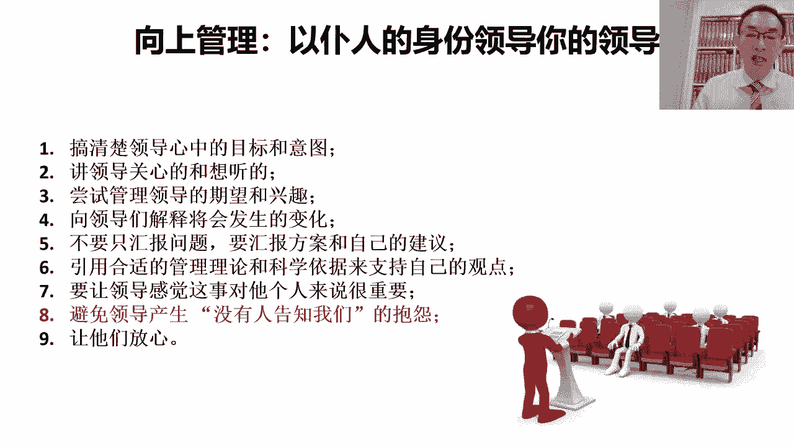
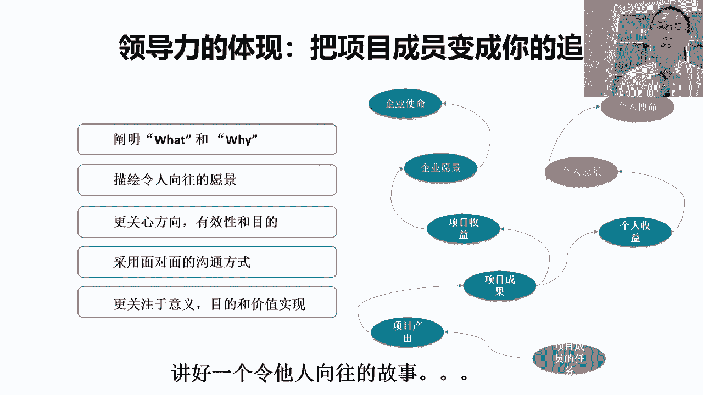

# 以德服人--项目经理的最高境界 - P7：7.领导力的体现把项目成员变成你的追随者; - 清晖Amy - BV1yb421E7GE

难一点。

不要让给领导添麻烦，再有呢我们说对项目成员对吧，这个作为项目经理呢，当我们对项目成员的时候吧，我们得能让项目成员发自内心的去认同我们，大家想这个项目成员也是人对吧。

我们说这项目成员跟着项目经理在项目中干活，他得有好处对吧，它它的好处呢跟公司的好处，这是两件事，项目做成了公司有好处，但关键项目经理，项目经理有可能有好处，也有可能没好处，就算项目经理呢没好处也干对吧。

我们说我们这个企业责任感对吧，这个无私的精神，但关键项目成员总得图点什么吧，那项目成员他图的东西呢对吧，我们说要么有实实在在的好处对吧，可能有项目奖金，要不然呢在过程中他能学点东西，能提升能力对吧。

有利于日后的职业发展，然后要不然呢是说在过程中呢，虽然也没学什么特别多多的东西，可能也没有实实在在的这个这个财务上的奖励，但是呢跟大家一块干活，很高兴对吧，换句话说呢满足了精神层面的需求啊，这也可以。

所以呢作为一个优秀的项目经理呢，你总得给大家创造点，在项目中激情工作的理由对吧，有的是寻求的是心理的愉悦，有的寻求的是物质上的财富对吧，有的寻求的是能力上的成长，有的可能是寻求的是说被自己领导。

这种这种这种认可的对吧，这种认可的机会，所以呢不同的项目成员吧，他可能在项目中，其实他的这个利益诉求点还不一样，那作为项目经理来说呢，他要去了解每个项目成员，我们要去思考用什么样的方式对吧。

能让这些项目成员呢在项目中干的很有激情，而且呢他觉得在项目中没有浪费时间对吧，然后这样的话，他才有可能真正的去发挥出自己最大的力量，又返回到呢之前其实提过一句话，我说任何一个优秀的管理者或领导者。

那他所需要做到的是说呢，能让平凡的人，在自己的项目上做出不平凡的事对吧，所以优秀的项目经理的目标呢，一定是让平庸的项目成员，因为在自己的项目舞台上，能干出一个不平凡的事，而且功劳算人家自己的。

所以呢项目经理呢，他得善于给每个不同的项目成员他画饼对吧，我们希望一个项目成员努力工作，我们得跟人家谈心对吧，你要给人家讲为什么要来我的项目上工作对吧，来我的项目上工作，你有什么好处对吧。

你是个人能力成长了，你还是说奖金增加了，还是你的领导会因此而认可你的对吧，或者还是说在过程中呢，你一来我们这项目吧过得很开心，发现跟我们大家在一块对吧，这个不是吃饭，就是娱乐，要不大家一块聊天也很开心。

或者大家一块工作，一群志同道合的人在一起干的很有激情对吧，总之要给人家描绘出一个人家所希望的场景，而且在我们开展项目工作的过程中呢对吧，我们要不断的去为每个项目成员去创造，让他有成就感。

让他开心的这样的一个场景和状态，我们怕的是什么呢，项目成员在项目中对吧，第一本来就没图什么对吧，来了也没什么好处，结果呢还老挨训，好不容易干了点活呢，功劳还全都让项目经理自个儿占走了对吧。

然后回去之后呢，其实这个自己的团队领导也不愿意对吧，为什么呢，因为给项目中干活多了，结果自己工作直接领导派的活好多没干，那这时候直接领导肯定得想办法得治自己，那在这个过程中。

我们会发现那项目成员他就不爱干了呀，这在项目中到底图什么呢对吧，辛苦受累还不落好，所以呢对于项目经理来说呢，如果我们希望在项目成员做得好，能够让项目成员干的很有激情，我们就要做到刚才我们所说的那些东西。

关心人家的个人，关心人家的诉求对吧，最好能搞定人家的领导，让人家的领导呢支持他在我们项目中工作，然后在我们项目中工作呢，这项目成员自己还得有好处对吧，不能说大家都是为企业无私做奉献了。

大家都对企业无私做奉献，这个事呢他说着容易对吧，那我们的文化咱是中庸的文化对吧，大家都挺务实的，务实的背后呢，我们最希望干的是一个，对企业跟个人都有好处的事对吧，那谁也不能长期广干这个对企业。

只有对企业有好处，对个人没有好处的事，这样的话长期干谁也受不了，尤其很多基层的员工对吧，那又不是公司的领导，犯不着替企业去操那个企业领导操的心对吧，咱就干点对自个儿有好处的事，所以呢项目经理呢。

就得把对人家个人有好处的事给你讲清楚，这样的话有好处人家就来了对吧，没好处人家就不来，所以呢项目经理呢一定要善于给每个人，讲好一个他向往的故事，这样的话呢人家才有可能呢对吧，真正的来到我们项目中对吧。

发自内心的想去做点事情的目的，其实也是为了对人家自己对吧，对自己也有一个交代，所以呢我们要关心项目成员，替人家想在项目中的好处对吧，减少人家在项目中开展工作的阻碍，特别是来自于人家本来职能领导的。

这样的话才是一个好的项目经理。

